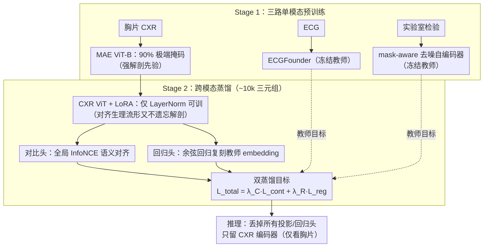

# PaCX-MAE: Physiology-Augmented Chest X-Ray Masked Autoencoder

**会议**: ICML 2026  
**arXiv**: [2606.01537](https://arxiv.org/abs/2606.01537)  
**代码**: https://github.com/Lyce24/PACX-MAE (有)  
**领域**: 医学图像 / 自监督表征 / 跨模态蒸馏  
**关键词**: 胸片、MAE、生理信号蒸馏、ECG、跨模态对齐

## 一句话总结
PaCX-MAE 在 MAE 预训练的胸片 ViT 之上，用 LoRA 微调把 ECG 和实验室检验两类生理信号编码器作为冻结教师，通过 InfoNCE 对比 + 余弦回归的双重蒸馏，把"看不见的生理上下文"注入纯图像编码器，推理时只需胸片即可在 9 个下游基准上整体超越同架构 MAE 基线，对生理依赖性任务尤为明显（MedMod +2.7 AUROC、VinDr +6.5 F1）。

## 研究背景与动机

**领域现状**：医学影像自监督表征普遍走两条路——纯对比（MoCo/DINO 系）或纯重建（MAE 系）。CheXpert/MIMIC 上的 MAE 已成为胸片 (CXR) 表征的强基线，因为重建强迫模型记住细粒度解剖结构而不是只学全局不变性。多模态方法虽能融合 ECG、化验、心电波形等生理信号刻画患者动态状态，但都假设推理时所有模态齐备。

**现有痛点**：临床现实是急诊场景下胸片往往是**唯一能立刻拿到的模态**——ECG 没接、化验没出。结果是：多模态模型因缺模态部署不了，单模态模型又看不到胸片表象背后的系统性生理上下文（如肺血管再分布对应液体超载、心影增大对应心衰）。这些生理状态以"隐式指纹"形式存在于解剖影像中，但标准视觉预训练根本不被引导去关注。

**核心矛盾**：胸片本身就编码了大量生理信息，但 (i) 标注稀缺导致直接监督学不到，(ii) 多模态对齐又被"推理需配对数据"的部署约束反噬。理想方案应当只在预训练用配对，推理只看胸片。

**本文目标**：拆成两个子问题——(a) 如何把 ECG/化验里的稠密生理结构"塞进"视觉编码器；(b) 如何在塞入的过程中不破坏 MAE 已经学到的解剖细节。

**切入角度**：作者借鉴 privileged information / 跨模态知识蒸馏（Lopez-Paz、Tiu/Boecking 的报告蒸馏、Dou 的缺失 MRI 序列蒸馏），把生理模态当 privileged 信号，但教师不是文本/另一种影像，而是 ECG + 实验室检验两路稠密生理编码。

**核心 idea**：两阶段课程——先各自单模态预训练拿到强教师，再用 LoRA 在冻结的视觉骨干上做"对比 + 回归"双目标蒸馏，把生理流形对齐进视觉流形，推理时丢掉所有头只留 CXR 编码器。

## 方法详解

### 整体框架
整篇要解决的事是：让一个推理时只看胸片的视觉编码器，也能感知到 ECG、化验这些"看不见的生理上下文"。做法是两阶段课程。Stage 1 各自独立预训练三路单模态编码器——CXR 用 MAE（强解剖先验），ECG 用 ECGFounder（1000 万心电预训练 transformer），实验室检验用一个 mask-aware 去噪自编码器（同时建模数值和结构化缺失）。Stage 2 在 Symile-MIMIC 的约 10k 份 CXR-ECG-Lab 三元组上做跨模态蒸馏：冻结 ECG/Lab 编码器当教师，给 CXR ViT 挂 LoRA，让它通过对比头和回归头去匹配教师的 embedding。下游推理时把所有投影/回归头全部丢掉，只留视觉骨干。

### 关键设计

**1. MAE 强解剖先验 + 90% 极端掩码率：先把全局解剖看懂，才谈得上读生理**

想从胸片读出生理状态，前提是模型先得把心影、纵隔、横膈这些全局解剖结构看懂，否则后面回归物理量无从谈起。作者在 CheXpert 上用 ViT-B/MAE，并把掩码率拉到 $0.90$（远高于自然图像 MAE 常用的 $0.75$）。这种极端稀疏迫使模型从极少几个可见 patch 去推断整体解剖语义，而不是靠局部纹理走 shortcut。选 MAE 而非对比学习也是有意为之：胸片里关键的低对比度强度线索（如积液密度）会被对比学习依赖的数据增强洗掉，而医学影像里大量同病人样本又会造成 false-negative 采样、引发语义塌缩；MAE 的重建目标天然保留细粒度强度信息，正好为后续的生理量回归打底。

**2. LoRA + 仅 LayerNorm 可训：跨模态对齐时几乎不动主干，避免灾难性遗忘**

Stage 1 学到的稠密解剖先验非常宝贵——分割任务上的像素级保真度完全靠它撑着。但 Stage 2 只有约 10k 份配对样本，如果全参微调，主干很容易被这点数据带偏、把解剖知识遗忘掉。作者的对策是几乎冻死视觉骨干：只解冻所有 LayerNorm 让特征分布做轻微迁移，再在 attention 的 `qkv` 和 FFN 的 `fc` 模块上注入 LoRA 低秩矩阵，可训练参数因此压到主干的 <1%，主要落在 LoRA 加两个轻量投影/回归头上。这样视觉流形保持稳定，模型只去学"桥接到生理流形"那条很窄的路径，也直接解释了为什么 PaCX 在 CXL-Seg / COVID-QU-Ex 上能和 MAE 严格持平（IoU 0.996 / 0.942 完全相同）——解剖能力一点没丢。

**3. 对比 + 回归双蒸馏目标：一个管全局语义对齐，一个管稠密特征复刻**

总损失是两项加权：

$$\mathcal{L}_{total}=\lambda_C \mathcal{L}_{contrastive}+\lambda_R \mathcal{L}_{regression}$$

对比项 $\mathcal{L}_C$ 把 CXR/ECG/Lab 三方投影到共享空间，用可学习温度的对称 InfoNCE 对齐，并跨所有分布式 GPU **全局收集负样本**以最大化负对多样性、规避 batch 内偏置，再配 $\epsilon=0.02$ 的 label smoothing 压住医疗噪声标签带来的过拟合。回归项 $\mathcal{L}_R$ 则用模态专属回归头直接预测 ECG/Lab 教师**未经投影**的原始 embedding，目标是 $1-\cos(\hat{y},y)$。两项缺一不可的原因在于：纯对比学习容易学到"够区分但不够细"的 shortcut——刚好能把这个病人和别人分开就停了；回归头则强制视觉编码器去复刻教师 embedding 的稠密结构，把生理信号真正内化进 token 表征。消融恰好印证这点——单用 $\mathcal{L}_{reg}$ 会全面崩盘（MedMod F1 从 0.253 掉到 0.131，陷入平凡解），单用 $\mathcal{L}_{cont}$ 已接近全模型但 VinDr F1 还差约 1.5 个点，两者组合才最稳，说明它们互补而非冗余。

### 损失函数 / 训练策略
Stage 1 三路模态各自独立训练：MAE 用 CheXpert 全量，ECG 直接复用 ECGFounder 预训练权重，Lab 在 MIMIC 化验上训 mask-aware DAE。Stage 2 在 Symile-MIMIC 上联合优化上式，视觉骨干主体冻结、只放开 LN + LoRA + 两个头，教师编码器全程冻结以防止退化共适应（degenerate co-adaptation），从而保证"知识被转移"而非"被联合重学"。下游评测一律用 linear probing（冻结骨干、只训线性头）。

## 实验关键数据

### 主实验（9 个基准上的 linear probing）

| 数据集 | 指标 | ImageNet | MAE | PaCX | Δ |
|--------|------|----------|------|------|-----|
| TB | AUROC / F1 | 0.887 / 0.818 | 0.899 / 0.814 | 0.910 / 0.846 | +1.1 / +3.2 |
| CheXchoNet | AUROC / F1 | 0.728 / 0.147 | 0.788 / 0.215 | 0.803 / 0.266 | +1.5 / +5.1 |
| VinDr-CXR | AUROC / F1 | 0.751 / 0.097 | 0.847 / 0.191 | 0.871 / 0.256 | +2.4 / +6.5 |
| NIH-14 | AUROC / F1 | 0.721 / 0.048 | 0.772 / 0.113 | 0.783 / 0.115 | +1.1 / +0.2 |
| MedMod | AUROC / F1 | 0.612 / 0.091 | 0.695 / 0.231 | 0.722 / 0.253 | +2.7 / +2.2 |
| ChestX6 | AUROC / F1 | 0.983 / 0.876 | 0.988 / 0.905 | 0.989 / 0.906 | +0.1 / +0.1 |
| CXL-Seg | IoU / Dice | 0.984 / 0.992 | 0.996 / 0.998 | 0.996 / 0.998 | 0 / 0 |
| COVID-QU-Ex | IoU / Dice | 0.894 / 0.943 | 0.942 / 0.970 | 0.942 / 0.970 | 0 / 0 |
| QaTa-COV19 | IoU / Dice | 0.622 / 0.766 | 0.726 / 0.841 | 0.715 / 0.833 | -1.1 / -0.8 |

### 消融实验（生理依赖三个基准）

| 配置 | CheXchoNet AUC/F1 | MedMod AUC/F1 | VinDr AUC/F1 | 说明 |
|------|-------------------|---------------|--------------|------|
| 仅 ECG 教师 | 0.801 / 0.296 | 0.717 / 0.243 | 0.871 / 0.233 | 缺 Lab，VinDr F1 掉 2.3 |
| 仅 Lab 教师 | 0.795 / 0.275 | 0.721 / 0.245 | 0.875 / 0.248 | 缺 ECG，CheXchoNet F1 掉 |
| 仅 $\mathcal{L}_{cont}$ | 0.799 / 0.273 | 0.722 / 0.258 | 0.866 / 0.241 | 缺回归，VinDr F1 -1.5 |
| 仅 $\mathcal{L}_{reg}$ | 0.789 / 0.227 | 0.673 / 0.131 | 0.843 / 0.130 | 缺对比，全面崩 |
| Full PaCX | 0.803 / 0.266 | 0.722 / 0.253 | 0.871 / 0.256 | 最稳 |

### 关键发现
- 在生理依赖任务（VinDr、CheXchoNet、MedMod）上 PaCX 全面赢，分割任务上与 MAE 持平甚至小输（QaTa-COV19 -1.1 IoU），说明 LoRA + 冻结主干策略**确实成功避免了解剖知识的遗忘**，但代价是某些纯纹理性的分割任务无法借助生理先验提升。
- **极低数据制度下增益最大**：1% 训练数据时 CheXchoNet AUROC +8.2、MedMod 和 VinDr 都 ~+5；10% 时仍有 +1.7~+3.8。生理先验起到了强正则化作用。
- **零样本对齐**：与 ECG/Lab 教师 embedding 的余弦相似度从 MAE 的 0.204/0.239 提升到 0.229/0.252，R@5 也更高，说明蒸馏目标真的把视觉表征"拉到"生理流形附近。
- **注意力 rollout** 显示 PaCX 把注意力从锁骨等骨结构转移到心影/纵隔等软组织——这是定性证据，说明模型学会"看 ECG 该看的地方"。
- 损失消融最反直觉：仅回归会**全面崩盘**（MedMod F1 0.131），说明纯回归会让模型陷入平凡解；必须靠对比损失提供判别压力。

## 亮点与洞察
- **"phantom modality"框架很巧**：把不可见的生理状态当作 privileged information 蒸馏进影像编码器，推理时丢掉教师只留学生。这个思路可以直接迁移到任何"训练时有多模态、推理时只有一模态"的医疗场景（如蒸馏病理报告进 X 光、蒸馏 PET 进 MRI、蒸馏波形进影像）。
- **MAE × LoRA × 双目标蒸馏的组合拳**：MAE 提供强解剖先验，LoRA 保证不遗忘，对比+回归保证既学全局又学稠密；三者缺一不可。这套配方对"小配对数据上的跨模态对齐"是个非常完整的工程参考。
- **全局负样本 + label smoothing 处理医疗噪声**的小细节实用——医学标签噪声大、batch size 受限于配对数据，跨 GPU 全局收集负样本是性价比很高的工程 trick。
- **回归头预测"未投影"的教师 embedding** 而不是投影后的，是为了保留教师原始流形结构信息——这个细节常被忽略但很重要。

## 局限与展望
- **单中心数据**：只用 MIMIC-IV 一家医院的配对数据，跨中心泛化能力未验证；表型多样性受限。
- **全局对齐丢掉了区域级对应**：现在是图像整图 vs 整段 ECG/化验向量的对齐，没建模"ST 段抬高 ↔ 心脏特定区域"这种 region-level 的细粒度映射。作者明确提出未来要做 token-level 蒸馏。
- **配对数据量小**（~10k 三元组）：双阶段课程和 LoRA 一定程度上缓解了这个问题，但天花板可能就在这里——很难再扩到 millions 量级。
- **生理模态有限**：只考虑 ECG + Lab，没引入更难拿但更丰富的 PPG、呼吸波形、超声等。
- **QaTa-COV19 上小幅退步**未被作者深入分析；可能暗示当生理先验和病理模式不匹配时，蒸馏反而有副作用。
- 评测全部是 linear probing，未做端到端 fine-tuning 的对比——表征到底有多少是"线性可分"vs"非线性可分"还不清楚。

## 相关工作与启发
- **vs 标准 CXR MAE**（Xiao 2023 / Zhou 2023 / Huang 2023）: 他们只做单模态重建；本文在 MAE 之上叠了一层生理蒸馏，在不损解剖能力的前提下吃到生理依赖任务的红利。
- **vs CLIP-style 多模态对齐**（Tiu/Boecking 的 BioViL 系列）: 他们对齐影像与报告文本（语义级），且推理仍是单模态；本文对齐的是稠密生理数值流形（更连续、更结构化），对齐目标更难但也更"物理"。
- **vs Cross-modal Privileged Distillation**（Lopez-Paz 2016 / Gupta 2015 的经典 paradigm）: 思想一脉相承——训练时用多模态、推理时单模态；本文在医疗影像 + ECG/Lab 上的具体实例化（MAE init + LoRA + 双目标）是工程贡献。
- **vs ECGFounder**（Li 2025）: 直接复用 ECG 大模型作为冻结教师，是典型的"基础模型即教师"的用法，路径很值得借鉴——把每个模态的强 foundation model 当现成的标签源去蒸馏其它模态。

## 评分
- 新颖性: ⭐⭐⭐⭐ 框架本身（privileged distillation）不新，但把 MAE + LoRA + 双目标蒸馏在 CXR + ECG + Lab 三元组上系统化落地、并用注意力可视化和零样本对齐证明"生理信号真被学到"是扎实的工程贡献。
- 实验充分度: ⭐⭐⭐⭐ 9 个基准、低数据 ablation、模态/损失双 ablation、零样本检索、注意力可视化——评测维度齐全；唯一弱点是单中心 + 仅 linear probing。
- 写作质量: ⭐⭐⭐⭐ 动机讲得清楚，方法图配合两阶段课程叙事流畅；公式偏少但每个设计的"为什么"都到位。
- 价值: ⭐⭐⭐⭐ 对医疗 AI 部署痛点（推理时缺模态）给出了可复用的实现配方；代码开源，配对数据用公开 Symile-MIMIC，复现门槛低。

<!-- RELATED:START -->

## 相关论文

- [\[NeurIPS 2025\] Variational Autoencoder with Normalizing Flow for X-ray Spectral Fitting](../../NeurIPS2025/medical_imaging/variational_autoencoder_with_normalizing_flow_for_x-ray_spectral_fitting.md)
- [\[AAAI 2026\] A Disease-Aware Dual-Stage Framework for Chest X-ray Report Generation](../../AAAI2026/medical_imaging/a_disease-aware_dual-stage_framework_for_chest_x-ray_report_.md)
- [\[AAAI 2026\] PriorRG: Prior-Guided Contrastive Pre-training and Coarse-to-Fine Decoding for Chest X-ray Report Generation](../../AAAI2026/medical_imaging/priorrg_prior-guided_contrastive_pre-training_and_coarse-to-fine_decoding_for_ch.md)
- [\[NeurIPS 2025\] RadZero: Similarity-Based Cross-Attention for Explainable Vision-Language Alignment in Chest X-ray](../../NeurIPS2025/medical_imaging/radzero_similarity-based_cross-attention_for_explainable_vision-language_alignme.md)
- [\[ICCV 2025\] GEMeX: A Large-Scale, Groundable, and Explainable Medical VQA Benchmark for Chest X-ray Diagnosis](../../ICCV2025/medical_imaging/gemex_a_large-scale_groundable_and_explainable_medical_vqa_benchmark_for_chest_x.md)

<!-- RELATED:END -->
