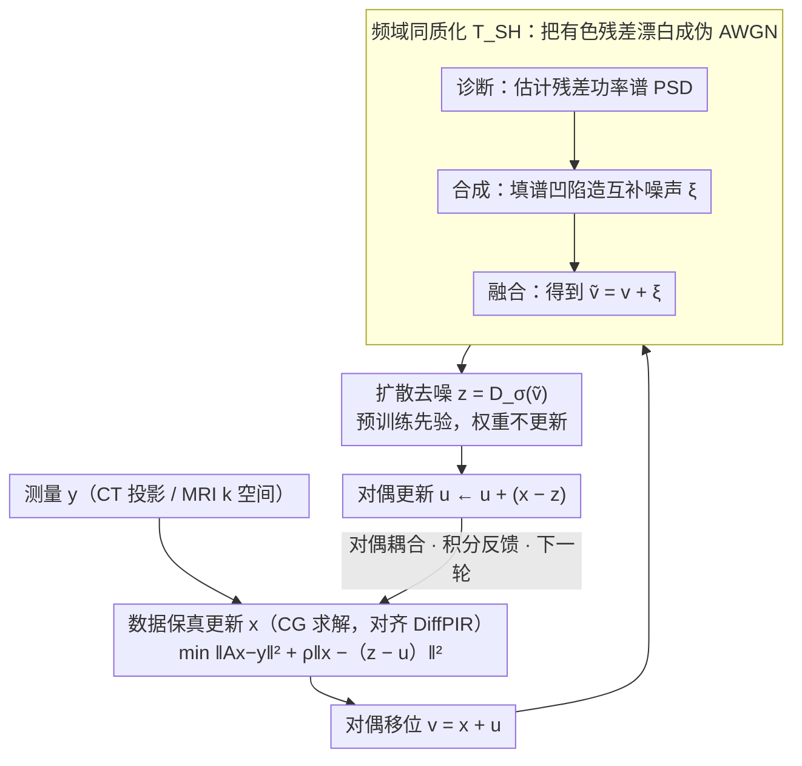

# Plug-and-Play Diffusion Meets ADMM: Dual-Variable Coupling for Robust Medical Image Reconstruction

**会议**: ICML 2026  
**arXiv**: [2602.23214](https://arxiv.org/abs/2602.23214)  
**代码**: https://github.com/duchenhe/DC-PnPDP (有)  
**领域**: 医学图像重建 / 扩散模型 / 逆问题  
**关键词**: PnP 扩散先验, ADMM 对偶变量, 频域白化, CT/MRI 重建, 稳态偏差

## 一句话总结
本文把 ADMM 的对偶变量重新塞回 PnP 扩散先验循环，用"对偶"提供积分反馈消除稳态偏差，再用一个频域 Spectral Homogenization 模块把结构化对偶残差白化成伪 AWGN，避免触发扩散去噪器的 OOD 幻觉，在 sparse-view / limited-angle CT 与加速 MRI 上同时拿到 SOTA 保真度和约 3× 推理加速。

## 研究背景与动机

**领域现状**：医学逆问题（CT/MRI）求解 $y=Ax+n$ 的主流做法是 PnP 扩散先验（PnPDP）——把数据一致性子问题和扩散去噪先验子问题交替执行，常见实现基于 Half-Quadratic Splitting (HQS) 或近端梯度，例如 DiffPIR、DDS、DDNM、DAPS、SITCOM。

**现有痛点**：作者从控制论视角指出，HQS/PG 型求解器是"无记忆"算子——每次迭代只看瞬时数据保真梯度，等价于一个 Proportional (P) 控制器。P 控制器在系统遇到"强阻力"（重度欠采样、强噪声）时无法消除稳态误差，导致重建结果停在一个**有偏的平衡点**上，既不严格满足物理测量，也不在先验流形上。在医学场景这个偏差直接动到临床可靠性。

**核心矛盾**：经典优化理论早就有解药——加入对偶变量（拉格朗日乘子），它对原始残差做积分，等价于 Integral 控制器，可以驱动 $x\to z$ 严格满足约束。但是把对偶 $u^{(k)}$ 直接塞回扩散 PnP 循环又会引爆第二个冲突：$u$ 累积的是"结构化"残差（CT 的方向条纹、MRI 的相干混叠），频谱是有色的；而扩散去噪器只在 AWGN 上训练过，输入 $v^{(k+1)}=x^{(k+1)}+u^{(k)}$ 立刻 OOD，去噪器会把伪影当语义"幻觉"出来。

**本文目标**：(1) 把对偶变量重新接回 PnP 扩散；(2) 同时让扩散去噪器看到的输入仍然是 AWGN。

**切入角度**：解耦"几何角色"和"统计角色"——对偶变量负责几何收敛，再加一个频域白化模块负责把对偶累积出的有色残差"漂白"成伪 AWGN。

**核心 idea**：用 ADMM 对偶提供积分反馈消除稳态偏差，再用 Spectral Homogenization 在频域填补"频谱凹陷"，使去噪器输入的功率谱拟合白噪声，从而调和"几何严格性 vs. 统计兼容性"的冲突。

## 方法详解

### 整体框架
框架 DC-PnPDP 严格沿用 ADMM 三步走，但在第二步前插入一个频域适配模块 $T_{\text{SH}}$，整体一轮迭代如下（Algorithm 1）：

1. **数据保真更新**：$x^{(k+1)}=\arg\min_x \|Ax-y\|_2^2+\rho\|x-z^{(k)}+u^{(k)}\|_2^2$（闭式 / CG 求解）；
2. **对偶移位**：$v^{(k+1)} = x^{(k+1)} + u^{(k)}$；
3. **Spectral Homogenization**：$\tilde v^{(k+1)} = T_{\text{SH}}(v^{(k+1)}; z^{(k)}, \sigma_t)$；
4. **扩散去噪**：$z^{(k+1)} = D_\sigma(\tilde v^{(k+1)}, t)$；
5. **对偶更新**：$u^{(k+1)} = u^{(k)} + (x^{(k+1)} - z^{(k+1)})$。

噪声调度 $\sigma_t$ 按 EDM 框架从大到小线性退火。这里有一个刻意的“控制变量”设计：数据保真步（CT 用 torch-radon 模拟 parallel-beam 投影、MRI 用 Cartesian 欠采样，统一 CG 求解）做得和最强 baseline DiffPIR 一模一样，结构差异**严格只在**“是否维护对偶 $u$”和“是否插入 $T_{\text{SH}}$”这两处，所以消融能干净地把增益归因到 DC 和 SH 两个新模块、不被求解器差异污染。因此下面的关键设计也就只有这两个真正的贡献点。

### 关键设计

**1. Dual-Coupled Iteration（对偶耦合迭代）：把对偶变量当"积分记忆"，从源头消除稳态偏差**

现有 HQS/PG 类 PnP 扩散求解器都把对偶 $u\equiv 0$ 当默认值，相当于直接砍掉了 ADMM 的积分动作，所以在重度欠采样下必然停在一个有偏的平衡点。本文反其道而行，每轮迭代后显式更新 $u^{(k+1)}=u^{(k)}+(x^{(k+1)}-z^{(k+1)})$，把历史上 $x$ 与 $z$ 的共识误差一点点累加成一股修正力；下一次解 $x$ 更新时，$u$ 进入数据保真项二次项的中心 $\|x-z^{(k)}+u^{(k)}\|^2$，等于"只要两个变量还没对齐就反复施压让它们靠拢"。这正是从纯 Proportional 控制器升级成 PI 控制器的积分项——P 控制器面对强阻力（强欠采样）消不掉稳态误差，而 I 项靠对残差的积分把它压到零。增益立竿见影：LACT-90 上仅打开对偶就能 +4.55 dB。

**2. Spectral Homogenization（频域同质化）：把对偶累积出的有色残差"漂白"成伪 AWGN，给去噪器喂回它认识的输入**

对偶虽好，却带来第二个麻烦——$u$ 累积的是结构化残差（CT 的方向条纹、MRI 的相干混叠），频谱是有色的，而扩散去噪器只在 AWGN 上训练过，输入 $v^{(k+1)}=x^{(k+1)}+u^{(k)}$ 立刻 OOD、会把伪影当语义幻觉出来。物理伪影天然集中在特定频带，所以本文不在空域加噪（那会把整张图打花），而是在频域只往"频谱凹陷"里补能量、保留"频谱主峰"携带的语义。具体三步走：先**诊断**，用 $r^{(k+1)}=v^{(k+1)}-z^{(k)}$ 作残差代理，做带核平滑的 PSD 估计 $\hat S_r(\omega) = (|\mathcal F(r)(\omega)|^2)*K_\delta$；再**合成**，定义频谱缺口 $\Delta S(\omega)=\max(\epsilon, \sigma_t^2(HW) - \hat S_r(\omega))$，取白噪声 $n$ 的随机相位配上缺口幅度造出互补噪声 $\xi^{(k+1)} = \mathcal F^{-1}(\sqrt{\Delta S(\omega)} \odot e^{i\angle\mathcal F(n)})$；最后**融合** $\tilde v^{(k+1)} = v^{(k+1)} + \xi^{(k+1)}$。Proposition 4.1 给出二阶谱一致性保证：$\mathbb E_\xi[S_{n_{\text{eff}}}(\omega)] \approx \sigma_t^2(HW)$，即 $\text{Cov}(n_{\text{eff}}) \approx \sigma_t^2 I$。作者把这套操作类比为"Coherence Breaking"——用随机相位加互补幅度淹没结构化伪影的相干性，既漂白了噪声又没伤到结构。MRI 在复数域重建时，SH 对实部、虚部各自独立做一遍，以保证两路的谱白化都成立。

### 损失函数 / 训练策略
扩散先验本身按 EDM 框架预训练（CT 在 AbdomenCT-1K 上 from scratch，MRI 直接用 Zheng et al. 2025 公开权重），**推理阶段不更新扩散权重**——所有改动都发生在 PnP 求解器一侧。这是 plug-and-play 设定的标准做法，也意味着 SH 模块对任何预训练扩散先验都即插即用。

## 实验关键数据

### 主实验
在 AbdomenCT-1K (CT) 和 fastMRI brain (MRI) 上对比 5 个 SOTA PnPDP 求解器，PSNR/SSIM 如下（节选 Table 1）：

| 任务 | 指标 | DiffPIR (最强 baseline) | SITCOM | DAPS | DC-PnPDP (100 NFE) | 提升 vs. 最强 baseline |
|------|------|------|------|------|------|------|
| LACT-90 | PSNR / SSIM | 34.70 / 0.926 | 32.07 / 0.911 | 30.02 / 0.891 | **39.46 / 0.955** | **+4.76 dB** |
| SVCT-20 | PSNR / SSIM | 37.86 / 0.947 | 37.76 / 0.945 | 37.05 / 0.939 | **40.55 / 0.963** | **+2.69 dB** |
| Brain MRI AF=6 | PSNR / SSIM | 34.88 / 0.965 | 35.58 / 0.969 | 34.89 / 0.967 | **36.43 / 0.972** | +0.85 dB |
| Brain MRI AF=10 | PSNR / SSIM | 27.92 / 0.918 | 28.67 / 0.927 | 27.04 / 0.910 | **30.91 / 0.943** | **+2.24 dB** |

LACT 这种"缺角"任务上 +4.76 dB 的跳跃最能体现"对偶消除稳态偏差"的价值——baseline 几乎都在缺失楔形方向画虚结构。

### 消融实验
在 LACT-90 上逐个开关 DC（对偶变量）和 SH（频域白化），其中第一行就是 DiffPIR：

| DC | SH | PSNR ↑ | SSIM ↑ | LPIPS ↓ | 解读 |
|----|----|--------|--------|---------|------|
| ✗ | ✗ | 31.36 | 0.894 | 0.023 | DiffPIR baseline，稳态偏差最大 |
| ✗ | ✓ | 31.51 | 0.898 | 0.022 | 只白化几乎没动，说明有色残差主要由对偶累积引起 |
| ✓ | ✗ | 35.91 | 0.934 | 0.012 | 加对偶 +4.55 dB，但还差完整版 1.1 dB（去噪器 OOD 漏的） |
| ✓ | ✓ | **37.02** | **0.943** | **0.011** | 两个模块强协同 |

### 关键发现
- **DC 是主升力，SH 是 DC 的"安全阀"**：单独打开 SH 只能 +0.15 dB，但 SH 关掉时 DC 离 full model 还有 1.1 dB——说明 SH 的价值不是单独贡献分数，而是消除"对偶引入的 OOD 风险"
- **推理效率 ~3.3× 加速**：DC-PnPDP 30 NFE 已超过 DiffPIR 100 NFE；SVCT-20 上 DiffPIR 需要 1000 NFE 才接近 DC-PnPDP 50 NFE 的质量
- **频谱机制可视化**（Fig. 3）确证：(a) 理想 AWGN 输入 vs. (b) 本文 SH 输出 的 PSD 几乎重合；(c) 朴素加噪 $x+u+\sigma_t n$ 会过能量、去噪器欠校正；(d) 不加噪的 $x+u$ 有高频尖峰、触发幻觉

## 亮点与洞察
- **控制论视角解释 PnP 求解器的稳态偏差**：把 HQS/PG 类求解器类比为 P 控制器、把对偶变量类比为 I 项，这个映射不仅干净地解释了为何 baseline 收敛到偏点，也直接预测了"加对偶就能去偏"——理论叙事和实验数字咬合得很紧
- **结构化残差当成 OOD 问题处理**：把"对偶累积 = OOD"这件事单独拎出来，承认对偶有用但也承认它打破 AWGN 假设，然后用频域而不是空域去解——这是医学逆问题里少见的"先认账再补救"的设计思路
- **可迁移的 trick**：Spectral Homogenization 本质是一个"对预训练去噪器输入做谱白化"的轻量包装器，原则上可以套到任何"求解器残差有色 + 去噪器只懂 AWGN"的场景，比如把它接到自然图像超分、去模糊的 PnP 扩散流水线上做"统计兼容层"
- **数据保真严格对齐 DiffPIR**：这种"控制变量"式实验设计在 PnP 文献里算少有的克制——很多论文同时换求解器和换扩散先验，让人分不清增益来源；本文把变量隔离做得很干净

## 局限与展望
- **作者承认的局限**：方法主要在 CT/MRI 单 coil + Cartesian 等距欠采样下验证，没覆盖 multi-coil parallel imaging、3D 体积重建、非线性前向算子（如相位还原）等更难的临床设置
- **SH 是基于二阶矩匹配的近似白化**：Proposition 4.1 只保证 PSD 期望逼近 $\sigma_t^2 I$，并不严格保证高阶统计也匹配 AWGN；如果去噪器对高阶矩敏感（比如 score 是高度非线性的），可能还有残余 OOD
- **PSD 估计的 bootstrap 用 $z^{(k)}$ 当 clean proxy**：早期迭代 $z^{(k)}$ 本身就脏，残差估计会有偏；可以考虑用 EMA 或 score 的不确定性估计替代
- **超参 $\rho$ 没做敏感性分析**：ADMM 收敛对 $\rho$ 经典依赖很重，论文只在主实验里用了固定 $\rho$，未讨论自适应惩罚（如 ADMM 经典的 $\rho$ 调度）
- **改进思路**：把 SH 推广到色噪声测量（如 CT 的 Poisson-Gaussian 混合噪声）、把对偶替换成更现代的原始-对偶 splitting（Chambolle-Pock）、把 $T_{\text{SH}}$ 学成一个 conditional 模块而非手工估计

## 相关工作与启发
- **vs DiffPIR (PnP-HQS)**：本文方法在数据保真步与 DiffPIR 完全对齐，结构差异只在"是否有对偶 $u$"+"是否插入 SH"。LACT-90 上 +4.76 dB 几乎全部归因于这两个模块，这是非常干净的"加法对照"
- **vs DAPS / SITCOM / DDS / DDNM**：这些方法主要在"如何设计 likelihood 子问题"或"如何修改 reverse SDE"上做文章，但都保留 memoryless 的 HQS-like 结构；本文从控制论角度指出它们共同的弱点
- **vs Shrestha & Fu 2026 (AC-DC)**：AC-DC 同样识别到 ADMM iterate 和 score model 的训练分布不匹配，但他们的解法是在去噪器接口里塞 conditional Langevin 内循环（多步采样、增加计算），本文 SH 是单次频域操作，不增加去噪器调用数——这个对比说明同一个问题可以走"内嵌生成"或"外挂频域适配"两条不同路线
- **vs Bendel et al. 2025 (iterative colored re-noising)**：他们也是要把扩散输入拉回 AWGN，但用的是空域 re-noising；本文的频域路线更精确地"只填谱凹陷不伤主峰"
- **vs Park et al. 2026 (stochastic generative PnP)**：score-based PnP 解释，但没显式处理 ADMM 对偶 OOD 的问题——本文相当于在他们的框架上把"几何严格性"和"统计兼容性"分开治理

## 评分
- 新颖性: ⭐⭐⭐⭐ 把对偶变量"回归"PnP 扩散并不是凭空新概念，但用控制论 P/I 对偶分析 + 显式承认对偶引发 OOD + 频域白化做适配，这一套叙事和实证完整度都很高
- 实验充分度: ⭐⭐⭐⭐ CT/MRI 三任务 + 5 个 SOTA baseline + 干净的"数据保真对齐"消融 + 频谱机制可视化 + NFE 效率曲线，主要短板是没覆盖 multi-coil 和 3D
- 写作质量: ⭐⭐⭐⭐⭐ 动机/方法/实验的对应关系非常紧，控制论隐喻贯穿全文、Proposition 给出二阶谱一致性的形式化保证，叙事比典型 PnP 论文更"有故事感"
- 价值: ⭐⭐⭐⭐ 对医学逆问题社区是 plug-in 友好的求解器升级；SH 模块更可能作为"通用补丁"被其他 PnP 扩散工作引用

<!-- RELATED:START -->

## 相关论文

- [\[ICLR 2026\] DM4CT: Benchmarking Diffusion Models for Computed Tomography Reconstruction](../../ICLR2026/medical_imaging/dm4ct_benchmarking_diffusion_models_for_computed_tomography_reconstruction.md)
- [\[CVPR 2025\] DiN: Diffusion Model for Robust Medical VQA with Semantic Noisy Labels](../../CVPR2025/medical_imaging/din_diffusion_model_for_robust_medical_vqa_with_semantic_noisy_labels.md)
- [\[CVPR 2026\] SemiGDA: Generative Dual-distribution Alignment for Semi-Supervised Medical Image Segmentation](../../CVPR2026/medical_imaging/semigda_generative_dual-distribution_alignment_for_semi-supervised_medical_image.md)
- [\[ICML 2026\] Foundation VAEs for 3D CT Reconstruction, Augmentation, and Generation](foundation_vaes_for_3d_ct_reconstruction_augmentation_and_generation.md)
- [\[ICLR 2026\] COMPASS: Robust Feature Conformal Prediction for Medical Segmentation Metrics](../../ICLR2026/medical_imaging/compass_robust_feature_conformal_prediction_for_medical_segmentation_metrics.md)

<!-- RELATED:END -->
