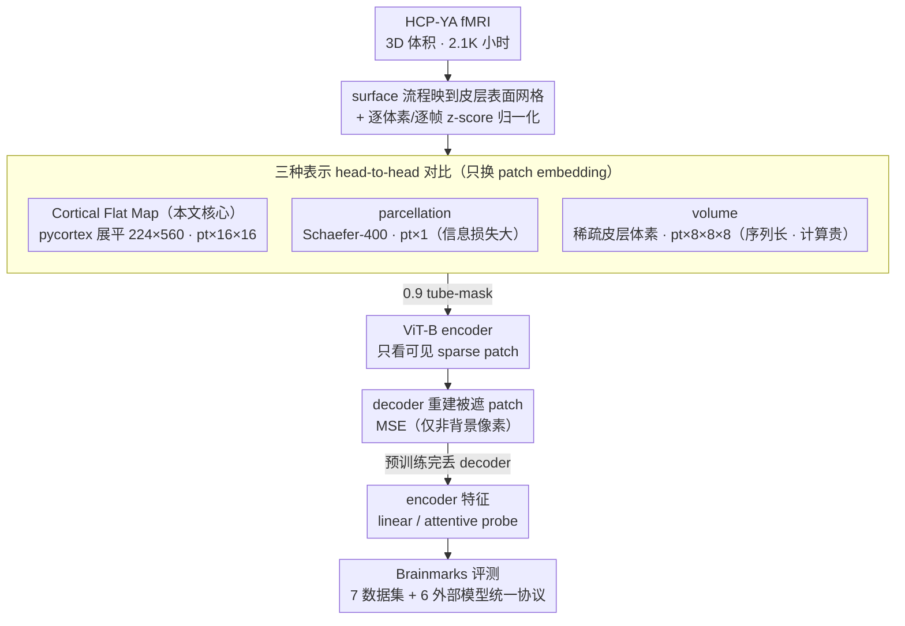

# Scaling Vision Transformers for Functional MRI with Flat Maps

**会议**: ICML 2026  
**arXiv**: [2510.13768](https://arxiv.org/abs/2510.13768)  
**代码**: https://github.com/MedARC-AI/CortexMAE & https://github.com/MedARC-AI/Brainmarks (有)  
**领域**: 医学图像 / 自监督学习 / 神经影像基础模型  
**关键词**: fMRI 基础模型、Cortical Flat Map、MAE、Brainmarks 评测、Scaling Law

## 一句话总结
把 3D fMRI 体积按"皮层展平图"投影成 2D 视频后直接喂给标准 spacetime MAE-ViT，得到一个在 2.1K 小时 HCP 数据上训练的 CortexMAE：在认知状态解码上大幅超 SOTA，验证 flat map 是体素 (volume) 和脑区平均 (parcellation) 之间的"goldilocks zone"；同时发布首个开源 fMRI 基础模型基准 Brainmarks，给出 fMRI 模型的第一份系统 scaling law 与一个"个体特质预测仍打不过简单功能连接 baseline"的诚实 null result。

## 研究背景与动机

**领域现状**：神经科学社区想用 fMRI + 大模型解码大脑活动 (诊断、行为预测、视觉重建)。已有一波 fMRI 自监督基础模型 (BrainLM, Brain-JEPA, NeuroSTORM, SwiFT 等)，多数用 **parcellation** 表示（把 3D 脑体积按 100-400 个脑区平均，得到 1D 时间序列向量）；少数用 **volume** 表示（直接处理 4D 时空 MRI 数据）。

**现有痛点**：(1) Parcellation 计算便宜但**信息损失严重**——一整个 cm 量级的脑区被压成单标量，丢掉 99% 维度；(2) Volume 信息全保留但 sequence length 巨大（一个 fMRI volume 切 patch 后 ~2000+ tokens），训练计算/IO 开销爆炸；(3) 整个 fMRI 基础模型领域**几乎没有可复现 benchmark**——各家用自家 dataset、自家预处理、自家评测设置，谁强谁弱不可比；(4) 之前的 trait prediction 论文经常报告"我们 beat baseline X%"，但用的 baseline 太弱，没和"简单功能连接 (FC) + 逻辑回归"这种 30 年前的方法做严肃对比。

**核心矛盾**：fMRI 数据本质是 4D 时空体积，标准 ViT 假定 2D 输入。要么花大代价直接学 4D（信息全但贵），要么用强归纳偏置 (parcellation) 损失信息——存在一个 **"既保留全皮层信号又给 ViT 友好的 2D 输入"** 的中间表示吗？

**本文目标**：(i) 找到 fMRI 的 "goldilocks" 输入表示；(ii) 用标准 ViT + MAE 训练一组对比清晰的基础模型；(iii) 建立开源、可复现的 fMRI 基础模型评测 (Brainmarks)；(iv) 第一次系统做 fMRI 自监督的 data/model scaling law。

**切入角度**：神经科学早就有 **cortical flat map** ——把大脑皮层这个 2D 流形（其实皮层就是一层 2-4mm 厚的褶皱片）展平到平面网格上。这样既保留了全皮层 BOLD 信号（不像 parcellation 那样平均掉细节），又得到了一张 224×560 的 2D "图像"，可以直接被 spacetime ViT 当 video 处理。

**核心 idea**：用 cortical flat map 把 3D fMRI 投影成 2D 视频，套用现成 MAE-st 训练，**不改 ViT 架构，只换 patch embedding**——一个简单但被错过的好选择，最终带来 SOTA + 第一份 fMRI scaling law + 第一个开源 benchmark。

## 方法详解

### 整体框架
整篇工作的核心是一个赌注：fMRI 本质是 4D 时空数据，但只要把它投影成对的 2D 表示，就能原封不动地复用现成的 spacetime MAE-ViT，不必为它重新设计架构。于是 pipeline 只有两件事——先把 3D fMRI 体积压成 2D 视频，再把视频喂进标准 MAE。具体地，HCP-YA 数据先经 FreeSurfer / fMRIPrep 的 surface 流程把每帧信号从 3D voxel 映到皮层表面网格，再用 pycortex 展平成 16 帧 × 224 × 560 的 flat map 视频；视频切成 $p_t \times 16 \times 16$ 时空 patch（默认 $p_t=4$），以 0.9 的比例 tube-mask 掉，ViT-B encoder 只看剩下的 sparse patch，decoder 重建被遮的部分。预训练完成后丢掉 decoder，encoder 输出当特征接 linear / attentive probe 做下游预测。为了让"flat map 是不是好表示"这个问题有可信答案，作者同时用同一套架构训了 parcellation MAE 和 volume MAE 做严格对照，并把这套对比固化成开源 benchmark。

### 关键设计

**1. Cortical Flat Map Patch Embedding：在体素与脑区平均之间找皮层信号的"金发姑娘"中间点**

fMRI 表示一直被两难夹住：parcellation 把整块 cm 量级脑区平均成单标量，~400 维向量丢掉了 99% 维度；volume 直接处理 4D 数据信息全保留，但一个体积切完 patch 是 ~132K voxel 的稀疏序列，计算和 IO 都爆炸，而且大半是脑外无效背景。这篇论文的做法是借神经科学几十年的老工具——皮层本质就是一层 2-4mm 厚的褶皱片，是个 2D 流形，可以无损展平。于是先用 surface-based 流程把信号从 3D voxel 映到皮层表面 mesh，再用 pycortex 的 flat map 把左右半球分别展开拼成一张 224×560 的 2D 图，每个时间步一帧、16 帧叠成 ViT 的 spacetime 输入，背景全 0 patch 直接剔除、MSE loss 也只在非背景像素上算。这样既保留了全皮层 ~77K 维信号（不像 parcellation 那样平均掉细节），序列长度 364 又和 volume 的 465、parcellation 的 400 几乎持平，却因为是规则 2D 网格而训练带宽和数据吞吐都更优——论文 Figure 1 把这个 trade-off 画成一条从"全压缩"到"全保留"的光谱，flat map 正落在甜点位置。

**2. 三种表示的 head-to-head 对比：把 parcellation / flat / volume 放上同一条起跑线**

以往 fMRI 基础模型的通病是各家只用自己那一种表示就宣称 SOTA，谁强谁弱根本不可比。这里作者刻意让三个变体共享几乎所有变量——同样的 ViT-B encoder、同样 16 帧输入、同样 0.9 的 mask ratio，唯一的差别就是 patch embedding：parcel 用 $p_t \times 1$ 只切时间维、flat 用 $p_t \times 16 \times 16$、volume 用 $p_t \times 8 \times 8 \times 8$ 的 4D patch。每个变体独立训 8 次取均值，再一起跑下游 8 个数据集（4 个临床诊断 + 性别 + 年龄 + HCP-YA Task21 + NSD COCO24）。因为除表示之外的所有东西都被钉死，最后得到的差异就能干净地归因到"表示"本身，这也是第一份真正成 family 的 multi-representation fMRI MAE，结论可信度远高于单点比较。

**3. Brainmarks 开源评测套件：用统一 probe 协议终结 fMRI 模型的复现性灾难**

fMRI 领域长期是"各家用自家 dataset、自家预处理、自家评测设置"，加上 trait 论文常拿过弱的 baseline 自夸，谁真的更好无从判断。Brainmarks 把这件事标准化：一边纳入 6 个现有基础模型（SwiFT、BrainLM、Brain-JEPA、BrainHarmonix-F、NeuroSTORM、Brain-Semantoks）和 CortexMAE family，一边统一 7 个公开数据集（4 个临床诊断 ABIDE/ADHD200/ADNI/PPMI + HCP-A 年龄/性别 + HCP-YA Task21 + NSD COCO24）。关键是 probe 协议对所有方法一视同仁——小样本 trait prediction 用 linear probe + 100 次随机 train-test 分割，大样本 state prediction 用 attentive probe + 单 fixed split + 49 个学习率 grid，谁都不许自己 fine-tune 偷跑。作者还特意设计了 NSD COCO24 这种"短 trial 重叠 + 测试集换不同 subject + 高难度视觉解码"的任务，专门用来把真正强的模型从弱的里区分出来。

### 损失函数 / 训练策略
预训练目标就是 masked patch 上的 MAE MSE，但有两步 normalization 是成败关键：每个 voxel/ROI 时间序列做 z-score（coordinate norm）压住静态体素差异，每帧再做空间 z-score（frame norm）去掉全局漂移——因为 BOLD 信号本身只有 1-2% 的波动，不归一化静态噪声就会淹没有用信号。其余超参：temporal patch $p_t=4$、默认 625K steps、batch 32（= 512 帧），并用 repeated sampling 缓解 IO 瓶颈。下游 trait prediction 用 average-pooled embedding + logistic regression 5-fold CV，state prediction 用 attentive probe + early stopping。

## 实验关键数据

### 主实验
三种表示在 8 个下游任务上的探针准确率（8 次预训练随机种子均值）：

| Dataset | parcel | flat | volume | FC 基线 |
|---|---|---|---|---|
| ABIDE (ASD 诊断) | 62.0 | 61.4 | 60.4 | 59.8 |
| ADHD200 | 56.8 | 59.2 | 58.8 | 57.0 |
| ADNI (AD) | 61.6 | 62.4 | 64.3 | 58.6 |
| PPMI (PD) | 61.4 | 58.8 | 59.1 | 58.0 |
| HCP-A Age | 44.2 | 47.5 | **53.4** | 45.6 |
| HCP-A Sex | 71.2 | **87.4** | 86.3 | 81.9 |
| HCP-YA Task21 (状态) | 97.5 | **98.9** | 96.2 | 82.4 |
| NSD COCO24 (视觉解码) | 27.5 | **31.0** | 27.7 | 7.4 |

总结：(1) **flat map 在动态状态解码上全面胜出**（Task21、COCO24、性别）；(2) volume 在年龄预测上有优势（可能跟 dense 体素能捕捉皮层厚度等结构线索有关）；(3) parcel 最高效但状态解码弱；(4) 临床诊断 4 个数据集上所有方法几乎打平，且勉强超过 FC baseline——揭示样本太少时 fMRI 基础模型还看不出优势。

跨模型 controlled benchmark（Figure 8）：trait prediction 上**没有任何模型显著超过简单 FC 基线**（包括 BrainLM、Brain-JEPA、NeuroSTORM 等 SOTA）；state decoding 上 **CortexMAE flat map 全面领先**，比 NeuroSTORM 等 volume 模型在 NSD COCO24 上高 3-5 个百分点。

### 消融实验

| 配置 | 现象 |
|---|---|
| Full flat map MAE | baseline |
| 不做 frame normalization | 全局信号漂移污染，下游精度掉 | 
| 不做 coordinate normalization | 静态体素差异主导特征，状态解码崩 |
| tube masking → random masking | 时间内插泄露信息，重建任务变 trivial |
| mask ratio 0.5 → 0.9 | 高 mask ratio 强迫学结构性表示，下游更强 |
| 增大 encoder depth | depth ~9 (37M 参数) 后 saturate |
| 增大 pretrain data | 在 HCP 内部数据严格遵循 power law (指数 -0.01)，OOD NSD 上 saturate |

### 关键发现
- **fMRI 严格遵循 data scaling law，但指数比语言模型弱十倍** (-0.01 vs Kaplan 2020 的 -0.1)，意味着 fMRI 边际收益小，scaling 不会自动救场。
- Model scaling 在 depth 9 (37M 参数) 就饱和——HCP-YA 这种 2K 小时数据集就只能撑住这点容量。
- 模型自发学到大脑的默认模式网络 (DMN)：position embedding 的第一主成分跟 Margulies 2016 的 FC principal gradient 几乎一致，证明 MAE 真的学到神经生物学有意义的结构。
- **诚实 null result**：所有 fMRI 基础模型在 individual trait prediction 上都打不过简单 FC + linear——这对整个领域是个警钟。
- state decoding 上基础模型有 robust 优势，CortexMAE flat 是其中最强。

## 亮点与洞察
- **"换 patch embedding 就完事"是非常优雅的工程选择**：不重新设计架构、不重写 attention，只是把输入从 3D 体积投到 2D 流形——任何 ViT 论文未来想入局 fMRI 都可以这样做。
- **goldilocks zone 的概念可迁移**：在表示学习里"全保留 vs 大压缩"是经典 trade-off，cortical flat map 是一个利用领域几何 (cortex 本质是 2D) 找到完美中间点的例子，类似的可以套到 EEG (1D 时间 + 电极几何)、心电、显微图像等。
- **诚实 null result + 开源 benchmark**：神经影像社区长期有"小数据集 + 各家自评"的复现性灾难，作者直接发布 Brainmarks 并公开承认 trait prediction 打不过 FC baseline，这是社区急需的诚实声音。
- **第一份 fMRI scaling law**：让大家看清"fMRI 不是 NLP"——指数小十倍意味着堆数据收益有限，真正瓶颈可能是数据多样性而非规模。
- **DMN 自然涌现**：自监督表征对应到神经生物学已知结构，是 fMRI MAE 的优秀诠释性证据。

## 局限与展望
- HCP-YA 全是 22-35 岁年轻人 + 健康人群，预训练分布**狭窄**，OOD 泛化弱（论文图 7 已经展示了在 NSD 上 scaling 失效）。
- 临床诊断结果（ABIDE、ADHD200 等）全 60% 上下徘徊，**几乎没用**——基础模型在小样本临床数据上无法 transfer，是社区共性难题，但本文没提供解决方案。
- depth 9 就 saturate，说明现有数据规模不够——但 fMRI 数据采集极贵 (一小时成本几百美元)，要 10× 数据需要全社区合作。
- flat map 投影本身**丢掉了皮层下结构** (subcortical regions like thalamus, basal ganglia)，这些区域对很多临床任务很重要；volume 模型在这块有结构性优势。
- 没探讨 multi-modal fMRI (task + rest + diffusion) 联合预训练，未来工作空间大。
- 评测只在英语母语、北美人群数据上做，存在 demographic bias。

## 相关工作与启发
- **vs BrainLM (Caro et al. 2024) / Brain-JEPA (Dong et al. 2024)**：这些是 parcellation-based fMRI 基础模型，dim 损失大；CortexMAE flat 全皮层信号保留，在状态解码上显著更强。
- **vs SwiFT (Kim et al. 2023) / NeuroSTORM (Wang et al. 2025a)**：volume-based 模型，计算贵但年龄预测有优势；本文 volume MAE 也复现了这一点，说明 dense 表示有 niche，但状态解码上 flat 仍占优。
- **vs functional connectivity baselines**：从 Finn et al. 2015 起，FC + linear 一直是 trait prediction 标准 baseline；本文证明深度 fMRI 模型至今没真正超越它，是对整个深度 fMRI 领域的一次"打脸"。
- **vs vision MAE (He et al. 2022)**：直接搬运 MAE-st，主要贡献在于"找到合适的 2D 投影把 fMRI 装进现成框架"——示范了"领域几何 + 通用架构"是个高效组合。

## 评分
- 新颖性: ⭐⭐⭐⭐ 严格说 cortical flat map 是神经科学几十年的工具，作者首次系统用它做 ViT-friendly representation；技术上小但战略上聪明。
- 实验充分度: ⭐⭐⭐⭐⭐ 三表示严格对比 + 6 个外部模型 + Brainmarks 7 数据集 + scaling law + 解释性分析，几乎是 fMRI MAE 的"实验白皮书"。
- 写作质量: ⭐⭐⭐⭐⭐ 思路清晰、动机和结论都直白，关键 figure (光谱图、DMN 涌现) 极其有说服力。
- 价值: ⭐⭐⭐⭐⭐ Brainmarks + null result + flat map 三件套对 fMRI 基础模型社区是教科书级贡献，会成为后续工作必引论文。

<!-- RELATED:START -->

## 相关论文

- [\[CVPR 2026\] EEGiT: Teaching Vision Transformers to Understand the EEG signal](../../CVPR2026/medical_imaging/eegit_teaching_vision_transformers_to_understand_the_eeg_signal.md)
- [\[CVPR 2026\] MuViT: Multi-Resolution Vision Transformers for Learning Across Scales in Microscopy](../../CVPR2026/medical_imaging/muvit_multi-resolution_vision_transformers_for_learning_across_scales_in_microsc.md)
- [\[CVPR 2026\] Turning Pre-Trained Vision Transformers into End-to-End Histopathology Whole Slide Image Models for Survival Prediction](../../CVPR2026/medical_imaging/turning_pre-trained_vision_transformers_into_end-to-end_histopathology_whole_sli.md)
- [\[AAAI 2026\] FunKAN: Functional Kolmogorov-Arnold Network for Medical Image Enhancement and Segmentation](../../AAAI2026/medical_imaging/funkan_functional_kolmogorov-arnold_network_for_medical_image_enhancement_and_se.md)
- [\[CVPR 2026\] Continual Learning for fMRI-Based Brain Disorder Diagnosis via Functional Connectivity Matrices Generative Replay](../../CVPR2026/medical_imaging/forge_continual_learning_for_fmri_based_brain_disorder_diagnosis.md)

<!-- RELATED:END -->
