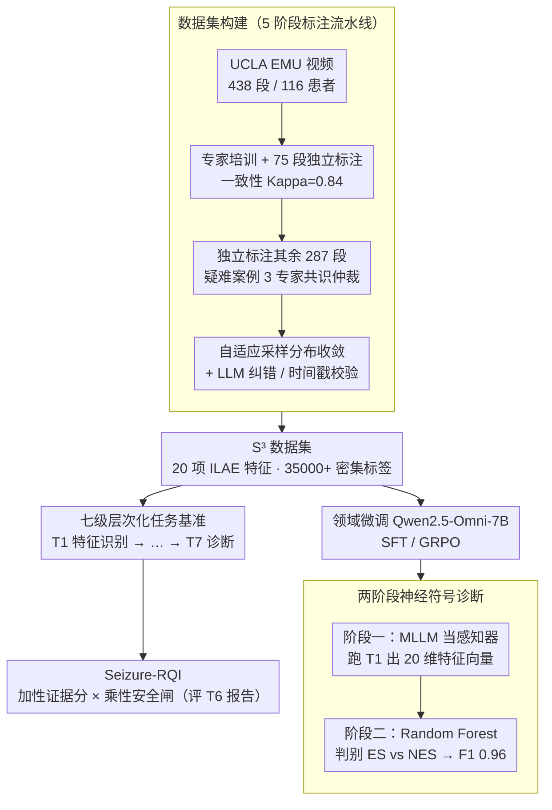

# Seizure-Semiology-Suite (S³): A Clinically Multimodal Dataset, Benchmark, and Models for Seizure Semiology Understanding

**会议**: ICML 2026  
**arXiv**: [2605.21852](https://arxiv.org/abs/2605.21852)  
**代码**: 有（GitHub: SeizureSemiologySuite）  
**领域**: 医学图像 / 多模态VLM / 视频理解  
**关键词**: 癫痫语义学、临床视频理解、多模态大模型、报告质量评估、神经符号分类

## 一句话总结
本文构建了首个大规模专家标注的癫痫发作视频数据集 S³（438 段视频、35,000+ 密集标签、20 项 ILAE 语义学特征），配套设计了七级层次化任务基准与临床对齐的 Seizure-RQI 报告质量指标，系统暴露了 11 个开源 MLLM 在时序定位、空间偏侧化和临床忠实性上的失败模式，并通过领域微调 + 两阶段神经符号框架将癫痫 vs 非癫痫分类 F1 提升到 0.96。

## 研究背景与动机

**领域现状**：癫痫语义学（seizure semiology）是临床诊断癫痫类型、定位致痫灶（SOZ）和评估 SUDEP 风险的核心依据，目前主要依赖训练有素的癫痫专家手动逐帧回看长程视频脑电监测（EMU）录像，主观性强、人力成本高，在医疗资源匮乏地区几乎无法规模化。

**现有痛点**：自动化方法长期被困在两个极端——一类是窄任务判别式管线（3D CNN 检测强直-阵挛、加速度计、光流分割、CNN 分类器），只能输出粗粒度的"是/否"标签，丧失描述性可解释；另一类是把通用视频 QA 数据集（ActivityNet-QA、MSRVTT-QA、MotionBench）的 MLLM 直接套到癫痫视频上，但这些数据集以"有目的、日常活动"为主，根本不覆盖"非自主、病理性运动"这一类目。同时医学视频理解的代表数据集（MedVidQA、SV-RCNet）又集中在手术等程序化场景，假设动作具有预设时序结构，与癫痫发作完全不同。

**核心矛盾**：MLLM 要做到临床可用，需要同时把"空间偏侧化（patient's left vs right）"、"并发症状共现"、"症状时序演化（ictal march）"和"叙事性报告生成"全部做对；但当前既缺少带密集专家标签的训练 / 评测数据，也缺少能区分"BLEU 高但临床错误"和"BLEU 低但临床正确"的评估指标——传统 N-gram 指标和 BERTScore 与临床事实性几乎无相关性。

**本文目标**：(i) 造一个真正给 MLLM 用的、带 ILAE 标准化语义学特征密集标注的癫痫视频数据集；(ii) 设计能覆盖"感知 → 推理 → 报告 → 诊断"全栈的层次化任务体系；(iii) 提出与专家判断对齐的报告质量度量；(iv) 给出在该数据集上闭环的领域适配训练方案。

**切入角度**：把临床专家解读癫痫视频的认知流程拆解为七层——单帧/短窗的特征识别 → 特征证据解释 → 偏侧/解剖空间分析 → 时间边界定位 → 症状有序序列 → 叙事报告 → 综合诊断——逐层独立打分，从而把 MLLM 的"系统性能"分解成"哪一环节短板最严重"，为后续模型迭代提供精确诊断。

**核心 idea**：用"领域专家标注 + 临床任务分层 + 临床对齐指标 + 神经符号解耦"四件套，把通用 MLLM 改造为临床可信的癫痫语义学解读器。

## 方法详解

### 整体框架
S³ 把临床专家解读癫痫视频的完整链路落成一套数据—评测—模型三件套。**数据侧**是 Seizure-Semiology-Dataset：来自 UCLA EMU 2019–2023 年共 116 位成人患者的 438 段连续视频，专家逐项标注 20 项 ILAE 定义的语义学特征（自动症 automatisms、强直 tonic、阵挛 clonic 等），每个特征都记"是否出现 + 起止时间戳 + 文本理由"，累计 35,000+ 标签，按患者层级 4:1 划分训练/测试并保持 ES（癫痫性）:NES（非癫痫性）比例。**评测侧**是 Seizure-Semiology-Bench，把"看懂视频"拆成 7 个难度递增的任务，每个任务配自己的提示模板、采样协议（30s 滑窗、事件中心裁剪、稀疏采样）和评估指标。**模型侧**在 Qwen2.5-Omni-7B 上做 SFT 与 GRPO 两种癫痫专属微调，并提出两阶段神经符号分类器把感知和诊断推理解耦。数据质量由五阶段标注流水线兜底：专家培训 → 标注员独立标 75 段验证一致性（Kappa = 0.8395）→ 独立标其余 287 段（疑难案例 3 位专家共识仲裁）→ 自适应采样验证特征分布与专家收敛（ES Pearson 0.893、NES Pearson 0.782）→ LLM 文本纠错 + 规则化时间戳校验。

### 关键设计

**1. 数据集构建（Seizure-Semiology-Dataset）：用五阶段标注流水线兜出首个大规模专家密集标注的癫痫视频数据**

MLLM 之所以一直进不了癫痫语义学，根本卡点是没有带专家级密集标注的训练 / 评测数据——既有医学视频数据集只覆盖手术等程序化场景，通用视频 QA 数据集又只有日常活动，都不包含"非自主病理性运动"这一类目。S³ 从 UCLA EMU 2019–2023 的 116 位成人患者中筛出 438 段动作清晰、全身可见的连续发作视频，按 20 项 ILAE 标准化语义学特征逐项标注"是否出现 + 起止时间戳 + 文本理由"，累计 35,000+ 密集标签，并按患者层级 4:1 划分训练 / 测试、保持 ES:NES 比例（测试集 82 段 / 24 患者）。

密集标注的可信度全靠五阶段流水线兜底：① 专家用代表性样例给标注员做特征校准培训；② 标注员独立标 75 段与专家比对，Kappa = 0.8395 证明能复现专家级别的逐特征判断；③ 标注员独立标其余 287 段，疑难案例交 3 位专家开会共识、分歧多数票仲裁；④ 用自适应采样持续比对标注员与专家的特征分布，直到统计收敛（ES Pearson 0.893、NES Pearson 0.782）；⑤ 用 LLM 纠正理由文本的语法 / 语义错误，并用规则检查校验时间戳。正是这套"先校准、再验证一致性、再仲裁、再收敛、再纠错"的链条，让一批非专家标注员也能产出临床可信的密集标签，从而把后续 benchmark 与训练立在可靠数据之上。

**2. 七级层次化任务基准（Seizure-Semiology-Bench）：把端到端黑盒分数拆成可问责的子能力**

通用 MLLM 即便平均分过得去，也可能在某个临床关键维度（如空间偏侧化）系统性归零，直接做端到端"诊断准确率"评测会把这种失败完全掩盖。S³ 因此把临床认知流程切成七层、难度严格递增：Task 1 二分类特征识别（20 个 yes/no 提示）、Task 2 文本理由生成（解释为何判某特征存在）、Task 3 空间偏侧化（强制选择题，显式锚定 patient's left/right 而非 camera view）、Task 4 时间边界定位（MM:SS 时间戳，秒级 MAE 评估）、Task 5 症状时序排序（Edit Distance / Temporal-F1 / LCS ratio 三指标）、Task 6 叙事报告生成、Task 7 临床诊断（ES vs NES，分 video-only / report-augmented / two-stage 三档对比）。

这种分层最大的价值是**可追溯**：后续任务的失败能回溯到前置任务，例如 Task 5 排序差可分解为 Task 1 识别错（"what"错）叠加 Task 4 时间错（"when"错）的级联结果，从而精确定位"哪一环节短板最严重"。论文实测正是靠它发现 Qwen2.5-VL 从 7B 扩到 72B，Task 1 平均 F1 只在 0.42–0.45 间浮动——证明"加大规模"不是解药，必须靠分层定位瓶颈。

**3. Seizure-RQI：与专家判断对齐的报告质量指标**

BLEU/ROUGE/BERTScore 这类表面词形指标与临床判断几乎零相关（Pearson $r \leq 0.10$），会出现"BLEU 高但临床错误"和"BLEU 低但临床正确"的颠倒。Seizure-RQI 的设计哲学是**加性证据分 × 乘性安全闸**：基础分由四个临床分量加权而成——结构完整性 $S$（权重 15，是否含起始/扩散/发作后 3 段）、症状覆盖度 $C$（权重 35，正确抽出特征数 / 真值特征总数）、关键定位特征 $L$（权重 25，4 个偏侧化特征 left/right/none 的匹配比例）、时序保真度 $T$（权重 25，按时间顺序提取的特征列表与真值的 Temporal F1）；再整体乘上四个惩罚项：

$$\mathrm{RQI} = (15S + 35C + 25L + 25T)\times P_{\text{hall}}\times P_{\text{off}}\times P_{\text{len}}\times P_{\text{haz}}$$

其中 $P_{\text{hall}}$ 罚幻觉特征、$P_{\text{off}}$ 罚跑题内容（如护理干预）、$P_{\text{len}}$ 罚过度冗余、$P_{\text{haz}}$ 罚危险临床表述。任何一项安全问题都通过乘法直接压低总分，而不像加权和那样能被其他高分稀释。论文验证 RQI 与专家判断的 Pearson 相关达 0.57、pairwise 准确率 0.74，远高于通用指标的 ≈0.54。

**4. 两阶段神经符号诊断框架：把 MLLM 当特征工程师而非诊断医生**

直接让 MLLM 端到端读视频出诊断，容易在长时序上下文里做"幻觉式推理"——作者发现它经领域微调后视觉识别（Task 1）能逼近专家，但"基于多个特征做规则化推理"这一步很不稳。框架因此把两件事解耦：第一阶段把 MLLM 纯当感知器，跑 Task 1 输出一个 20 维二值特征向量 $v \in \{0,1\}^{20}$，将高维非结构化视频压成结构化、可解释的临床特征表示；第二阶段把 $v$ 喂给 Random Forest 这类浅层统计分类器做 ES vs NES 判别。

解耦后不仅诊断更稳，Random Forest 还能输出特征重要性（强直、头部偏转、快速眨眼、睡眠中发作等被打高权重），可解释性远胜端到端 MLLM——这对临床部署中赢得医生信任至关重要。该框架与 seizure_omni_sft-7B 组合时，把 ES vs NES 的 F1 从直接诊断的 0.70 推到 0.96。

### 损失函数 / 训练策略
对 Qwen2.5-Omni-7B 做两种癫痫专属微调：**(i) SFT** 用 (video, prompt, answer) 三元组监督学习；**(ii) GRPO** 用组相对策略优化并按任务定制奖励——Task 1/3/7 用准确率奖励，Task 2/6 用 BLEU+ROUGE 复合奖励，Task 4 用时间邻近度奖励，Task 5 用 LCS ratio 奖励。GRPO 暴露出一个反直觉教训：在 Task 6 用 BLEU/ROUGE 当奖励反而把模型逼向重复输出，因为这些指标本身不反映临床相关性——这从反面印证了 Seizure-RQI 存在的必要。

## 实验关键数据

### 主实验

| 任务 / 指标 | 最优基线 MLLM | seizure_omni_sft | seizure_omni_grpo | 备注 |
|---|---|---|---|---|
| Task 1 F1 (特征识别) | Qwen2.5-VL-72B ≈ 0.43 | **0.47** | 0.43 | SFT 的 7B 超越 72B 通用模型 |
| Task 4 平均 MAE (秒) | Qwen2.5-VL-32B 8.19 起 / 12.72 止 | 23.02 | **20.02** | GRPO 较基线 25.50 改善 21.5% |
| Task 5 LCS ratio | Qwen3-Omni-30B 0.43 | 0.18 | 0.18 | 比 Qwen2.5-Omni 基线 0.12 提升 50% |
| Task 6 Seizure-RQI | Lingshu-32B **39.80** | 31.69 | 36.44 | 医学预训练 vs 通用模型差距小 |
| Task 7 ES vs NES F1（video-only） | Lingshu-32B 0.84 | 0.71 | 0.77 | 端到端 MLLM 上限有限 |
| Task 7 F1（two-stage 神经符号） | — | **0.96** | 0.94 | 首次在大规模数据集上纯视频做到 |

### 消融实验

| 配置 | 平均 Task 7 F1 | 关键发现 |
|---|---|---|
| Direct MLLM (w/o rpt) | 0.70 | 端到端诊断作为基线 |
| Report-augmented (w/ rpt) | 0.79 | 给真值报告辅助提升 +0.09 |
| Two-stage 神经符号 | **0.86** | 平均提升 +0.16，超过给真值报告 |
| Seizure-RQI vs BLEU/ROUGE/BERTScore | Pearson 0.57 vs ≤0.10 | 临床对齐显著 |
| 帧率 2 FPS → 4 FPS → 10 FPS | Task 1 F1 +0.06 / +0.08 | 采样率不是主瓶颈 |
| Task 4 全视频稀疏 60 帧 | 平均 MAE +4.91s | 时序定位是 MLLM 根本缺陷 |

### 关键发现
- **规模不是解药**：Qwen2.5-VL 从 7B 到 72B 在 Task 1 几乎无提升，说明架构层面缺乏对病理运动的归纳偏置，单靠扩参不能补。
- **领域微调 vs 灾难性遗忘**：SFT/GRPO 在六个任务上平均带来 12% / 15% 的提升，但在 Task 3（偏侧化）样本量过小（仅 527 条，head turning 仅 98 条），微调后模型坍缩到只输出"left"，F1 = 0.00——领域适配必须配套足量子任务样本。
- **多模态融合优于单模态**：Qwen3-Omni-30B 在声音相关特征上优于纯视觉 Qwen2.5-VL-32B 和纯音频 Audio-Flamingo-3，证明癫痫语义学需要听觉信号（如发声、应答性）。
- **医学预训练的双刃剑**：Lingshu-32B 在 video-only Task 7 拿到 F1=0.84 最佳，但加上报告后反而掉到 0.60，说明其语言推理能力被狭窄医学微调削弱。
- **空间偏侧化是开放问题**：即便显式提示"patient's left vs camera's left"，所有模型 Task 3 平均 F1 仍 < 0.2，提示工程救不了，根因是预训练语料（如 LAION-2B）缺乏空间关系数据。

## 亮点与洞察
- **任务分层的可追溯性设计**：把 Task 5（序列）的错误显式归因为 Task 1（识别）+ Task 4（定位）的级联，这种"诊断式 benchmark"思路可迁移到任何长时序多步推理任务——本质是把端到端黑盒分数拆成可问责的子能力分数。
- **Seizure-RQI 的乘法惩罚结构**：基础加权分（结构 + 覆盖 + 定位 + 时序）再乘以幻觉/跑题/冗余/危险四种惩罚，这种"加性证据 + 乘性安全闸"的范式可直接搬到放射报告、病理报告、手术记录等任何高风险临床文本生成评估上。
- **神经符号解耦换可解释性**：把 MLLM 当"特征工程师"而非"诊断医生"，下游接 Random Forest 既拿到 F1=0.96 又能输出特征重要性排名，比端到端 MLLM 在临床部署中更易获得医生信任——这是把"AI 协助诊断"从论文 demo 推向真实流程的关键工程范式。
- **GRPO 奖励选择失败案例**：BLEU/ROUGE 作为奖励反而让模型输出重复内容，说明 RL 阶段必须用与下游目标真正对齐的奖励函数；这是个对其他领域 RLHF/RLVR 同样有警示意义的教训。

## 局限与展望
- 数据来源单一：仅 UCLA 一家三级医疗中心、成年患者（18–64 岁），缺儿童与跨机构泛化验证；偏侧化子任务样本量严重不足（< 100），限制了 Task 3 的可微调性。
- 处理帧率受限：所有任务在 2 FPS 下评测，对快速眨眼、面部细微抽搐等高频事件存在系统性信息丢失（消融显示 10 FPS 比 2 FPS 高 0.08 F1）。
- 时序定位本质短板：MLLM 单次前馈无法像临床医生那样回溯式精修起止时间，最佳 MAE 仍达 8–12 秒，远未达到 ictal 定位精度需求；论文展望用 agentic 框架做工具增强的迭代精修。
- 评测覆盖：未与 EEG、MRI 等多模态生理信号融合；未做前瞻性临床部署验证，所有结果仍属"受控实验设置"。
- 改进思路：(i) 训练阶段加入合成的偏侧化数据缓解灾难性遗忘；(ii) 引入 3D body pose 估计辅助 left/right 消歧；(iii) 把 Seizure-RQI 直接作为 GRPO 奖励替代 BLEU/ROUGE。

## 相关工作与启发
- **vs MedVidQA / SV-RCNet（医学视频理解）**：他们针对手术等"有意图、有预设流程"的程序化视频，本文针对非自主病理性运动；S³ 填补了"involuntary motion + dense feature annotation"这一空缺。
- **vs MotionBench（细粒度运动感知）**：MotionBench 测日常运动，S³ 测临床偏侧化、并发性、时序演化，证明通用细粒度运动 benchmark 不能代理临床能力。
- **vs RadGraph（医学文本评估）**：RadGraph 用图结构评放射报告实体关系，S³-RQI 增加了叙事结构（onset/propagation/postictal）和时序一致性维度，更适合时间敏感的发作性事件描述。
- **vs 既有癫痫专用方法（3D CNN、加速度计、光流）**：那些方法只输出粗类别，S³ 的生成式范式可输出特征级理由 + 报告 + 诊断，与专家临床推理流程对齐。

## 评分
- 新颖性: ⭐⭐⭐⭐ 数据集 + 任务体系 + 评估指标 + 训练策略四件套首次在癫痫语义学上闭环，单独看每个组件并非全新但整合度高。
- 实验充分度: ⭐⭐⭐⭐⭐ 11 个开源 MLLM 横扫 + SFT/GRPO 双训练范式 + 两阶段对比 + 5 项消融 + 与临床医生同条件对照，几乎穷尽分析维度。
- 写作质量: ⭐⭐⭐⭐ 任务分层叙事清晰，每个失败模式都给出可能机制；表格密度高但解读到位。
- 价值: ⭐⭐⭐⭐⭐ 同时给出数据集、benchmark、临床对齐指标、训练方案、神经符号工程范式，对医学多模态 AI 与高风险领域报告生成评估均有持久参考价值，two-stage F1=0.96 接近临床可用门槛。

<!-- RELATED:START -->

## 相关论文

- [\[ICML 2026\] SynerMedGen: Synergizing Medical Multimodal Understanding with Generation via Task Alignment](synermedgen_synergizing_medical_multimodal_understanding_with_generation_via_tas.md)
- [\[NeurIPS 2025\] FAPEX: Fractional Amplitude-Phase Expressor for Robust Cross-Subject Seizure Prediction](../../NeurIPS2025/medical_imaging/fapex_fractional_amplitude-phase_expressor_for_robust_cross-subject_seizure_pred.md)
- [\[NeurIPS 2025\] THUNDER: Tile-level Histopathology image UNDERstanding benchmark](../../NeurIPS2025/medical_imaging/thunder_tile-level_histopathology_image_understanding_benchmark.md)
- [\[CVPR 2026\] GLEAM: A Multimodal Imaging Dataset and HAMM for Glaucoma Classification](../../CVPR2026/medical_imaging/gleam_a_multimodal_imaging_dataset_and_hamm_for_gl.md)
- [\[CVPR 2025\] Interactive Medical Image Segmentation: A Benchmark Dataset and Baseline](../../CVPR2025/medical_imaging/interactive_medical_image_segmentation_a_benchmark_dataset_and_baseline.md)

<!-- RELATED:END -->
