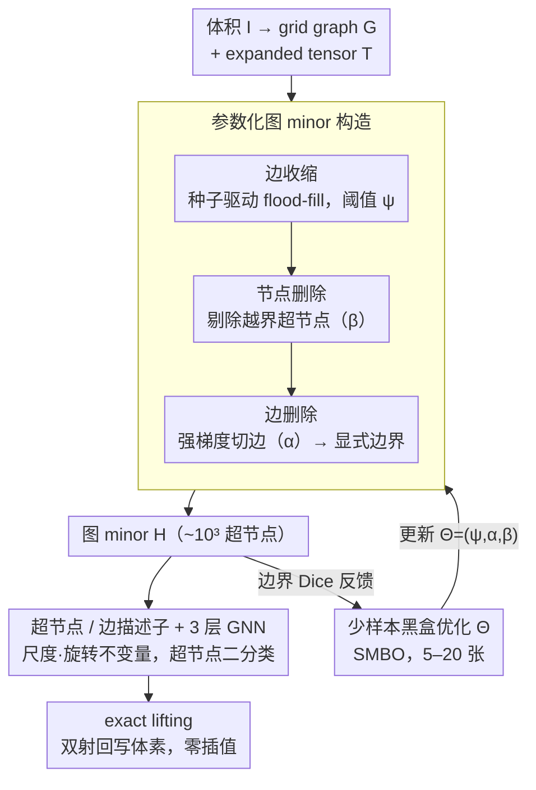

# SEMIR: Semantic Minor-Induced Representation Learning on Graphs for Visual Segmentation

**会议**: ICML 2026  
**arXiv**: [2605.12389](https://arxiv.org/abs/2605.12389)  
**代码**: 无（论文未提供仓库链接）  
**领域**: 医学图像分割 / 图神经网络  
**关键词**: 图 minor、少样本边界对齐、超像素、肿瘤分割、精确 lifting

## 一句话总结
SEMIR 把体素栅格当作母图 $G$，通过参数化的边收缩 / 节点删除 / 边删除把它压成一张「边界对齐」的图 minor $H$（节点数从 $\sim10^7$ 降到 $\sim10^3$），用 5–20 张少样本黑盒优化 $\Theta$ 最大化边界 Dice，再在 minor 上用 GNN 做超节点分类，最后通过 minor 与体素之间的双射 exact lifting 回到原栅格——在 BraTS / KiTS / LiTS 三大肿瘤分割任务的少数类 Dice 上稳定超过 nnU-Net，且仅需 16GB T4 GPU。

## 研究背景与动机

**领域现状**：医学体素图像分割主流是 U-Net / Swin-UNETR 等密集卷积 / Transformer 架构，预测在原栅格上做 voxel-wise softmax；为了在 $10^8$ 量级体素上跑得动，要么 patch 切片，要么先下采样，要么靠手工超像素（SLIC、Felzenszwalb）做预压缩。

**现有痛点**：(1) 密集推理的计算量与体素数挂钩、与解剖结构复杂度无关——肿瘤只占体积 < 1% 却要付 100% 的计算；(2) 类别极不平衡导致少数类（tumor、enhancing tumor）的梯度信号被稀释；(3) 现有超像素 / pooling 方法是「任务无关」的、靠低层灰度分组，与语义边界对不齐，且把预测映回体素时要插值，引入边界伪影。

**核心矛盾**：「能算」与「贴边界」之间存在结构性 trade-off。多类联合分割让所有结构竞争同一表示，又被空间尺度差异迫使在 loss 权重之间走钢丝。

**本文目标**：(1) 学一种「任务自适应、拓扑保持」的中间图表示，让推理代价随语义边界复杂度而非体素数缩放；(2) 必须支持 exact lifting，零边界伪影；(3) 必须能用极少样本（5–20）就把表示学好。

**切入角度**：图 minor 理论提供了正式工具——edge contraction 自然诱导 parent→child 的满射划分，每个 supernode 对应原图中一个连通子集，这正是「严格无重叠」的 partition。Robertson-Seymour 给出多项式可测性。

**核心 idea**：把图压缩本身当作要被「少样本学」的表示空间——参数 $\Theta=\{\psi,\alpha,\beta\}$ 控制 contraction/edge-deletion/node-deletion 三类操作，用黑盒优化在少样本上最大化边界 Dice，再在压缩图上做二分类 GNN，最后 lift 回体素。

## 方法详解

### 整体框架
SEMIR 想解决的是「密集 voxel 推理算不动、又对不齐语义边界」这对结构性矛盾，办法是不去优化分割网络、而去优化推理所在的图空间本身。一张体积 $I \in \mathbb{R}^{H \times W \times D \times C}$ 先被编成 $N$ 连通的 grid graph $G$，并存成一张 expanded tensor $T \in \{0,\dots,255\}^{(2H-1)\times(2W-1)\times(2D-1)}$——偶 index 存节点状态、奇 index 存边状态，单字节就够。整条 pipeline 是：用当前参数 $\Theta$ 把 $G$ 压成图 minor $H=S(T,\Theta)$，在 5–20 张少样本上用黑盒优化把 $\Theta$ 调到边界最对齐，再用调好的 minor 抽出超节点 / 边特征喂给一个 3 层 GNN 做超节点二分类，最后靠 $T$ 记录的双射把超节点标签直接刷回所属体素，整个回写零插值。

### 关键设计

**1. 参数化图 minor 构造：把体素栅格压成边界对齐、拓扑保持、可精确回写的稀疏图**

密集推理的痛点是计算量挂在体素数上而不是解剖复杂度上，而经典超像素又是任务无关、回写还要插值。SEMIR 用三个图算子级联来解决。先是种子驱动 flood-fill 的**边收缩**：把邻接体素 $p$ 合并到种子 $s$ 当且仅当 $\|I_p - I_s\|_n \le \psi$——关键是阈值相对的是种子而非当前超节点的滚动均值，这样低对比渐变区会保留成一串「相邻超节点链」而不是被全部塌成一坨。接着是**节点删除**，把面积 $a_v$ 或平均强度 $\bar{I}_v$ 越界的超节点剔掉（由 $\beta=(\beta_{\min}, \beta_{\max}, m_{\min}, m_{\max})$ 控制），顺手清掉采集噪声小点；删掉的区域背景默认填 0，所以是保守剔除而非制造假阳性。最后是**边删除**，若相邻超节点满足 $\|\bar{I}_{v_i}-\bar{I}_{v_j}\|_n > \alpha$ 就切断该边，这一步把强梯度变成显式的 cut，直接定义出分割边界。三个算子合起来既保拓扑又留出任务驱动调参的余地，而且有代数保证撑底：Lemma 3.1 保证每个超节点对应 $G$ 中一个连通子图（partition 严格无重叠），Theorem 3.2 保证回写是 exact 双射、零边界伪影——这正是几十年来超像素方法插值伪影痼疾的根治。

**2. 少样本黑盒优化 $\Theta$：把手工调超像素阈值换成数据驱动的边界对齐学习**

传统超像素的 $\psi$、$\alpha$、$\beta$ 都靠人手调，既不可解释也对不齐语义。SEMIR 把这组参数的搜索建模成对二值边界 Dice 的最小化，目标 $\Theta_{\text{opt}} = \arg\min_\Theta \mathbb{E}[1 - \text{DSC}(S_B(T,\Theta), Y_B)]$，其中边界 Dice 损失 $L(\hat{Y}_B, Y_B) = 1 - \frac{2|\hat{Y}_B \cap Y_B|}{|\hat{Y}_B| + |Y_B|}$，用 ExtraTrees 作 surrogate 的 SMBO 在 5–20 张标注上搜，监督信号 $Y_B$ 取自任务专属的语义边界图、与具体类别 ID 无关。它能用极少样本学好，是因为 $\Theta$ 不是某个固定网络的超参，而是参数化了一整族图同态 $\pi_\Theta: G \to H_\Theta$——每个 $\Theta$ 对应一种 partition，few-shot 搜的是 partition 结构本身。搜索空间因此天然受物理意义约束（三个参数都低维、都有解释），5–20 张就够，这正是「学结构」相对「学超参」的回报。

**3. 尺度 / 旋转不变的超节点 / 边描述子 + GNN 推断：让 GNN 在压缩图上对各向异性医学体积稳健预测**

CT / MRI 的 voxel spacing 各向异性，绝对几何量靠不住，所以描述子全部走不变量。每个超节点抽取体素数 $a_u$、每通道强度标准差 $\sigma_u$、强度协方差 $\Sigma_u$、由空间协方差最大特征向量给出的主轴方向 $d_u$、伸长度 $\text{elong}_u=\sqrt{(\lambda_{u,1}+\varepsilon)/(\lambda_{u,2}+\varepsilon)}$、边界长度 $b_u$、以及 3D 紧致度 $\text{comp}_u = 36\pi a_u^2/(b_u^3+\varepsilon)$；每条边则对相邻超节点用 log-ratio 算尺度不变的相对差异。log-ratio 与协方差特征向量天然提供 scale + rotation 不变性，而 compactness、elongation 配上 covariance 足以区分「血管样细长」与「肿瘤样团块」这类几何差异。这些特征喂进 3 层 GINE（hidden 128、Adam lr $10^{-3}$、在验证 Dice 上 early-stop），每个目标结构单独训一个超节点二分类器。

### 损失函数 / 训练策略
两个阶段的优化目标不同：minor 构造阶段是黑盒 SMBO，没有可微梯度，靠 surrogate 搜 $\Theta$；GNN 阶段则是标准的体素级 Dice / BCE（在 lift 回体素后比较）。每个目标结构（ET、TC、tumor、liver）独立构造 minor 并训一个二分类模型，整套多类分割就是把这些 per-target 结果用 confidence-weighted voting 或 energy minimization 合并——类别不平衡因此被「按构造」直接消掉，而不必在多类 loss 权重之间走钢丝。

## 实验关键数据

### 主实验（同等 split 与 nnU-Net 对照，binary target-vs-rest）

| 数据集 | 目标 | nnU-Net DSC | SEMIR DSC | 训练时长 |
|--------|------|-------------|-----------|-----------|
| BraTS | ET | 0.812 | **0.894 ± 0.006** | 43 h vs 2.5 h (T4) |
| BraTS | TC | 0.829 | **0.941 ± 0.002** | 39 h vs 1.6 h (T4) |
| KiTS | T | 0.720 | **0.819 ± 0.006** | 19 h vs 0.8 h (T4) |
| LiTS | T | 0.733 | **0.891 ± 0.007** | 11 h vs 0.6 h (T4) |

与已发表 SOTA 上下文对比（数据集自身协议，少数类 Dice）：BraTS ET 0.894 与 GTMamba (0.884) 接近并列；KiTS T 0.819 显著高于 ConvOccNet (0.693) 与 Swin UNETR (0.343)；LiTS T 0.891 高于多数 published baseline。

### 消融实验

BraTS ET / NWPU VHR-10 IoU：

| 消融 | BraTS ET | NWPU VHR-10 | 说明 |
|------|----------|-------------|------|
| Full SEMIR | 0.894 | 0.862 | 完整方法 |
| 去 edge contraction | 0.441 | 0.408 | minor 退化为体素图，碎片化 -51% |
| 去 edge deletion | 0.719 | 0.681 | 没有显式边界，超节点跨语义边 |
| 去 node deletion | 0.812 | 0.749 | 噪声 supernode 未被剪 |
| Learned $\Theta$ (5-shot) | 0.894 | 0.789 | 5 张就够 |
| Fixed 手调 $\Theta$ | 0.837 | 0.763 | few-shot 学到的 partition 更好 |
| 去 edge features | 0.725 | 0.741 | 相对几何信号缺失 |
| 去 spatial features | 0.661 | 0.629 | compactness / elongation 关键 |

### 关键发现
- minor 把推理节点从 $\sim10^7$ 降到 $\sim10^3$，复杂度随「语义边界复杂度」而非「体素分辨率」缩放；这也直接解释为何在 16GB T4 上能跑过需要 A100 才能比 SEMIR 慢 20×–60× 的 nnU-Net。
- 5 张样本就能让 few-shot $\Theta$ 优化跑赢人工最佳手调，证明 $\Theta$ 的有效假设空间很小且物理约束良好；这是「学结构」而非「学超参」的关键回报。
- 在非医学的 NWPU 航拍图上 small-object IoU 仍能拿 0.862（去 edge contraction 后掉到 0.408），说明 minor 构造对「小目标 + 高分辨率」类视觉问题具一般适用性。

## 亮点与洞察
- 把图论里的 graph minor 这种相对冷门工具搬到分割上，提供了「严格的拓扑保持 + 双射 lift」的代数底盘，做到了「无插值伪影」——这是经典超像素方法几十年来一直让人头疼的痼疾。
- 「不优化 segmentation 模型本身、而是优化 inference space」是非常深刻的视角：从根本上把 class imbalance 通过 per-target binary 拆解，并把任务自适应放到「partition」这一层而非「网络权重」这一层。
- expanded tensor $T$ 用单字节存节点 + 边状态、Rust 后端 flood-fill 在 CPU 一秒内构造 minor，工程上把「计算密集」与「数据密集」清晰解耦，GPU 收到的是预计算图 batch——这种 CPU-GPU 异步设计可以借鉴到其他需要稀疏化的视觉任务。

## 局限与展望
- 边界统计敏感性：在低对比、多模态融合不佳的区域，$\alpha$ 若选错就会让 minor 边界跑偏；few-shot 集若覆盖不到罕见病理形态，generalization 会受限。
- 当前 minor 构造与下游 GNN 解耦（modular），还没做端到端联合优化；伪随机 traversal 也引入轻微 run-to-run 抖动。
- 评测仅限 CT / MRI 体积影像，超声、病理这类色彩 / 噪声分布差异巨大的模态未验证；node deletion 的「丢弃异常区」对罕见病理可能误删，需在临床部署时配合医生 oversight。

## 相关工作与启发
- **vs nnU-Net**: 密集 voxel 推理 + 多类联合，在 minority class 上受 class imbalance 严重影响；SEMIR 通过 per-target binary minor 直接解掉，在 BraTS ET +8.2 / KiTS T +9.9 / LiTS T +15.8 个点。
- **vs SLIC / Felzenszwalb 超像素**: 任务无关、参数手调、lift 时要插值；SEMIR 提供 task-aware 黑盒优化 + exact lifting，且把「分组」做成可学习的 partition family。
- **vs DiffPool / MinCutPool**: 它们学软聚类、缺 lift 保证；SEMIR 用图同态的硬划分保证可逆，理论上更稳健。

## 评分
- 新颖性: ⭐⭐⭐⭐⭐ 第一次把 graph minor + few-shot 边界对齐用作 inference space representation learning。
- 实验充分度: ⭐⭐⭐⭐ 3 医学数据集 + nnU-Net 对照 + NWPU 跨域消融 + 完整 ablation；published SOTA 比较存在协议差异作者也明确标注。
- 写作质量: ⭐⭐⭐⭐⭐ 从「density vs structure」到 graph minor 理论、再到具体 contraction/deletion 算子、最后 Lemma + Theorem 一气呵成，叙事极清晰。
- 价值: ⭐⭐⭐⭐⭐ 让 16GB T4 跑赢需要 A100 的 nnU-Net，对资源受限的临床部署是真正 game-changing。

<!-- RELATED:START -->

## 相关论文

- [\[ICLR 2026\] SEED: Towards More Accurate Semantic Evaluation for Visual Brain Decoding](../../ICLR2026/medical_imaging/seed_towards_more_accurate_semantic_evaluation_for_visual_brain_decoding.md)
- [\[NeurIPS 2025\] SynBrain: Enhancing Visual-to-fMRI Synthesis via Probabilistic Representation Learning](../../NeurIPS2025/medical_imaging/synbrain_enhancing_visual-to-fmri_synthesis_via_probabilistic_representation_lea.md)
- [\[ICML 2026\] MedCRP-CL: Continual Medical Image Segmentation via Bayesian Nonparametric Semantic Modality Discovery](medcrp-cl_continual_medical_image_segmentation_via_bayesian_nonparametric_semant.md)
- [\[CVPR 2026\] Multimodal Causality-Driven Representation Learning for Generalizable Medical Image Segmentation](../../CVPR2026/medical_imaging/multimodal_causal-driven_representation_learning_for_generalizable_medical_image.md)
- [\[CVPR 2026\] Semantic Class Distribution Learning for Debiasing Semi-Supervised Medical Image Segmentation](../../CVPR2026/medical_imaging/semantic_class_distribution_learning_for_debiasing.md)

<!-- RELATED:END -->
