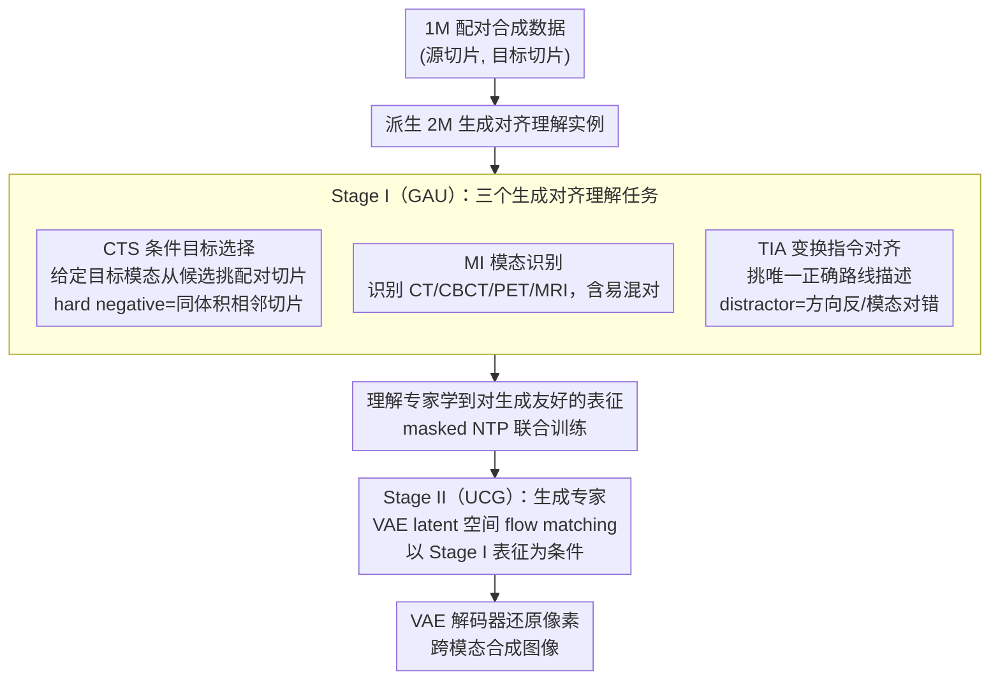

# SynerMedGen: Synergizing Medical Multimodal Understanding with Generation via Task Alignment

**会议**: ICML 2026  
**arXiv**: [2605.08724](https://arxiv.org/abs/2605.08724)  
**代码**: https://github.com/Mhilab/SynerMedGen (有)  
**领域**: 医学图像 / 多模态VLM / 跨模态合成  
**关键词**: 统一医学MLLM、生成对齐理解、跨模态合成、CTS/MI/TIA、SynerMed数据集

## 一句话总结
SynerMedGen 提出"生成对齐理解（generation-aligned understanding）"原则——把理解任务直接从同一份配对合成数据里派生出来（CTS / MI / TIA 三个任务），先两阶段训练让理解分支学到对合成有用的表征，再迁移到 latent flow matching 生成分支，在 22 个医学合成任务上同时碾压专用合成模型和已有统一 MLLM。

## 研究背景与动机

**领域现状**：医学统一 MLLM（如 HealthGPT、UniMedVL）开始把"理解"和"生成"塞进同一个模型——理解处理 VQA / 报告生成，生成处理 CT↔MR、PET↔CT 这类跨模态合成。架构上多走 dual-pathway 或 connector + diffusion 的混搭。

**现有痛点**：现有统一框架把理解和生成当作**互不相关的两个目标**：理解端用 lesion-level VQA 等"识别风格"任务训，生成端用 pixel-level 的合成 loss 训。结果就是模型在 VQA 上拿高分，但跨模态合成时该保留的解剖结构丢了、该改的对比度也没改对——supervision 完全没对齐。

**核心矛盾**：医学跨模态合成需要的"理解"是**slice-level 对应 + 模态识别 + 变换方向**，而传统理解 supervision 只给"全局语义"，两边的有用信息根本不重叠。

**本文目标**：回答一个"统一医学 MLLM 里被回避了的根本问题"——**什么样的"理解"才真正对生成有用？** 并据此设计具体的任务。

**切入角度**：既然要让理解服务于生成，那就**从生成数据本身派生理解任务**，让两边的训练信号天然耦合；同时坚持两阶段训练，把第一阶段学到的多模态先验通过共享参数自然迁移到生成阶段。

**核心 idea**：定义"生成对齐理解"原则 → 设计三个直接对应合成需求的理解任务（CTS 抓配对、MI 抓模态可控、TIA 抓变换方向） → 两阶段先理解后生成训练 → 同时放出 1M 配对样本 + 2M 理解实例的 SynerMed 数据集。

## 方法详解

### 整体框架
基于 Bagel 统一架构：一个理解 encoder $E_{\text{ViT}}$ 出语义 token $\mathbf{z}_{\text{ViT}}$，一个生成 encoder $E_{\text{VAE}}$ 出 latent token $\mathbf{z}_{\text{VAE}}$，两路 token 经 projection 进入共享的 Mixture-of-Transformer-experts（MoT）。MoT 含两个专家：理解专家做 VLM prompted 学习，生成专家做 conditional latent synthesis。整条 pipeline 先用 1M 配对合成数据派生出 2M 个理解实例（覆盖 CTS / MI / TIA 三类任务），再分两阶段训练：**Stage I（GAU）**在这三类生成对齐理解任务上训理解专家，**Stage II（UCG）**从 Stage I 初始化、在同一份配对数据上做 VAE latent 空间的 flow matching，VAE decoder 把生成的 latent 还原回像素。所有理解任务都形式化为"在理解专家上 prompted-生成短答案 token"，loss 是只在答案 token 上算的 masked NTP：$\mathcal{L}_{\text{NTP}}(\mathbf{y}^*)=-\sum_i\log p_\theta(y_i^*\mid \mathbf{y}^*_{<i},\mathbf{x}_{\text{text}},\mathbf{z}_{\text{ViT}})$。

### 关键设计

三个理解任务都从同一份配对合成数据里派生，分别对准跨模态合成需要的三类先验——内容（哪两张切片是一对）、模态（输入输出各是什么模态）、方向（该改什么该留什么）。

**1. Conditional Target Selection（CTS）：抓 slice-level 配对**

跨模态合成要逐切片保留患者特异的解剖与病灶，而传统 coarse VQA 只给全局语义，学不到 fine-grained 的切片对应。CTS 把这件事做成 multiple-choice prompt：显式给定目标模态 $m_{\text{tgt}}$ 的约束下，让模型从 $N$ 个候选里挑出与源切片 $x_{\text{src}}$ 真正配对的目标切片 $x^+=x_{\text{tgt}}$，输出正确选项字母，损失就是只在答案 token 上算的 $\mathcal{L}_{\text{CTS}}=\mathcal{L}_{\text{NTP}}(\mathbf{y}^*_{\text{CTS}})$。它有效的关键 trick 在 hard negative 的取法：不取随便切片，而取**同一目标体积里相邻 $\pm 1\sim\pm K$ 的切片**——这逼模型在细粒度解剖层面区分，没法靠"哦这是个 brain"这种粗语义糊弄过去。换成随机切片，任务就退化成粗语义识别，这个能力也就学不出来。

**2. Modality Identification（MI）：让模态成为显式可控因子**

跨模态合成需要把"目标模态"当成可控条件输入；如果理解阶段不把模态显式编码进表征，生成阶段就只能从纠缠的外观线索里硬抠。MI 用同样的 prompted-生成框架，让模型识别输入图像（或每个 panel）的模态——CT / CBCT / PET / MRI（可细到 MRI sequence）——直接输出模态标签，损失 $\mathcal{L}_{\text{MI}}=\mathcal{L}_{\text{NTP}}(\mathbf{y}^*_{\text{MI}})$。题库里故意塞进易混对（CT vs CBCT、近邻 MRI 对比度），逼模型抓住"模态"这一可控变量的真正特征，而不是学到表面 shortcut。

**3. Transformation Instruction Alignment（TIA）：把变换方向 grounding 到文本**

光有 slice 对应加模态识别还不够，模型仍可能搞不清"该改什么、该留什么"。TIA 给一对已配对图像 $(x_1, x_2)$，让模型从一组短描述里挑出唯一正确的"路线描述"（如 "CT→MRI: 改变对比度，保留解剖"），损失 $\mathcal{L}_{\text{TIA}}=\mathcal{L}_{\text{NTP}}(\mathbf{y}^*_{\text{TIA}})$。每条合成 route（有序模态对）维护一个描述池，正例 $e^+$ 从 ground-truth route 池抽，$R-1$ 个 distractor 从其他 route 抽——distractor 专门包含"方向反了"和"模态对错了"这两类常见混淆。这相当于直接训练"变换语义 grounding 到文本"，把合成路线变成模型显式知道的概念，而不是靠像素 loss 隐式碰运气。

### 损失函数 / 训练策略
**Stage I（GAU）**：理解专家在三任务上联合训练，总 loss $\mathcal{L}_{\text{Stage I}}=\mathcal{L}_{\text{CTS}}+\mathcal{L}_{\text{MI}}+\mathcal{L}_{\text{TIA}}$。**Stage II（UCG）**：生成专家在 VAE latent 上做 flow matching 条件合成，理解专家与共享 MoT 已被 Stage I 训得"对生成友好"，参数继续随生成训练微调。SynerMed 数据集含 1M 配对合成样本 + 2M 生成派生理解实例。

## 实验关键数据

### 主实验
在 SynthRAD2023（CBCT↔CT、MRI↔CT、PET↔CT 多部位）和 BraTS（T1/T2/T1c/FLAIR 四模态相互转换）共 22 个合成任务上对比，指标 SSIM（× 100）：

| 任务方向 | Pix2Pix | CycleGAN | BBDM | ResViT | SynDiff | RCD | HealthGPT | UniMedVL | **SynerMedGen** |
|----------|---------|----------|------|--------|---------|-----|-----------|----------|-----------------|
| Brain CBCT→CT | 66.17 | 53.32 | 71.09 | 85.00 | 85.47 | 85.97 | 57.37 | 51.48 | **87.15** |
| Pelvis CBCT→CT | 63.55 | 55.87 | 60.49 | 84.00 | 83.21 | 86.22 | 46.89 | 43.94 | **87.14** |
| Brain MRI→CT | 74.33 | 52.65 | 68.99 | 86.39 | 87.19 | 86.12 | 84.29 | 54.11 | **88.87** |
| Whole-Body CT→PET | 72.21 | 65.98 | 67.68 | 87.07 | 88.12 | 88.90 | 66.54 | 74.12 | **91.10** |
| BraTS T2→T1 | 59.34 | 57.19 | 56.77 | 86.94 | 88.31 | 88.01 | 60.13 | 77.26 | **90.58** |
| BraTS T1→T2 | 62.10 | 53.31 | 56.41 | 85.78 | 84.25 | 86.19 | 70.32 | 78.88 | **87.14** |

SynerMedGen 在所有 22 项里全部排第一，且对统一模型基线（HealthGPT、UniMedVL）的领先尤其大（普遍 +15~30 SSIM 分）。

### 消融实验

| 配置 | 平均 SSIM 趋势 | 说明 |
|------|----------------|------|
| Full SynerMedGen（CTS+MI+TIA → UCG） | 最优 | 三任务全开 |
| 只用传统 VQA-style 理解 → UCG | 显著掉点 | 验证"task misalignment"确实是病根 |
| 仅 Stage I（GAU），零样本生成 | 22 任务上已达**强 zero-shot** SSIM | 没训生成就能合成，证明理解阶段已把生成知识学到 |
| 去掉 CTS | slice-level 错位增加，合成解剖飘 | 配对约束关键 |
| 去掉 MI | 目标模态控制崩 | 模态可控因子缺失 |
| 去掉 TIA | 方向反转 / 改错地方 | 缺乏 route-level grounding |

### 关键发现
- **只训理解、不训生成**就能在 22 个合成任务上拿到强 SSIM——这是最 striking 的结果，直接证明"生成对齐理解"原则有效：理解阶段已经把生成需要的表征学到了，生成阶段只是把它"翻译"回像素。
- CTS 的 hard negative 设计（同体积相邻切片）是不可替代的，换成随机切片后任务退化为粗语义识别，合成性能大跌。
- 跨数据集 zero-shot 测试中，SynerMedGen 也保持优势，说明三任务派生的表征是真正模态/任务无关的通用先验。
- 统一 MLLM 基线（HealthGPT、UniMedVL）在 CBCT 这类对比度细微的合成上掉得最厉害，进一步佐证：单纯把生成头接到理解模型上而不对齐 supervision，等于白接。

## 亮点与洞察
- "理解任务必须从生成数据派生"是个**可迁移的设计原则**——任何"统一理解 + 生成"的工作（视频生成、3D 资产生成、代码生成）都可以套用：先想清楚"生成需要什么先验"，再反推出对应的理解任务，而不是默认拿 VQA / caption 凑数。
- 三任务分别对应"内容、模态、方向"三类先验，几何上覆盖了跨模态合成的全部必要维度，分工干净到几乎可作为**理解任务设计的 checklist**。
- "Stage I 单独就有强 zero-shot 生成"这一现象暗示：在统一模型里，理解和生成共享的不是 token 表征，而是**MoT 共享参数里隐含的多模态先验**——这给"理解-生成迁移"提供了一个具体可测量的实验证据。

## 局限与展望
- 仍只局限在跨模态切片合成；3D 体积、时序（4D-CT）等高阶任务尚未覆盖。
- 三任务都是 multiple-choice / classification 形式，更开放的生成-描述类理解（如详细影像报告）能不能进一步提升合成质量未探索。
- Stage I + Stage II 串行训练，对超大数据集训练成本不低；能否端到端联合训练值得探索。
- 跨机构/扫描仪的 domain shift 鲁棒性论文未深入测试，临床部署还需进一步评估。

## 相关工作与启发
- **vs HealthGPT**：HealthGPT 用任务特定 adapter 把理解和生成分别接上，但 supervision 不对齐；SynerMedGen 不增加 adapter，而是改 supervision 设计，性能差 15~30 SSIM 分。
- **vs UniMedVL**：UniMedVL 走"progressive learning curriculum"，但仍用传统理解任务；SynerMedGen 证明 curriculum 不够，supervision alignment 才是关键。
- **vs 通用领域 Bagel / Show-o / Janus**：这些工作的统一性更多在"架构层"，本文在"任务设计层"做对齐，思路正交且可叠加。

## 评分
- 新颖性: ⭐⭐⭐⭐⭐ "从生成数据派生理解任务"作为原则被首次显式提出且 instantiate 得很干净。
- 实验充分度: ⭐⭐⭐⭐ 22 个合成任务 + zero-shot + 未见数据集 + 大规模数据集开源，体量够。
- 写作质量: ⭐⭐⭐⭐ 三任务的设计动机用"内容/模态/方向"的三段论讲得很清楚。
- 价值: ⭐⭐⭐⭐ 给医学统一 MLLM 设立了新 SOTA，1M 配对 + 2M 理解的 SynerMed 数据集本身就是社区贡献。

<!-- RELATED:START -->

## 相关论文

- [\[CVPR 2026\] MedGRPO: Multi-Task Reinforcement Learning for Heterogeneous Medical Video Understanding](../../CVPR2026/medical_imaging/medgrpo_multi-task_reinforcement_learning_for_heterogeneous_medical_video_unders.md)
- [\[ICML 2026\] Seizure-Semiology-Suite (S³): A Clinically Multimodal Dataset, Benchmark, and Models for Seizure Semiology Understanding](seizure-semiology-suite_s3_a_clinically_multimodal_dataset_benchmark_and_models_.md)
- [\[ICML 2026\] CAME-Grad: The Double Dilemma in Multi-Task Radiology Report Generation — A Gradient Dynamics Analysis and Solution](the_double_dilemma_in_multi-task_radiology_report_generation_a_gradient_dynamics.md)
- [\[CVPR 2026\] MedGEN-Bench: Contextually Entangled Benchmark for Open-Ended Multimodal Medical Generation](../../CVPR2026/medical_imaging/medgen-bench_contextually_entangled_benchmark_for_open-ended_multimodal_medical_.md)
- [\[CVPR 2026\] CURE: Curriculum-guided Multi-task Training for Reliable Anatomy Grounded Report Generation](../../CVPR2026/medical_imaging/cure_curriculum-guided_multi-task_training_for_reliable_anatomy_grounded_report_.md)

<!-- RELATED:END -->
