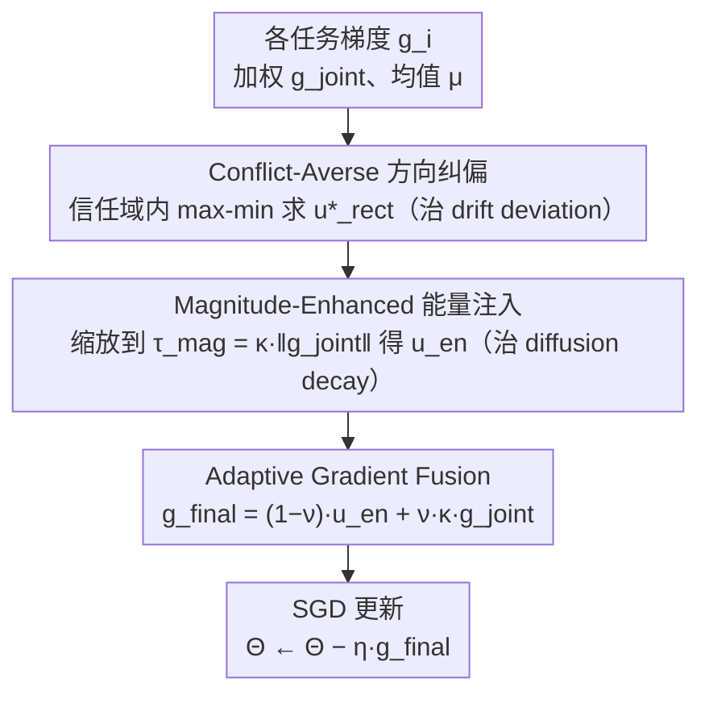

# CAME-Grad: The Double Dilemma in Multi-Task Radiology Report Generation — A Gradient Dynamics Analysis and Solution

**会议**: ICML 2026  
**arXiv**: [2605.22635](https://arxiv.org/abs/2605.22635)  
**代码**: https://github.com/vpsg-research/CAME-Grad  
**领域**: 医学图像 / 放射学报告生成 / 多任务优化  
**关键词**: 放射学报告生成, 多任务学习, 梯度冲突, SDE 分析, 即插即用优化器

## 一句话总结
本文用 SDE 框架分析放射学报告生成（RRG）多任务学习里"报告生成 vs 临床约束"梯度冲突的两面性——drift term 偏离 Pareto 最优 + diffusion term 衰减无法逃局部最优；提出 CAME-Grad 优化器（方向纠偏 + 能量注入 + 自适应融合）作为线性缩放的即插即用替代，在 MIMIC-CXR / IU X-Ray 上 8 个 RRG 方法平均临床效能 +2.3% / +1.9%。

## 研究背景与动机

**领域现状**：RRG（自动生成放射学报告）从单任务（仅 NLL 监督）演化到多任务学习——同时学报告生成 $\mathcal{L}_{rg}$（语言模型，需平滑语义流形）+ 辅助任务（疾病分类 / 图文对齐 / 检索增强，需离散刚性结构）。已有大量架构创新，但**优化端基本停留在静态线性加权** $\mathcal{L}_{joint} = \sum_i \omega_i \mathcal{L}_i$。

**现有痛点**：（1）报告生成要平滑、临床约束要硬边界，二者本质冲突——加强临床监督报告质量下降，反之则错过罕见病细节；（2）线性缩放无视梯度动力学，强行加权后任务相互拉扯；（3）已有多任务优化方法（CAGrad / PCGrad / MGDA）主要纠正方向，但忽视了振幅塌缩导致的探索不足——magnitude 倒了进不到平坦极小值。

**核心矛盾**：用 SDE 框架看，SGD 优化 $d\Theta_t = -\bm g_{joint}(\Theta_t) dt + \sqrt{\eta \Sigma}d\bm W_t$ 由 drift（一阶矩，决定收敛方向）和 diffusion（二阶协方差，提供探索逃局部）组成。梯度冲突同时导致 **drift deviation**（方向偏 Pareto 最优）+ **diffusion decay**（能量塌缩，逃不出 sharp minima）——单纯纠方向或单纯加振幅都不够，必须同时治。

**本文目标**：（1）从 SDE 视角揭示线性缩放在 RRG 失败的根因；（2）设计同时纠方向 + 增振幅的统一优化器；（3）做成 backbone-agnostic plug-and-play，免改架构。

**切入角度**：观察发现 RRG 任务间梯度内积为负的比例高达 53.8%（Figure 3），证实"内在冲突"假设；既然方向 + 振幅都坏，就把纠方向（CAGrad-like）和能量注入（梯度幅度放大）合一，再加自适应融合避免完全偏离原方向丢任务特定 inductive bias。

**核心 idea**：三阶段优化器——Conflict-Averse Direction Rectification（信任域内最大化最坏情况改善）→ Magnitude-Enhanced Energy Injection（放大梯度幅度逃 sharp minima）→ Adaptive Gradient Fusion（在纠后方向与原方向间软融合保任务先验）。

## 方法详解

### 整体框架

CAME-Grad 是一个即插即用的梯度优化器，直接替换 RRG 多任务训练里的静态线性加权。每一步它先算出各任务梯度 $\bm g_i$、加权梯度 $\bm g_{joint}$ 和均值 $\bm \mu$，再依次走三个阶段：先把所有任务的拉扯纠成一个"对最坏任务也有改善"的方向（治 drift deviation），再把这个方向的振幅放大、补回探索能量（治 diffusion decay），最后和原始 $\bm g_{joint}$ 软融合保住任务先验，得到 $\bm g_{final}$ 后做一次普通 SGD 更新 $\Theta \leftarrow \Theta - \eta \bm g_{final}$。整套逻辑对应 SDE 视角下"方向 + 振幅必须同治"的诊断结论。

### 关键设计

**1. Conflict-Averse 方向纠偏：在所有任务间找一个"最坏改善最大"的方向**

线性加权之所以失败，是因为报告生成和临床约束的梯度有 53.8% 的时间方向相反，强行求和后两个任务互相拉扯、偏离 Pareto 最优。这一阶段不再盲目加权，而是在均值梯度 $\bm \mu$ 附近的一个信任域里，找让"最坏任务改善最大化"的方向：$\max_{\bm u} \min_i \bm g_i^\top \bm u$ s.t. $\|\bm u - \bm \mu\| \leq \rho \|\bm \mu\|$，中心取均值 $\bm \mu$、半径取 $\rho \|\bm \mu\|$。直接解这个 min-max 在高维参数空间代价高，作者转成对偶形式 $\min_{\bm \alpha \in \Delta^{K+1}} \mathcal{F}(\bm \alpha) = \bm g_{\bm \alpha}^\top \bm \mu + \sqrt{\xi}\|\bm g_{\bm \alpha}\|$（$\xi = \rho^2 \|\bm \mu\|^2$），优化变量是 $K{+}1$ 维 simplex 上的权重，求出最优 $\bm \alpha^*$ 后纠偏方向有闭式解 $\bm u^*_{rect} = \bm \mu + \frac{\sqrt{\xi}}{\|\bm g_{\bm \alpha^*}\|} \bm g_{\bm \alpha^*}$。比起 CAGrad，它多了信任域硬约束把搜索锁在均值附近，既保收敛稳定又因为对偶维度低而几乎不增 GPU 开销；同时"对最坏任务也有改善"这一条保证了纠出来的方向是 Pareto 兼容的。

**2. Magnitude-Enhanced 能量注入：纠完方向还要把塌掉的探索能量补回来**

只纠方向有个隐患——任务冲突时合成梯度的振幅会塌缩，对应 SDE 里 diffusion term 的能量衰减，模型因此卡在 sharp minima 里出不来、错过罕见病细节。这一阶段把上一步的 $\bm u^*_{rect}$ 重新缩放到一个放大的目标振幅 $\tau_{mag} = \kappa \|\bm g_{joint}\|$（增益 $\kappa > 1$），得到 $\bm u_{en} = \bm u^*_{rect} \cdot \tau_{mag} / (\|\bm u^*_{rect}\| + \epsilon)$。相当于在 SDE 里把被压低的 diffusion coefficient 拉回正常水平，恢复 SGD 隐式偏好 flat minima 的正则化作用，让优化器有足够能量逃出局部最优；$\kappa$ 越大注入的探索能量越多。

**3. Adaptive Gradient Fusion：在纠偏方向和原方向之间留一个旋钮**

完全采纳纠偏方向也有代价：任务特定的结构信息（如某个分支的预训练知识）可能被抹掉。最后一步把能量注入后的方向和放大后的原始梯度做软融合 $\bm g_{final} = (1-\nu) \bm u_{en} + \nu (\kappa \bm g_{joint})$，其中 $\nu \in [0,1]$ 是任务先验权重——$\nu$ 趋 0 偏向全 Pareto 化，趋 1 偏向保留原始任务 bias，让使用者按场景在两者间权衡。

## 实验关键数据

### MIMIC-CXR 主实验（8 个 RRG 方法 + CAME-Grad）

| RRG 方法 | 基线 CE↑ | + CAME-Grad CE↑ | Δ |
|---------|---------|-------------|---|
| R2Gen | 35.7 | 38.4 | +2.7 |
| Multi-task R2Gen + DC | 38.1 | 40.6 | +2.5 |
| WCL | 39.0 | 41.5 | +2.5 |
| METransformer | 41.2 | 43.5 | +2.3 |
| KGAE | 40.8 | 42.9 | +2.1 |
| RGRG | 42.5 | 44.8 | +2.3 |
| PromptMRG | 43.7 | 46.0 | +2.3 |
| RECAP | 44.6 | 46.9 | +2.3 |
| **平均提升** | – | – | **+2.3** |

8 个方法一致受益（每个都 +2.1 到 +2.7 CE），证明 plug-and-play 通用性。

### IU X-Ray 平均提升 +1.9%（类似分布）

### 三阶段消融（MIMIC-CXR，PromptMRG 基线）

| 配置 | CE | Δ |
|------|----|---|
| 仅线性缩放（无 CAME）| 43.7 | – |
| + Direction Rectification | 44.6 | +0.9 |
| + Magnitude Injection | 45.4 | +0.8 |
| + Adaptive Fusion (完整) | **46.0** | +0.6 |

三阶段累加，每阶段都贡献 +0.6 到 +0.9 CE；说明三者各自不可替代。

### 梯度冲突量化（图 3）

跨多个 epoch 测 $\bm g_0$（生成）与 $\bm g_k$（临床）的内积——**53.8% 时间为负**，验证"内在冲突"假设。

### 关键发现
- **统一治 drift + diffusion 才有效**：单独纠方向（CAGrad）或单独加振幅都次优；本文同治+2.3 CE，单独方向 +0.9，单独振幅 +0.8——加起来 +1.7 但联合是 +2.3，说明协同效应
- **plug-and-play 通用性**：8 个不同架构 RRG 方法一致受益，说明问题是优化层面而非架构层面
- **53.8% 时间负相关**：定量证据冲突的普遍性，给 RRG 必须改优化器提供经验依据
- **MIMIC-CXR vs IU X-Ray 一致**：大小数据集都涨（+2.3 / +1.9），说明效应稳定

## 亮点与洞察
- **SDE 框架把多任务冲突"双重危害"形式化**：以往把多任务冲突当成"梯度方向问题"或"振幅问题"分别治；本文用 SDE 推导出 drift deviation + diffusion decay 是同一冲突的两面，必须同治——这套理论框架可推广到所有多任务/多目标 RL/RLHF 场景
- **信任域 + 闭式解 + GPU 友好**：CAGrad 的对偶方法在 simplex 上低维，避开 $\mathcal{O}(d)$ 高维操作；本文加信任域约束既保稳定又保 GPU 高效
- **plug-and-play 是真正实用**：不改架构、不重训、直接换优化器；这对已有 RRG 系统的升级路径友好
- **梯度冲突的医学诊断意义**：生成 vs 临床约束的冲突恰好对应"流畅自然语言 vs 罕见病细节"的临床现实矛盾——优化器纠这个冲突相当于在算法上调和了医学叙事的两个要求

## 局限性 / 可改进方向
- $\rho, \kappa, \nu$ 仍是手工超参；自适应调度（如按当前冲突强度动态调）会更好
- 仅在 RRG 验证；其他多任务医学应用（如 CT-报告 + 分割联合训练）的迁移未测
- 信任域中心是均值梯度 $\bm \mu$，对极不平衡任务数（如 1 个生成 + 10 个临床）可能偏；可考虑加权均值
- SDE 分析是连续时间近似，离散更新下的具体偏差未量化
- 训练时间开销报告偏少，对偶解虽然 GPU 友好但有额外 forward；超大模型上代价待评估

## 相关工作与启发
- **vs CAGrad / PCGrad / MGDA**：那些只纠方向不管振幅；CAME-Grad 同治两者
- **vs GradNorm / Uncertainty Weighting**：那些只调振幅不管方向；同样片面
- **vs 任务优先级方法（Liu 2021 / Jeong 2024）**：那些假设任务有静态优先级；CAME 是动态自适应
- **启发**：所有"多目标且目标在结构上冲突"的训练（RLHF + KL、安全 RL、多模态对齐）都可用 SDE 框架做诊断；CAME-Grad 模板可直接迁移

## 评分
- 新颖性: ⭐⭐⭐⭐ SDE 双重危害 framing 是新视角，方向+振幅同治也是首次系统化
- 实验充分度: ⭐⭐⭐⭐⭐ 2 数据集 × 8 RRG 方法 × 三阶段消融 × 梯度冲突可视化，一致结论
- 写作质量: ⭐⭐⭐⭐⭐ SDE 推导 → 算法 → 实验链条清晰，Figure 1 直观解释"双重危害"
- 价值: ⭐⭐⭐⭐ RRG 是高价值临床 NLP 任务；optimizer 级改进对所有 RRG 工作受用；理论框架可外推

<!-- RELATED:START -->

## 相关论文

- [\[CVPR 2026\] CURE: Curriculum-guided Multi-task Training for Reliable Anatomy Grounded Report Generation](../../CVPR2026/medical_imaging/cure_curriculum-guided_multi-task_training_for_reliable_anatomy_grounded_report_.md)
- [\[ICML 2026\] SynerMedGen: Synergizing Medical Multimodal Understanding with Generation via Task Alignment](synermedgen_synergizing_medical_multimodal_understanding_with_generation_via_tas.md)
- [\[CVPR 2026\] TIM: Temporal Decoupling with Iterative Mutual-Refinement Model for Longitudinal Radiology Report Generation](../../CVPR2026/medical_imaging/tim_temporal_decoupling_with_iterative_mutual-refinement_model_for_longitudinal_.md)
- [\[CVPR 2026\] OraPO: Oracle-educated Reinforcement Learning for Data-efficient and Factual Radiology Report Generation](../../CVPR2026/medical_imaging/orapo_oracle-educated_reinforcement_learning_for_data-efficient_and_factual_radi.md)
- [\[CVPR 2026\] BiOTPrompt: Bidirectional Optimal Transport Guided Prompting for Disease Evolution-aware Radiology Report Generation](../../CVPR2026/medical_imaging/biotprompt_bidirectional_optimal_transport_guided_prompting_for_disease_evolutio.md)

<!-- RELATED:END -->
