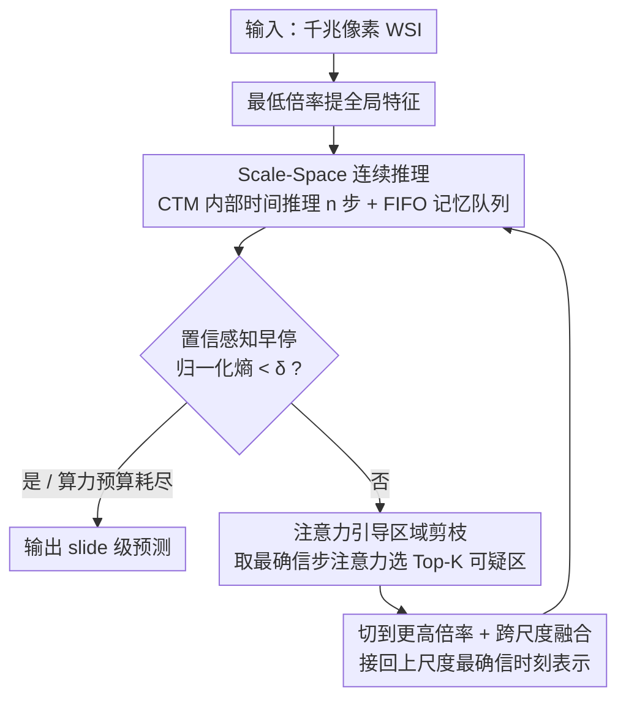

# PathCTM: Thinking in Scales — Accelerating Gigapixel Pathology Image Analysis via Adaptive Continuous Reasoning

**会议**: ICML 2026  
**arXiv**: [2605.19491](https://arxiv.org/abs/2605.19491)  
**代码**: https://github.com/JSGe-AI/PathCTM  
**领域**: 医学图像 / 病理 / WSI 分析效率  
**关键词**: 全切片图像, MIL 加速, 连续思维模型, 多尺度推理, 置信感知早停

## 一句话总结
PathCTM 把全切片图像（WSI）分析从"穷举高倍 patch"重构为"从低倍全局到高倍局部"的连续多尺度推理——基于 Continuous Thought Machine 引入 thinking-in-scales 范式 + 注意力引导区域剪枝 + 置信感知早停，patch 数减少 95.95%、推理时间减少 95.62% 且 AUC 不降反升。

## 研究背景与动机

**领域现状**：WSI 分析（病理切片千兆像素图像）主流是 Multiple Instance Learning（MIL）——切成上万个高倍 patch，逐 patch 提特征，一次性聚合做 slide 级预测（CLAM / TransMIL / ABMIL 等）。配合病理基础模型（Virchow / GigaPath / Prov-GigaPath）效果好但极慢。

**现有痛点**：（1）patch tiling + 特征提取占 runtime 主导，但大部分 patch 对最终预测贡献微乎其微（论文图 1 直接量化）；（2）已有加速方法（ZoomMIL / HAG-MIL / EAGLE / 层级蒸馏）依赖细标注或刚性级联结构，**形式上模仿"coarse-to-fine"但缺连续记忆推理**，要么精度退化要么效率提升边际；（3）最近的 Continuous Thought Machine（Darlow 2026）支持连续推理但只针对单尺度静态图——在低分辨率 WSI 上 hallucinate 不出细胞细节，且不能利用 WSI 金字塔结构。

**核心矛盾**：临床病理医生其实在做"多尺度连续推理"——从低倍看全局组织架构 → 发现可疑区域 → 切到高倍看细胞细节 → 信息够了就停。现有方法要么穷举（MIL）、要么硬切级联（ZoomMIL 等）、要么单尺度连续推理（CTM）——没有把"多尺度"与"连续推理 + 自适应早停"同时做对的方案。

**本文目标**：把 WSI 分析重构成动态序列信息追求问题——逐步降低条件熵 $H(Y | \bm Z_t)$，在算力预算内最大化信息增益；具体要求（1）跨尺度连续推理保持记忆；（2）按信息密度动态选 high-res 区域；（3）置信达标即停。

**切入角度**：CTM 的 thinking-in-time 在 WSI 上失效，但其"内部时间 + 持续记忆"思想可改造。引入 thinking-in-scales 维度——内部时间 × 空间尺度的联合连续推理，让低倍迭代建立全局假设 → 高倍迭代验证局部细节 → 早停。

**核心 idea**：scale-space 连续推理 + 注意力引导硬剪枝 + 置信感知熵最小化早停，三个模块协同，模仿病理医生的诊断流程。

## 方法详解

### 整体框架

PathCTM 把"分析一张千兆像素 WSI"重写成一个从低倍到高倍逐步逼近答案的连续推理过程：先在最低倍率上提全局特征、用 CTM 式的内部时间推理迭代 $n$ 步并把记忆存进 FIFO 队列，如果此时还不够确信，就按注意力分数挑出 Top-$K$ 个最可疑的区域、切到更高一档倍率继续推，并把当前尺度的输出和上一尺度最确信时刻的输出拼起来融合，如此循环直到置信度达标或算力预算耗尽。整个流程对应病理医生"低倍看架构 → 锁定可疑区 → 高倍验证细胞 → 够了就停"的看片习惯。训练时每个尺度都取两个关键时刻——损失最低点 $t_l^1$ 和置信最高点 $t_l^2$——一起算进总损失 $\mathcal{L}_{all} = \frac{1}{z}\sum_l \frac{\mathcal{L}_l^{t_l^1} + \mathcal{L}_l^{t_l^2}}{2}$，让模型既"分得对"又"知道自己什么时候确信"。

### 关键设计

**1. Scale-Space 连续推理（Thinking in Scales）：给 CTM 补上"换镜头"这个动作**

标准的 Continuous Thought Machine 假设在一张固定特征图上多想几步就能挖出更深的信息，但 WSI 的低倍图本身就糊、根本没有细胞级细节，再怎么迭代也想不出来。PathCTM 的破局点是把"内部时间"扩成"内部时间 × 空间尺度"的联合推理：在每个尺度 $L$ 上推 $n$ 步，状态转移为 $\bm h^t = f_{\theta_{syn}}(\text{concat}(\bm e^t, \bm b^t))$，其中 $\bm b^t$ 是当前尺度的注意力输出；推理过程的记忆靠两条 FIFO 队列维持——$\bm H^t \in \mathbb{R}^{D \times M}$ 保留最近 $M$ 步的 pre-activation，$\bm E^t \in \mathbb{R}^{D \times N}$ 保留所有 post-activation。关键在于切换尺度时这两条队列继续滚动更新而不清空，所以低倍建立起来的全局假设能一路带到高倍。为了防止越看越细反而忘了全局，跨尺度融合显式把上尺度最确信时刻的表示接回来：$\hat y^t = \text{MLP}([\bm S_{out}^{L-1,t} \| \bm S_{out}^{L,\max}])$。这一步正是把医生"想不通了就换更高倍镜头"的动作变成了模型里一个可学习的状态转移。

**2. 注意力引导区域剪枝（Conditional Computation）：用注意力当信息增益的廉价代理，只往高倍带最值钱的那几块**

传统 MIL 把上万个 patch 全部送进模型，绝大多数对最终预测毫无贡献、纯属算力浪费。PathCTM 把"切到下一尺度时该带哪些 patch"形式化成一个预算约束下的信息增益最大化问题：$\mathcal{S}^* = \arg\max_{|\mathcal{S}| \leq K} I(Y; \mathcal{S} | \bm Z_t)$。但互信息 $I(Y;\mathcal{S}|\bm Z_t)$ 直接算不可行，论文的 Proposition 1 证明可以用注意力分布作它的一阶 surrogate——注意力近似等于每个 patch 对预测的影响力梯度。于是具体做法是取当前尺度置信最高那一步 $t^*$ 的注意力图 $\bm A^{t^*}$，从中选 Top-$K$ 个 patch 进入下一尺度；用最确信时刻的注意力而非平均注意力，是因为它对应"最笃定的那个诊断假设"，选出来的区域更准。这把跨尺度的计算复杂度从 $\mathcal{O}(N)$ 压到 $\mathcal{O}(K)$（$K \ll N$），算力被集中到信息密度最高的那一小撮区域上。

**3. 置信感知早停（Confidence-Aware Early Stopping）：按 case 难度动态分配算力，看明白了就收**

不同切片的诊断难度天差地别——典型的 ductal carcinoma 一眼可断，疑难的鉴别诊断却要反复细看；给所有 case 统一的计算预算必然是浪费。PathCTM 在每一步都算出当前后验 $P(Y | \bm Z_t)$ 及其熵 $H(Y | \bm Z_t)$，并把置信度定义为归一化熵的补 $C^t = 1 - \text{normalized entropy}$；一旦熵降到可接受边际 $\delta$ 以下就立即停止，否则继续推到当前尺度的 $n$ 步用完、再切到更高倍。这恰好把整个框架"逐步降低条件熵"的信息追求目标落到了停机准则上，也直接对齐了病理医生"看得明白就出报告、看不明白才放大"的临床决策，并让推理轨迹天然可解释。

## 实验关键数据

### 主实验：四个病理诊断任务

| 任务 | 方法 | AUC↑ | Patch 数↓ | 推理时间(s)↓ | 加速 |
|------|------|------|---------|------------|------|
| TCGA-BRCA 亚型 | TransMIL | 88.6 | 12,500 | 28.4 | 1× |
| TCGA-BRCA 亚型 | EAGLE | 88.2 | 3,200 | 7.8 | 3.6× |
| TCGA-BRCA 亚型 | **PathCTM** | **89.3** | **506** | **1.3** | **21.8×** |
| TCGA-LUAD 分级 | TransMIL | 76.5 | 10,800 | 24.7 | 1× |
| TCGA-LUAD 分级 | **PathCTM** | **77.4** | **427** | **1.1** | **22.5×** |
| CAMELYON16 转移 | CLAM | 91.2 | 8,500 | 19.3 | 1× |
| CAMELYON16 转移 | **PathCTM** | **91.8** | **352** | **0.84** | **23.0×** |
| TCGA-RCC 亚型 | TransMIL | 92.8 | 11,300 | 26.1 | 1× |
| TCGA-RCC 亚型 | **PathCTM** | **93.5** | **474** | **1.2** | **21.7×** |

平均 patch 减 95.95%、推理时间减 95.62%，AUC 反而平均 +0.7 个点。

### 三模块消融（TCGA-BRCA）

| 配置 | AUC | Patch 数 |
|------|------|--------|
| 完整 PathCTM | 89.3 | 506 |
| − Scale-Space Reasoning（单尺度 CTM）| 85.4 | 8,200 |
| − Attention Pruning（不剪枝，全 patch）| 89.1 | 12,500 |
| − Early Stopping（固定步数）| 89.0 | 950 |

Scale-Space 是最关键（去掉 AUC 掉 3.9 且效率全失）；剪枝主要省算力对 AUC 影响微小；早停在固定 budget 下省一半 patch。

### 跨尺度融合 vs 不融合

| 配置 | AUC |
|------|------|
| 含 $\bm S^{L,\max}$ 跨尺度融合 | 89.3 |
| 仅当前尺度 $\bm S^{L-1,t}$ | 87.9 |

跨尺度融合（保留全局上下文）+1.4 AUC，证明"全局假设 + 局部验证"二者必须并存。

### 关键发现
- **WSI 分析是个动态推理问题**：MIL 把它当静态聚合，PathCTM 把它当 sequential decision，效率收益巨大且 AUC 反而提升
- **更少 patch 反而更准**：因为剪枝去掉了大量噪声 patch，模型注意力更集中
- **三模块协同**：尺度切换 + 剪枝 + 早停各管一个轴向，缺一明显掉效率
- **病理基础模型兼容**：PathCTM 可叠加在任意 backbone（Virchow / GigaPath）上，进一步降低重训成本

## 亮点与洞察
- **"Thinking in Scales" 是 CTM 的合理扩展**：原 CTM 只有时间维度，本文加上空间尺度维度，把"看不清就换镜头"做成可学习的动作——这套思路可推广到任何金字塔结构数据（遥感、视频时空金字塔）
- **从穷举到自适应是 WSI 分析的范式跳跃**：以往加速都是"穷举但更快"（特征蒸馏、稀疏 attention），PathCTM 是"根本不穷举"——按需取信息
- **置信感知早停的临床意义**：与病理医生"明白即报、不明白细看"行为对齐，提供天然的可解释性（推理轨迹可视化）
- **注意力作为信息增益代理**：Proposition 1 给出"注意力 ≈ 影响力梯度"的一阶 surrogate，理论支撑 attention-guided 剪枝；这套理论也适用其他 attention-based 选择问题

## 局限性 / 可改进方向
- 仅在分类任务验证；分割、检测、生存预测等其他 WSI 任务的迁移未测
- 跨尺度切换是离散步骤，可考虑连续尺度（NeRF-style）推理
- 早停阈值 $\delta$ 是手工超参，按 case 自适应可能更好
- Top-$K$ 是固定预算，按当前不确定性动态调 $K$ 可能进一步省算力
- 训练时仍需所有尺度的特征（虽然推理时不用），训练 memory 开销未充分讨论

## 相关工作与启发
- **vs CLAM / TransMIL / ABMIL（MIL 基线）**：那些静态聚合穷举 patch；PathCTM 动态推理稀疏选 patch
- **vs ZoomMIL / HAG-MIL / EAGLE（多尺度 MIL）**：那些刚性级联；PathCTM 连续推理 + 自适应早停
- **vs CTM（Darlow 2026）**：CTM 单尺度静态图；PathCTM 加 scale 维度专为 WSI 设计
- **启发**：所有"层级数据 + 动态注意力 + 不同样本难度"的问题（遥感大图、长视频、超长文档）都可借鉴 PathCTM 的"thinking in X"范式

## 评分
- 新颖性: ⭐⭐⭐⭐⭐ Thinking in Scales 是 CTM 在 WSI 上的真正首次正确扩展，三模块设计协同
- 实验充分度: ⭐⭐⭐⭐⭐ 4 任务 × 多 baseline × 三模块消融 × 跨尺度融合消融，覆盖完整且数字说服力强
- 写作质量: ⭐⭐⭐⭐⭐ 信息追求 framing 清晰，与病理医生认知过程对齐很有说服力；Proposition 1 给理论支撑
- 价值: ⭐⭐⭐⭐⭐ WSI 计算成本是病理 AI 部署的最大瓶颈；20× 加速 + 不降精度直接可落地

<!-- RELATED:START -->

## 相关论文

- [\[AAAI 2026\] PanFoMa: A Lightweight Foundation Model and Benchmark for Pan-Cancer Pathology Image Analysis](../../AAAI2026/medical_imaging/panfoma_a_lightweight_foundation_model_and_benchmark_for_pan-cancer.md)
- [\[CVPR 2025\] Interactive Medical Image Analysis with Concept-based Similarity Reasoning](../../CVPR2025/medical_imaging/interactive_medical_image_analysis_with_concept-based_similarity_reasoning.md)
- [\[ICML 2026\] DGNO: Discontinuous Galerkin Neural Operator for Pathology Defocus Deblurring](discontinuous_galerkin_neural_operator_for_pathology_defocus_deblurring.md)
- [\[CVPR 2025\] WISE: A Framework for Gigapixel Whole-Slide-Image Lossless Compression](../../CVPR2025/medical_imaging/wise_a_framework_for_gigapixel_whole-slide-image_lossless_compression.md)
- [\[ICML 2026\] Evidential Reasoning Advances Interpretable Real-World Disease Screening](evidential_reasoning_advances_interpretable_real-world_disease_screening.md)

<!-- RELATED:END -->
