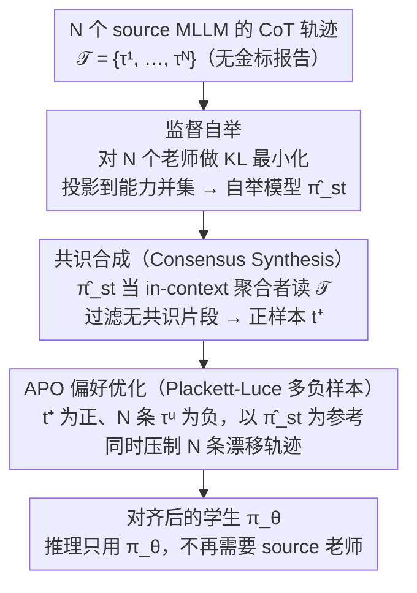

# Turning Drift into Constraint: Robust Reasoning Alignment in Non-Stationary Multi-Stream Environments

**会议**: ICML 2026  
**arXiv**: [2510.04142](https://arxiv.org/abs/2510.04142)  
**代码**: https://github.com/XiaoyuYoung/APO (有)  
**领域**: 医学图像 / 多模态VLM / 对齐RLHF  
**关键词**: 多源对齐, 概念漂移, 偏好优化, 胸片诊断, Plackett-Luce

## 一句话总结
本文把多个 MLLM 之间的推理"漂移"重新解释成 DPO 中的负样本约束，用 Plackett-Luce 偏好损失同时压制 N 个 source model 的发散轨迹，让 7B 学生模型在不需要 ground-truth 报告的前提下，仅用 10% 的 MIMIC-CXR 就在胸片分类与报告生成任务上超过所有 source teacher。

## 研究背景与动机

**领域现状**：把多个大模型当作 reasoning 老师，让一个学生模型同时蒸馏多份 CoT 轨迹，是当前多源对齐和"集体智能"方向的标准玩法。在医学问答这种专业领域，靠多老师互补几乎是默认配方。

**现有痛点**：作者发现，不同 source MLLM 的推理分布天生发散——比如 Qwen-VL-Max 偏向精确简短，GPT-4o 偏向召回率高、罗嗦。把这些异质轨迹直接拼起来去 SFT，学生不会自动吸取各家长处，反而把所有人的 bias 一股脑学下来，导致幻觉和语义不一致。

**核心矛盾**：源模型之间的多样性既是收益（覆盖更广）也是风险（互相冲突）。现有工作把冲突当噪声平均掉，但实际上这些冲突区域才包含最有信息量的"决策边界"，平均化反而把信息抹掉了。

**本文目标**：在 source 模型 reasoning 轨迹不停漂移、且没有 ground-truth 监督的情况下，让学生模型学到一个鲁棒的 reasoning manifold；同时还得证明这种漂移能被显式利用而不是单纯当噪声处理。

**切入角度**：把多源 reasoning 的演化套进 concept drift 理论框架——把 CoT 的自回归步骤映射成漂移理论里的"时间轴"，于是多模型之间的发散就成了一个非稳态的多流环境。在这个视角下，发散区域其实定义了"应该避开的东西"。

**核心 idea**：用 source 模型之间的共识做正样本，用每个 source 自己漂出去的轨迹做负样本，扩展 DPO 到 Plackett-Luce 多负样本形式，让 drift 从噪声变成"主动 unlearn 的监督信号"。

## 方法详解

### 整体框架
APO 把"多个老师互相打架"这件麻烦事拆成两阶段消化。第一阶段（Supervised Bootstrapping with Consensus Synthesis）先用所有 source 模型的推理轨迹做监督蒸馏，把目标模型 $\pi_\theta$ 投影到 source 能力并集里得到 $\hat{\pi}_{st}$，再让 $\hat{\pi}_{st}$ 自己充当 in-context aggregator，从同一题的 N 条 source 轨迹 $\mathcal{T}=\{\tau^1,\ldots,\tau^N\}$ 里炼出一条自洽的共识轨迹 $t^+$。第二阶段（Constraint-Aware Optimization）拿 $t^+$ 当唯一正样本、那 N 条原始 source 轨迹当 N 个负样本，做 Plackett-Luce 偏好优化，把学生从老师们的发散区域里"推"出来。推理时只用最终 $\pi_\theta$，不再需要任何 source 老师。

### 关键设计

**1. 概念漂移视角下的多流推理建模：先证明"为什么不能简单拼起来蒸馏"**

直接把 N 个老师的 CoT 堆在一起做 SFT，学生会把所有人的 bias 一股脑学下来——但要把这个直觉说成理论，得先回答"老师之间的发散到底是什么"。本文假设 N 个 source 模型条件独立生成 CoT，把第 $j$ 步的联合分布因子化成 $P_j(\mathcal{S}_j)=\prod_{u=1}^N P(t_{<j}^u|v,l) \cdot P(z_j^u|t_{<j}^u,v,l)$，前一项是历史累计的发散、后一项是当前步的瞬时漂移。当 $P_j(\mathcal{S}) \neq P_{j+\Delta}(\mathcal{S})$ 时就出现了 concept drift，意味着学生沿着推理步往前走时，看到的监督信号本身就在飘。传统蒸馏默认老师给的是稳定 ground-truth，而这个因子化恰好证明老师之间会随推理推进出现非稳态分歧，于是 naive SFT 必然继承所有人的 bias——换框架是必须的，而不是可选的优化。

**2. Consensus Synthesis：在没有金标的情况下自己造一个正锚点**

第二阶段的偏好优化需要一条"该往这里靠"的正样本，但医学场景里没有 radiologist report 可用，正样本只能凭空造。做法是利用 bootstrap 后的 $\hat{\pi}_{st}$ 已经吸收了 source 并集知识这一点：把同一样本下 N 条 source 轨迹拼成上下文喂回 $\hat{\pi}_{st}$，让它当一个"带语义理解的加权聚合者"，生成 $t^+ \sim \hat{\pi}_{st}(\cdot|v,l,\text{Context}=\mathcal{T})$——保留各家共同支持的 token，过滤掉缺乏 cross-model 支持的 incoherent 片段。这本质上是用 in-context 能力做隐式投票，但和 token 级 majority vote 的关键区别在于它是轨迹级、带语义的精炼，且完全由学生自己产出，所以能无监督迭代、不花一分钱标注。

**3. Plackett-Luce 多负样本 APO 损失：把"主动遗忘 N 个 bias"写进一阶训练目标**

有了一个正样本 $t^+$ 和 N 个负样本 $\{\tau^u\}$，剩下的问题是怎么同时压制这 N 条发散轨迹——standard DPO 一次只吃一对正负，而源漂移天生是 1:N 的多模冲突。APO 用 bootstrap 后的 $\hat{\pi}_{st}$ 当 reference policy，定义隐式奖励 $r(v,l,t)=\beta \log \frac{\pi_\theta(t|v,l)}{\hat{\pi}_{st}(t|v,l)}$，再把 DPO 的二元偏好推广成 Plackett-Luce 形式：

$$P(t^+ \succ \mathcal{T}|v,l)=\frac{\exp(r(v,l,t^+))}{\exp(r(v,l,t^+))+\sum_{u=1}^N \exp(r(v,l,\tau^u))}$$

最终 loss 为 $-\mathbb{E}[\log P(t^+ \succ \mathcal{T}|v,l)]$，优化时把 $t^+$ 的概率往上推、同时把每条 $\tau^u$ 的概率往下压。这样一次更新就把整组负样本当成竞争假设统一处理，把"主动遗忘 N 个 bias"变成显式的一阶目标——既比逐对 DPO 高效，也正好对应 drift-as-constraint 的几何直觉：发散区域不是要调和的噪声，而是要避开的约束边界。

### 损失函数 / 训练策略
两阶段串行训练：阶段 1 是 KL 最小化的 SFT，$q^* = \arg\min_q \sum_u \mathbb{D}_{\text{KL}}(\pi_u || q)$；阶段 2 是上面的 APO 目标。模型用 Qwen2.5-VL 7B，每阶段只跑 1 epoch、batch size = 2。数据用 CXR-MAX——只取 1/10 MIMIC-CXR（约 17 万条多老师 reasoning trajectory，覆盖 14 种胸部病种），不使用任何 radiologist report，完全靠 multi-teacher 漂移当监督。

## 实验关键数据

### 主实验

| 数据集 | 任务 | 指标 | 本文 7B | 之前 SOTA | 提升 |
|--------|------|------|---------|-----------|------|
| MS-CXR-T | 多标签分类（5 类平均） | Top-1 Acc | 0.78 | 0.69 (CoCa-CXR) | +0.09 |
| MS-CXR-T | Pneumothorax | Top-1 Acc | 0.96 | 0.73 | +0.23 |
| MS-CXR-T | Consolidation | Top-1 Acc | 0.84 | 0.70 | +0.14 |
| MIMIC-CXR | 报告生成 | BLEU-1 | 0.56 | 0.43 (CPO) | +0.13 |
| MIMIC-CXR | 报告生成 | ROUGE-L | – | 0.42 (CPO) | 提升 |

注意：本文只用 10% 数据 + 没用 radiologist report，对比方法用全量 + 报告。

### 消融实验

| 配置 | 关键现象 | 说明 |
|------|---------|------|
| 仅 Supervised Bootstrap | 继承 source bias，幻觉显著 | 验证"naive 蒸馏 = 学一堆 bias"的 Observation 1.2 |
| Bootstrap + DPO（pairwise） | 部分提升但不及多负样本 | 说明 Plackett-Luce 多负约束的必要性 |
| 完整 APO（PL 多负样本） | 平均 0.78 | drift-as-constraint 比单独 consensus 训练更稳 |
| Source 老师本身 | 平均低于学生 7B | 学生超过老师，证明 ensemble + 反向约束的合力效果 |

### 关键发现
- **Pneumothorax 大幅领先（+0.23）**：这类病症胸膜线非常细微，单个 source 模型都不确定，互相之间漂移最大，APO 把这些不确定区域当负约束压下去后，反而锐化了对关键视觉线索的敏感度。
- **Edema 略低**：高方差漂移类被 APO 当成"该避开"区域，模型趋向保守，牺牲了一些 recall 换取安全性，作者承认这是 trade-off。
- **7B 学生超越所有 source teachers（包括 GPT-4o、Qwen-VL-Max）**：说明 consensus + 显式 unlearn drift 的组合，确实比任何单老师的"标注质量"更强。

## 亮点与洞察
- **drift-as-constraint 这个视角很巧**：把 multi-teacher 蒸馏中最让人头疼的"老师之间打架"问题，从"该如何调和"翻转为"正好用作显式 negative constraint"，一招同时解决了无监督和鲁棒性两个难题。
- **从 DPO 走到 Plackett-Luce 是顺水推舟**：DPO 框架天然要正负对，而 multi-source 场景天生就是 1:N 的偏好，PL 扩展是几乎"应该这样"的推广，但作者第一个把这套理论嫁接到 multi-teacher 蒸馏上。
- **自监督 alignment 思路可迁移**：任何"多个老师吵架但缺金标"的场景（多个 LLM judge 互评、跨模型 reward 合成、多 retriever 排序）都能套这套框架——consensus 当正，individual divergence 当 N 个负。

## 局限与展望
- **依赖 consensus 可提取性**：当老师们的轨迹几乎没有共识时（极端高方差任务），in-context 提取出来的 $t^+$ 本身就不可信，APO 训练信号会塌。
- **Plackett-Luce 损失中所有 source 同权处理**：实际上 GPT-4o 和小模型的可信度不一样，未来可考虑给负样本加权，或者按动态置信度调整。
- **实验集中在胸片**：是否在更广义的 multi-source reasoning 任务（数学、代码）上也成立，尚需验证。
- **CXR-MAX 数据集本身依赖现有 MLLM 推理**：随着 MLLM 升级，漂移模式会变，benchmark 可能需要持续滚动更新。

## 相关工作与启发
- **vs DPO (Rafailov 2023)**: DPO 用静态外部偏好标注做 pairwise；APO 自动构造偏好对、用 PL 多负样本、且显式以 active unlearning 为目标，三个维度都对 DPO 做了扩展。
- **vs WeakLM 蒸馏 / FUSE-style multi-teacher**: 它们要么平均、要么挑最强老师；APO 反其道而行——专门利用老师之间的发散区域当训练信号。
- **vs Self-Refine / 自我一致性投票**: self-consistency 只在推理阶段做 majority vote，不改模型参数；APO 把这一思路前移到 RL/preference learning 阶段，且利用"少数派"轨迹做约束而非丢弃。

## 评分
- 新颖性: ⭐⭐⭐⭐⭐ drift-as-constraint 的视角翻转 + DPO → Plackett-Luce 的延展，思路非常漂亮
- 实验充分度: ⭐⭐⭐⭐ MS-CXR-T 上多病种横向对比 + 报告生成多指标，但消融可再细些
- 写作质量: ⭐⭐⭐⭐⭐ 理论铺陈与方法过渡严丝合缝，公式与 Observation 互相呼应
- 价值: ⭐⭐⭐⭐⭐ 对多 teacher 蒸馏 / 无金标对齐 / 医学 VQA 三个方向都有直接启发，CXR-MAX 也是稀缺资源

<!-- RELATED:START -->

## 相关论文

- [\[CVPR 2026\] CG-Reasoner: Centroid-Guided Positional Reasoning Segmentation for Medical Imaging with a Robust Visual-Text Consistency Metric](../../CVPR2026/medical_imaging/cg-reasoner_centroid-guided_positional_reasoning_segmentation_for_medical_imagin.md)
- [\[AAAI 2026\] DiA-gnostic VLVAE: Disentangled Alignment-Constrained Vision Language Variational AutoEncoder for Robust Radiology Reporting with Missing Modalities](../../AAAI2026/medical_imaging/dia-gnostic_vlvae_disentangled_alignment-constrained_vision_language_variational.md)
- [\[ICML 2026\] SynerMedGen: Synergizing Medical Multimodal Understanding with Generation via Task Alignment](synermedgen_synergizing_medical_multimodal_understanding_with_generation_via_tas.md)
- [\[CVPR 2026\] Dynamic Stream Network for Combinatorial Explosion Problem in Deformable Medical Image Registration](../../CVPR2026/medical_imaging/dynamic_stream_network_for_combinatorial_explosion_problem_in_deformable_medical.md)
- [\[ICML 2026\] Evidential Reasoning Advances Interpretable Real-World Disease Screening](evidential_reasoning_advances_interpretable_real-world_disease_screening.md)

<!-- RELATED:END -->
