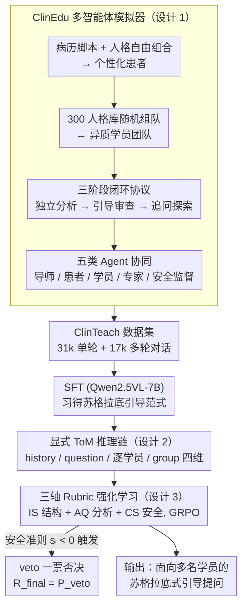

# ClinTutor-R1: Advancing Scalable and Robust One-to-Many Alignment in Clinical Socratic Education

**会议**: ICML 2026  
**arXiv**: [2512.05671](https://arxiv.org/abs/2512.05671)  
**代码**: https://github.com/Zhitao-He/ClinTutor-R1  
**领域**: 医疗NLP
**关键词**: 临床教育, 一对多对齐, 苏格拉底式教学, 多智能体模拟, 视觉语言模型  

## 一句话总结

提出 ClinTutor-R1，首个面向临床苏格拉底式教学的一对多对齐视觉语言 Agent，通过多智能体模拟器 ClinEdu 构建 48k 对话数据集 ClinTeach，利用显式心智理论推理和三轴 rubric 强化学习，在学员扩展至 10 人时仍保持教学质量稳定，超越基线模型 20% 并达到 GPT-4o 水平。

## 研究背景与动机

**领域现状**：当前 LLM 对齐技术（如 RLHF）已在一对一交互场景中取得显著成功，但现实世界中许多场景需要 AI 同时服务多个用户，如临床查房中一位导师需同时指导多名学员。

**现有痛点**：现有模型在一对多场景下面临两大核心问题：(1) **上下文稀释**（context dilution）——随着学员增多，模型逐渐失去对个体认知状态的追踪能力；(2) **目标错位**（goal misalignment）——难以在个性化指导和集体学习进度之间取得平衡。实验表明，基线模型在学员超过 3 人后出现"性能悬崖"，质量下降近 15%。

**核心矛盾**：标准对齐方法只优化单个用户的奖励信号，缺乏心智理论（Theory of Mind）建模能力，无法同时维护每个学员的认知状态并协调群体共识，这在需要兼顾安全性和教学深度的临床场景中尤为致命。

**本文目标**：构建可扩展的一对多对齐框架，使 AI 导师在学员规模增长时仍能提供高质量的苏格拉底式个性化教学。

**切入角度**：作者选择临床查房作为测试床——该场景天然具备异质认知状态（新手到高年资住院医师）和临床-教学双重目标（深度推理 vs 安全底线），是一对多对齐问题的理想实验环境。

**核心 idea**：通过多智能体模拟器生成大规模教学对话数据，结合显式 ToM 推理机制和分轴 rubric 强化学习，训练能够在一对多场景下保持稳定教学质量的视觉语言 Agent。

## 方法详解

### 整体框架

这篇论文要解决的是「一位 AI 导师同时带多名学员」时的对齐难题：学员一多，模型就追踪不住每个人的认知状态、也协调不好群体进度。ClinTutor-R1 把整条链路拆成三块来应对——先用多智能体模拟器 **ClinEdu** 生成临床查房场景的高保真教学对话，攒出 48k 对话的 **ClinTeach** 数据集（31k 单轮 + 17k 多轮）；再以此对 Qwen2.5VL-7B 做 SFT，让模型学会苏格拉底式引导（含「先想后说」的 ToM 推理）的基本范式；最后用三轴 rubric 强化学习打磨它在学员规模变化下的动态适应力。模型吃进临床病例（文本 + X 光/CT 等医学影像），吐出面向多名学员的引导式提问。

### 关键设计

**1. ClinEdu 多智能体模拟器：用解耦合成绕开真实数据的稀缺与隐私墙**

真实临床教学对话受隐私法规限制、又天然稀缺，靠静态模板拼出来的数据又抓不住群体里涌现的教学冲突。ClinEdu 的破解办法是把患者拆成两层——客观的病历脚本（Patient Script）和主观的人格（Persona），两者自由组合就能裂变出近乎无限的临床场景。学员侧则从 300 个人格库里随机采样组队，每名学员带着不同的知识水平、认知风格和学习方式入场。整个交互跑一个三阶段闭环协议：学员先各自独立分析病例，导师据此给出苏格拉底式引导（并经专家 Agent 和安全监督 Agent 双重审查），学员再发起追问探索。导师、患者、学员、专家审核、安全监督五类 Agent 协同，让合成数据既高保真又自带安全过滤。

**2. 显式心智理论（ToM）推理：先为每个学员单独「想一遍」再开口**

上下文稀释的根子，是多名学员的信息在长上下文里混成一团、模型再难分清谁卡在哪。ClinTutor-R1 的对策是「先想后说」：生成引导前先走一段结构化内部推理，把多智能体交互显式拆成独立的个体分析。推理链分四维——`<think history>` 追对话进度，`<think question>` 对齐教学目标，`<think student student_id="X">` 给每名学员各写一条独立推理轨迹、逐个判断他此刻理解到哪，`<think group>` 再综合群体、识别集体盲区。关键就在那条 per-student 的独立轨迹：学员增多时，每个人都有自己专属的心智模型，信息不再彼此覆盖；这些轨迹同时还是可回看、可审计的教学决策线索。

**3. 三轴 Rubric 强化学习：把「教学灵活」和「安全刚性」分轴评分，再用 veto 守底线**

SFT 只学到范式，面对真实多样的学员输入还不够灵活；而单一整体评分又会把「教学策略可以百花齐放」和「安全必须寸步不让」这两种相反的需求糊在一起。于是奖励沿三轴分解：**结构保真度** IS（推理标签是否完整、提问是否够苏格拉底）、**分析质量** AQ（个体评估的深度、群体综合的能力）、**临床安全** CS（事实正确性、安全优先级）。最关键的是 veto 一票否决机制——当安全相关准则 $\{CS\text{-}1, CS\text{-}2, IS\text{-}1\}$ 里任一项得分 $s_i < 0$，最终奖励直接被压成一个大负值 $R_{\text{final}} = P_{\text{veto}}$，无论其他维度多漂亮都救不回来。策略用 GRPO 算法优化。这样安全是硬地板而非可交易的软分量，模型很快就摸清边界（早期探索触发率 8–12%，稳定后降到 <2%），同时苏格拉底教学该有的多样性不被压死。

## 实验关键数据

### 主实验

| 模型 | MedXpertQA Avg | MVME Avg | MSM (MedXpert) | MSM (MVME) |
|------|---------------|----------|----------------|------------|
| LLaVA-v1.6 | 5.87 | 5.56 | 6.15 | 5.74 |
| Qwen2.5VL (基线) | 6.96 | 6.83 | 7.04 | 7.13 |
| TutorRL | 7.42 | 7.13 | 7.49 | 7.01 |
| Med-SocraticLM | 7.41 | 7.28 | 7.33 | 7.18 |
| GPT-4o | 8.36 | 8.47 | 8.26 | 8.39 |
| o3 | 8.42 | 8.45 | 8.18 | 8.23 |
| **ClinTutor-R1** | **8.35** | **8.49** | **8.41** | **8.55** |

ClinTutor-R1 在 MVME 上超越 GPT-4o（8.49 vs 8.47），在多学员管理（MSM）维度上以 8.55 显著优于 GPT-4o 的 8.39。人类专家评估中 ClinTutor-R1 平均得分 8.73，超过 o3 的 8.41；200 人真实用户研究中推荐意愿评分 8.70，显著领先。

### 消融实验

| 配置 | MedXpertQA Avg | MVME Avg | 说明 |
|------|---------------|----------|------|
| Full model | 8.35 | 8.49 | 完整模型 |
| w/o RL | 7.69 | 7.58 | 去掉 RL 后掉 0.66/0.91，最大降幅 |
| w/o Thinking | 7.94 | 7.79 | 去掉 ToM 推理链掉 0.41/0.70 |
| w/ Vanilla reward | 8.01 | 7.88 | 单一奖励替代三轴 rubric |
| w/o reward veto | 7.87 | 8.03 | 去掉 veto 后 MPS 暴跌（8.26→6.92） |
| w/ One-Student | 7.86 | 7.69 | 仅单学员训练，泛化能力差 |

### 关键发现

- **RL 贡献最大**：去掉强化学习导致最大性能下降，表明 SFT 不足以学会动态适应多样学员输入
- **Veto 机制对安全至关重要**：移除 veto 后 MPS（医学安全）维度从 8.26 暴跌至 6.92，说明无硬约束时策略会学到"奖励 hacking"行为
- **可扩展性优势**：学员从 1 扩展到 10 人时，ClinTutor-R1 平均分保持在 8.20 以上，而 Med-SocraticLM 在 3 人后下降 15%
- **纠错能力**：在错误注入实验中，ClinTutor-R1 的纠错成功率（CSR）达到 88.50%，在过早闭合（89.10%）和安全伦理风险（88.60%）类别上尤为突出

## 亮点与洞察

- **ToM 推理的显式解耦**：为每个学员写独立的 `<think student>` 推理轨迹，是解决一对多场景中上下文稀释问题的优雅方案。这种"先想后说"的设计不仅提升性能，还使 AI 导师的决策可审计、可解释
- **Veto 机制的"安全地板"设计**：将安全视为硬约束而非软奖励分量，既保证了临床安全底线，又不压制教学策略多样性。Veto 触发率从 12% 快速降至 2%，说明策略确实学会了安全边界而非被动约束
- **解耦式数据生成**：Patient Script/Persona 解耦思路可迁移到任何需要角色扮演训练数据的场景（如法律咨询、团队管理培训），通过自由组合实现数据多样性的指数级增长

## 局限与展望

- 感知范围仅限文本和静态医学影像（X 光、CT），不支持真实查房中的动态环境感知（如患者表情、体检操作）
- 模拟器数据虽然高保真，但与真实课堂环境仍有差距（真实学员的注意力分散、情绪波动等未建模）
- 训练和评估主要基于 MedXpertQA 数据源，跨医疗体系（如非 USMLE 标准）的泛化能力待验证
- 可探索将 ToM 推理机制与在线学习结合，使模型在真实交互中持续更新对学员的认知模型

## 相关工作与启发

- **SocraticLM**（Liu et al., 2024b）：Dean-Teacher-Student 多智能体管线生成数学教学对话，但仅限单学员场景
- **TutorRL**（Dinucu-Jianu et al., 2025）：RL 框架平衡教学引导与答案泄露，但未处理多学员管理
- **MEDCO**（Wei et al., 2024）：多智能体临床团队模拟，但患者-医生一对一映射，未解耦 Script/Persona
- 本文的三轴 rubric + veto 强化学习框架可推广至任何需要多维质量约束的 RLHF 任务（如代码生成的正确性-安全性-可读性多轴评估）

<!-- RELATED:START -->

## 相关论文

- [\[ACL 2026\] CURA: Clinical Uncertainty Risk Alignment for Language Model-Based Risk Prediction](../../ACL2026/medical_nlp/cura_clinical_uncertainty_risk_alignment_for_language_model-based_risk_predictio.md)
- [\[ACL 2026\] PrinciplismQA: A Philosophy-Grounded Approach to Assessing LLM-Human Clinical Medical Ethics Alignment](../../ACL2026/medical_nlp/principlismqa_a_philosophy-grounded_approach_to_assessing_llm-human_clinical_med.md)
- [\[AAAI 2026\] Learning Cell-Aware Hierarchical Multi-Modal Representations for Robust Molecular Modeling](../../AAAI2026/medical_nlp/learning_cell-aware_hierarchical_multi-modal_representations.md)
- [\[ACL 2025\] A Modular Approach for Clinical SLMs Driven by Synthetic Data with Pre-Instruction Tuning, Model Merging, and Clinical-Tasks Alignment](../../ACL2025/medical_nlp/a_modular_approach_for_clinical_slms_driven_by_synthetic_data_with_pre-instructi.md)
- [\[ICLR 2026\] MedAgentGym: A Scalable Agentic Training Environment for Code-Centric Reasoning in Biomedical Data Science](../../ICLR2026/medical_nlp/medagentgym_agentic_training_biomedical.md)

<!-- RELATED:END -->
