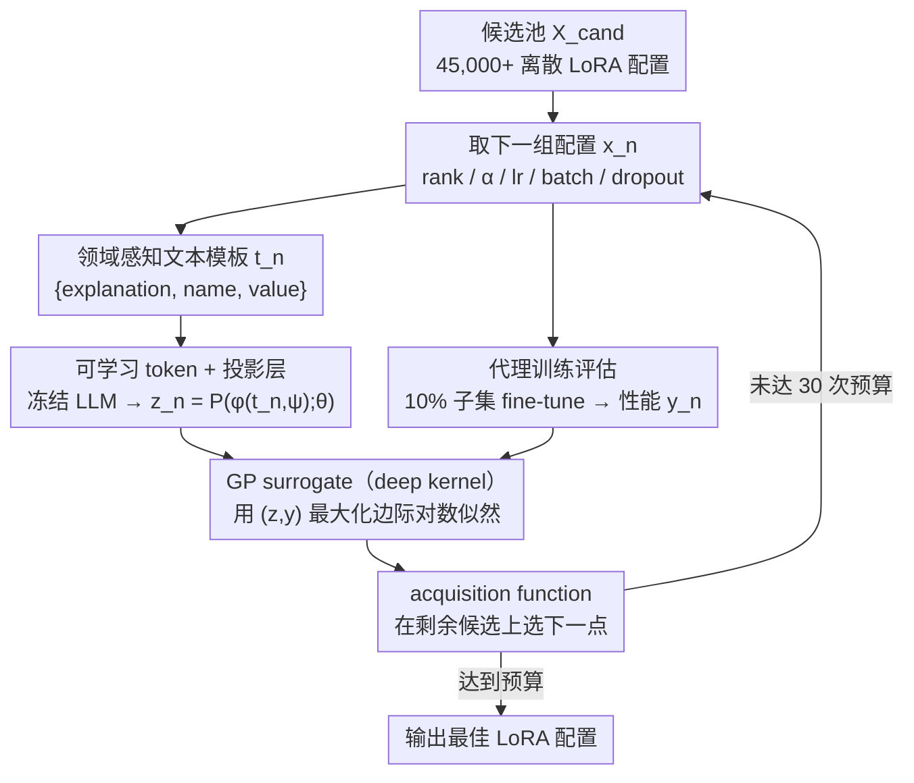

# A Language-Guided Bayesian Optimization for Efficient LoRA Hyperparameter Search

**会议**: ICML2026  
**arXiv**: [2602.11171](https://arxiv.org/abs/2602.11171)  
**代码**: 项目页: https://baekseongeun.github.io/lora-bo/（缓存中未见代码仓库）  
**领域**: 模型压缩 / LLM效率 / 参数高效微调  
**关键词**: LoRA调参、贝叶斯优化、LLM嵌入、代理训练、参数高效微调  

## 一句话总结
本文把 LoRA 超参数配置写成带领域解释的文本，让冻结 LLM、可学习 token 和投影层共同构造 BO 的连续搜索空间，再用 10% 数据代理评估降低每次试验成本，在 30 次左右搜索内显著优于默认 LoRA 配置和常规 HPO 方法。

## 研究背景与动机
**领域现状**：LoRA 及其变体已经成为大模型微调中最常用的参数高效方案。实践里通常冻结原模型权重，只训练低秩适配器，通过 rank、缩放系数、学习率、batch size 和 dropout 等少量超参数控制适配能力、稳定性和计算开销。

**现有痛点**：LoRA 的优势在于训练参数少，但它并不意味着调参简单。论文指出，rank 与 alpha 的比例、学习率、batch size、dropout 等组合会强烈影响最终性能，而完整网格空间超过 45,000 种配置。逐一训练代价很高，直接套用随机搜索、Optuna、普通 BO 或离散空间优化，又很难把 LoRA 的经验规律显式放进搜索过程。

**核心矛盾**：LoRA HPO 同时存在两个不匹配。第一，待搜索变量大多是离散超参数，而高斯过程式 BO 更偏好连续、平滑、结构化的输入空间。第二，人类已经知道很多 LoRA 调参经验，例如 alpha 与 rank 的关系、过大 batch 对泛化的影响、dropout 对稳定性的作用，但传统 BO 通常只看到数值编码，不能理解这些领域语义。

**本文目标**：作者希望把 LoRA 的调参经验转成 BO 可利用的表示，使搜索既能利用 LLM 的先验知识，又能在少量真实训练迭代下找到高质量配置；同时还要降低每次评估成本，使 30 次左右的预算足以覆盖一个很大的候选池。

**切入角度**：论文的观察是，超参数配置不仅是一组数字，也可以是一段结构化语言描述。预训练 LLM 对自然语言中的关系和角色有编码能力，如果把每个超参数的名称、取值、作用和相互关系写进 prompt，再把 LLM hidden state 映射到连续空间，就有机会把离散配置转成更适合 BO 的连续表示。

**核心 idea**：用“语言化的 LoRA 领域知识 + 可校准的 LLM 嵌入”替代普通数值编码，让贝叶斯优化在一个更有语义结构的空间里选择下一组 LoRA 超参数。

## 方法详解
本文的方法是一个面向 LoRA 的闭环调参器：每一轮先从候选池里取一组 LoRA 超参数，用小数据子集做一次代理训练拿到性能分；再把这组超参数写成一段带领域解释的文本，经冻结 LLM、可学习 token 和投影层压成连续向量；然后用这些向量和已有分数训练 GP surrogate，最后让 acquisition function 在剩余候选上打分，挑出下一轮要评估的配置。

### 整体框架
输入是一组离散候选配置 $\mathcal{X}_{cand}$，每个配置含 rank、scaling factor、batch size、learning rate 和 dropout rate；输出是预算内找到的最佳 LoRA 配置。第 $n$ 轮先拿配置 $x_n$ 做代理训练得到性能 $y_n$，把 $x_n$ 写成带说明的文本模板 $t_n$，冻结 LLM $\phi$ 读入 $t_n$ 和可学习 token $\psi$，投影层 $P(\cdot;\theta)$ 把 hidden state 映射成 BO 特征 $z_n=P(\phi(t_n,\psi);\theta)$；GP surrogate 用所有 $(z,y)$ 最大化边际对数似然来更新 kernel、投影层和 token，候选池里每个未评估配置同样编码成 $z_j$ 供 acquisition function 选下一点。关键不是“让 LLM 生成超参数”，而是让 LLM 构造一个带 LoRA 领域结构的连续嵌入空间，探索/利用的权衡仍交给 BO，既保留 BO 的样本效率，又避开纯 prompt agent 式搜索的不稳定。

### 关键设计

**1. 领域感知文本模板：把数字配置写成带经验解释的语言**

LoRA 调参高度依赖手工经验，而 GP 式 BO 通常只看到数值编码，rank 与 alpha 的比例、过大 batch 对泛化的影响、dropout 何时有用这些规律全都丢失了。本文不再用普通的 `{name, value}` 模板，而是改成 `{explanation, name, value}`，在每个超参数旁边补一段说明它作用和相互关系的文字。这样 LLM 读到的不是孤立数字，而是一段“这组超参数为什么重要”的描述，嵌入时就能把“数值接近但语义不同”或“数值不同但调参作用相近”的配置组织得更合理——这是把人类先验显式注入 BO 的入口，后面消融也证明它是贡献最大的一环。

**2. 可学习 token 与投影层校准嵌入空间：让通用表示对齐 LoRA 性能**

冻结 LLM 的原始嵌入是按语言通用性排列的，未必按“LoRA 性能高低”排列，直接拿去做 BO 特征区分度不够。方法在 prompt 末尾附加一组可学习 token $\psi$，取最后 token 位置的 hidden state，再过投影层得到 $z=P(\phi(t,\psi);\theta)$。LLM 全程冻结，只训练 $\psi$、投影层参数 $\theta$ 和 GP kernel 参数 $\omega$，目标是最大化 GP 边际对数似然。投影层负责把嵌入几何重塑成对性能更敏感的形状，可学习 token 则像一个随任务自适应的隐变量，捕捉 prompt 难以言明的残差信息，让 surrogate 在少量观测点上也能拟合出性能趋势。

**3. 代理训练评估：用小子集近似全量，把预算花在更多配置上**

HPO 真正的瓶颈不是 surrogate 计算，而是每个候选配置都要真训练一次。方法每轮不在 100K 全训练集上完整微调，而是在随机抽的 10K（10%）子集上 fine-tune，把这个结果直接当作 $y_n$ 反馈给 BO。作者并非拍脑袋选 10%——他们比较了 1%、5%、10% 随机子集和 TSDS 采样与全量训练的相关性，10% 随机子集在 MATH 上相关性 0.8713、代码生成上 0.9427，足够支撑选点决策。只要子集与全量高度相关，省下的算力就能覆盖更多候选配置，让 30 次预算扫过 45,000+ 的候选池。

### 损失函数 / 训练策略
BO surrogate 是 GP，并通过 LLM 嵌入做 deep kernel learning：普通 kernel $k(x,x'|\omega)$ 被替换为 $k(g(x;\theta,\psi),g(x';\theta,\psi)|\omega,\theta,\psi)$，训练时最大化边际对数似然 $\mathcal{L}(\Phi)=\log p(y|X,\Phi)$，其中 $\Phi=\{\omega,\theta,\psi\}$。实验中所有 HPO 方法统一限制 30 次迭代，候选池覆盖超过 45,000 种 LoRA 配置；任务含数学推理、代码生成和对话，分别在 MetaMathQA、CodeFeedback、WizardLM-Evol-Instruct 上训练，在 GSM8K、MATH、HumanEval、MBPP 和 MT-Bench 上评估。

## 实验关键数据

### 主实验
主结果显示，本文方法既能提升不同 LoRA 变体，也能跨不同 backbone 起作用。下面选取 LoRA 变体表中的代表性结果，提升为相对原论文/默认推荐配置的绝对提升。

| 变体 | GSM8K Acc | MATH Acc | HumanEval Pass@1 | MBPP Pass@1 | MT-Bench |
|------|-----------|----------|------------------|-------------|----------|
| LoRA 默认 | 41.47 | 5.24 | 16.31 | 35.47 | 7.181 |
| LoRA + 本文搜索 | 62.93 (+21.46) | 12.88 (+7.64) | 30.49 (+14.18) | 42.59 (+7.12) | 7.350 (+0.169) |
| rsLoRA 默认 | 41.16 | 5.46 | 16.46 | 35.72 | 7.300 |
| rsLoRA + 本文搜索 | 58.15 (+16.99) | 10.76 (+5.30) | 29.87 (+13.41) | 42.06 (+6.34) | 7.662 (+0.362) |
| DoRA 默认 | 40.11 | 5.36 | 17.07 | 36.51 | 7.125 |
| DoRA + 本文搜索 | 57.01 (+16.90) | 10.78 (+5.42) | 30.58 (+13.51) | 42.33 (+5.82) | 7.475 (+0.350) |
| PiSSA 默认 | 52.46 | 7.34 | 22.56 | 40.48 | 7.200 |
| PiSSA + 本文搜索 | 60.88 (+8.42) | 12.06 (+4.72) | 31.71 (+9.15) | 41.53 (+1.05) | 7.475 (+0.275) |

在同样 30 次迭代预算下，本文方法也优于常见 HPO baseline。

| 搜索方法 | GSM8K Acc | MATH Acc | HumanEval Pass@1 | MBPP Pass@1 |
|----------|-----------|----------|------------------|-------------|
| Random | 59.14 | 10.51 | 23.17 | 36.77 |
| Optuna | 54.13 | 10.50 | 27.44 | 38.62 |
| BO | 57.32 | 11.42 | 20.12 | 35.19 |
| LBO | 59.51 | 11.88 | 26.83 | 37.83 |
| 本文方法 | 62.93 | 12.88 | 30.49 | 42.59 |

### 消融实验
消融验证了三类组件都有效，其中 domain-aware prompting 是最关键的显式知识注入。

| 投影层 | 领域感知 prompt | 可学习 token | GSM8K Acc | MATH Acc | 说明 |
|--------|-----------------|--------------|-----------|----------|------|
| ✗ | ✗ | ✗ | 47.76 | 8.72 | 冻结 LLM 嵌入直接用于 BO，搜索空间区分度差 |
| ✓ | ✗ | ✗ | 53.98 | 9.16 | 投影层带来一定校准，但缺少 LoRA 语义解释 |
| ✓ | ✓ | ✗ | 61.41 | 12.46 | 显式写入调参知识后性能大幅提升 |
| ✓ | ✓ | ✓ | 62.93 | 12.88 | 可学习 token 进一步补足 prompt 难表达的信息 |

代理训练相关性说明 10% 随机子集已经足够接近全量训练趋势。

| 采样方法 | MATH reasoning 相关性 | Code generation 相关性 | 结论 |
|----------|----------------------|------------------------|------|
| Random 1% | 0.7031 | 0.7429 | 过小子集能反映趋势，但噪声偏大 |
| Random 5% | 0.8360 | 0.9282 | 已经较稳定 |
| Random 10% | 0.8713 | 0.9427 | 本文采用，代码任务相关性最高 |
| TSDS 10% by test | 0.8754 | 0.9290 | 数学略高，但代码不如随机 10% |
| TSDS 10% by train | 0.8649 | 0.9278 | 与随机 10% 接近 |

### 关键发现
- 组件贡献最大的是领域感知 prompt：只加投影层从 47.76/8.72 提到 53.98/9.16，而再加 prompt 后跳到 61.41/12.46，说明把 LoRA 调参知识写成文本确实改变了 BO 的可用信息。
- 搜索到的高性能配置并不总遵循传统经验，例如 alpha 有时达到 rank 的 16 或 32 倍，而不是常见的 2 倍。这提示 LoRA 调参规则仍有可挖掘空间。
- 代理训练不是单纯省算力 trick。10% 随机子集与全量结果的相关性在 MATH 上为 0.8713、代码生成上为 0.9427，足以支持 BO 选择下一点。
- 方法在模型间不能简单迁移超参数。论文的跨模型配置实验显示，把一个模型系列搜索到的配置直接套到另一个系列会明显降分，因此“为每个模型自动搜索”比人工复用经验更可靠。

## 亮点与洞察
- 这篇论文的巧妙之处在于没有让 LLM 直接“猜”超参数，而是让 LLM 成为 BO 的表示函数。这样 LLM 负责提供语义结构，BO 负责黑盒优化，两者分工比较清楚。
- 可学习 token 是一个很轻量但实用的校准口。prompt 能写出人类知道的规律，但无法穷尽所有残差信息；让一个 token 随 marginal likelihood 更新，相当于给 BO 留了一个适配当前任务的隐变量。
- 代理评估的验证很重要。很多 HPO 论文默认用子集省时间，但本文明确比较了不同采样比例与 TSDS，说明 10% 随机子集并不是拍脑袋选择。
- 这套思路可以迁移到其他离散 HPO 问题，例如量化配置、蒸馏超参数、RAG 检索参数或推理时 decoding 参数。只要存在可语言化的专家经验，就可以把配置写成结构化 prompt，再用 BO 搜索。

## 局限与展望
- 论文主要验证 LoRA 与几个 LoRA 变体，尚未证明同样的语言化 BO 表示能泛化到所有 PEFT 方法或非 LLM 任务。
- 方法依赖预训练 LLM 的嵌入质量。若换成较弱 embedding model，或领域知识无法被 prompt 清楚表达，性能可能下降；虽然附录有 embedding model 消融，但实际部署仍需重新验证。
- 30 次迭代预算下表现很好，但候选池仍是人工设定的离散范围。若实际最优点落在范围外，BO 表示再好也无法发现。
- 代理训练默认子集性能与全量性能保持高相关。对于小数据、强分布偏移或长尾任务，这个假设可能不成立，后续可引入动态子集选择或多保真 BO。
- 目前搜索目标主要是 benchmark 分数。未来可以加入训练成本、显存、延迟、稳定性等多目标约束，使 LoRA 配置更贴近真实部署。

## 相关工作与启发
- **vs 传统 BO / Optuna / LBO**: 这些方法把配置当作数值或潜变量处理，本文额外利用 LoRA 领域知识和 LLM 文本理解能力，因此在同样 30 次预算下更容易找到好配置。
- **vs NOMAD 类 LoRA HPO**: NOMAD 也面向 LoRA 调参，但本文在 24 小时内得到的 GSM8K/MATH/HumanEval/MBPP 结果都优于 Tribes et al. 的 180 小时结果，优势在于搜索空间表示和代理评估更高效。
- **vs 手工调参经验**: 手工经验通常给出 rank、alpha、batch size 的固定规则，本文发现更大的 alpha/rank 比例有时反而有效，说明自动搜索可以反过来更新经验法则。
- **vs LLM agent 式自动调参**: 直接让 LLM 提议配置容易受 prompt 和采样不稳定影响；本文让 LLM 只做可训练表示，优化选择仍由 acquisition function 完成，更像是把 LLM 先验嵌入到经典 HPO 框架。

## 评分
- 新颖性: ⭐⭐⭐⭐☆ 把 LLM 表示、领域 prompt、可学习 token 和 BO 组合到 LoRA HPO 中，问题切得很实用。
- 实验充分度: ⭐⭐⭐⭐☆ 覆盖 LoRA 变体、多模型、HPO baseline、组件消融和代理评估，但真实工业部署维度仍可更多。
- 写作质量: ⭐⭐⭐⭐☆ 方法链条清晰，表格支撑充分；公式和算法对非 BO 读者稍有门槛。
- 价值: ⭐⭐⭐⭐⭐ 对需要频繁微调 LLM 的场景很有价值，核心思想也可迁移到其他带专家经验的离散搜索问题。

<!-- RELATED:START -->

## 相关论文

- [\[CVPR 2026\] SG-LoRA: Semantic-guided LoRA Parameters Generation](../../CVPR2026/model_compression/sg-lora_semantic-guided_lora_parameters_generation.md)
- [\[CVPR 2026\] TAS-LoRA: Transformer Architecture Search with Mixture-of-LoRA Experts](../../CVPR2026/model_compression/tas-lora_transformer_architecture_search_with_mixture-of-lora_experts.md)
- [\[AAAI 2026\] Renormalization Group Guided Tensor Network Structure Search](../../AAAI2026/model_compression/renormalization_group_guided_tensor_network_structure_search.md)
- [\[NeurIPS 2025\] Learning to Better Search with Language Models via Guided Reinforced Self-Training](../../NeurIPS2025/model_compression/learning_to_better_search_with_language_models_via_guided_reinforced_self-traini.md)
- [\[ICML 2026\] Active Budget Allocation for Efficient Scaling Law Estimation via Surrogate-Guided Pruning](active_budget_allocation_for_efficient_scaling_law_estimation_via_surrogate-guid.md)

<!-- RELATED:END -->
