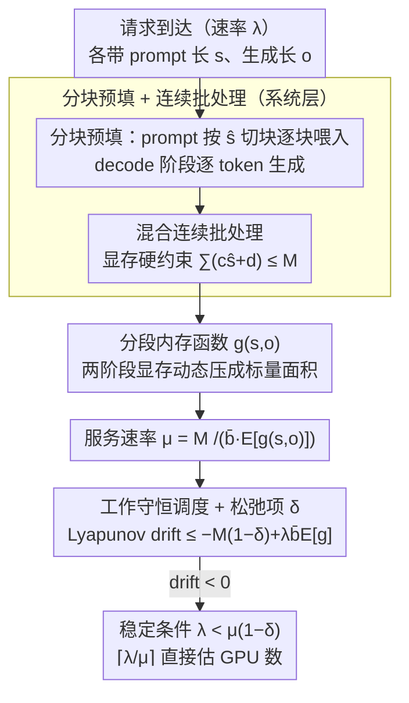

# A Queueing-Theoretic Framework for Stability Analysis of LLM Inference with KV Cache Memory Constraints

**会议**: ICML 2026  
**arXiv**: [2605.04595](https://arxiv.org/abs/2605.04595)  
**代码**: 论文附录提供  
**领域**: LLM 推理效率 / 系统  
**关键词**: 排队论, KV 缓存, 显存约束, 稳定性条件, 吞吐量预测

## 一句话总结
本文建立首个显式纳入 KV 缓存显存动态的 LLM 推理排队模型，给出闭形稳定性条件 $\lambda < \mu(1-\delta)$，使运维人员可直接计算所需 GPU 数；在单 GPU、8 GPU 集群与 LongBench 真实数据上验证误差均 $\leq 10\%$。

## 研究背景与动机

**领域现状**：LLM 推理服务同时受计算与显存两类约束。KV 缓存加速 decoding 但在长上下文下占用大量显存。系统设计需要平衡吞吐、延迟与硬件成本。

**现有痛点**：经典排队论只建模计算约束；现有 LLM 系统论文（Wu/Yang/Li 等）关注调度算法但缺乏闭形稳定性判定；KV 缓存内存呈非线性动态——prompt 阶段按 chunk 增、decode 阶段按 token 逐增——难以套用标准 bin packing 框架。

**核心矛盾**：内存不是静态约束而是随时间演化的；不同请求处于不同阶段，共享显存高度耦合，简单的平均速率近似失效。

**本文目标**：给出严格、可计算的稳定性条件，让设计者根据 $\lambda$ 和系统参数直接估算所需 GPU 数。

**切入角度**：构造离散时间 Markov 链，把状态定义为"进行中的请求集合 + 各自进度"；定义 Lyapunov 势函数为"剩余生命周期内存×时间"，对 drift 做下界估计。

**核心 idea**：每个请求的"内存×时间"开销可写成显式函数 $g(s,o)$，于是服务速率 $\mu = M / (\bar b \mathbb E[g(s,o)])$，稳定条件为 $\lambda < \mu(1-\delta)$，$\delta = \text{ess sup}(s+o)/M$ 是松弛项。

## 方法详解

### 整体框架

本文把"显存约束下的 LLM 推理"建模成一个分两层的排队系统：系统层描述请求怎么进出 GPU，稳定性层用 Lyapunov drift 判断队列会不会爆。系统层里请求以 FCFS/SJF 调度、混合连续批处理——多个请求的 prompt chunk 与 decode token 可以塞进同一批次，唯一硬约束是显存 $\sum_{i\in S(t)} c_i^{(t)} \hat s + d_i^{(t)} \leq M$（$c_i^{(t)}$ 是请求 $i$ 已处理的 chunk 数，$d_i^{(t)}$ 是已生成的 token 数）。稳定性层把所有在跑请求的"剩余进度"打包成一条离散时间 Markov 链状态，用势函数 $V(t) = \sum_i g(s_i, o_i)$ 度量系统总负载，再看每步 drift $\mathbb E[V(t+1)-V(t)] = -M(1-\delta) + \lambda \bar b \mathbb E[g(s,o)]$ 是正是负——负则稳定。最终落到一条闭形条件 $\lambda < \mu(1-\delta)$。

### 关键设计

**1. 分块预填 + 连续批处理：让每步处理时间近似恒定，排队论才站得住**

排队论分析有个隐含前提——单步服务时间不能随请求长度乱飘，否则 $\mu$ 没法定义。但长 prompt 的 attention 是 $O(\text{len}^2)$ 的，直接破坏这个前提。本文用分块预填解决：prompt 按固定 chunk 大小 $\hat s$ 切块喂入，使每批 attention 计算量退化为 $O(M)$（正比于当前总 KV 缓存，而不是 prompt 长度的平方）。在此之上叠连续批处理——显存有余量就动态接纳新请求，显存溢出时退回 CPU 交换（本文假设这种情况罕见）。两者合起来抹平了长 prompt 的二次开销，使每步处理时间近似常数，$\mu = M / (\bar b\,\mathbb E[g(s,o)])$ 这个服务速率定义才有意义。

**2. 分段内存函数 $g(s,o)$：把两阶段的非线性显存动态压成一个标量**

经典排队论失效的根子在于 KV 缓存内存不是静态约束：prompt 阶段按 chunk 整块涨、decode 阶段按 token 逐个涨，同一时刻不同请求还处在不同阶段，显存高度耦合，平均速率近似根本套不上。本文的破解办法是给每个请求定义一个"内存×时间"开销函数 $g(s,o) = \frac{(1+s/\hat s)s}{2} + s\cdot o + \frac{(1+o)o}{2}$，三项分别对应 prompt 累积、prompt 与 decode 重叠期、decode 累积——本质是把请求生命周期内"占了多少显存、占了多久"算成一块面积。有了它，势函数 $V(t)=\sum_i g(s_i,o_i)$ 就是所有未完成请求的总面积；关键性质是无论请求各自卡在哪个阶段，满载时 $V(t)$ 每步都稳定减少 $M(1-\delta)$。这一步把"动态非线性显存约束"转成了"线性面积擦除"，drift 分析才得以一笔写下来。

**3. 工作守恒调度 + 松弛项 $\delta$：把现实系统的保守显存利用率写进理论**

有了 $g$ 和恒定步时，剩下的问题是：到底什么调度策略能保证稳定、又要留多少安全余量。本文证明任意工作守恒策略（GPU 不空闲）在松弛 $\delta = \text{ess sup}(s+o)/M$ 下都稳定。这个 $\delta$ 不是凑出来的常数，它的物理含义是"最坏情况下还能容纳一个最大请求到来所需的预留比例"——正好对应 vLLM 里 `gpu_memory_utilization=0.9` 这类工程默认值。于是稳定条件 $\lambda < \mu(1-\delta)$ 既严格又能落地：运维拿到到达率 $\lambda$ 和系统参数，直接算 $\lceil \lambda/\mu \rceil$ 就知道要几张 GPU，不用跑模拟。

## 实验关键数据

### 单 GPU 验证（合成 P:D 比例）

| Prompt:Decode | $\mu_{\text{gpu}}$ (req/s) | $\mu_{\text{theory}}$ | Gap |
|--------------|-------|-------|------|
| 1:1 | 3.387 | 3.263 | 3.66% |
| 2:1 | 3.650 | 3.956 | 8.38% |
| 1:2 | 2.969 | 2.902 | 2.25% |
| 混合（2:1→1:2 时变） | 3.137 | 3.385 | 7.90% |

### 真实数据集（LongBench v2，单 GPU）

| 指标 | 值 | 说明 |
|------|----|------|
| $\mu_{\text{gpu}}$ | 0.610 req/s | 实测 |
| $\mu_{\text{theory}}$ | 0.561 req/s | 预测 |
| Gap | 8.03% | 真实长上下文场景 |

### 8 GPU 集群

| 配置 | $\mu_{\text{gpu}}$ | $8\mu_{\text{theory}}$ | Gap |
|------|------|------|------|
| 1:1 P/D | 26.71 | 25.81 | 3.38% |

### 稳定性实验（单 GPU, 1:1）

| $\lambda$ | 关系 | 队列行为 | 理论预测 |
|---------|------|--------|--------|
| 1, 3 | $\lambda < \mu$ | 有界 (<5) | ✓ 稳定 |
| 5, 20, 50 | $\lambda > \mu$ | 线性增长 | ✓ 不稳定 |

### 关键发现
- **理论-实测 Gap 始终 $\leq 10\%$**：覆盖合成/真实、单 GPU/8 GPU 场景，预测精度令人意外。
- **线性可扩展**：8 GPU 集群 Gap 3.38%，与单 GPU 同量级，公式 $\mu_{\text{multi}} = 8\mu_{\text{single}}$ 成立。
- **P:D 比例影响显著**：1:2（长生成）比 2:1（长 prompt）吞吐低，与理论符号一致。
- **稳定/不稳定阶跃明显**：$\lambda$ 越过 $\mu$ 阈值后队列长度迅速线性发散，验证了 drift 论证。

## 亮点与洞察
- **首个 KV 显存排队模型**：填补排队论与 LLM 推理的空白，理论贡献清晰。
- **闭形稳定条件实用性强**：运维直接用 $\lceil \lambda/\mu \rceil$ 估算 GPU 数，无需模拟。
- **势函数构造优雅**：用"内存×时间面积"统一两阶段动力学，drift 分析极简。
- **跨场景验证严谨**：合成、真实、单卡、多卡均验证，Gap $\leq 10\%$ 提供高信度。

## 局限与展望
- 假设批处理时间恒定，忽略 CPU-GPU I/O、注意力不规则性等额外波动。
- 不支持 TP/PP 等并行策略；需把 $M, \bar b$ 替换为 TP-effective 值。
- 未考虑动态批大小、主动预加载、推测解码等高级调度。
- 真实流量长尾/突发情况下，平均到达率假设可能不准确。
- 改进方向：动态调节 chunk size 的在线控制；CPU 缓存交换的精细建模；多模型共置场景。

## 相关工作与启发
- **vs 经典排队论**：M/M/1, M/G/1 等不建模共享资源，本文把内存作为耦合变量引入。
- **vs LLM 调度算法文献（Wu/Yang/Li）**：他们设计最大化效率的调度；本文给出稳定性上界，为调度算法分析提供基础。
- **启发**：类似"生命周期资源占用"模型可推广到数据中心电源/散热等其他受约束系统。

## 评分
- 新颖性: ⭐⭐⭐⭐⭐ 首次严格把 KV 显存纳入排队论框架，理论贡献明确。
- 实验充分度: ⭐⭐⭐⭐⭐ 合成 + 真实、单 GPU + 集群、稳定性验证俱全。
- 写作质量: ⭐⭐⭐⭐⭐ 数学推导严谨，系统模型清晰。
- 价值: ⭐⭐⭐⭐⭐ 直接指导 LLM 服务的资源规划。

<!-- RELATED:START -->

## 相关论文

- [\[ACL 2026\] DASH-KV: Accelerating Long-Context LLM Inference via Asymmetric KV Cache Hashing](../../ACL2026/model_compression/dash-kv_accelerating_long-context_llm_inference_via_asymmetric_kv_cache_hashing.md)
- [\[ACL 2026\] HeteroCache: A Dynamic Retrieval Approach to Heterogeneous KV Cache Compression for Long-Context LLM Inference](../../ACL2026/model_compression/heterocache_a_dynamic_retrieval_approach_to_heterogeneous_kv_cache_compression_f.md)
- [\[NeurIPS 2025\] MUSTAFAR: Promoting Unstructured Sparsity for KV Cache Pruning in LLM Inference](../../NeurIPS2025/model_compression/mustafar_promoting_unstructured_sparsity_for_kv_cache_pruning_in_llm_inference.md)
- [\[NeurIPS 2025\] Ada-KV: Optimizing KV Cache Eviction by Adaptive Budget Allocation for Efficient LLM Inference](../../NeurIPS2025/model_compression/ada-kv_optimizing_kv_cache_eviction_by_adaptive_budget_allocation_for_efficient_.md)
- [\[ICML 2026\] xKV: Cross-Layer KV-Cache Compression via Aligned Singular Vector Extraction](xkv_cross-layer_kv-cache_compression_via_aligned_singular_vector_extraction.md)

<!-- RELATED:END -->
