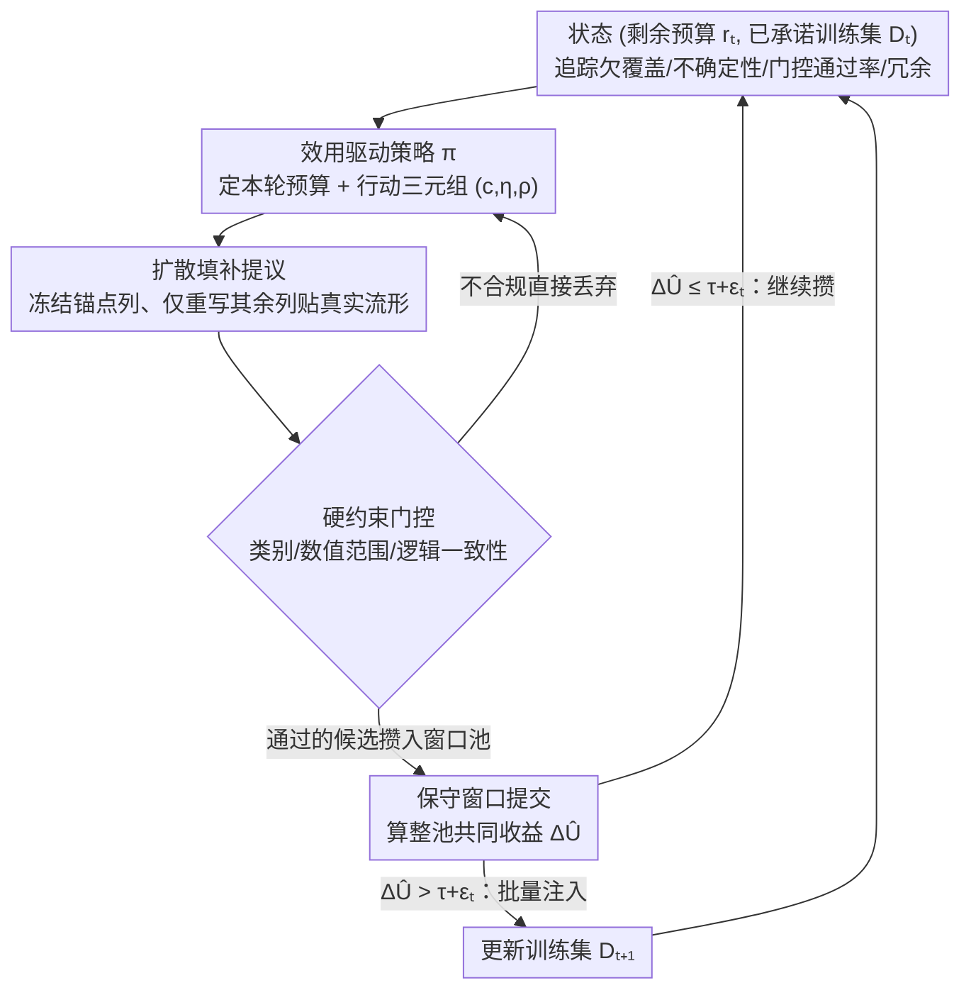

# Active Tabular Augmentation via Policy-Guided Diffusion Inpainting

**会议**: ICML 2026  
**arXiv**: [2605.10315](https://arxiv.org/abs/2605.10315)  
**代码**: https://github.com/oooranz/TAP  
**领域**: 数据增强 / 表格生成 / 强化学习  
**关键词**: 表格数据增强, 扩散填补, 效用驱动选择, 保守提交, 保真度-效用间隙

## 一句话总结
本文形式化了表格增强中的"保真度-效用间隙"问题（生成器优化分布匹配，而增强价值源于低密度区域），提出 TAP 算法通过扩散填补做流形约束提议、策略引导的效用对齐选择、硬约束门控加保守窗口提交，在 7 个真实表格数据集上相比基线最多提升分类精度 15.6%、回归 RMSE 降低 32%。

## 研究背景与动机

**领域现状**
表格数据驱动医疗、金融、科学决策，但标注数据往往稀缺。数据增强是常用改进方法，但对表格应用脆弱——表格特征的异质性和列间强依赖意味着即使微小扰动也可能违反约束或引入虚假关系。

**现有痛点**
1. **保真度-效用错位**：现有生成器（GANs、VAEs、扩散模型）优化分布匹配 $P(X,Y)$，鼓励从高密度区域采样。但数据增强成功的样本恰恰源于模型不确定的低密度边界或欠覆盖群体——与生成目标背道而驰。
2. **静态评估不足**：SMOTE 等简单方法生成的样本统计上不够真实，却往往有效改进分类器，暗示保真度不是充要条件。

**核心矛盾**
生成器训练目标与增强评估目标的根本不匹配：生成器关注 $\max_x\log P(x)$，增强关注 $\min_\theta L(\theta,D\cup S)$。

**本文目标**
学习不仅"如何生成"，更要学"生成什么"和"何时注入"，使样本动态适应不断演变的学习器。

**切入角度**
形式化增强为顺序控制问题：每轮维持承诺缓冲和临时池，用策略决定生成条件和注入时机。用影响函数诊断指导设计——效用近似等于学习器损失梯度与 Hessian 逆的作用。

**核心 idea**
通过三条原则实现效用驱动增强：(1) 流形软约束（扩散填补）+ 硬约束门控（检查有效值范围）= 两层保真度；(2) 策略学习（针对学习器状态）+ 效用对齐选择 = 目标聚焦；(3) 保守窗口提交（累积候选，仅当池收益超过阈值才批量提交）= 鲁棒对抗噪声。

## 方法详解

### 整体框架
TAP 把"该生成什么、何时注入"做成一个有限地平线、预算约束的序列控制问题：每轮看着当前学习器的状态决定生成条件和注入量，而不是一次性生成一大批样本就完事。形式化为 MDP 后，状态是 $(r_t, D_t)$（剩余预算与已承诺训练集），策略 $\pi$ 每轮输出两件事——这一轮花多少预算 $b_t$、以及用什么生成条件 $(c,\eta,\rho)$（目标类、模板、探索强度）；贪心单轮分配把预算切成 $k_i$ 单位分给个体锚点 $i$，多轮之间则用动态规划求最优分配。生成出来的样本不直接进训练集，而是先扔进临时池，攒够了、确认整体有收益才批量提交，由此把"流形约束生成 → 效用对齐选择 → 保守提交"三段连成一条流水线。

### 关键设计

**1. 扩散填补 + 三元组行动空间：把生成约束在真实流形附近，同时解耦目标/局部性/多样性**

直接用 GAN/VAE/扩散从头采样的问题是样本可能飘到流形外、或破坏列间约束。TAP 改成"填补"式生成：冻结一条真实样本的部分列当锚点不动，只在其余列上反向扩散，并用条件（如目标类标签）引导，固定列在每步都被噪声覆写回原值 $x_{\bar m}^{(s-1)}\leftarrow\sqrt{\bar\alpha_{s-1}}x_{\bar m}+\sqrt{1-\bar\alpha_{s-1}}\epsilon$。锚点强制新样本贴着真实流形局部生成，受限的重写列又把虚假变化压到最小，这是第一层（软）保真度。在此之上，行动被拆成三元组 $a=(c,\eta,\rho)$：$c$ 控类条件、$\eta$ 选 conservative/explore 模板、$\rho$ 调模板内重写列的比例，三者各自诱导不同的提议分布 $Q_a(\cdot|D_t)$。把目标、局部性、多样性这三个自由度解耦开，策略就能在学习的不同阶段使用不同权衡——早期多探索、后期多利用。

**2. 效用驱动策略 + 硬约束门控：让生成对准学习器当前最缺的地方，再用一道硬规则兜底**

生成器优化分布匹配、增强收益却来自低密度区，这个错位是本文要解的核心矛盾。TAP 的做法是把生成条件交给一个针对学习器实时状态的策略来选。策略观测的状态向量由四个分量 $(\delta_t,u_t,g_t,d_t)$ 构成，分别追踪欠覆盖、不确定性、最近门控通过率、冗余度——这四项正好对应影响函数诊断里学习器损失的梯度成分，所以策略最大化 KL-正则化的边际效用 $\max_\pi \mathbb E[\hat A_t]-\beta\,\mathrm{KL}(\pi\|\pi_{\text{ref}})$ 时，会被自动推向边界和欠覆盖区，而不是去重复高密度区域。软流形之外还有第二道防线：每个候选都要过接受函数 $G(x;D_t)\in\{0,1\}$，硬检查类别有效性、数值范围、逻辑一致性（如年龄不能大于死亡年龄），不合规直接丢弃。软流形负责"像真的"，硬门控负责"绝不违规"。

**3. 保守窗口提交：攒够候选、确认共同收益超阈值才批量注入**

稀缺数据下单个样本的效用估计噪声很大，逐样本实时注入很容易被噪声骗、把有害样本放进训练集。TAP 维护一个长度 $K$ 的滑动窗口 $P_t$，在提交检查点才算整池的共同收益 $\Delta\hat U(D_t,P_t^{(K)})=\hat L_\psi(D_t)-\hat L_\psi(D_t\cup P_t^{(K)})$（用 TabPFN 插件评估器在硬查询集上度量），只有当 $\Delta\hat U>\tau+\epsilon_t$ 才整批提交——$\tau$ 是最小收益阈值，$\epsilon_t$ 是校准出来的不确定性区间，相当于要求收益不仅为正还要明显盖过噪声带。窗口积累让共同效用比单样本估计稳得多，这是对抗稀缺场景噪声的工程化关键。

### 损失函数与训练策略
策略优化的轨迹目标是 $J(\pi)=\mathbb E_\pi[\sum_{t\geq 1}\gamma^{t-1}\Delta U(D_t,P_t)]$，并沿提交时刻分解成 $\sum_i \Delta U(D_{t_i},P_i)$ 便于按批归因。插件效用评估器 $f_\psi$ 选 TabPFN（上下文学习器，评估快），但它只用于候选排名这种内循环；最终对外报告的增强收益是用完整模型在验证集上重新训练得到的，避免评估器误差直接进入结论。

## 实验关键数据

### 主实验

| 数据集 | $N_{\text{真实}}$ | 指标 | SMOTE | TVAE | CTGAN | ARF | SPADA | TabDDPM | TabDiff | TAP |
|--------|-------|------|-------|------|-------|-----|-------|---------|---------|-----|
| MiceProtein | 20 | Acc↑ | 36.21 | 41.34 | 36.93 | 32.35 | 36.91 | 37.59 | 34.05 | **44.60** |
| | 100 | Acc↑ | 71.96 | 71.27 | 63.59 | 65.13 | 65.01 | 68.86 | 66.95 | **73.06** |
| | 500 | Acc↑ | 96.44 | 96.65 | 93.75 | 93.71 | 94.56 | 96.13 | 93.81 | **96.11** |
| Credit-G | 20 | Acc↑ | 66.37 | 59.06 | 65.79 | 65.48 | 64.25 | 57.58 | 63.99 | **68.13** |
| | 100 | Acc↑ | 67.53 | 68.27 | 68.65 | 67.26 | 67.27 | 66.09 | 64.07 | **70.73** |
| Electricity | 50 | Acc↑ | 69.05 | 64.71 | 69.09 | 63.64 | 70.81 | 69.61 | 66.11 | **71.55** |
| | 100 | Acc↑ | 72.73 | 68.21 | 72.15 | 67.21 | 74.02 | 72.83 | 70.97 | **74.73** |
| 平均收益 | 20 | $\Delta$ | +3.5% | +5.8% | +4.2% | base | +2.1% | +1.8% | 0% | **+15.6%** |
| | 100 | $\Delta$ | +2.1% | -1.5% | -10.4% | base | -2.3% | -3.2% | -6.7% | **+3.8%** |

### 消融实验

| 配置 | 验证集精度 | 说明 |
|------|-----------|------|
| 仅扩散无策略 | 71.2% | 保真度高但无针对性 |
| 贪心策略无提交 | 70.8% | 实时注入，易被噪声欺骗 |
| 硬门控但无软流形 | 68.5% | 过滤过严，多样性下降 |
| 完整 TAP | **74.3%** | 所有组件协同 |
| TAP 无窗口提交 | 72.1% | 缺少保守机制，易有害注入 |

### 关键发现
- **保真度并非充分条件**：TabDDPM/TabDiff 保真度最高但增强收益有限或为负；TAP 保真度更低却增强收益最高。
- **稀缺数据收益最大**：$N=20$ 时相比最好基线 +15.6%；$N=500$ 时降到 ~1%（数据充足后增强空间收窄）。
- **流形 + 硬约束两层有效**：仅扩散 71.2% 不如双层 74.3%，仅硬门控 68.5% 多样性受损。
- **策略学习超越固定分配**：策略在不同稀缺程度下自适应调整探索 vs 利用，固定贪心 70.8% 不如自适应 74.3%。
- **窗口提交防止有害注入**：窗口 74.3% vs 无窗口 72.1%，高噪声下差异更显著。

## 亮点与洞察
- **问题形式化的深度**：把增强看作序列控制问题，用影响函数诊断直观解释设计。"保真度-效用间隙"的识别是对增强理论的根本洞察。
- **多层设计的周密性**：软流形 + 硬约束 + 效用策略 + 保守提交形成完整防线，每层针对不同失败模式。
- **务实的不确定性处理**：窗口提交和 $\tau+\epsilon_t$ 阈值是对稀缺数据下噪声估计的工程化优雅响应。

## 局限与展望
- **依赖参考分布**：假设可从历史数据学到准确 $P$；严重分布偏移下可能失效。
- **评估器是中间变量**：TabPFN 评估精度直接影响策略训练，论文未量化估计器误差对策略的影响。
- **规模限制**：实验最大 $N\approx 10k$；超大表格或超高维特征表现未知。

## 相关工作与启发
- **vs SMOTE**：SMOTE 邻域插值保真度低却常有效；TAP 把"从低密度高不确定区采样"做成了现代化、可学习的范式。
- **vs GANs/VAEs/扩散**：这些方法优化分布匹配，本文揭示这是"错误目标"；TAP 用显式效用优化纠正错位。
- **vs 影响函数**：Koh & Liang 2017 用影响函数理解样本影响；本文反向应用——用它指导生成方向，是有创意的视角转换。

## 评分
- 新颖性: ⭐⭐⭐⭐⭐ "保真度-效用间隙"识别是新视角，策略引导表格增强和保守提交都是新方法。
- 实验充分度: ⭐⭐⭐⭐ 7 数据集、5 个稀缺级别、多基线、消融充分；未涵盖聚类/异常检测等其他任务。
- 写作质量: ⭐⭐⭐⭐ 问题形式化清晰，设计原则明确，实验细节充分。
- 价值: ⭐⭐⭐⭐⭐ 在医疗/金融等稀缺数据场景有直接价值，打破"保真度至上"的迷思。

<!-- RELATED:START -->

## 相关论文

- [\[ICML 2026\] Active Budget Allocation for Efficient Scaling Law Estimation via Surrogate-Guided Pruning](active_budget_allocation_for_efficient_scaling_law_estimation_via_surrogate-guid.md)
- [\[ICML 2026\] End-to-End Compression for Tabular Foundation Models](end-to-end_compression_for_tabular_foundation_models.md)
- [\[ICML 2026\] Entropy-Aware On-Policy Distillation of Language Models](entropy-aware_on-policy_distillation_of_language_models.md)
- [\[ICML 2026\] Advantage Collapse in Group Relative Policy Optimization: Diagnosis and Mitigation](advantage_collapse_in_group_relative_policy_optimization_diagnosis_and_mitigatio.md)
- [\[ICML 2026\] Auditing and Fixing Economic Validity in Tabular Foundation Models for Discrete Choice](auditing_and_fixing_economic_validity_in_tabular_foundation_models_for_discrete_.md)

<!-- RELATED:END -->
