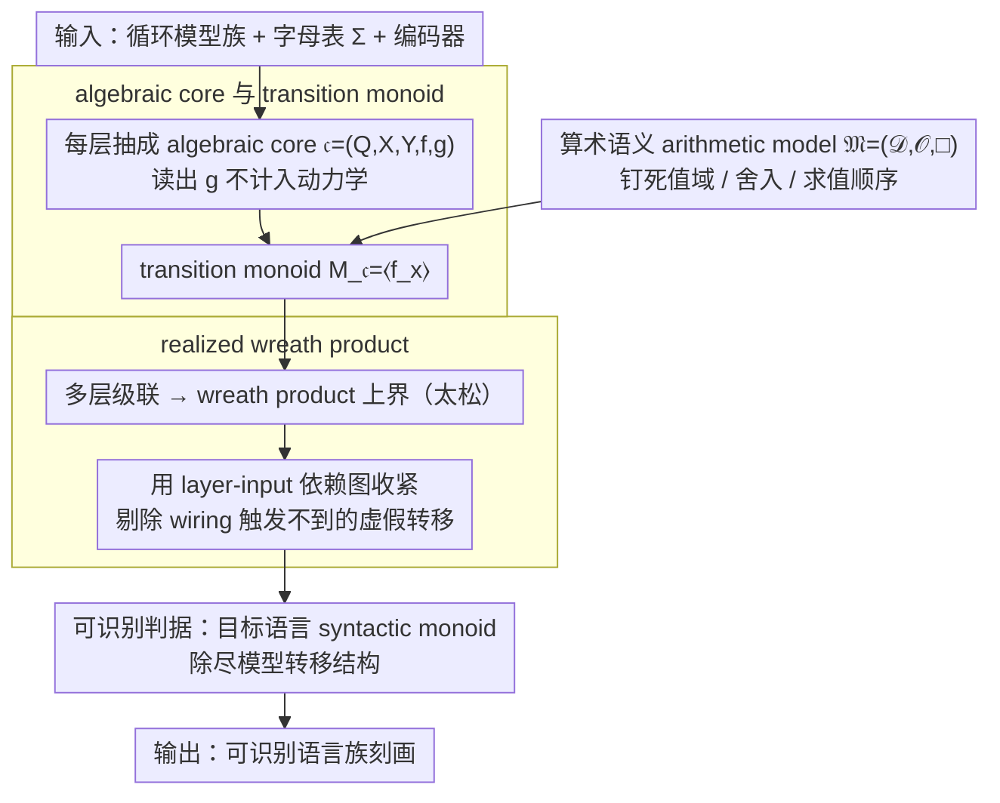

# An Algebraic View of the Expressivity of Recurrent Language Models

**会议**: ICML2026  
**arXiv**: [2606.01765](https://arxiv.org/abs/2606.01765)  
**代码**: 无  
**领域**: LLM/NLP  
**关键词**: 循环语言模型、形式语言、转移幺半群、有限精度、状态空间模型  

## 一句话总结
这篇论文把 RNN/SSM 的形式语言表达能力统一为一个代数问题：在固定数值语义后，模型能识别的语言由其层级转移幺半群及其 wreath product 决定，并且同一架构在浮点与无符号整数语义下会得到完全不同的计数能力。

## 研究背景与动机
**领域现状**：近年来，语言模型表达能力分析常把 RNN、SSM、Transformer 等架构当作形式语言识别器来研究，目标是回答它们能否实现括号匹配、模计数、有限自动机模拟等经典计算任务。这个方向的理论结果经常会转化为架构启发，例如线性 RNN 或 Mamba 类状态空间模型是否能长期保存计数信息。

**现有痛点**：文献中的结论并不一致。一部分工作在精确实数或有理数算术下证明 RNN 具有很强的计算能力，甚至可达图灵完备；另一部分工作在有限精度或资源受限假设下证明它们只能模拟有限自动机。问题不在于某一边“错了”，而在于这些证明默认的算术模型、舍入规则、溢出语义和求值顺序并不相同。

**核心矛盾**：神经网络公式看上去是连续实数运算，但真实部署一定发生在离散、有限、带舍入的数值系统上。若理论证明依赖实数域中的结合律、无限精度或可任意重排的代数恒等式，它就不一定能迁移到浮点实现；反过来，若只说“有限精度”却不规定具体运算语义，也无法得到可复验的表达能力结论。

**本文目标**：作者希望给出一个统一框架，把循环语言模型的表达能力拆成三个可替换部分：架构的状态转移结构、层间 wiring 的组合方式、以及底层算术语义。这样当结论发生冲突时，可以精确定位到底是架构本身不同，还是数值语义不同。

**切入角度**：论文从自动机理论中的幺半群出发，把每个 recurrent core 看成有限状态转移系统，把深层 RNN 的层级组合看成 transformation monoid 的 wreath product。识别一个形式语言不再是直接构造网络参数，而是判断目标语言的 syntactic monoid 是否能除尽模型可实现的幺半群结构。

**核心 idea**：用“固定算术语义后的转移幺半群”替代含糊的实数网络公式，从而把 RNN/SSM 表达能力归约为有限代数中的可除性问题。

## 方法详解

### 整体框架
这篇论文不提出新训练算法，而是给循环语言模型的表达能力搭一套代数显微镜：把一层 recurrent module 抽象成 algebraic core，把多层网络抽象成 core 的 cascade，再用 wreath product 套出所有可能的层级转移、用 realized input set 收紧到真实 wiring 能触达的部分，最后把"识别某个形式语言"归约成"目标语言的 syntactic monoid 能否 divide 模型的转移结构"这一可检查的代数判据。输入是一类循环式模型、有限字母表、固定的编码器和数值语义；输出不是模型预测，而是一个关于可识别语言族的结构化刻画。整条归约链路如下图：算术语义先钉死单步运算，决定每层 core 真正诱导出的 transition monoid，再沿层级 wreath product 组合并收紧，最终落到一个可判定的可除性判据。

### 关键设计

**1. Algebraic core 与 transition monoid：把一层 RNN 抽象成纯粹的状态转移器**

文献结论打架，部分原因是大家把 decoder 的表达能力混进了 recurrent dynamics。为此论文先把每个 recurrent layer 抽成一个 core $\mathfrak{c}=(Q,X,Y,f,g)$——状态集 $Q$、输入集 $X$、输出集 $Y$、转移 $f:Q\times X\to Q$、读出 $g:Q\times X\to Y$——只保留"输入驱动状态变化"这一最核心结构。关键一步是：每个输入 $x\in X$ 诱导一个自映射 $f_x:Q\to Q$，所有这些映射在函数复合下生成该层的 transition monoid $M_{\mathfrak{c}}=\langle f_x\mid x\in X\rangle$。读出 $g$ 刻意不进入这个幺半群，因为它只决定状态如何被观察、不决定状态如何演化。这样"模型内部能保存什么动态信息"就和"最终如何读出答案"彻底分离，避免把 decoder 算力误记到 recurrence 头上。

**2. Realized wreath product：只统计 wiring 真能触发的层级转移**

深层 RNN 不是各层并行的直积，而是一个下层状态会改变上层当前时间步输入的级联系统，所以它的 ambient 上界是各层 transition monoid 的迭代 wreath product。但这个上界太松：它允许上层接收任意 $X_n$ 中的输入，包括 encoder 和 wiring 永远不会送进去的那些。论文因此定义 layer-input dependency map $\varphi_n^T$，只收集从第一层输入集合 $T$ 出发能传到第 $n$ 层的可达输入，再由这些输入生成收紧后的 $M_n^T$，最终得到 realized wreath product $\mathbb{W}_{\mathcal{R}}^T=(M_1^T,Q_1)\wr\cdots\wr(M_N^T,Q_N)$。这一收紧把"架构形式上允许、但 wiring 永远不会触发"的虚假表达能力剔除掉，从而支撑精确的不可表达性证明，同时让 encoder 或输入分布变化时只需局部更新分析。

**3. 把算术语义写进模型定义：解释同一架构为何得出矛盾结论**

同一个 RNN/SSM 在不同论文里时而图灵完备、时而只等价于有限自动机，根子在大家默认的算术模型不同。论文索性把 arithmetic model 显式写成 $\mathfrak{M}=(\mathcal{D},\mathcal{O},\square)$：$\mathcal{D}$ 是可表示值域、$\mathcal{O}$ 是运算集合、$\square$ 是舍入/截断映射；并强制每个表达式配一棵固定的 evaluation tree，recurrent update 必须满足"先算完时间 $t$ 再进 $t+1$"的 recurrence-consistent evaluation。之所以要管到求值顺序这么细，是因为浮点加法和乘法不满足结合律，编译器或硬件一旦重排就会改变单步 recurrence 本身——若不把这些语义钉死，"能否识别某语言"这个问题根本不是良定义的。

### 损失函数 / 训练策略
本文研究的是 expressivity 而非 learnability，不涉及任何训练损失或优化策略：给定一个架构族和数值语义，问的是是否**存在**某个参数化实例能识别目标形式语言。作者明确说明，框架并不保证这些参数能被梯度下降自动找到。

## 实验关键数据

### 主实验
本文的“主实验”是理论结果与 case study，而不是数据集 benchmark。最核心的结果是把不同算术模型下的表达能力差异放到同一张代数表中比较。

| 对象 | 判据 / 结果 | 结论 | 影响 |
|------|-------------|------|------|
| 单层 algebraic core | $M_{\mathfrak{c}}=\langle f_x\rangle$ | 层内动力学由 transition monoid 决定 | 可把架构能力转为幺半群问题 |
| 深层 algebraic RNN | $M_{\mathcal{R}}^T\leq W_{\mathcal{R}}^T$ | 全局转移嵌入 realized wreath product | 层级组合可用 wreath product 分析 |
| 语言 acceptor | $M(\mathcal{L})\prec M_{\mathcal{R}^+}^{e(\Sigma)}\leq W_{\mathcal{R}^+}^{e(\Sigma)}$ | 目标语言的 syntactic monoid 必须 divide 模型转移结构 | 给出不可识别证明与可识别构造的统一入口 |
| 非负 diagonal SSM + 浮点 | core monoid aperiodic | 无法实现需要非平凡群的模计数 | 修正“同一架构可计数”的过强说法 |
| diagonal SSM + 无符号整数量化 | 可包含 $\mathbb{Z}/2^k\mathbb{Z}$ | 可支持偶数模计数类结构 | 数值语义改变会改变表达能力 |

### 消融实验
下面的表相当于算术语义分析：保持 diagonal SSM 形式基本相同，只替换 recurrence multiplier 与数值模型，观察 core monoid 中可出现的群结构。

| 配置 | 关键指标 | 说明 |
|------|---------|------|
| 非负 recurrence + 浮点 fp | 只有平凡子群，core monoid 属于 aperiodic 类 | 非负浮点仿射更新是有限链上的保序映射，不能产生非平凡循环 |
| 允许 signed multiplier + 浮点 fp | 可出现 $\mathbb{Z}/2\mathbb{Z}$，但子群至多是 elementary abelian 2-groups | 负乘子带来反序映射，因此最多实现二阶翻转结构 |
| 非负 recurrence + 无符号整数 $\mathrm{int}^p$ | 可实现 $\mathbb{Z}/2^k\mathbb{Z}$，$k\leq p$ | wraparound 加法 $q\mapsto q+1\bmod 2^p$ 直接给出循环计数器 |
| 不固定 evaluation order | 表达能力陈述不再良定义 | 非结合浮点运算被重排后，单步 recurrence 本身可能变成不同函数 |

### 关键发现
- 最大的贡献不是某个新定理单点，而是把“架构、wiring、算术语义”三件事拆开，使先前冲突结论可以被放到同一坐标系下比较。
- 对 finite-precision 模型来说，所有诱导的 transition monoid 都是有限的，因此可识别语言最多是 regular；若要讨论非正则能力，必须显式引入随长度增长的精度、深度或外部资源。
- diagonal SSM 的 case study 很有启发性：同一类形式 recurrence 在非负浮点语义下不能做偶数模计数，但在无符号整数 wraparound 语义下可以构造计数器。

## 亮点与洞察
- 论文把“数值语义是模型的一部分”说得非常彻底。很多表达能力证明默认实数代数恒等式成立，但真实浮点系统的舍入、溢出和非结合性会改变转移函数本身，这一点在长序列 recurrence 中尤其关键。
- realized wreath product 是一个很干净的抽象。它既保留深层 RNN 中“下层控制上层”的层级结构，又避免把不可达输入导致的虚假 monoid 加进来，适合做精确的不可表达性证明。
- 接受核心的设计把 decoder 从临时后处理变成网络 cascade 的一层，让语言识别能严格接上 syntactic monoid。这个小改动让机器学习式 RNN 与经典自动机理论之间的接口更自然。
- 对实际架构设计的启发是：如果某个任务依赖稳定计数或群结构，仅靠“看起来类似 recurrence”的连续公式并不够，还要检查部署数值类型是否真的支持相应的代数循环。

## 局限与展望
- 本文分析的是存在性表达能力，不分析参数是否能被训练出来。一个架构在代数上可表达某语言，并不意味着 SGD 会找到对应参数。
- 框架主要覆盖有限精度语义，因此自然落在 regular language 范围内；对随序列长度增长的精度、外部 memory 或动态深度模型，还需要扩展到无限幺半群或资源敏感版本。
- 论文聚焦显式 recurrent 架构，尤其是 RNN 与 diagonal SSM。Transformer 若要纳入同一框架，需要先被形式化为某种 recurrent computation，这对全注意力模型并不直接。
- case study 主要重析 diagonal SSM 的已知表达能力争议，而不是系统覆盖所有现代 sequence model。后续可以把线性 attention、RWKV、RetNet 或 chunked state-space 实现放入同一代数模板比较。

## 相关工作与启发
- **vs Siegelmann 与 Sontag 式 RNN 图灵完备结果**: 那类结果通常依赖精确实数或无限精度假设，本文强调这些假设不能自动迁移到有限精度部署；优势是语义更可复验，代价是结论更保守。
- **vs Merrill 等有限精度语言模型分析**: 相关工作已经指出有限精度会限制表达能力，本文进一步要求把 arithmetic model、evaluation order 和 transition monoid 全部显式化，从而把限制写成可检查的代数可除性条件。
- **vs Sarrof 等关于 diagonal SSM 计数能力的结果**: 本文复现并细化了非负 diagonal SSM 的限制，同时展示在无符号整数语义下同一 recurrence family 又能实现偶数模计数，说明争议核心在数值语义而非标题上的“SSM”标签。
- **启发**: 做语言模型理论时，应该报告与架构同等重要的实现语义：数值域、舍入方式、溢出、NaN 处理、求值顺序和是否允许编译器重排。否则 expressivity 结论很容易只对纸面公式成立。

## 评分
- 新颖性: ⭐⭐⭐⭐⭐ 用幺半群除性和 wreath product 统一 RNN 表达能力争议，理论视角很清晰。
- 实验充分度: ⭐⭐⭐⭐☆ 作为理论论文，case study 足以支撑主张；但缺少更多现代架构的实例化分析。
- 写作质量: ⭐⭐⭐⭐☆ 结构严谨、定义完整，不过代数背景较重，非形式语言读者需要一定门槛。
- 价值: ⭐⭐⭐⭐⭐ 对 RNN/SSM 表达能力、有限精度理论和可复验架构分析都有长期参考价值。

<!-- RELATED:START -->

## 相关论文

- [\[ACL 2026\] Why Steering Works: Toward a Unified View of Language Model Parameter Dynamics](../../ACL2026/model_compression/why_steering_works_toward_a_unified_view_of_language_model_parameter_dynamics.md)
- [\[ICML 2026\] Procedural Pretraining: Warming Up Language Models with Abstract Data](procedural_pretraining_warming_up_language_models_with_abstract_data.md)
- [\[ICML 2026\] WinQ: Accelerating Quantization-Aware Training of Language Models Around Saddle Points](winq_accelerating_quantization-aware_training_of_language_models_around_saddle_p.md)
- [\[ICML 2026\] IDLM: Inverse-distilled Diffusion Language Models](idlm_inverse-distilled_diffusion_language_models.md)
- [\[ICML 2026\] Entropy-Aware On-Policy Distillation of Language Models](entropy-aware_on-policy_distillation_of_language_models.md)

<!-- RELATED:END -->
