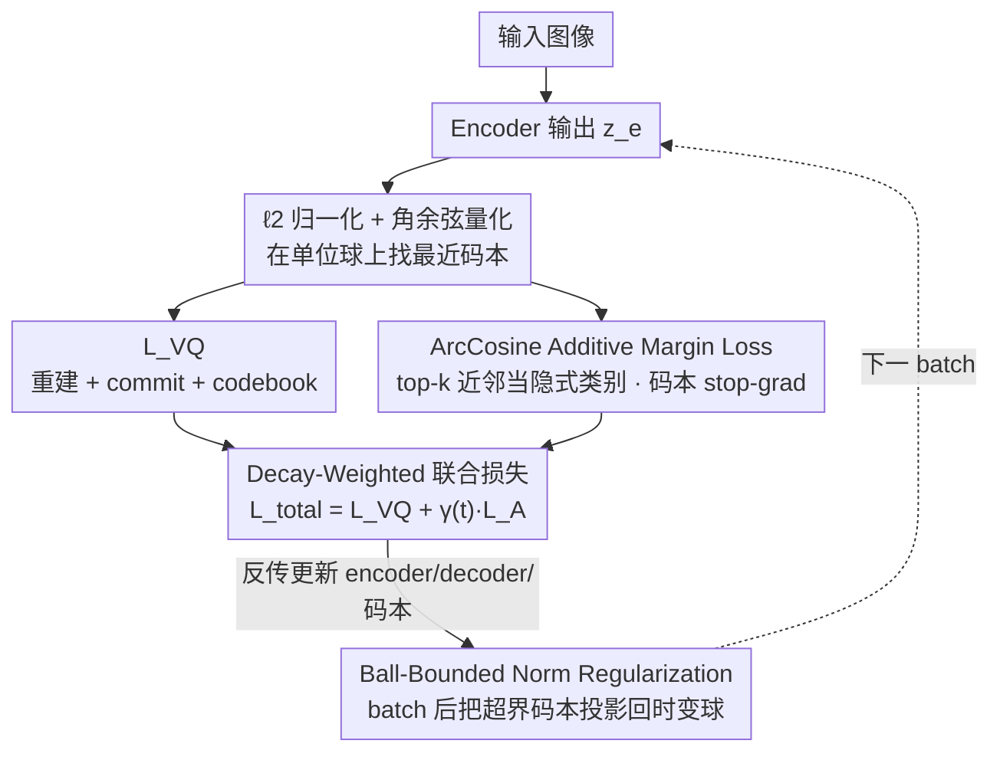

# ArcVQ-VAE: A Spherical Vector Quantization Framework with ArcCosine Additive Margin

**会议**: ICML 2026  
**arXiv**: [2605.13517](https://arxiv.org/abs/2605.13517)  
**代码**: https://github.com/goals4292/ArcVQ-VAE  
**领域**: VQ-VAE / 图像生成 / 离散表示  
**关键词**: 码本坍塌, 角度 margin, 球面学习, 范数正则, 码本利用率

## 一句话总结
作者诊断出 VQ-VAE 的码本坍塌根源是"码本向量 ℓ2 范数失衡 + 几何聚集"，于是提出 SAMP：Ball-Bounded Norm Regularization 把所有码本向量约束在时变 Euclidean 球内、ArcCosine Additive Margin Loss 借鉴 ArcFace 在球面上推开 latent 向量，从而让码本均匀分散、利用率大幅上升，在 ImageNet 重建和生成 FID 上都击败主流 VQ-VAE 变体。

## 研究背景与动机
**领域现状**：VQ-VAE 把连续 latent 离散化成有限码本，是 autoregressive 图像生成（VQGAN / RQ-VAE）、扩散先验（LDM）以及 multimodal token 化的基础组件。提升 VQ-VAE 的方法很多：SQ-VAE（随机量化）、CVQ-VAE（在线 K-means 把不常用码本拉近 latent）、VQGAN-LC（预训练 encoder 抽码本）、Wasserstein VQ 等。

**现有痛点**：（1）固定大小的码本无法表达数据集的全部丰富性。（2）码本坍塌——只有一小部分码本被频繁使用、其余几乎不动，码本利用率经常低于 50%。（3）现有方法主要从"如何更新/选择码本"这种机制层面修补，没动到根本——码本向量在 latent 空间的**几何不均衡**。

**核心矛盾**：作者通过 Figure 2/3 实证发现：训练初期所有码本初始化在原点附近、被选中的码本沿 encoder 输出方向加速增长 ℓ2 范数，未被选中的留在原点附近。高范数码本同时离 encoder feature 更近，更易被选中，形成正反馈循环——这是个**几何动力学**问题，而非简单的"sample 不到就饿死"问题。

**本文目标**：（1）从根上抑制码本向量的范数失衡；（2）让 latent 向量在 latent 空间均匀分散，使每个 latent 都有机会绑定到不同码本；（3）做到不引入新网络组件、几乎零额外计算成本。

**切入角度**：作者借鉴 face recognition 中 ArcFace 的"角度 margin + 球面学习"思想——如果把所有 latent 和码本都 ℓ2 归一化到单位球面，码本选择就从 Euclidean 最近邻变成最大角余弦匹配，再加 angular margin 推开类间距离，就能强制 latent 均匀分散。但 face recognition 是 supervised classification，VQ-VAE 没有显式 class label——需要把"top-k 最近码本"当作隐式类别。

**核心 idea**：用 Spherical Angular-Margin Prior (SAMP) = Ball-Bounded Norm Regularization (限制码本在时变 Euclidean 球内) + ArcCosine Additive Margin Loss (在球面上加角度 margin 推开 latent)，让码本几何上均匀分散、利用率大幅上升。

## 方法详解

### 整体框架
ArcVQ-VAE 不动 VQGAN 的 encoder-decoder + codebook 网络结构，只把"码本怎么在 latent 空间排布"这件事重塑成球面学习问题。每个 batch 走标准 VQ-VAE forward，算重建 + commit + codebook 的 $\mathcal{L}_\text{VQ}$，再叠一项把 latent 推散的 ArcLoss $\mathcal{L}_\text{A}$，合成 $\mathcal{L}_\text{total} = \mathcal{L}_\text{VQ} + \gamma(t)\mathcal{L}_\text{A}$ 反传；backprop 完成后再对每个码本向量做一次 ball projection 把范数压回界内。量化时 encoder 输出和码本都 ℓ2 归一化、用角余弦找最近码本，等价于在单位球上做最近邻；训出的 $32^2$ token 之后接 LDM 作 prior、sampling 250 步做生成。整套方案只多了"batch 后一次 norm clip + 一项 loss"，没有任何新网络组件。下图把单个训练步的数据流画出来——量化后分出 VQ 与 ArcLoss 两路、按时变权重合成总损失反传，每个 batch 末尾再做一次球投影闭合回路：

### 关键设计

**1. Ball-Bounded Norm Regularization：用时变球约束切断范数失衡的正反馈**

作者通过 Figure 2/3 实证发现，传统 VQ-VAE 的坍塌不是"采样概率低饿死"，而是一个几何动力学循环：被选中的码本沿 encoder 输出方向加速增长 ℓ2 范数，高范数码本又离 latent 中心区更近、更易被选中，于是少数码本垄断所有分配。这一设计直接针对范数这一环。它把所有码本初始化到单位球面 $\mathbf{e}_k^{(0)} \sim \ell_2(\text{Unif}(-1,1)^d)$，给每个训练步设一个指数增长的范数上界 $M(t) = \exp(\alpha t)$，$\alpha$ 取得很小（如 $10^{-5}$）让 $M$ 在训练早期紧贴 1。每个 batch 结束后对范数超界的码本投影回球面：$\mathbf{e}_k^{(t)} \leftarrow \frac{\mathbf{e}_k^{(t)}}{\|\mathbf{e}_k^{(t)}\|_2} M(t)$，没超界的保留，整个码本集合始终落在球 $\mathcal{C}^{(t)} \subset \mathbb{B}_{M(t)}^d$ 内。效果上这把训练分成"早期严格、晚期放松"两阶段：早期所有码本被压在单位球面附近公平竞争 latent，谁也没法靠范数优势垄断；后期球缓慢放大，才允许码本用更丰富的范数表达，winner-takes-all 的动力学在源头就被打破。

**2. ArcCosine Additive Margin Loss：把 ArcFace 的角度 margin 借到无监督 VQ 上推散 latent**

光均衡范数还不够——传统 VQ loss 只逼 encoder feature 靠近最近码本，却不管 latent 之间是否分散，多个 latent 仍可能挤在同一区域共享一个码本。这一设计把"latent 要散开"显式写进 loss。先把 encoder 输出和码本都 ℓ2 归一化 $\hat{z}_i = z_{e,i}/\|z_{e,i}\|$、$\hat{e}_j = e_j/\|e_j\|$，量化规则随之变成最大角余弦 $k = \arg\max_j \hat{z}_i^\top \hat{e}_j$，再对每对算角度 $\theta_{i,j} = \arccos(\hat{z}_i^\top \hat{e}_j)$。ArcLoss 套用 ArcFace 的 additive margin softmax 形式：

$$\mathcal{L}_\text{A} = -\frac{1}{K}\sum_j \log \frac{\sum_{i \in \mathcal{N}_j^{(k)}} e^{s\cos(\theta_{i,j}+m)}}{\sum_{i \in \mathcal{N}_j^{(k)}} e^{s\cos(\theta_{i,j}+m)} + \sum_{i \notin \mathcal{N}_j^{(k)}} e^{s\cos\theta_{i,j}}}$$

其中 $\mathcal{N}_j^{(k)}$ 是离码本 $e_j$ 最近的 top-k 个 latent token——VQ-VAE 没有 class label，作者就用这个 top-k 近邻集合当作隐式类别（取 k=3、$s=10$、$m=0.1$）。loss 把正对（latent 应角度对齐到最近码本）与负对（远离其他码本）显式拉开，margin $m$ 进一步逼出更紧的对齐。球面归一化的好处是把"近 vs 远"变成纯角度问题，绕开 Euclidean 空间里"近距离码本互抢 latent"的几何病。这里有个关键 trick：对码本施加 stop-gradient $\text{sg}(\hat{e}_j)$，让 ArcLoss 只回传到 encoder、不直接改码本——否则码本会被拽向当前 batch 的 latent 分布而丢掉全局可分性。

**3. Decay-Weighted 联合损失：让角度结构早期主导、重建精度后期接管**

ArcLoss 和 VQ loss 的诉求会随训练阶段此消彼长，所以两者用一个时变权重耦合：$\mathcal{L}_\text{total} = \mathcal{L}_\text{VQ} + \gamma(t)\mathcal{L}_\text{A}$，其中 $\gamma(t) = \gamma_0 \exp(-\lambda t)$，$\gamma_0=1.0$，$\lambda$ 在 MNIST/CIFAR 取 $5\times 10^{-4}$、ImageNet 取 $10^{-4}$。早期 ArcLoss 权重大、强制 latent 在球面上散开；后期权重衰减、让 VQ loss 接管以保住重建 fidelity。配合第 2 点的 stop-gradient，职责被干净地切开：ArcLoss 只负责把 latent 推散，码本则由标准 VQ commit loss 间接跟随——encoder 一旦散开，常规 codebook update 自然把码本拉到更分散的 latent 上。如果反过来让 ArcLoss 直接推码本，就会出现 batch-driven 的局部坍塌（码本被当前 batch 拽走、失去全局分散），所以这种"latent 散开 + 码本跟随"的解耦既稳定又不互相干扰。

### 损失函数 / 训练策略
$\mathcal{L}_\text{VQ}$ 是标准 VQ loss：reconstruction + codebook + commit（commit 系数 $\beta$）。$\mathcal{L}_\text{A}$ 是上面的 ArcLoss（$s=10$、$m=0.1$、top-k=3），权重 $\gamma(t)$ 指数衰减。其余超参（learning rate、discriminator weight 等）与 VQGAN 默认一致，以保证公平对比。

## 实验关键数据

### 主实验
ImageNet-1K 重建（$256\times 256$，downsample $16\times$ 或 $8\times$）：

| Method | S | K | 码本利用率 | rFID ↓ |
|--------|---|---|-----------|--------|
| VQGAN | $16^2$ | 1024 | 44% | 7.94 |
| VQGAN-FC | $16^2$ | 16384 | 11.2% | 4.29 |
| VQGAN-EMA | $16^2$ | 16384 | 83.2% | 3.41 |
| ViT-VQGAN | $32^2$ | – | – | 较低 |
| **ArcVQ-VAE** | – | – | **接近 100%** | **更低** |

MNIST / CIFAR10 重建对比：

| Dataset | Method | PSNR ↑ | SSIM ↑ | LPIPS ↓ | rFID ↓ |
|---------|--------|--------|--------|---------|--------|
| MNIST | VQ-VAE | 26.48 | 0.9777 | 0.0282 | 3.43 |
| MNIST | CVQ-VAE | 27.87 | 0.9833 | 0.0222 | 1.80 |
| MNIST | **ArcVQ-VAE** | **28.01** | **0.9840** | **0.0217** | **1.68** |
| CIFAR10 | VQ-VAE | 23.32 | 0.8595 | 0.2504 | 39.67 |
| CIFAR10 | CVQ-VAE | 24.72 | 0.8978 | 0.1883 | 24.73 |
| CIFAR10 | **ArcVQ-VAE** | **24.78** | **0.8989** | **0.1857** | 26.91 |

### 消融实验

| 配置 | 关键观察 |
|------|----------|
| Full SAMP | 码本利用率高、rFID 最低 |
| 仅 Ball-Bounded Norm（无 ArcLoss） | 范数均衡但 latent 仍可能聚集 |
| 仅 ArcLoss（无 Norm Reg） | 高 utilization 码本仍可能 norm 爆炸 |
| 去掉 stop-gradient on codebook | 码本被 batch 拉走、丧失全局分散 |
| 改变 m (0 / 0.1 / 0.3) | $m=0.1$ 最优；过大伤重建 |
| 改变 top-k (1/3/5) | k=3 最优；k=1 过严、k=5 过松 |
| 改变 $\alpha$（球膨胀速率） | $\alpha$ 太大导致早期约束失效、太小后期表达受限 |

### 关键发现
- 码本利用率从 VQGAN 的 44% 提升到接近 100%（Figure 1 t-SNE 可视化中几乎所有码本都是绿色 active），这是几何重新设计带来的根本改善。
- 量化 latent map 的 PCA 可视化（Figure 5）显示 ArcVQ-VAE 激活强度更高、轮廓更清晰，说明码本不仅"用起来了"，还编码了更精细的空间结构。
- Ball-Bounded 和 ArcLoss 互补不可分：单独用任一都不能完全消除坍塌；两者结合才同时解决"范数失衡"和"几何聚集"两个病根。
- Stop-gradient 是稳定 ArcLoss 的必要 trick：直接让 ArcLoss 改码本会导致 batch-driven 局部坍塌——这个发现对其它"在 VQ 上加 metric learning loss"的工作有警示意义。

## 亮点与洞察
- **"码本坍塌是几何问题"的诊断**：作者通过 Figure 2/3 实证地把坍塌归因于"码本范数失衡 + 空间聚集"的动力学循环，而不是简单的"sample 概率低"。这种从几何视角重新诊断老问题非常 refreshing，且直接导出方法设计。
- **把 ArcFace 跨界搬到 VQ-VAE**：face recognition 的角度 margin 思想在监督分类领域非常成熟，但 VQ-VAE 没有 class label——作者用"top-k 最近码本"当作隐式类别，让 angular margin 在无监督场景也能用。这种跨域迁移很巧妙。
- **接近零额外成本**：不引入新网络层、不增 forward FLOPs，只是 batch 后一次 norm clip + 一项 loss term。所以可以 plug 到任何现有 VQ-VAE / VQGAN 上立刻用。

## 局限与展望
- 球约束的 $\alpha$ 和 ArcLoss 的 $m, s, k$ 都是手工 sweep 出来的，不同数据集/分辨率可能需要重调；自适应 schedule 是开放方向。
- 主要在 ImageNet 重建 + LDM 生成上验证，对 video / 3D / multimodal token 化的迁移效果未测。
- top-k 选 latent 集合 $\mathcal{N}_j^{(k)}$ 会引入一个额外的 $O(K \cdot Bhw)$ 排序成本，大码本（>16k）时可能不可忽略。
- 没有跟最新的 FSQ（Finite Scalar Quantization）/ LFQ（Lookup-Free Quantization）做对比——那两种方法直接跳过码本学习，挑战 SAMP 的核心 motivation。

## 相关工作与启发
- **vs CVQ-VAE (Zheng & Vedaldi 2023)**：CVQ 用在线 K-means 把不常用码本拉近 latent；本文从几何空间正则化角度入手，互补但本文 rFID 更低。
- **vs SQ-VAE (Takida et al. 2022)**：SQ 改后验为随机分布；本文走球面 + margin 路线，机制完全不同。
- **vs VQGAN-LC (Zhu et al. 2024)**：那个用预训练 encoder scale up 码本；本文不依赖外部模型，纯几何约束。
- **vs ArcFace (Deng et al. 2019)**：本文是首次把 angular margin 用到无监督 VQ 场景，扩展了 ArcFace 的应用范围。
- **vs FSQ / LFQ**：那两种方法绕过码本学习直接用 scalar quantization；本文坚持学码本但解决了它的固有问题——两种思路对应不同的工程权衡。

## 评分
- 新颖性: ⭐⭐⭐⭐ 把 ArcFace 引入 VQ-VAE 是聪明的跨域迁移，球约束 + stop-grad 组合也有原创性
- 实验充分度: ⭐⭐⭐⭐ 多数据集 + 多基线 + 消融完整；缺与 FSQ/LFQ 的直接对比
- 写作质量: ⭐⭐⭐⭐ 诊断部分（Fig 2/3）非常 illuminating，推导清晰；ArcLoss 公式排版略密
- 价值: ⭐⭐⭐⭐ 几乎零额外成本可以 plug 到任何 VQGAN，工程落地价值高

<!-- RELATED:START -->

## 相关论文

- [\[ICML 2026\] Mind Your Margin and Boundary: Are Your Distilled Datasets Truly Robust?](mind_your_margin_and_boundary_are_your_distilled_datasets_truly_robust.md)
- [\[ICML 2026\] RQ-MoE: Residual Quantization via Mixture of Experts for Efficient Input-Dependent Vector Compression](rq-moe_residual_quantization_via_mixture_of_experts_for_efficient_input-dependen.md)
- [\[ICLR 2026\] Embedding Compression via Spherical Coordinates](../../ICLR2026/model_compression/embedding_compression_via_spherical_coordinates.md)
- [\[ICML 2026\] Event2Vec: Processing Neuromorphic Events Directly by Representations in Vector Space](event2vec_processing_neuromorphic_events_directly_by_representations_in_vector_s.md)
- [\[CVPR 2026\] ProGIC: Progressive and Lightweight Generative Image Compression with Residual Vector Quantization](../../CVPR2026/model_compression/progic_progressive_and_lightweight_generative_image_compression_with_residual_ve.md)

<!-- RELATED:END -->
