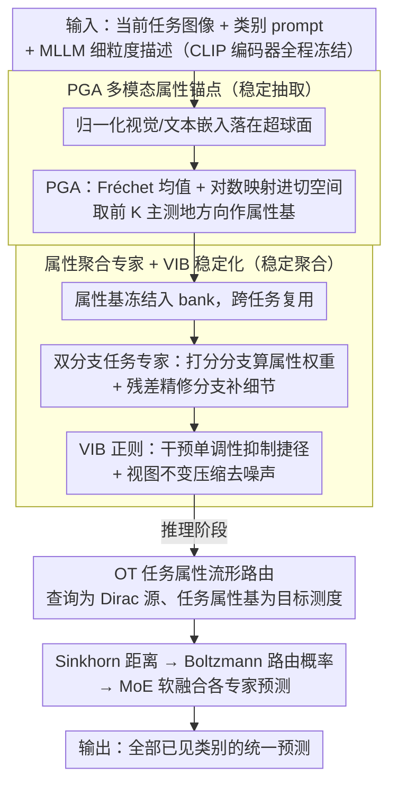

# AREA: Attribute Extraction and Aggregation for CLIP-Based Class-Incremental Learning

**会议**: ICML 2026  
**arXiv**: [2605.28809](https://arxiv.org/abs/2605.28809)  
**代码**: https://github.com/LAMDA-CL/ICML2026-AREA  
**领域**: 模型压缩 / 持续学习  
**关键词**: CLIP, 类增量学习, 属性锚点, 主测地分析, 最优传输路由  

## 一句话总结
这篇论文把 CLIP 类增量学习中的遗忘拆成“属性抽取漂移”和“属性聚合漂移”，提出 Area 用 PGA 在超球面上固定视觉/文本属性锚点，再用轻量任务专家、VIB 正则和 OT 路由稳定属性聚合，从而在九个 CLIP-CIL benchmark 上显著提升平均精度和最终精度。

## 研究背景与动机
**领域现状**：类增量学习要求模型按任务顺序学习新类别，同时保持对旧类别的识别能力。CLIP 这类视觉语言模型提供了强大的共享图文嵌入空间，因此很多 CIL 方法选择冻结 CLIP 主干，只训练 prompt、adapter、LoRA 或少量任务专属模块，以减少灾难性遗忘。

**现有痛点**：CLIP 的分类常被写成图像嵌入和类别文本嵌入之间的一个余弦相似度，但这个相似度其实混合了两件事：模型从图像/文本中抽取哪些属性，以及它如何加权这些属性形成最终判别。只用当前任务数据训练时，新类别会同时拉动属性抽取和属性加权，旧类相关属性被稀释或重新组合，最终出现遗忘。

**核心矛盾**：冻结 CLIP 主干能减少参数漂移，却不能保证属性层面的稳定。新任务到来时，模型仍然需要为新类引入车轮、窗户、颜色、形状等新属性，并更新这些属性的组合方式；如果没有旧数据约束，这种更新会偏向当前任务，造成旧类别的属性证据失衡。

**本文目标**：作者希望把 CLIP-CIL 的预测机制显式分解为 attribute extraction 和 attribute aggregation，并分别设计稳定机制：抽取端用几何锚点固定类级视觉/文本属性，聚合端用任务专家和信息瓶颈减少任务捷径，推理端用分布式任务路由避免选错专家。

**切入角度**：CLIP 嵌入通常归一化到单位超球面，因此直接用欧氏 PCA 提取属性方向会忽略球面几何。Area 使用 Principal Geodesic Analysis 在超球面切空间中提取类级属性基，并把这些基作为之后任务复用的锚点。

**核心 idea**：把每个类别的视觉和文本证据锚定为一组球面属性方向，再让轻量专家学习如何在不同任务中稳定聚合这些锚点，而不是反复改写 CLIP 主干或旧类表示。

## 方法详解
Area 的方法围绕“抽取稳定”和“聚合稳定”两条线展开。抽取稳定解决的是旧类别属性方向随新任务漂移的问题；聚合稳定解决的是任务专家在当前任务数据上学到 shortcut、从而错误加权属性的问题。

### 整体框架
在第 $b$ 个任务到来时，模型只访问当前任务数据 $\mathcal{D}^b$，不能回看旧任务样本。CLIP 的视觉编码器 $g_v$ 和文本编码器 $g_t$ 全程冻结。对于每个新类别，Area 先从当前图像得到归一化视觉嵌入，并结合类别 prompt 与 MLLM 生成的细粒度描述得到文本嵌入。

随后，模型在视觉和文本两侧分别用 PGA 构造类别原型和属性基。每个类别的属性基一旦生成就被冻结，成为后续任务可复用的属性 bank。训练时，Area 为每个任务增加轻量级专家，专家包含 attribute scoring branch 和 residual refinement branch，用于把固定属性基组合成任务相关但不易漂移的判别表示。

推理时，输入图像可能来自任意已学习任务。Area 不用简单的点对点余弦相似度判断任务，而是把输入嵌入看作 Dirac 源分布，把每个任务的属性锚点集合看作目标分布，用 Sinkhorn 最优传输距离得到任务路由概率，再软融合各任务专家的预测。

### 关键设计
1. **PGA 多模态属性锚点**:

	- 功能：在视觉和文本两侧为每个类别建立固定属性子空间，抑制属性抽取漂移。
	- 核心思路：对类别 $c$ 的归一化 CLIP 特征，先在单位超球面上求 Fréchet mean $\mu_c$，再通过 logarithmic map 把样本映射到切空间，计算协方差并取前 $K$ 个主方向作为属性基。文本侧用类别 prompt 与 MLLM caption 融合后重复同样过程。
	- 设计动机：CLIP 的 cosine embedding 天然在超球面上，PGA 比欧氏 SVD 更尊重几何结构。冻结这些属性方向后，旧类别的细粒度证据不会随着后续任务训练而被重新抽取。

2. **属性聚合专家与 VIB 稳定化**:

	- 功能：让每个任务学习如何加权属性，同时避免专家依赖当前任务中的偶然捷径。
	- 核心思路：score branch 输出样本级属性权重，residual refinement branch 补充细节修正。训练目标在标准 contrastive loss 外加入两个 VIB surrogate：intervention monotonicity 要求遮挡后证据不应异常增加，invariant compression 要求不同增强视图下的属性 evidence 接近视图均值。
	- 设计动机：类增量学习中的遗忘不仅来自表示漂移，也来自聚合权重偏向新任务。信息瓶颈式约束让专家保留类别相关属性、压缩视图噪声和任务 shortcut。

3. **基于最优传输的任务属性流形路由**:

	- 功能：在推理时选择或混合最匹配的任务专家，减少跨任务语义重叠造成的误路由。
	- 核心思路：输入嵌入构成源测度，每个任务的属性基构成经验目标测度；模型用 cosine cost 计算 entropic OT / Sinkhorn 距离，再用 Boltzmann 分布转为任务概率，最后对各专家预测做加权求和。
	- 设计动机：点对点相似度容易被局部特征漂移影响。OT 比较的是输入和整个任务属性流形之间的分布匹配，更适合长序列增量学习中的任务选择。

### 损失函数 / 训练策略
训练目标包括标准 CLIP 式对比损失和稳定聚合正则。VIB 的形式是最小化 $-I(\mathcal{Z};Y)+\beta I(\mathcal{Z};X)$，实际优化时用 intervention loss 与 compression loss 近似：前者惩罚遮挡视图比原图产生更强属性证据，后者约束多增强视图的视觉/文本 score 围绕均值稳定。

整体稳定化目标为 $\mathcal{L}_{stab}=\lambda_{int}\mathcal{L}_{int}+\lambda_{comp}\mathcal{L}_{comp}+\mathcal{L}_{cont}$。实验中 CLIP ViT-B/16 作为主干，主干冻结；Area 的可训练参数量为 0.52M，和其他 prompt/adapter 类方法同一量级。

## 实验关键数据

### 主实验
论文在 CIFAR100、CUB200、ObjectNet、ImageNet-R、Aircraft、Cars、Food101、SUN397、UCF101 九个数据集上评估。指标包括增量过程平均精度 $\bar{\mathcal{A}}$ 和最后阶段精度 $\mathcal{A}_B$。

| 数据集 / 设置 | 指标 | Area | 强基线结果 | 提升 / 说明 |
|--------|------|------|----------|------|
| Aircraft B0 Inc10 | $\bar{\mathcal{A}}$ / $\mathcal{A}_B$ | 71.03 / 61.78 | RAPF 50.38 / 23.61 | 在细粒度飞机分类上大幅降低遗忘 |
| Cars B0 Inc10 | $\bar{\mathcal{A}}$ / $\mathcal{A}_B$ | 97.77 / 96.17 | MG-CLIP 88.21 / 79.73 | 属性锚点对细粒度视觉差异非常有效 |
| CIFAR B0 Inc10 | $\bar{\mathcal{A}}$ / $\mathcal{A}_B$ | 89.24 / 83.69 | MG-CLIP 89.74 / 82.78 | 平均精度接近最优，最终精度更高 |
| CUB B0 Inc20 | $\bar{\mathcal{A}}$ / $\mathcal{A}_B$ | 87.69 / 82.14 | RAPF 79.09 / 62.77 | 鸟类细粒度任务中最终精度优势明显 |
| ObjectNet B0 Inc20 | $\bar{\mathcal{A}}$ / $\mathcal{A}_B$ | 61.02 / 49.20 | RAPF 53.78 / 34.97 | 对强域偏移数据集更稳 |
| UCF101 B0 Inc10 | $\bar{\mathcal{A}}$ / $\mathcal{A}_B$ | 95.54 / 88.71 | RAPF 92.28 / 80.33 | 视频动作类别图像化设置下仍有收益 |

### 消融实验
论文用组件消融、caption 来源、标注覆盖率、路由效率等分析验证 Area 的设计。表中列出最能说明问题的两组分析。

| 配置 / 分析 | 关键指标 | 说明 |
|------|---------|------|
| Baseline ZS-CLIP | CIFAR B0 Inc10 随任务推进明显下降 | 只靠零样本 CLIP 难以抵抗任务分布变化 |
| w/ Attribute | 相比 baseline 大幅提升 | 固定属性锚点提供旧类稳定参考 |
| w/ VIB Loss | 在 Attribute 基础上继续提升 | 信息瓶颈减少任务 shortcut 和视图噪声 |
| w/ OT | 最终整体最好 | 分布式路由减少任务专家误选 |
| OT vs cosine routing | 最终 100 类阶段 +3.39% 准确率，额外 2.9 ms/sample | OT 带来较优准确率-效率折中 |

| Caption 设置 | Aircraft $\bar{\mathcal{A}}$ / $\mathcal{A}_B$ | CIFAR $\bar{\mathcal{A}}$ / $\mathcal{A}_B$ | CUB $\bar{\mathcal{A}}$ / $\mathcal{A}_B$ |
|------|---------|---------|---------|
| Area + GPT5 captions | 71.03 / 61.78 | 89.24 / 83.69 | 87.69 / 82.14 |
| Area + LLaVA captions | 70.89 / 60.95 | 88.98 / 83.24 | 86.86 / 81.22 |
| RAPF + GPT5 captions | 50.38 / 23.61 | 86.14 / 78.04 | 79.09 / 62.77 |
| ZS-CLIP + GPT5 captions | 26.66 / 17.22 | 81.81 / 71.38 | 74.38 / 63.06 |

### 关键发现
- Area 在多数数据集上同时提升平均精度和最终精度，尤其是 Aircraft、Cars、CUB、ObjectNet 这类细粒度或域偏移明显的数据集，说明属性锚点确实能保护细粒度旧类知识。
- Caption 来源不是脆弱依赖。GPT5 caption 最强，但换成 LLaVA-v1.6-34B 或 LLaVA-7B 后性能只小幅下降；用 LLaVA-7B 标注 20% 样本仍能在 CIFAR-100 / CUB-200 上取得 81.36 / 80.84 的最终精度。
- PGA 锚点不是严格的人类可解释属性，而是 CLIP 空间中的抽象方向。最近文本 token 只呈现粗粒度语义关联，例如 envelope 关联 red、inscription，这提醒读者不要把“attribute”误解成完全符号化属性。
- 效率开销可控。推理延迟从 100 类的 16.4 ms/sample 增至 300 类的 18.2 ms/sample，原因是路由在任务级属性流形上进行，而不是逐类穷举匹配。

## 亮点与洞察
- 论文最有意思的是把 CLIP 相似度拆成“抽取什么属性”和“如何聚合属性”。这个分解让灾难性遗忘不再只是参数漂移问题，而是属性几何和证据加权共同漂移的问题。
- PGA 用得很贴合 CLIP。既然 CLIP 特征通过归一化落在超球面上，那么在切空间中做主测地方向比直接欧氏 PCA 更自然，也更能解释为什么 anchor 能保持类内细粒度结构。
- VIB 正则的两个 surrogate 设计较实用。遮挡后证据不应上升这一单边约束能抑制 shortcut，增强视图 score 靠近均值则让属性证据不依赖偶然数据增强。
- OT 路由是持续学习中很可迁移的 trick。很多任务选择方法只比较一个 query 和一个 prototype，Area 把任务看成属性分布，适合任务边界重叠、类别语义相近的长序列设置。

## 局限与展望
- 作者明确承认研究局限于冻结预训练视觉语言编码器的 CLIP-based CIL。若需要大幅更新 VLM 主干、处理生成式多模态模型或更复杂的 modality gap，Area 的稳定性仍需重新验证。
- 方法依赖 MLLM caption 来增强文本属性。虽然实验显示 caption 覆盖率和 captioner 强度不是绝对瓶颈，但在隐私敏感、专业图像或低资源领域，caption 质量和成本仍可能影响效果。
- 属性锚点的语义解释是粗粒度的。它们更像 representation direction，而非人类明确命名的属性；后续若要做可解释持续学习，需要更强的属性对齐或人工验证。
- OT 路由开销目前较小，但在任务数更高、每类属性数更大或移动端部署时仍需进一步压缩。可以考虑稀疏 Sinkhorn、候选任务预筛选或共享属性 bank。

## 相关工作与启发
- **vs prompt-based CIL**: Prompt 方法主要适配文本侧提示，Area 则把类别证据拆成视觉/文本属性锚点和聚合专家，更直接地处理属性漂移。
- **vs adapter / LoRA CIL**: Adapter 和 LoRA 通过少量参数更新平衡稳定性与可塑性，但仍可能改变属性加权方式。Area 在冻结主干外显式约束属性抽取和聚合，遗忘来源划分更细。
- **vs replay-based CIL**: Replay 通过保存旧样本提供真实旧类约束，性能通常强但有隐私和存储问题。Area 是 exemplar-free 设置，依靠属性锚点复用旧类信息。
- **vs MG-CLIP / RAPF**: 这些 CLIP-CIL 方法也利用预训练图文先验，Area 的关键差异在于用超球面 PGA 构造固定属性 bank，并用 OT 在任务属性流形上进行分布式路由。

## 评分
- 新颖性: ⭐⭐⭐⭐⭐ 从属性抽取/聚合双漂移解释 CLIP-CIL 遗忘，并组合 PGA、VIB 和 OT，整体思路新颖且完整。
- 实验充分度: ⭐⭐⭐⭐ 九个数据集和多组分析很扎实；组件消融若能给出更完整数值表会更好。
- 写作质量: ⭐⭐⭐⭐ 结构清楚，直觉例子好懂；“attribute”概念需要读到后文解释才不会误解为完全可解释属性。
- 价值: ⭐⭐⭐⭐⭐ 对冻结 VLM 的类增量学习很有参考价值，尤其适合细粒度识别、长任务序列和 exemplar-free 场景。

<!-- RELATED:START -->

## 相关论文

- [\[CVPR 2025\] Adapter Merging with Centroid Prototype Mapping for Scalable Class-Incremental Learning](../../CVPR2025/model_compression/adapter_merging_with_centroid_prototype_mapping_for_scalable_class-incremental_l.md)
- [\[AAAI 2026\] Compensating Distribution Drifts in Class-incremental Learning of Pre-trained Vision Transformers](../../AAAI2026/model_compression/compensating_distribution_drifts_in_class-incremental_learning_of_pre-trained_vi.md)
- [\[ICCV 2025\] Integrating Task-Specific and Universal Adapters for Pre-Trained Model-based Class-Incremental Learning](../../ICCV2025/model_compression/integrating_task-specific_and_universal_adapters_for_pre-trained_model-based_cla.md)
- [\[ICCV 2025\] Achieving More with Less: Additive Prompt Tuning for Rehearsal-Free Class-Incremental Learning](../../ICCV2025/model_compression/achieving_more_with_less_additive_prompt_tuning_for_rehearsal-free_class-increme.md)
- [\[NeurIPS 2025\] Mixture of Noise for Pre-Trained Model-Based Class-Incremental Learning](../../NeurIPS2025/model_compression/mixture_of_noise_for_pre-trained_model-based_class-incremental_learning.md)

<!-- RELATED:END -->
