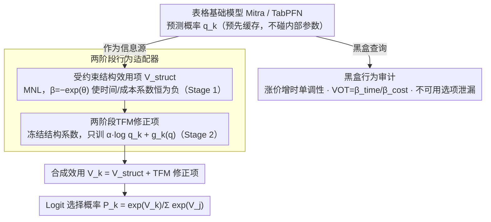

# Auditing and Fixing Economic Validity in Tabular Foundation Models for Discrete Choice

**会议**: ICML2026  
**arXiv**: [2605.26559](https://arxiv.org/abs/2605.26559)  
**代码**: 未公开  
**领域**: 其他 / 表格基础模型与离散选择  
**关键词**: 表格基础模型, 离散选择, 经济有效性, 行为约束, 政策评估  

## 一句话总结
本文发现TabPFN和Mitra等表格基础模型在离散选择任务中虽然准确率高，却会违反价格-需求单调性和值得信任的时间价值估计，因此提出两阶段行为适配器，把TFM预测嵌入受经济理论约束的效用模型中，在保持100%行为有效性的同时回收大部分准确率收益。

## 研究背景与动机
**领域现状**：交通出行、医疗方案、保险计划和商品选择等问题都可以被形式化为离散选择。传统经济学和交通领域常用多项Logit模型及其扩展来预测选择概率，因为它们从效用最大化出发，天然提供价格敏感性、时间价值和政策反事实分析等可解释量。

**现有痛点**：机器学习模型，特别是预训练表格基础模型，在分类准确率上经常超过MNL。但政策场景不只关心“预测对不对”，还关心模型在价格、时间等变量被干预时是否朝经济理论要求的方向变化。如果一个模型预测涨价后需求上升，或者推导出负的时间价值，它即使测试集准确率很高，也会误导票价制定和基础设施投资。

**核心矛盾**：TFM擅长从表格相关性中判断“谁会选什么”，但经济模型擅长回答“如果价格或时间改变，选择概率应该怎样变”。前者有准确率优势，后者有结构保证。直接蒸馏TFM会损失非线性信息，直接给TFM加约束又难以适配TabPFN这类in-context模型，也无法得到可解释经济系数。

**本文目标**：作者希望给表格基础模型加一层可审计、可解释、可用于政策干预的外壳，使模型同时具备较高预测精度、价格-需求单调性、合理的时间价值估计，以及对不可用选项的零概率约束。

**切入角度**：论文没有试图重训或改造TFM本体，而是把TFM输出的类别概率当作额外信息放进一个受约束的效用函数。结构化效用项先独立学习经济参数，之后冻结经济参数，再让TFM修正项解释MNL剩下的预测误差。

**核心 idea**：让经济模型负责反事实响应方向，让TFM负责观测级别的非线性辨别力，并用两阶段训练阻止TFM污染时间、成本等核心经济系数。

## 方法详解
这篇工作不打算提出更强的分类器，而是重新定义表格基础模型在政策选择任务里的角色：TFM不再直接输出最终选择概率，而是退到幕后当一个观测级信息源，为一个受经济理论约束的效用模型提供修正信号。整套流程分两步——先用黑盒查询审计TFM是否满足行为有效性，再用一个两阶段行为适配器把它的准确率优势安全地接进来。

### 整体框架
对每个样本 $x_i$ 和备选项 $k$，模型构造一个效用 $V_k(x_i)$，由两块拼成：一块是标准离散选择模型 $V_k^{struct}(x_i)$，含备选项常数、时间系数、成本系数和人口统计交互项；另一块来自TFM预测概率 $q_k(x_i)$，包括一个标量权重项 $\alpha\log q_k(x_i)$ 和一个小网络 $g_k(\mathbf{q}(x_i))$。最终选择概率仍走Logit公式 $P_k=\exp(V_k)/\sum_j\exp(V_j)$。实验在Swissmetro和LPMC两个交通方式选择数据集上做：先训练或调用Mitra、TabPFN v2拿到每个样本的预测概率并缓存，再交给适配器使用；审计和适配器训练全程不碰TFM内部参数，所以方法对黑盒或近黑盒的表格基础模型都适用。

### 关键设计

**1. 黑盒行为审计：用扰动而非准确率暴露TFM的经济失效**

政策模型不能只看测试集准确率，还得在输入被干预时朝经济理论要求的方向反应——一个预测"涨价后需求上升"或推出负时间价值的模型，准确率再高也会误导定价和投资决策。作者用一组最小侵入的黑盒查询来逼出这类问题：单调性测试把某备选项的成本或时间提高观测范围的 $1\%$，再看该选项预测概率是否下降；时间价值测试用系数比或有限差分估计 $VOT=\beta_{time}/\beta_{cost}$；可用性测试统计模型分给不可用备选项的平均概率（泄漏）。这些扰动直接照出TFM把相关性当因果的毛病，比如把高费用和高收入人群偏好搅在一起，从而预测涨价反而提升需求。

**2. 受约束结构效用项：把方向性约束写进参数化而不是事后惩罚**

要让"价格、时间增加必然降低对应效用"成为硬保证，作者把约束直接做进数学构造而非靠惩罚项兜底。结构效用项采用MNL规格，但时间、成本系数写成 $\beta=-\exp(\theta)$——无论优化器怎么更新无约束变量 $\theta$，系数恒为负，于是价格上升一定降低效用，且 $VOT$ 可从结构系数解析算出；不可用选项则直接令 $V_k=-\infty$ 得到零概率。这比惩罚项可靠：惩罚只能降低违规概率，不能保证任意干预下都单调，而负指数参数化给的是恒成立的硬约束。

**3. 两阶段TFM修正项：先锁住经济含义，再追求精度**

难点在于既要吸收TFM的准确率优势，又不能让它污染时间、成本这些核心经济系数。如果端到端联合训练，优化器会很快把信号塞进TFM修正分支，导致结构系数收缩到近零，$VOT$ 变成两个近零数的比值，经济含义崩坏。作者用两阶段切开这个冲突：Stage 1把修正项固定为零，只训练结构效用，相当于标准MNL；Stage 2冻结结构参数，只训练标量 $\alpha$ 和小网络 $g_k$，让TFM概率去解释MNL没捕捉到的非线性残差。由于政策响应完全由冻结的时间、成本系数决定，TFM修正项只能给样本层面加一个截距式偏移，无法颠倒价格响应方向。

### 损失函数 / 训练策略
两阶段共用的训练目标都是离散选择的负对数似然。Stage 1只优化结构效用参数，靠负指数参数化保证时间和成本系数为负；Stage 2在结构参数冻结后只优化TFM修正项，其中 $\alpha$ 衡量TFM概率的整体可信度，$g_k$ 从完整概率向量里学备选项级残差。实验中TFM概率在训练、验证、测试切分上预先算好并固定——这与政策分析的习惯一致：干预价格或时间时，个体其他观测信息保持不变，而适配器里的"其他信息"也包含TFM对该观测的整体判断，因此反事实响应完全交给结构效用项控制。

## 实验关键数据

### 主实验
核心结果来自Swissmetro和LPMC两个数据集。raw TFM准确率最高，但行为有效性明显不可靠；适配器牺牲很少准确率，换回完整单调性和可解释VOT。

| 数据集 | 模型 | Acc ↑ | Mono ↑ | VOT | Leak ↓ |
|--------|------|------|--------|-----|--------|
| Swissmetro | MNL | 63.7 | 100 | 79.7 CHF/hr | <0.001 |
| Swissmetro | Mitra | 77.7 | 90.3 | 0.30 CHF/hr | 0.208 |
| Swissmetro | TabPFN | 78.0 | 未审计 | 未审计 | 未审计 |
| Swissmetro | Adapter+Mitra | 76.6 | 100 | 79.7 CHF/hr | <0.001 |
| Swissmetro | Adapter+TabPFN | 76.6 | 100 | 79.7 CHF/hr | <0.001 |
| LPMC | MNL | 69.8 | 100 | PT 1.76 / Drive 18.3 GBP/hr | 不适用 |
| LPMC | Mitra | 74.2 | 50.8 | PT 7.47 / Drive -5.7 GBP/hr | 不适用 |
| LPMC | TabPFN | 74.4 | 未审计 | 未审计 | 不适用 |
| LPMC | Adapter+Mitra | 71.8 | 100 | PT 1.76 / Drive 18.3 GBP/hr | 不适用 |
| LPMC | Adapter+TabPFN | 72.1 | 100 | PT 1.76 / Drive 18.3 GBP/hr | 不适用 |

### 消融实验
论文重点比较了结构模型、raw TFM、蒸馏式思路和行为适配器的作用差异。下表将文中报告的关键对照整理为方法层面的消融。

| 配置 | 关键指标 | 说明 |
|------|---------|------|
| 仅MNL结构模型 | Swissmetro 63.7%, LPMC 69.8%, Mono 100 | 经济逻辑完整，但准确率落后TFM |
| raw Mitra | Swissmetro 77.7%, LPMC 74.2% | 准确率高，但Swissmetro VOT只有0.30 CHF/hr，LPMC单调性仅50.8% |
| 蒸馏MNL | Swissmetro 57.3%, LPMC 70.0% | 用TFM软标签训练MNL后，Swissmetro甚至低于标准MNL，说明学生模型容量成为瓶颈 |
| Adapter+Mitra | Swissmetro 76.6%, LPMC 71.8%, Mono 100 | 在Swissmetro回收约13个百分点准确率，同时保持MNL的经济系数 |
| Adapter+TabPFN | Swissmetro 76.6%, LPMC 72.1%, Mono 100 | 不依赖特定TFM，说明适配器机制可迁移 |
| LPMC 10次子采样 | +2.2±0.5个百分点, Mono 100 | 所有运行都有正收益，95% CI为[+1.2,+3.3] |

### 关键发现
- raw TFM的错误不是小噪声，而是结构性行为失效。Mitra在LPMC中接近一半样本违反涨价降需求，驾驶VOT中位数为负，并且65%的驾驶VOT估计为负。
- Swissmetro中Mitra虽然单调性达到90.3%，但VOT只有0.30 CHF/hr，远低于文献中的50-100 CHF/hr区间，这会让政策模型严重低估时间节省价值。
- 适配器不会超过raw TFM准确率，它的作用是把TFM的准确率优势尽量转移到受约束模型中。作者明确指出它“回收收益”，而不是凭空创造收益。
- 修正项在不同数据集上的贡献不同。Swissmetro中 $\alpha$ 超过1.0，说明TFM是主要准确率来源；LPMC中 $\alpha$ 约0.41-0.44，说明MNL已经解释了更多结构。

## 亮点与洞察
- 论文把“准确率高但政策不可信”的问题说得很具体：不是泛泛谈可解释性，而是用单调性、VOT和不可用选项泄漏三个可操作指标审计模型。
- 两阶段训练设计很朴素但关键。它承认TFM和经济模型各有所长，避免把两者混成一个难以解释的端到端分类器。
- 方法对TFM本体要求很低，只需要预测概率，因此能适配in-context模型和AutoML封装模型。这一点对实际政策机构很重要，因为他们往往无法改动基础模型训练流程。
- 这篇工作也提醒表格基础模型评测不能只看分类准确率。只要下游任务涉及干预、定价或资源分配，就需要加入领域理论约束下的行为审计。

## 局限与展望
- 实验只覆盖两个交通方式选择数据集和两个TFM，虽然问题具有代表性，但还不足以证明所有表格基础模型在所有经济选择任务上都存在同类失效。
- 交通领域有明确经济约束，方法迁移到医疗、能源套餐或教育选择时，需要先定义该领域的合理行为审计指标。
- 适配器的收益依赖TFM质量。如果TFM预测本身很差，Stage 2最多退化回MNL附近，不能自动产生额外信息。
- TabPFN的行为审计因为in-context重推代价过高而省略，这让raw TabPFN与适配器之间的行为差异没有完整量化。
- 后续可以把结构项从MNL扩展到mixed logit、nested logit或神经嵌入选择模型，以处理偏好异质性、相关备选项和非线性效用，同时保留两阶段锁定经济含义的思想。

## 相关工作与启发
- **vs MNL / 离散选择模型**: MNL提供价格、时间和可用性约束，但表达能力有限。本文保留MNL的结构解释，同时让TFM修正观测级非线性残差。
- **vs raw TabPFN / Mitra**: TFM在小样本表格分类上很强，但它学习的是历史相关性，不保证干预方向正确。适配器把TFM从最终决策器降级为受约束效用模型中的信息源。
- **vs 知识蒸馏**: 蒸馏把TFM知识压进MNL学生模型，结果Swissmetro准确率只有57.3%，说明线性效用无法承载TFM的非线性信息。本文不压缩TFM，而是把它的概率作为额外解释变量。
- **vs 单调神经网络 / 约束网络**: 约束网络通常需要为每个应用重设架构，并且未必给出经济系数。本文通过结构效用项给硬约束和解析VOT，工程上更接近政策分析工作流。

## 评分
- 新颖性: ⭐⭐⭐⭐ 把TFM预测嵌入受约束离散选择模型的思路简洁有效，创新点主要在问题定义和训练流程。
- 实验充分度: ⭐⭐⭐⭐ 两个真实交通数据集和多个TFM对照足以支撑主张，但数据域和模型数量仍偏少。
- 写作质量: ⭐⭐⭐⭐⭐ 论文动机清楚，指标解释具体，实验表格直接暴露准确率与经济有效性的冲突。
- 价值: ⭐⭐⭐⭐⭐ 对表格基础模型进入政策、定价和公共决策场景很有警示意义，也给出了一条实用修复路径。

<!-- RELATED:START -->

## 相关论文

- [\[ICML 2026\] End-to-End Compression for Tabular Foundation Models](end-to-end_compression_for_tabular_foundation_models.md)
- [\[ICML 2026\] Quantifying the Uncertainty of Foundation Models with Singular Value Ensembles](quantifying_the_uncertainty_of_foundation_models_with_singular_value_ensembles.md)
- [\[ICML 2026\] BioArc: Discovering Optimal Neural Architectures for Biological Foundation Models](bioarc_discovering_optimal_neural_architectures_for_biological_foundation_models.md)
- [\[ICML 2026\] Active Tabular Augmentation via Policy-Guided Diffusion Inpainting](active_tabular_augmentation_via_policy-guided_diffusion_inpainting.md)
- [\[ICML 2026\] PRISM: Synergizing Vision Foundation Models via Self-Organized Expert Specialization](prism_synergizing_vision_foundation_models_via_self-organized_expert_specializat.md)

<!-- RELATED:END -->
