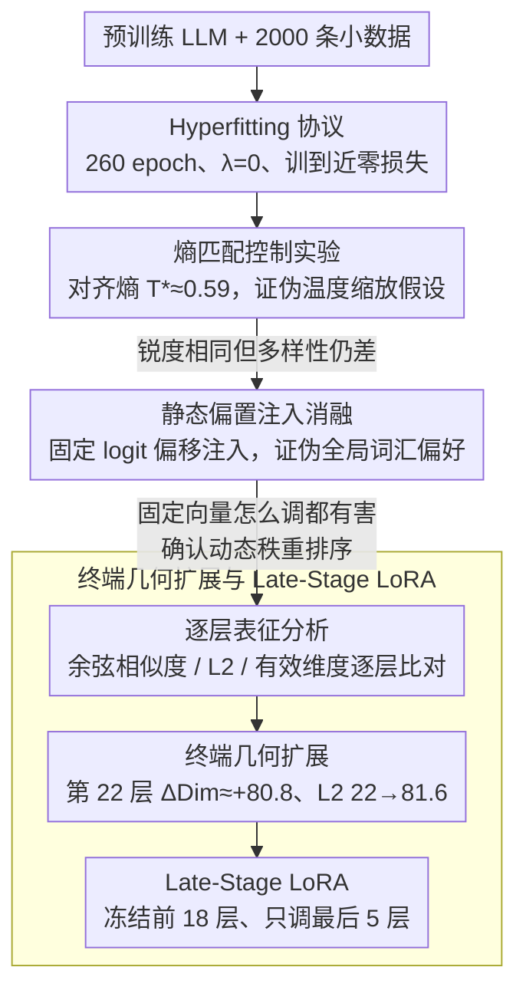

# Beyond Temperature: Hyperfitting as a Late-Stage Geometric Expansion

**会议**: ICML 2026  
**arXiv**: [2605.22579](https://arxiv.org/abs/2605.22579)  
**代码**: 无  
**领域**: 模型压缩 / 参数高效微调  
**关键词**: Hyperfitting, 秩重排序, 终端几何扩展, Late-Stage LoRA, 贪心解码退化  

## 一句话总结
本文通过控制实验证明 Hyperfitting（在小数据集上将 LLM 训练到近零损失）的本质不是温度缩放式的分布锐化，而是一种动态的、上下文相关的 token 秩重排序（Rank Reordering）机制，该机制集中发生在 Transformer 最后一层的"终端几何扩展"（$\Delta \text{Dim} \approx +80.8$），并据此提出仅微调最后 5 层的 Late-Stage LoRA，在减少约 80% 可训练参数的同时保持生成多样性。

## 研究背景与动机

**领域现状**：大语言模型在开放式文本生成中使用贪心/束搜索时经常退化为重复循环。随机采样方法（如 top-k、nucleus sampling）虽能缓解重复，但牺牲了一致性和文本质量。近期 Carlsson et al. (2025) 发现了一个反直觉现象——"Hyperfitting"：在仅 2000 条样本上将模型训练 260 个 epoch 直到近零损失，反而显著提升了贪心解码的生成质量和词汇多样性（TTR）。

**现有痛点**：Hyperfitting 虽然有效，但其底层机制不清楚。由于 hyperfitted 模型输出极低熵分布（$H \approx 1.5$ nats），一个自然的假设是：它是否仅等价于简单的温度缩放（$T < 1$）？如果是的话，这只是一个平凡的概率分布锐化操作，不代表新的学习动态。

**核心矛盾**：温度缩放是保秩变换（rank-preserving），即 $\text{argsort}(\mathbf{z}) \equiv \text{argsort}(\mathbf{z}/T)$，它无法改变 token 之间的相对排序。如果 Hyperfitting 等价于温度缩放，则重复 token 仍然会是贪心解码的赢家，多样性不应提升。

**本文目标**：(1) 严格证伪温度缩放假设；(2) 揭示 Hyperfitting 的真实机制；(3) 定位该机制在网络中的位置；(4) 基于机制洞察设计参数高效的替代方案。

**切入角度**：通过熵匹配控制实验、静态偏置注入消融、逐层表征分析三步递进，从"不是什么"到"是什么"到"在哪里"完整解剖 Hyperfitting 机制。

**核心 idea**：Hyperfitting 的本质是 Transformer 最终层的几何扩展——将隐状态的有效维度大幅扩张以容纳深尾 token 的上下文相关提升，因此仅微调最后几层即可复现全网微调的效果。

## 方法详解

### 整体框架
这篇论文不提新模型，而是对 Hyperfitting 这个反直觉现象做一次"法医式"解剖：先证伪它只是温度缩放的平凡假设，再逐层定位机制真正发生的位置，最后把定位结论翻译成一个参数高效的微调策略。整条线索从"不是什么"走到"是什么"再走到"在哪里、能怎么用"——输入是预训练 LLM（TinyLlama-1.1B、Qwen2.5-1.5B 等）和 2000 条小数据集，经过 Hyperfitting 协议（260 epoch、无正则化、$\lambda=0$）训成近零损失后，通过三组对照实验逐步逼近真相，最终落到只调最后几层的 Late-Stage LoRA。

### 关键设计

**1. 熵匹配控制实验：在同样"锐"的分布下逼问多样性从何而来**

Hyperfitted 模型输出极低熵（$H_{\text{hyper}} \approx 0.862$ nats），最省事的解释就是"它不过是把分布调尖了"，等价于一个 $T<1$ 的温度缩放。要驳倒这个假设，作者把混淆因素直接消掉：对原始模型数值求解一个标量 $T^* \approx 0.59$，使缩放后的熵恰好等于 $H_{\text{hyper}}$，于是两个模型"锐度"完全对齐，只剩排序方式可能不同。如果温度假设成立，二者的生成多样性就该一样；但熵匹配模型的 TTR 只有 0.397，Hyperfitted 却达 0.684（+71%），bigram 重复率 0.604 对 0.140，行为截然两样。关键在于温度缩放是保秩变换——$\text{argsort}(\mathbf{z}) \equiv \text{argsort}(\mathbf{z}/T)$，无论怎么调温，原来的重复 token 仍是贪心赢家；多样性既然提升了，就说明 Hyperfitting 真正改写了 token 之间的相对排序，而不只是把概率压向头部。

**2. 静态偏置注入消融：检验秩重排序是固定偏好还是随上下文而变**

排除了温度假设后，下一个怀疑对象是"全局词汇偏好"——也许 Hyperfitting 只是学了一套与上下文无关的固定 logit 偏移，谁排名升得多就给谁加分。作者把这个假设也做成可证伪的实验：取 Hyperfitted 模型里排名提升最大的 $K=500$ 个 token，算出它们的平均 logit 偏移 $\boldsymbol{\delta} \in \mathbb{R}^{|V|}$，再静态注入原始模型 $\mathbf{z}_{\text{synth}} = \mathbf{z}_{\text{orig}} + \alpha \cdot \boldsymbol{\delta}$，扫描 $\alpha \in [0.01, 0.5]$。结果是一面倒的失败：哪怕 $\alpha=0.01$ 也让重复率不降反升（0.588→0.609），$\alpha=0.5$ 时 TTR 暴跌到 0.215、直接模式坍塌，注入强度与质量的 Spearman 相关 $\rho=-0.94$，单调有害。一个固定向量加法既然怎么调都修不好，就反过来证明 Hyperfitting 的秩重排序是动态的、随上下文逐 token 变化的，它必然源自模型内部表征的改变，而不是输出端一层静态偏置。

**3. 终端几何扩展与 Late-Stage LoRA：把机制定位翻译成省参数的微调**

既然改变来自内部表征，就该能在某一层抓到它。作者逐层比对原始与 Hyperfitted 模型的余弦相似度、$L_2$ 距离和有效维度（Participation Ratio，即隐状态在多少个方向上有实质能量），画出一条清晰的三段式曲线：前 10 层几乎纹丝不动（余弦相似度 $>0.86$），像保留预训练语言能力的"语言锚点"；11–21 层轻微压缩，有效维度反而下降；真正的剧变集中在最后一层——第 22 层 $L_2$ 距离从 22.0 跳到 81.6（约 4 倍），有效维度暴增 $\Delta\text{Dim} \approx +80.8$，作者称之为"终端几何扩展"：模型在出口处把隐空间撑开，腾出新方向去托起那些原本埋在长尾里、但在当前上下文中其实该胜出的 token。这个定位直接给出省参数的配方——既然只有末端在动，就冻结前 18 层、只给最后 5 层挂 LoRA 适配器。结果在 TinyLlama 上 Top-1 Agreement 0.517 紧贴 Full LoRA 的 0.523，在更深的 Qwen2.5-1.5B 上甚至反超（TTR 0.591 vs 0.575），可训练参数却少了约 80%；冻结早期层本身还充当了结构正则，避免扰动预训练好的特征层次。

## 实验关键数据

### 主实验：Hyperfitting vs 温度缩放 vs 静态偏置

| 方法 | TTR ↑ | Bigram Rep. ↓ | Trigram Rep. ↓ | Top-1 Agreement ↓ | 预测熵 (nats) |
|------|-------|---------------|----------------|--------------------|---------------|
| Original (T=1.0) | 0.400 | 0.592 | 0.536 | 1.000 | 2.083 |
| Original (T=0.59, 熵匹配) | 0.397 | 0.604 | 0.548 | 0.997 | 0.875 |
| Static Injection (α=0.01) | 0.409 | 0.609 | — | — | — |
| Static Injection (α=0.50) | 0.215 | 0.706 | — | — | — |
| **Hyperfitted** | **0.684** | **0.140** | **0.069** | **0.570** | **0.862** |

### Late-Stage LoRA 消融实验

| 模型 / 配置 | TTR ↑ | Bigram Rep. ↓ | Top-1 Agree ↓ | 参数减少 |
|-------------|-------|---------------|---------------|----------|
| TinyLlama Original | 0.400 | 0.592 | 1.000 | — |
| TinyLlama Full LoRA | 0.508 | 0.331 | 0.523 | — |
| TinyLlama Late-Stage LoRA (L18-22) | 0.469 | 0.345 | 0.517 | ~78.3% |
| Qwen2.5-1.5B Original | 0.315 | 0.662 | 1.000 | — |
| Qwen2.5-1.5B Full LoRA | 0.575 | 0.248 | 0.469 | — |
| **Qwen2.5-1.5B Late-Stage LoRA (L24-28)** | **0.591** | **0.213** | **0.459** | **~82.7%** |

### 关键发现
- **熵-质量悖论**：在完全相同的预测熵下，温度缩放的 TTR 仅 0.397 而 Hyperfitting 达 0.684，证明多样性增益不来自分布锐化
- **深尾提升现象**：约 39.1% 的贪心解码决策中 Hyperfitted 模型覆盖了原始 Top-1 token，其中 12.9% 来自排名 >10 的深尾，部分 token 从排名 >200 被提升至 Top-1
- **Late-Stage LoRA 在深层模型上反超 Full LoRA**：在 Qwen2.5-1.5B 上 Late-Stage LoRA 不仅参数更少，还在 TTR（+0.016）和 Bigram Rep.（-0.035）上均优于 Full LoRA，冻结早期层起到了结构正则化作用
- **跨域鲁棒性**：在 Fiction-Stories、WritingPrompts、AG News 三个领域上均保持高 TTR 和 MAUVE 分数，效果不依赖微调数据的固有熵
- **LLM-as-Judge 评估**：Late-Stage LoRA 在 200 次成对比较中以 57.3% 胜率击败 Full LoRA（$p=0.02$），主要优势来自连贯性（+16.1 个百分点）

## 亮点与洞察
- **逐步证伪的分析范式**：通过"熵匹配 → 静态偏置注入 → 逐层表征"三步递进，先排除简单假设再揭示真实机制，这种排除法分析框架值得借鉴
- **终端扩展的定位发现**：Transformer 最终层的有效维度大幅扩展（$\Delta \text{Dim} \approx +80.8$）而早期层几乎不变，说明 LLM 的生成多样性瓶颈高度局部化，这一洞察可以迁移到其他 PEFT 场景——优先适配最后几层可能比均匀分配适配器更高效
- **"冻结即正则化"**：在较深的 Qwen 模型上 Late-Stage LoRA 反超 Full LoRA，提示冻结早期层可防止对预训练特征层次的扰动，本身就是一种有效的正则化

## 局限与展望
- 机制分析仅覆盖到 8B 参数的模型，70B+ 规模的行为未验证，终端扩展现象是否在超大模型中仍然成立待确认
- 评估指标（TTR、bigram 重复率）主要捕捉词汇多样性，未充分评估语义连贯性和事实准确性
- Hyperfitting 仍需 260 epoch 的长时间训练，虽然多样性效果在 20 epoch 时已初现，但缺少自动化的早停准则
- Late-Stage LoRA 在 TinyLlama（浅层模型）上略逊于 Full LoRA，说明"仅调最后几层"的策略效果与模型深度相关

## 相关工作与启发
- **Hyperfitting 原始发现**：Carlsson et al. (2025) 在 ICLR 2025 首次报告了过拟合反而提升生成质量的现象，本文在此基础上提供了机制解释
- **解码策略**：Min-p 采样和 GUARD 方法在推理时改善多样性，但都是随机的；Hyperfitting 实现了确定性贪心解码下的高多样性（TTR 0.67-0.69, MAUVE 0.82-0.91），两者正交可组合
- **参数高效微调**：LoRA 通常均匀应用于所有层，本文的终端定位发现为"非均匀 LoRA"提供了理论依据，可启发更精细的层级分配策略

<!-- RELATED:START -->

## 相关论文

- [\[ICML 2026\] The Shape of Addition: Geometric Structures of Arithmetic in Large Language Models](the_shape_of_addition_geometric_structures_of_arithmetic_in_large_language_model.md)
- [\[AAAI 2026\] Condensed Data Expansion Using Model Inversion for Knowledge Distillation](../../AAAI2026/model_compression/condensed_data_expansion_using_model_inversion_for_knowledge_distillation.md)
- [\[ICML 2026\] Beyond Tokens: Enhancing RTL Quality Estimation via Structural Graph Learning](beyond_tokens_enhancing_rtl_quality_estimation_via_structural_graph_learning.md)
- [\[ACL 2026\] Two-Stage Regularization-Based Structured Pruning for LLMs](../../ACL2026/model_compression/two-stage_regularization-based_structured_pruning_for_llms.md)
- [\[NeurIPS 2025\] Geometric Data Valuation via Leverage Scores](../../NeurIPS2025/model_compression/geometric_data_valuation_via_leverage_scores.md)

<!-- RELATED:END -->
