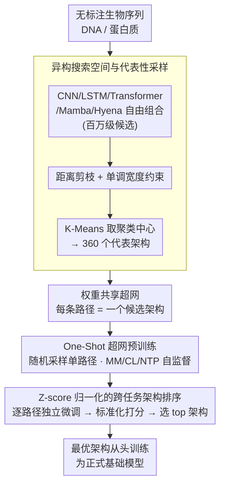

# BioArc: Discovering Optimal Neural Architectures for Biological Foundation Models

**会议**: ICML 2026  
**arXiv**: [2512.00283](https://arxiv.org/abs/2512.00283)  
**代码**: 无  
**领域**: 科学计算 / 神经架构搜索  
**关键词**: 生物基础模型, 神经架构搜索, 异构搜索空间, DNA/蛋白质建模, 混合架构  

## 一句话总结

BioArc 提出了一个面向生物基础模型的异构神经架构搜索框架，通过在包含 CNN/LSTM/Transformer/Mamba/Hyena 五种基本模块的搜索空间中自动发现最优混合架构，以不到 1/25 的参数量超越现有 SOTA 生物基础模型。

## 研究背景与动机

**领域现状**：当前生物基础模型（如 ESM、Nucleotide Transformer、DNABERT-2）几乎清一色照搬 Transformer 架构，但 Transformer 最初是为人类语言设计的，并不天然适配生物序列的特有"语法"。

**现有痛点**：生物序列面临双重挑战——一方面需要处理极长上下文（如全基因组），标准 Transformer 的二次复杂度代价过高；另一方面需要精确捕获局部结构基序（motif），而全局注意力机制并不天然偏好局部模式。更关键的是，生物领域缺乏像 NLP 那样有公认的最优架构范式，导致架构设计严重依赖人工直觉。

**核心矛盾**：生物信息由自然进化产生，其底层物理化学规律尚未完全揭示，因此无法像 NLP 那样基于对语言的先验理解来指导架构设计。同时，架构选择与分词策略、训练目标深度耦合，无法孤立优化。

**本文目标**：(1) 在一个异构搜索空间中自动发现最优生物序列架构；(2) 系统解耦架构、分词、训练策略三者的交互影响；(3) 验证发现的架构能否层级化地捕获生物语法。

**切入角度**：现有 NAS 方法局限于同构空间（如只调卷积层数/通道数）或至多两类模块的混合。作者将搜索空间扩展到五类异构模块的开放式组合，让数据驱动地发现最优拓扑。

**核心 idea**：用异构 NAS 在 CNN/LSTM/Transformer/Mamba/Hyena 五种模块的组合空间中搜索，自动发现面向 DNA 和蛋白质的最优混合架构。

## 方法详解

### 整体框架

BioArc 想回答的问题是：抛开"照搬 Transformer"的惯性，什么样的混合架构才真正适配生物序列？它把这件事交给数据来回答——先定义一个由 CNN/LSTM/Transformer/Mamba/Hyena 五类模块开放组合而成的搜索空间，再把所有候选架构编码进一张共享权重的超网（每条路径就是一个候选架构），用 one-shot 策略随机采样路径做自监督预训练；预训练完成后对采样到的架构逐一微调、跨任务归一化排名，选出最优架构再从头训练成正式的基础模型。

### 关键设计

**1. 异构搜索空间与代表性采样：让五类模块自由组合，又不被组合爆炸压垮**

生物序列同时要吃长上下文和局部基序，没有任何单一模块能两头都占优，所以 BioArc 干脆把五类模块放进同一个空间任由拼接。一条候选路径写成 $a = (l_1, l_2, \dots, l_d)$，由深度 $d \in \mathcal{D}$、模块类型元组 $\mathbf{m}$、隐层维度元组 $\mathbf{h}$ 三个维度共同定义。但异构空间里不同拓扑族的分布天然不均，直接均匀采样会大量命中彼此高度相似的冗余结构，把搜索预算浪费在重复模式上。为此 BioArc 用三步把空间收缩到 360 个代表性架构：先对维度做对数变换后按距离过滤，剔除拓扑上冗余的路径；再施加单调宽度约束（把最宽的层固定在最后），让参数更密集的模块获得更高的采样频率；最后用 K-Means 聚类、取各聚类中心作为代表。这样既保住了结构多样性，又把无法穷举的组合压到可计算的规模。

**2. One-Shot 超网预训练：一次预训练评估全部候选**

逐个独立训练 360 个架构成本难以承受，BioArc 把它们塞进一张权重共享的超网，每次前向只均匀随机采样一条路径 $a \sim \mathcal{A}$，并只更新这条路径对应的共享权重，目标是最小化自监督损失 $\min_W \mathbb{E}_{a \sim \mathcal{A}}[\mathcal{L}(\mathcal{A}(X; w(a)))]$。同一张超网兼容三种预训练目标——掩码建模（MM）、对比学习（CL）、下一 token 预测（NTP）——可直接比较不同目标对架构偏好的影响。随机路径采样本身还是一种正则化：每步只激活部分模块，迫使各模块各司其职、避免过度共适应，于是一轮预训练就能给出对所有候选的初步评估。

**3. Z-score 归一化的跨任务架构排序：让每个下游任务对排名的话语权相等**

候选架构最终要在一组异质下游任务上比高下，但这些任务用的指标量纲完全不同（分类看 Accuracy、回归看 RMSE），直接把原始分数相加会让数值分布更宽的任务主导排名。BioArc 先对每个任务 $t$ 的原始性能 $P_t(a)$ 做 Z-score 标准化再求平均：$\text{Score}(a) = \frac{1}{|\mathcal{T}|}\sum_{t \in \mathcal{T}} s_t \cdot \frac{P_t(a) - \mu_t}{\sigma_t}$，其中 $s_t \in \{1, -1\}$ 用来对齐"越大越好"还是"越小越好"的优化方向。这样每个任务都被拉到同一尺度，对最终排名贡献相等。值得注意的是，排序阶段是对每条路径单独微调来评估，而非微调整张超网，目的是剥离共享权重带来的耦合干扰，让排名反映架构本身的真实优劣。

## 实验关键数据

### DNA 主实验（GUE benchmark，12 个任务）

| 方法 | 参数量 | TFP-0 | TFP-1 | TFP-2 | TFP-3 | TFP-4 | CPD-all | CPD-notata | CPD-tata |
|------|--------|-------|-------|-------|-------|-------|---------|------------|----------|
| NT-2500M | 2500M | 66.31 | 68.30 | 58.70 | 49.08 | 67.59 | 67.39 | 67.46 | 69.66 |
| DNABERT-2 | 117M | 71.99 | 76.06 | 66.52 | 58.54 | 77.43 | 69.37 | 68.04 | 74.17 |
| VQDNA | 103M | 72.48 | 76.43 | 66.85 | 58.92 | 78.10 | 71.02 | 70.58 | 78.50 |
| **BioArc (mask-ft)** | **4.89M** | **84.80** | **86.00** | **85.80** | **77.10** | **89.20** | **83.60** | **85.43** | **89.40** |
| **BioArc (con-ft)** | **3.28M** | **84.80** | **86.10** | **86.50** | **77.50** | **89.30** | **83.53** | **84.66** | **90.05** |

BioArc 在所有 DNA 任务上全面超越基线，参数量仅为 DNABERT-2 的 1/24 至 1/36，性能提升达 12-19 个百分点。

### 蛋白质实验（PEER benchmark，控制对比）

| 方法 | 参数量 | Solubility | HumanPPI | PPIAffinity↓ | Fold | Subcellular | Binary |
|------|--------|-----------|----------|-------------|------|-------------|--------|
| ESM-2 8M (官方) | 8M | 73.48 | 80.16 | 3.098 | 22.14 | 71.47 | 91.25 |
| ESM-2 8M (复现) | 8M | 71.84 | 74.68 | 3.567 | 18.25 | 70.36 | 90.68 |
| **BioArc 8M** | **8M** | **73.29** | **76.79** | **2.756** | **20.75** | **72.77** | **91.82** |

在相同预训练条件下（完整 UniRef50，50K 步），BioArc 8M 在全部 6 个蛋白质任务上优于 ESM-2 8M，证明架构优势而非仅依赖预训练规模。

### 关键发现

| 发现 | 细节 |
|------|------|
| 最优 DNA 架构模式 | Hyena（长程依赖）→ Transformer（上下文关系）→ CNN（局部特征提取） |
| 相似任务共享架构 | TFP-3 与 TFP-4 的 Top 10% 架构相似度达 98.0% |
| 基础模型效果 | BioArc-F 以 1/20 参数、1/10 训练步数超越 DNABERT-2 |
| 分词与架构耦合 | Transformer 偏好 6-mer，CNN 偏好 1-mer，需协同优化 |
| 预训练策略无通用赢家 | 掩码建模整体最优，但从头训练在部分任务上更好 |
| 可解释性验证 | 混合架构层级化捕获启动子语法：Hyena 建立全局上下文→Transformer 锚定 TSS→CNN 检测 Inr+DPE 协同 |

## 论文评价

**优势**：
- 首次在生物序列领域构建包含五类异构模块的 NAS 搜索空间，突破了此前仅限两类模块混合的限制
- 发现的架构以极小参数量（3-8M）显著超越百倍大小的基线模型，展示了架构归纳偏置的重要性
- 系统性地解耦了架构、分词、训练策略的三方交互，为生物模型设计提供了可操作的指导原则
- 可解释性分析表明混合架构自发学习到了与已知生物学机制对应的层级表示

**不足**：
- 仅在 DNA 和蛋白质两种模态上验证，RNA 和单细胞数据的推广效果未知
- 搜索空间固定为 360 个代表性架构，可能遗漏某些有潜力的拓扑组合
- 蛋白质结构预测（如 Fold 任务）的绝对性能仍落后于大规模预训练的 ESM-2，说明架构优势不能完全替代数据规模

<!-- RELATED:START -->

## 相关论文

- [\[ICML 2026\] Quantifying the Uncertainty of Foundation Models with Singular Value Ensembles](quantifying_the_uncertainty_of_foundation_models_with_singular_value_ensembles.md)
- [\[ICML 2026\] End-to-End Compression for Tabular Foundation Models](end-to-end_compression_for_tabular_foundation_models.md)
- [\[ICML 2026\] PRISM: Synergizing Vision Foundation Models via Self-Organized Expert Specialization](prism_synergizing_vision_foundation_models_via_self-organized_expert_specializat.md)
- [\[ICML 2026\] Auditing and Fixing Economic Validity in Tabular Foundation Models for Discrete Choice](auditing_and_fixing_economic_validity_in_tabular_foundation_models_for_discrete_.md)
- [\[ICML 2026\] UB-SMoE: Universally Balanced Sparse Mixture-of-Experts for Resource-Adaptive Federated Fine-tuning of Foundation Models](ub-smoe_universally_balanced_sparse_mixture-of-experts_for_resource-adaptive_fed.md)

<!-- RELATED:END -->
