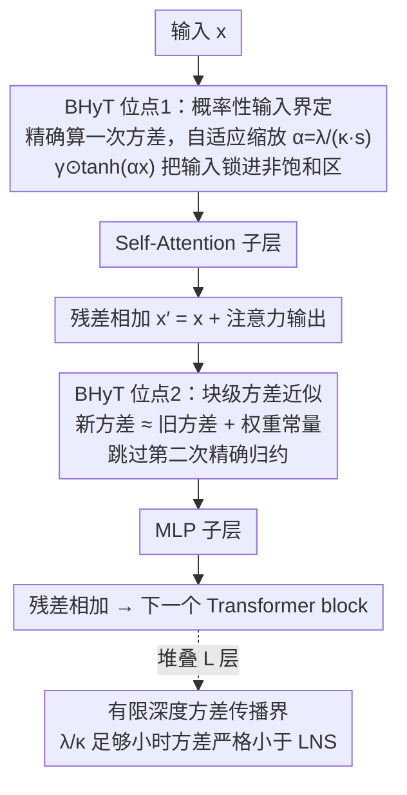

# Bounded Hyperbolic Tangent: A Stable and Efficient Alternative to Pre-Layer Normalization in Large Language Models

**会议**: ICML 2026  
**arXiv**: [2601.09719](https://arxiv.org/abs/2601.09719)  
**代码**: https://github.com/MLAI-Yonsei/BHyT  
**领域**: LLM效率  
**关键词**: 归一化替代, Transformer稳定性, 训练效率, 方差传播, 深度缩放

## 一句话总结

提出 Bounded Hyperbolic Tanh (BHyT)，一种基于数据驱动输入界定的 $\tanh$ 变换，作为 Pre-Layer Normalization 的即插即用替代，在抑制深度方向激活增长的同时避免重复方差计算，训练速度比 RMSNorm 快 1.6%、生成吞吐提升 1.77%，且下游性能全面优于现有方法。

## 研究背景与动机

**领域现状**：Pre-Layer Normalization (Pre-LN) 是当前 LLM 的标配设计，通常以 RMSNorm 实现，通过在 self-attention 和 MLP 子层前归一化来稳定深度网络训练。

**现有痛点**：Pre-LN 存在两个核心问题。第一，**深度诅咒** (curse of depth)——残差连接与 Pre-LN 的交互导致隐状态的幅度和方差随层数增长而快速膨胀，使深层 block 退化为代价昂贵的恒等映射。第二，**计算开销**——每个 block 需要在两个 Pre-LN 位点重复计算逐 token 的统计量（均值/方差），累积的归约操作成为训练和推理的延迟瓶颈。

**核心矛盾**：现有改进方法只能兼顾稳定性或效率之一。稳定性导向的方法如 Peri-LN 在每个子层前后都做归一化，有效抑制方差增长但引入了翻倍的计算开销。效率导向的无归一化方法如 Dynamic Tanh (DyT) 用可学习标量 $\alpha$ 的 $\tanh(\alpha x)$ 替代归一化，省去了统计量计算，但其全局标量缩放无法控制残差流的深度方向增长，大输入容易进入 $\tanh$ 饱和区导致梯度消失。

**本文目标**：设计一种同时解决稳定性和效率的 Pre-LN 替代方案——既要像 DyT 那样避免重复的统计量计算，又要提供可证明的深度方差控制保证。

**切入角度**：作者观察到 DyT 不稳定的根源在于其输入缩放是与数据无关的可学习全局标量，无法自适应地将 $\tanh$ 前的输入约束在非饱和区间内。如果能用数据驱动的方式界定输入范围，就可以在保持有界变换高效性的同时获得稳定性。

**核心 idea**：用基于 Chebyshev 不等式的概率性输入界定替代 DyT 的全局标量缩放，使 $\tanh$ 前参数以高概率落在预定义的非饱和区间 $[-\lambda, \lambda]$ 内，同时通过块级方差近似避免重复精确计算。

## 方法详解

### 整体框架

BHyT 要做的事很简单：替掉 Transformer block 里那两处 Pre-LN（Attention 前和 MLP 前），但既不重复算统计量、又能压住激活随深度膨胀。它把每个归一化位点换成一个有界 $\tanh$ 变换 $\gamma \odot \tanh(\alpha x)$，关键在缩放因子 $\alpha$ 的算法：第一个位点精确算一次输入方差 $s_x^2$、据此把输入压到 $\tanh$ 的非饱和区；到第二个位点不再重新做归约，而是用一个只依赖权重矩阵的常量把方差递推出来。整个网络堆叠 $L$ 层后，作者再给出一个有限深度的方差传播界，从理论上保证这套设计压得住深度方向的方差膨胀。

### 关键设计

**1. 概率性输入界定：用数据驱动的缩放把输入锁进 $\tanh$ 非饱和区**

DyT 这类无归一化方案最大的毛病是用一个与数据无关的可学习全局标量 $\alpha_{\text{DyT}}$ 去缩放，输入一大就冲进 $\tanh$ 饱和区、梯度直接消失，深层根本压不住。BHyT 改用 Chebyshev 不等式来界定输入：对任意有限方差分布，都有 $|X - \mu| \leq \kappa s$ 以概率 $\geq 1 - \kappa^{-2}$ 成立。顺着这个界，把缩放因子设成 $\alpha = \lambda / (\kappa s_x + |\mu_x|)$，于是 $\text{BHyT}^*(x) = \gamma \odot \tanh(\alpha x)$ 就能以高概率把 $\tanh$ 的输入约束在 $[-\lambda, \lambda]$ 内。实际实现里仿照 RMSNorm 做零均值近似，省掉 $|\mu_x|$ 项简化为 $\alpha = \lambda / (\kappa s_x)$；默认 $p=0.99$（对应 $\kappa=10$）、$\lambda=1$。和 DyT 的固定全局标量不同，这个 $\alpha$ 随当前输入的方差自适应伸缩——输入分布怎么漂移，缩放就怎么跟着调，从根上避免饱和，这正是 BHyT 在深度稳定性上压过 DyT 的来源。

**2. 块级方差近似：第二个归一化位点不再做精确归约，而是查表递推**

精确方差要遍历整个特征维度做一次完整归约，是归一化延迟的主要来源，而每个 block 有两个 Pre-LN 位点、等于把这笔开销翻倍。BHyT 只在第一个位点精确算 $s_x^2$，到第二个位点输入变成 $x' = x + h_{\text{Attn}}$，它的方差直接近似为 $\tilde{s}_{x'}^2 = s_x^2 + \tilde{s}_{h_{\text{Attn}}}^2$。其中 attention 输出的方差用一个模型级常量代替：$\tilde{s}_{h_{\text{Attn}}}^2 \approx \frac{1}{Td} \|W_V W_O\|_F^2 \cdot \lambda_{\text{Attn}}^2 / \kappa^2$，它只跟权重矩阵和超参数有关，推理时可预计算缓存、训练时周期性更新即可。这样第二个位点的计算就从 $O(d)$ 的归约降成常量查表，而且能和 attention 前向并行跑——实验里这个近似在高维下极准（Pearson $r > 0.99$），几乎不损性能却把速度提了上来。

**3. 有限深度方差传播界：给深度稳定性一个可证明的保证**

RMSNorm 和 DyT 都说不清激活方差沿深度到底会涨成什么样，缺一个理论闸门。BHyT 证明：只要超参数满足 $\lambda / \kappa < 1/\sqrt{L}$（$L$ 为层数），它每一层的输出方差都严格小于 LayerNorm Scaling (LNS)。默认 $\lambda=1, \kappa=10$ 时这个条件对 $L < 100$ 的网络都成立，覆盖了绝大多数实际模型。这让 BHyT 成为首个同时拿到效率优势和可证明方差界的 Pre-LN 替代——既快，又有理论兜底。

## 实验关键数据

### 主实验（预训练）

| 模型 | 方法 | PT Eval PPL | Avg. 3-shot Acc. | 训练吞吐 |
|------|------|------------|-----------------|---------|
| Llama-374M | RMSNorm | 24.92 | 40.03 | baseline |
| Llama-374M | Peri-LN | 25.02 | 39.71 | — |
| Llama-374M | DyT | 27.09 | 39.12 | — |
| Llama-374M | **BHyT** | **24.71** | **40.31** | — |
| Llama-1B | RMSNorm | 17.75 | 41.94 | 81.7K tok/s |
| Llama-1B | Peri-LN | 17.89 | 42.31 | — |
| Llama-1B | LNS | 17.26 | 42.85 | — |
| Llama-1B | DyT | 18.07 | 42.71 | — |
| Llama-1B | **BHyT** | **16.47** | **43.42** | **83.0K tok/s (+1.6%)** |

### 消融实验（方差近似效果）

| 配置 | PT Eval PPL | Avg. Acc. | 训练步/秒 | 说明 |
|------|------------|----------|----------|------|
| RMSNorm（精确方差） | 26.35 | 41.64 | 0.346 | 基线 |
| BHyT*（精确方差） | 25.89 | **42.71** | 0.335 | 精确版，性能最优但比 RMSNorm 更慢 |
| BHyT（近似方差） | 25.87 | 42.53 | **0.381** | 近似版，性能几乎无损，速度最快 |

### 关键发现
- BHyT 在 Llama-374M / 1B / 3B 三个尺度上均取得最低 PPL 和最高平均下游准确率，且优势随模型增大而扩大（Llama-3B 上 BHyT 比 Peri-LN 高 2.8 个百分点）
- 生成吞吐方面，Llama-1B 上 BHyT 达到 1199.9 tokens/s，比 RMSNorm 快 1.6%，比 Peri-LN 快 18.0%。DyT 仍是最快的（1352.0 tokens/s），但其深度稳定性显著不如 BHyT
- 方差近似几乎不损失性能（PPL 差异 0.02），但将训练步速度从 0.335 提升到 0.381 步/秒，甚至超过 RMSNorm 的 0.346
- 层级分析显示 RMSNorm 和 DyT 的激活幅度/方差随深度明显增长，而 BHyT 在整个网络深度上保持平稳

## 亮点与洞察
- **数据驱动 vs 可学习缩放的权衡**：BHyT 证明了在有界变换中，用基于输入统计量的自适应缩放替代可学习全局标量，能在不增加参数量的情况下获得本质上更好的深度稳定性。这一思路可推广到任何使用有界激活函数的场景
- **方差近似的"免费午餐"**：利用 attention 输出方差仅依赖权重矩阵的性质，将 $O(d)$ 的归约操作降为常量查表，且这个近似可以与 attention 前向传播并行执行。实验表明这个近似在高维空间中非常精确（Pearson 相关 $r > 0.99$）
- **理论保证的实用价值**：$\lambda/\kappa < 1/\sqrt{L}$ 的条件非常宽松（默认参数即满足 $L < 100$），这意味着 BHyT 的稳定性保证对主流 LLM 架构普遍适用

## 局限与展望
- 实验规模最大到 Llama-3B / 20B tokens，尚未验证在 7B+ 或数百B tokens 规模上的表现，特别是超参数 $\lambda, \kappa$ 的鲁棒性
- 方差近似依赖均匀 attention 权重假设（Assumption 3.3），在稀疏 attention 或 MoE 架构中可能需要修正
- DyT 在纯吞吐量上仍优于 BHyT（快约 12%），对于不需要极端深度稳定性的浅层模型，DyT 可能仍是更好的选择
- 当前只在 decoder-only LLM 上验证，encoder-decoder 或 Vision Transformer 上的适用性待确认

## 相关工作与启发
- **Peri-LN** (Kim et al., 2025)：每个子层前后都做归一化的稳定性方案，但双倍归一化开销大，BHyT 证明可以用更轻量的方式达到更好效果
- **Dynamic Tanh (DyT)** (Zhu et al., 2025)：用 $\tanh(\alpha x)$ 替代归一化的效率方案，BHyT 在其基础上加入数据驱动输入界定解决了深度稳定性问题
- **LayerNorm Scaling (LNS)** (Sun et al., 2026)：通过层索引缩放控制方差增长，BHyT 在理论上证明了比 LNS 更紧的方差界

<!-- RELATED:START -->

## 相关论文

- [\[ICML 2026\] NanoQuant: Efficient Sub-1-Bit Quantization of Large Language Models](nanoquant_efficient_sub-1-bit_quantization_of_large_language_models.md)
- [\[ICML 2026\] Decouple Searching from Training: Scaling Data Mixing via Model Merging for Large Language Model Pre-training](decouple_searching_from_training_scaling_data_mixing_via_model_merging_for_large.md)
- [\[ICML 2026\] Model Merging Scaling Laws in Large Language Models](model_merging_scaling_laws_in_large_language_models.md)
- [\[ICML 2026\] GradPower: Powering Gradients for Faster Language Model Pre-Training](gradpower_powering_gradients_for_faster_language_model_pre-training.md)
- [\[ICML 2026\] The Shape of Addition: Geometric Structures of Arithmetic in Large Language Models](the_shape_of_addition_geometric_structures_of_arithmetic_in_large_language_model.md)

<!-- RELATED:END -->
