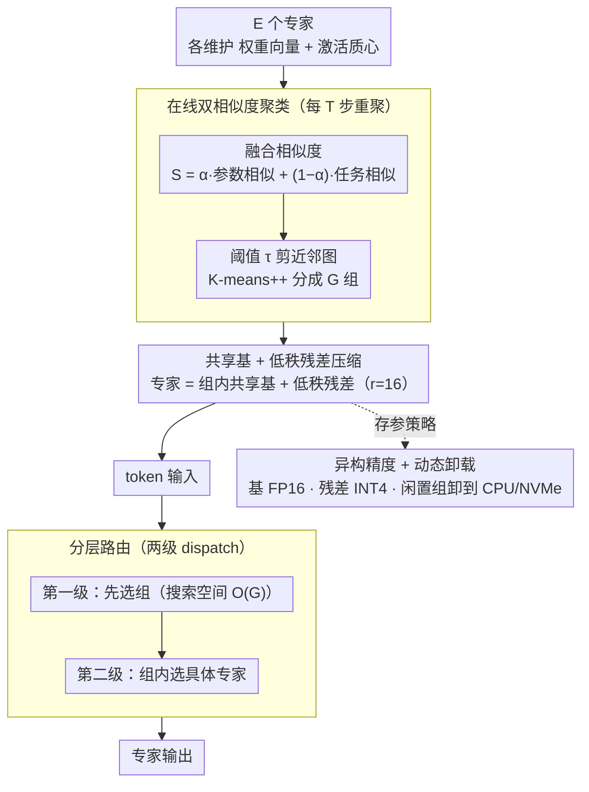

# Breaking the MoE LLM Trilemma: Dynamic Expert Clustering with Structured Compression

**会议**: ICML 2026  
**arXiv**: [2510.02345](https://arxiv.org/abs/2510.02345)  
**代码**: https://github.com/szdtzpj/Breaking_the_moe_trilemma (有)  
**领域**: 模型压缩 / MoE LLM / 系统优化  
**关键词**: Mixture-of-Experts, 动态专家聚类, 低秩残差, 分层路由, 异构精度

## 一句话总结
针对 MoE LLM 的"负载不均–参数冗余–通信开销"三难，本文提出一个统一框架：用"参数 + 激活"双相似度在线聚类把专家分组，组内用"共享基矩阵 + 低秩残差"做结构化压缩 (~5×)，再做"先选组后选 expert"的两级分层路由 + FP16/INT4 异构精度 + 闲置组离线卸载，在 GLUE/WikiText-103 上以约 80% 参数缩减、10–20% 吞吐提升、专家负载方差降 3× 的代价匹配标准 MoE 性能。

## 研究背景与动机

**领域现状**：MoE 已经成为扩 LLM 的关键路径（Switch、GShard、Mixtral 等）——理论上能在不显著增加 FLOPs 的前提下增加参数容量。

**现有痛点**：把 MoE 真正跑在 A100/H100 上时会撞到"优化三难"：(i) **负载不均**——top-$k$ 门控会让少数专家爆掉、多数闲置；(ii) **参数冗余**——专家个数线性堆参数把 HBM 容量吃光；(iii) **all-to-all 通信开销**——分发 token 到不同设备的 expert 常常成为主导延迟，尤其长 sequence。

**核心矛盾**：现有方法各打一拳。负载均衡损失 (Switch loss) 是反应式的，遇到分布漂移就失效；MoE-Lite 这类压缩把每个 expert 当独立个体压，忽略了 expert 之间的结构性相似；通信感知路由 (Tutel、SmILE) 在固定架构上优化数据路径，无法触及冗余和不均衡。更糟的是这三者互相挤兑——压一个变量常常拉爆另一个。

**本文目标**：在一个框架里同时降总存参、压每 token 激活参数、维持模型质量、降低跨设备流量、且重聚类开销可控。

**切入角度**：作者的核心洞察是——"被语义相似输入激活的专家，参数上也存在冗余"。这条假设把架构 (谁和谁一组) 和系统 (怎么路由 / 存 / 通信) 协同优化变得可能。

**核心 idea**：用动态聚类把功能相似的专家组队 → 组内用共享基 + 低秩残差压参数 → 路由先到组再到专家，把 all-to-all 缩到组间 + 组内两级。

## 方法详解

### 整体框架
这篇论文要把 MoE 的负载不均、参数冗余、通信开销三个瓶颈在同一个框架里一起按下去，靠的是一个被反复复用的"组结构"。统一目标写成 $\min L_{\text{task}}+A_1 I_{\text{load}}+A_2 R_{\text{red}}+A_3 C_{\text{comm}}$ (Eq. 1)，task loss 之外三项分别罚负载不均、参数冗余、通信量，而分组方式、压缩参数化、路由策略都是可学/可设计的变量。一次前向大致这样转：先用"参数 + 激活"双相似度把 $E$ 个专家在线聚成 $G$ 组每组 $K=E/G$ 个 → 组内用"共享基矩阵 + 低秩残差"把权重压下来 → token 进来先被路到组、再在组内选具体专家 → 最后用 FP16 基 + INT4 残差的异构精度存参、把闲置组卸到 CPU/NVMe。关键在于这个"分组"不是只为压缩服务，而是同时当上了通信、内存、精度三件事的共同载体。对应到论文明确列出的四个紧耦合设计：聚类管负载、压缩管冗余、分层路由管通信、异构精度+卸载管显存。

### 关键设计

**1. 在线双相似度聚类：让"谁和谁一组"既看长相又看用途**

如果只按参数相似度分组，组里的专家"长得像"但未必会被同一类 token 激活；只按激活相似度分组，又可能把权重差异很大的专家硬塞一组，后面的低秩残差就压不动。本文对每个专家 $\mathcal{E}_i$ 同时维护权重向量 $\text{vec}(W_i)$ 和激活质心 $\mu_i$（按 EMA 更新 $\mu_i\leftarrow(1-\beta)\mu_i+\beta\bar{x}_i$，默认 $\beta=0.05$），分别算 cosine 得到参数相似度 $S_{\text{param}}$ 和任务相似度 $S_{\text{task}}$，再融合成 $S=\alpha S_{\text{param}}+(1-\alpha)S_{\text{task}}$（默认 $\alpha>0.5$ 偏参数侧，因为参数是功能更直接的体现）。这样分出的组同时满足"能共享参数"和"会被同一类 token 同时激活"两个条件，正好喂给下游的压缩和分层路由。

每 $T$ 步重聚一次：先用阈值 $\tau$（默认 0.1）砍掉低相似对得到近邻图，把朴素的 $O(E^2)$ 全比较降下来；再在距离 $D=1-S$ 上跑 K-means++ 分成 $G$ 组；若组规模略不均就贪心搬迁边界专家。为进一步摊销开销，用寿命 $m$ 的 cache 缓存 $S_{\text{param}}$，只对权重变动超过 $\epsilon$ 的专家重算相似度。周期重聚类 + EMA 让分组能跟随训练中的分布漂移，比一锤定音的静态分组鲁棒得多。

**2. 共享基 + 低秩残差的结构化压缩：抽出共性、只留个性**

既然组内专家功能相似，它们之间真正的"专家性"大概率落在一个低秩子空间里，那就没必要每个专家都存一份完整权重。对每组 $g$ 先取组内权重均值作共享基 $W_{\text{base}}^g=\frac{1}{|\mathcal{G}_g|}\sum_{i\in\mathcal{G}_g}W_i$，每个专家只用一个低秩残差表示自己和基的差：

$$\tilde W_i=W_{\text{base}}^g+A_i B_i^\top,\quad A_i\in\mathbb{R}^{d_{in}\times r},\; B_i\in\mathbb{R}^{d_{out}\times r},\; r\ll\min(d_{in},d_{out})$$

默认 $r=16$。前向写成 $\tilde W_i x=W_{\text{base}}^g x+A_i(B_i^\top x)$，其中基矩阵那一项在组内所有专家处理同一批 token 时只需算一次、随后复用。压缩比 $CR=\frac{K d_{in} d_{out}}{d_{in} d_{out}+K r(d_{in}+d_{out})}$，在 $d=4096,K=8,r=16$ 下约 6.6×。残差用 $\text{TSVD}(W_i-W_{\text{base}}^g)$ 初始化拿到 warm start，每次重聚类后立刻再 SVD 一次以跟上新的分组。这套"集中共性 + 留出个性"把 Frobenius 重构误差控制在 1.5% 以内，既大幅压参又保住了专家多样性。

**3. 分层路由：把 all-to-all 拆成组间 + 组内两级**

压缩解决了存参，但跨设备通信和负载漂移还在，这一设计让前面聚出来的"组"再发挥一次作用。本文把扁平的 top-$k$ 路由改成两级：第一级 router 只把 token 路到组（搜索空间从 $O(E)$ 降到 $O(G)$），第二级在组内选具体专家。于是 all-to-all 先在组粒度做粗分发、再在组内做细分发，跨设备流量明显下降；而组级 dispatch 本身就是个粗粒度的负载预均衡器，从结构上压住了负载方差，不像 Switch loss 那样靠事后辅助损失被动纠偏。这一级路由直接复用聚类得到的组结构——分组既是压缩的单位，也成了通信和均衡的单位。

**4. 异构精度 + 动态卸载：把峰值显存压回 dense 水平**

即便参数压了、通信省了，把所有专家常驻 GPU 仍会撑爆显存，于是本文对存储再做两件事。其一是异构精度：共享基 $W_{\text{base}}^g$ 要被全组复用、精度敏感，保留 FP16；低秩残差 $A_i,B_i$ 幅值小、量化误差可被吸收，压到 INT4，避免对所有专家无差别 INT4 带来的精度悬崖。其二是动态卸载：把当前不活跃的整组专家按需从 GPU 卸到 CPU/NVMe、用到时再换入。两者叠加把峰值显存压到接近 dense 模型的水平。这同样建立在"组"这个粒度上——聚类一次，压缩、通信、内存三件事同时受益，这正是"统一框架"的真正含义。

### 损失函数 / 训练策略
训练按 Eq. 1 同时优化 task loss 和三项调节项 $I_{\text{load}}, R_{\text{red}}, C_{\text{comm}}$，权重 $A_1,A_2,A_3$ 为超参。聚类周期 $T$、cache 寿命 $m$、相似度阈值 $\tau$、融合权 $\alpha$、EMA 率 $\beta$、低秩 $r$、组数 $G$、量化 bit 数都可配置，论文给的默认值能在 GLUE/WikiText-103 上稳定收敛。

## 实验关键数据

### 主实验

| 指标 | Standard MoE | Ours |
|---|---|---|
| 总参数 (相对) | 1.0× | ≈ 0.20× (约 80% 缩减) |
| 推理吞吐 | 1.0× | 1.10–1.20× |
| 专家负载方差 | 1.0× | < 0.33× (降 3× 以上) |
| GLUE / WikiText-103 质量 | baseline | 持平 |
| 峰值显存 | 高 (随 expert 数线性) | 接近 dense 模型 |

(原文报告的核心数字主要在 Abstract / Introduction 给出；详细表格在附录。)

### 消融实验

| 配置 | 现象 |
|---|---|
| 仅低秩残差 (不分组) | 共享基失效，组内相关性差，重构误差激增 |
| 仅聚类 (不压缩) | 通信和负载方差改善，但参数量没降 |
| 仅分层路由 (固定专家) | 通信下降，但参数冗余和负载漂移仍在 |
| 完整框架 | 三个系统侧指标同时达到帕累托前沿 |
| $r=4$ | CR 大但重构误差 > 1.5% 阈值，质量下降 |
| $r\in\{16, 32\}$ | 重构误差进入平台期，$r=16$ 性价比最高 |

### 关键发现
- $r=16$ 是甜点：再往上 (32) 重构误差几乎不降而显存/延迟却线性上升；再往下 (4/8) 残差容量不够、performance 掉。
- 双相似度的两项都必要：去掉 $S_{\text{param}}$ 后组内权重差异大、低秩残差失效；去掉 $S_{\text{task}}$ 后组内激活模式割裂、分层路由变成纯随机划分。
- 用 router 的 logits 作为 token 语义嵌入（Li & Zhou 2024 的观察）→ 进一步给聚类提供了便宜的、与 LLM 同源的语义信号，这是聚类能"在线学到"功能分组的根本原因。

## 亮点与洞察
- 把分组从"事后压缩 trick"提升为"架构第一公民"——一个动态分组同时驱动压缩、路由、内存策略，是 MoE 协同设计里的新范式。
- 共享基 + 低秩残差这种"集中共性 + 留出个性"的写法，本质上和 LoRA / MoLE / PERFT 一脉相承，但首次落在 expert 内部、且在训练期动态维护。
- 异构精度 (FP16 base + INT4 residual) 利用了"残差量级小、误差可吸收"的物理事实，避免对所有专家无差别 INT4 带来的精度悬崖，这套思路可以直接借鉴到任何"主干 + 适配器"的压缩场景。

## 局限与展望
- 在线聚类有 $O(E^2)$ 比较，作者用近邻图 + cache 把它降下来，但 $E$ 上千时仍是显式 overhead，对训练吞吐的真实影响需要在更大规模 (e.g., DeepSeek-MoE 规模) 验证。
- 评估数据集主要是 GLUE / WikiText-103，这相对于现代 MoE LLM (Mixtral / DeepSeek-V3 / Qwen3-MoE) 的训练规模偏小，scalability 证据有限。
- 重聚类瞬间会造成低秩残差 warm start 的"震荡"，论文用 SVD warm restart 缓解，但在长训练 run 中是否稳定还需要更大规模实验。
- 动态卸载在跨节点训练时和 expert 并行的交互比较微妙，论文没讨论与 ZeRO-3 / FSDP 等内存优化的耦合。

## 相关工作与启发
- **vs MoE-Lite**：把 expert 当独立个体压；本文用聚类发现 expert 间相似，做组内共享 → 既保特化又获得更高压缩率。
- **vs Sub-MoE / Expert-Fusion**：他们做静态/永久 merge 会损失特化；本文用动态聚类 + 残差保留特化，无永久信息损失。
- **vs Tutel / SmILE / MoE-Lightning**：他们针对固定架构做通信优化；本文从架构上重构 expert 组织，让通信优化有"组"这个第一手粒度可用。
- **vs StableMoE / Switch-loss**：他们改 router 行为来抑制不均衡；本文从结构层抑制（组级 dispatch 天然是粗均衡器），不依赖辅助损失。

## 评分
- 新颖性: ⭐⭐⭐⭐⭐ 把动态聚类同时变成压缩、路由、内存的共同载体，是 MoE 协同设计里少见的"统一处方"。
- 实验充分度: ⭐⭐⭐ GLUE / WikiText-103 数据集偏小，缺更大规模 MoE LLM 上的验证；不过消融与超参 sweep 给得相对完整。
- 写作质量: ⭐⭐⭐⭐ 三难的故事讲得清楚，Eq. 1 把目标和变量明确摆出，方法层次分明。
- 价值: ⭐⭐⭐⭐ ~80% 参数缩减 + 10–20% 吞吐 + 负载方差降 3× 的组合非常诱人，给 MoE 部署提供了一个可工程化的方向。

<!-- RELATED:START -->

## 相关论文

- [\[ICML 2026\] Geo-Expert: 用 LoRA 把 8B 模型微调成专家级地质推理 LLM](geo-expert_towards_expert-level_geological_reasoning_via_parameter-efficient_fin.md)
- [\[ICML 2026\] GEMQ: Global Expert-Level Mixed-Precision Quantization for MoE LLMs](gemq_global_expert-level_mixed-precision_quantization_for_moe_llms.md)
- [\[ICLR 2026\] Steering MoE LLMs via Expert (De)Activation](../../ICLR2026/model_compression/steering_moe_llms_via_expert_deactivation.md)
- [\[AAAI 2026\] CAMERA: Multi-Matrix Joint Compression for MoE Models via Micro-Expert Redundancy Analysis](../../AAAI2026/model_compression/camera_multi-matrix_joint_compression_for_moe_models_via_mic.md)
- [\[ICLR 2026\] SERE: Similarity-based Expert Re-routing for Efficient Batch Decoding in MoE Models](../../ICLR2026/model_compression/sere_similarity-based_expert_re-routing_for_efficient_batch_decoding_in_moe_mode.md)

<!-- RELATED:END -->
