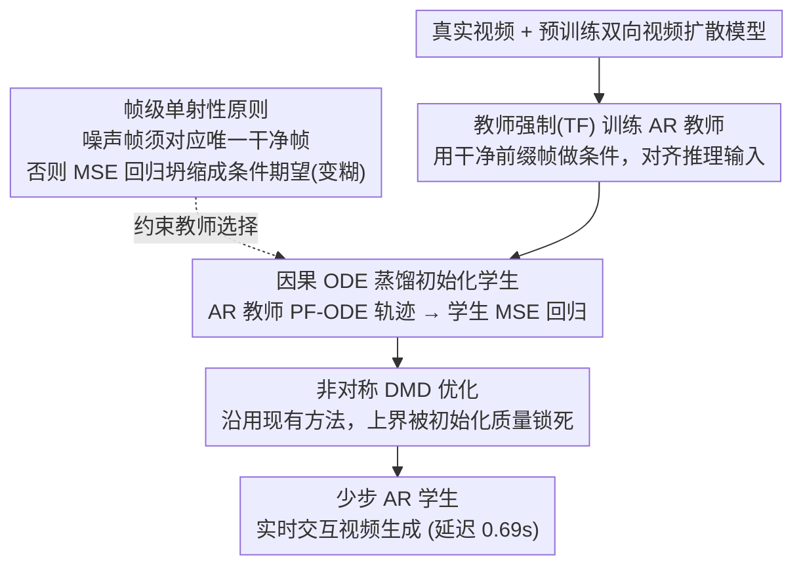

# Causal Forcing: Autoregressive Diffusion Distillation Done Right for High-Quality Real-Time Interactive Video

**会议**: ICML 2026  
**arXiv**: [2602.02214](https://arxiv.org/abs/2602.02214)  
**代码**: 待确认  
**领域**: 视频生成 / 扩散模型蒸馏  
**关键词**: 自回归视频生成, 扩散蒸馏, 因果注意力, 帧级单射性

## 一句话总结
本文通过识别"**帧级单射性**"的理论需求，提出 Causal Forcing 方法——用**自回归教师模型替代双向教师**进行 ODE 蒸馏初始化，避免 Self-Forcing 中的性能坍缩；相比 Self-Forcing 动态度 +19.3%、VisionReward +8.7%、指令遵循 +16.7%，同时保持相同推理延迟（0.69s）。

## 研究背景与动机

**领域现状**：实时交互视频生成需要将多步扩散模型蒸馏为少步自回归（AR）模型。当前方法（CausVid、Self-Forcing）采用"非对称蒸馏"——将预训练的双向视频扩散模型蒸馏为 AR 学生模型。

**现有痛点**：尽管 Self-Forcing 是 SOTA，但与标准 DMD（蒸馏双向学生）相比仍存在显著性能差距——动态度、视觉质量、指令遵循能力上都有 10-20% 下降。说明现有 AR 蒸馏流程存在更根本的问题。

**核心矛盾**：从双向模型蒸馏到 AR 学生时存在"架构间隙"——双向模型用全注意力（可访问未来帧），AR 模型只能因果注意力（仅基于过去帧）。现有方法虽有 ODE 初始化和 DMD 两个阶段，但都未能理论上正确处理这个间隙。

**核心 idea**：问题的根本在于 ODE 蒸馏违反了"**帧级单射性**"要求——当从双向教师蒸馏到 AR 学生时，同一个噪声帧可能对应多个不同的干净帧，导致 MSE 损失学习到条件期望（平均）而非真正的流映射。解决方案是使用 AR 教师进行 ODE 蒸馏初始化——AR 教师的 PF-ODE 天然满足帧级单射性。

## 方法详解

### 整体框架

本文要把多步双向视频扩散模型蒸馏成能实时交互的少步自回归（AR）学生，核心是把蒸馏链条里"用谁当教师做 ODE 初始化"这一环换掉。整个流程分三阶段：先用教师强制（TF）训练一个自回归扩散模型作为教师，再以这个 AR 教师做因果 ODE 蒸馏初始化少步 AR 学生，最后在初始化基础上跑非对称 DMD 进一步优化。与 Self-Forcing 唯一也是最关键的区别，就是把第二阶段的双向教师换成了满足帧级单射性的 AR 教师。

### 关键设计

**1. 帧级单射性：诊断出 Self-Forcing 性能坍缩的理论病根**

Self-Forcing 从双向教师蒸馏 AR 学生时画质会模糊、动态度会掉，过去只当作工程调优问题。本文把它归因到一个被忽视的理论条件——帧级单射性（frame-wise injectivity）：ODE 蒸馏要成立，必须保证每个噪声帧只映射到唯一的干净帧，即对任意噪声帧 $x_t^i$ 存在唯一 $x_0^i$ 使 $x_0^i = \phi^{AR}(x_t^i, t)$。问题在于双向教师的 PF-ODE 轨迹只在整段视频的层面满足单射，到了单帧层面却被打破（Lemma 3.2）：同一个噪声帧在不同后续帧的条件下会对应多个干净帧。这样一来，学生的 MSE 回归目标就不再收敛到某个确定的流映射，而是坍缩成条件期望 $\mathbb{E}[x_0^i \mid x_t^i]$——也就是对多个可能结果取平均，画面自然变糊。关键是这属于初始化阶段的根本缺陷，后续 DMD 再怎么优化也补不回来，所以必须从教师选择上解决。

**2. 教师强制 vs 扩散强制：反直觉地选了被认为"非标准"的 TF**

要做 AR 教师，先得决定它怎么训。两种条件化方式：教师强制（TF）训练时拿干净的前缀帧 $x_0^{<i}$ 做条件，扩散强制（DF）则拿带噪的前缀帧 $x_t^{<i}$ 做条件。DF 一直被当作标准做法，但本文发现 TF 反而更优（Proposition 3.4）。原因是 DF 制造了训练-推理的分布不匹配：训练时模型看到的是高噪声的先前帧，推理时看到的却是已经生成好的干净帧，两种输入分布对不上，于是出现"坍缩"。TF 用干净前缀训练，恰好和推理时的输入对齐，消掉了这个 gap。实验里这个选择差距巨大——TF 的 VisionReward 比 DF 高 111.2%。

**3. 因果 ODE 蒸馏：用天然满足单射性的 AR 教师初始化学生**

有了 TF 训出的 AR 教师，就用它来替代双向教师做 ODE 初始化。具体做法是：给定真实干净前缀帧 $x_{gt}^{<i}$，从高斯噪声 $x_T^i$ 出发，让 AR 教师沿 PF-ODE 轨迹生成当前帧的一串中间状态 $\{x_t^i\}_{t \in \mathcal{S}}$，学生再通过 MSE 回归去拟合这个流映射：

$$\min_\theta \mathbb{E}\big[\|G_\theta(x_t^i, x_{gt}^{<i}, t) - x_0^i\|^2\big]$$

之所以这样就对了，是因为 AR 教师本身是因果的，它的 PF-ODE 在帧级天然满足单射性——同一噪声帧只会对应一个干净帧，MSE 回归不再坍缩成平均，学生学到的是真正的流映射而非条件期望。这给后续 DMD 提供了一个干净、高质量的初始化起点，而实验也表明 DMD 的上界正是被这个初始化质量锁死的。

## 实验关键数据

### 主实验

| 模型 | 吞吐量 ↑ | 延迟 ↓ | 动态度 ↑ | VisionReward ↑ | 指令遵循 ↑ | 用户评分 ↓ |
|------|--------|------|--------|---------------|----------|----------|
| Wan2.1（双向） | 0.78 | 103s | 61 | 5.275 | 42 | 2.29 |
| CausVid（AR 蒸馏） | 17.0 | 0.69s | 62 | 5.741 | 12 | 4.27 |
| Self-Forcing | 17.0 | 0.69s | 57 | 5.820 | 48 | 2.87 |
| **Causal Forcing** | **17.0** | **0.69s** | **68** | **6.326** | **56** | **1.64** |

相比 Self-Forcing 改进——动态度 +19.3%，VisionReward +8.7%，指令遵循 +16.7%。

### 消融实验

| 配置 | 动态度 | VisionReward | 指令遵循 | 说明 |
|------|--------|-------------|----------|------|
| 扩散强制 (DF) + Self-Forcing ODE + DMD | 60 | 1.583 | 30 | DF 导致严重坍缩 |
| 教师强制 (TF) + Self-Forcing ODE + DMD | 50 | 3.343 | 32 | TF 改善但 ODE 不足 |
| TF + Self-Forcing ODE + DMD（块级） | 24 | 3.330 | 38 | 双向教师 ODE 性能差 |
| **TF + 因果 ODE + DMD（块级）** | **68** | **6.326** | **56** | 完整方案 |

### 关键发现
- TF 相对 DF 性能提升显著（VisionReward +111%）——训练-推理分布对齐很关键。
- 因果 ODE 相对 Self-Forcing 的 ODE 在块级设置下提升显著（VisionReward +90%、动态度 +183%），帧级提升更极端（动态度 +3100%）。
- DMD 阶段无法弥补 ODE 初始化的差距——好的初始化决定 DMD 上界。

## 亮点与洞察
- **理论贡献明确**：首次用帧级单射性的数学框架解释 AR 蒸馏的性能坍缩，证明 Self-Forcing 从根本上违反这一条件——理论洞察超越经验调优。
- **TF vs DF 的翻转结论**：打破常见认知 DF 在 AR 扩散中实际上劣于 TF；本文给出严格的分布不匹配证明并在实验中量化 111% 的性能差距，是对该领域的重要纠正。
- **可迁移的设计思想**：帧级单射性原则不仅适用于 ODE 蒸馏，还自然扩展到一致性蒸馏（CD）框架——本文首次提出因果 CD。
- **实用效果显著**：在完全相同的计算预算下，相比 SOTA Self-Forcing 多项指标都有两位数百分比的提升。

## 局限与展望
- 长视频生成的 gap：模型在 5 秒视频上训练，直接外推到更长视频会产生训练-推理间隙；需要 LongLive 或 Rolling Forcing 等正交的长视频适配方法。
- 一致性蒸馏仍弱于 ODE：提出的因果 CD 虽然理论上正确，但性能仍不如因果 ODE 蒸馏——当前使用了 vanilla LCM 实现，有改进空间。
- 与 GAN 蒸馏的对比不足：APT2 使用 GAN + 教师强制 CD 初始化，由于未开源无法直接对比。

## 相关工作与启发
- **vs Self-Forcing**（Huang et al. 2025a）：两者都采用 ODE 蒸馏 + DMD 的两阶段流程，但 Self-Forcing 用双向教师，本文用 AR 教师；关键区别在于帧级单射性的满足与否；本文是对 Self-Forcing 架构缺陷的根本性修正。
- **vs CausVid**（Yin et al. 2025）：都关注 AR 蒸馏，但 CausVid 首次提出非对称蒸馏范式且性能较低。
- **vs DMD 方法论**：标准 DMD 用于蒸馏双向学生效果很好，但直接用于 AR 学生初始化时性能差——初始化质量决定 DMD 上界。

## 评分
- 新颖性: ⭐⭐⭐⭐⭐  帧级单射性的理论框架和 TF vs DF 的翻转结论都是首创；因果 ODE 蒸馏范式与教师选择策略的结合独特而深刻。
- 实验充分度: ⭐⭐⭐⭐⭐  覆盖 ODE 初始化 / DMD / CD 三个方向，块级和帧级两种评估模式，5 个对标方法，VBench + VisionReward + 用户研究三层评价。
- 写作质量: ⭐⭐⭐⭐  理论推导清晰，问题诊断深入；个别表述可更凝练。
- 价值: ⭐⭐⭐⭐⭐  解决了实时视频生成的核心性能瓶颈，提供可复用的理论框架，在完全相同训练预算下相对 SOTA 多项指标提升 15-20%。

<!-- RELATED:START -->

## 相关论文

- [\[CVPR 2026\] Elastic Weight Consolidation Done Right for Continual Learning](../../CVPR2026/model_compression/elastic_weight_consolidation_done_right_for_continual_learning.md)
- [\[CVPR 2025\] Towards Practical Real-Time Neural Video Compression](../../CVPR2025/model_compression/towards_practical_real-time_neural_video_compression.md)
- [\[ICML 2026\] Beyond Tokens: Enhancing RTL Quality Estimation via Structural Graph Learning](beyond_tokens_enhancing_rtl_quality_estimation_via_structural_graph_learning.md)
- [\[ICML 2026\] ScaLoRA: Optimally Scaled Low-Rank Adaptation for Efficient High-Rank Fine-Tuning](scalora_optimally_scaled_low-rank_adaptation_for_efficient_high-rank_fine-tuning.md)
- [\[ICML 2026\] Semantic Integrity Matters: Benchmarking and Preserving High-Density Reasoning in KV Cache Compression](semantic_integrity_matters_benchmarking_and_preserving_high-density_reasoning_in.md)

<!-- RELATED:END -->
