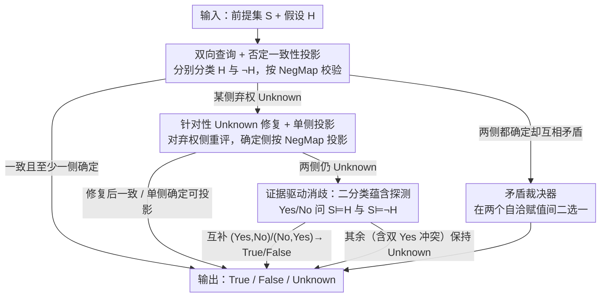

# Compositional Consistency-Guided Decoding for Three-Way Logical Question Answering

**会议**: ICML 2026  
**arXiv**: [2604.06196](https://arxiv.org/abs/2604.06196)  
**代码**: 无  
**领域**: LLM推理  
**关键词**: 逻辑推理, 一致性解码, 三分类问答, 测试时推理, 否定映射

## 一句话总结

利用三分类逻辑问答中假设 $H$ 与其否定 $\neg H$ 之间的确定性否定映射关系，在测试时组合多次 LLM 调用并通过一致性约束消歧，无需训练即可减少认识性弃权（epistemic Unknown）并提升推理准确率。

## 研究背景与动机

**领域现状**：三分类逻辑问答（True / False / Unknown）要求模型判断一组前提 $S$ 是否蕴含假设 $H$、蕴含 $\neg H$、还是两者都无法推出。LLM 通常通过单次结构化提示完成三分类，每个查询独立处理。

**现有痛点**：LLM 在单次调用时大量输出 Unknown——其中相当一部分并非因为前提真的不足以判定，而是模型的不确定性或保守行为导致的"认识性弃权"。例如 Claude Sonnet 4.5 在严格无 CoT 的提示下 Unknown 率高达 75.5%，而其中 72.6% 的 gold 标签实际是 True 或 False。这种虚假弃权严重拉低了准确率和覆盖率。

**核心矛盾**：三分类逻辑问答本身包含一个强结构约束——否定映射 $\mathsf{NegMap}$：True ↔ False 互换，Unknown 保持不变。即 $y(\neg H) = \mathsf{NegMap}(y(H))$。但标准提示把 $H$ 和 $\neg H$ 当成毫无关联的两个查询，完全浪费了这个内置的组合一致性关系。

**本文目标**：设计一个无需训练、无需外部求解器的测试时解码层，利用否定一致性约束在多次 LLM 调用之间传播信息，从而减少认识性 Unknown 并提升整体推理质量。

**切入角度**：既然对 $H$ 和 $\neg H$ 的查询是同一底层逻辑状态的两个"带噪声观测"，那么只要一侧给出确定判断，就可以通过否定映射推导出另一侧的标签；当两侧都不确定时，可以退化为更简单的二分类蕴含探测来打破僵局。

**核心 idea**：用否定一致性约束把单次提示升级为多视角组合推理——先查 $H$ 和 $\neg H$，一致则接受，不一致或弃权则逐步修复和探测，所有决策最终投影到满足否定映射的一致赋值上。

## 方法详解

### 整体框架

CGD-PD（Consistency-Guided Decoding with Proof-Driven Disambiguation）是一个包在任意 LLM 外面的测试时推理层：输入前提集 $S$ 和假设 $H$，输出 True / False / Unknown 三者之一，全程不训练、不调外部求解器。它的出发点是三分类逻辑问答自带一条数学约束——否定映射 $\mathsf{NegMap}$ 把对 $H$ 的判断与对 $\neg H$ 的判断锁死（True↔False 互换、Unknown 不变），于是对 $H$ 和 $\neg H$ 的两次查询本质是同一逻辑状态的两个带噪观测。CGD-PD 把这条约束当成解码时的硬规则，按"越来越费力"的顺序级联最少 2 次、最多 6 次调用：先双向查一致性，不一致就定向修 Unknown，还僵持就降到二分类蕴含探测，万一两边都确定却互相矛盾再裁决，每一步只在上一步没能达成一致赋值时才触发。

### 关键设计

**1. 双向查询 + 否定一致性投影：把两个独立带噪分类拼成一个受约束的联合推理**

痛点是单次提示下 LLM 对措辞极敏感，常给出彼此不一致的标签或干脆弃权。CGD-PD 不再把 $H$ 和 $\neg H$ 当成两个无关查询，而是分别调用 $y_H = \mathsf{Classify}(S, H)$ 和 $y_{\neg H} = \mathsf{Classify}(S, \neg H)$，其中 $\neg H$ 用规范化包装（如 "NOT: $H$"）构造、并在提示里显式定义其语义。拿到两个标签后用否定映射校验：只要 $y_{\neg H} = \mathsf{NegMap}(y_H)$ 且至少一侧是确定标签（不是双 Unknown），就直接返回 $y_H$。这一步之所以有效，是因为它给同一逻辑状态提供了冗余观测，又用 $\mathsf{NegMap}$ 这条硬约束当消歧依据——两个各自带噪的分类被绑成一个联合问题后，互相印证的那部分答案立刻变得可信。

**2. 针对性 Unknown 修复 + 单侧投影：专杀认识性弃权而不误伤真不确定**

第一步过不去往往是因为某一侧弃权了，而这些 Unknown 很多并非前提真不足、只是模型保守。于是只对弃权那一侧调用 $\mathsf{FixUnknown}(S, H)$ 专用提示重新评估，该提示把 Unknown 定位成最后手段——只有明确缺少必要前提才允许保留，且必须说清缺了什么前提、并尽量引出前提块里对应的句子。修复完先复查这对标签是否已满足否定一致性，是则返回 $H$ 的标签；若一侧已确定、另一侧仍 Unknown，就用否定映射把确定侧的标签投影回 $H$。这一步只动弃权侧、不碰已确定的判断，因此能在压低虚假弃权的同时，把真正缺前提的样本留在 Unknown 里——但论文也指出该投影依赖那次确定调用的可靠性，并非形式化保证。

**3. 证据驱动消歧：二分类蕴含探测打破双 Unknown 僵局（方法名里的 "PD"）**

若修复后两侧依然都 Unknown，CGD-PD 再降一个维度，把三分类问题换成更窄的二分类蕴含探测：分别以 Yes/No 问 $b_H = \mathsf{EntailsYesNo}(S, H)$ 和 $b_{\neg H} = \mathsf{EntailsYesNo}(S, \neg H)$，这个更聚焦的问法去掉了 Unknown 这个逃避选项，能暴露出三分类提示其实只是把 Unknown 当默认值的情形。但它也可能过度承诺，所以解码器只接受互补模式：$(Yes, No)$ 判 True、$(No, Yes)$ 判 False，其余情况（尤其是双 Yes 这种两侧都说蕴含的冲突）一律退回 Unknown，而不武断偏袒某一侧。论文称这步为"证据驱动"是因为聚焦的蕴含问题提供了"某侧可从 $S$ 推出"的轻量证据，但它声明这并非形式化证明系统、不保证求解器级别的正确性。

**4. 矛盾裁决器：兜底处理两侧都确定却违反否定映射的罕见冲突**

极少数情况下两侧一开始就都给出确定标签却互相矛盾（比如对 $H$ 和 $\neg H$ 都答 True），这违反了 $\mathsf{NegMap}$，且因为没有 Unknown，前面的修复与探测都不会被触发。此时级联落到专门的裁决提示，在两个本身自洽的赋值 $y_H$ 与 $\mathsf{NegMap}(y_{\neg H})$ 之间二选一。裁决器只在出现这种矛盾确定对时才被叫起来，频率很低，但它保证了无论前面怎么走，最终输出始终满足否定一致性这条硬约束，不会吐出逻辑自相矛盾的预测。

### 一个完整示例

以 Claude 跑一个 gold 标签为 True 的样本为例，看调用如何逐级升级：第 1–2 次双向查询拿到 $y_H=\text{Unknown}$、$y_{\neg H}=\text{Unknown}$——两边都弃权，否定一致性虽满足但没有确定标签，不能接受；于是第 3–4 次对两侧分别跑 $\mathsf{FixUnknown}$，$H$ 侧仍判 Unknown 而 $\neg H$ 侧被修成 False；按否定映射 $\mathsf{NegMap}(\text{False})=\text{True}$ 投影回 $H$，得到 True 并终止。整条链用了 4 次调用，把一个本会被记成"认识性弃权"的样本救成了正确的确定标签。统计上，完整六次调用在 GPT-5.2 的 54%、Claude 的 61% 样本上被触发，正反映了原始 Unknown 输出有多普遍。

## 实验关键数据

### 主实验

在 FOLIO 数据集验证集（204 个样本）的一阶逻辑字段上评测，使用严格无 CoT 的结构化提示，温度设为 0。

| 模型 | 方法 | 准确率(%) | Unknown率(%) | 认识性Unknown率(%) | 平均调用次数 |
|------|------|-----------|-------------|-------------------|------------|
| GPT-5.2 | Single | 63.7 | 57.4 | 41.5 | 1.00 |
| GPT-5.2 | CGD-PD | 68.1 | 53.9 | 36.3 | 4.36 |
| Claude Sonnet 4.5 | Single | 42.2 | 75.5 | 72.6 | 1.00 |
| Claude Sonnet 4.5 | CGD-PD | 49.0 | 58.8 | 53.3 | 4.91 |

配对 bootstrap 95% CI：GPT-5.2 准确率提升 +4.4pp（CI: +1.5 ~ +7.4），Claude 准确率提升 +6.8pp（CI: +3.4 ~ +10.3）。

### 覆盖率与确定标签可靠性

| 模型 | 方法 | 覆盖率(%) | 回答准确率(%) | Gold Unknown 保留率(%) | Gold U→T | Gold U→F |
|------|------|----------|-------------|---------------------|----------|----------|
| GPT-5.2 | Single | 42.6 | 79.3 | 88.4 | 3 | 5 |
| GPT-5.2 | CGD-PD | 46.1 | 83.0 | 88.4 | 4 | 4 |
| Claude Sonnet 4.5 | Single | 24.5 | 60.0 | 81.2 | 9 | 4 |
| Claude Sonnet 4.5 | CGD-PD | 41.2 | 61.9 | 69.6 | 13 | 8 |

### 关键发现
- CGD-PD 不是简单地把 Unknown 替换为低质量的确定标签——GPT-5.2 的回答准确率从 79.3% 提升到 83.0%，覆盖率也同步提升
- GPT-5.2 上 Gold Unknown 保留率保持 88.4% 不变，说明对真正不确定样本没有过度解析；Claude 上该率从 81.2% 降至 69.6%，存在一定的过度解析问题
- CGD-PD 在 GPT-5.2 上改变了 15/204 个预测，Claude 上改变了 34/204 个，改变主要集中在将 Unknown 转为正确的确定标签
- 完整六次调用在 GPT-5.2 的 54% 和 Claude 的 61% 样本上触发，反映了 Unknown 输出的普遍性

## 亮点与洞察
- **把任务自带的组合结构变成解码约束**：否定映射是三分类逻辑问答的内在数学性质，CGD-PD 的核心洞察是这种已知关系不该被浪费在独立查询中，而应在推理时被显式利用。这个思路可以推广到任何具有已知输入变换-输出约束关系的任务
- **分层消歧策略比全局强制更优**：先尝试一致性、再定向修复、再降维探测的渐进式设计，比直接强制消歧更好地平衡了减少虚假弃权与保护真正不确定性

## 局限与展望
- 仅在 FOLIO 的 FOL 公式输入上验证，自然语言输入下否定的范围歧义会显著增加难度
- 仅使用两个 API 模型、一种严格无 CoT 提示族，未与 self-consistency 等推理时基线在相同调用预算下对比
- Claude 上对 Gold Unknown 的过度解析（保留率从 81.2% 降至 69.6%）是当前方法的主要弱点，需要更精细的选择性机制
- 未提供分支级别的诊断日志（如修复器改变率、裁决器覆盖率），难以精确定位各组件的贡献

## 相关工作与启发
- **vs Self-Consistency (Wang et al., 2023)**: Self-Consistency 通过同一提示的多次采样聚合来提升推理，CGD-PD 利用逻辑耦合的不同提示之间的组合约束，二者互补而非替代
- **vs CheckList / 变形测试 (Ribeiro et al., 2020; Cho et al., 2025)**: 变形测试用变换-关系对来*评估*失败模式，CGD-PD 进一步将其用于*引导*推理时决策

## 评分
- 新颖性: ⭐⭐⭐⭐ 把已知的逻辑约束变成推理时解码规则的思路简洁且有启发性
- 实验充分度: ⭐⭐⭐ 仅一个数据集 204 样本的验证集、两个模型、一种提示族，规模有限
- 写作质量: ⭐⭐⭐⭐⭐ 问题定义清晰、方法逐步推导自然、诊断分析透彻
- 价值: ⭐⭐⭐⭐ 提出的"利用任务内在组合结构约束解码"是一个可广泛迁移的设计原则

<!-- RELATED:START -->

## 相关论文

- [\[ACL 2025\] Graph-guided Cross-composition Feature Disentanglement for Compositional Zero-shot Learning](../../ACL2025/model_compression/graph-guided_cross-composition_feature_disentanglement_for_compositional_zero-sh.md)
- [\[ACL 2026\] Calibrated Speculative Decoding: Frequency-Guided Candidate Selection for Efficient Inference](../../ACL2026/model_compression/calibrated_speculative_decoding_frequency-guided_candidate_selection_for_efficie.md)
- [\[ICML 2026\] SPEED-Bench: A Unified and Diverse Benchmark for Speculative Decoding](speed-bench_a_unified_and_diverse_benchmark_for_speculative_decoding.md)
- [\[ICML 2026\] LK Losses: Direct Acceptance Rate Optimization for Speculative Decoding](lk_losses_direct_acceptance_rate_optimization_for_speculative_decoding.md)
- [\[ICML 2026\] Critique-Guided Distillation for Robust Reasoning via Refinement](critique-guided_distillation_for_robust_reasoning_via_refinement.md)

<!-- RELATED:END -->
