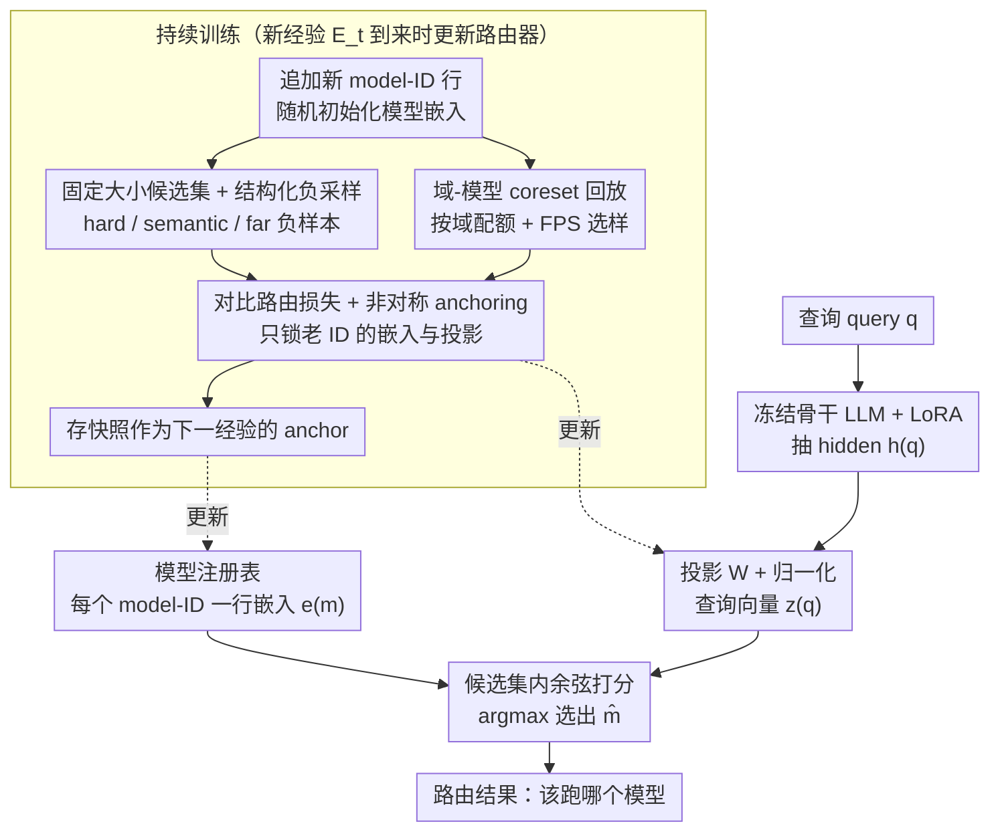

# Continual Model Routing in Evolving Model Hubs

**会议**: ICML 2026  
**arXiv**: [2605.28577](https://arxiv.org/abs/2605.28577)  
**代码**: 有（论文标注，仓库地址待补）  
**领域**: 持续学习 / 模型路由 / 嵌入式检索  
**关键词**: continual learning, pre-inference routing, model hub, contrastive embedding, anchoring, experience replay  

## 一句话总结
当模型 hub 里的可用专家从几百涨到上千、还在持续新增/淘汰时，传统"训一次路由器"或"纯检索 model card"都顶不住；作者把这个问题形式化成"持续分类（label space 不断长大）"，搭出 CMRBench 这个跨 4 期、超过 2000 个候选模型的基准，并提出 CARvE——一个用对比嵌入打分、用 checkpoint anchoring 防漂移、用结构化负样本回放维持判别力的持续路由器，在 D-Acc 上比标准 LoRA 重放高 5 个点、遗忘只有它的 1/2。

## 研究背景与动机

**领域现状**：Hugging Face 等模型 hub 已经存放上百万个预训练模型，部署 MoE/工具调用系统时核心问题已经从"能不能训出一个模型"变成"该跑哪一个模型"。这种 pre-inference routing 必须在严格延迟和成本约束下、不执行多个候选模型的前提下完成。代表方法包括 Gorilla（用 RAT/RAG 检索 model card）、HuggingGPT（让 LLM 控制器读 metadata 选模型）以及各类 BM25 / dense retriever 直接对 model card 打分。

**现有痛点**：(1) 候选模型规模一旦上千，静态检索方法（model card 相似度）就严重打折——BGE-M3 在 2000+ 模型下 M-Acc 才 13.6%；(2) 模型 hub 本质非平稳：新模型进来、旧模型废弃、同一系列频繁出新版本。把路由当一次性训练的分类器训完即冻结，会在新一波模型到达时迅速崩溃；(3) 直接拿出之前所有数据做 joint training 又破坏了 continual learning 的部署约束（旧数据可能不可保留、计算预算有限）。

**核心矛盾**：路由必须同时满足三个相互冲突的需求——能在 1000+ 类的开放标签空间里稳定打分、能在新模型进来时增量适应、且要把执行候选模型的开销压到零。现有方法解决其一往往牺牲另外两个。

**本文目标**：把 pre-inference 模型路由形式化成"标签空间随时间增长的持续分类"问题；设计一个新基准来公平评测；并给出一个能同时扛规模、扛漂移、扛遗忘的具体路由器。

**切入角度**：作者注意到三个事实——(1) 路由本质是判别任务（query → model-ID），可以走对比嵌入而不必经过生成；(2) 持续学习里"参数 / 输出 anchoring"和 replay buffer 能压制灾难性遗忘；(3) 大词表 softmax 太贵，但用固定大小的 candidate set 就能把每例打分降到 $O(Kd)$。把这三件事拼起来就能避开 Gorilla 那种 SFT/RAT 路线的瓶颈。

**核心 idea**：把模型 ID 学成可持续追加的对比嵌入向量，新经验到来时用 checkpoint anchoring 锁住老模型嵌入和投影矩阵的几何，配合结构化的 hard/semantic/far 负样本和按域加权的 coreset replay 来维护判别面。

## 方法详解

### 整体框架
CARvE 把"该路由到 hub 里哪个模型"做成一个可以持续追加标签的嵌入打分问题。经验是按时间一波波到来的 $\{E_t\}_{t=1}^T$，每个 $E_t$ 给出若干 $(q_i, m_i, d_i)$ 三元组（query、正确模型、所属域），候选池随之累计扩张 $\mathcal{M}_{\leq t} = \bigcup_{k \leq t} \mathcal{M}_k$。打分时，冻结的骨干 LLM（默认 LLaMA2-7B + LoRA）把 query 抽成 hidden $h(q) \in \mathbb{R}^D$，过一个可学习投影 $W$ 归一化后得查询向量 $z(q) = h(q)W / \lVert h(q)W \rVert_2$；每个模型 ID 各自维护一个可学习的归一化嵌入 $e(m) = v(m)/\lVert v(m) \rVert_2$；在候选集 $\mathcal{C}(q)$ 上算余弦打分 $s(q,m) = z(q)^\top e(m) / \tau$，取 $\hat m = \arg\max_{m \in \mathcal{C}(q)} s(q,m)$ 输出。每当新经验到来，注册表 $\mathcal{R}$ 追加新模型 ID 行，投影 $W$、模型嵌入表 $\{v(m)\}$ 和 LoRA 适配器一起更新，并以上一经验末的快照作为 anchor 防止老 ID 的几何被新数据冲乱。

### 关键设计

**1. Checkpoint-based 非对称 anchoring：经验切换时锁住老模型的几何、放开新模型**

模型 hub 是非平稳的，新一波模型涌入会让路由器顺着新数据漂移、把之前学好的老模型嵌入挤变形，这正是灾难性遗忘在路由场景里的样子。CARvE 的对策是在经验 $t$ 开始时先存下上一经验末的参数快照 $\{v_{t-1}(m)\}_{m \in \mathcal{M}_{\leq t-1}}$ 和 $\Theta_{t-1}$，训练 $E_t$ 时除了主对比损失再加两项 anchor 把几何拉回原位：一项是老模型嵌入的余弦漂移 $\mathcal{L}_{\mathrm{emb}} = \frac{1}{|\mathcal{M}_{\leq t-1}|}\sum_m (1 - \cos(v_t(m), v_{t-1}(m)))$，一项是投影矩阵的均方漂移 $\mathcal{L}_{\mathrm{proj}} = \frac{1}{|\Theta_t|}\sum_\theta \frac{1}{|\theta|}\lVert \theta - \theta_{t-1}\rVert_2^2$。关键在于这个 anchor 是**非对称**的——$\mathcal{L}_{\mathrm{emb}}$ 只对老 ID 的嵌入行生效，新加入模型的嵌入行完全不进这项约束。因为路由靠的是嵌入相似度而不是一个固定的分类头，所以必须直接锁嵌入和投影的几何（而不是像 LwF/EWC 那样去锁分类边界）；又因为新模型还得在嵌入空间里给自己找位置，硬锁就学不进来，所以只锁老、不锁新才能同时扛住遗忘和适应。实验里经验 3 训完回看 Exp1，标准 replay 掉到 60.8 而 CARvE 保住 74.5，正是这个非对称约束在起作用。

**2. 固定大小候选集训练 + 结构化负采样：既绕开千类 softmax，又喂出判别力**

候选模型上千时，每例都在全 $\mathcal{M}_{\leq t}$ 上做 softmax 既贵又稀。CARvE 改成对每个 $(q, m^+)$ 只构造一个大小为 $K$ 的候选集 $\mathcal{C}(q)$，里面必含正样本 $m^+$，再按结构混入三类负样本：当前路由器下打分最高、最容易混淆的 hard confusers（周期性重新 mining）、同域或相关域的 semantic negatives、以及跨域的 far negatives，剩下随机填充防重复；损失就是这个候选集内的对比交叉熵 $\mathcal{L}_{\mathrm{route}} = -\log \frac{\exp(s(q,m^+))}{\sum_{m \in \mathcal{C}(q)} \exp(s(q,m))}$。这样每例打分成本从 $O(|\mathcal{M}_{\leq t}| d)$ 降到 $O(Kd)$，部署时还能用 FAISS 把检索进一步压到 $O(\log |M|)$。三类负样本各管一层判别：hard confusers 撑细粒度区分，semantic negatives 撑同族内的区分（比如 yolov8m/n/s 这种近亲），far negatives 撑跨域的宏观结构——少了哪一类，对应粒度的精度就会塌。

**3. 域-模型 coreset 重放 + 随机初始化模型嵌入：在长尾分布下省着用回放预算，且不让 model card 带偏**

hub 数据是重尾的，常见域样本铺天盖地、长尾域寥寥无几，随机抽样回放会把预算大半浪费在常见域上。CARvE 给定回放预算 $B$ 后先按域频率给各域分配配额（设下限、可选上限），同域内再对每个模型 ID 限制最大样本数，最后在固定嵌入空间用 farthest-point sampling 挑最分散的样本——用覆盖度换冗余度，让稀有域也保住代表样本。另一个反直觉的决定是模型嵌入**随机初始化**而不是用 model card 文本编码做 warm start：作者实测 4 种 card-based 初始化在 D-Acc 上反而比随机低 3–5pp、遗忘翻倍，因为 card 嵌入编码的是描述文本的语言相似度，和路由真正需要的判别几何是冲突的，对比目标得先花力气把这套语义几何"撤掉"才能重新组织空间，不如一开始就给个干净的随机起点。

### 损失函数 / 训练策略
总损失把对比项和两项 anchor 加权相加 $\mathcal{L} = \mathcal{L}_{\mathrm{route}} + \lambda_{\mathrm{emb}} \mathcal{L}_{\mathrm{emb}} + \lambda_{\mathrm{proj}} \mathcal{L}_{\mathrm{proj}}$。骨干 LLM 全程冻结，只更新 LoRA 适配器、投影 $W$ 和模型嵌入表；新经验到来时按 ID 追加新嵌入行而不重排旧索引，anchor 只施加在路由器参数（嵌入、投影）上、不约束 LoRA。

## 实验关键数据

### 主实验
CMRBench 包含 4 个时序经验，覆盖 APIBench（852 模型）、ToolMMBench（481）、HuggingBench E3（520）、HuggingBench E4（547），总样本 ~34k。评测指标：Model-ID 精度（M）、Model-family 精度（F，把 yolov8m/n/s 这种归到一族）、Domain 精度（D），各自配遗忘（FGT）。下表为跨 4 经验平均（LLaMA2-7B 骨干）：

| 方法 | M-Acc ↑ | F-Acc ↑ | D-Acc ↑ | D-FGT ↓ |
|------|---------|---------|---------|---------|
| BGE-M3 retrieval | 13.6 | 16.2 | 44.0 | 3.3 |
| Gorilla RAG | 6.7 | 10.4 | 43.0 | 0.1 |
| HuggingGPT (Qwen3-32B) | – | – | 51.7 | – |
| Sequential Finetuning | 28.0 | 34.8 | 64.3 | 37.2 |
| TIES merging | 7.6 | 10.9 | 28.6 | 32.6 |
| LwF | 28.8 | 35.9 | 56.4 | 39.5 |
| EWC | 31.3 | 38.4 | 66.2 | 31.4 |
| Random Replay 10% | 39.1 | 47.3 | 75.9 | 13.1 |
| Random Replay 20% | 41.3 | 49.8 | 78.1 | 7.8 |
| **CARvE 10% replay** | **~46.4** | – | **80.7** | **5.9** |
| **CARvE 20% replay** | 46.4 | – | **82.9** | **3.0** |
| LoRA Joint Training | – | – | 79.3 | – |

关键观察：(1) 纯检索路由在 hub 规模下完全打不过 SFT，BGE-M3 才 13.6% M-Acc；(2) 持续学习设定下，相同 10% replay 预算 CARvE 比标准 LoRA replay D-Acc 高 4.8 个点、遗忘只有 5.9% vs 13.1%；(3) CARvE 甚至超越了 joint training 上界 79.3 → 80.7，说明 anchoring + 结构化负样本本身有正则化效果。

### 消融实验

| 配置 | 关键效应 | 说明 |
|------|---------|------|
| 完整 CARvE | D-Acc 80.7 / D-FGT 5.9 | 基线 |
| 模型嵌入用 card 初始化 | D-Acc −3 ~ −5pp，FGT 约翻倍 | 几何冲突；4 个变体一致变差 |
| CARvE + EWC | 与 CARvE 持平 | Fisher 正则不是 CARvE 增益来源 |
| 骨干换 Qwen2.5-7B | D-Acc 81.5 | 同尺寸骨干上结论稳定 |
| 骨干换 Qwen3-4B | D-Acc 与 FGT 都变差 | 小模型表征质量是瓶颈 |
| 经验 3 训完后回看 Exp1 | 标准 replay 60.8 vs CARvE 74.5 | anchoring 有效防漂移 |
| 经验 4 训完后回看 Exp3 | 标准 replay 54 vs CARvE 69.7 | 同上，证实新模型涌入是最大压力源 |

### 关键发现
- 域级精度最受益（+5pp）、模型族次之、模型 ID 级最难推；这与"嵌入空间下宏观结构最容易稳住、细粒度区分最考验负样本质量"吻合
- 标准 replay 在 HuggingBench 引入后（Exp3-4）出现明显塌陷，CARvE 几乎无塌陷，验证 anchoring 是抵御 hub 扩张的关键
- 用 model card 给模型嵌入做初始化反而更差，是反直觉但被反复验证的结论：路由要的是"判别几何"而不是"语义相似几何"

## 亮点与洞察
- **重新框定问题**：第一次把 pre-inference model routing 显式当作"标签空间随时间扩张的持续分类"看待。这一步看着只是换术语，但直接把持续学习工具箱（replay/anchor/coreset）合法地引入路由场景
- **非对称 anchoring**：传统持续学习里 anchor 通常一锁全锁；CARvE 只锁旧 ID 的嵌入和投影，留新 ID 自由，这种"半冻结"思路可直接迁移到任何带可扩展 embedding table 的持续任务（检索、推荐、open-vocab 分类）
- **反直觉实验**：模型嵌入随机初始化 > model card 初始化。这说明"语义相似 ≠ 路由判别"，对所有想用文本编码 warm start 嵌入的人是一个值得记住的负面经验

## 局限与展望
- 候选集大小 $K$ 和 hard negative mining 频率都靠固定值，没有自适应方案；当某些族特别庞大时 $K$ 可能不够覆盖判别需求
- 评测的 4 个经验在时间维度上是顺序拼接，但真实 hub 同时存在"新增"和"淘汰/替换"，本文没显式处理废弃模型的清理与索引压缩
- 路由器学的是 query→model 的直接映射，没考虑成本/延迟/许可证这些工程约束，工业部署还需要再加一层多目标重排
- 仅测了 7B 级骨干，更大的（70B+）会让查询嵌入质量进一步提升但显存开销可能颠覆"只跑路由器"的省钱前提

## 相关工作与启发
- **vs Gorilla / RAT**：Gorilla 用 RAG/RAT 让 LLM 直接生成 model-ID，在 hub 规模下因检索噪声反而比 zero-shot SFT 差；CARvE 抛弃 model card 文本走纯嵌入路线，规避了"检索给了误导上下文"的失败模式
- **vs HuggingGPT-style 控制器**：用大 LLM 当路由器（Qwen3-32B）能拿到 51.7% D-Acc，但推理成本远高于嵌入打分；CARvE 80.7% 表明小骨干 + 嵌入对比能用 fraction 的成本超越大 LLM 控制器
- **vs 传统持续学习 baseline**：LwF/EWC 主攻分类层正则，但路由器没有固定分类头；CARvE 把 anchor 改到嵌入和投影上才奏效，是把持续学习思想正确翻译到"开放标签空间"的范例
- **vs 经典 MoE 路由器**：MoE 内部门控网络是端到端训练的可微路由，候选数固定且对称；本文针对"外部 hub、候选数 1000+、随时间长大"这种非平稳异构场景，给出了首个系统化方案

<!-- RELATED:START -->

## 相关论文

- [\[ICML 2026\] Effective Model Pruning: Measure the Redundancy of Model Components](effective_model_pruning_measure_the_redundancy_of_model_components.md)
- [\[ICML 2026\] Saliency-Aware Model Merging](saliency-aware_model_merging.md)
- [\[ICML 2026\] Decouple Searching from Training: Scaling Data Mixing via Model Merging for Large Language Model Pre-training](decouple_searching_from_training_scaling_data_mixing_via_model_merging_for_large.md)
- [\[ICLR 2026\] FlyPrompt: Brain-Inspired Random-Expanded Routing with Temporal-Ensemble Experts for General Continual Learning](../../ICLR2026/model_compression/flyprompt_brain-inspired_random-expanded_routing.md)
- [\[ICML 2025\] BECAME: BayEsian Continual Learning with Adaptive Model MErging](../../ICML2025/model_compression/became_bayesian_continual_learning_with_adaptive_model_merging.md)

<!-- RELATED:END -->
