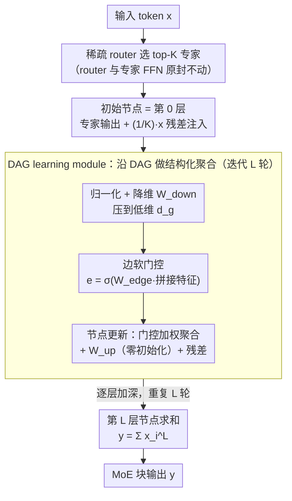

# DAG-MoE: From Simple Mixture to Structural Aggregation in Mixture-of-Experts

**会议**: ICML 2026  
**arXiv**: [2606.01062](https://arxiv.org/abs/2606.01062)  
**代码**: https://github.com/JiaruiFeng/DAG-MoE  
**领域**: 模型压缩 / MoE 架构  
**关键词**: Mixture-of-Experts, 结构化聚合, DAG, 多步推理, 稀疏路由  

## 一句话总结
把标准 MoE 中 top-$K$ 专家输出的"加权求和"替换为按一个动态学习出来的 DAG 进行结构化聚合，在几乎不增加路由与参数开销的前提下显著提升 MoE 表达能力与下游推理表现。

## 研究背景与动机

**领域现状**：现代 LLM 普遍以 MoE 解耦参数量与计算量——路由器为每个 token 选 top-$K$ 个 FFN 专家，输出 $y=\sum_{i=1}^{N} g_i(x) E_i(x)$。已有的扩展轴主要集中在两条线：把路由算法做得更准（Expert-Choice、RNN router、load-balance loss 改良），或者把专家粒度做细（fine-grained，$G=d_f/d_r$ 越大组合空间越大）。

**现有痛点**：细粒度路线虽然让 $\binom{N}{K}$ 组合数爆炸（top-2/8=28 vs top-4/16=1820），但 $N$ 翻倍意味着路由侧参数与负载均衡复杂度同步翻倍，SOTA 系统因此不敢用极端细粒度；并且 router、experts 都已被反复优化，进一步刷点的收益越来越薄。

**核心矛盾**：标准聚合形式 $\sum g_i E_i$ 是**置换不变**的——一旦 top-$K$ 集合定下来，输出就由这堆专家的"多重集"唯一确定，专家之间没有顺序，没有交互，更不可能在一层内做多步组合。也就是说 MoE 的第三个核心组件——**聚合**——一直被忽略，导致表达力上界被锁死在 weighted sum 这个函数族里。

**本文目标**：(i) 提出一种比加权求和更强、但不增加路由复杂度的聚合形式；(ii) 给出严格的表达力比较；(iii) 设计一个轻量、可端到端学习的模块来实现这种聚合。

**切入角度**：把选出的 $K$ 个专家看作 DAG 上的节点——每个节点占据**不同的结构角色**，专家输出沿 DAG 边逐层聚合。这样即使专家集合、router 分数完全一样，换一个 DAG 就得到完全不同的输出。对于固定 $K$，可能的 DAG 数随深度指数增长，提供了一个全新的扩展轴。

**核心 idea**：把 MoE 层里那一步置换不变的 weighted sum 替换成一个**逐 token 动态学出来的 DAG 上的结构化聚合**，从而在不动 router、不动专家的前提下放大组合空间。

## 方法详解

### 整体框架
DAG-MoE 只改 MoE 块里最后那一步聚合，前面的 sparse router 和专家 FFN 原封不动。一个 token 进来后，router 照常选出 top-$K$ 专家、给出 $K$ 个初始节点表征，每个初始节点还额外注入一份 $1/K$ 缩放的原始 token 残差作为 DAG 的第 0 层；接着一个新增的 **DAG learning module** 接管：它迭代 $L$ 次，每一轮都先把节点降到低维、再为当前深度的节点动态学一组"连边"（软门控）、沿这些边把表征更新一遍，最后在第 $L$ 层把所有节点求和，作为该 token 在这一层的输出。因为 router 和专家都没动，它天然兼容现有 MoE 训练栈。

### 关键设计

**1. DAG 风格聚合的一般形式化：先从理论上证明"结构化聚合"严格强于"加权求和"**

标准 MoE 的输出 $y=\sum_i g_i E_i$ 是置换不变的——top-$K$ 集合一定下来，输出就被这堆专家的多重集唯一确定，专家之间既没顺序也没交互，表达力上界被锁死在 weighted sum 这个函数族里。DAG-MoE 的破局点是把 top-$K$ 列表 $\bm{k}$ 组织成一张深度 $L$、每层 $n(l)$ 个节点的 DAG $G=(\mathcal{V},\mathcal{A})$：节点 $(l,i)$ 用入边集合 $A_i^l$ 指定自己从前面哪些节点取值，最后由单一根节点 $(L,1)$ 给出输出。形式上初始层 $x_i^0 = g_{\bm{k}[i]}(x) E_{\bm{k}[i]}(x)$，中间层 $x_i^l = \mathrm{AGG}(\{x_j^k \mid (k,j)\in A_i^l\})$，输出 $y=\mathrm{AGG}(\{x_j^k \mid (k,j)\in A_1^L\})$。借用 GNN / D-VAE 那一套工具，只要 $\mathrm{AGG}$ 是单射（理论构造用 MLP+sum/min/max），就能层层推出三个递进结论：Prop 3.1 任意 DAG 都可被单射编码 → Theorem 3.2 DAG-MoE 严格强于标准 MoE → Theorem 3.3 单层 DAG-MoE 配一层多头注意力，能在 $O(K\log n)$ 输入长度下模拟一次完整动态规划，而标准 MoE 因为只能做一步聚合根本做不到。这一串证明的意义在于：它把"为什么值得在聚合这一步上花功夫"从直觉变成了可证的表达力 gap，DAG 提供的顺序与多步组合正是 weighted sum 缺的那块。

**2. 轻量 DAG learning module：在没有 ground-truth 结构的前提下逐 token 把 DAG 学出来**

理论上的一般 DAG 搜索空间太大，没法端到端学，所以这里先把空间砍小——固定每层 $n(l)=K$，并只允许节点 $(l,i)$ 从相邻的前一层 $l-1$ 连边，更早的信息靠残差携带。每轮迭代先归一化降维：$x_{i,\mathrm{input}}^l=\mathrm{LN}(x_i^{l-1})$、$x_{i,\mathrm{down}}^l=W_{\mathrm{down}}^l x_{i,\mathrm{input}}^l$，把表征压到低维 $d_g \ll d$ 再做结构学习；对每对节点 $(i,j)$ 拼出候选边特征 $x^l_{(i,j)}=\mathrm{Concat}(x_{i,\mathrm{down}}^l, x_{j,\mathrm{down}}^l)$，学一个软门控

$$e^l_{(i,j)} = \sigma(W_{\mathrm{edge}}^l x^l_{(i,j)})$$

来连续地控制这条边是否生效，节点信息按门控加权 $\hat{x}^l_{(i,j)} = e^l_{(i,j)} \odot W_{\mathrm{node}}^l x^l_{(i,j)}$，最后投回原维并接残差 $x_i^l = W_{\mathrm{up}}^l\sum_j \hat{x}_{(i,j)}^l + x_i^{l-1}$，迭代 $L$ 轮后输出 $y=\sum_{i=1}^K x_i^L$。这套设计同时解掉三个工程难题：把整张 $K\times K$ 邻接矩阵当 sigmoid 软门控来学，避开了离散结构搜索（和 DARTS 的连续松弛同味，但只在极小图上做）；在低维空间学结构再投回去，把额外参数压到只和一个 shared expert 相当；$W_{\mathrm{up}}$ 零初始化加残差，让模块在训练初期近似恒等映射，避免多节点求和带来的量级漂移和梯度不稳。

**3. 初始节点的 token 残差注入：让原始 token 表征在整个聚合过程中始终可达**

如果初始节点只装专家输出，token 自身的信息一旦进了 DAG 就可能被聚合稀释掉，所以每个初始节点额外注入一份缩放后的原始表征：$x_i^0 = g_{\bm{k}[i]}(x) E_{\bm{k}[i]}(x) + \tfrac{1}{K} x$。这里 $1/K$ 不是随手取的——它保证 $K$ 个节点在最后 $\sum_i x_i^L$ 求和后，原始 token 的总残差贡献恰好是 1，正好匹配 transformer 块外层 residual stream 的量级。消融里去掉这个残差或拿掉 $1/K$ 缩放，训练就很容易发散或长期不收敛，作者直接把它定性为"对训练稳定性至关重要"。

### 损失函数 / 训练策略
沿用 Switch Transformer 的 token-choice router + load-balance loss，再叠 router Z-loss 抑制 logits 漂移。基础架构改自 Llama3.1-8B（保留 tokenizer/attention/FFN 形状），训练目标是标准 causal LM。

## 实验关键数据

### 主实验
12B token Pile 预训练对比三档模型（DAG-MoE-s/-m/-l），并把 baseline 加一个 shared expert 让参数严格对齐。40B token 大规模训练用 DAG-MoE-l ($d_g=256$, $L=2$, 699M 参数) vs MoE-l (shared expert $d_r=512$, 同 699M)：

| 数据集 | 指标 | MoE-l | DAG-MoE-l | 改善 |
|--------|------|-------|-----------|------|
| Pile (in-domain) | PPL ↓ | 10.51 | 10.27 | -0.24 |
| Wikipedia (OOD) | PPL ↓ | 21.08 | 20.54 | -0.54 |
| FineWeb-Edu (OOD) | PPL ↓ | 25.38 | 24.69 | -0.69 |
| C4 (OOD) | PPL ↓ | 35.21 | 34.21 | -1.00 |

OOD 上的 gap 显著大于 in-domain，与 Theorem 3.2 的"表达力优势在分布外更需要"是一致的。

### 消融实验

| 配置 | 加参 | ΔPPL ↑ / Eval Loss ↓ | 说明 |
|------|------|----------------------|------|
| Standard MoE | 0 | 0.000 / 2.7168 | 基线 |
| + shared expert | 393K | 0.433 | 同参纯加专家 |
| Chain-of-Experts (CoE) | 393K | 0.480 | 同参迭代式 router |
| **DAG-MoE-s ($L=2$)** | 393K | **0.587** | 结构聚合最强 |
| MLP mixing $d_g=64$ | 98K | -0.0838 (倒退) | 无结构 MLP 混合反而更差 |
| 微调下游 (DAG-MoE-l vs MoE-l) | — | 26.13 vs 24.06 (avg 7 task) | GPQA +6.06、Lambada +3.46、PIQA +3.15 |

### 关键发现
- **结构本身是关键**，而非额外参数：CoE 同参只拿到 0.480，无结构 MLP 反而比 baseline 还差 → 说明 DAG 提供的"顺序、迭代组合"是真正有效的归纳偏置。
- **迭代次数 $L$ 比维度 $d_g$ 更划算**：$L=0\to1$ 与 $L=1\to2$ 都能掉约 0.5 PPL，$L=2\to3$ 边际很小；$d_g=64,L=2$ 比 $d_g=128,L=1$ 更好但参数更少。
- **吞吐代价小**：$L=1$ 仅 1.51% wall-clock 开销，$L=2$ 仅 4.49%，FLOPs 几乎相同。
- **下游 gain 集中在多步推理任务**：GPQA、Lambada、PIQA、BBH 涨幅明显，而 HellaSwag/MMLU 这种偏模式匹配的几乎不变——印证"结构聚合主要帮的是组合性推理"这一定性论断。

## 亮点与洞察
- 第一次把 MoE 的"聚合算子"作为独立的设计轴提出来，而且把它和 GNN 表达力（D-VAE/GIN 那一套）连起来——这条桥同时贡献了 Prop 3.1、Thm 3.2、Thm 3.3 三个层层递进的理论结果，写法非常清爽。
- Thm 3.3"单层 DAG-MoE + 一层 attention 可模拟 DP"是论文里最大胆的论断，但作者很克制地把它写成"existence/capacity result"，并明说不主张学到的 DAG 真的对应任何 DP 程序——这种"理论作动机、实验做证据"的态度值得学。
- 软门控 $e^l_{(i,j)}$ 等价于把整张邻接矩阵当 sigmoid mask 学，跟 NAS / DARTS 的连续松弛是一个味儿，但只在 $K\times K$ 的小图上做，避开了 NAS 常见的搜索代价问题——这种"在最小可行结构空间里做软搜索"的思路完全可以迁移到 prompt routing、adapter selection 等场景。
- "OOD gap > in-domain gap"这种现象在 MoE 文献里相对少见，但用表达力理论解释得通：分布外 token 更可能落到训练时没见过的专家组合，此时结构聚合的多样性优势就放大了。

## 局限与展望
- 当前 DAG 类被人为限制（每层 $K$ 个节点、只能跨相邻深度连边），Prop 3.1 与 Thm 3.3 都要打折扣，只有 Thm 3.2 完全转译——作者承认这是个 gap。
- 怎么"找到最优 DAG"以及"模块怎么才能稳定学到它"基本没碰，目前完全靠 sigmoid 软门控 + 梯度，离离散意义下的最优 DAG 多远是未知数。
- 实验最大才到 699M 参数 / 40B token，离 SOTA MoE LLM（百亿参数 / 万亿 token）还差几个量级，scaling 行为不明；尤其 $L=2$ 的 4.49% 时间开销在更大 scale 下会不会被 sequential 性质放大、是不是 torch.compile 真能抹掉，没给数据。
- AGG 实现选择没有充分消融——理论假设单射 MLP+sum，工程上简化成了 sigmoid 门控 + sum，两者之间的差距没量化。

## 相关工作与启发
- **vs Chain-of-Experts (CoE, Wang 2025)**：CoE 在一层内做"多轮 routing + 增量 refine"，每轮要独立 router，路由代价随轮数线性涨；DAG-MoE 只 route 一次，把多步交给 DAG 模块，本文实验显示同参下 DAG-MoE 比 CoE 多拿 0.107 PPL。
- **vs S′MoRE (Zeng 2025)**：S′MoRE 也搞结构聚合，但结构固定成树、且只作为 PEFT adapter 用；DAG-MoE 把它推广成任意 DAG 且作为骨干，每个 token 能学到不同结构。
- **vs DiEP (Bai 2026)**：DiEP 也用 DAG 但目的是 differentiable expert pruning（压缩方向）；DAG-MoE 反过来用 DAG 增加表达力。
- **vs Fine-grained MoE (He 2024 等)**：细粒度是把 $N$ 做大、组合数靠"选哪些"扩张；DAG-MoE 是把"怎么组合"扩张，两条轴正交，可以叠加使用。

## 评分
- 新颖性: ⭐⭐⭐⭐⭐ 把 MoE 第三个被忽视的组件——聚合——单独拎出来做表达力扩展，并桥到 GNN 理论。
- 实验充分度: ⭐⭐⭐⭐ 三档模型 + 同参 baseline + CoE/MLP 对照，但最大 scale 仍偏小且只在 Pile 上预训练，缺更大 LLM 验证。
- 写作质量: ⭐⭐⭐⭐⭐ Prop→Thm→Thm 三个理论结果层层递进，"理论是动机、实验是证据"的边界把握得很好，OOD vs in-domain 的解释也漂亮。
- 价值: ⭐⭐⭐⭐ 提供了 MoE 改进的一条几乎免费的新轴（<5% throughput），但 sequential $L$ 在超大规模下的代价还是未知数。

<!-- RELATED:START -->

## 相关论文

- [\[ICML 2026\] RQ-MoE: Residual Quantization via Mixture of Experts for Efficient Input-Dependent Vector Compression](rq-moe_residual_quantization_via_mixture_of_experts_for_efficient_input-dependen.md)
- [\[ICLR 2026\] Coupling Experts and Routers in Mixture-of-Experts via an Auxiliary Loss](../../ICLR2026/model_compression/coupling_experts_and_routers_in_mixture-of-experts_via_an_auxiliary_loss.md)
- [\[ICLR 2026\] Unveiling Super Experts in Mixture-of-Experts Large Language Models](../../ICLR2026/model_compression/unveiling_super_experts_in_mixture-of-experts_large_language_models.md)
- [\[CVPR 2026\] Enhancing Mixture-of-Experts Specialization via Cluster-Aware Upcycling](../../CVPR2026/model_compression/enhancing_mixture_of_experts_specialization_via_cluster_aware_upcycling.md)
- [\[ICLR 2026\] LD-MoLE: Learnable Dynamic Routing for Mixture of LoRA Experts](../../ICLR2026/model_compression/ld-mole_learnable_dynamic_routing_for_mixture_of_lora_experts.md)

<!-- RELATED:END -->
