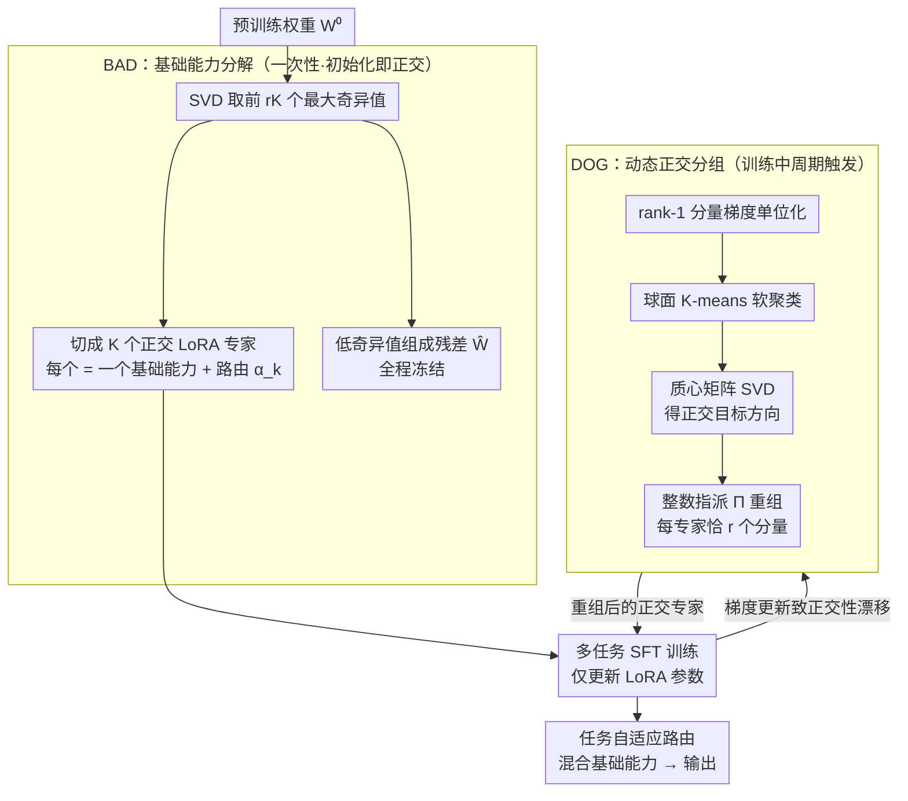

# Decomposing the Basic Abilities of Large Language Models: Mitigating Cross-Task Interference in Multi-Task Instruct-Tuning

**会议**: ICML 2026  
**arXiv**: [2605.05676](https://arxiv.org/abs/2605.05676)  
**代码**: https://github.com/wangbing1416/BADIT  
**领域**: LLM效率 / 多任务微调 / LoRA / MoE  
**关键词**: 多任务指令微调, 跨任务干扰, SVD-LoRA, 球面聚类, 正交基础能力

## 一句话总结
论文针对多任务指令微调中的跨任务梯度冲突问题，提出 Badit：先用 SVD 把预训练权重分解为一组天然正交的高奇异值 LoRA "基础能力"专家，再在训练过程中用球面 K-means 对 rank-1 分量做动态正交分组，从而把"按任务隔离参数"的传统思路改为"按基础能力解耦"，在 6 个 LLM 上平均比 GainLoRA 提升 2.68 Rouge。

## 研究背景与动机
**领域现状**：当前 LLM 的强多任务能力主要靠 multi-task instruct-tuning 撑起来，但多任务训练 inevitably 会出现 *cross-task interference*——不同任务在共享参数上产生方向相反的梯度，互相覆盖。已有解决思路分两条：(1) 任务专属神经元/参数选择（如 Leng & Xiong 2025），用梯度归因找到每个任务独占的参数子集只训这些；(2) MoE 风格的专家隔离（LoRAMoE、OLoRA 等），为每个任务分配独立 LoRA 专家并施加正交约束。

**现有痛点**：作者在 SuperNI 15 个任务上做实证分析（Fig. 1、Fig. 2），发现这两类方法都失败：无论是"任务激活的神经元/参数"还是"MoE 中被路由的专家"，**绝大多数都被多个任务同时激活**——甚至有部分神经元被 15 个任务全部共享。换言之，所谓"任务专属"只是一种幻象，跨任务干扰从未被真正消除。

**核心矛盾**：以"任务"作为隔离粒度本身就有 bug——任务是表层标签，不是参数层面真实存在的功能分割单元。强行按任务分组只会因为任务之间的能力重叠而再次共享参数。

**本文目标**：(1) 找到比"任务"更本质的、真正可分离的能力单元；(2) 设计一种 MoE 结构让这些单元在训练过程中始终保持正交。

**切入角度**：Fig. 1 还揭示一个反向信号——"某些神经元/参数始终被多任务**共激活**"，这些共激活集合反复出现，形成少量"基组"。作者由此提出一个比喻：LLM 编码了若干**正交的基础能力（basic abilities）**，每个任务都是这些能力的线性组合。既然如此，应该按"基础能力"而非"任务"来隔离参数。

**核心 idea**：用 SVD 把预训练权重分解为多个天然正交的 LoRA 专家（每个对应一个基础能力），训练中再用球面聚类持续地把 rank-1 分量重新分组，强行让不同专家的梯度方向保持正交。

## 方法详解

### 整体框架
Badit 把每个 LLM 权重矩阵 $\mathbf{W}^0\in\mathbb{R}^{m\times n}$ 拆成 $\mathbf{W}^0 = \sum_{k=1}^{K}\alpha_k \mathbf{A}_k\mathbf{B}_k + \widehat{\mathbf{W}}$：前 $rK$ 个最大奇异值被切成 $K$ 个 rank-$r$ 的 LoRA 专家、每个解读为一个"基础能力"并配可学习路由 $\alpha_k$，剩下小奇异值组成残差 $\widehat{\mathbf{W}}$ 全程冻结。整套流程两步走——**BAD** 用 SVD 给出初始就正交的能力分解，**DOG** 在训练中周期性把分量重新分组、把被梯度冲淡的正交性拉回来，最终路由按任务自适应地混合这些能力。

### 关键设计

**1. Basic Ability Decomposition（BAD）：用一次 SVD 拿到免训练就正交的"基础能力字典"**

前面已经说清痛点——按"任务"分专家总会因能力重叠而再次共享参数，所以得找一个参数层面真实存在的解耦单元。BAD 的做法是直接对预训练权重 $\mathbf{W}^0$ 做 SVD，取前 $rK$ 个奇异值/向量按列切成 $K$ 段，第 $k$ 段构造 $\mathbf{A}_k = \mathbf{U}_{[r(k-1):rk]}\,\mathrm{diag}(\sqrt{\boldsymbol{\Sigma}_{[r(k-1):rk]}})$ 和对称的 $\mathbf{B}_k$，就得到一个 rank-$r$ 的 LoRA 专家；低奇异值部分组成残差冻结。论文（Appendix A）证明这样切出来的 $K$ 个专家在初始化时**天然两两正交**——SVD 的左/右奇异向量本就落在互不重叠的子空间，每个专家因此对应一组完全独立的"能力方向"。关键洞察在于：基础能力不是 LoRAMoE 那样后天随机分配再训出来的，而是预训练权重里本就存在的主方向；SVD 等于免费给了一个正交字典，把"专家分化"的负担从训练完全前移到初始化，每个专家再加上初值为 1 的路由 $\alpha_k$ 以兼容 MoE。

**2. Dynamically Orthogonal Grouping（DOG）：把正交约束变成"按梯度方向重新归类"的离散优化**

SVD 的正交只在 $t=0$ 成立，梯度一更新就漂走（Fig. 4 里 LoRAMoE 的 inter-expert 夹角随训练逐步偏离 90°），而消融显示"全程维持正交"比"初始化好"更要命，所以必须有个机制在训练中持续修复。DOG 每隔若干步重新分组一次：先把每个 rank-1 分量 $[\mathbf{a}_i;\mathbf{b}_i^\top]$ 的拼接梯度 $\mathbf{g}_i$ 单位化为 $\widehat{\mathbf{g}}_i$，再找一个 0/1 分配矩阵 $\boldsymbol{\Pi}\in\{0,1\}^{rK\times K}$（每个新专家恰好分到 $r$ 个分量），让同一专家内梯度方向尽量一致、不同专家间尽量正交，目标写成

$$\max_{\boldsymbol{\Pi}}\sum_k \Big\|\sum_i \pi_{i,k}\widehat{\mathbf{g}}_i\Big\|^2 .$$

求解是个三步迭代：先用球面 K-means 给初始分配；再算每簇质心 $\mathbf{c}_k^{(\tau)}=\sum_i \pi_{i,k}^{(\tau)}\widehat{\mathbf{g}}_i$，对质心矩阵 $\mathbf{C}^{(\tau)}=\mathbf{U}_c\boldsymbol{\Sigma}_c\mathbf{V}_c^\top$ 再做一次 SVD 取 $\mathbf{Q}^{(\tau)}=\mathbf{U}_c\mathbf{V}_c^\top$ 当作被强行正交化的目标方向；最后按内积 $\langle \widehat{\mathbf{g}}_i, \mathbf{q}_k^{(\tau)}\rangle$ 解一个带 $\sum_i \pi_{i,k}=r$ 约束的整数指派问题更新 $\boldsymbol{\Pi}$，至多迭代 10 步或收敛即止。之所以绕这一圈而不直接给梯度加正交惩罚，是因为硬惩罚会破坏 loss 几何、训练不稳；DOG 把它转成"先软聚类、再硬正交化"的离散重分类，既保持端到端可训练，又能稳稳把 inter-expert 角度锁在 90° 附近、intra-expert 角度压到 60°。而且 Appendix C 证明重组前后 MoE 输出数学上 invariant，否则每次"换头"都会扰动模型。

### 损失函数 / 训练策略
仍是标准 SFT 损失 $\mathcal{L}(\mathcal{F}(\mathbf{x};\boldsymbol{\theta}), y)$，没有额外加正交正则。专家数 $K=8$、rank $r$ 与 LoRAMoE 对齐。DOG 在训练中周期性触发（聚类和整数优化在 CPU 上算）。两种评估范式：mixed training（15 任务混训）和 sequential training（按任务序贯训练，5 种顺序求平均，主要看遗忘率）。

## 实验关键数据

### 主实验
在 SuperNI 15 个任务、6 个 LLM (Qwen3-8B/4B、Llama3-8B/3B、Gemma2-9B/2B) 上比较 5 种基线。下表摘录 Qwen3-8B 和 Llama3-8B 在 mixed 和 sequential 两种范式的结果：

| 模型 / 设置 | 方法 | Mixed Rouge↑ | Seq Rouge↑ | Seq Forget Rate↓ | Seq Backward↑ |
|------|------|------|------|------|------|
| Qwen3-8B | LoRA | 54.22 | 47.08 | 9.21 | -8.11 |
| Qwen3-8B | LoRAMoE | 54.64 | 48.07 | 8.47 | -6.23 |
| Qwen3-8B | GainLoRA (SOTA) | 54.33 | 48.44 | 8.96 | -6.42 |
| Qwen3-8B | **Badit** | **55.87** | **50.86** | **6.95** | **-5.43** |
| Llama3-8B | LoRA | 52.58 | 44.88 | 12.41 | -10.23 |
| Llama3-8B | GainLoRA | 52.71 | 45.04 | 12.70 | -10.94 |
| Llama3-8B | **Badit** | **54.75** | **48.83** | **8.57** | **-3.49** |

Badit 在 6 个 LLM 上平均比 GainLoRA 高 **2.68 Rouge**，遗忘率和 backward transfer 也是最好。Llama3-8B 上 forget rate 从 12+ 降到 8.57，backward 从 -10 改善到 -3.49，说明 sequential 场景里灾难性遗忘明显被压下来。

### 消融实验
作者拆开 BAD 和 DOG 看各自贡献（Δ 是相对完整 Badit 的总跌幅）：

| 模型 | 配置 | Seq Rouge | Seq Forget | Mixed Rouge | Δ |
|------|------|-----------|------------|-------------|---|
| Qwen3 | Badit (full) | 50.86 | 6.95 | 55.87 | - |
| Qwen3 | w/o BAD | 50.07 | 7.34 | 55.02 | 2.03 |
| Qwen3 | w/o DOG | 49.70 | 8.20 | 54.85 | 3.43 |
| Qwen3 | w/o BAD & DOG | 48.07 | 8.47 | 54.64 | 5.54 |
| Llama3 | Badit | 48.83 | 8.57 | 54.75 | - |
| Llama3 | w/o BAD | 47.92 | 9.30 | 54.02 | 2.37 |
| Llama3 | w/o DOG | 47.33 | 9.74 | 53.74 | 3.68 |

### 关键发现
- **DOG 比 BAD 重要**：只做 SVD 初始化（w/o DOG）跌得比只做动态分组（w/o BAD）更多，说明"训练全程维持正交"比"良好的初始化"更关键；初始化的正交性在训练几个 epoch 后就被冲淡。
- **基础能力假设被 Fig. 4 直接验证**：Badit 的 inter-expert 梯度夹角全程贴近 90°，intra-expert 夹角约 60°（比 LoRAMoE 低 ~20°），证明它确实做到了"专家间正交、专家内一致"。
- **额外开销可接受**：Table 3 显示 Badit 总训练时间约为 LoRAMoE 的 $1.22\times$，多出来的代价主要来自 DOG 的球面 K-means 和整数优化（在 CPU 上跑）；BAD 反而可能加速收敛。

## 亮点与洞察
- **把隔离粒度从"任务"换到"能力"**：这是一次概念跳跃。传统 MoE 假设每个任务对应一个专家，作者反过来论证任务是能力的线性组合、能力才是底层 atom；这种视角直接解释了为什么按任务隔离总会失败——任务本身就在能力维度上重叠。
- **用 SVD 当"免训练的专家分化器"**：把"专家分化"这个本来需要专门 loss 才能撬动的难题，转嫁给一次纯线性代数操作（SVD），既高效又可证明正交，相当于站在 PiSSA 的肩膀上又往前一步。
- **DOG 的"先聚类再正交化"思路可迁移**：直接对梯度加正交惩罚通常会扰动 loss 表面、训练不稳；而 DOG 用 K-means 把"靠近的方向"打包后整体正交化，再用离散指派回填——这种"软分组 + 硬正交"两步走可以推广到任何需要保持方向解耦的场景（continual learning、multi-domain 适配、视觉 MoE 等）。
- **聚类 + 整数指派 + 不变性证明**：Appendix C 证明重组前后 MoE 输出不变，这一点很关键，否则动态重排会让模型每次"换头"。这种"在表征上做手术但保持端到端等价"的设计值得借鉴。

## 局限与展望
- 作者承认 DOG 引入 1.22× 训练成本，但没给训练扩展到更大 batch / 更大 $K$ 时的实测曲线，工业落地时这个开销可能进一步放大。
- 球面 K-means 和整数指派在 CPU 上跑，会成为 GPU-bound 训练的同步瓶颈，需要更高效的 GPU 实现或近似算法。
- 假设"基础能力 = SVD 主奇异方向"在数学上漂亮，但能力是否真的对应可解释语义（如算术、阅读理解）没有进一步可视化或探针实验证实——可能存在"高奇异值方向 ≠ 语义基础能力"的失配。
- 只在 15 任务 SuperNI 上验证，跨语言/跨模态/任务数量更多时是否需要更大 $K$、能力是否会饱和，都是开放问题。
- 残差 $\widehat{\mathbf{W}}$ 被完全冻结，丢掉了小奇异值方向，可能在某些 long-tail 任务上是隐性瓶颈，可考虑给残差做轻量适配。

## 相关工作与启发
- **vs LoRAMoE / OLoRA**：他们用随机初始化的 LoRA 专家并按任务路由，正交性靠训练中的惩罚维持；Badit 的专家从 SVD 拿、正交性靠每轮重组维持。本文优势：初始即正交、训练全程可控；劣势：DOG 增加了 ~22% 训练时间。
- **vs PiSSA**：PiSSA 是单专家 SVD-LoRA，只取最大若干奇异值；Badit 把 SVD 谱切成 $K$ 段当多个专家用，从单专家加速变成多专家解耦。
- **vs GainLoRA**：GainLoRA 也是 SOTA MoE 路线但仍按任务做参数分配，作者用经验证据反驳了它隐含的"任务可分"假设，从而获得 2.68 Rouge 的稳定提升。
- **启发**：这种"先用代数结构（SVD/PCA）给出免训练的解耦初始化，再用动态结构维护性质"的两阶段思路可以迁移到 continual learning、领域自适应、多模态 expert routing 等需要保持子空间解耦的任务上。

## 评分
- 新颖性: ⭐⭐⭐⭐ 把"隔离粒度"从任务换到基础能力是有意思的概念转化，SVD + 动态聚类的组合也较新；但 PiSSA、OLoRA 等 building block 都已存在，属于"在对的地方搭对积木"。
- 实验充分度: ⭐⭐⭐⭐ 6 个 LLM × 15 任务 × 2 种训练范式 × 5 个 seed，覆盖面足；并有梯度夹角动态、时间开销等辅助分析。
- 写作质量: ⭐⭐⭐⭐ 动机由 Fig. 1/2 的反直觉发现引出，逻辑链条清晰；方法部分公式密集但结构良好。
- 价值: ⭐⭐⭐⭐ 多任务指令微调是 LLM 后训练的核心环节，2.68 Rouge 的平均提升对工业训练管线有直接吸引力，代码开源；额外 22% 训练时间是落地时需要权衡的成本。

<!-- RELATED:START -->

## 相关论文

- [\[CVPR 2025\] Task Singular Vectors: Reducing Task Interference in Model Merging](../../CVPR2025/model_compression/task_singular_vectors_reducing_task_interference_in_model_merging.md)
- [\[ACL 2026\] TLoRA: Task-aware Low Rank Adaptation of Large Language Models](../../ACL2026/model_compression/tlora_task-aware_low_rank_adaptation_of_large_language_models.md)
- [\[ICML 2026\] Jailbreak to Protect: Buffering and Reinforcing via Temporary Jailbreaking for Safe Fine-Tuning in Large Language Models](jailbreak_to_protect_buffering_and_reinforcing_via_temporary_jailbreaking_for_sa.md)
- [\[ICML 2026\] Model Merging Scaling Laws in Large Language Models](model_merging_scaling_laws_in_large_language_models.md)
- [\[ICML 2026\] Task-Driven Subspace Decomposition for Knowledge Sharing and Isolation in LoRA-based Continual Learning](task-driven_subspace_decomposition_for_knowledge_sharing_and_isolation_in_lora-b.md)

<!-- RELATED:END -->
