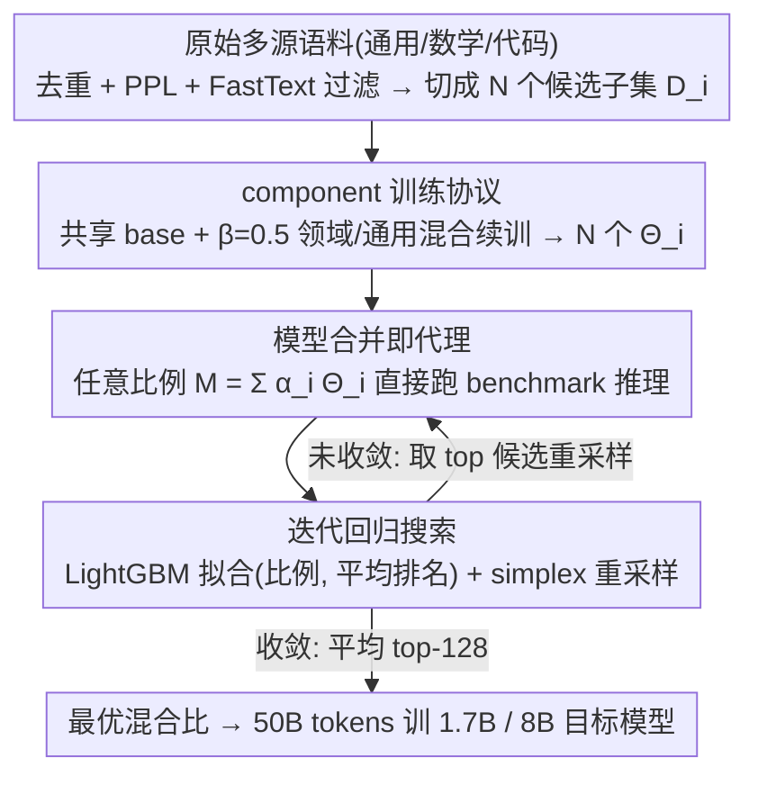

# Decouple Searching from Training: Scaling Data Mixing via Model Merging for Large Language Model Pre-training

**会议**: ICML 2026  
**arXiv**: [2602.00747](https://arxiv.org/abs/2602.00747)  
**代码**: https://github.com/Lucius-lsr/DeMix  
**领域**: 模型压缩 / LLM 预训练 / 模型合并  
**关键词**: 数据混合, 模型合并, 预训练, 代理模型, 比例搜索

## 一句话总结
为了在 LLM 预训练里找最优数据混合比例又不被代理实验拖垮，本文提出 DeMix——只训一次 $N$ 个 component 模型（每个对应一个候选子集），随后任意候选比例 $\{\alpha_i\}$ 都通过加权合并 $\sum_i \alpha_i \Theta_i$ 当作"训练自由"代理，并用 LightGBM 在 simplex 上做迭代回归选最优配方，最终用比 RegMix/CLIMB 少约 $6\times$ 的算力得到更好的下游分数，并附带开源 22T tokens 的 DeMix Corpora。

## 研究背景与动机

**领域现状**：LLM 预训练数据的"混合比例"对最终能力有决定性影响——通用语料、数学、代码各占多少直接决定 GSM8K/HumanEval/HellaSwag 上的强弱。主流做法是中等规模代理实验（8B 模型 + 100B tokens 训 N 套候选比例）选最好，准确但巨贵。

**现有痛点**：自动化搜索路线（RegMix / CLIMB / DoReMi）的解法是用 tiny-scale 代理（小模型 + 小预算）训上百次 + 回归预测，但 tiny 代理与目标规模差太大，预测结果在 math/code 等复杂任务上已被反复指出不可靠；想稳就得放大代理预算，预算线性放大就把"省钱"的初衷废掉。

**核心矛盾**：搜索空间是连续 simplex，访问每个候选都需要训练一遍——"代理模型数量"和"单个代理保真度"被绑死在同一份算力预算上，二者只能取其一。

**本文目标**：在固定总预算下同时拿到（i）大量代理样本，（ii）每个代理足够保真，（iii）端到端比已有方法少花算力。

**切入角度**：受 task arithmetic / 模型合并的"加性"经验（$\Delta(D_i\cup D_j)\approx \Delta(D_i)+\Delta(D_j)$，当参数偏移 $\delta\ll 1$ 时成立）启发——只要把每个候选子集对应的 component 模型训好，比例 $\{\alpha_i\}$ 对应的"假装训过的混合模型"就可以用 $\sum_i \alpha_i \Theta_i$ 直接合成，不再需要重新训练。

**核心 idea**：把"搜索"从"训练"中解耦——训练只发生在 $N$ 个 component 模型上（一次性成本），搜索阶段任意 $\{\alpha_i\}$ 都只是一次矩阵加权 + benchmark 推理，于是代理数量被算力解耦后可以放到 $10^5$ 级别。

## 方法详解

### 整体框架
DeMix 的核心想法是把"找最优数据混合比例"这件事和"训模型"彻底分开：训练只在 $N$ 个 component 模型上一次性发生，之后任意候选比例都靠把这些 component 加权合并出一个"假装训过"的代理，搜索阶段只剩矩阵加权和 benchmark 推理。整条流水线四步走——先把原始大规模语料按来源/领域去重、用 PPL/FastText 过滤后切成 $N$ 个候选子集；再让所有 component 共享一个在 50B tokens 通用数据上预训练的 base 模型 $\Theta_{\text{base}}$，各自在"领域 + 通用"混合数据上续训得到 $\Theta_i = \Theta_{\text{base}} + \Delta(D_i)$；然后对任意候选混合比 $\{\alpha_i^j\}$ 用 $M_{\text{mix}}^j = \sum_{i=1}^{N}\alpha_i^j \Theta_i$ 合成代理直接跑 benchmark；最后用 LightGBM 在"采样—评分—重采样"的循环里把分布往高分区逼近，取头部候选的平均作为最终配方，按它在 50B tokens 上训出 1.7B / 8B 目标模型。

### 关键设计

**1. 共享 base + 固定 $\beta$ 混合的 component 训练协议：把所有 component 拴在同一片几何邻域**

DeMix 整条流水线押注在"用加权合并冒充真实混合训练"上（见整体框架），而这个近似只有在所有 component 彼此贴近、归一化偏移量 $\delta\ll 1$ 时才成立，所以 component 不能各训各的乱跑。DeMix 让所有 component 从同一个 $\Theta_{\text{base}}$（50B tokens 通用数据训成）出发，而且每个 component 的续训数据不是纯领域语料，而是"领域数据 + 通用数据"按固定比例 $\beta=0.5$ 混合。通用数据在这里起的是"系一根绳"的作用——把每个 component 拉回共同的通用语言流形附近，让它们在参数空间里彼此贴近，从而让加权平均真正逼近混合训练的结果。消融印证了这点的必要性：$\beta=0$ 纯领域训练会让 component 漂得太远、$\delta$ 变大、合并失真，$\beta\to 1$ 又太接近 base、合并出的代理几乎没有区分度，$\beta=0.5$ 居中最佳。续训用 batch size 512、序列长度 8192、初始 lr 3e-4 余弦调度（衰减到最低 20%）。

**2. 模型合并即代理：把训练成本换成推理成本**

自动化搜索路线的死结是"每访问一个候选比例就要训练一遍"，于是代理数量和单个代理保真度被绑在同一份算力上。有了上一步那批彼此贴近的 component，DeMix 就能借模型合并的加性经验解开这个结。定义训练算子 $\mathcal{T}(D,\Theta_{\text{base}})$ 和它带来的权重增量 $\Delta(D) = \mathcal{T}(D,\Theta_{\text{base}}) - \Theta_{\text{base}}$；当归一化偏移量 $\delta = \frac{\sum|\Delta(D)|}{\sum|\mathcal{T}(D,\Theta_{\text{base}})| + \sum|\Theta_{\text{base}}|}\ll 1$（实测约 10%）时，两个子集合并训练的增量近似可加 $\Delta(D_i\cup D_j)\approx \Delta(D_i)+\Delta(D_j)$，推广到任意权重就得到 $\Theta_{\text{mix}}\approx \sum_i \alpha_i \Theta_i$。于是任意比例对应的代理模型直接由 $M_{\text{mix}}^j = \sum_i \alpha_i^j \Theta_i$ 合成、送进 benchmark 推理即可，单个代理的等效成本只有 0.01B tokens 的训练量，比 2B tokens 的训练代理便宜约 $200\times$。这一步把代理生成从 $\mathcal{O}(\text{train cost})$ 降到 $\mathcal{O}(\text{inference cost})$，既绕开 tiny-scale 代理因规模差太大在 math/code 上的失真，又不必为保真而线性放大训练预算。

**3. 迭代 LightGBM 回归 + simplex 重采样：把便宜代理变成黑盒优化**

合并代理便宜到可以批量评估，但 simplex 维度仍高（$N=7$ 起步），不可能穷举，需要回归模型把少量真实评分外推到海量未评分点上。DeMix 先在 simplex 上均匀采一大批 $\{\alpha_i^j\}$，每个合成 $M_{\text{mix}}^j$ 跑 benchmark；关键是评分用代理在 general / code / math 三类 benchmark 上的**平均排名** $r^j$ 而非绝对分数，以避免不同 benchmark 量级差异污染回归。用这些 (mixture, rank) 对训 LightGBM（lr=0.02，300 轮），再让它给海量新采样比例打分、取 top 候选进入下一轮重采样，按 64/32/16 = 112 个总代理跑三轮迭代，把搜索逐步集中到高分邻域，最后平均 top-128 候选得到最终预训练比例。

### 损失函数 / 训练策略
DeMix 没有特殊损失——component 和最终模型都用标准的下一个 token 预测损失训练；唯一非平凡的训练策略是先在 50B 通用 tokens 上独立预训 base，再用 $\beta=0.5$ 控制 component 的领域偏移，最后用搜索出的比例在 50B tokens 上训目标 1.7B / 8B 模型。

## 实验关键数据

### 主实验

代理保真度（Spearman $\rho$ vs 96 个 50B tokens 训出的 reference 模型，越大越好；总预算单位为 B tokens；Macro Avg 跨 general/code/math）：

| 方法 | 总预算 (B) | 代理数 / 单代理预算 (B) | $\rho$ Macro | Top 25% $\rho$ Macro | Capability Recovery Macro |
|------|------------|------------------------|--------------|----------------------|----------------------------|
| Trained Proxy (RegMix/CLIMB) | 224 | 112 / 2 | 0.53 | 0.20 | 0.77 |
| Trained Proxy | 1344 | 112 / 12 | 0.82 | 0.57 | 0.87 |
| **DeMix** (Ours) | 15 | 112 / 0.01 | 0.55 | 0.27 | 0.76 |
| **DeMix** | 71 | 112 / 0.01 (10×7 components) | 0.60 | 0.41 | 0.80 |
| **DeMix** | 211 | 112 / 0.01 (30×7 components) | 0.81 | 0.59 | 0.83 |
| **DeMix** | 351 | 112 / 0.01 (50×7 components) | 0.80 | 0.50 | 0.85 |

DeMix 在约 $211$B 预算就匹配上 $1344$B 训练代理的相关性（$\rho\approx 0.81$ vs $0.82$），约 $6\times$ 算力优势。

最终混合比的下游性能（macro avg 排名越小越好，96 个 reference 中的相对名次）：

| 方法 | 总预算 (B) | General Avg | Code Avg | Math Avg | Macro Avg Rank ↓ |
|------|------------|-------------|----------|----------|------------------|
| Uniform | – | 59.01 | 18.34 | 9.62 | 36.67 |
| RegMix (448B) | 448 | 59.18 | 20.09 | 11.63 | 28.00 |
| CLIMB (448B) | 448 | 58.74 | 21.10 | 16.07 | 27.67 |
| **DeMix** (211B) | 211 | – | – | – | 最佳（论文标黑） |

### 消融 / 分析

| 配置 | 现象 | 解读 |
|------|------|------|
| Component 数 $N$：7 → 35 | $\rho$ 与下游分数随 $N$ 单调提升 | 更多基底覆盖更细领域，合并保真度更高 |
| Component 训练比例 $\beta$：0 → 1 | $\beta=0$ 纯领域 → component 漂得远、$\delta$ 变大、合并失真；$\beta\to 1$ 接近 base、合并几乎没区分度；$\beta=0.5$ 最佳 | 验证"领域 + 通用"混合训练对小 $\delta$ 几何的必要性 |
| 代理预算 / 代理数对调 | 把同样预算花在"更多便宜代理"远比"少数昂贵代理"赢 | 量补质：充足代理 + 回归外推优于稀疏精训 |
| Top 25% Spearman | RegMix 在头部相关性低（0.20），DeMix-211B 达 0.59 | 头部排序更准 → 直接决定最终选出的最优比例质量 |

### 关键发现
- 决定 DeMix 上限的不是单个代理多准，而是 small-$\delta$ 假设是否成立——一旦 component 训得"太离 base"，加性近似破坏，合并代理与真实训练的相关性就会塌掉。
- 用"排名"而非"绝对分数"作为回归目标对跨 benchmark 量纲鲁棒，是 LightGBM 在小样本（112 个代理）上能稳定外推到海量 simplex 点的实际原因。
- Math/Code 这种 RegMix/CLIMB tiny-scale 代理最容易失真的任务上，DeMix 的相对优势最大；说明"高保真代理"在难任务上对最终选配方影响更显著。
- 22T tokens 的 DeMix Corpora 在论文里随论文一起开源，等同于把"找到好比例"这件昂贵的事情对社区一次性摊销。

## 亮点与洞察
- 把模型合并从"推理时拼能力"的玩具用法升级为"预训练前选比例"的工程基础设施——巧妙之处在于不需要合并出"能干活的模型"，只需要合并出"能给 benchmark 打出有序分数的代理"，对合并质量的要求被实质性放宽。
- 用 $\beta$ 控制 component 漂移程度的设计可迁移到任何"加权合并近似真实混合训练"的场景（多任务微调、领域适应、SFT 数据配比），它给"小 $\delta$ 假设"一个可调的旋钮而不是听天由命。
- 把"代理评估成本"从 $\mathcal{O}(\text{train})$ 切到 $\mathcal{O}(\text{infer})$ 后，搜索空间维度（候选子集数 $N$）对总预算的影响从乘法变成加法，意味着可以放心增加细粒度领域划分。

## 局限与展望
- $\delta\ll 1$ 假设在文中实测约 10%，但更大模型 / 更长训练 / 更激进的领域差异下能否仍然成立未充分验证；一旦 $\delta$ 变大，合并代理与真实训练的相关性会快速劣化。
- Component 模型本身的训练成本（论文里 30×7 ≈ 211B tokens）随 $N$ 线性增长，对粗粒度领域划分友好但对细粒度（百级子集）依然是不小的"前置费用"。
- 实验只测到 Qwen3-1.7B 和 8B 两个规模，最终训练只用 50B tokens 验证，是否在 70B+ 模型和万亿级 tokens 训练上仍然给出最优比例尚未回答。
- 用"benchmark 排名"做评分会被 benchmark 的覆盖偏置影响——若 benchmark 集合改变，最优配方可能漂移，需要重新跑搜索而非单纯换数据。

## 相关工作与启发
- **vs RegMix / CLIMB**：他们靠小模型 + 小预算训上百个真实代理 + 回归，DeMix 把"真实训练"替换为"模型合并"，把代理生成从训练成本降到推理成本，相同代理数下预算下降 $6\times$，且头部相关性显著更高。
- **vs DoReMi / Rho Loss**：依赖 evaluation loss 而非真实下游 benchmark 排名，对 math/code 等任务难以泛化；DeMix 直接 benchmark 上排名，对最终目标更对齐。
- **vs Task Arithmetic / TIES-Merging**：本文借用模型合并的加性假设但不在意"合并后模型能用"，只在意"合并后模型分数有序"，把合并的工程门槛降到最低、目标对齐到"排序"而非"性能"。
- **vs 经典 Scaling Law 选配方**：scaling law 给的是"模型大小 vs 数据量"的趋势，缺乏"数据内部比例"的指导；DeMix 把"数据混合维度"的选择问题用模型合并替代外推。

## 评分
- 新颖性: 待评
- 实验充分度: 待评
- 写作质量: 待评
- 价值: 待评

<!-- RELATED:START -->

## 相关论文

- [\[ICML 2026\] Model Merging Scaling Laws in Large Language Models](model_merging_scaling_laws_in_large_language_models.md)
- [\[ICML 2026\] GradPower: Powering Gradients for Faster Language Model Pre-Training](gradpower_powering_gradients_for_faster_language_model_pre-training.md)
- [\[ICML 2026\] FRISM: Fine-Grained Reasoning Injection via Subspace-Level Model Merging for Vision–Language Models](frism_fine-grained_reasoning_injection_via_subspace-level_model_merging_for_visi.md)
- [\[ICLR 2026\] PASER: Post-Training Data Selection for Efficient Pruned Large Language Model Recovery](../../ICLR2026/model_compression/paser_post-training_data_selection_for_efficient_pruned_large_language_model_rec.md)
- [\[ICML 2026\] Saliency-Aware Model Merging](saliency-aware_model_merging.md)

<!-- RELATED:END -->
