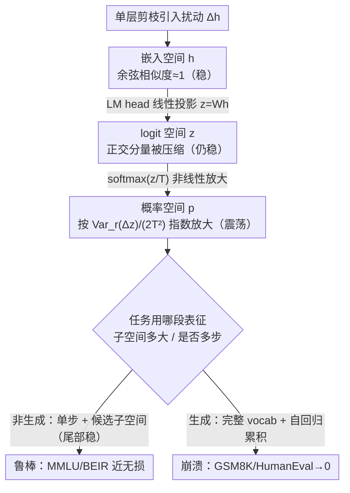

# Demystifying When Pruning Works via Representation Hierarchies

**会议**: ICML 2026  
**arXiv**: [2603.24652](https://arxiv.org/abs/2603.24652)  
**代码**: 论文中提及"available in the project repository"但未给出公开链接  
**领域**: LLM 模型压缩 / 网络剪枝 / 表征分析  
**关键词**: 网络剪枝, 生成任务退化, softmax 放大, 表征层次, KL 散度

## 一句话总结
论文从"嵌入 → logit → 概率"三段表征层次出发，用 Taylor 局部展开理论证明：剪枝对嵌入空间和 logit 空间的扰动天生很小，但 softmax 这一非线性步骤会按 $\mathrm{Var}_r(\Delta z)/(2T^2)$ 把扰动放大到概率空间，再经过自回归解码的步间累积，最终导致生成任务崩溃；而非生成任务因为只依赖候选 token 子空间，对剪枝天然鲁棒——这统一解释了为什么剪枝在 MMLU、retrieval 上几乎无损但在 GSM8K、HumanEval 上骤降到 0。

## 研究背景与动机
**领域现状**：随着 LLM 规模膨胀，网络剪枝（Wanda、SparseGPT、ShortGPT、Attn/MLP Drop 等）成为压缩的主流方案。intra-layer 路线对单层做稀疏化（unstructured / 2:4 / 4:8），inter-layer 路线则直接砍掉某些 transformer block 或 attention/MLP 子层。这些方法在 retrieval、多选 QA、文本分类等"非生成任务"上都被证明可以接近无损保留性能。

**现有痛点**：但实际部署中出现一个反复被观察到的怪现象——同样的剪枝模型，在 MMLU 上几乎不掉点，在 GSM8K / HumanEval / NarrativeQA 上却直接崩到 0（如 Mistral-7B-Instruct 砍 8 个 MLP 层后 GSM8K 从 48.4 → 0.0、HumanEval 从 4.9 → 0.0、MBPP 从 13.8 → 0.0）。但是没有理论解释这个"任务依赖的脆弱性"从何而来，工业界只能靠经验避雷。

**核心矛盾**：现有解释把锅推给"生成任务输出空间维度大（vocabulary $|\mathcal{V}|$ 远超嵌入维度 $d$ 或候选数 $k$）"或"自回归累积"，但这些是直觉描述，无法定量预测；更关键的是没回答"嵌入扰动那么小，是怎么变成概率上的灾难性偏移的"。

**本文目标**：(1) 把 LLM 推理沿信息流拆成三段表征空间（embedding $h$ / logit $z$ / probability $p$）逐一量化扰动；(2) 给出能解析预测剪枝对各空间冲击的闭式公式；(3) 解释非生成任务为何鲁棒、生成任务为何脆弱；(4) 给出实操指导。

**切入角度**：作者关注一个非常具体的细节——同样的剪枝后 $\Delta h$，在 logit 空间 $\Delta z = W \Delta h$ 是线性变换（旋转 + 拉伸），但在概率空间 $\Delta p = \mathrm{softmax}(z + \Delta z)/T - \mathrm{softmax}(z)/T$ 经过非线性指数归一化后会被极大放大；自回归解码进一步把单步小误差变成多步累积。

**核心 idea**：把剪枝表现的"任务依赖"归因于**表征层次的扰动传播差异**——线性层（embedding → logit）几乎保持相似度，softmax 非线性层是真正的放大器，多步解码是放大器的"循环喇叭"；而非生成任务只关心 logit 顺序或小候选子空间，从不暴露在这个放大循环里。

## 方法详解

### 整体框架
论文不提新的剪枝算法，而是搭一个**诊断框架**来回答"剪枝为什么挑任务"。它把 LLM 推理沿信息流拆成三段表征空间——嵌入 $h^{(l)}$、logit $z$、概率 $p$，对每一层单独施加剪枝，然后追踪同一个扰动是怎么从 $\Delta h$ 一路传到 $\Delta z$ 再到 $\Delta p$、在哪一步被放大的。整条链路先用实证测量（余弦相似度 + KL 散度）暴露现象，再用二阶 Taylor 展开给出闭式公式钉死成因，最后把单步分析延伸到多步自回归生成、并把多选任务切到"候选 token 子空间"，从而把生成崩溃和非生成鲁棒统一到同一套数学里。代表性剪枝方法取 Wanda / SparseGPT（intra-layer）与 ShortGPT / Attn-Drop / MLP-Drop（inter-layer），代表模型用 Qwen-2.5-7B-Instruct 和 Mistral-7B。

### 关键设计

**1. 三空间扰动测量协议：把"扰动在哪一步被放大"用对照实验钉死**

以往工作要么只盯权重稀疏度、要么只看端到端 perplexity，扰动在网络内部怎么传播被整个掩盖了。这里的做法是搭一个 controlled probe：在 baseline 模型正常 forward 的过程中，只把当前层换成它的剪枝版本、其它层保持原样，由此拿到纯属"这一层"的扰动 $\Delta h_l$。然后沿表征链逐级量化它的去向——嵌入空间用 angular deviation $1-\mathrm{CosineSim}(h_l, h_l+\Delta h_l)$，经 LM head 投到 logit 空间 $z^{(l)}=W h^{(l)}$ 测 $1-\mathrm{CosineSim}(z, z+\Delta z)$，再过 $p^{(l)}=\mathrm{softmax}(z^{(l)}/T)$ 落到概率空间。每层 × 每解码步都重复一遍，画出 Figure 4 的三条曲线。结果一目了然：嵌入和 logit 空间的余弦相似度几乎贴着 1（只在第一、最后一层略掉一点），概率空间却剧烈震荡。"每次只换一层"这个隔离设计的价值就在于它能把"单层局部扰动"和"端到端累积"干净地分开，让放大究竟发生在哪一段无所遁形。

**2. Taylor 局部理论（Theorem 1-3）：用闭式公式证明 softmax 才是放大器**

上一步暴露了现象，这一步要回答"为什么 logit 稳、概率不稳"。线性段的稳定性可以直接算出来：嵌入/logit 空间的偏移经二阶 Taylor 展开近似为 $1-\mathrm{CosineSim}(h, h+\Delta h) \approx \|\Delta h_\perp\|^2 / (2\|h\|^2)$，只取决于正交分量与原向量模长的平方比——而单层剪枝引入的 $\|\Delta h\|$ 本就远小于 $\|h\|$，这个比值自然很小，再经 LM head 投影后相对正交分量被进一步压缩（Fig. 5 实测确认）。真正的放大发生在 softmax 这一非线性步：概率空间偏移 $1-\mathrm{CosineSim}(p, p+\Delta p) \approx \mathrm{Var}_r(\Delta z)/(2T^2)$，其中 $r_i = p_i^2/\|p\|^2$；若用 KL 散度衡量分布偏移则有 $\mathrm{KL}(p\|q) \approx \mathrm{Var}_{i\sim p}(\Delta z_i)/(2T^2)$。这里的关键不是 $\Delta z$ 的模长而是它的**方差**——哪怕 $\Delta z$ 整体不大，只要它在 vocab 维度上分布不均匀，softmax 就会把这种"扁平 vs 尖峰"的差异指数级放大；温度 $T$ 又恰好压在分母上，温度越低放大越猛。这套理论第一次给"softmax 放大剪枝误差"提供了可计算、可对比的标尺，Fig. 6 显示理论估计的 angular deviation 和 KL 散度都和 ground truth 高度吻合——意味着不必真去生成，光凭单层扰动统计就能预判某次剪枝会不会把生成任务搞崩。

**3. 生成 vs 非生成的子空间机制（Multi-Scale Analysis）：同一个概率震荡为何只砸生成任务**

概率空间既然剧烈震荡，为什么多选和检索还是稳的？区别在于它们用了表征链的不同位置、不同大小的子空间、不同的步数。生成任务每步从完整 vocab $|\mathcal{V}|$ 采样并自回归，单步小偏差经 KV cache 喂回历史，使 baseline 和 pruned 模型从第二步起就 condition 在不同 token 历史上，偏差爆炸式累积（Fig. 7：第一步余弦相似度约 1，第十步掉到接近 0）。非生成任务则只走第一步、且只看 logit 排序或候选 token 子集 $\mathcal{C}\subset\{1,\dots,|\mathcal{V}|\}$（如 A/B/C/D 四个选项）；Fig. 8 显示这些候选 token 通常落在概率分布的**尾部**，那里相对扰动远小于 top-token，argmax 几乎不动，而检索任务干脆直接在嵌入空间算 cosine，本就处在最稳的那一段。于是"任务鲁棒不鲁棒"被机械地分解成三个可观测变量——用哪个表征空间、任务相关子空间有多低维、是否有时间依赖——这三条直接成了剪枝可行性的预测因子。

### 损失函数 / 训练策略
本文是 training-free 分析，不涉及训练损失。所有剪枝方法（Wanda, SparseGPT, ShortGPT, Attn-Drop, MLP-Drop）按各自原始协议运行；实验主要做 forward 测量而非 fine-tune。

## 实验关键数据

### 主实验
Mistral-7B 在 inter-layer pruning（砍 8 个 attention 层 Drop-8A 或 8 个 MLP 层 Drop-8M）下的非生成 vs 生成任务对比：

| 任务类型 | 任务 | Full (7.1B) | Drop-8A (6.8B) | Drop-8M (5.7B) |
|----------|------|------|------|------|
| 检索 (E5-Mistral) | Avg of 13 BEIR | 58.9 | 53.4 | 56.8 |
| 多选 | BoolQ | 85.9 | 86.0 | 78.2 |
| 多选 | MMLU | 62.1 | 62.0 | 59.1 |
| 多选 Avg | 5 任务 | 69.3 | 69.8 | 64.3 |
| 生成 | GSM8K | 48.4 | 36.2 | **0.0** |
| 生成 | HumanEval | 4.9 | **0.0** | **0.0** |
| 生成 | MBPP | 13.8 | 0.4 | **0.0** |
| 生成 | NarrativeQA | 16.3 | 9.6 | 2.0 |
| 生成 Avg | 5 任务 | 22.3 | 13.2 | **0.8** |

Drop-8M 在多选 Avg 只掉 5 个点，生成 Avg 直接从 22.3 崩到 0.8（97% 退化）。

### 消融实验
理论估计 vs 实际测量的吻合度（Fig. 6，Qwen-2.5-7B 第 14 层 attention 剪枝）：

| 度量 | 理论 vs 实测 | 说明 |
|------|--------------|------|
| Angular deviation $\Delta p$ | 紧贴 | $\mathrm{Var}_r(\Delta z)/(2T^2)$ 公式准确 |
| KL divergence $p\|q$ | 紧贴 | $\mathrm{Var}_{i\sim p}(\Delta z_i)/(2T^2)$ 公式准确 |
| Embedding 余弦相似度 | 几乎 1.0 | 单层 $\|\Delta h\| \ll \|h\|$ |
| Logit 余弦相似度 | 几乎 1.0 | LM head 进一步压缩相对正交分量 |
| Probability 余弦相似度 | 大幅波动 | softmax 非线性放大方差 |

生成过程中的偏差累积（Fig. 7，Drop-8A on Qwen-2.5-7B）：

| 解码步 | 嵌入/logit 相似度 | 概率相似度 | 备注 |
|--------|-------------------|------------|------|
| 1 (prompt 内) | ~1.0 | 较低但可控 | 两模型 condition 相同 |
| 2-3 | ~0.95 | 急剧下降 | 历史 token 开始分歧 |
| 10+ | < 0.5 | 接近 0 | 完全发散，输出乱码 |

### 关键发现
- **关键放大点不是 LM head 而是 softmax**：很多人直觉以为 $z = Wh$ 这种 vocab 维度爆炸会放大扰动，但实测 logit 空间余弦相似度和 embedding 几乎一致——线性变换实际上压缩了相对正交分量。真正的放大器是后面那一步 $\mathrm{softmax}(z/T)$，因为 $\mathrm{Var}_r(\Delta z)/(2T^2)$ 显式依赖 $\Delta z$ 在 vocab 维度上的方差和温度倒数。
- **候选 token 子空间是天然防护罩**：多选题答案 token 通常在分布尾部，那里概率值本身就小、扰动绝对幅度也小，argmax 几乎不受顶端 token 概率震荡的影响。这解释了为什么 MMLU 在 5.7B 模型下仍能保持 59.1。
- **自回归不是元凶，但它是放大器的回声室**：单步剪枝引入的 $\Delta z$ 即使方差中等，自回归把它从单步推向多步、把 KV cache 的状态差异放大成 token 序列差异，最终生成完全发散。Table 2 那个 "ILUNNIE M ` <%=>t..." 的乱码就是这种回声的可视化。
- **温度 $T$ 不仅影响生成多样性，也直接调控剪枝鲁棒性**：公式里 $T^2$ 在分母，温度越低（输出越尖锐）剪枝越脆弱；这给"低温部署 + 剪枝"的组合提了一个红色警告。

## 亮点与洞察
- **理论 + 实证 + 任务表现"三角闭环"**：先用 controlled probing 暴露三空间扰动差异，再用 Taylor 展开给出公式，再用任务级 benchmark 验证预测——三层论证互相印证，是少见的"剪枝分析"做到这么干净的工作。
- **把"任务鲁棒性"分解成三个工程可控变量**：表征空间（嵌入 / logit / 概率）+ 任务相关子空间维度 + 时间依赖——任何剪枝方案都能用这三条来预测它在新任务上的可行性，比"试一下看 ppl"高效得多。
- **`Var_r(Δz)/(2T²)` 这个公式有可操作性**：因为它只需要单层扰动统计，可以用来在剪枝过程中早停或调整剪枝率；不像通常需要跑完整生成才能评估。
- **统一了 pruning 和 quantization 的失败模式**：论文在 Appendix I 指出量化也是 compression-induced error，可用同一套理论。这种"用更基本的扰动数学"统一相邻问题的视角值得借鉴。

## 局限与展望
- 分析框架完全 training-free，没讨论后训练或剪枝微调如何修复 softmax 放大——而工业上几乎所有 pruned model 都会过一遍 SFT/distillation 才上线，理论与实践的桥还差一段。
- Taylor 一阶/二阶展开只在"局部、单层扰动"成立；多层联合剪枝、第一/最后一层的剧烈扰动场景里，理论估计与实测的偏差需要更精细的边界。
- 实验主要在 Qwen-2.5-7B、Mistral-7B 这两类 dense LLM 上，没覆盖 MoE 模型（每步只激活部分 expert）、状态空间模型（Mamba）等结构；这些架构下"softmax 放大"是否仍是主要瓶颈不清楚。
- 把答案 token "在分布尾部"作为多选鲁棒性的解释是经验观察，没给出"什么样的 prompting / 任务格式会让候选 token 跑到 head" 的边界条件——这其实是 MMLU 风格 prompt 工程的一个隐藏假设。
- 没给出"如何选剪枝层让生成任务不崩"的算法级建议（虽然 Discussion 提到 takeaway），如果能给出一个基于 $\mathrm{Var}_r(\Delta z)/(2T^2)$ 的层级排序工具会更实用。

## 相关工作与启发
- **vs ShortGPT / Attn-Drop / MLP-Drop**：这些是被本文当作分析对象的剪枝方法，本文不是替代品而是诊断器，给它们的失败案例提供闭环解释。
- **vs Wanda / SparseGPT**：同样是被分析的代表 intra-layer 方法。本文证明无论 unstructured / 2:4 / 4:8 模式，生成 vs 非生成的分裂都成立。
- **vs Gromov et al. 2024 "Unreasonable Ineffectiveness of Deeper Layers"**：那篇观察到剪掉深层影响小，本文将其升级为"为什么影响小取决于任务用哪个表征空间 + 时间维度"。
- **启发**：这种"用 controlled probe + Taylor 展开 + 任务分解"的分析范式可以推广到其他压缩技术（量化、distillation、early exit）；也提示在设计 LLM 部署 pipeline 时应把 temperature、采样长度、任务输出空间一起作为剪枝可行性的协同变量考虑，而不是只看权重稀疏度。

## 评分
- 新颖性: ⭐⭐⭐⭐ 不提出新算法，但首次把"剪枝任务依赖"用三空间表征 + Taylor 展开的统一框架解释清楚，是分析类工作里的高质量贡献。
- 实验充分度: ⭐⭐⭐⭐ 覆盖 intra-/inter-layer 剪枝、多个 LLM、嵌入/多选/生成三类任务、理论与实测对照；缺 MoE / fine-tune 后场景。
- 写作质量: ⭐⭐⭐⭐⭐ 公式与实验穿插推进，Fig. 4-8 把每个理论点对应到一张图，阅读体验非常友好。
- 价值: ⭐⭐⭐⭐ 对实际部署有直接指导（什么任务能剪、什么温度敏感、为什么要谨慎扩展到生成），但缺少落地的剪枝层选择工具。

<!-- RELATED:START -->

## 相关论文

- [\[ICML 2026\] Multi-Adapter Representation Interventions via Energy Calibration](multi-adapter_representation_interventions_via_energy_calibration.md)
- [\[ICML 2026\] The Bridge-Garden Dilemma in LLM Distillation: Why Mixing Hard and Soft Labels Works](the_bridge-garden_dilemma_in_llm_distillation_why_mixing_hard_and_soft_labels_wo.md)
- [\[ACL 2025\] Disentangling the Roles of Representation and Selection in Data Pruning](../../ACL2025/model_compression/disentangling_the_roles_of_representation_and_selection_in_data_pruning.md)
- [\[ICML 2026\] When Shared Knowledge Hurts: Spectral Over-Accumulation in Model Merging](when_shared_knowledge_hurts_spectral_over-accumulation_in_model_merging.md)
- [\[ICML 2025\] From Logits to Hierarchies: Hierarchical Clustering made Simple](../../ICML2025/model_compression/from_logits_to_hierarchies_hierarchical_clustering_made_simple.md)

<!-- RELATED:END -->
