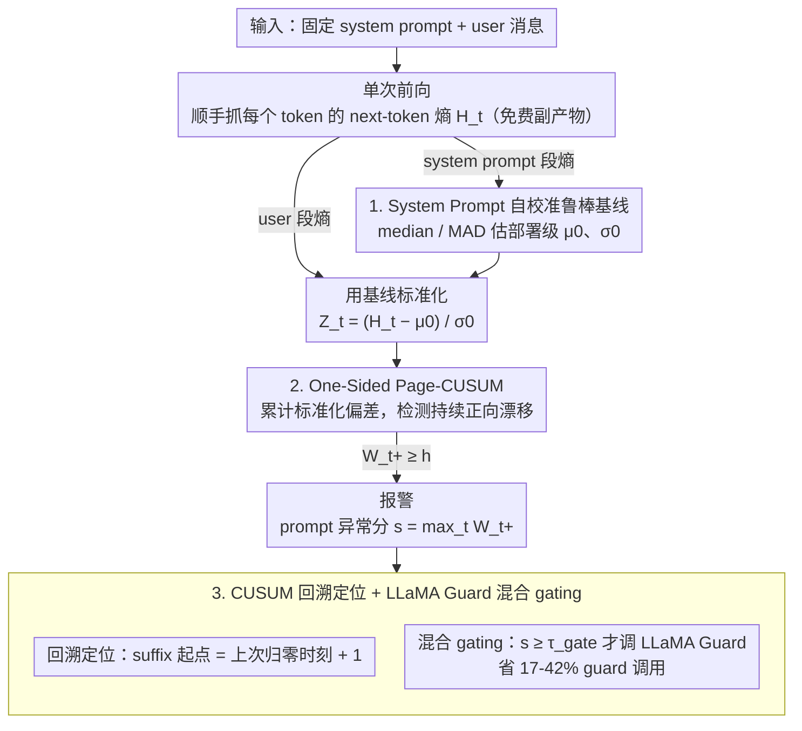

# Detecting Fluent Optimization-Based Adversarial Prompts via Sequential Entropy Changes

**会议**: ICML 2026  
**arXiv**: [2605.19966](https://arxiv.org/abs/2605.19966)  
**代码**: https://github.com/cpdonline/cpdonline (有)  
**领域**: LLM 安全 / 越狱检测 / 在线变点检测  
**关键词**: 对抗后缀, Page-CUSUM, token 熵, 系统提示基线, 越狱定位  

## 一句话总结
作者把"流畅型优化越狱后缀检测"建模成 token-level 熵流上的在线变点检测：用固定系统提示的熵分布算 MAD 鲁棒基线把用户 token 熵标准化，跑一边 Page-CUSUM 累计统计量 $W_t^+$ 越阈值就报警，在 6 个开源对齐 LLM 上对 GCG / AutoDAN / AdvPrompter / BEAST / AutoDAN-HGA 五类攻击都比窗口困惑度 F1 更高，并能把 79.6% 的报警精确定位到 suffix 内部，还能当 LLaMA Guard 的轻量门，节省 17-42% 的 guard 调用。

## 研究背景与动机

**领域现状**：当前面向 LLM 越狱的运行时防御主要分两派——(1) 统计检测器：算 prompt 全局困惑度 (PP) 或滑窗困惑度 (WPP) 当异常分；(2) 安全分类器：用 LLaMA Guard 这类微调过的 LLM 判 unsafe。前者轻量但只看标量统计，后者精度高但要再跑一个 LLM 前向。

**现有痛点**：GCG 之后的新一代攻击 (AutoDAN、AdvPrompter、BEAST、AutoDAN-HGA) 把"低困惑度/流畅"作为显式优化目标，所以全局 PP 在 benign 与 adversarial 之间的 AUROC 在六个模型上塌到 $\pm 0.04$ 围绕 $0.5$ 的区间——再调阈值也没用。WPP 通过窗口最大 NLL 抓局部尖刺好一些，但最优窗口大小 $w$ 强烈依赖模型 (LLaMA-2-7B 要 $w=15$，Vicuna-7B/Qwen2.5-7B 要 $w=1$)，且越大窗口越把 adversarial loss 和 benign 上下文求平均，"边界涂抹"严重，往往报警在 suffix 边界两侧而不是 suffix 内部。

**核心矛盾**：流畅型对抗后缀的特征不是"绝对困惑度高"，而是"在 token 流上持续推高模型不确定性"——这是一个时间维度上的均值漂移，但 PP/WPP 都把序列压成标量或局部均值，丢掉了"漂移持续性"这一关键信号。

**本文目标**：(a) 用一个 model-agnostic、training-free、纯前向旁路的方法在线检测对抗后缀；(b) 同时给出 token-level 的 suffix 起始位置定位 (PP/WPP 都不擅长)；(c) 让它能与 LLaMA Guard 这种昂贵分类器组成 gating 流水线，降低 guard 调用率。

**切入角度**：作者观察到对每个请求中固定的 system prompt，其 token 熵分布在给定部署里是稳定的；而 benign 用户输入的熵分布与之相似，但 optimization-based suffix 会在 user 段引入"持续向上的均值漂移"——这正是 1954 年 Page CUSUM 控制图最擅长的"持续均值漂移的最快在线检测"问题。

**核心 idea**：把 token-level next-token 熵流当一维时间序列，用 system prompt 估出鲁棒基线 $(\hat\mu_0, \hat\sigma_0)$ 把 user 段标准化为 $Z_t$，跑一边 one-sided Page CUSUM $W_t^+$，越阈值 $h$ 就报警；用 CUSUM 的回溯规则还能反推 suffix 起始位置 $\hat\nu$。

## 方法详解

### 整体框架
方法要解决的是"流畅型对抗后缀在 token 流上悄悄推高模型不确定性、但全局困惑度看不出来"这个盲区，整体把它转成一维时间序列上的在线变点检测。每个请求由固定 system prompt $\mathbf{x}^{\text{sys}}$ 和 user 消息 $\mathbf{x}^{\text{usr}}$ 拼成，模型常规前向时顺手把每个 token 位置 next-token 分布 $p_\theta(\cdot|x_{<t})$ 的熵 $H_t = -\sum_v p_\theta(v|x_{<t})\log p_\theta(v|x_{<t})$ 抓出来——这是不花一分钱的副产物。拿到熵流后先用 system prompt 段 $\{H_i^{\text{sys}}\}$ 估一条部署级鲁棒基线，把 user 段 $\{H_t^{\text{usr}}\}$ 标准化成 $Z_t$，再跑一边 Page-CUSUM 累计统计量 $W_t^+$；任意时刻 $W_t^+\geq h$ 就报警，prompt-level 异常分取 $s(\mathbf{x}^{\text{usr}})=\max_t W_t^+$ 供 ROC 评估，同时用 CUSUM 的归零时刻反推 suffix 起点。整条流水线 per-token $O(1)$、per-prompt $O(T)$、内存常数级，可以直接挂在生产推理路径上。

### 关键设计

**1. System Prompt 自校准的鲁棒基线 $(\hat\mu_0,\hat\sigma_0)$：把固定开销变成免费的部署参考样本**

熵的绝对幅度跟模型规模、tokenizer、system prompt 的措辞都强耦合，所以没法用一条跨模型的硬阈值——这正是 WPP 最优窗口大小因模型而异的根因。作者的巧处在于：system prompt 在给定部署里完全固定，它的 $m$ 个 token 熵天然就是一组"无攻击"参考样本，拿来当基线既不用离线训练也不用准备数据集。基线用中位数与 MAD 估鲁棒的位置和尺度：$\hat\mu_0=\mathrm{median}(\{H_i^{\text{sys}}\})$，$\hat\sigma_0=c\cdot\mathrm{median}(|H_i^{\text{sys}}-\hat\mu_0|)$，常数 $c\approx 1.4826$ 把 MAD 校到与 Gaussian-$\sigma$ 一致，再加 $\hat\sigma_0\geq\varepsilon$ 防退化，最后把 user 段标准化成 $Z_t=(H_t^{\text{usr}}-\hat\mu_0)/\hat\sigma_0$。选 MAD 而非均值/方差，是因为 system prompt 里少数特殊词会把个别 token 熵撑得很高，中位数和 MAD 对这种极端值都不敏感；配合 $c$ 校正，LLaMA / Vicuna / Qwen 各家就能共用同一套阈值，这是 CPD 实现 model-agnostic 的关键。

**2. One-Sided Page-CUSUM 检测持续漂移 $W_t^+$：用 1954 年的控制图抓"漂移持续性"**

PP/WPP 的失效在于把序列压成标量或局部均值，丢掉了"不确定性在持续往上爬"这一时间维度信号；而对抗后缀的本质恰恰是 user 段上的一个持续正向均值漂移。Page-CUSUM 经典上就是为"最快检测持续均值漂移"设计的最优顺序检验，所以直接套：在 slack $k\geq 0$、阈值 $h>0$ 下迭代 $W_t^+=\max\{0,\,W_{t-1}^++Z_t-k\}$，$W_0^+=0$，停止时刻 $\tau=\inf\{t\geq 1:W_t^+\geq h\}$。当 $\{Z_t\}$ 均值贴近零时 $W_t^+$ 会反复归零、统计噪声不会无限累积；一旦出现持续正漂，$W_t^+$ 就单调累积直到穿过 $h$。相比窗口检测，它最大的好处是不必预设窗口尺度——攻击 suffix 短则十几 token、长则上百 token，CUSUM 自然适应漂移长度。Slack $k$ 起"抗噪"作用，越大越保守；论文在 $k\in\{-0.5,0,0.5\}$ 上做了敏感性 (Appendix B.3)，$k=-0.5$ 还能再提 F1 但跳出经典区间，所以正文统一用 canonical $k=0$，阈值 $h$ 在每折训练集上 maximize F1 选定。

**3. CUSUM 回溯定位 $\hat\nu$ + LLaMA Guard 混合 gating：把"事件级输出"和"省钱"一起拿到手**

报警之外，CUSUM 还几乎免费送了一个 suffix 定位能力——这是 PP/WPP 完全做不到的。定位用标准回溯：记上一次 $W_t^+=0$ 的 reset 时刻 $t_0$，则起点估计 $\hat\nu=t_0+1$，正好是"自上次熵流静下来之后开始的那个 token"，每次归零都恰好标记了漂移开始前一刻。这个位置信息对"自动剪掉 suffix 再继续运行"或"高亮可疑片段交安全团队审计"都很实用。另一条收益是混合 gating：生产负载里 90%+ 是 benign 请求，没必要每条都跑昂贵的 LLaMA Guard，于是用门控阈值 $\tau_{\text{gate}}$——$s(\mathbf{x}^{\text{usr}})<\tau_{\text{gate}}$ 直接判 benign 跳过 guard，否则才调 LLaMA Guard 做语义判定。CPD 把 guard 从"每条都跑"压到"可疑才跑"，论文实测省下 17-42% 的 guard 调用，且 hybrid F1 不掉。

### 损失函数 / 训练策略
方法 training-free，不做任何梯度更新。唯一的"调参"是阈值 $h$，用 5-fold stratified CV（按 attack family 分层）在训练折上 maximize F1 选出；所有 token 熵直接取自 base LLM 的标准前向，不引入任何额外网络。

## 实验关键数据

### 主实验
$\alpha=1$ 困惑度匹配基准 (1012 对抗 + 1012 benign，5-fold stratified CV)；CPD 用 canonical $k=0$。F1 / AUROC：

| 模型 | PP AUROC | Best WPP F1 / AUROC | CPD F1 / AUROC |
|------|----------|--------------------|----------------|
| LLaMA-2-7B | 0.46 | 0.74 / 0.77 (WPP15) | **0.82 / 0.88** |
| LLaMA-2-13B | 0.49 | 0.74 / 0.78 (WPP10) | **0.80 / 0.87** |
| Vicuna-7B | 0.50 | 0.77 / **0.85** (WPP1) | 0.77 / 0.82 |
| Vicuna-13B | 0.51 | 0.77 / 0.84 (WPP10) | **0.80 / 0.85** |
| Qwen2.5-7B | 0.51 | 0.83 / 0.91 (WPP1) | **0.85 / 0.91** |
| Qwen2.5-14B | 0.50 | 0.80 / 0.85 (WPP10) | **0.85 / 0.91** |

PP AUROC 全部塌在 $0.5$ 附近——构造上的必然，验证了"匹配 PP 后单一 PP 阈值无法区分"。CPD 在 6 个模型 F1 全部领先 (margin +0.001 到 +0.08)，AUROC 在 5 个模型领先或并列，仅 Vicuna-7B 上 per-token max-NLL (WPP1) 因该模型 benign 熵方差小而 AUROC 微胜。

### 消融实验
"信号 × 机制"两轴消融，LLaMA-2-7B 上 $k=0$：

| 机制 | 信号 | F1 | AUROC |
|------|------|----|-------|
| CUSUM | NLL | 0.874 | 0.918 |
| CUSUM | Entropy | 0.818 | 0.878 |
| Window $w=1$ | NLL | 0.734 | 0.783 |
| Window $w=1$ | Entropy | 0.699 | 0.706 |

主要结论是"机制比信号更重要"：换成 CUSUM 不管用 NLL 还是 entropy，F1 都比窗口检测高 ~12-14 个点；NLL+CUSUM 比 entropy+CUSUM 还高 ~6 个 F1，但作者正文用 entropy 是因为它能用 system prompt MAD 自校准基线，NLL 没这个性质。

### 关键发现
- **定位精度碾压**：LLaMA-2-7B 的 F1-optimal 阈值下，CPD 把 79.55% 的报警精确落在 suffix 内部，而 WPP1-WPP20 只有 17-46%；CPD 在 "before+in" (跨边界) 类别完全为 0% (WPP 12.9-37.9%)，benign 误报也最低 (20.45% vs WPP 33.7-45.1%)。这是 Page-CUSUM 的天然优势：每次 $W^+$ 归零都标记了"漂移开始前一刻"。
- **5 类攻击通吃**：GCG (200) + AutoDAN (200) + AdvPrompter (312) + BEAST (100) + AutoDAN-HGA (200) 全部混在一起评估，CPD 在所有六个 base LLM 上都拿到最佳或第二好的 F1，说明"持续熵漂移"是优化型对抗后缀的共性特征，而非某一攻击家族的伪影。
- **混合 gating 实用价值高**：在 17,297 条、4.2% 攻击占比的不平衡部署流上，CPD 当 LG1 的门可在保持 hybrid F1 = 0.82 的同时节省 42.2% guard 调用；当 LG2 的门保持 F1 = 0.73 节省 33.8%——同 F1 下 WPP 只能省 13-18%。这直接对应生产部署中"少跑一半 LLaMA Guard 前向"的真金白银。

## 亮点与洞察
- **用经典控制图打深度学习的攻击**：把 1954 年 Page-CUSUM 直接套到 LLM token 熵流上，方法本身没有任何深度学习痕迹，但效果反而比 ad-hoc 的窗口启发式好——这提醒我们经典 sequential analysis 工具在 LLM 时代被严重低估，凡是"持续偏移"性质的攻击 (deceptive alignment、context poisoning、long-horizon manipulation) 都值得用 CUSUM/EWMA 这类工具复盘。
- **System prompt 既是负担也是礼物**：业界普遍把 system prompt 当"非用户输入的固定开销"，作者反过来把它当"免费的部署自校准样本"，思路极漂亮——任何依赖"模型在该部署下的正常行为分布"的运行时检测器都可以借鉴。
- **检测 + 定位一体化**：CUSUM 回溯反推 $\hat\nu$ 是几乎零额外成本的副产品，但下游收益巨大 (suffix 自动修剪、安全审计可解释性、attack 取证)；这是单纯 prompt-level 分类器 (LLaMA Guard) 完全做不到的，提示新一代防御应该把"事件级"输出当一等公民。

## 局限与展望
- 只针对**追加式 suffix**：方法假设攻击是在用户基础任务后追加 token 序列；对"persuasive rewriting"型越狱 (Zeng et al., 2024 重写整条 user request) 不适用，因为没有"漂移前的基线段"可参照。
- 依赖 system prompt 的稳定性：若部署允许动态 system prompt 或多轮对话累计 system context，每次都重算 $(\hat\mu_0, \hat\sigma_0)$ 既增加开销也可能不稳；多轮场景下的基线估计是个开放问题。
- **熵 vs NLL 信号选择**有理论 trade-off 未深究：消融显示 NLL+CUSUM 比 entropy+CUSUM 高 6 个 F1，但 NLL 没法用 system prompt 自校准 (NLL 需要 ground-truth token)；未来或许可以把 system prompt 熵基线扩到一种 NLL 代理，把两者优势结合。
- 阈值 $h$ 虽然只是一个标量，但仍需在每折 train 上 sweep 调优；在没有标注 attack 样本的真实部署里如何无监督/弱监督定 $h$ 是落地的核心难点。
- 评测只覆盖 base LLM 自身的检测，没考虑加了 system-level prompt-injection mitigation 后的二阶 attack；自适应攻击者若知道 CPD 存在，可以专门优化 suffix 来抑制 $Z_t$ (例如限制熵增)，这种"CPD-aware GCG"是一个明显的下一步。

## 相关工作与启发
- **vs PP / WPP (Jain et al. 2023, Alon-Kamfonas 2023)**：PP/WPP 是"标量异常分 + 阈值"，假设 adversarial 必然 perplexity 高；CPD 用"序列均值漂移"，对流畅攻击鲁棒，且 mechanism 消融显示即使把信号换成 NLL，机制差异 (CUSUM vs Window) 才是主导。
- **vs LLaMA Guard (Inan et al. 2023)**：Guard 是 supervised 分类器，强但贵；CPD 互补做轻量 gate，论文用 hybrid 流水线明确把"轻量统计 + 重量语义"的两层防御范式落地。
- **vs SPD (Candogan et al. 2025)**：附录 B.5 做了同流水线对比；CPD 优势在 online 性 + 完全 training-free。
- **vs 安全微调 / RLHF**：这些是"训练时防御"，CPD 是"推理时防御"，两者正交可叠加；CPD 的独立价值在于：即使对齐被绕开 (guard-targeted GCG 把 LG1 recall 从典型 .9+ 拉到 .85)，CPD 仍能从熵流捕获到攻击。

## 评分
- 新颖性: ⭐⭐⭐⭐ 用 Page-CUSUM 做 LLM 越狱检测在已发表工作里是首次正式提出，且方法和经典 sequential analysis 的接合点找得很准。
- 实验充分度: ⭐⭐⭐⭐⭐ 6 base LLM × 5 attack family × 1012+1012 prompts + 5-fold CV + 困惑度匹配 + 信号-机制消融 + 17297-prompt 不平衡部署 + LOAO OOD + slack-$k$ 敏感性，覆盖广度和严谨度都很到位。
- 写作质量: ⭐⭐⭐⭐ Method 推导紧凑，定位实验和 hybrid gating 把"为什么这个方法不只是 +0.05 F1"讲得很清楚；附录组织规范。
- 价值: ⭐⭐⭐⭐⭐ 完全 training-free、$O(T)$ 在线、可与现有 guard 流水线无缝叠加并降 30%+ guard 调用，是少有的"研究→生产"路径短到几乎为零的工作。

<!-- RELATED:START -->

## 相关论文

- [\[ICML 2026\] Toward Understanding Adversarial Distillation: Why Robust Teachers Fail](toward_understanding_adversarial_distillation_why_robust_teachers_fail.md)
- [\[ICML 2026\] Entropy-Aware On-Policy Distillation of Language Models](entropy-aware_on-policy_distillation_of_language_models.md)
- [\[ICML 2026\] Efficient Learned Image Compression without Entropy Coding](efficient_learned_image_compression_without_entropy_coding.md)
- [\[ICML 2026\] Float8@2bits: Entropy Coding Enables Data-Free Model Compression](float82bits_entropy_coding_enables_data-free_model_compression.md)
- [\[CVPR 2026\] Adversarial Concept Distillation for One-Step Diffusion Personalization](../../CVPR2026/model_compression/adversarial_concept_distillation_for_one-step_diffusion_personalization.md)

<!-- RELATED:END -->
