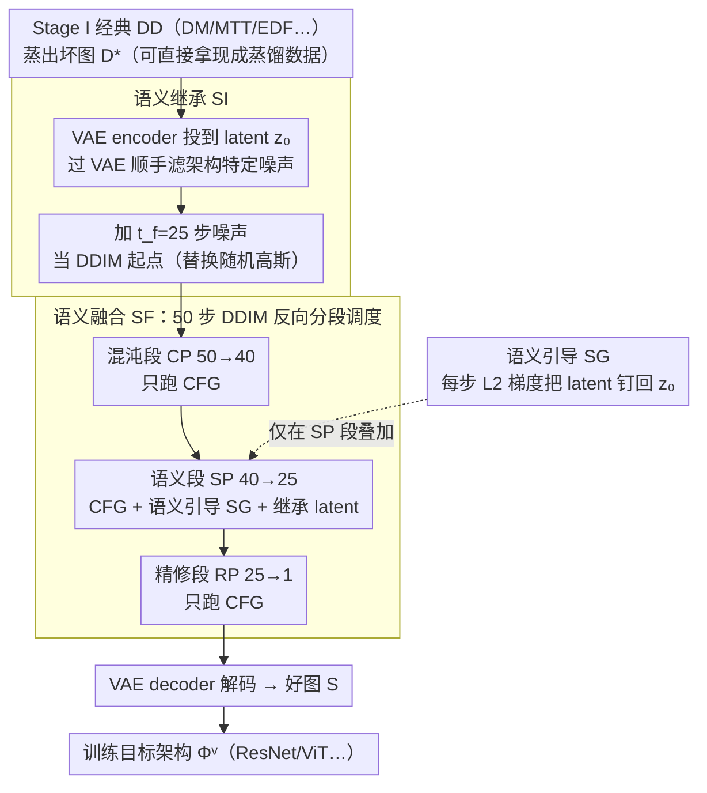

# DIVER: Diving Deeper into Distilled Data via Expressive Semantic Recovery

**会议**: ICML 2026  
**arXiv**: [2605.12649](https://arxiv.org/abs/2605.12649)  
**代码**: 待确认  
**领域**: 模型压缩 / 数据集蒸馏  
**关键词**: 数据集蒸馏、扩散模型先验、跨架构泛化、语义恢复、双阶段蒸馏

## 一句话总结
DIVER 把经典数据集蒸馏 (DD) 从"单阶段直接评估"改造成"先蒸馏再用预训练扩散模型救活语义"的双阶段范式，通过语义继承、语义引导、语义融合三步从 ConvNet 蒸馏出来的"乱码"图像中恢复被压抑的高层语义，让同一份蒸馏数据在 ResNet18/ViT 等异构架构上的精度普遍提升 3–10 个百分点，每张图只要 2.48s 和 4GB 显存。

## 研究背景与动机

**领域现状**：数据集蒸馏 (Dataset Distillation, DD) 把上百万张训练图压缩成几十到几千张"合成代理样本"，使在代理集上训出的模型性能接近原集。主流路线是双层优化：内层在某个固定代理结构 $\varPhi^p$ (通常是小 ConvNet) 上评估分类损失，外层在像素空间按梯度匹配 / 分布匹配 / 轨迹匹配等准则直接更新合成图。

**现有痛点**：像素空间双层优化让合成图深度过拟合 $\varPhi^p$ 的特有低频/高频模式，结果就是图像看上去抽象、嘈杂、毫无真实感。把这样的代理集换到 ResNet18、ShuffleNet、ViT 上训练，精度会大幅崩塌——文中 Tab. 1 显示，经典 DM/MTT/EDF 在 ImageNet 子集上的跨架构精度甚至比直接随机选图还差（如 ImageFruit IPC=1：MTT 15.4% vs Random 14.1% 仅高 1.3 个点，IPC=10 反而 18.9% < 19.6%）。

**核心矛盾**：蒸馏精度 (在 $\varPhi^p$ 上) 与跨架构泛化能力 (在异构 $\varPhi^v$ 上) 之间存在结构性 trade-off——优化目标是 $\Phi^p$ 的损失，但实际部署用 $\Phi^v$，前者收敛到的"特定模式最优解"不是后者意义下的全局最优。表现为：图像里既包含"对 ConvNet 有用但对 ViT 是噪声"的高频纹理，也丢失了应有的语义清晰度。

**本文目标**：在不重新跑 DD、不接触原始数据集、不重新训扩散模型的前提下，把已经蒸出来的"坏图" $\mathcal{D}^*$ 二次精炼成"好图" $\mathcal{S}$，使其同时满足三件事：(1) 保留 $\mathcal{D}^*$ 里隐含的数据集级语义；(2) 滤掉对架构敏感的"噪声"模式；(3) 看起来真实、有清晰类别属性。

**切入角度**：作者断言扩散模型 (尤其是预训练 DiT) 天然就是一个"自然图像流形投影器"，把抽象的蒸馏图作为 latent 初始化喂给 reverse process，扩散过程自己就会把图像往真实分布上拽；同时神经网络的层次化特征提取规律 (浅层抓纹理边缘、深层抓语义) 暗示：VAE encoder 投到 latent 空间这一步本身就在过滤架构相关噪声。

**核心 idea**：把"蒸图"用 VAE 编进 latent → 加适量噪声当 DDIM 起点 → 让扩散过程在中段同时用蒸图 latent 做"忠诚度引导"和用类别标签做条件引导，恢复出兼具语义清晰度与原始数据集知识的合成图，作为可热插拔的 plugin 接到任何已有 DD 方法之后。

## 方法详解

### 整体框架
DIVER 把原始 DD 问题正式拆成 DD + DDD 两个解耦阶段：Stage I 完全沿用任意经典 DD 算法 (DM / DC / MTT / NCFM / EDF / SRe²L / G-VBSM 都行) 在 ConvNet 上蒸出"坏图" $\mathcal{D}^*=\{(\tilde x_i, \tilde y_i)\}$（这一步甚至可以跳过，直接拿别人发布的蒸馏数据进 Stage II）；Stage II (DDD, Diving into Distilled Data) 才是 DIVER 的真正贡献——固定一个预训练 guided diffusion 模型 (主用 DiT-XL/2 + vae-ft-mse，256×256 ImageNet 训过)，把每张蒸图当 latent 起点喂给 DDIM 反向过程，在采样中段同时用蒸图 latent 做忠诚度引导、用类别标签做条件引导，恢复出"好图" $\mathcal{S}=\mathcal{H}_{\mathcal{D}^*}(\tilde x)$ 再去训目标架构 $\varPhi^v$。

具体到一张图的流程：先用 VAE encoder 投到 latent $\tilde x \xrightarrow{\mathcal{E}} z_0$，加 $t_f=25$ 步噪声得到 $z_{t_f}$，以 $\hat z_{t_r}=z_{t_f}$ 初始化 50 步 DDIM 反向过程，其中混沌段 / 精修段只跑 CFG、语义段 $[t_h, t_l]=[40, 25]$ 额外叠加语义引导，最后 $\hat z_0 \xrightarrow{\mathcal{F}}$ 解码出合成图。形式化目标是 $\mathcal{S}^* = \arg\min_{\mathcal{S}} \mathcal{M}(\varPhi^v_\mathcal{O}(x), \varPhi^v_\mathcal{S}(\mathcal{H}_{\mathcal{D}^*}(\tilde x)))$，且 $|\mathcal{S}|=|\mathcal{D}|\ll|\mathcal{O}|$。整个 Stage II 完全 training-free、不访问原集 $\mathcal{O}$、对代理结构 $\varPhi^p$ 不可见，是真正的可热插拔 plug-in 后处理。

### 关键设计

**1. 语义继承 SI：把蒸图当扩散起点而不是噪声**

经典 DD 蒸出的图里，有用的数据集级语义和"只对 ConvNet 有用、对 ViT 是噪声"的架构特定模式是耦合在一起的，二者难以分离。SI 的做法是用预训练 VAE 把蒸图投到 latent $z_0$，加 $t_f$ 步噪声 $z_{t_f}=\sqrt{\alpha_{t_f}}z_0+\sqrt{1-\alpha_{t_f}}\epsilon$，再以 $\hat z_{t_r}=z_{t_f}$ 替换 DDIM 默认的随机高斯起点——相当于让蒸图"以 latent 形式"参与扩散，而不是从纯噪声凭空生成。它之所以能顺手滤噪，依赖一个经验观察：CNN 浅层学纹理边缘等低层模式、深层学语义，而 VAE encoder 训练时被自然图像分布约束，对"非自然的架构特定噪声"视为低收益高代价信号、倾向于在压缩时丢弃 (Tab. 8 与附录 Fig. 7 的可视化都印证了这点)，所以"过一遍 VAE"本身就完成了"滤噪声、留语义"。这里 $t_f$ 是关键 trade-off：太大则 latent 被高斯先验主导、语义全丢，太小则偏离扩散假设的高斯分布、采样质量崩，Fig. 4 中段消融显示 $t_f=25$ 是甜点。相比之下，从纯高斯起步的 latent 编辑 (如 SDEdit) 注入不了数据集级语义，直接在像素空间去噪 (如 GAN inversion) 又留不住扩散过程的全局一致性，SI 恰好绕开这两个问题。

**2. 语义引导 SG：拒绝采样过程漂离蒸图原意**

光有 SI 还不够——CFG 在反向过程里不断注入类别条件 $c$，会把 latent 持续推向"该类的平均图像"，原蒸图里那些类别均值之外的判别性信息会被一点点洗掉。SG 在反向去噪的每一步给 latent 加一个把 $\hat z_t$ 拉回 $z_0$ 的梯度，把 DDIM 更新改成 $\hat z_{t-1}=s(\hat z_t,t,\epsilon_\theta)-\gamma\nabla_{\hat z_t}\mathcal{G}_t(\hat z_t)$，引导函数取 L2 形式 $\mathcal{G}_t=(\hat z_t-z_0)^2\cdot\sigma_t/2$，缩放因子 $\gamma=0.1$ (NCFM 用 0.02)。直观上就是用 L2 距离把当前 latent 钉在 $z_0$ 附近，让"标签语义"和"原始蒸图语义"两股力量平衡共存。为了把开销压到极致，作者把梯度 $\nabla\mathcal{G}_t$ 直接近似成 $(\hat z_t-z_0)\sigma_t$，彻底省掉反传，使总采样时间从纯 DiT 的 2.41s/张只涨到 2.48s/张。$\gamma$ 同样存在最优区间：Fig. 4 左侧消融显示它过小则 SG 退化回 CFG 模式、过大则采样过度依赖蒸图把 label 信号淹没。

**3. 语义融合 SF：把引导只用在"语义形成"那一段**

SG 若全程都开，会在早期引入伪影、在晚期拉低真实感，因为扩散采样的不同时段承担不同功能。SF 借鉴扩散三阶段理论 (Yu et al., 2023a; Chen et al., 2025)，把 50 步 DDIM 反向过程切成混沌阶段 CP ($t_r\sim t_h=50\to 40$，还在"想画啥"层面、噪声主导)、语义阶段 SP ($t_h\sim t_l=40\to 25$，决定语义内容)、精修阶段 RP ($t_l\sim 1=25\to 1$，补细节高频)，只在 SP 段同时叠加 SG + CFG + 继承 latent，CP 和 RP 则只跑 CFG。这样既在语义真正形成的窗口里保住了对蒸图的忠诚度，又不污染早期混沌噪声采样和晚期细节锐化 (论文 Fig. 5 右侧可视化对比)。效果上，Tab. 6 中 SI+SG (无 SF) 在 ImageFruit MTT 上是 21.1% / 28.3% (IPC=1/10)，加上 SF 后涨到 22.3% / 29.8%。

### 损失函数 / 训练策略
DIVER Stage II **完全 training-free**：扩散模型和 VAE 都是冻结的预训练权重 (DiT-XL/2 + vae-ft-mse)，没有任何微调或额外训练。整个 pipeline 只有三个超参——$t_f=25$、$[t_h, t_l]=[40, 25]$、$\gamma=0.1$ (NCFM 上 0.02)，DDIM 50 步 CFG。下游训练目标架构 $\varPhi^v$ 时遵循各原 DD 方法的 hard-label / soft-label 协议 (ImageNet-1K 用 KL 散度软标签，其余用硬标签)，DIVER 不改动这部分。

## 实验关键数据

### 主实验

数据集：ImageNet-1K (224×224) + 12 个 ImageNet 子集 (ImageFruit/Woof/Meow/Squawk/Nette/Yellow/A~E/IDC, 128×128)，所有图被 resize 到 256×256 喂 DiT。被增强的基线覆盖三大流派：经典像素优化 (DM/MTT/EDF/NCFM)、双时刻匹配 (SRe²L/G-VBSM)、扩散原生 (Minimax/D⁴M/MGD³)。代理结构 $\varPhi^p$=ConvNet，评估架构 $\varPhi^v$ = ResNet18 / ShuffleNet-V2 / MobileNet-V2 / EfficientNet-B0 / ViT-b/16，平均 5 trials。

| 配置 (ImageFruit) | IPC=1 | IPC=10 | 提升来源 |
|---|---|---|---|
| MTT (baseline) | 15.4 ± 1.6 | 18.9 ± 1.4 | 像素空间轨迹匹配 |
| MTT + DIVER | **22.3 ± 1.8** | **29.8 ± 2.0** | +6.9 / +10.9 |
| EDF (baseline) | 16.2 ± 1.8 | 23.2 ± 2.1 | SOTA 像素方法 |
| EDF + DIVER | **20.3 ± 1.9** | **34.5 ± 2.3** | +4.1 / +11.3 |
| DM | 11.3 ± 1.4 | 19.3 ± 1.5 | 分布匹配 |
| DM + DIVER | **18.5 ± 1.9** | **22.4 ± 1.8** | +7.2 / +3.1 |
| NCFM | 17.1 ± 1.6 | 20.5 ± 2.5 | 当前 SOTA |
| NCFM + DIVER | **18.8 ± 1.7** | **25.5 ± 1.6** | +1.7 / +5.0 |

跨架构泛化 (Tab. 2, ImageA, DC + DIVER 在 IPC=1)：从 DC 的 24.9% 提到 30%+；GLaD 在多个子集上也被全面超过。在 ImageNet-1K 全集 (Tab. 4)，DIVER 作为 plugin 接到 Minimax 微调的 MGD³ 上，ResNet-18 IPC=10 精度进一步刷新 SOTA。

效率 (附录)：单张 RTX-4090，每张合成图 2.48s + 4.02 GB 显存，与原始 DiT (2.41s) 几乎持平。

### 消融实验 (Tab. 6, ImageFruit + MTT)

| 配置 | IPC=1 | IPC=10 | 说明 |
|---|---|---|---|
| Random (无 DD 无 DIVER) | 14.1 ± 1.4 | 19.6 ± 1.8 | 随机选图基线 |
| DD only (MTT) | 15.4 ± 1.6 | 18.9 ± 1.4 | 经典 DD，IPC=10 时甚至输给 random |
| Random* + 全 DIVER | 14.6 ± 1.8 | 21.7 ± 1.6 | 证明 DIVER 不是"靠 DiT 自带先验" |
| MTT + raw DiT (无 SI/SG/SF) | 17.8 ± 1.2 | 23.4 ± 1.3 | 单纯过 DiT 也能涨 |
| MTT + SI only | 19.5 ± 1.4 | 26.2 ± 1.5 | SI 单独 +4.1 / +7.3 |
| MTT + SG only | 20.4 ± 1.7 | 27.8 ± 1.9 | SG 单独贡献最大 |
| MTT + SI + SG | 21.1 ± 1.9 | 28.3 ± 1.6 | SI+SG 出现饱和 |
| MTT + SI + SG + SF (full) | **22.3 ± 1.8** | **29.8 ± 2.0** | SF 再 +1.2 / +1.5 |

### 关键发现
- **SG 是单点贡献最大的模块**：移除 SG 比移除 SI 掉点更多，说明"用 L2 把 latent 钉回蒸图"比"用 VAE 滤噪声"对跨架构泛化的边际效益更高，呼应了"蒸图里其实存着数据集级语义"的核心论点。
- **Random* 实验是诚意杀手锏**：把蒸图换成随机选的原图喂进 DIVER，IPC=10 只能拿到 21.7%，输给纯 DiT 的 23.4%，证明 DIVER 的提升真来自蒸图里的"压缩语义"，不是 DiT 先验白送。
- **结构化 trade-off**：Tab. 8 显示 DIVER 合成图在 ConvNet (原代理) 上的精度反而下降，但在异构架构上大涨——这正面承认"蒸图过拟合 ConvNet"假说，并说明 DIVER 用"放弃 ConvNet 上几个点"换"异构架构上 5–10 个点"是有意识的策略。
- **跨扩散模型鲁棒**：SD-V1.5 / DiT / SiT 都能上 DIVER；SD-V1.5 增益偏小被归因于 U-Net vs Transformer 架构差异与非 ImageNet 预训练，反证 DIVER 不靠"数据泄漏"。
- **$t_f=25$、$\gamma\approx 0.1$ 是普适甜点**，参数曲线均呈倒 U 形。

## 亮点与洞察
- **重新定义 DD 问题为 DD + DDD 两阶段**——这是一次范式级的解耦：作者明确指出经典 DD 公式 (Eqn. 2) 在 $\varPhi^p$ 上求解但在 $\varPhi^v$ 上评估，本身就是有偏的，于是单独定义 DDD 任务 (Eqn. 6) 来弥合这一 gap。这种"承认现有目标函数有原罪并打补丁"的思路比"再设计一个新匹配损失"更有结构性。
- **把蒸图当 latent 起点而非生成目标**——这是 DIVER 区别于 D⁴M / MGD³ / Minimax 等扩散原生 DD 方法的根本：后者直接抛弃经典 DD 转向 coreset selection 或重新训扩散，DIVER 反过来"救活"了经典 DD 海量已有的蒸馏数据集，相当于一个免训练的 universal upgrader，工程价值极高。
- **三阶段引导调度是可迁移的设计模式**——SF 把"何时引导"作为可设计维度的思路 (CP 不引导、SP 强引导、RP 不引导)，可以直接搬到图像编辑 / 风格化 / 条件生成等任何需要平衡条件信号与采样自由度的场景。
- **零梯度近似 + latent 空间引导**让计算几乎免费——把 $\nabla \mathcal{G}_t$ 直接写成 $(\hat z_t-z_0)\sigma_t$ 是个非常实用的工程 trick，是 DIVER 能宣称"2.48s/张、4GB"的关键。

## 局限与展望
- 作者承认：方法严重依赖原始蒸馏图的质量——若 Stage I 蒸出的图过烂、缺类别可识别性，Stage II 也救不回来 (Tab. 6 Random* 一行已暗示这点)。
- 扩散基座目前只在 DiT/SiT/SD-V1.5 上验证，未与更现代的 flow matching / consistency model 集成。
- 个人补充局限：(1) 评估几乎全在 ImageNet 系，未验证医学图像、遥感、艺术图像等 OOD 域；(2) DiT-XL/2 本身就在 ImageNet 训过，"训练数据重叠"对结果的污染程度作者只在 SD-V1.5 上间接反驳，没有彻底的因果证据；(3) 256×256 必须 resize 制约了高分辨率小数据集场景；(4) 三个超参 ($t_f, t_h, t_l, \gamma$) 虽不多但对跨数据集是否需要重调没系统研究。
- 改进思路：把 SG 改成可学习 (e.g. 用蒸图本身做对比学习目标)、把 SF 三阶段切分从固定阈值改成自适应 (用 latent norm / FID 动态判断)、与 latent consistency model 结合把 50 步压到几步进一步降时。

## 相关工作与启发
- **vs GLaD (Cazenavette et al., 2023)**：GLaD 在 GAN latent 空间做 DD 内层匹配，仍是单阶段且要重做昂贵的内循环；DIVER 是双阶段且 training-free，且复用任意已有 DD 输出。
- **vs Minimax / D⁴M / MGD³ (扩散原生 DD)**：它们抛弃经典 DD 直接用扩散从原集生成代理样本，本质回到 coreset selection 路线；DIVER 反其道而行——把扩散当作"经典 DD 的后处理修复器"，承认双方互补并把它们组合起来 (Tab. 4 显示 DIVER + MGD³ 还能再涨)。
- **vs SDEdit / latent 编辑类方法**：它们以"原始自然图"为编辑起点修局部属性，DIVER 以"非自然蒸图"为起点做"语义恢复"，目标和起点都不同；SG 损失 $(\hat z_t-z_0)^2$ 形式上像 SDEdit 的轨迹约束，但作用对象 (蒸图 vs 自然图) 决定了语义截然不同。
- **启发**：在任何"用代理目标蒸馏出来的中间产物上做后处理修复"的场景 (如知识蒸馏的 logits 修复、prompt 蒸馏的 token 修复、神经网络剪枝后的权重修复)，"过一个被自然分布约束的预训练模型 + 段式条件引导"都可能是一条通用的修复范式。

## 评分
- 新颖性: ⭐⭐⭐⭐ 双阶段解耦 + DDD 任务定义在概念层面有突破，但 SI/SG/SF 单个组件都借鉴自 LDM/SDEdit/扩散三阶段先验
- 实验充分度: ⭐⭐⭐⭐ 横跨 6 个 DD 基线 × 12 个数据集 × 5 个架构 × 多 IPC 设置，加上 Random* 等诚意消融，覆盖面非常扎实
- 写作质量: ⭐⭐⭐⭐ 问题动机讲得清晰，DD/DDD 形式化定义到位；Method 章节符号略密但 Fig. 2/3 帮助很大
- 价值: ⭐⭐⭐⭐⭐ 作为 plugin 不需要重新训练就能救活整个经典 DD 生态，工程落地价值极高，且为"扩散先验 + 蒸馏数据"的组合开了一条清晰路线

<!-- RELATED:START -->

## 相关论文

- [\[ICML 2026\] Mind Your Margin and Boundary: Are Your Distilled Datasets Truly Robust?](mind_your_margin_and_boundary_are_your_distilled_datasets_truly_robust.md)
- [\[ICML 2026\] IDLM: Inverse-distilled Diffusion Language Models](idlm_inverse-distilled_diffusion_language_models.md)
- [\[ICLR 2026\] PASER: Post-Training Data Selection for Efficient Pruned Large Language Model Recovery](../../ICLR2026/model_compression/paser_post-training_data_selection_for_efficient_pruned_large_language_model_rec.md)
- [\[ICML 2026\] Hard Labels In! Rethinking the Role of Hard Labels in Mitigating Local Semantic Drift](hard_labels_in_rethinking_the_role_of_hard_labels_in_mitigating_local_semantic_d.md)
- [\[ICLR 2026\] A Recovery Guarantee for Sparse Neural Networks](../../ICLR2026/model_compression/a_recovery_guarantee_for_sparse_neural_networks.md)

<!-- RELATED:END -->
