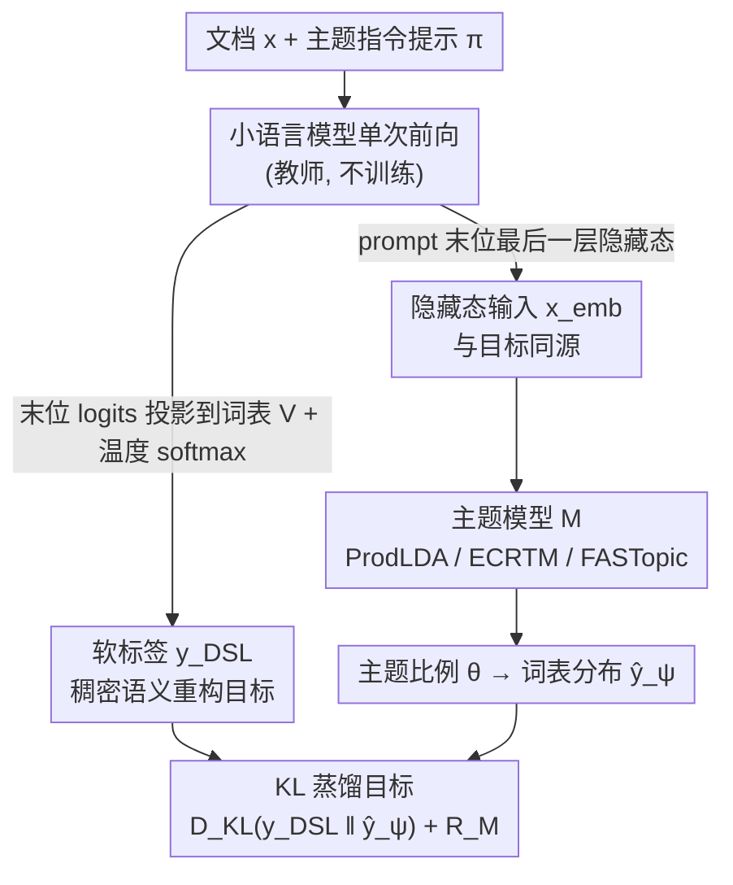

# DSL-Topic: Improving Topic Modeling by Distilling Soft Labels from Language Models

**会议**: ICML 2026  
**arXiv**: [2602.17907](https://arxiv.org/abs/2602.17907)  
**代码**: https://github.com/raymondzmc/dsl-topic-models (有)  
**领域**: NLP 理解 / 主题建模 / 知识蒸馏  
**关键词**: 神经主题模型, 软标签蒸馏, 小语言模型, KL 重构目标, 隐式贝叶斯推断  

## 一句话总结
作者用小语言模型在"给文档生成一个主题词"提示下产生的下一 token 概率投影到主题模型词表，作为 dense 软标签替换传统的 BoW 重构目标来训练神经主题模型 (ProdLDA / ECRTM / FASTopic)，在 20NewsGroup、TweetTopic、StackOverflow 三个数据集上把分配纯度 (Purity) 拉高一大截，并给出"把 LM 隐式后验预测投影到结构化主题家族"的贝叶斯解释。

## 研究背景与动机

**领域现状**：神经主题模型主流是 LDA-VAE 流派 (ProdLDA、ETM、CombinedTM、ZeroshotTM)，先把文档编码成连续潜变量 $\theta$，再通过 BoW 重构损失反推主题–词分布；新一些的 ECRTM 加 embedding 聚类正则、FASTopic 用最优传输把文档/主题/词对齐到同一嵌入空间。

**现有痛点**：BoW 目标只能把概率质量打到"文档里出现过的词"上，完全忽略上下文与组合语义；在 TweetTopic、StackOverflow 这种短文本上共现信号稀疏到几乎学不出连贯主题 (论文中 LDA 在 StackOverflow 的 Purity 仅 .174，ProdLDA 也只有 .265)。

**核心矛盾**：直接拿 LLM 做主题建模 (TopicGPT、Prompt-based) 又丢掉了概率框架——主题被表示成自然语言、文档分配是硬决策，无法刻画主题不确定性，而且 LLM 上下文窗口装不下大语料。"概率主题模型的结构化优势"和"LLM 的语义先验"必须二选一。

**本文目标**：保留 VAE 主题模型的概率结构，同时让重构目标承载 LM 编码的语义/主题信息，并且不引入额外的训练阶段、不依赖大模型生成。

**切入角度**：作者注意到，如果在 prompt 里要求 LM "Generate a single word label capturing the document theme"，那么紧跟 prompt 之后那一步的 next-token logits 在词表上的分布，本身就是一个关于"主题相关词"的语义稠密分布——它对没出现过但主题相关的词也能赋概率 (Figure 1 中关于宗教辩论的文档把概率打到了未出现的宗教词上)。

**核心 idea**：把这个 LM-induced 的 prompt-conditioned next-token 分布投影到主题模型词表 $V$，再 softmax 出软标签 $y_{DSL}$，用 KL 散度训练任意 vocab-reconstruction 类主题模型去拟合 $y_{DSL}$，等价于把 LM 的隐式贝叶斯后验预测蒸馏进结构化主题家族。

## 方法详解

### 整体框架
这篇论文想在不改主题模型结构、不引入额外训练阶段的前提下，把小语言模型的语义先验灌进神经主题模型的训练里。做法是给同一篇文档 $x$ 配一条固定的主题指令提示 $\pi$，让小语言模型单次前向同时吐出两样东西：一个稠密的"软标签"当训练目标，一个隐藏态当输入表示。具体地，紧跟 prompt 之后那一步的 next-token logits 投影到主题词表 $V$ 上、温度 softmax 得到软标签 $y_{DSL}$，而 prompt 末位置的最后一层隐藏态 $x_{emb} = h_{LM}(x,\pi)$ 直接喂给主题模型 $\mathcal{M}$ (ProdLDA / ECRTM / FASTopic) 推主题比例 $\theta$、输出词表分布 $\hat{y}_\psi(x)$。训练时只把原来的 BoW 重构项换成 $D_{KL}(y_{DSL} \| \hat{y}_\psi)$，模型自带的正则 $\mathcal{R}_{\mathcal{M}}$ 一律保留。整条流水线不训练 LM，软标签可一次性预计算后离线复用。

### 关键设计

**1. Prompt-Conditioned 软目标 $y_{DSL}$：用 LM 的 next-token 分布顶替词频重构目标**

传统 BoW 目标只能把概率质量打到文档里真出现过的词上，短文本共现稀疏时主题模型常学到一堆停用词残渣。作者注意到，只要在 prompt 里要求 LM "给文档生成一个主题词"，紧跟其后那一步的下一 token 分布本身就是一个关于"主题相关词"的稠密语义分布——它对宗教辩论文档里没出现但相关的 god/atheist/believer 同样赋概率。于是先按标准主题模型流程从语料切出 $|V|=2000$ 高频词词表 (并限制到 LM tokenizer 下能用单 token 表示的词，覆盖率 98%)，拼好 `<system, x, π>` 跑一次 LM 前向，取末位置 logits 中落在 $V$ 内的子向量 $\ell_V(x,\pi) \in \mathbb{R}^{|V|}$，按 $y_{DSL}(x,\pi) = \mathrm{softmax}(\ell_V(x,\pi) / \tau)$ ($\tau=3$) 生成软标签。和 BoW 只在出现过的词非零相比，$y_{DSL}$ 把 LM 大语料预训练得到的语义先验当作免费的语义增强重构目标，相当于不花额外算力就把"哪些词主题相关"的知识灌进了主题模型。

**2. Hidden State 输入 $x_{emb}$：让输入和目标处在同一语义空间**

如果输入仍是 BoW，模型还得额外做"从词袋反推 LM 主题"的推断，蒸馏任务就被掺了杂质。作者改用 LM 自己的隐藏态：对自回归 LM，prompt 末位置的隐藏态正是要被 LM head 投成 next-token logits 的那一向量，所以 $x_{emb}$ 与 $y_{DSL}$ 天然位于同一个"投影前"的语义空间，输入和目标本就同源。主题模型这边只需把原本吃 BoW/SBERT 的 encoder 输入接口替换掉，ProdLDA/ECRTM/FASTopic 的内部结构一点不动。这样 KL 蒸馏就能专心只做一件事：把 LM 的实数语义空间投影到主题模型那套结构化的词表分布上。

**3. KL 蒸馏目标与模型无关插拔：一套目标同时增强三类主题模型骨干**

把 BoW-NLL 重构项换成 KL 蒸馏项后，通用训练目标写成

$$\mathcal{L}_{DSL}(x) = \lambda \, D_{KL}(y_{DSL}(x,\pi) \,\|\, \hat{y}_\psi(x)) + \mathcal{R}_{\mathcal{M}}(x;\psi)$$

其中 $\mathcal{R}_{\mathcal{M}}$ 保留各模型固有正则：ProdLDA 是 logistic-normal 先验 KL，ECRTM 是嵌入聚类项，FASTopic 是最优传输项。因为 KL 的数值幅度相对这些正则项偏小，论文用 $\lambda = 10^3$ 把它拉到同量级。这套即插即用之所以成立，有个贝叶斯解释支撑：prompt-conditioned 输入下的 LM 可看作对潜在概念 $c$ 的隐式贝叶斯预测器 $y_{DSL}(v|x,\pi) \approx \int p_{LM}(v|c)\, p_{LM}(c|x,\pi) \, dc$，而主题模型则是把这个隐式后验预测投影进一个低维主题瓶颈表示的结构化假设家族 $\mathcal{P}_{\mathcal{M}}(x_{emb}) \subseteq \Delta^{|V|-1}$。正因为目标和结构正交，同一套 DSL 才能在 3 主题模型 × 5 SLM 教师的网格上对 VAE 流派、嵌入聚类流派、最优传输流派都拿到收益。

### 损失函数 / 训练策略
完整目标见上式；超参 $\tau=3$、$\lambda=10^3$ 在三个数据集上保持一致，没做逐数据集 tuning。教师 LM 用 ERNIE-4.5-0.3B、Qwen3.5-0.8B、Llama-3.2-1B、Phi-3-mini、Llama-3.1-8B 这五个 instruction-tuned SLM，软标签离线一次性计算并缓存，主题模型训练阶段不再走 LM 前向。

## 实验关键数据

### 主实验
3 数据集 × 4 主题数 ($K=25,50,75,100$) × 5 seeds 的均值。下面节选 Purity 维度上的代表对比 (越高越好)：

| 数据集 | LDA | ProdLDA | CombinedTM | BERTopic | ProdLDA + DSL (Qwen3.5-0.8B) | ECRTM + DSL (Qwen3.5-0.8B) |
|--------|-----|---------|-----------|----------|-----------------------------|---------------------------|
| 20NewsGroup | .301 | .356 | .391 | .352 | **.542** | .561 |
| TweetTopic | .441 | .533 | .588 | .562 | **.781** | .781 |
| StackOverflow | .174 | .265 | .306 | .202 | **.788** | .805 |

StackOverflow 这种短文本上 Purity 从 .265 (ProdLDA baseline) 翻到 .803 (Phi-3-mini + DSL)，TweetTopic 也从 .588 (CombinedTM) 提到 .787，是论文最有冲击力的数据点。LLM rating (主题质量) 同步从 ProdLDA 2.49 拉到 2.89-2.92，$C_V$ 一致性从 .351 拉到 .399-.404。

### 消融实验
方法做了"3 主题模型架构 × 5 SLM 教师"的全交叉网格，等价于消融两个轴。下表挑 20NewsGroup 的 $C_V$ / LLM rating 来看三种主题模型骨干在同一 SLM 下的差异：

| 骨干 (Qwen3.5-0.8B 教师) | $C_V$ | LLM rating | I-RBO | Purity |
|--------------------------|-------|------------|-------|--------|
| ProdLDA + DSL | .399 | 2.86 | .980 | .542 |
| ECRTM + DSL | **.423** | 2.82 | .975 | .561 |
| FASTopic + DSL | .347 | 2.15 | 1.000 | .504 |
| (基准) ProdLDA | .351 | 2.49 | .992 | .356 |

### 关键发现
- ProdLDA / ECRTM 全方位被增强，FASTopic 在 20NewsGroup 上 $C_V$/LLM rating 反而略差于自己的基线——作者归因为 target-solver 错配：FASTopic 的 Sinkhorn-OT 是为稀疏 BoW 目标设计的，DSL 给的是 top-k 稠密分布，传输必须把主题质量摊到更宽的支撑集上，削弱了 coherence 度量喜欢的尖峰特征。
- 教师 SLM 在 0.3B-8B 之间结果相当稳，最小的 ERNIE-4.5-0.3B 已经全面超过用 GTE-large-en-v1.5 (0.4B 同尺寸编码器) 的 ZeroshotTM/CombinedTM/BERTopic/FASTopic，说明"语义信号通过 next-token 概率传到主题模型"比"语义信号通过 sentence-encoder 表示送进去"更直接、收益更高。
- 作者推荐 ProdLDA + DSL 作为默认配置：性能/复杂度最划算，在所有数据集上的 $C_V$/Purity 都在 ECRTM + DSL 的 0.02 之内，但 LLM rating 反而每个数据集都赢，且没有 ECRTM 的嵌入聚类正则与 OT 求解器。

## 亮点与洞察
- **重构目标本身可以承载语义先验**：以往大家在 BoW 不够好时要么改输入 (加 SBERT)、要么改架构 (改 OT)，DSL 提醒了一个被忽视的维度——直接把目标从词频统计改成 LM 的下一 token 分布，方法上极简单但实证收益最大。
- **小模型即可胜任教师**：0.3B 的 ERNIE 已经够用，意味着 DSL 的额外算力开销基本可以忽略——一次性预计算软标签后，训练阶段和原 ProdLDA 几乎一样快，跟动辄要 LLM 在线 prompting 的 TopicGPT/topic refining 流派形成鲜明对比。
- **贝叶斯解释把"蒸馏"接回主题模型框架**：把 $y_{DSL}$ 解读为 LM 的隐式后验预测分布、把主题模型解读为结构化假设家族 $\mathcal{P}_{\mathcal{M}}$，再把 KL 重构看作 explicit Bayesian projection——这套叙事让 DSL 不只是一个 trick，而是给"用 LM 提供 prior、用结构化模型提供 inference"的一类范式提供了模板，未来可以迁移到聚类、HMM、状态空间模型等其他结构化潜变量场景。

## 局限与展望
- 词表 $V$ 限制在 LM tokenizer 下能被一个 token 表示的词 (98% 覆盖率)；多语言或专业术语丰富的语料里那 2% 漏出去的词可能恰好是"主题灵魂词"，未来可以考虑多 token 词的边缘化或 BPE-aware 投影。
- 软目标里 prompt $\pi$ 是固定的单语英文指令，没系统对比不同 prompt 设计 (例如多轮/多语言/CoT-style)，对 prompt sensitivity 估得不够。
- FASTopic + DSL 在 20NewsGroup 上反而掉点说明"换重构目标"和"原模型的正则项设计"是耦合的，方法的"插件性"并非完全免费——把 DSL 推广到新主题模型时仍需检查正则项是否假设了 BoW-style 稀疏目标。
- 评估仍以 $C_V$ + LLM rating + Purity 为主，作者新提的 retrieval-based 指标 (基于 topic 分布 KL 检索 top-N 同类文档) 是有价值的补充，但对下游真实应用 (摘要、可解释聚类) 的端到端价值尚需更多实证。

## 相关工作与启发
- **vs ProdLDA / ECRTM / FASTopic**：这些方法都在 BoW 重构目标上改架构 (VAE 先验、嵌入聚类、OT)；DSL 不动架构，只换目标，并能与它们三者全部叠加，体现"目标 vs 结构"是正交的设计维度。
- **vs TopicGPT / mu-etal-2024**：纯 prompt-based 方法在主题词可解释性上强，但失去概率框架；DSL 把 LM 当一次性 "教师" 用，既拿到 LM 的语义先验又保住主题模型的概率推断与不确定性建模。
- **vs CombinedTM / ZeroshotTM**：这两者把 SBERT 当输入接入；DSL 用 LM 的 prompt 末位置隐藏态做输入 + 用 next-token 分布做目标，输入与目标同源，比 "外接 sentence encoder" 在主题对齐上更彻底。
- **vs Yang-etal-2025 (LLM-refined topics)**：他们先用 BoW 训完主题模型再用 LLM 通过 OT 损失精修主题词分布；DSL 把语义信号前置到训练阶段，两者方向互补，可以叠用。

## 评分
- 新颖性: ⭐⭐⭐⭐ "把 next-token 概率当主题重构目标"的视角清晰、之前未见系统化做过；贝叶斯解释把方法提升到范式层级。
- 实验充分度: ⭐⭐⭐⭐ 3 数据集 × 3 骨干 × 5 SLM 教师 × 4 主题数 × 5 seeds 网格充分，主指标全部显著超基线；retrieval 指标 + 不同 $|V|$ 的附录补充也比较完整。
- 写作质量: ⭐⭐⭐⭐ Method 段一气呵成把"目标 / 输入 / 损失 / 贝叶斯解释"四块写干净，Figure 1 用 BoW vs DSL 对照把动机讲得很直观。
- 价值: ⭐⭐⭐⭐ 一行代码量级的改动 + 0.3B 教师就能让短文本主题模型 Purity 翻几倍，对工业界主题建模/可解释聚类管道非常实用。

<!-- RELATED:START -->

## 相关论文

- [\[ICML 2026\] The Bridge-Garden Dilemma in LLM Distillation: Why Mixing Hard and Soft Labels Works](the_bridge-garden_dilemma_in_llm_distillation_why_mixing_hard_and_soft_labels_wo.md)
- [\[CVPR 2026\] Rethinking Dataset Distillation: Hard Truths about Soft Labels](../../CVPR2026/model_compression/rethinking_dataset_distillation_hard_truths_about_soft_labels.md)
- [\[ICML 2026\] Hard Labels In! Rethinking the Role of Hard Labels in Mitigating Local Semantic Drift](hard_labels_in_rethinking_the_role_of_hard_labels_in_mitigating_local_semantic_d.md)
- [\[ACL 2025\] CAMI: A Counselor Agent Supporting Motivational Interviewing through State Inference and Topic Exploration](../../ACL2025/model_compression/cami_a_counselor_agent_supporting_motivational_interviewing_through_state_infere.md)
- [\[CVPR 2026\] Masking Teacher and Reinforcing Student for Distilling Vision-Language Models](../../CVPR2026/model_compression/masking_teacher_and_reinforcing_student_for_distilling_vision-language_models.md)

<!-- RELATED:END -->
