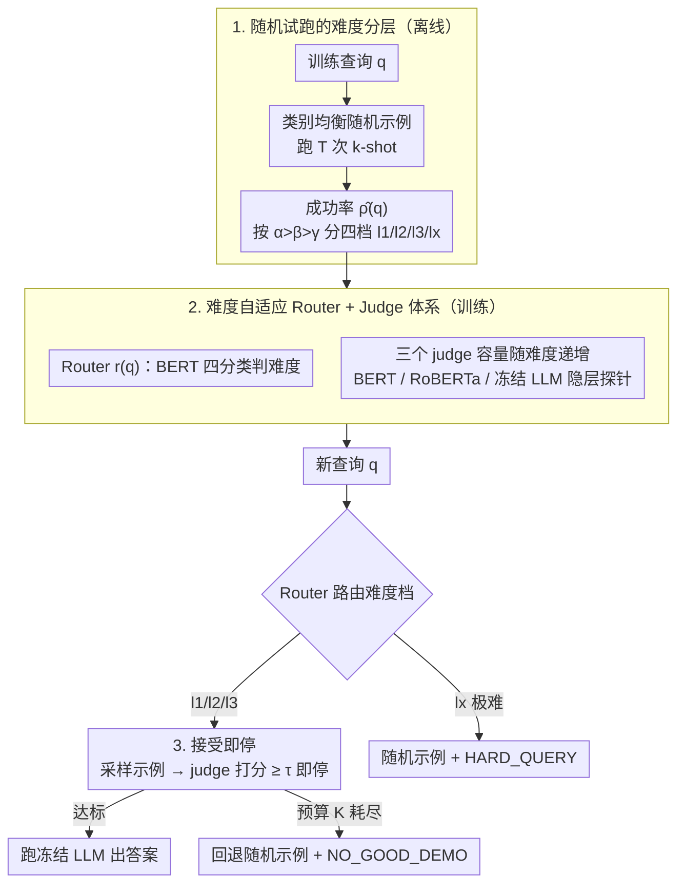

# Easier to Judge Than to Find: Predicting In-Context Learning Success for Demonstration Selection

**会议**: ICML 2026  
**arXiv**: [2605.18512](https://arxiv.org/abs/2605.18512)  
**代码**: 待确认  
**领域**: LLM / NLP  
**关键词**: 上下文学习、示例选择、成功率预测、难度分层、推理预算  

## 一句话总结
本文把 ICL 示例选择从「在巨大组合空间里搜最优 $D^\star$」改造为「对采样到的 $(q,D)$ 对判断是否会成功」，提出 DiSP——一个按查询难度分层、用轻量裁判模型做「采样–判定–接受即停」的框架，在五个分类基准上比强基线最多提升 3.4%，端到端实时延迟最多降 23×。

## 研究背景与动机

**领域现状**：大语言模型的 ICL 能力对 prompt 中具体放哪几个示例、按什么顺序放都极其敏感，主流做法是把示例选择建模为「实例自适应搜索」问题——给定查询 $q$，通过启发式检索（BM25 / kNN）、学习型 retriever / ranker（Rubin et al.、Uprise、Se2、SeDPO）或基于模型反馈的代理打分，从大候选池中挑出最有可能让 LLM 答对的示例集合 $D^\star$。

**现有痛点**：候选空间是组合爆炸的——从 $N$ 个候选里挑 $k$ 个并排序就有 $\binom{N}{k}k!$ 种组合，挨个跑 LLM 完全不可行。即便用代理打分裁剪候选集，可靠的搜索仍需要在多个候选上跑 LLM 来验证；但「跑 LLM 验证」本身就是想节省的那项开销，于是变成自相矛盾。更糟的是，proxy 信号本身并不可靠：语义相似的示例未必能让 LLM 答对，同一个示例在不同查询下表现也大相径庭。

**核心矛盾**：搜索范式默认「能找到最优 $D^\star$ 就是好方法」，但找最优在组合空间里太贵；而且不同 $q$ 的「该花多少 compute 选示例」差异巨大——简单查询随便给个示例都能答对，难查询砸再多 compute 也救不回来，统一的搜索策略本质上在浪费资源。

**本文目标**：把「找最优示例」这个昂贵的搜索问题换成「判断采样到的示例是否够用」这个便宜的二分类问题，同时让计算预算根据查询难度自适应分配。

**切入角度**：作者的核心观察是「判别比生成简单」——给定 $(q, D)$ 对预测 ICL 是否成功，比从零搜出最优 $D^\star$ 容易得多。如果存在一个轻量裁判 $g(q,D)$ 能用极小代价估计 $P(s(q,D)=1\mid q, D)$，就可以走 sample-and-judge：从随机 proposal 里抽几个候选示例，让裁判逐个打分，接受第一个达标的，搜索退化为「接受即停」的可行性测试。

**核心 idea**：DiSP（Difficulty-Stratified Success Prediction）= 用随机示例试跑估计每个训练查询的成功率 → 把查询分成四个难度等级 → 训练一个 router 预测难度 + 三个不同容量的 level-specific judge → 推理时按难度分配采样预算，接受即停，无可接受候选时回退随机示例并打风险标签。

## 方法详解

### 整体框架
DiSP 把「在组合空间里搜最优示例集 $D^\star$」整个换成「先看查询有多难、再对随机抽到的几个示例逐个判断够不够用」。它分三阶段：离线先用随机示例试跑估出每个训练查询的成功率并据此分四个难度档；再在各档上分别训练一个判难度的 router 和三个容量递增的 judge；推理时 router 把新查询路由到某一档，对应 judge 顺序打分、接受第一个达标的就跑 LLM 出答案，预算用尽或查询太难则回退随机示例并打风险标签。目标 LLM 全程冻结，只训练这些轻量模块。

### 关键设计

**1. 基于随机试跑的难度分层：把「该花多少算力选示例」交给查询自己回答**

旧方法对所有查询一视同仁，结果是大量「随便放个示例都对」的简单查询和「怎么放都不对」的硬查询都在白白消耗搜索算力。DiSP 先把查询按难度分开：固定一个**类别均衡**的随机 proposal 分布（$k=|\mathcal{Y}|$，每个类别随机抽一个示例再乱序），对每个训练查询 $q$ 跑 $T$ 次随机 $k$-shot 上下文，得到成功指示 $s(q,D_t)=\mathbb{I}[\hat{y}(q,D_t)=y^\star]$，再求经验成功率 $\hat{\rho}(q)=\frac{1}{T}\sum_t s(q,D_t)$。按阈值 $\alpha>\beta>\gamma$ 把 $q$ 分到 $l_1$（容易，$\hat{\rho}\geq\alpha$）、$l_2$（中等）、$l_3$（脆弱）、$l_x$（几乎无救，$\hat{\rho}<\gamma$）四档。这个分层的依据很直接：独立采 $K$ 个示例「至少成功一次」的概率是 $1-(1-\hat{\rho}(q))^K$，$\hat{\rho}$ 越小就得抽越多次才凑得出一个能用的示例。把 $l_1$ 和 $l_x$ 这两类拎出去交给「单次随机示例 + 风险标签」处理后，宝贵的算力才能集中喂给真正能从精挑示例里获益的 $l_2/l_3$。

**2. 难度自适应的 Router + Judge 体系：用判别代替检索，让模型容量随难度递增**

这一步落地「judge 比 find 容易」的核心主张——与其训一个把 $q$ 映射到好示例集的 task-specific retriever，不如训一个对给定 $(q,D)$ 判断会不会成功的二分类器。router $r(q)$ 用 BERT-base（约 110M）做四分类预测难度档；三个 judge 估计成功概率 $g_\ell(q,D)\approx P(s(q,D)=1\mid q,D)$，容量按难度递增：$g_{l_1}$ 用 BERT-base，$g_{l_2}$ 用 RoBERTa-Large（约 330M），$g_{l_3}$ 才在冻结目标 LLM 的隐藏表示上挂一个轻量分类头。换句话说，只有最脆弱的那一档才动用 LLM 自身的特征，其余档的裁判完全独立于目标 LLM，遵循「只在必要时才用昂贵特征」。作者的表征探针实验给这套设计撑了腰：在 LLM 隐藏状态上对成功/失败的 $(q,D)$ 对只做一个简单 MLP 探针就有高 AUROC/AUPRC，说明判别可行性确实比学检索容易，因此能用比 retriever 小一个量级的模型解决。

**3. 接受即停的可行性测试：把排序退化成「第一个达标就走」，并暴露精度–成本旋钮**

把示例选择从「排序」改成「可行性测试」是这套框架省算力的关键——排序得看完所有候选才能定夺，而可行性测试只要第一个达标就停。对路由到 $\hat{\ell}\in\{l_1,l_2,l_3\}$ 的查询，循环采样 $D_i\sim\mathcal{P}_{\text{rand}}$ 并算 $g_{\hat{\ell}}(q,D_i)$，一旦 $g_{\hat{\ell}}(q,D_i)\geq\tau_{\hat{\ell}}$ 立即接受、跑 LLM 出结果（stop-on-accept），否则继续直到预算 $K_{\hat{\ell}}$ 耗尽，预算按难度递增 $K_{l_1}<K_{l_2}<K_{l_3}$。预算用完就回退到一次随机示例并打 `NO_GOOD_DEMO`；被路由到 $l_x$ 的查询则直接跳过 judging、随机示例 + `HARD_QUERY`。文中给出形式化保证：在裁判分数误差有界时，被接受示例的真实成功概率至少为 $\tau_{\hat{\ell}}$，且 `NO_GOOD_DEMO` 在采样候选集上是 sound 的。这样预算 $K_\ell$ 就成了唯一对外可调的旋钮，部署方能在省算力与保精度之间精确权衡，两个风险标签则在 ICL 不靠谱时给出明确的「弃权」信号供下游兜底。

### 损失函数 / 训练策略
router 在 $\mathcal{D}_{\text{route}}=\{(q,\ell(q))\}$ 上做四分类交叉熵；三个 judge 各自在 $\mathcal{D}_{l_j}=\{((q,D),s(q,D)):\ell(q)=l_j\}$ 上做二分类交叉熵；目标 LLM 全程冻结、不做任何梯度更新。所有判定阈值 $\tau_\ell$ 与采样预算 $K_\ell$ 都是推理时旋钮，可在验证集上沿 cost–accuracy 曲线选取。

## 实验关键数据

### 主实验
在 5 个分类基准（TREC、SST-2、SST-5、AGNews、MNLI）与 2 个开源 LLM（LLaMA3-8B、Qwen2.5-7B）上对比，每方法每查询选一个上下文，结果为 6 次独立运行均值。

| 方法 (LLaMA3-8B) | TREC | SST-2 | SST-5 | AGNews | MNLI | 平均 |
|------------------|------|-------|-------|--------|------|------|
| Zero-shot | 70.5 | 94.7 | 41.7 | 72.9 | 52.3 | 66.4 |
| Random (单示例) | 73.8 | 94.9 | 46.6 | 84.1 | 66.9 | 73.3 |
| BM25 | 75.2 | 94.7 | 52.3 | 86.1 | 65.6 | 74.8 |
| Uprise | 75.8 | 94.0 | 48.3 | 90.7 | 58.9 | 73.6 |
| Se2 | 68.2 | 93.4 | 51.7 | 86.1 | 60.9 | 72.1 |
| SeDPO | 67.5 | 93.4 | 47.0 | 88.1 | 61.6 | 71.5 |
| **DiSP (本文)** | **79.2** | **95.4** | **54.3** | 89.7 | **69.5** | **77.6** |

在 Qwen2.5-7B 上 DiSP 平均 82.9%，比最强基线（BM25 80.5%）高 2.4 个点；比 zero-shot 提升 13.1 个点。最大增益出现在 TREC、MNLI 这种「需要靠谱示例」的硬数据集上，SST-2 这种 zero-shot 就 ≥94.7% 的简单任务增益自然变小。

### 消融实验
端到端 wall-clock 成本（5 数据集平均）：

| 阶段 | Uprise | Se2 | SeDPO | DiSP |
|------|--------|-----|-------|------|
| 训练 (分钟) | 13.4 | 114.9 | 157.1 | **6.7** |
| 测试 (分钟) | 0.4 | 0.6 | 0.6 | **0.1** |
| 总成本 (分钟) | 13.8 | 115.4 | 157.6 | **6.8** |
| 相对 DiSP | 2.0× | 17.0× | 23.2× | 1.0× |

### 关键发现
- 在所有 5 个分类任务的平均精度上，DiSP 同时是「最准」和「最便宜」，把以往「精度–效率二选一」的格局打破——这是「判别比生成简单」原则在 ICL 选示例上的有效印证。
- 23× 的训练加速主要来自跳过 task-specific retriever 的训练，统一裁判 + 随机 proposal 跨任务复用；6× 的测试加速来自接受即停 + 轻量 judge 不需要为每个查询跑昂贵的 retrieval。
- 表征探针实验显示「成功 / 失败的 $(q, D)$ 对在 LLM 隐藏状态空间里是可分的」，验证了核心假设——这意味着 DiSP 的成功不是侥幸，而是 ICL 失败模式在表征层面有结构性信号可用。
- 四级分层中 $l_x$（极难查询）的存在让框架自然支持「弃权」语义，HARD_QUERY 与 NO_GOOD_DEMO 两个标签给下游做兜底（人工审核、保守回退、外部检索）提供了清晰挂钩。

## 亮点与洞察
- 「judge 比 find 容易」是一个普适框架性洞察。在 RL、code generation、tool use 等领域，「找最优动作」往往很难但「判定动作是否够好」可以低成本做到——DiSP 把这条原则在 ICL 选示例上做出来，思路可直接迁移到 search policy distillation、test-time verifier 等场景。
- 分层 compute 分配的范式比单一 retriever 更接近真实部署需求。生产系统永远面临「大部分查询很简单、少数查询非常难」的长尾，DiSP 用 router 把这个分布显式建模出来并对症下药。
- 用随机 proposal 替代学习型 retriever 的设计极简但有效——把「数据相关」性都收到 judge 里，proposal 完全 data-agnostic，跨任务直接复用，省掉大量工程开销。
- 接受即停 + 显式预算 + 风险标签三件套是工程上罕见的「可调、可解释、可兜底」组合，对真实部署非常友好。

## 局限与展望
- 实验只在 5 个**分类**基准上验证，开放式生成（QA、摘要、推理）是否还能用相同的成功指示 $s(q, D) = \mathbb{I}[\hat{y} = y^\star]$ 建模需要重新设计——生成任务的「成功」往往没有 hard label。
- $\hat{\rho}(q)$ 用 $T$ 次 Bernoulli 试跑估计，每个训练查询都要跑 LLM $T$ 次，监督构造本身代价不低；虽然摊到推理上后变便宜，但首次部署到新任务时的离线成本仍可观。
- 难度分层阈值 $(\alpha, \beta, \gamma)$ 与判定阈值 $\tau_\ell$ 是手工选取的超参数，不同 LLM、不同任务可能需要重新调优，作者承认靠近阈值的查询路由稳定性会下降。
- 三个 judge 共用一个随机 proposal 分布，如果 proposal 与真实测试分布偏差大（如 OOD 查询），$\hat{\rho}$ 估计与最终路由都会失真——还缺乏自适应 proposal 的机制。

## 相关工作与启发
- **vs Rubin et al. (EPR)、Uprise、SeDPO**：他们都训练 task-specific retriever 把 $q$ 映射到好示例集，DiSP 把方向反过来——不训 retriever 只训 judge，用随机 proposal + 接受即停代替排序。代价是单查询可能多跑几次裁判，但裁判远比 retriever + LLM 重排便宜。
- **vs Batch-ICL**：他们解耦示例顺序敏感性，DiSP 解耦的是「选示例」与「判示例」，两者正交，可以叠加。
- **vs model cascade / routing**：模型路由根据输入选不同规模的模型，DiSP 是同一 LLM 内根据输入选不同规模的**辅助裁判**，思路一致但落点在 prompt 层而非 model 层。
- **vs conformal prediction in LLMs**：两者都关心「ICL 何时不可信」，DiSP 通过 $l_x$ 标签 + NO_GOOD_DEMO 给出可操作的弃权语义，与共形预测在不确定性量化上互补。

## 评分
- 新颖性: ⭐⭐⭐⭐ 「judge 比 find 容易」的视角虽不算原创，但在 ICL 示例选择上的系统化落地（随机 proposal + 难度分层 + 接受即停）是首次提出。
- 实验充分度: ⭐⭐⭐ 5 个分类基准 × 2 个 LLM 足够支撑结论，但缺乏对开放式生成任务的验证，也没和 prompt optimization 系（DSPy、MIPRO）直接对比。
- 写作质量: ⭐⭐⭐⭐ 三阶段框架清晰，附录给出可行性测试的形式化保证（Lemmas A.4–A.5），符号一致性好。
- 价值: ⭐⭐⭐⭐ 23× 加速 + 精度提升的组合直接对生产部署具有吸引力，框架可被直接复用到其它「选 prompt 组件」的场景。

<!-- RELATED:START -->

## 相关论文

- [\[ICLR 2026\] LLMs Encode Their Failures: Predicting Success from Pre-Generation Activations](../../ICLR2026/model_compression/llms_encode_their_failures_predicting_success_from_pre-generation_activations.md)
- [\[ICML 2026\] Images as Tables: In-Context Learning with TabPFN for Low-Data Detection of AI-Generated Images](images_as_tables_in-context_learning_with_tabpfn_for_low-data_detection_of_ai-ge.md)
- [\[ICML 2026\] Token Sparse Attention: Efficient Long-Context Inference with Interleaved Token Selection](token_sparse_attention_efficient_long-context_inference_with_interleaved_token_s.md)
- [\[AAAI 2026\] Predicting the Future by Retrieving the Past](../../AAAI2026/model_compression/predicting_the_future_by_retrieving_the_past.md)
- [\[ICML 2026\] Provably Learning Attention with Queries](provably_learning_attention_with_queries.md)

<!-- RELATED:END -->
