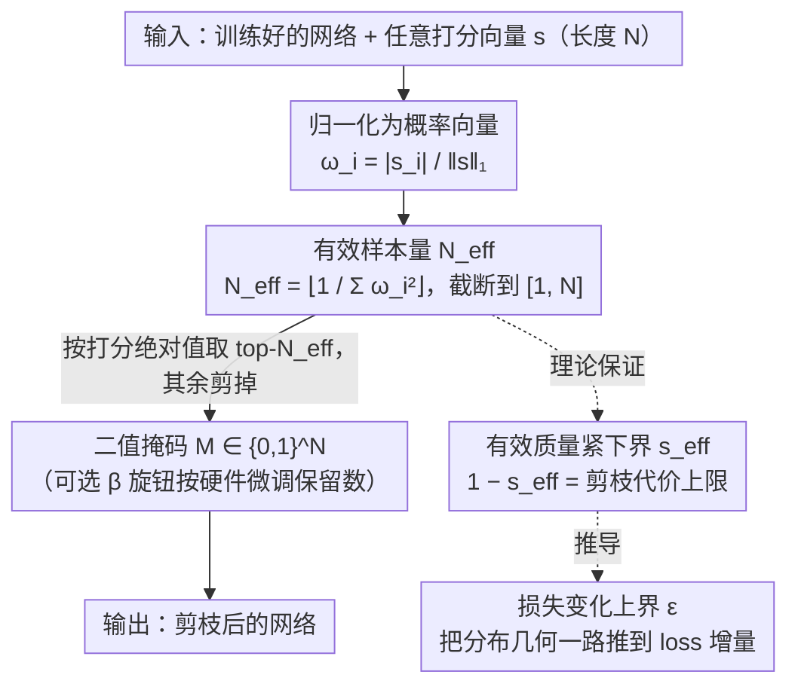

# Effective Model Pruning: Measure the Redundancy of Model Components

**会议**: ICML 2026 Spotlight  
**arXiv**: [2509.25606](https://arxiv.org/abs/2509.25606)  
**代码**: https://github.com/noMushroomw/Effective-model-pruning  
**领域**: 模型压缩  
**关键词**: 模型剪枝、有效样本量、逆 Simpson 指数、自适应稀疏度、通用阈值  

## 一句话总结
本文借鉴粒子滤波中的「有效样本量」概念，把任意打分向量直接映射到一个自适应保留个数 $N_{\text{eff}} = \lfloor 1/\sum_i \omega_i^2 \rfloor$，作为剪枝阈值，避免人工设定稀疏度并给出剪枝前后损失变化的理论上界。

## 研究背景与动机

**领域现状**：神经网络剪枝已经形成丰富的方法谱系，可按「剪什么（非结构化权重 / 结构化通道 / 注意力头）」「何时剪（训练前 / 训练中 / 训练后）」与「按什么打分（幅值、敏感度、数据驱动指标）」三维分类，但绝大多数方法在拿到一个打分向量 $s$ 之后，仍需要人工决定该保留多少个分量。

**现有痛点**：稀疏度的选择极为敏感——过激进会让模型直接掉点，过保守又浪费效率收益。当前做法要么走代价高昂的迭代剪枝（如 Lottery Ticket 重训），要么手工设置每层预算，要么把稀疏度调成一个需要细致调优的超参数（SparseGPT / Wanda 等都需要事先指定全局稀疏率）。在大模型规模下，这种调参成本变得难以承受。

**核心矛盾**：剪枝的「打分」与「定量」两件事被绑死在一起讨论，但其实它们是两个独立的问题。已有方法不断卷新的打分指标，却几乎默认「定多少」由用户拍脑袋决定；而打分分布本身已经携带了「有多少元素是真正显著」的信息，没有被利用起来。

**本文目标**：设计一个**与打分准则无关、与网络架构无关**的通用阈值规则，把「该保留多少分量」从超参数中剥离出来，直接由打分分布本身决定，并能给出可证明的损失变化上界。

**切入角度**：作者注意到粒子滤波领域有一个类似问题——给定一组带权粒子，如何判断「有多少粒子是统计上有效的」。答案就是有效样本量 $N_{\text{eff}} = 1/\sum_i \omega_i^2$，在生态学里它叫逆 Simpson 多样性指数，与 Rényi 熵直接相连。如果把打分向量归一化为概率分布，这个量就天然反映了「打分集中度」：越集中说明少数分量主导，可剪得越多；越均匀说明每个分量都贡献相当，几乎不能剪。

**核心 idea**：把任意打分向量 $s$ 归一化为 $\omega_i = |s_i|/\|s\|_1$，直接保留前 $N_{\text{eff}} = \lfloor 1/\sum_i \omega_i^2 \rfloor$ 个分量，剩下的全部剪掉——一个统一的、无需调参的、跨架构跨准则通用的剪枝阈值。

## 方法详解

### 整体框架
EMP（Effective Model Pruning）想解决的是剪枝里被长期忽视的一半问题：打分准则已经卷出了花，但「拿到打分后到底保留几个」始终靠人拍脑袋。它的回答是一条只看打分分布形状、与架构和准则都无关的通用规则——输入一个训练好的网络和任意打分向量 $s \in \mathbb{R}^N$，输出二值掩码 $M \in \{0,1\}^N$。整条流水线分三步：先把绝对值打分按 $\ell_1$ 范数归一化成概率向量 $\omega_i = |s_i|/\|s\|_1$，再由 $\omega$ 算出一个「有效样本量」$N_{\text{eff}}$ 并截断到 $[1,N]$，最后按 $|s|$ 取 top-$N_{\text{eff}}$ 个索引置 1、其余剪掉。整套规则复杂度 $O(N\log N)$（一次排序），五行代码即可实现，并配一个可选部署旋钮 $\beta \in [0.5,2]$，仅在硬件硬性要求某稀疏率时把保留数微调成 $\beta N_{\text{eff}}$。算法本身只走主干三步，而归一化得到的分布 $\omega$ 同时被两条理论分支接管——从分布几何分别推出「剪枝代价」与「损失变化」的解析上界，让这条朴素规则带着可证明的误差保证落地。

### 关键设计

**1. 有效样本量 $N_{\text{eff}}$：让打分分布自己说出该剪多少**

痛点很直接——SparseGPT、Wanda 这些方法都要事先指定一个全局稀疏率，过激进掉点、过保守浪费，在大模型上还得网格搜索。作者的做法是把这个超参数从分布里反推出来：定义 $N_{\text{eff}} \triangleq \lfloor 1/\sum_i \omega_i^2 \rfloor$，这正是粒子滤波里判断「有多少粒子统计有效」的有效样本量，在生态学里叫逆 Simpson 指数。几何上它等于 $\omega$ 到单纯形重心 $\zeta_{[N]}$ 距离平方的倒数——分布越均匀离重心越近，$N_{\text{eff}} \to N$（什么都不能剪）；分布越尖、越退化为单点，$N_{\text{eff}} \to 1$（只留最大那个）。作者进一步证明 $A_\nu = \tilde{\Delta} \cap (B_\nu - B_{\nu+1})$，等于把整个单纯形切成一圈圈球壳，每层壳对应一个固定的 $N_{\text{eff}}$ 值。它之所以好用，是因为同时满足三个性质：只依赖打分分布、随维度 $N$ 自适应、对坐标排列不变；分布越尖锐就能剪得越狠，全程不需要任何人为设定的稀疏率。

**2. 有效质量 $s_{\text{eff}}$ 的紧下界：从分布形状就能算出「剪掉的有多重」**

光知道保留几个还不够，真正要管的是被剪掉那部分到底有多重要。作者用保留的归一化质量 $s_{\text{eff}} = \sum_{i=1}^{N_{\text{eff}}} \omega_{(i)}$ 来刻画它，于是 $1 - s_{\text{eff}}$ 就是剪枝代价的直接度量。问题转成在 $A_\nu$ 上求 $\varphi_\nu(\omega) = \sum_{i=1}^{\nu}\omega_i$ 的下确界——若直接松弛到整个 $\tilde{\Delta}$，只能得到平凡的 $s_{\text{eff}} \geq N_{\text{eff}}/N$。作者构造出最小值点 $p_\nu = \zeta_{[N]} + \frac{r_{\nu+1}}{r_1}(\zeta_{[1]} - \zeta_{[N]})$，证明它就是 $\varphi_\nu$ 在 $A_\nu$ 上的极小点，从而得到紧界

$$1 - s_{\text{eff}} \leq \frac{N-N_{\text{eff}}}{N}\left(1 - \sqrt{\frac{N-N_{\text{eff}}-1}{(N_{\text{eff}}+1)(N-1)}}\right),$$

渐近近似为 $\frac{N-N_{\text{eff}}}{N}\big(1 - \sqrt{(N-N_{\text{eff}})/(N N_{\text{eff}})}\big)$。这层紧界的意义在于：不必跑任何实验，只看打分分布的形状就能给出剪枝代价的理论上限。

**3. 损失变化 $\epsilon$ 的上界传导：把分布几何一路推到 loss 增量**

前两步停在「质量」层面，这一步把它兑现成真正关心的损失差。当打分准则就是参数幅值时，剪枝引入的损失差为 $\epsilon = |L(\theta^*) - L(\theta^k)|$。作者从 Zhang et al. 2023 的引理 $\rho \leq 1 - 2\epsilon N/(\|\theta^* - \theta^k\|_2^2 \mathrm{Tr}(H) + 2\epsilon N)$ 反解出 $\epsilon \leq \frac{1-\rho}{2N\rho}\mathrm{Tr}(H)\|\theta^* - \theta^{N_{\text{eff}}}\|_2^2$，再借上一步的紧界把参数距离放缩成 $\|\theta^* - \theta^{N_{\text{eff}}}\|^2 \leq \|\theta^*\|_1^2 (1-s_{\text{eff}})^2 (N - N_{\text{eff}})$，最终得到只与 $\rho$、$N$ 有关的解析上界

$$\epsilon \lesssim \|\theta^*\|_1^2\, \mathrm{Tr}(H)\, \frac{(1-\rho)^4}{2\rho}\left(1 - \sqrt{\frac{1-\rho}{N\rho}}\right)^2.$$

这条链把「分布几何 → 剪枝代价」彻底打通：实验里当 $N=1000$、$\rho > 0.2$ 时上界已接近 0，意味着只要 $N_{\text{eff}}$ 落在合理范围，损失增量理论上就被压得极小。该推导对幅值准则严格成立，对其他可微准则也可类推。

### 损失函数 / 训练策略
EMP 是一个**纯后训练**规则，不改训练目标、不要求剪后微调；实验里作者刻意全程不做任何 fine-tune，以隔离阈值本身的效果。唯一的旋钮 $\beta$ 只服务于硬件部署——当目标硬件要求的稀疏率低于 $N_{\text{eff}}/N$ 时把保留数缩成 $\beta N_{\text{eff}}$，而 $\beta = 1$ 始终是「无损 → 掉点」的分水岭。

## 实验关键数据

### 主实验
作者在 FC、CNN、Transformer、KAN、LLM 五大类架构上测试 EMP 与幅值剪枝的组合，所有实验均不做任何 fine-tune。

| 数据集 | 模型 | 稀疏率 (%) | Dense Loss | EMP Loss | $\epsilon$ |
|--------|------|-----------|------------|----------|------------|
| CIFAR10 | FC12 | 42.89 | 1.5123 | 1.4454 | 0.0669 |
| CIFAR10 | AlexNet | 62.22 | 0.4664 | 0.4286 | 0.0378 |
| CIFAR10 | VGG16 | 59.47 | 0.4234 | 0.3184 | 0.1050 |
| CIFAR100 | ResNet18 | 56.20 | 0.8740 | 0.9287 | 0.0547 |
| CIFAR100 | ResNet50 | 54.74 | 0.8586 | 0.8387 | 0.0199 |
| TinyImageNet | ResNet50 | 48.10 | 2.0213 | 1.9853 | 0.0360 |

所有架构上 $\epsilon \leq 0.105$，与理论上界一致。LLM 端测试 LLaMA 与 LLaMA-2 的 7 个零样本任务平均表现：

| 方法 | 平均稀疏率 (%) | 平均 $\Delta$PPL | 平均 $\Delta$Acc (%) |
|------|---------------|------------------|---------------------|
| Wanda (固定) | 50.00 | +0.799 | -1.40 |
| Magnitude (固定) | 50.00 | +2.982 | -2.60 |
| EMP-Wanda | 40.47 | +0.678 | -1.37 |
| EMP-Magnitude | 36.63 | +0.752 | -0.93 |

EMP-Magnitude 把朴素幅值剪枝从「掉 2.6 个点」拉回到「只掉 0.93 个点」，代价是稀疏率从 50% 降到 36.63%。

### 消融实验
通过扫描 $\beta \in \{0.5, 0.75, 1, 1.25, 1.5, 2\}$ 验证 $N_{\text{eff}}$ 作为阈值的鲁棒性。

| $\beta$ 设置 | 行为 | 说明 |
|-------------|------|------|
| $\beta < 1$ | 性能急剧下降 | 剪掉的比 $N_{\text{eff}}$ 多，开始触碰真正重要的分量 |
| $\beta = 1$ | 性能转折点 | 所有架构与准则下都恰好处于「无损 → 掉点」的临界 |
| $\beta > 1$ | 性能持平 | 多保留分量不带来增益，只是少剪一些 |
| GPT-2 头剪枝 (Taylor) | $N_{\text{eff}} = 141.4$，PPL +1.0% | 注意力头重要性几乎均匀分布 |
| GPT-2 头剪枝 (Weight) | $N_{\text{eff}} = 134.0$，PPL +6.5% | 仅剪 10 头，权重范数准则更激进 |

### 关键发现
- $\beta = 1$ 在 FC、CNN、Transformer 和 LLM 上**一致**地标出「再剪就掉点」的转折，说明 $N_{\text{eff}}$ 捕捉到了某种架构无关的内禀稀疏度。
- 同一模型下不同准则给出不同的 $N_{\text{eff}}$（例如 GPT-2 上 Taylor 给出 141.4 而 Weight 给出 134.0），可作为**评估打分准则质量**的指标——好准则会让分布更集中，$N_{\text{eff}}$ 更小、可剪更多。
- 在 LLM 上，朴素幅值剪枝在 50% 稀疏率下崩塌的真正原因不是打分本身差，而是「固定全局预算」太粗暴；改用 $N_{\text{eff}}$ 自适应阈值后，幅值准则也能与 Wanda 打成平手。
- 把 EMP 应用到 RGB 像素层面，按 $4\times4$ patch 局部计算 $N_{\text{eff}}$ 可在 32.3% 稀疏率下达到 PSNR 38.3 dB / SSIM 0.991，证明该准则不仅适用于参数，也适用于特征。

## 亮点与洞察
- 把「该保留多少」从超参数池里彻底剥离出来。EMP 不引入任何需要调的旋钮（$\beta$ 只是部署适配），这在 LLM 时代的批量剪枝实验里直接省掉一个网格搜索的维度。
- 用「打分分布的几何形状」反向定义剪枝代价。$N_{\text{eff}}$ 本质上是把分布距离重心的二范数倒数当成「有效维度」，这种「分布即预算」的思想可以直接迁移到 mixture-of-experts 的专家激活、注意力稀疏化、低秩分解的秩选择等场景。
- 提供了一个**评估打分准则**的新尺度。以往评判一个剪枝准则只能在固定稀疏率下比掉点，EMP 让我们直接比较准则给出的 $N_{\text{eff}}$，分布越尖锐说明准则越能识别冗余。
- 与门控注意力天然契合。EMP 可视为一种确定性硬门控——把 pre-softmax 分数过一次 top-$N_{\text{eff}}$ 截断就相当于一个无参数的硬门，有潜力缓解注意力 sink 现象。

## 局限与展望
- $\epsilon$ 上界推导只对幅值准则严格成立，对 Wanda、Taylor 等准则只是实验上有效，理论上还需扩展到一般可微打分。
- $N_{\text{eff}}$ 是全局阈值（per-layer 应用时是逐层全局阈值），缺乏跨层重要性的协调，可能在浅层与深层之间分配次优。
- 完全跳过 fine-tune 在 LLM 高稀疏率（>50%）下仍会有可见掉点，需要与 SparseGPT 风格的局部重构结合才可能进一步压榨。
- 作者承认结合学习型门控（learned gating）做混合方案、把 EMP 作为训练期自适应特征选择的初始化等方向都未系统验证，是明确的展望。

## 相关工作与启发
- **vs Lottery Ticket / iterative magnitude pruning**：他们靠多轮重训找子网络，EMP 一次性给出阈值不用重训，但理论上 LTH 能找到稀疏率更高的子网；EMP 更适合无重训预算的快速部署。
- **vs SparseGPT / Wanda**：两者都需要预先指定稀疏率作为超参数，EMP 把这个超参数从指标分布反推出来；实验显示 EMP-Wanda 在更低稀疏率下取得更好 PPL，说明「自适应稀疏率」可与「好打分」叠加。
- **vs OBD / OBS**：经典二阶方法需要 Hessian 估计才能给出局部最优剪枝，EMP 只需要一阶或零阶分数即可给出全局阈值，代价是不再保证「最优」但保证「可控误差」。

## 评分
- 新颖性: ⭐⭐⭐⭐⭐ 把粒子滤波/生态学的 $N_{\text{eff}}$ 概念引入剪枝并给出几何下界，是真正意义上的跨学科迁移而非简单组合。
- 实验充分度: ⭐⭐⭐⭐ 覆盖 FC、CNN、Transformer、KAN、LLM 五大类架构与四种打分准则，但缺乏与最新 LLM 剪枝（如 ShortGPT、LLM-Pruner）的直接对比。
- 写作质量: ⭐⭐⭐⭐ 数学推导清晰，几何直观（单纯形 + 球壳）很有说服力，但符号略密集对初读者不友好。
- 价值: ⭐⭐⭐⭐⭐ 直接解决了剪枝实践中「稀疏率怎么选」的痛点，且规则简单到 5 行代码即可实现，落地价值很高。

<!-- RELATED:START -->

## 相关论文

- [\[ICML 2026\] Continual Model Routing in Evolving Model Hubs](continual_model_routing_in_evolving_model_hubs.md)
- [\[ICLR 2026\] AdaRank: Adaptive Rank Pruning for Enhanced Model Merging](../../ICLR2026/model_compression/adarank_adaptive_rank_pruning_for_enhanced_model_merging.md)
- [\[NeurIPS 2025\] Towards Effective Federated Graph Foundation Model via Mitigating Knowledge Entanglement](../../NeurIPS2025/model_compression/towards_effective_federated_graph_foundation_model_via_mitigating_knowledge_enta.md)
- [\[ICML 2026\] Saliency-Aware Model Merging](saliency-aware_model_merging.md)
- [\[ICML 2026\] Decouple Searching from Training: Scaling Data Mixing via Model Merging for Large Language Model Pre-training](decouple_searching_from_training_scaling_data_mixing_via_model_merging_for_large.md)

<!-- RELATED:END -->
