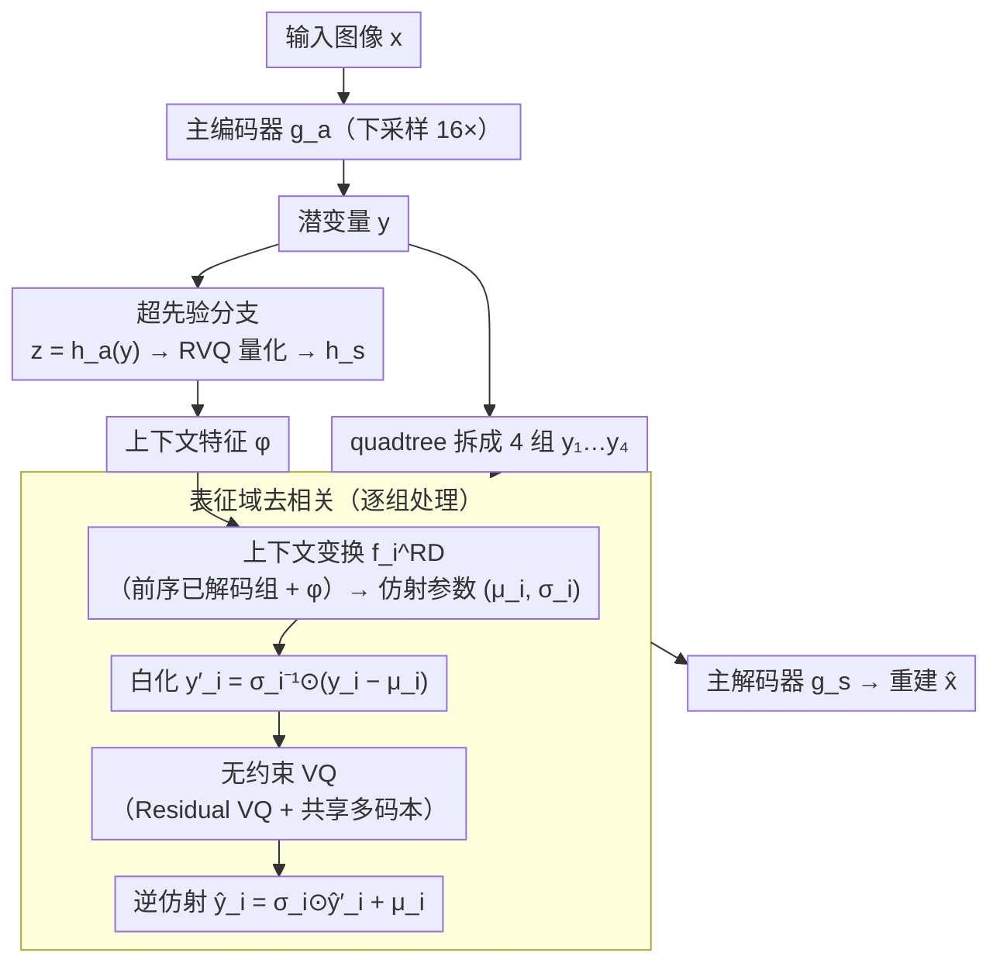

# Efficient Learned Image Compression without Entropy Coding

**会议**: ICML 2026  
**arXiv**: [2605.23323](https://arxiv.org/abs/2605.23323)  
**代码**: 待确认  
**领域**: 模型压缩 / 学习型图像编解码 / 生成式压缩  
**关键词**: 学习型图像压缩, 无熵编码, 向量量化, 上下文重参数化, GPU 并行  

## 一句话总结
EF-LIC 用"无约束向量量化最大化索引熵 + 表征域上下文重参数化消除潜变量间相关性"两步替代了 learned image compression 流水线里慢且串行的熵编码模块，理论证明其 R–D 性能可逼近熵编码方案，实际在 Kodak/LPIPS 上比 MS-ILLM 省码 67.86% 且解码快 10 倍。

## 研究背景与动机

**领域现状**：现代 learned image compression (LIC) 都遵循 Ballé 2018 的 VAE 编码器 + 量化 + 熵编码三段式范式，性能上已经超越 JPEG/VVC，最强的还在 perceptual 指标上吊打传统编码器。熵编码（rANS）配合 context model 同时消除统计冗余和相关性冗余，是性能的"最后一公里"。

**现有痛点**：熵编码（尤其 rANS）控制流复杂、**本质串行**，必须跑在 CPU 上，一次 forward 中熵编码可能花掉 100+ ms，比其他所有 GPU 模块加起来还多。简化或去掉熵编码立刻掉性能——COIN 用 INR 绕过熵编码但只能打到 JPEG 水平，OSCAR 用 diffusion 绕过但推理成本天价。

**核心矛盾**：从信息论看，端到端编码长度 $R\ge H(X)$，熵编码的存在就是为了让实际码长贴近熵下界。一旦去掉，索引就只能定长编码，码长被强制等于 $\log K^n$；要想这条上界不浪费，就**得让索引分布逼近均匀分布**（最大熵）并且让相邻 latent 之间**没有可被预测的相关性**——历史上没人系统做过这两件事。

**本文目标**：构造一个完全 GPU-friendly、**不调用任何熵编码**的 LIC 框架，同时保持与熵编码方案相当的 R–D 性能。

**切入角度**：把 LIC 的冗余拆成"统计冗余 (statistical)" + "相关性冗余 (correlation)"两类分别治疗——前者用 unconstrained VQ 把索引推到最大熵，后者用 representation-domain 的上下文 affine 重参数化把相关性"洗"掉，两者都是张量算子、天然 GPU 并行。

**核心 idea**：不去预测条件分布并把 logits 送熵编码器，而是**直接在表征域**用上下文驱动的 $(\bm\mu_i,\bm\sigma_i)$ 把当前 latent 组 $\bm y_i$ 仿射变换到去相关空间再量化，量化用足够大的 VQ codebook，理论上保证 $\Delta H\to 0$。

## 方法详解

### 整体框架

EF-LIC 想把 LIC 流水线里那个慢且串行、只能跑在 CPU 上的熵编码模块整个抽掉，又不掉 R–D 性能。它的做法是：图像 $\bm x$ 先经主编码器 $g_a$（下采样因子 $f_y=16$）变成潜变量 $\bm y$，超先验分支 $\bm z=h_a(\bm y)$（下采样 $f_z=64$）经 RVQ 量化后解出上下文特征 $\bm\phi=h_s(\hat{\bm z})$；接着把 $\bm y$ 按 quadtree 拆成 $N=4$ 组 $(\bm y_1,\dots,\bm y_4)$，逐组用上下文驱动的仿射参数把潜变量"白化"到去相关空间再做 VQ，最后主解码器 $g_s$ 还原 $\hat{\bm x}$。整条流水线**没有任何熵编码器/解码器**，所有 VQ 索引以定长码送出，全部模块都是纯张量算子、可在 GPU 上一次性 batch 化跑完。

### 关键设计

**1. 无约束 VQ：把"索引最大熵"从经验现象升格为定理**

去掉熵编码后索引只能定长编码，码长被强制等于 $n\log K$，这条上界是否浪费，取决于索引序列 $J$ 的熵能否贴上去——即统计冗余 $\Delta H=\frac{n\log K-H(J)}{n\log K}$ 能否压到 0。EF-LIC 的回答是：训练时**根本不施加任何率约束**，只用 codebook commitment、codebook 更新和重建损失（L1 + LPIPS + PatchGAN），让网络自由学。Proposition 3.1 用反证法证明，在 $R=\log K$ 的定长预算下任何 distortion-optimal 的量化器 $Q^*$ 必然满足 $\Delta H=0$；Gersho 1979 的高率公式给出弱版本 $p_J(j)\propto p_Y(\bm c_j)^{2/(C+2)}$，当 $C=8$ 时 $\Delta H\le 5\%$。这正好解释了为什么 VQ-VAE / DAC 收敛后索引分布本就接近均匀——本文把这个"碰巧"的经验现象升格成定理，说明只要 codebook 够大、端到端重建练得充分，定长 VQ 索引序列**理论上就不再需要熵编码来挤统计冗余**，这是整套方法敢拆掉熵编码的合法性根基。

**2. 表征域去相关：把"用上下文预测概率"换成"用上下文白化潜变量"**

统计冗余之外还有相邻 latent 组之间的相关性冗余，传统 LIC 靠 context model $f_i^{\text{CM}}$ 预测条件分布参数 $(\bm\mu_i,\bm\sigma_i)$、再让熵编码按 $P_{\hat Y_i\mid\hat Y_{<i}}(\cdot;\bm\mu_i,\bm\sigma_i)$ 去压，这一步天然串行、绕不开熵编码器。EF-LIC 的关键转念是：用**同一对** $(\bm\mu_i,\bm\sigma_i)=f_i^{\text{RD}}(\bm\psi_i)$（$\bm\psi_i$ 由已解码组 $\hat{\bm y}_{<i}$ 与 $\bm\phi$ 算出），但不是拿去当概率参数，而是直接在表征域做仿射白化 $\bm y_i'=\bm\sigma_i^{-1}\odot(\bm y_i-\bm\mu_i)$，量化后再逆变换 $\hat{\bm y}_i=\bm\sigma_i\odot\hat{\bm y}_i'+\bm\mu_i$ 还原。Theorem 3.5 保证这一替换不亏：对任取 $\varepsilon\in(0,1)$，存在实现使得在略大的定长预算 $R'=R/(1-\varepsilon)$ 下 $D_X^{\text{RD}}(R')\le D_X^{\text{CM}}(R)$，即用一点点码率换来 R–D 上界与概率域 context modeling 吻合。把 context modeling 从概率域搬到表征域之后，整条流水线变成纯张量算子，一次 forward batch 完成，再不用在 CPU 和 GPU 之间反复传 logits/概率——这才是 EF-LIC 速度暴涨的真正来源。

**3. Residual VQ + 共享多码本：单模型覆盖 5 个码率点**

实际编解码器必须支持多码率部署，EF-LIC 把所有量化器 $Q_{\bm z}$、$\{Q_i^{\text{RD}}\}$ 都实现成 Residual VQ：一个 RVQ 由若干可堆叠 codebook 组成，推理时只取前 $m$ 个就给出对应码率，BPP 为 $\text{BPP}=\frac{m}{f_y^2}\left(\frac{f_y^2}{f_z^2}\log K_{\bm z}+\frac{1}{N}\sum_i \log K_i\right)$。训练时对 $\mathcal{M}=\{1,2,3,4,5\}$ 里每个 $m$ 都算一遍重建损失再平均（Eq. 8），codebook 大小按组递减 $K_1{=}1024,K_2{=}512,K_3{=}256,K_4{=}128,K_{\bm z}{=}1024$，自然形成 coarse-to-fine 的码率梯度。靠 RVQ 这种可堆叠结构，multi-rate 训练几乎零额外参数，推理时切换码率只需改 $m$、不必换 checkpoint。

### 损失函数 / 训练策略

$$\mathcal{L}=\frac{1}{|\mathcal{M}|}\sum_{m\in\mathcal{M}}\big(\|\bm x-\hat{\bm x}_m\|_1+\lambda_{\text{per}}\mathcal{L}_{\text{per}}+\lambda_{\text{adv}}\mathcal{L}_{\text{adv}}+\lambda_{\text{cb}}\mathcal{L}_{\text{cb}}^m\big)$$

其中 $\mathcal{L}_{\text{per}}$ 用 VGG-LPIPS、$\mathcal{L}_{\text{adv}}$ 用 adaptive PatchGAN、$\mathcal{L}_{\text{cb}}$ 是 VQ-VAE 的 commitment + codebook 更新。ImageNet 1% 子集每 epoch 重采，256×256 随机裁剪，Adam $(\beta_1,\beta_2)=(0.5,0.9)$，batch 16，2M iter，lr $10^{-4}\to 10^{-5}$@1.5M，单卡 A100、峰值显存 ~10.5 GB。

## 实验关键数据

### 主实验（BD-rate vs. MS-ILLM，LPIPS，越负越好）

| 方法 | Enc. (ms) | Dec. (ms) | Params (M) | Kodak | DIV2K |
|------|-----------|-----------|------------|--------|--------|
| VVC (VTM-23.10) | >9999 | 150.30 | — | +313.84% | +285.10% |
| HiFiC | 526.51 | 1408.60 | 181.6 | +45.82% | +46.36% |
| MS-ILLM | 165.38 | 147.79 | 181.4 | 0.00% | 0.00% |
| DiffEIC | 210.18 | 4661.74 | 1379.5 | −37.71% | −15.76% |
| OSCAR (diffusion, no EC) | 53.04 | 167.56 | 1009.3 | −37.31% | −14.51% |
| RDEIC | 157.25 | 426.68 | 1380.3 | −52.08% | −35.70% |
| **EF-LIC-s** | **9.94** | **6.26** | **11.51** | −55.38% | −47.36% |
| **EF-LIC** | **17.62** | **13.72** | **35.74** | **−67.86%** | **−62.33%** |

EF-LIC 在 Kodak / Tecnick / DIV2K / CLIC2020 四个基准上 BD-rate 全面最优；EF-LIC-s 在小 10 倍参数量下仍超过 RDEIC。

### 消融（Kodak / LPIPS / 1M iter）

| 配置 | BD-rate | ΔFLOPs | Enc. (ms) | Dec. (ms) |
|------|---------|--------|-----------|-----------|
| VQ baseline (无 decorr) | 0.00% | 0.00% | 5.51 | 7.06 |
| VQ + EC | −14.73% | +4.30% | 362.07 | 300.83 |
| UQ + EC（典型 LIC） | −20.73% | +7.53% | 63.12 | 71.72 |
| **EF-LIC** | **−22.20%** | +7.54% | 17.62 | **13.72** |
| EF-LIC-s | −10.76% | −56.30% | 9.94 | 6.26 |

per-module 运行时分解：UQ+EC 的熵编码单独占 108.60 ms（解码 71.72 ms 的绝大头），VQ+EC 更夸张到 507.89 ms；EF-LIC 完全跳过这一段。

### 关键发现
- **EF-LIC 的 R–D 甚至略好于其熵编码变体 UQ+EC**（−22.20% vs −20.73%），同时编码快 3.6×、解码快 5.2×，验证 Theorem 3.5 的"无 EC 不掉点"理论确实可达。
- **熵编码就是延迟瓶颈**：VQ+EC 的 EC 模块占总解码时间 96.7%（507.89/525.09），去掉它解码立刻从 525 ms 掉到 12.5 ms。
- **representation-domain 重参数化贡献 22.2% BD-rate**：仅在 VQ baseline 上加 RD 模块（不加熵编码），码率降幅与 UQ+EC 等价，说明 affine 白化和概率域 context modeling **效果对等**。
- **EF-LIC-s 显示降幅来自去相关本身而非算力**：把 EF-LIC-s 砍到与 VQ baseline 同等解码延迟（6.26 vs 7.06 ms）仍能多省 10.76%，排除"加算力换性能"嫌疑。

## 亮点与洞察
- **把熵编码这个"必备"模块第一次从理论上拆掉**：以前业界默认"无熵编码 = 性能差"，本文用 Proposition 3.1 + Theorem 3.5 给出干净证明——只要 codebook 够大且训练充分，定长 VQ 索引的码率上界可以无损逼近熵编码下界，重新定义了 LIC 的可能性边界。
- **概率域 ↔ 表征域的对偶非常优雅**：传统 context model 把 $(\bm\mu,\bm\sigma)$ 用作 likelihood 参数喂熵编码；EF-LIC 把同一对 $(\bm\mu,\bm\sigma)$ 用作仿射白化参数喂 VQ，**用相同的 context network 产生等价的去相关效果**，但流水线从串行变并行。这种"把概率建模变成表征变换"的思路可迁移到 audio/video codec。
- **小模型也能打爆扩散模型**：EF-LIC 35.7M 参数全面碾压 1380M 的 RDEIC、1009M 的 OSCAR，说明无熵编码瓶颈后**编码-解码不对称的设计预算可以重新分配**给主编解码器/上下文，而不是堆生成器。
- **代码即时部署性极强**：所有模块都是 conv / attention / vector-quantize，无 CPU bridge、无 rANS 库依赖，端到端在单卡 A100 上 17.6/13.7 ms 完成 768×512 编解码，是实时视频/低延迟流场景的强候选。

## 局限与展望
- 评估完全偏向 **perceptual metric (LPIPS/DISTS)**，PSNR/MS-SSIM 上的表现未在主表呈现，对于需要像素精度的医学/科学影像应用，本方案的优势可能缩水。
- 理论 Theorem 3.5 依赖 "$K$ 足够大且 $e^{\text{RD}}, d^{\text{RD}}, Q^{\text{RD}}$ 表达力足够"，对小 codebook、有限层数 transformer 下的实际 gap 缺乏量化。
- VQ 失败案例（index collapse、codebook 死代码）在论文中未深入讨论，工程上是已知风险点，尤其是 RVQ 高残差层级。
- 论文只在 image 上验证，**video / audio**等具有时间维度的更高维 latent 是否也满足"unconstrained VQ → $\Delta H \to 0$"的最大熵假设，需要进一步检验。
- 没有讨论位流抗错性，熵编码的 rANS 实现至少给出明确的字节流；定长 VQ 索引序列在信道丢包/比特错误下的退化曲线缺失。

## 相关工作与启发
- **vs MS-ILLM / HiFiC**：传统 generative LIC 用 GAN 改善视觉质量但都依赖熵编码，EF-LIC 在保留 perceptual 优势的同时省掉 EC，BD-rate 进一步好 50%+。
- **vs OSCAR / DiffEIC / RDEIC**：扩散类方法虽然也能"绕过熵编码"，但要么靠 INR、要么靠多步扩散，推理 100×–1000× 慢于 EF-LIC，参数量大一个量级。
- **vs Control-GIC / Mao 2024 等 VQ-GAN 类 LIC**：它们用 VQ 但忽略 latent 组间相关性（即 Definition 3.2 的 Independent Quantization），Proposition 3.3 直接给出"加 RD 永不变差"的理论保证，实验也验证 RD 带来 22.2% BD-rate。
- **vs UQ + 上下文 + EC (LIC-HPCM / DCVC-RT)**：本文用 affine 重参数化在表征域复刻 EC 的功效，跳过 CPU-GPU 切换；启发是任何"GPU 推理时被 CPU 熵编码卡脖子"的 codec 都可考虑同样思路。

## 评分
- 新颖性: ⭐⭐⭐⭐⭐ 第一次给"无熵编码 LIC 不掉性能"做出干净的信息论证明并落地到 SOTA 模型，研究范式级别的贡献。
- 实验充分度: ⭐⭐⭐⭐⭐ 4 个标准基准 + LPIPS/DISTS 双指标 + 充分消融（VQ / VQ+EC / UQ+EC / EF-LIC / EF-LIC-s）+ per-module 计时拆解。
- 写作质量: ⭐⭐⭐⭐⭐ 理论 (Prop 3.1, 3.3, Theorem 3.5) 与实验对位清晰，三个核心 claim 都有对应实验验证。
- 价值: ⭐⭐⭐⭐⭐ 工业可用，35M 参数、17 ms 编码、13 ms 解码、67% 码率收益，直接威胁现有 LIC 部署管线。

<!-- RELATED:START -->

## 相关论文

- [\[ICML 2026\] Float8@2bits: Entropy Coding Enables Data-Free Model Compression](float82bits_entropy_coding_enables_data-free_model_compression.md)
- [\[CVPR 2025\] Learned Image Compression with Dictionary-based Entropy Model](../../CVPR2025/model_compression/learned_image_compression_with_dictionary-based_entropy_model.md)
- [\[AAAI 2026\] DynaQuant: Dynamic Mixed-Precision Quantization for Learned Image Compression](../../AAAI2026/model_compression/dynaquant_dynamic_mixed-precision_quantization_for_learned_i.md)
- [\[ICML 2026\] Entropy-Aware On-Policy Distillation of Language Models](entropy-aware_on-policy_distillation_of_language_models.md)
- [\[ICML 2026\] Hierarchical Image Tokenization for Multi-Scale Image Super Resolution](hierarchical_image_tokenization_for_multi-scale_image_super_resolution.md)

<!-- RELATED:END -->
