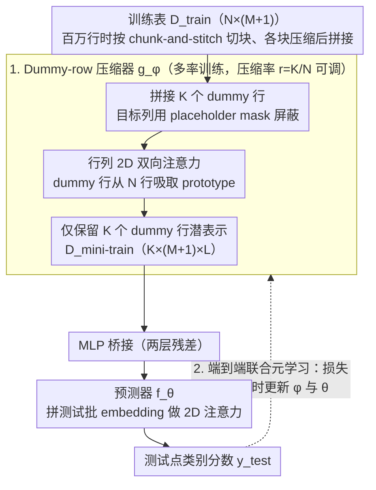

# End-to-End Compression for Tabular Foundation Models

**会议**: ICML 2026  
**arXiv**: [2602.05649](https://arxiv.org/abs/2602.05649)  
**代码**: https://github.com/machinelearningnuremberg/TACO (有)  
**领域**: 模型压缩 / 表格基础模型 / In-context Learning  
**关键词**: 表格基础模型, 上下文压缩, TabPFN, 端到端元学习, 推理加速  

## 一句话总结
TACO 在 TabPFN 类表格基础模型前面接一个可学习的 transformer 压缩器，把 $N$ 行训练上下文压成 $K\ll N$ 行的潜在表示后再喂给预测器，并与预测器端到端联合元学习，使得 1% 压缩率下推理快 94 倍、显存省 97% 而 ROC-AUC 几乎无损。

## 研究背景与动机

**领域现状**：表格预测领域近年的范式转移是从 GBDT 转向 in-context learning 的表格基础模型 (Tabular Foundation Model, TFM)，例如 TabPFN、TabICL、TabDPT，它们在合成数据上预训练，推理时直接把整个训练集作为上下文喂进双向 transformer 做一次前向。

**现有痛点**：TFM 用的是行列 2D 双向注意力，复杂度对训练样本数 $N$ 是 $\mathcal{O}(N^2 M)$，即使做 KV cache 也降到 $\mathcal{O}(NM)$。当 $N\times M$ 达到几十万 cell 时显存就爆，逼得作者只能用小到中型表，或者强行做行/列子采样。

**核心矛盾**：注意力上下文长度直接绑死了"输入信息量"和"推理成本"——想要预测精度就得喂全表，喂全表又跑不动。已有缓解（MotherNet 蒸馏成 MLP、TabFlex 线性注意力）要么牺牲精度，要么改架构，**没人尝试以端到端方式直接压缩训练上下文本身**。

**本文目标**：在不改 TFM 骨架、不掉精度的前提下，把 in-context 上下文从 $N$ 行压到 $K$ 行（$K\ll N$），并把推理复杂度线性降低 $N/K$ 倍。

**切入角度**：把 in-context learning 拆成"压缩器 $g$"+"预测器 $f$"两个模块，让压缩器只学一件事——产出能让下游预测器准确预测的最小训练集摘要 $D^{\text{mini-train}}$。这其实是把 dataset distillation 的思想搬进 TFM 推理流程。

**核心 idea**：插入一个 transformer 压缩器把训练表压到 $K$ 个 prototypical 行，与预测器**联合元学习**，使得"压缩"这件事直接服务于"下游预测精度"。

## 方法详解

### 整体框架

TACO 由两个 TabPFN v2 风格的 2D-attention transformer 串联：

1. **压缩器** $g_\phi$：输入 $D^{\text{train}}\in\mathbb{R}^{N\times(M+1)}$ + 一张 $K\times(M+1)$ 的 dummy 表（dummy 行从训练集随机抽样初始化，目标列用特殊 placeholder 屏蔽）。经过若干层行列交替注意力后，dummy 行的位置吸收了真实训练表的信息，输出 $D^{\text{mini-train}}\in\mathbb{R}^{K\times(M+1)\times L}$。
2. **MLP 桥接**：两层残差 MLP 衔接两个 transformer 的潜空间。
3. **预测器** $f_\theta$：用标准 TabPFN v2 架构，把 $D^{\text{mini-train}}$ 与测试批 embedding $\mathcal{E}_f(x^{\text{test}})$ 拼起来送入注意力块，输出测试点类别分数。

两个模块都是 12 层 / 6 head / 192 维、各 7M 参数。整个 pipeline 同时优化：

$$\arg\min_{\theta,\phi}\;\mathbb{E}_{(D^{\text{train}},D^{\text{test}})\sim p(D)}\;\mathcal{L}\!\left(y^{\text{test}},\;f(x^{\text{test}},g(D^{\text{train}};\phi);\theta)\right)$$

预训练 80k 步合成数据 + 11k 步真实数据，序列长度课程从 1k 渐进到 60k 行。压缩率 $r=K/N$。

### 关键设计

**1. Dummy-row attention：把训练表压成一把可微的"学习型 query"**

要把 $N$ 行训练表压成 $K\ll N$ 行又不能像 random/kNN 子采样那样硬丢信息，TACO 的做法是在压缩器输入端拼接 $K$ 个 dummy 行（目标列用 placeholder mask 掉），让双向注意力在 $N+K$ 行之间自由流通，输出端**只保留这 $K$ 个 dummy 行的潜在表示**作为 $D^{\text{mini-train}}$。dummy 行本质上是一组 learned query，在注意力里从 $N$ 行真实数据中吸取 prototypical 模式。它之所以比硬选择更强，是因为整个压缩过程**可微**、且压缩后的行不必等于任何一条原始行——压缩器可以凭空合成 prototype，这正是后文 Insight 5 中 TACO 显著超过 random/kNN 子采样的根因。

**2. 端到端联合元学习：让压缩器和预测器学会同一门"语言"**

如果只学压缩器、把预测器冻结成固定 TabPFN v2 权重，等于强迫压缩器去对齐一个它无法改变的下游模型，难度极大。TACO 反过来让两者**同时更新**：固定压缩率 $r$ 或多率混合训练时，每个采样的合成数据集都先压再预测，损失直接回传到 $\phi,\theta$ 两组参数，于是预测器会**主动适应**压缩潜空间。Insight 3 的消融把预测器初始化为 TabPFN v2 并冻结、只训压缩器，结果跨所有压缩率都全面差于联合训练——这说明"压缩"和"预测"必须共享同一套表示，本质是在找一对能互相理解的压缩-预测语言。

**3. 多率训练 + chunk-and-stitch：一份 checkpoint 同时支持任意压缩率与百万行表**

为避免给每个压缩率单独训一个模型，训练时每个合成数据集从 $r\in\{1\%,2\%,4\%,8\%,16\%\}$ 中均匀采样，让单一 checkpoint 学会率可变压缩，推理时直接靠 $r$ 参数化切换；Insight 4 验证这种 dynamic 训练相对率特定训练在 95% 置信度下没有显著性能损失。而面对压缩器训练时只见过 $\le 10^4$ 行的限制，超大表用 chunk-and-stitch 扩展：遇到 $N=10^6$ 就切成 100 个 $C=10^4$ 的块，每块独立压到 $K_C=100$ 行，再把各块摘要拼成全局 $D^{\text{mini-train}}$ 喂给预测器，从而把局部压缩经验推到任意 $N$，这是 Insight 6 上百万行实验跑通的关键。

### 损失函数 / 训练策略
直接复用 TFM 的分类交叉熵 / 回归 MSE 作为 in-context 损失；连续目标离散化为 ≤10 bin 以兼容分类训练。优化器 AdamW + cosine annealing，学习率 warmup 到 $1\times 10^{-4}$、weight decay $1\times 10^{-2}$、grad clip 1.0、混合精度。8×H100、20 天预训练。

## 实验关键数据

### 主实验

TabArena 26 个分类数据集，ROC-AUC（多分类用 one-vs-one）：

| Model | Mean ROC-AUC ↑ | 说明 |
|--------|----------------|------|
| TabICL | 0.866 ± 0.103 | SOTA TFM 基线 |
| TabPFN v2.0 | 0.866 ± 0.103 | SOTA TFM 基线 |
| POT（无压缩） | 0.862 ± 0.101 | 同架构无压缩对照 |
| TACO ($r=1\%$) | 0.855 ± 0.097 | 仅 1% 上下文 |
| TACO ($r=2\%$) | 0.857 ± 0.098 | |
| TACO ($r=4\%$) | 0.857 ± 0.099 | |
| TACO ($r=8\%$) | 0.858 ± 0.100 | |
| TACO ($r=16\%$) | 0.858 ± 0.101 | |

CD diagram 显示 1% 压缩率与 POT **无统计显著差异**。

### 推理效率（合成 15k 行 ×500 特征，无 KV cache）

| 方法 | Subsequent Predict | 加速比 | Predict 显存 | 显存节省 |
|------|-------------------|--------|--------------|----------|
| POT | 28.67 s | 1× | 22.45 GB | — |
| TACO 1% | 306 ms | **93.6×** | 549 MB | **−97.6%** |
| TACO 2% | 382 ms | 75.2× | 845 MB | −96.3% |
| TACO 4% | 544 ms | 52.7× | 1.41 GB | −93.7% |
| TACO 8% | 943 ms | 30.4× | 2.56 GB | −88.6% |
| TACO 16% | 1.91 s | 15× | 4.89 GB | −78.2% |

### 关键发现
- **压缩到 1% 几乎免费**：从 100% 上下文降到 1%，ROC-AUC 仅从 0.862 掉到 0.855（落在 std 之内），但推理快 94 倍、显存省 97.6%。
- **联合训练是必要条件**：冻结预测器只训压缩器，跨所有压缩率全面变差（Insight 3）；这说明"压缩"和"预测"必须共享语言。
- **TACO 显著超过 random/kNN 子采样**：相同压缩率下 ROC-AUC 差距随压缩率提高而缩小，验证学到的 prototype 优于硬选择（Insight 5）。
- **chunk-and-stitch 解锁百万行**：MetroPT-3 上 ~1.2M 训练行压到 1214 行（$r=0.1\%$），AUPRC 0.8955，超过 random/kNN 上下文的 POT/TabPFN v2 基线（Insight 6）。

## 亮点与洞察
- **把 dataset distillation 嵌进 in-context inference**：以往蒸馏服务于训练加速，TACO 第一次把"摘要训练集"做成 TFM 推理流水线的一部分，且端到端联合学习——这等于把 TFM 的"prompt 工程"自动化成"prompt 压缩"。
- **dummy-row 作为可微 query 的形式**：本质上是 Perceiver / Set Transformer 的 latent bottleneck 思想搬进表格世界，但因为目标列被 mask 而保留了"无标签摘要"的可解释性。
- **多率训练 → 一份 checkpoint 多种部署**：accuracy-latency 的连续 trade-off 由单一模型在推理时通过 $r$ 参数化调节，运维上几乎零成本。
- **chunk-and-stitch 思路可迁移**：任何"全局自注意力卡在 $O(N^2)$"的场景（长序列推理、retrieval 大 corpus 压缩）都可以借鉴"局部压缩 + 全局拼接"。

## 局限与展望
- 评估集中在 TabArena 分类，**未覆盖回归与时序**，预测器目前用了离散化把回归转成分类；回归/时间序列扩展是明确的下一步。
- 合成 prior 仍以 SCM 为主，对**真实世界的缺失值分布、时间分布漂移**覆盖有限，Helli et al. 2024 风格的时间漂移先验值得引入。
- 1% 压缩在 ROC-AUC 上虽然统计不显著但**绝对值低了 0.007**，对需要 calibration 或长尾类别的应用可能不够稳。
- chunk-and-stitch 假设各 chunk 同分布，**对存在 covariate shift 的分块没有专门的对齐机制**，是工程上的潜在风险点。

## 相关工作与启发
- **vs TabPFN v2 / TabICL**：用同一套 2D attention 架构，但加了上下文压缩器；推理复杂度从 $\mathcal{O}(N^2 M)$ 降到 $\mathcal{O}(K^2 M)$ 且 $K=0.01 N$，性能基本持平。
- **vs MotherNet**：MotherNet 把 transformer 蒸馏成 per-dataset MLP，是"压缩模型"；TACO 是"压缩上下文"，保留 in-context 灵活性的同时拿到加速。
- **vs TabFlex**：TabFlex 用线性注意力把复杂度从 $N^2$ 降到 $N$，但精度有限；TACO 直接砍上下文长度，效果更猛。
- **vs random / kNN 子采样**：硬选择丢信息，TACO 的 dummy-row 可微压缩能合成 prototype，在 1–16% 压缩率上一致占优。

## 评分
- 新颖性: ⭐⭐⭐⭐ 在 TFM 流水线里端到端加可微上下文压缩器是首创，但 dummy-row 思想与 Perceiver / Set Transformer 有继承关系。
- 实验充分度: ⭐⭐⭐⭐⭐ 6 个 Insight + TabArena/TabFSbench/TableShift/MetroPT-3 多基准 + 详尽消融（联合训练 / 多率 / 基线对比 / 大数据集 chunking）。
- 写作质量: ⭐⭐⭐⭐ Insight 编号清晰，理论部分浅但够用；图表稍多但定位明确。
- 价值: ⭐⭐⭐⭐⭐ 直接解决 TFM 落地的最大痛点（大表跑不动），开源 checkpoint，工业实时预测场景几乎可即插即用。

<!-- RELATED:START -->

## 相关论文

- [\[ICML 2026\] Towards Resource-Efficient LLMs: End-to-End Energy Accounting of Distillation Pipelines](towards_resource-efficient_llms_end-to-end_energy_accounting_of_distillation_pip.md)
- [\[ICML 2026\] Auditing and Fixing Economic Validity in Tabular Foundation Models for Discrete Choice](auditing_and_fixing_economic_validity_in_tabular_foundation_models_for_discrete_.md)
- [\[CVPR 2026\] A Paradigm Shift: Fully End-to-End Training for Temporal Sentence Grounding in Videos](../../CVPR2026/model_compression/a_paradigm_shift_fully_end-to-end_training_for_temporal_sentence_grounding_in_vi.md)
- [\[ICML 2026\] Quantifying the Uncertainty of Foundation Models with Singular Value Ensembles](quantifying_the_uncertainty_of_foundation_models_with_singular_value_ensembles.md)
- [\[ICML 2026\] BioArc: Discovering Optimal Neural Architectures for Biological Foundation Models](bioarc_discovering_optimal_neural_architectures_for_biological_foundation_models.md)

<!-- RELATED:END -->
