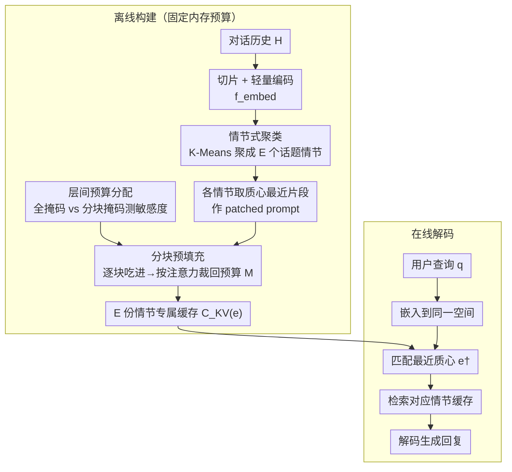

# EpiCache: Episodic KV Cache Management for Long-Term Conversation on Resource-Constrained Environments

**会议**: ICML 2026  
**arXiv**: [2509.17396](https://arxiv.org/abs/2509.17396)  
**代码**: 待确认  
**领域**: 模型压缩  
**关键词**: KV缓存压缩, 长对话, 情节式管理, 分块预填充, 内存受限推理

## 一句话总结
提出 EpiCache，一个免训练的 KV 缓存管理框架，通过分块预填充控制内存上限、情节式聚类保留话题相关上下文、层级敏感度感知的预算分配优化层间缓存分配，在三个长对话 QA 基准上以 4-6 倍压缩率达到接近全缓存精度，并将峰值内存降低 3.7 倍。

## 研究背景与动机

**领域现状**：现代 LLM 的上下文长度已扩展到百万 token 级别，使对话 AI 能利用长期对话历史生成连贯、个性化的回复。主流 KV 缓存压缩方法（如 H2O、SnapKV、KVzip）在全量预填充后执行缓存驱逐（post-prefill eviction），根据注意力分数保留重要 token 的 KV 对。

**现有痛点**：第一，post-prefill 方法在预填充阶段需要缓存完整上下文，峰值内存随输入长度线性增长，无法部署到手机等内存受限设备。例如 LLaMA3.2-3B 在仅 30 个对话会话后 KV 缓存即超过 7GB——比模型参数还大。第二，query-dependent 驱逐（如 SnapKV）将缓存语义窄化到单个查询，在多轮对话中后续问题的答案证据可能已被驱逐。

**核心矛盾**：内存有界性（bounded memory）与答案准确性之间存在严重 trade-off。直接将 post-prefill 方法搬到 block-prefill 框架下会导致精度急剧下降，因为分块处理时缺乏全局上下文来判断 token 重要性。

**本文目标**：在严格固定内存预算下实现高质量的长对话问答（LongConvQA），同时保证峰值内存可控。

**切入角度**：对话历史自然具有情节结构——连续的对话围绕不同话题展开。通过将历史聚类为多个话题情节、为每个情节构建专属 KV 缓存，可以在查询时只加载最相关的情节缓存，既节省内存又保留话题相关上下文。此外，不同 Transformer 层对分块预填充的敏感度不同，可以据此自适应分配层间预算。

**核心 idea**：将长对话聚类为语义连贯的情节（episodes），为每个情节构建压缩后的 KV 缓存，查询时通过嵌入匹配检索最相关的情节缓存进行解码。

## 方法详解

### 整体框架
EpiCache 想解决的是：在手机这种内存卡死的设备上，让 LLM 记住几百轮的对话历史还能准确答题。它把问题拆成离线和在线两段。离线阶段先把对话历史聚成 $E$ 个话题情节，给每个情节用分块预填充单独压一份 KV 缓存，同时校准出每一层该分多少缓存预算；在线阶段把用户查询嵌入到同一空间，匹配最近的情节质心，只加载那一份情节缓存来解码。这样既把峰值内存压成常数，又能按话题保留住答案需要的上下文。

### 关键设计

**1. 情节式 KV 缓存：按话题给历史建独立缓存，不必预知未来查询**

query-dependent 驱逐（如 SnapKV）的死穴是它得围绕"当前这一个查询"裁缓存，多轮对话里后续问题的证据早被裁掉了；而 query-agnostic 又留不住针对性强的 token。EpiCache 的破局点是把缓存做成 **topic-aware**：先把对话历史 $\mathcal{H}$ 按 $w_{\text{embed}}$ 个话语切片，用轻量编码器 $f_{\text{embed}}$ 编码每片，再 K-Means 聚成 $E$ 个情节 $\{\mathcal{E}_1, \ldots, \mathcal{E}_E\}$。每个情节里找出距质心最近的代表性片段 $S_{\text{centroid-closest}}$，拿它当 patched prompt 去引导该情节的驱逐——注意力得分高的 token 留下，形成情节专属缓存 $C_{\text{KV}}^{(e)}$。之所以有效，是因为同一话题的代表性片段在语义上接近未来会问到这个话题的查询，于是"用代表片段裁出的缓存"近似于"用真实查询裁出的缓存"，绕开了必须预知查询的难题。解码时只需把查询 $q_i$ 嵌入同一空间，取最近质心 $e^\dagger = \arg\max_e \cos(\mathbf{q}_i, \mathbf{c}_e)$，检索对应缓存即可。

**2. 分块预填充：把峰值内存钉死成常数，不随历史变长而涨**

post-prefill 方法（H2O、SnapKV）必须先把完整上下文缓存进来再驱逐，峰值内存随输入长度线性增长——LLaMA3.2-3B 跑 30 个会话 KV 缓存就破 7GB，比模型本身还大，根本塞不进手机。EpiCache 改成把输入切成大小 $M_{\text{block}}$ 的块逐块处理：每吃完一个块，立刻按注意力得分驱逐低分 token，把缓存压回预算 $M$，于是峰值内存恒定在 $M + M_{\text{block}}$。驱逐用的 token 重要性分数来自上面那个 patched prompt 的引导——$s_i^{\max} = \max_{t \in [n+1, n+p]} \text{Attn}(x_t \to x_i)$，即代表片段 token 对上下文 token $x_i$ 的最大注意力权重。难点在于分块时每个块只看得到局部上下文，单纯照搬 post-prefill 的全局重要性判据会失准，而 patched prompt 恰好提供了一个稳定的"话题锚点"，让局部驱逐也能对齐全局话题语义。

**3. 敏感度感知的层间预算分配：哪层经不起分块就多给缓存**

作者发现一个关键现象：不同 Transformer 层对分块预填充的敏感度差异巨大，且这种差异是模型固有的（跟输入无关），所以均匀给每层分一样的预算是浪费。具体做法是用全因果掩码 $\mathcal{M}$ 和分块掩码 $\mathcal{M}'$ 各前向传播一次，比较每层 Key 状态在两种掩码下的余弦相似度 $\sigma_\ell = \frac{1}{HN}\sum_{h,i} \cos(k_{\text{full},i}^{(\ell,h)}, k_{\text{block},i}^{(\ell,h)})$；相似度越低说明这层越扛不住分块，于是定义敏感度 $s_\ell = 1 - \sigma_\ell$，按

$$M_\ell^{\text{alloc}} = \frac{s_\ell^\alpha}{\sum_j s_j^\alpha} \cdot (L \cdot M)$$

把总预算 $L \cdot M$ 倾斜给敏感层。$\alpha$ 控制分配的锐利度，太大反而把预算过度集中（实验里 $\alpha=2\text{-}4$ 最佳、$\alpha=8$ 反而掉点）。因为敏感度是模型相关而非输入相关，整个校准只需一次前向、跑一个样本就能定下全部层间权重，几乎零成本却带来 +4.1 的精度。

### 一个完整示例
拿一段 90K token、横跨"旅行计划 / 健康饮食 / 工作项目"三个话题的对话历史走一遍：离线阶段先把它切片、编码、K-Means 聚成 $E=3$ 个情节，每个情节挑出离质心最近的片段当 patched prompt，对各自情节做分块预填充——逐块吃进、逐块按注意力驱逐，最终每个情节压成一份 8K 预算的缓存，整段历史的峰值内存全程不超过 $M + M_{\text{block}}$。在线阶段用户问"我上次说想去哪家餐厅？"，把这句嵌入后与三个质心算余弦，命中"健康饮食"情节，只加载那一份 8K 缓存解码——既不用把 36GB 的全缓存搬进来，又因为这份缓存是在全对话上下文里 block-wise 构建的，保留了全局话题语义，跨情节证据也不至于丢失。

## 实验关键数据

### 主实验（Qwen3-4B, RealTalk）

| 方法 | 预算 | Multi-hop | Temporal | Common | Avg |
|------|------|-----------|----------|--------|-----|
| Full KV | — | 53.6 | 61.7 | 52.2 | 56.9 |
| RAG-Episodic | 8K | 42.3 | 22.4 | 41.0 | 33.4 |
| KVzip | 8K | 34.4 | 35.0 | 43.3 | 36.0 |
| EpiCache (本文) | 8K | **51.7** | **55.7** | **54.7** | **53.9** |

### 消融实验（Qwen3-4B, RealTalk, 8K 预算）

| 配置 | Avg | 说明 |
|------|-----|------|
| Utterance 分段 + Qwen3-Emb-0.6B | 49.8 | 基础配置（无预算分配） |
| Word 分段 | 47.5 | 打断自然话语边界，精度下降 |
| LLM-embedding 替代 | 43.0 | 用 LLM 嵌入层效果差 |
| E=2 (少情节) | 47.9 | 情节太少不够细粒度 |
| E=8 (多情节) | 51.3 | 更多情节小幅提升 |
| + 层间预算分配 α=2 | **53.9** | 敏感度分配贡献 +4.1 |
| + 层间预算分配 α=8 | 49.8 | 过锐利的分配反而有害 |

### 效率分析（LLaMA3.2-3B, 90K token 历史, 300 轮后续对话）

| 方法 | 峰值内存 (GB) | 总延迟 (s) | 每轮延迟 (s) | 精度 |
|------|-------------|-----------|-------------|------|
| Full KV (无缓存) | 36.3 | 9339.0 | 31.1 | 46.2 |
| Full KV (prefix caching) | 36.3 | 1062.8 | 3.5 | 46.2 |
| EpiCache (8K) | **9.6** | **545.4** | **1.8** | 45.6 |

### 关键发现
- EpiCache 在所有缓存预算级别和基准上一致优于所有基线（KVzip、OracleKV、SnapKV、StreamingLLM、InfiniPot、KeyDiff），尤其在低预算（2-4K）下优势最大——在 Qwen3 系列上改善幅度高达 30 个绝对分值
- 在 4-6 倍压缩率下达到接近 Full KV 的精度，同时峰值内存减少 3.5 倍、解码延迟加速 2.4 倍
- 层间敏感度是模型相关而非输入相关的特性，单样本校准即可获得稳定的层间权重
- 情节式缓存对跨情节查询（需要多个话题的证据）也表现鲁棒，因为每个情节缓存是在全对话上下文的 block-wise prefill 中构建的，保留了全局上下文化的表示

## 亮点与洞察
- 将对话的情节结构引入 KV 缓存管理，是一个优雅的抽象——不需要预知未来查询，只需聚类找到代表性片段就能近似未来查询的语义方向。这个 insight 可以迁移到长文档 QA 的缓存管理中
- 层间敏感度感知分配是一个低成本高回报的设计：只需两次前向传播校准，不需要重复测量，却带来 +4.1 的精度提升
- 框架是完全免训练的，可以直接应用到任何现成 LLM 上，部署友好

## 局限与展望
- 情节数量 $E$ 目前需要手动设定，自适应确定最优情节数是明确的改进方向
- 当情节缓存超出预算时需要重新聚类和重建，增量更新压缩缓存的方法尚未实现
- 仅在对话 QA 和文档 QA 上验证，更复杂的长期记忆场景（如隐式用户偏好追踪、知识更新与遗忘）尚未测试
- 情节聚类依赖外部轻量级编码器（Qwen3-Emb-0.6B），跨域泛化性有待验证

## 相关工作与启发
本文与 KV 缓存压缩（H2O、SnapKV、KVzip）、基于检索的对话记忆（MemoryBank、SeCom）、以及缓存检索方法（Quest、ClusterKV、IceCache）形成交叉。关键启发在于：KV 缓存压缩不应该是 query-agnostic 也不应该是 query-dependent 的，而应该是 topic-aware 的——按话题组织缓存，查询时检索最相关话题的缓存，兼顾了通用性和相关性。这个思路可以拓展到多模态长上下文场景中。

<!-- RELATED:START -->

## 相关论文

- [\[NeurIPS 2025\] KeyDiff: Key Similarity-Based KV Cache Eviction for Long-Context LLM Inference in Resource-Constrained Environments](../../NeurIPS2025/model_compression/keydiff_key_similarity-based_kv_cache_eviction_for_long-context_llm_inference_in.md)
- [\[ICML 2026\] Memory-Efficient Partitioned DNN Inference on Resource-Constrained Android Crowds](memory-efficient_partitioned_dnn_inference_on_resource-constrained_android_crowd.md)
- [\[ICML 2026\] xKV: Cross-Layer KV-Cache Compression via Aligned Singular Vector Extraction](xkv_cross-layer_kv-cache_compression_via_aligned_singular_vector_extraction.md)
- [\[ICML 2026\] A Queueing-Theoretic Framework for Stability Analysis of LLM Inference with KV Cache Memory Constraints](a_queueing-theoretic_framework_for_stability_analysis_of_llm_inference_with_kv_c.md)
- [\[ICML 2026\] Semantic Integrity Matters: Benchmarking and Preserving High-Density Reasoning in KV Cache Compression](semantic_integrity_matters_benchmarking_and_preserving_high-density_reasoning_in.md)

<!-- RELATED:END -->
