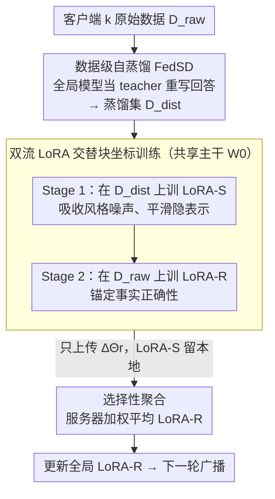

# FedSDR: Federated Self-Distillation with Rectification

**会议**: ICML 2026  
**arXiv**: [2605.18028](https://arxiv.org/abs/2605.18028)  
**代码**: 待确认  
**领域**: 模型压缩 / 联邦微调 / 自蒸馏  
**关键词**: 联邦学习, LLM 指令微调, 自蒸馏, 双流 LoRA, 选择性聚合  

## 一句话总结
针对联邦 LLM 微调中客户端数据分布异质带来的"权重漂移"，本文先用模型自身把原始指令重写到"模型可理解空间"做数据级对齐（FedSD），再用 LoRA-S/LoRA-R 双流结构分别吸收风格噪声和锚定事实正确性、并只聚合 LoRA-R，把对齐与忠实解耦，从而在多种 Non-IID 设置下取得 SOTA。

## 研究背景与动机
**领域现状**：在隐私约束下，联邦学习（FL）已经成为 LLM 指令微调的标准范式，参数高效的 LoRA 因为通信代价低而被广泛采用；为了缓解客户端数据 Non-IID 带来的 client drift，主流做法要么对本地更新加正则（FedProx、SCAFFOLD），要么用双 LoRA 把"全局共享"和"客户端个性化"分开（FedDPA 等）。

**现有痛点**：这些方法都把异质性当作"权重发散"现象去治，结果是症状（梯度方向打架、聚合后掉点）被局部压住，但根本的数据分布错配并没有被触碰；当客户端真实数据是金融、医学、代码这种语义跨度极大的组合时，单靠权重端的约束力度不够，聚合模型仍然在多任务平均上严重退化。

**核心矛盾**：异质性的根源在数据端而不是模型端。被广播的全局模型必须同时拟合若干"几乎不相交"的客户端流形，约束太强会扼杀个性化，约束太弱又压不住漂移，这是一个无法在模型端令双方都满意的取舍。

**本文目标**：从数据视角直接缩小客户端之间的分布距离，同时保证聚合后的全局模型既"对齐"又"忠于事实"。

**切入角度**：作者观察到 LLM 自身已经掌握一个连贯的"先天知识分布"，让模型把每个客户端的回答都用自己的口吻重写一遍，相当于把所有客户端的数据投影到同一个生成流形上；t-SNE、JS 散度、TF-IDF 余弦相似度以及跨任务梯度方向都验证了这个流形展平效应。

**核心 idea**：把"对齐"留给自蒸馏数据上训练的 LoRA-S（只留本地，吸收风格与异质噪声），把"忠实"留给原始数据上训练的 LoRA-R（仅上传聚合），用结构化解耦同时拿到对齐和保真。

## 方法详解

### 整体框架
FedSDR 想解决的是：联邦微调 LLM 时客户端数据语义跨度太大（金融、医学、代码混在一起），聚合后模型在多任务平均上严重退化，而这退化的根子在数据分布错配、不在权重发散。它的对策是一条 "Generate – Align – Rectify" 流水线：每个客户端 $k$ 在加入联邦训练前，先用当前全局模型当老师把本地原始数据 $D_{raw}=\{(c_i,x_i,y_i)\}$ 重写一遍，生成 $\tilde y_i\sim f_{\Theta_{teacher}}(\cdot\mid c_i,x_i,y_i)$，得到风格统一的蒸馏集 $D_{dist}$；本地训练时主干 $W_0$ 同时挂两套 LoRA，前向并联 $h_{out}=W_0 h+\tfrac{\alpha}{r}B_rA_r h+\tfrac{\alpha}{r}B_sA_s h$，让吸噪流 LoRA-S 在每次前向都给修正流 LoRA-R 喂"已平滑"的隐表示；到了上传阶段只把 LoRA-R 的增量 $\Delta\Theta_{r,k}$ 推给服务器做加权平均，LoRA-S 永远留在本地。这样噪声留在本地、事实送上云端，既不增加通信比特数（聚合的仍只是一组 LoRA），又躲开了"幻觉聚合"。注意自蒸馏只在训练前跑一次，之后所有通信轮复用同一份 $D_{dist}$，推理代价不随轮次累乘。

### 关键设计

**1. 数据级自蒸馏（Data Refinery, FedSD）：在源头把异质数据投影到同一生成流形**

主流联邦方法都在权重端治异质性（加正则、拆双 LoRA），但症状被压住、数据分布错配的根因没动，遇到语义跨度极大的客户端组合就力不从心。FedSDR 换到数据端下手：客户端用全局模型作 teacher，把每条样本的回答都用模型自己的口吻重写一遍，相当于把所有客户端数据投影到 LLM 同一个"先天知识分布"上。具体只需把标准聚合算法（FedAvg/Prox/Yogi 等）照常跑，仅把监督信号从 $y$ 换成 $\tilde y$，本地目标变成 $\mathcal{L}^k_{\text{FedSD}}(\Theta)=\tfrac{1}{n_k}\sum_i -\log f_\Theta(\tilde y_i\mid c_i,x_i)$。这一步带来的"流形展平"是可量化的：文本侧 JS 散度从 $0.4074$ 降到 $0.3611$、TF-IDF 余弦相似度从 $0.6362$ 升到 $0.7064$；优化侧五个任务两两间的梯度余弦相似度平均提升 $+8\sim+41$ pp。因为这套改造只换监督信号、不碰聚合协议，它和任意聚合算法正交，可作通用增强器叠加。

**2. 双流 LoRA + 交替块坐标训练（Dual-Stream Rectification）：把"对齐"和"忠实"解耦到两组参数**

自蒸馏并非无代价——存在"重写悖论"：约 $47\%$ 的蒸馏样本不能严格蕴含真值，回答更冗长、填充词频翻倍。如果让一个模型同时学"对齐"和"事实正确"这两个互相干扰的目标，结果是各让一步、谁也不彻底。FedSDR 用两套共享前向 $h_{out}=W_0h+\tfrac{\alpha}{r}(B_rA_r+B_sA_s)h$ 的 LoRA 把目标拆开，训练分两阶段交替进行：Stage 1 冻结 $\Theta_r$、在蒸馏集上让吸噪流学平滑，$\mathcal{L}_{smooth}(\Theta_s\mid\Theta_r)=\mathbb{E}_{D_{dist}}[-\log p_{\Theta_r,\Theta_s}(\tilde y\mid c,x)]$；Stage 2 冻结 $\Theta_s$、在原始数据上让修正流锚定事实，$\mathcal{L}_{rect}(\Theta_r\mid\Theta_s)=\mathbb{E}_{D_{raw}}[-\log p_{\Theta_r,\Theta_s}(y\mid c,x)]$。由于 Stage 1 已把表示空间平滑过一遍，Stage 2 优化 $\Theta_r$ 的难度随之降低（作者观察到原始数据上的优化曲线更平滑，称这种结构为 "shock absorber"），从而让风格噪声和事实修正各归其位、互不拖累。

**3. 选择性聚合（Selective Aggregation）：只让"修正后的事实"进入全局共识**

在 FL 里，重写悖论比集中式训练危险得多：本地的轻微幻觉一旦被服务器聚合就会广播给所有客户端，形成越聚越偏的正反馈循环。FedSDR 直接从聚合协议层切断这条路径——上传时每个客户端把 $\Theta_s$ 留在本地（或重置），只推 $\Delta\Theta_{r,k}$，服务器执行加权平均 $\Theta_{r,global}\leftarrow\Theta_{r,global}+\sum_{k=1}^{K}\tfrac{n_k}{n}\Delta\Theta_{r,k}$。因为 Stage 1 已让 $\Theta_s$ 吃下了客户端各自的风格噪声与冗长，把它截留在本地后，这些噪声就再没机会通过聚合凝成"伪共识"，全局模型只继承被 LoRA-R 修正过的事实知识。

### 损失函数 / 训练策略
本地训练遵循交替块坐标更新：$\Theta_s\leftarrow\arg\min_{\Theta_s}\mathcal{L}_{smooth}(\Theta_s\mid\Theta_r)$，$\Theta_r\leftarrow\arg\min_{\Theta_r}\mathcal{L}_{rect}(\Theta_r\mid\Theta_s)$，两阶段共享同一前向但同一时刻只有一条流可训。服务器仅聚合 $\Theta_r$，通信成本与单 LoRA 基线一致；自蒸馏只跑一次，不随通信轮次累乘推理代价。

## 实验关键数据

### 主实验
FedSD 作为通用增强器叠加到 6 种经典聚合算法上，整体得分（Overall）以及四个评测子集（MMLU、BBH、CRASS、DROP）全部提升，对手 base 的胜率（Head-to-Head Win Rate）均在 55% 以上。

| 算法 | 整体得分 (Base → Ours) | MMLU (Base → Ours) | BBH (Base → Ours) | CRASS (Base → Ours) | DROP (Base → Ours) | 胜率 |
|------|------------------------|--------------------|-------------------|---------------------|--------------------|------|
| FedAvg | 71.21 → 74.54 | 40.71 → 43.69 | 30.79 → 31.88 | 47.81 → 56.57 | 36.04 → 36.41 | 56.14% |
| FedAvgM | 68.18 → 73.34 | 8.72 → 11.81 | 6.71 → 8.18 | 12.77 → 20.07 | 15.64 → 15.75 | 60.30% |
| FedProx | 70.93 → 74.96 | 40.54 → 42.94 | 30.82 → 31.35 | 45.62 → 50.73 | 37.50 → 36.68 | 56.12% |
| FedYogi | 69.17 → 73.56 | 29.92 → 39.32 | 29.12 → 30.50 | 42.34 → 45.26 | 24.53 → 29.28 | 60.37% |
| FedAdam | 71.03 → 74.93 | 30.49 → 39.36 | 28.51 → 30.69 | 36.50 → 51.46 | 27.32 → 30.54 | 57.82% |
| FedAdagrad | 71.87 → 75.13 | 40.69 → 43.21 | 31.43 → 32.56 | 43.07 → 51.09 | 35.80 → 36.21 | 56.78% |

### 消融与机制分析
"重写悖论"和"分布对齐"两条机制都得到了量化支持：JS 散度下降、TF-IDF 余弦上升验证了文本级对齐，跨任务梯度余弦平均增益验证了优化级对齐。

| 分析维度 | 指标 | 原始数据 (Raw) | 自蒸馏后 (Distilled) | 变化 |
|----------|------|---------------|----------------------|------|
| 文本分布对齐 | JS 散度 ↓ | 0.4074 | 0.3611 | $-0.0463$ |
| 文本分布对齐 | TF-IDF 余弦 ↑ | 0.6362 | 0.7064 | $+0.0702$ |
| 跨任务梯度方向 (FinGPT 源) | 余弦相似度 ↑ | — | — | $+41.5$ pp |
| 跨任务梯度方向 (MathInstruct 源) | 余弦相似度 ↑ | — | — | $+13.8$ pp |
| 跨任务损失迁移 (MedAlpaca 源) | 损失变化 ↓ | — | — | $-5.4$ pp |
| 重写悖论 | 不蕴含真值的蒸馏样本占比 ↓ | — | $\approx 47\%$ | — |

### 关键发现
- "FedSD 作为通用增强器"这一论点被实验直接支持：在 6 种聚合算法、4 个评测集上几乎是全方位提升，最大单格涨幅出现在 FedAvg+CRASS 上（$+8.76$ 分）；这意味着把数据端先对齐一遍带来的红利远大于任何单一聚合改进。
- "重写悖论"是真实的，并且在 FL 中尤其危险：约 $47\%$ 的蒸馏样本不能严格蕴含真值，回答平均更长、填充词频率翻倍；如果不引入 LoRA-R 锚定原始数据，这些瑕疵会被服务器广播形成伪共识。
- 双流不是"两套模型"的简单堆叠：LoRA-S 在前向中提供平滑的隐表示，作者实验观察到这让 LoRA-R 在原始数据上的优化曲线更平滑（"implicit smoothing eases raw-data learning"），呼应论文一开始把数据对齐而非权重对齐当根因的判断。
- FedAvgM 的初始基线分（MMLU 8.72、BBH 6.71）显著低于其他算法，加上 FedSD 后整体得分跳到 73.34、胜率 60.30%，说明数据级对齐对"本身就更不稳定的聚合器"反而救场效应更明显。

## 亮点与洞察
- 把异质性问题从"权重发散"重新定义成"数据流形错位"，是一次干净利落的视角换位 — 用 t-SNE + JS 散度 + 梯度余弦三种证据交叉验证"流形展平"这一现象，论证充分且具有迁移价值。
- 双流 LoRA 的设计很优雅：两条流在前向中并联共享一个主干，训练时块坐标交替；这种"前向耦合、反向解耦"的结构避免了多任务平均带来的目标冲突，是一个可被其他对齐 vs 保真冲突场景（如 RLHF、安全对齐）直接借用的模式。
- 选择性聚合的洞察值得划重点：在 FL 中只要某种噪声会进入聚合，它就会被广播放大；与其事后清洗，不如在通信协议层就把噪声留在本地，这相当于把"信息熵管理"放进了系统设计而非算法设计。

## 局限与展望
- 自蒸馏一次性生成 $D_{dist}$ 的成本对超大模型不可忽略，论文没有充分讨论这部分本地算力开销；若客户端是边缘设备，这一阶段可能反而成为瓶颈。
- LoRA-S 永久留在本地虽然避免了噪声广播，但也意味着客户端模型与全局模型之间存在结构差异，对长周期联邦部署、客户端更替（churn）、新客户端冷启动等场景的鲁棒性需要进一步验证。
- "重写悖论"的指标主要靠定性 case study + 一两个统计量（蕴含比、长度、填充词频）刻画，缺少一个统一的"事实性 / 风格性"度量；后续工作可以引入更细粒度的事实一致性评估来量化 LoRA-R 是否真的修复了 LoRA-S 引入的所有瑕疵。
- 实验主要在 LLM 指令微调任务上展开，对多模态、Tool-Use 等更复杂的输出空间是否仍然满足"自蒸馏=对齐"的前提，没有给出证据。

## 相关工作与启发
- **vs FedProx / SCAFFOLD**：这些方法在权重端加正则约束 client drift，治标但不动数据根因；FedSDR 在数据端做投影，再叠加任意聚合算法都能带来增益，二者并不互斥。
- **vs FedDPA（双 LoRA）**：FedDPA 把双 LoRA 用作"全局共享 + 客户端个性化"的解耦，仍然是模型中心视角；FedSDR 的双 LoRA 解耦的是"分布平滑 vs 事实修正"，目标层次更高、对幻觉聚合给出了显式应对。
- **vs FedGen / FedDistill（联邦 KD）**：这类方法依赖公共代理数据集或额外 generator 来跨客户端传递 logits，对 LLM 场景不实用；FedSDR 用模型自身作 teacher，避免了代理数据与额外网络。
- **vs 集中式自蒸馏（WizardLM / Alpaca 系）**：集中式自蒸馏更关注指令质量，把"重写悖论"当成可接受的代价；本文指出在 FL 中由于聚合广播效应，该悖论必须被显式治理，从而把自蒸馏从"数据增广技巧"升级为"分布管理工具"。
- **vs 个性化 FL（pFedMe / Per-FedAvg 等）**：这类方法允许每个客户端保留自己的个性化模型，但牺牲了全局共识；FedSDR 仍然产出统一的全局 LoRA-R，同时把异质性吸收到本地 LoRA-S 中，更适合"统一部署 + 本地适配"的工业场景。

<!-- RELATED:START -->

## 相关论文

- [\[ICML 2026\] FedRot-LoRA: Mitigating Rotational Misalignment in Federated LoRA](fedrot-lora_mitigating_rotational_misalignment_in_federated_lora.md)
- [\[ICML 2026\] PRISM: Synergizing Vision Foundation Models via Self-Organized Expert Specialization](prism_synergizing_vision_foundation_models_via_self-organized_expert_specializat.md)
- [\[ICML 2026\] OSAQ: Outlier Self-Absorption for Accurate Low-bit LLM Quantization](osaq_outlier_self-absorption_for_accurate_low-bit_llm_quantization.md)
- [\[ICCV 2025\] Soft Separation and Distillation: Toward Global Uniformity in Federated Unsupervised Learning](../../ICCV2025/model_compression/soft_separation_and_distillation_toward_global_uniformity_in_federated_unsupervi.md)
- [\[ICML 2026\] UB-SMoE: Universally Balanced Sparse Mixture-of-Experts for Resource-Adaptive Federated Fine-tuning of Foundation Models](ub-smoe_universally_balanced_sparse_mixture-of-experts_for_resource-adaptive_fed.md)

<!-- RELATED:END -->
