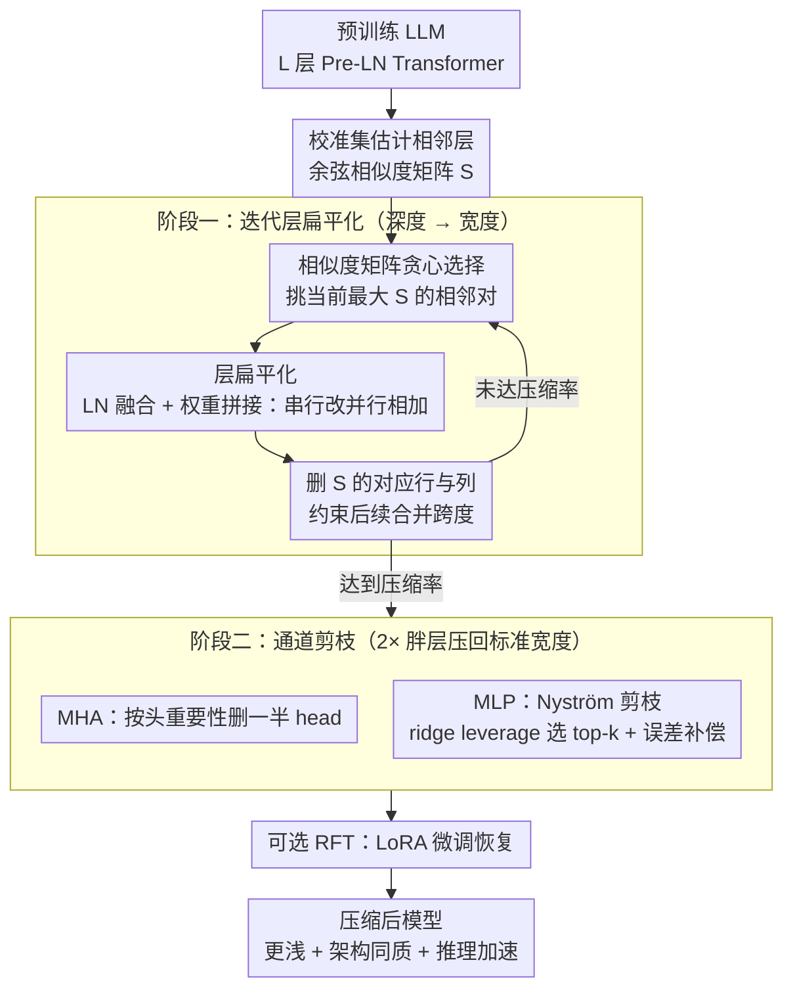

# FlattenGPT: Depth Compression for Transformer with Layer Flattening

**会议**: ICML 2026  
**arXiv**: [2602.08858](https://arxiv.org/abs/2602.08858)  
**代码**: 未公开  
**领域**: 模型压缩 / LLM 加速 / 深度剪枝  
**关键词**: LLM 剪枝, 深度压缩, 层合并, 通道剪枝, Nyström 近似

## 一句话总结
本文提出 FlattenGPT，先把 LLM 中输入相似度高的相邻 transformer 层"扁平化"合并为一个 2× 宽度的层 (保留所有参数知识)，再对合并层做通道剪枝把宽度恢复到原始规模——既享受深度压缩的推理加速，又避免传统层剪枝直接丢知识的性能塌方。

## 研究背景与动机

**领域现状**：LLM 推理成本高昂催生两条剪枝路线。深度剪枝 (SLEB、ShortGPT、LaCo) 直接删整个 transformer block，加速比高但性能掉得多；通道剪枝 (LLM-Pruner、SliceGPT) 保留每层但删宽度，性能好但加速不明显，且各层剪枝率不一致破坏架构同质性。

**现有痛点**：深度剪枝的根本问题是"粗粒度删除"——一个 block 里有些 head/channel 学到了关键知识，但只要这个 block 整体被判定为"冗余"，所有知识就一起被丢；通道剪枝的根本问题是"架构不一致"——LoRA 等下游应用、CUDA kernel、推理引擎都需要统一架构才能高效执行。两条路线之间存在明显空隙。

**核心矛盾**：深度冗余客观存在 (作者用 Lemma 2.1/2.2 证明深层 hidden state 方差以 $\Theta(\ell^2)$ 增长、梯度被 residual 主导退化为恒等映射)，但"删整块"和"保留所有块"之间没有中间选项。理论上可以"合并两层"，难点是怎么合并才能既减少参数又不损性能。

**本文目标**：(a) 找到一种"合并相邻层"的操作让相邻层的知识能被同时保留并继续协作；(b) 在合并后压回原始宽度，保持架构同质性。

**切入角度**：Pre-LN Transformer 中相邻层的 hidden state $\mathbf{H}^\ell, \mathbf{H}^{\ell+1}$ 余弦相似度普遍 >0.9，作者意识到若两层输入几乎相同，把它们的 MHA 和 MLP 改成"并行执行后相加"在数学上接近原"串行执行"，但参数物理上变成同层的"双倍宽度"——这正好把深度问题变成了宽度问题，可以用通道剪枝精细处理。

**核心 idea**：先扁平化 (深度→宽度) 再通道剪枝 (宽度恢复)，两步串联实现"知识保留 + 架构同质 + 推理加速"。

## 方法详解

### 整体框架
FlattenGPT 想在"直接删整层"和"只删宽度"之间找一条中间路：先把相邻的冗余层**合并**成一个 2× 宽的层 (深度→宽度)，再把这个胖层的宽度**剪**回原始规模 (宽度→深度)，最终得到一个更浅但每层都是标准尺寸的网络。整条流水线分两阶段，全程 training-free：先在校准集上算出相邻层的余弦相似度矩阵 $\mathbf{S}\in\mathbb{R}^{L\times L}$，贪心地把最相似的相邻对反复合并直到压缩率达标；再对每个合并出来的胖层做通道剪枝，MHA 按头重要性删一半 head，MLP 用 Nyström 近似选 top-k 通道并把被删信息补偿回来。

### 关键设计

**1. 层扁平化：把"串行两层"改写成"并行相加的一层"**

深度剪枝最大的痛点是"删整块"太粗——一个 block 里总有些 head/channel 学到了关键知识，但只要整块被判冗余就一起丢。扁平化的思路是把相邻两层 $B_{\ell-1}, B_\ell$ 合并成单层 $B_{\ell-1,\ell}$ 而不丢任何参数。具体做法是先把两层 LayerNorm 的 affine 参数 $\boldsymbol{\alpha}^{\ell-1}, \boldsymbol{\alpha}^\ell$ 吸收进 $\mathbf{W}_Q/\mathbf{W}_K/\mathbf{W}_V$ 等线性投影 (纯代数变换，不改输出)，再把两层权重拼起来：$\mathbf{W}_Q^{\ell-1}, \mathbf{W}_Q^\ell$ 横向拼成 $\mathbf{W}_Q^{\ell-1,\ell}\in\mathbb{R}^{d\times 2dh}$ ($\mathbf{W}_K,\mathbf{W}_V$ 同理)，$\mathbf{W}_O$ 纵向拼接；MLP 这边把 $\mathbf{W}_u,\mathbf{W}_g$ 横向拼、$\mathbf{W}_D$ 纵向拼。拼完后的合并层 MHA 就是 $2H$ 个头并行注意力求和，MLP 就是中间维度翻倍到 $2d_{int}$ 的双倍宽 MLP。

这步之所以成立，靠的是一个几何前提：相邻层输入的余弦相似度普遍 >0.9，所以原本"串行" $\mathbf{H}_\ell=\mathbf{H}_{\ell-1}+B_\ell(\mathbf{H}_{\ell-1}+B_{\ell-1}(\mathbf{H}_{\ell-1}))$ 可以近似为"并行相加" $\mathbf{H}_\ell\approx \mathbf{H}_{\ell-1}+B_{\ell-1}(\mathbf{H}_{\ell-1})+B_\ell(\mathbf{H}_{\ell-1})$，误差很小。正是这个"加法等价"让深度上的两层折叠成了宽度上的双倍——深度问题被转译成了有成熟工具的宽度问题。

**2. 相似度矩阵贪心选择：决定合并谁、合并几轮，且不让合并跨得太远**

哪些层该合、合到什么时候停，是个组合优化问题，最优分组是 NP-hard，所以用贪心。维护上三角相似度矩阵 $\mathbf{S}$，每轮挑当前最大值 $\mathbf{S}_{\ell-1,\ell}$ 对应的相邻对合并。关键技巧在合并之后：删掉 $\mathbf{S}$ 的第 $\ell-1$ 列和第 $\ell$ 行，于是新合并层 $B^{\ell-1,\ell}$ 与其他层的相似度只能通过原始矩阵里的 $\mathbf{S}_{\ell-1,i}$ 和 $\mathbf{S}_{j,\ell}$ 间接表达。

这套"删行删列"不是随手的实现细节——它在迭代里把"首层与末层的距离"作为约束传递下去，防止连续合并跨度过大的层。因为一旦把相隔很远的层硬凑到一起，首末层的语义早已发散，前面那个"输入相似 → 加法等价"的前提就不再成立，强行合并只会破坏信息流。删行删列保证了即便合并到 3 层以上，合并跨度也被压在语义仍然接近的范围内。

**3. MLP Nyström 通道剪枝 + 误差补偿：把胖层压回标准宽度而不直接丢掉一半信息**

合并完每层宽度翻倍，必须压回去才能恢复架构同质性，但简单选 top-k 通道意味着直接丢弃 50% 的信息。FlattenGPT 对 MLP 用两步:先用 ridge leverage score $s_i=[\mathbf{C}_\psi(\mathbf{C}_\psi+\lambda\mathbf{I})]_{ii}^{-1}$ 衡量每个通道 $i$ 的重要性 (这里 $\mathbf{C}_\psi$ 是校准集上估计的通道协方差，$\lambda$ 是 ridge 强度)，据此选出 top-k 通道；再用 Nyström 近似把被删通道的协方差"折叠"回保留通道的下投影矩阵，调整公式为

$$\mathbf{W}_D \leftarrow \mathbf{W}_D + (\mathbf{S}_k^\top\mathbf{C}_\psi\mathbf{S}_k+\lambda\mathbf{I})^{-1}\mathbf{S}_k^\top\mathbf{C}_\psi(\mathbf{I}-\mathbf{S}_k\mathbf{S}_k^\top)\mathbf{W}_D$$

Lemma 3.1 证明这正是 L2 正则下最小二乘的最优补偿——也就是说在最小化 MLP 输出 L2 误差的意义下，这是把丢弃信息折回保留通道的最优解，所以剪掉一半通道后输出几乎不退化。MHA 那边则简单得多，直接按头重要性 $f_i=\mathbb{E}[\text{Softmax}(\cdots)\mathbf{X}\mathbf{W}_{V,i}\,\text{diag}(\mathbf{W}_{O,i}\mathbf{W}_{O,i}^\top)^{1/2}]$ 删掉一半 head。

### 损失函数 / 训练策略
完全 training-free，只用 128 条 WikiText-2 序列做校准 (估计 $\mathbf{C}_\psi$)。可选 RFT 恢复微调：50K refined Alpaca + LoRA，2 epoch、lr=1e-4、lora_r=8。

## 实验关键数据

### 主实验
LLaMA-2/3、Qwen-1.5、Baichuan-2 多模型多尺寸，与 5 个 SOTA 深度剪枝方法比较。

| 模型/方法 | 稀疏度 | PPL ↓ | 平均零样本 Acc |
|--------|------|------|---------|
| LLaMA-2 7B Dense | 0% | 5.47 | 69.00 |
| ShortGPT | 21% | 18.45 | 58.18 |
| BlockPruner | 22% | 11.51 | 60.17 |
| **FlattenGPT** | 21% | **8.68** | **62.49** |
| LLaMA-2 13B Dense | 0% | 4.88 | 71.76 |
| BlockPruner | 25% | 8.16 | 64.53 |
| **FlattenGPT** | 24% | **6.68** | **67.50** |
| Qwen-1.5 7B Dense | 0% | 7.95 | 65.48 |
| **FlattenGPT** | 21% | **16.05** | **57.00** |

吞吐量上 LLaMA-2 70B 跑 FlattenGPT 20% 稀疏：throughput 1.27×、latency 1.26× speedup，与 SLEB 持平 (因架构一致) 但精度高 5 个点。

### 消融实验

| 配置 | LLaMA-2 7B Avg Acc |
|------|---------|
| Dense | 69.00 |
| FlattenGPT (无 RFT) | 63.83 |
| FlattenGPT + RFT | **66.24** |
| LLM-Pruner + RFT | 62.15 |
| Shortened LLaMA + RFT | 61.91 |

### 关键发现
- 同稀疏度下 FlattenGPT 比 ShortGPT 平均高 5 个点，比最强 baseline BlockPruner 也高 2-3 个点；说明"保留两层知识再压"确实比"直接删一层"信息保留更好。
- 与 SLEB 完全相同的最终架构 (因此 throughput 一样) 但精度领先 5 点，证明性能差距完全来自训练过程 (flattening + Nyström 补偿) 而非推理优化。
- LLaMA-2 7B 保留 90-96% 零样本性能 (20% 压缩 + RFT)，是同稀疏度下最强组合之一。

## 亮点与洞察
- **"深度→宽度→深度"这套桥接思路非常巧妙**：作者把深度压缩问题翻译成宽度压缩问题再翻回来，让两条互不相通的剪枝路线握手。这种 reframe 在算法设计上很有启发——遇到一个 hard problem 时先看能不能"等价转换"到另一个有成熟工具的领域。
- **Nyström 补偿是 MLP 剪枝的隐藏 trick**：直接选 top-k 通道丢信息，Nyström 补偿用闭式解把丢弃通道的协方差折叠回保留通道，理论最优；这个 trick 可以独立用于任何 MLP 压缩场景。
- **训练-free + 架构不变** 是工业部署关键——剪枝后的模型可以直接用原 CUDA kernel、原推理引擎、原 LoRA hyperparameter，零迁移成本。

## 局限与展望
- 扁平化等价性依赖"相邻层输入高度相似"，对 Pre-LN 残差主导深网络成立；浅模型 (<20 层) 或 Post-LN 架构相似度更低，方法可能失效。
- 贪心选择不保证全局最优，论文也没和暴力搜索或动态规划对比性能上限。
- Nyström 中 $\lambda$ (ridge intensity) 设为 10× 平均奇异值是经验值，不同模型可能需要重新 grid search。
- 没在 GQA/MoE 架构 (除了 LLaMA-3) 上充分实验，对未来主流稀疏架构的兼容性未知。

## 相关工作与启发
- **vs SLEB/ShortGPT**: 它们直接删整 block，FlattenGPT 把"删"变成"合并 + 压宽"，最终架构相同 (推理速度持平) 但精度领先 5 点；说明 block-level 删除丢失了关键信息。
- **vs SliceGPT/LLM-Pruner**: 它们做通道剪枝但保留所有层，吞吐量不如深度剪枝；FlattenGPT 用通道剪枝技术处理合并后的层，同时享受深度压缩的加速。
- **vs LaCo (layer merging by addition)**: LaCo 简单把两层参数相加，没考虑 LN 融合与并行等价；FlattenGPT 做了 LN 融合 + 并行架构等价 + Nyström 补偿，三个细节让精度差距巨大 (FlattenGPT 62.49 vs LaCo 54.82)。
- **启发**：将 transformer 的"层"理解为"宽度切片"的视角，可能推广到模型扩展 (把单层拆成多层) 或者动态深度 (按输入跳过若干层)。

## 评分
- 新颖性: ⭐⭐⭐⭐⭐ "深度变宽度再剪宽度"这个 reframe 非常新颖，把两条剪枝路线统一在一个框架下。
- 实验充分度: ⭐⭐⭐⭐ 4 模型族 × 多尺寸 × 多剪枝方法对比 + throughput/latency + RFT 实验都有；但 LLaMA-3 GQA 系列实验偏少。
- 写作质量: ⭐⭐⭐⭐ Figure 1 的剪枝方法对比图非常清晰；Lemma 2.1/2.2 给冗余存在性提供了理论基础。Algorithm 1-3 用伪代码呈现，可读性好。
- 价值: ⭐⭐⭐⭐⭐ training-free + 架构同质 + 5% 精度提升 + 1.27× 加速，对部署 LLM 的工业团队极具吸引力。

<!-- RELATED:START -->

## 相关论文

- [\[ICML 2026\] xKV: Cross-Layer KV-Cache Compression via Aligned Singular Vector Extraction](xkv_cross-layer_kv-cache_compression_via_aligned_singular_vector_extraction.md)
- [\[NeurIPS 2025\] ReplaceMe: Network Simplification via Depth Pruning and Transformer Block Linearization](../../NeurIPS2025/model_compression/replaceme_network_simplification_via_depth_pruning_and_transformer_block_lineari.md)
- [\[ACL 2026\] LEAP: Layer-wise Exit-Aware Pretraining for Efficient Transformer Inference](../../ACL2026/model_compression/leap_layer-wise_exit-aware_pretraining_for_efficient_transformer_inference.md)
- [\[ICML 2026\] QHyer: Q-conditioned Hybrid Attention-mamba Transformer for Offline Goal-conditioned RL](qhyer_q-conditioned_hybrid_attention-mamba_transformer_for_offline_goal-conditio.md)
- [\[ICML 2025\] Strategic Fusion Optimizes Transformer Compression](../../ICML2025/model_compression/strategic_fusion_optimizes_transformer_compression.md)

<!-- RELATED:END -->
