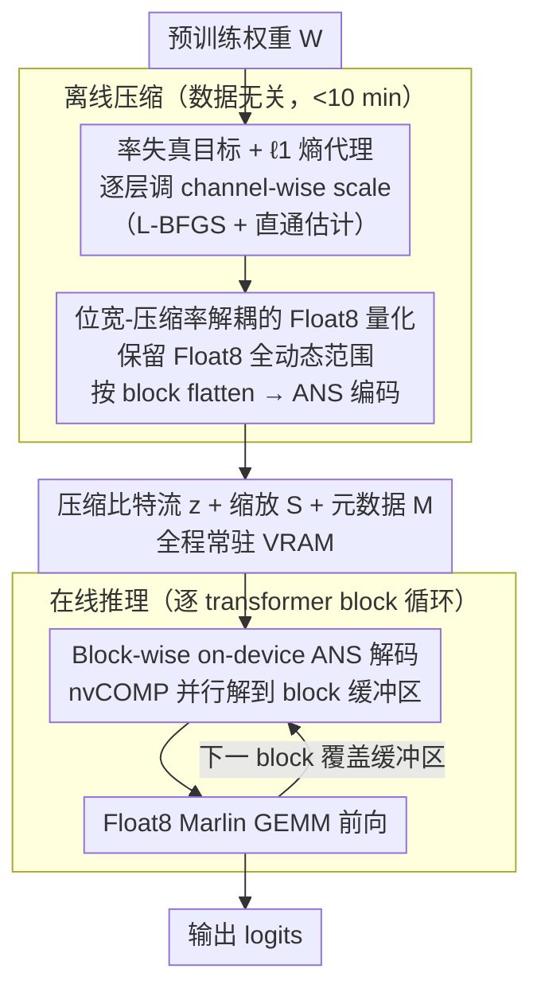

# Float8@2bits: Entropy Coding Enables Data-Free Model Compression

**会议**: ICML 2026  
**arXiv**: [2601.22787](https://arxiv.org/abs/2601.22787)  
**代码**: https://github.com/merantix-momentum/entquant  
**领域**: 模型压缩  
**关键词**: 后训练量化、熵编码、ANS、数据无关压缩、极限低比特  

## 一句话总结
EntQuant 把权重以 Float8/Int8 精度保留，但在量化阶段额外加一个 $\ell_1$ 正则把权重往低熵方向"对齐"，再用 GPU 上并行的 ANS 熵编码无损压到 2 bit 左右，从而在完全不需要校准数据、10 分钟以内、不做恢复训练的前提下，把 70B LLM 压缩到 8× 以上且推理只慢 1.5–2 倍。

## 研究背景与动机
**领域现状**：当前 LLM 后训练量化 (PTQ) 按 Nagel 的四级分类大致分两条路。一条是"重数据"路线：Level 2 用校准集做 GPTQ/OmniQuant；Level 3-4 直接做恢复训练或 QAT，例如 QuIP#、EfficientQAT、AQLM 等，能压到 2 bit 但单卡 8×A100 要跑 40-50 小时。另一条是"轻数据"路线：Level 1 完全无数据的 RTN/NF4/HQQ，几分钟就能压完任意模型，但跌到 4 bit 以下就直接功能崩溃。

**现有痛点**：极限低比特 (<4 bit) 这个最有商业价值的区间，目前只有重数据方法能稳住，但它们有三个隐藏成本——(1) 大量优秀指令调优/推理模型 (LLaMA-3.3 Instruct、Mistral Large) 训练数据完全不公开，校准时只能用 C4 这种通用语料 proxy；(2) 医疗、金融等受 GDPR 约束的场景根本不允许重新使用敏感数据；(3) 校准本身会破坏 safety-tuning 和 reasoning 对齐，让模型在 IFEval/GSM8K 上掉点远超 perplexity 看到的程度。

**核心矛盾**：现有量化范式硬性把"压缩率"和"位宽"绑死——想要 8× 压缩就必须用 4 个离散值表示所有权重。这个"位宽=表达力"的耦合在 4-bit 以上还能容忍，但到 2-bit 就意味着复杂的高斯-长尾权重分布只能压到 4 个 bin，丢掉的高频离群值不可恢复。重数据方法本质上是用大量补丁 (codebook、grouping、outlier 分离、recovery FT) 在弥补这个表达力损失。

**本文目标**：能否在 Level 1 数据无关的约束下，做到 2 bit 极限压缩并保住 instruction-tuned 模型的推理/对齐能力？这要求同时解决"如何在不丢表达力的前提下压到 2 bit"和"如何让解压不变成推理瓶颈"两个子问题。

**切入角度**：作者注意到信号处理领域几十年前就把"量化"和"高效表示"分开了——JPEG 是先量化 DCT 系数再做 Huffman/算术编码，整条流水线的压缩率由熵编码而非量化位宽决定。最近 DFloat11 等工作又证明 GPU 上跑 ANS 解码的开销可以做到很小。两个事实拼起来给出一个新的设计空间：让权重保持 Float8/Int8 的高表达力，但在量化时主动降低权重分布的熵，再用熵编码把存储压下去。

**核心 idea**：用 $\ell_1$ 范数作为离散熵的可微代理，优化 channel-wise 缩放因子让 Float8 权重往低熵方向聚集，然后用 nvCOMP 的 ANS 编码器把这串低熵 8-bit 符号无损压到任意目标 bpw，推理时按 transformer block 为单位 on-the-fly 解码。

## 方法详解

### 整体框架
EntQuant 的输入是预训练权重 $\mathbf{W}\in\mathbb{R}^{M\times N}$，输出是 (压缩比特流 $\mathbf{z}$, 通道缩放向量 $S$, ANS 元数据 $\mathcal{M}$) 三元组。整条 pipeline 分两段：**离线压缩**先做每层独立的 entropy-constrained 量化，再把整个 transformer block 的 Float8 权重拼成一条符号流送进 ANS；**在线推理**时模型在 GPU 上维护一个 block 大小的解压缓冲区，进入某个 block 的 forward 之前 nvCOMP 把整块权重并行解压回 Float8，然后用 Float8 Marlin GEMM 算完 forward，再用下一个 block 覆盖缓冲区。整套设计的关键是把"权重的数值精度"和"权重的存储成本"解耦——前者由 Float8 决定 (保留全动态范围)，后者由熵编码后的比特流长度决定 (可以做到 2 bpw 以下)。

### 关键设计

**1. 率失真目标 + $\ell_1$ 熵代理：在无数据约束下把"降熵 + 控误差"变成只调一组 scale 的可微问题**

要在 Level 1 (无数据) 约束下做极限压缩，就必须放弃所有依赖前向激活的指标 (如 GPTQ 的 Hessian)，只能从权重自身的分布下手。理想目标是直接最小化量化权重的经验熵 $\min_{\mathbf{W}_q} \hat{H}(\mathbf{W}_q)$ s.t. $d(\mathbf{W},\hat{\mathbf{W}})<\epsilon$，其中 $\hat{H}=-\frac{1}{MN}\sum \log_2 \hat p(\mathbf{W}_q^{(i,j)})$，但离散熵对量化值不可微，没法做梯度优化。作者改用 Lagrangian 松弛 $\min_{\mathbf{W}_q} d(\mathbf{W},\hat{\mathbf{W}})+\lambda R(\mathbf{W}_q)$：重建损失取 outlier-鲁棒的相对 $\ell_1$，即 $d=\|\mathbf{W}-\hat{\mathbf{W}}\|_1/\|\mathbf{W}\|_1$；熵代理也取 $\ell_1$，即 $R(\mathbf{X})=\|\mathbf{X}\|_1$。$\ell_1$ 之所以能当熵的代理，附录 B.2 给了 max-entropy 界证明——在固定 $\ell_1$ 预算下最大熵分布有有限支撑，所以最小化 $\ell_1$ 会同时收缩支撑、抬高峰值密度，正好压低 $\hat H$。实操上只对每层 channel-wise 缩放因子 $S$ 求导 (用 straight-through 估计器穿过量化算子)，单层秒级收敛；而且 $\lambda$ 和最终 bpw 经验上是跨模型几乎一致的 log-linear 关系，用户只需指定目标 bpw 而不必去调熵超参。一个范数同时身兼"鲁棒重建度量"和"有效熵代理"，把整个优化退化成轻量的"只调一组 scale"，这才让 70B 也能在 10 分钟内压完。

**2. 位宽-压缩率解耦的 Float8 量化：让存储成本由熵编码而非位宽决定，Float8 base 也能压到 2 bpw 以下**

这是整篇论文最核心的范式转换。传统方法走的是 $\mathbf{W}_q = \text{clamp}(\lfloor\mathbf{W}/s\rceil, -Q_{\max}, Q_{\max})$ 再直接按位宽存储，想要 4× 压缩就只能用 4 bit，复杂的高斯-长尾分布被硬压到几个 bin、表达力不可恢复。EntQuant 反其道而行：量化时用 $\gamma\in\{$ Float8, Int8 $\}$ 保留全部 $\sim 2^8$ 个可表示值的动态范围，但靠上面的 $\ell_1$ 优化把实际用到的 unique value 数压低 (Table 1：2-bit 等价 EntQuant 平均仍用 34.61 个 unique value，远多于固定 2-bit 的 4 个)，再把整个 transformer block 的量化权重 flatten 成一维符号流喂给 ANS 编码器。ANS 的码长按 Shannon 界 $\sim \hat H(\mathbf{W}_q)$ 给出，于是最终 bpw 直接由优化后的经验熵决定，可以连续地从 8 bit 调到 2 bit 以下——"位宽决定压缩率"本就是 30 年前 fixed-codebook 时代的假设，在 GPU ANS 可用的今天已经过时。channel-wise scaling (每个输出通道一个 $s_j$，故 $|S|\ll MN$) 自然把精度分配到需要的通道上，省掉了显式 outlier 分离和复杂 group 划分；保留 Float8 表达力还意味着推理可以直接复用现成的 Float8 Marlin GEMM 内核，不必为低比特另写 kernel。

**3. Block-wise on-device ANS 解码：把熵编码从离线存储优化提升为推理时在线组件，让 2-bit 模型仍跑出接近 Float8 的速度**

极限压缩如果让推理慢 5-10×，实际部署就没人用，所以解压必须足够快、且真正省到显存。传统熵编码 (Han et al. 2016) 只在磁盘上压缩，加载时解到 fp16/int4 占满 VRAM，并没真正省显存。EntQuant 让压缩比特流 $\mathbf{z}$ 全程驻留 VRAM，每个 transformer block 配一个"刚好装下该 block Float8 权重"的解压缓冲区：forward 进入某个 block 前，调用 nvCOMP 的并行 ANS 解码把这个 block 的 q/k/v/o/MLP 权重一次解到缓冲区 (各层用 tensor view 共享底层内存、避免拷贝)，forward 一结束就被下一个 block 覆盖。block 粒度比 layer 粒度快约 50% (ANS 在更大 chunk 上 GPU 利用率更高)，且解压成本只与权重总量相关、与 sequence length 无关，长 context 反而把这点开销摊薄。这样显存峰值真正落到压缩后的水平 (Table 2：70B 模型 2.1 bpw 下压缩权重 18.8 GiB + 解压缓冲区 0.8 GiB + KV cache 1.25 GiB，能塞进单张 32 GiB 5090)，推理仅比 BFloat16 慢 1.5-2×——与 NF4 持平、比 HQQ 还快。

### 损失函数 / 训练策略
不需要任何训练数据。每层独立用 L-BFGS 优化 $\min_S d(\mathbf{W},\hat{\mathbf{W}})+\lambda R(\mathbf{W}_q)$，量化用 straight-through estimator 反传梯度，scale 用 BFloat16 存。$\lambda$ 与目标 bpw 的关系经验上 log-linear 且跨模型几乎一致，因此实际使用时直接按 bpw 查表设 $\lambda$。70B 模型全套压缩 H100 上不到 10 分钟。

## 实验关键数据

### 主实验
覆盖 16 个开源 LLM (LLaMA-1/2/3.1/3.3 Base & Instruct、Qwen3、OLMo 3.1、Mistral Large 24.11)，超过 480 组实验，在 C4、WikiText-2 perplexity 和 LM Eval 8 个 zero-shot 任务上对比 HQQ、NF4 等 data-free 方法。

| 模型 | 方法 | bpw | C4 PPL ↓ | LM Eval Avg ↑ |
|------|------|-----|---------|---------------|
| LLaMA-2 70B | Base (BF16) | 16 | 5.52 | 72.3 |
| LLaMA-2 70B | HQQ g64 | 3 | 6.02 | 70.4 |
| LLaMA-2 70B | EntQuant | 3 | 5.74 | 71.1 |
| LLaMA-2 70B | HQQ g64 | 2 | 2.8e3 (崩) | 30.4 |
| LLaMA-2 70B | EntQuant | 2.1 | **6.47** | **67.9** |
| LLaMA-3.1 70B | HQQ g64 | 2 | 1.3e4 (崩) | 29.9 |
| LLaMA-3.1 70B | EntQuant | 2.1 | **9.92** | **68.6** |

2.1 bpw 是 EntQuant 最亮眼的区间——所有 data-free baseline 全线崩溃 (PPL 几千到几万)，EntQuant 仍能保住 BF16 92-94% 的 LM Eval 平均准确率。与重数据方法对比 (Table 4 (b))：LLaMA-2 70B 2 bit 上 GPTQ 掉 52.8%、OmniQuant 掉 24.6%，EntQuant 2.1 bit 只掉 5.8%，比需要 41 小时训练的 EfficientQAT (掉 5.3%) 略差但接近，比需要 50 小时的 QuIP# (掉 2.6%) 仅落后 3 个点——而 EntQuant 总耗时 < 10 分钟、零数据。

### 消融实验

| 配置 | 关键观察 | 说明 |
|------|---------|------|
| Float8 base (默认) | 2.1 bpw 时 C4 PPL 6.47 | 推荐配置 |
| Int8 base | 2.1 bpw 时部分模型 PPL 较差 | 对 super weights 敏感 |
| Int8 + super weights 排除 | 接近 Float8 性能 | 不到 10 个 outlier 排除掉即可 |
| Float8 + 超长 prefill (8192) | 与 Float8 Marlin gap < 10% | 解压开销只在 block 粒度发生，与 seq len 解耦 |
| W8A8 (Quanto 动态激活量化) | 70B 上略掉点 | 缺少 fused kernel，未测速 |

### 关键发现
- $\ell_1$ 优化后 2-bit EntQuant 平均仍有 34.61 个 unique value (Table 1)，是 4-bit 固定位宽 (16 个值) 的 2 倍——这才是为什么熵编码能在保留表达力的同时压到更低 bpw 的根本原因
- $\lambda$ 与 bpw 的 log-linear 关系跨模型几乎一致 (Figure A.1)，意味着新模型不需要重新调参，直接查表即可
- Block-wise 解压比 layer-wise 快约 50%；解压成本与 prefill 长度无关，所以越长的 context 越能摊销掉解压开销 (Figure 6)
- LLaMA-2 70B 2.1 bpw 在 32 GiB 5090 上可独占运行 (Table 2 + Figure F.3)，把"消费级 GPU 跑 70B"从重训练方法的专利变成 10 分钟 plug-and-play
- 在 IFEval/GSM8K CoT/GPQA/MMLU 这种 instruction-tuned 模型的"硬"基准上，EntQuant 3-bit 几乎无损、2-bit 仍可用，而校准类方法在 instruction-following 上的崩塌已有大量文献佐证 (Lee et al. 2025, Liu et al. 2025)

## 亮点与洞察
- **范式重定义**：把 30 年前 JPEG 就有的"量化 + 熵编码"两段式架构搬回 LLM 量化，证明"位宽 = 压缩率"不是物理约束而是设计选择。这个 reframing 让一大批新设计空间打开
- **$\ell_1$ 作为熵代理**：用一个老掉牙的范数解决"离散熵不可微"的核心难题，并且附录给出 max-entropy 界证明其合理性——既简单又不是 hack
- **GPU ANS 是被低估的基础设施**：nvCOMP 已经在 NVIDIA stack 里默默存在多年，但只有 DFloat11 和这篇把它变成 LLM 推理一等公民。任何想做 sub-2 bit 工作的人都应该重新审视熵编码工具链
- **可迁移性**：$\ell_1$+熵编码这套范式可以直接套到 (a) 激活量化——压缩 KV cache；(b) 梯度量化——分布式训练通信；(c) 视觉模型；(d) Diffusion 模型的 UNet/Transformer 权重。任何"权重分布有可压缩冗余"的场景都适用

## 局限与展望
- 推理 1.5-2× 慢于 BF16，对延迟敏感的 serving 场景仍有改进空间，瓶颈在 ANS 解码核而非算法本身
- $\lambda$→bpw 的 log-linear 关系是经验观察，理论上没有严格保证，遇到极端分布的模型可能需要二次调参
- 当前只验证 weight-only quantization (W8A16) 和粗粒度 W8A8；激活熵编码、KV cache 熵编码尚未触及
- Block 粒度的解压缓冲区在小 batch 下显存收益最大，大 batch 推理时压缩权重相对 KV cache 占比下降，收益减弱
- Super weight 在 Int8 上的影响需要专门检测，虽然便宜 (一次 CPU forward) 但增加了部署复杂度

## 相关工作与启发
- **vs HQQ / NF4 (Level 1)**: 同为 data-free，HQQ/NF4 在 4 bit 以上能用、4 bit 以下崩溃；EntQuant 直接吃下 2 bit 区间。区别在 HQQ/NF4 仍坚持"位宽=压缩率"，EntQuant 用熵编码解耦了二者
- **vs GPTQ / OmniQuant (Level 2)**: 这些方法需要校准集 + Hessian/AdaRound，2-4 小时单卡。EntQuant 不需要数据、10 分钟搞定、2 bit 上准确率反超它们
- **vs QuIP# / EfficientQAT / AQLM (Level 3-4)**: 重训练方法 40-50 小时单卡或多卡。EntQuant 在 perplexity 上略输 0.3-0.5、LM Eval 上输 2-3 个点，但训练成本相差 200×，且不破坏 instruction-tuning
- **vs DFloat11**: DFloat11 是无损压缩 BFloat16 (压缩率 ~30%)，EntQuant 是有损压缩到 Float8/Int8 + 无损熵编码 (压缩率 ~80%)。EntQuant 直接借鉴了 DFloat11 的 block-wise 解压管线，但前置加了一个"主动降熵"的量化步骤，把压缩比再推一档
- **vs 1-bit/extreme low-bit quantization (BitNet 等)**: 后者需要从头预训练，EntQuant 是纯 PTQ
- 启发：率失真理论 + GPU 并行熵编码 = LLM 压缩的下一代基础范式，未来工作可以把熵代理换成更紧的 (如可学习的 codebook)、把熵编码换成更新的 (如 rANS 变体)、把目标从纯压缩扩展到联合优化精度-延迟-能耗

## 评分
- 新颖性: ⭐⭐⭐⭐⭐ 把熵编码从存储优化拉成推理一等公民，重新定义 PTQ 的设计空间
- 实验充分度: ⭐⭐⭐⭐⭐ 480+ 组实验、16 个模型、覆盖 base / instruct / reasoning 全谱
- 写作质量: ⭐⭐⭐⭐⭐ 动机递进清晰，把"为什么是这条路线"讲得理论与工程都成立
- 价值: ⭐⭐⭐⭐⭐ 10 分钟把 70B 塞进 32 GiB 消费卡且不掉指令对齐，对自托管社区是质变

## 评分
- 新颖性: 待评
- 实验充分度: 待评
- 写作质量: 待评
- 价值: 待评

<!-- RELATED:START -->

## 相关论文

- [\[ICML 2026\] Efficient Learned Image Compression without Entropy Coding](efficient_learned_image_compression_without_entropy_coding.md)
- [\[ICML 2026\] Decouple Searching from Training: Scaling Data Mixing via Model Merging for Large Language Model Pre-training](decouple_searching_from_training_scaling_data_mixing_via_model_merging_for_large.md)
- [\[ICML 2026\] Selective Coupling of Decoupled Informative Regions: Masked Attention Alignment for Data-Free Quantization of Vision Transformers](selective_coupling_of_decoupled_informative_regions_masked_attention_alignment_f.md)
- [\[ICML 2026\] Entropy-Aware On-Policy Distillation of Language Models](entropy-aware_on-policy_distillation_of_language_models.md)
- [\[ICLR 2026\] Boomerang Distillation Enables Zero-Shot Model Size Interpolation](../../ICLR2026/model_compression/boomerang_distillation_enables_zero-shot_model_size_interpolation.md)

<!-- RELATED:END -->
