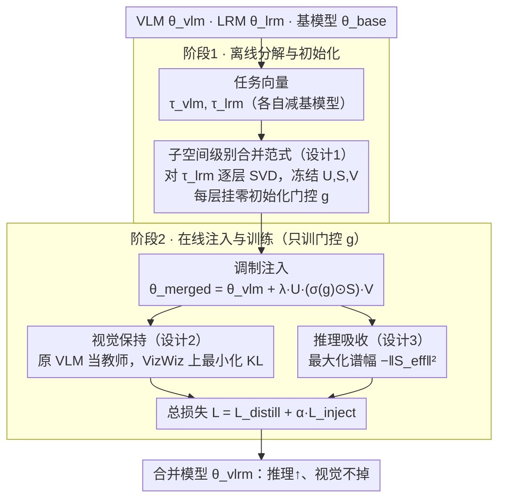

# FRISM: Fine-Grained Reasoning Injection via Subspace-Level Model Merging for Vision–Language Models

**会议**: ICML 2026  
**arXiv**: [2601.21187](https://arxiv.org/abs/2601.21187)  
**代码**: 无  
**领域**: 多模态 VLM / 模型合并 / 推理注入  
**关键词**: 模型合并、SVD 子空间、推理注入、视觉保持、无标签自蒸馏

## 一句话总结
FRISM 把「VLM × LRM 合并」从层级粒度细化到 SVD 子空间粒度：用 LRM 任务向量的 SVD 子空间作为推理先验，再用一个仅含可学习门控的无标签自蒸馏（KL 保视觉 + 谱幅最大化吸收推理）找到最优注入强度，从而在不显著掉视觉的前提下显著提升 VL 推理性能。

## 研究背景与动机
**领域现状**：VLM（Qwen2.5-VL、LLaVA、InternVL 等）通用能力强但推理短板明显；LRM（DeepSeek-R1、OpenAI-o1）则在数学/逻辑/编程类任务上突出。把 LRM 的推理能力转给 VLM 有两条路：①基于 RL/SFT 的大规模再训练；②模型合并（Model Merging）。后者训练成本几乎为零、无需标注数据，因此被广泛尝试（如 BR2V、FRANK、IP-Merging）。

**现有痛点**：现有合并方法基本停留在「层级」粒度——把每一层都用 $\lambda_{\text{vlm}}\tau_{\text{vlm}}+\lambda_{\text{lrm}}\tau_{\text{lrm}}$ 这种「同一层一个混合系数」的形式合并。图 2 的实验显示：无论用 Task Arithmetic 还是 IP-Merging，调一个系数总是「要么视觉掉，要么推理弱」，落入一条明显的 vision–reasoning trade-off 曲线。

**核心矛盾**：作者通过对 DeepSeek-R1-Distill-Qwen-7B 的任务向量做 SVD 后逐 rank 注入 Qwen2.5-VL，发现「不同 rank 子空间最佳缩放系数差异巨大」（图 3）：有的子空间在 $\lambda=0.1$ 已经达到峰值，有的还要更高；层级单一 $\lambda$ 必然把这些异质性纠在一起，同时引入有用的推理与有害的视觉噪声。换言之，**层不是能力的原子单位**，子空间才是。

**本文目标**：把合并粒度细化到 SVD 子空间级别，让模型自动决定哪些子空间应该被强注入、哪些应当被压制，并且整个过程不依赖任何 VL 推理标注。

**切入角度**：把 LRM 任务向量的 SVD 分解直接当作「推理先验子空间」，冻结 $\mathbf{U},\mathbf{S},\mathbf{V}$ 不动，只学一个 per-rank 门控向量 $\mathbf{g}^l$；再借「无标签自蒸馏 + 谱幅最大化」让门控自动找到「最大注入 + 最小视觉损失」的平衡点。

**核心 idea**：在每一层都按 SVD 子空间逐个开门——「双目标 + 子空间门控」自动筛掉对视觉破坏大的子空间，留下与视觉正交的推理子空间。

## 方法详解

### 整体框架
FRISM 想把 LRM 的推理能力注入 VLM，又不让视觉感知掉下来，做法是把「合并」的粒度从整层降到 SVD 子空间，再让模型自己学每个子空间注入多强。它分两步走：离线阶段先把 LRM、VLM 各自对基模型的任务向量算出来，对 LRM 任务向量逐层做 SVD 得到一组冻结的基底，每层挂一个零初始化的可学习门控；在线阶段把门控调制后的 LRM 子空间叠回 VLM，用一个无标签自蒸馏（拿原 VLM 当教师约束视觉 + 谱幅最大化吸收推理）只训练这些门控，规模极小、收敛极快。

### 关键设计

**1. 子空间级别合并范式：每个 SVD 子空间一个独立缩放系数**

层级合并的死结在于「整层只能配一个 $\lambda$」，而图 3 显示同一层里不同 rank 子空间的最佳缩放系数差异极大——一个 $\lambda$ 必然把有用的推理方向和有害的视觉噪声纠在一起。FRISM 的破解是「冻基底、学谱」：先把 LRM 任务向量 $\tau_{\text{lrm}}^l$ 做 SVD 得到 $\mathbf{U}^{(l)},\mathbf{S}^{(l)},\mathbf{V}^{(l)\top}$ 并全部冻结，只为每层学一个门控向量 $\mathbf{g}^l\in\mathbb{R}^r$。门控过 Sigmoid 后得到 $\sigma(\mathbf{g}^l)\in(0,1)^r$，与原始奇异值逐元素相乘构成「有效奇异值」$\mathbf{S}_{\text{eff}}=\sigma(\mathbf{g}^l)\odot\mathbf{S}$，合并权重为

$$\theta_{\text{merged}}^l=\theta_{\text{vlm}}^l+\lambda_{\text{lrm}}\,\mathbf{U}^{(l)}\mathbf{S}_{\text{eff}}^{(l)}\mathbf{V}^{(l)\top}.$$

任务向量定义为 $\tau_{\text{vlm}}=\theta_{\text{vlm}}-\theta_{\text{base}}$、$\tau_{\text{lrm}}=\theta_{\text{lrm}}-\theta_{\text{base}}$。基底不动只改强度，既保留了 reasoning 的语义方向，又让强度可以按子空间逐个精细调节——这与「reasoning 多集中在少数方向」的低秩经验观察（Cai 2025、Ping 2024、Sharma 2024）正好吻合，于是每层 $r$ 个子空间各开各的门，彻底摆脱单一 $\lambda$ 的耦合。

**2. 无标签自蒸馏的视觉保持目标：拿原 VLM 当锚点，禁止视觉输出漂移**

注入推理最怕把视觉感知带崩，但 VL 推理标注又稀缺、分布不均，直接上监督信号风险大。FRISM 干脆不要推理标签，改用自蒸馏把「保留视觉」变成一个数据廉价、目标干净的约束：教师是冻结的原 VLM $\theta_{\text{vlm}}$，学生是当前合并模型 $\theta_{\text{vlrm}}(\mathbf{g})$，在纯视觉感知校准集 $\mathcal{D}$（论文用 VizWiz VQA）上最小化两者输出分布的 KL 距离，

$$\mathcal{L}_{\text{distill}}=\mathbb{E}_{x\sim\mathcal{D}}\,\mathrm{KL}\!\left(P(\cdot|x;\theta_{\text{vlm}})\,\|\,P(\cdot|x;\theta_{\text{vlrm}})\right).$$

以原 VLM 为参照点意味着只要门控的调整没破坏视觉输出，KL 就小；这等于把整个合并问题重述成「在视觉输出的 KL 半径内寻找最强推理注入」，既绕开了缺标注的难题，又给注入划出一条不能越界的安全线。

**3. 谱幅最大化的推理吸收与总目标：用谱幅当推理代理，避免门控坍缩成零注入**

只有视觉约束的话，门控会偷懒——把所有子空间都关掉，KL 自然为零却什么推理也没注入。为此 FRISM 加一项主动鼓励 $\mathbf{S}_{\text{eff}}$ 尽量大的损失 $\mathcal{L}_{\text{inject}}=-\sum_l\|\mathbf{S}_{\text{eff}}^{(l)}\|^2=-\sum_l\|\sigma(\mathbf{g}^{(l)})\odot\mathbf{S}^{(l)}\|^2$（注入越强、损失越小），与视觉目标合成总损失

$$\mathcal{L}=\mathcal{L}_{\text{distill}}+\alpha\mathcal{L}_{\text{inject}}.$$

这两项一拉一推，恰好等价于一个自动过滤器。论文给出二阶展开来解释：在 Hessian $\mathbf{H}=\nabla^2\mathcal{L}_{\text{vis}}$ 和「不同 SVD 子空间近似解耦」的假设下，$\partial\mathcal{L}/\partial\lambda_i\approx(h_i-2\alpha\|B_i\|_F^2)\lambda_i$，于是某子空间只要视觉曲率项 $h_i$ 大于注入收益项 $2\alpha\|B_i\|_F^2$，门控就把它压下去，反之就放开。结论是：与视觉感知正交（低 $h_i$）的方向被放行、对视觉破坏大（高曲率）的方向被关闭，整个 vision–reasoning trade-off 全靠数据先验加谱结构自动求解，无需任何 reasoning 监督信号。

### 损失函数 / 训练策略
全程只更新门控 $\mathbf{g}^l$，相比原模型参数量可以忽略；总损失 $\mathcal{L}=\mathcal{L}_{\text{distill}}+\alpha\mathcal{L}_{\text{inject}}$ 中 $\alpha$ 控制注入强度。由于 $\mathcal{L}_{\text{inject}}$ 在不同模型尺度上量级差异巨大，训练前先做归一化（附录 H）。合并只作用于 LLM 部分，视觉塔和投影层保持不变。

## 实验关键数据

### 主实验：Qwen2.5-VL × LRM 合并的多基准平均得分（Tab. 1）

| 方法 | VL 推理平均 | VL 感知平均 |
|------|-------------|-------------|
| **3B 合并 SmallThinker-3B** | | |
| Base | 33.2 | 79.7 |
| Task Arithmetic 最佳 $\lambda$ | 33.0 | 79.8 |
| Ties-Merging | 31.6 | 77.0 |
| IP-Merging 最佳 $T$ | 32.2 | 77.0 |
| **FRISM** | **35.0 (+1.8)** | 79.7 |
| **7B 合并 DeepSeek-R1-Distill-Qwen-7B** | | |
| Base | 47.4 | 82.9 |
| Task Arithmetic 最佳 $\lambda$ | 47.8 (高 $\lambda$ 已崩） | 82.4 |
| Ties-Merging | 45.3 | 78.9 |
| IP-Merging 最佳 $T$ | 47.7 | 82.3 |
| **FRISM** | **49.4 (+2.0)** | **83.0** |

### 子空间级别诊断（图 3）

| 实验 | 关键观察 | 说明 |
|------|----------|------|
| 单独注入不同 rank 子空间 | 不同 rank 在不同 $\lambda$ 处达到峰值 | 证明子空间存在异质性，「层级单 $\lambda$」必然次优 |
| 标准 layer-wise 合并 | 与子空间级最优有明显差距 | 层粒度无法同时容纳多个不同最优 $\lambda$ |

### vision–reasoning trade-off（图 2）
- 在「VL 推理基准 + VL 感知基准」二维空间内，Task Arithmetic / IP-Merging 形成一条明显的 trade-off 曲线（要么向右上推理涨、要么向上感知保住，二者难兼得）。
- FRISM 直接跳到曲线右上角，证明门控成功筛掉了「破坏视觉、对推理贡献不大」的子空间。

### 关键发现
- 7B 合并下 Task Arithmetic 在 $\lambda=0.15$ 起就出现「视觉断崖式下跌」（POPE 从 86.4 → 73.9），而 FRISM 在视觉指标上几乎与 Base 持平的同时把 reasoning 平均涨 2pt——这是子空间级别精细化最直接的胜利证据。
- 把 $\mathcal{L}_{\text{inject}}$ 去掉后门控会向负无穷收缩（无任何注入），证明该项的「主动放大」是必要的——本质上是在没有推理标签的前提下，用谱幅作为可观察代理。
- 二阶展开 $\partial\mathcal{L}/\partial\lambda_i\approx(h_i-2\alpha\|B_i\|_F^2)\lambda_i$ 给出可解读的过滤规则：高视觉曲率方向被压下、低曲率方向被放开，与图 3 的子空间异质性观察相互印证。

## 亮点与洞察
- 「层不是能力的原子单位，SVD 子空间才是」这条 reframing 非常 sharp：一旦接受这一假设，所有现有「调单一 $\lambda$」的合并方法都变成了次优特例，FRISM 自然成为这个空间的一般解。
- 用「冻基底、学谱」的极简门控结构把训练成本压到几乎为零，并且具备「插拔到任意 VLM」的通用性，对中小团队特别友好。
- 「视觉保持 + 谱幅最大化」两件套等价于一个 implicit 子空间过滤器，不需要 reasoning 标签就能区分「视觉无关」与「视觉破坏」的方向；这套机制可推广到其他能力（如安全对齐、代码能力）的注入——只要相应能力可以表示为基模型上的任务向量即可。
- 论文中对 $\partial\mathcal{L}/\partial\lambda_i$ 的解析推导给出了 mechanism-level 的可解读性，比单纯实验对比更有说服力。

## 局限与展望
- 视觉保持靠的是「在 VizWiz 上做 KL」，这种代理目标对其他视觉任务（grounding、OCR、视频）保护程度依赖校准数据分布；如果校准数据偏窄，可能会让其他视觉能力悄悄漂移。
- 「不同 SVD 子空间在视觉损失上近似解耦」是理论分析的关键假设，但实践中 Hessian 不一定干净对角；偏离这一假设会让门控的可解读性降低。
- 目前 SVD 是在每个线性层独立做的，没有跨层联合考虑；layer-wise 子空间之间可能存在协同/冲突，未来可以做「层-子空间联合稀疏」的合并形式。
- 仅评估了 LLM 推理 → VLM 这一方向；反向（VLM 视觉能力 → LRM）或多路合并（多个领域模型并入一个底座）尚未验证。

## 相关工作与启发
- **vs Task Arithmetic / Ties-Merging / DARE**：传统多任务合并强调减少干扰，但都用单层标量系数，无法解决「单层内能力混叠」的问题；FRISM 用门控向量把 trade-off 曲线整体推到外侧。
- **vs IP-Merging（层级相似度阈值）/ FRANK（Taylor 闭式层级权重）**：这两者本质都还在「层」粒度上做选择性合并；FRISM 把粒度降到子空间并加上学习能力，是这类思路的自然延伸。
- **vs LoRA / PiSSA 等基于 SVD 的 PEFT**：PEFT 是在基底之上学习一组低秩 delta；FRISM 是反过来——把已经训好的 delta 拆成 SVD 子空间，再决定每个子空间该不该叠进去，思路更接近「子空间剪枝」+「子空间加权」。
- **vs SVDiff / 模型压缩中的 SVD 蒸馏**：FRISM 与「奇异值不动、改基」相反，它「基不动、改奇异值」，这种「冻基底学谱」的做法可以借鉴到压缩、对齐、安全等多个任务上。

## 评分
- 新颖性: ⭐⭐⭐⭐⭐ 把模型合并从层级粒度细化到 SVD 子空间，并给出无标签自蒸馏的求解框架，思路新颖且自洽。
- 实验充分度: ⭐⭐⭐⭐ 覆盖 3B/7B/32B 三个尺度、多种基准与多个 baselines，并配子空间级 ablation。
- 写作质量: ⭐⭐⭐⭐ 动机推导（图 2-3）非常清楚，理论分析与实验互证；部分推导依赖附录。
- 价值: ⭐⭐⭐⭐⭐ 提供一个低成本、即插即用、强可解读的能力注入框架，对推理-视觉融合方向有明显推动作用。

<!-- RELATED:START -->

## 相关论文

- [\[ICML 2026\] Model Merging Scaling Laws in Large Language Models](model_merging_scaling_laws_in_large_language_models.md)
- [\[ICML 2026\] Decouple Searching from Training: Scaling Data Mixing via Model Merging for Large Language Model Pre-training](decouple_searching_from_training_scaling_data_mixing_via_model_merging_for_large.md)
- [\[ICML 2026\] Saliency-Aware Model Merging](saliency-aware_model_merging.md)
- [\[ACL 2025\] BlockPruner: Fine-grained Pruning for Large Language Models](../../ACL2025/model_compression/blockpruner_fine-grained_pruning_for_large_language_models.md)
- [\[ICML 2025\] Bring Reason to Vision: Understanding Perception and Reasoning through Model Merging](../../ICML2025/model_compression/bring_reason_to_vision_understanding_perception_and_reasoning_through_model_merg.md)

<!-- RELATED:END -->
