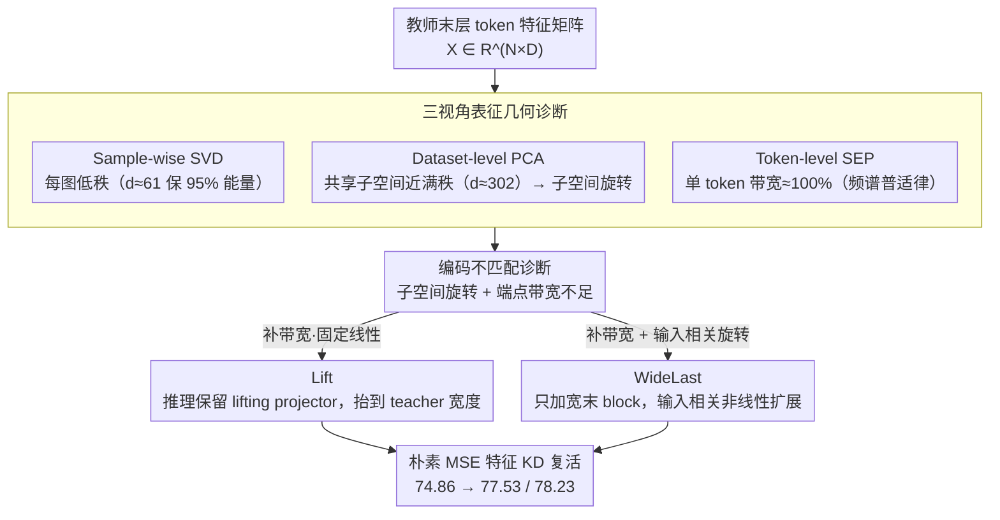

# From Per-Image Low-Rank to Encoding Mismatch: Rethinking Feature Distillation in Vision Transformers

**会议**: ICML 2026  
**arXiv**: [2511.15572](https://arxiv.org/abs/2511.15572)  
**代码**: 有（论文 supplementary）  
**领域**: 模型压缩 / 知识蒸馏 / Vision Transformer  
**关键词**: 特征蒸馏、ViT 压缩、子空间旋转、Spectral Energy Pattern、潜在容量瓶颈

## 一句话总结
作者用 sample-wise SVD + dataset-level PCA + token-level Spectral Energy Pattern (SEP) 三视角揭示了一个看似矛盾的 ViT 表征几何："每张图的特征矩阵都是低秩的，但跨图共享的子空间却几乎要满秩 + 单 token 的频谱带宽接近 100%"，进而提出 Lift（推理时保留 lifting projector）和 WideLast（只把最后一个 block 加宽到 teacher 宽度）两个极简补丁，让普通 MSE 特征蒸馏在 DeiT-Tiny ← CaiT-S24 上从 74.86% 一路涨到 78.23%。

## 研究背景与动机

**领域现状**：知识蒸馏 (KD) 里"匹配中间特征"是 CNN 时代的经典套路 (FitNet/AT/KR)，在 ViT 之间做"同尺寸表征迁移"（如 CLIP 蒸馏）也基本能用。但一旦走"宽教师 → 窄学生"的压缩路线，直接特征对齐就出奇地脆弱——往往只有零点几的提升，甚至掉点；ViTKD/SpectralKD/VkD 这些工作都报告过类似现象。

**现有痛点**：现有解决方案要么换成 distillation token（DeiT 路线），要么用对比/attention/manifold 损失，要么塞一个复杂的 translator 模块。这些方案有效，但都绕过了"为什么朴素特征 KD 会失败"这个本质问题，导致 ViT 蒸馏缺一个简洁的、可解释的故事。

**核心矛盾**：作者观察到一个让人困惑的悖论。**Sample-wise SVD 显示 ViT 的每张图特征极其可压缩**——CaiT-S24 的 last-layer token matrix (196×384) 对 99% 的图像而言只需 61 个奇异方向就能保留 95% 能量。按 Eckart-Young-Mirsky 定理，这意味着"一个窄学生 + 一个线性 projector"理论上就该匹配上 teacher。**但实践告诉我们不行。**

**本文目标**：搞清楚为什么"理论上可行"却"实际不可行"，并且给出一个最小代价的修复方案。

**切入角度**：作者怀疑 sample-wise 视角忽略了关键一点——每张图的低维子空间**不一样**，且每个 token 在它自己的子空间里**用的带宽其实很高**。于是引入两个互补诊断：dataset-level PCA（共享子空间需要多宽）和 token-level SEP（单 token 占用多少频谱通道）。

**核心 idea**：失败机制是**端点编码不匹配 (Encoding Mismatch)**——同时存在"子空间旋转"（固定 projector 无法适配输入相关的子空间方向）和"带宽容量不足"（窄学生根本喂不起高频谱占用的 token 编码）两个耦合面。修复方法是给学生提供"近 teacher 宽度的端点容量 + 输入相关的子空间调整能力"。

## 方法详解

### 整体框架
论文是一条"先诊断、再开药"的链：前半（§2）拿三个互补的频谱/几何探针去刻画 ViT 末层 token 特征矩阵 $\mathbf{X} \in \mathbb{R}^{N \times D}$ 的真实结构，把"每张图低秩却蒸不动"这个悖论拆成可量化的 encoding mismatch；后半（§3）顺着诊断结论开出 Lift 和 WideLast 两味极简补丁——前者在推理时保留一个固定线性 projector 把学生宽度抬到 teacher 宽度，后者干脆把学生最后一个 Transformer block 原生加宽到 teacher 宽度。

### 关键设计

**1. 三视角表征几何诊断：把"redundancy"拆成互不重叠的三层，找出真正卡住蒸馏的那一层**

如果只盯着单张图看，ViT 的特征确实极其可压缩，这正是"理论上窄学生 + 线性 projector 就够"这个错误直觉的来源。作者的做法是同时换三个视角观察同一个 $\mathbf{X}$，让矛盾自己浮出来。**Sample-wise SVD** 对每张图做 $\mathbf{X}_i = \mathbf{U}_i \boldsymbol{\Sigma}_i \mathbf{V}_i^\top$，统计达到 95%/99% 能量所需的最小秩 $d_i^\text{SVD}$，CaiT-S24 上 99 分位只要 61/121 维——单图确实低秩。**Dataset-level PCA** 则换成全局视角：累积整个数据集的 channel 第二动量 $\mathbf{C} = \frac{1}{T}\sum_i \mathbf{X}_i^\top \mathbf{X}_i$ 做特征分解，得到一组**所有图共享**的 PCA 基 $\mathbf{V}_d$，再看这组共享基对每张图的能量保留率 $E_i(d) = \|\mathbf{X}_i \mathbf{V}_d\|_F^2 / \|\mathbf{X}_i\|_F^2$；结果要让 99% 的图保住 95% 能量竟需要 302/384 维，和 sample-wise 的 61 形成近 5 倍鸿沟——这说明每张图的低维子空间方向各不相同，**子空间随输入旋转**。**Token-level SEP** 再降一个粒度：对每个 token $\mathbf{x}_t \in \mathbb{R}^D$ 沿 channel 维做 1D DFT，算累积频谱能量 $\text{SEP}(d)$ 和归一化带宽 $b_\alpha$，发现 14 个 ViT/DeiT/Swin/CLIP/MAE/DINO/DINOv2 backbone 的 SEP 曲线几乎都贴着 45° 对角线，捕 90% 能量要占 ~90% 的频谱通道——**单 token 的带宽利用率本就接近满**。三者缺一不可：只看 SVD 会误判"窄接口够用"，加上 PCA 才看到子空间旋转、加上 SEP 才看到带宽吃紧，合起来才解释了固定窄接口为什么必然失败。

**2. Lift：推理时不丢的 lifting projector，先把"端点带宽"补到 teacher 宽度**

既然 SEP 诊断指向"末端带宽不够"，最直接的修法就是在不动 backbone 的前提下给学生末端补容量。学生最后一层输出 $\mathbf{X}_S \in \mathbb{R}^{N \times D_S}$（窄宽 $D_S < D_T$），加一个 token-wise 线性 projector $\mathbf{P} \in \mathbb{R}^{D_S \times D_T}$ 抬成 $\widehat{\mathbf{X}}_S = \mathbf{X}_S \mathbf{P}$。和传统 KD 的关键差别是：**这个 projector 推理时也留着**，让分类头 $\mathbf{W}_\text{head} \in \mathbb{R}^{D_T \times C}$ 直接作用在被抬升的表征上，而不是训练完就丢。效果立竿见影——一旦接口被抬到 teacher 宽度，连最朴素的 MSE 特征对齐都能从 +0.21% 变成 +1.75%，正面印证了 SEP 的"带宽不足"诊断。但 Lift 终究是个**固定线性映射**，对所有图像只能给同一个旋转，没法应付 PCA 揭示的输入相关子空间旋转，所以它解决了带宽却解决不了旋转，天花板低于 WideLast。

**3. WideLast：把最后一个 block 原生加宽，带宽和子空间旋转一并解决**

Lift 留下的缺口在于线性、输入无关。WideLast 把学生的最后一个 Transformer block 直接换成 teacher 宽度 $D_T$ 的版本（前面所有 block 仍保持窄 $D_S$），于是末 block 的 attention 与 MLP 都在 $D_T$ 维上运算，输出 $\widetilde{\mathbf{X}}_S \in \mathbb{R}^{N \times D_T}$，分类头同样在 $D_T$ 上。和 Lift 的本质区别是：加宽 block 是个**输入相关的非线性映射**，能对不同图像生成不同的 effective subspace 方向，恰好对上 PCA 观察到的"子空间随输入旋转"——固定 projector 给所有图一个旋转，加宽 block 给每张图各自的旋转。消融里 WideLast 的 78.23% 比 Lift 的 77.53% 再高 0.7 个点，这 0.7 点就是"子空间自适应"额外买到的收益。

### 损失函数 / 训练策略
总目标 $\mathcal{L} = (1-\lambda_\text{logit}) \mathcal{L}_\text{CE}(\mathbf{y}, \mathbf{p}_S) + \lambda_\text{logit} \mathcal{L}_\text{KD}(\mathbf{p}_S, \mathbf{p}_T; \tau) + \lambda_\text{feat} \mathcal{L}_\text{feat}$，其中 $\mathcal{L}_\text{feat}$ 可以是简单 MSE 也可以是 SpectralKD。训练 recipe 完全沿用 DeiT 默认（AdamW、5e-4 lr、cosine、5 epoch warmup、300 epoch、batch 2048）。

## 实验关键数据

### 主实验
ImageNet-1K，CaiT-S24 (384维) → DeiT-Tiny (192维) 蒸馏：

| 配置 | 蒸馏损失 | Top-1 (%) | Δ |
|------|---------|-----------|---|
| DeiT-Tiny baseline | – | 74.86 | – |
| Baseline + SpectralKD (朴素) | – | 75.07 | +0.21 |
| **Lift** + MSE only | MSE | 76.61 | **+1.75** |
| **Lift** + SoftKD + SpecKD | SoftKD+SpecKD | 77.53 | +2.67 |
| **WideLast** + MSE only | MSE | 77.15 | +2.29 |
| **WideLast** + SoftKD + MSE | SoftKD+MSE | **78.23** | **+3.37** |

朴素特征 KD 几乎无效 (+0.21)，但加 Lift 后**仅 MSE** 就能 +1.75，加 WideLast 后 +2.29，确认了"端点容量"才是关键。最强组合 WideLast + SoftKD + MSE 拿到 78.23%，比 baseline 高 3.37 个点。

### 消融实验

| 配置 | Top-1 (%) | 说明 |
|------|-----------|------|
| 默认 baseline (192-dim) | 74.86 | 无 projector |
| Projector 256 | 75.46 | 略宽 |
| Projector 320 | 75.53 | 接近 teacher |
| **Projector 384 (= teacher)** | 75.41 | 推理时保留 + 无 KD |
| Projector 448 (超 teacher) | 75.23 | 超过反而掉点 |
| Lift standalone (无 KD) | 75.41 | +0.55 vs baseline |
| WideLast standalone (无 KD) | 75.54 | +0.68 vs baseline |
| 换 teacher → DeiT-Small | – | WideLast + SpecKD 75.73 |
| 换 teacher → DeiT3-Small-21k | – | WideLast + SpecKD 76.50 |

### 关键发现
- **超过 teacher 宽度反而掉点** (448 vs 384)：说明目标不是"越宽越好"，而是要**精准对齐 teacher 子空间**，超过的部分反而引入冗余维度损害学习。
- **架构修改本身就涨点（无需老师）**：Lift +0.55、WideLast +0.68，证实 encoding mismatch 不只是"蒸馏接口问题"，而是 DeiT-Tiny 这种**架构本身**的潜在容量瓶颈——末层带宽不足限制了独立训练时的表达能力。
- **三种 teacher 都能复现规律**：CaiT-S24 / DeiT-Small / DeiT3-Small-21k 这三种架构差异挺大的 teacher 上 Lift/WideLast 都稳定提升，说明 encoding mismatch 是 ViT-family 通用属性而非 CaiT 特例。
- **SEP 跨架构一致性 ~100%**：14 个 backbone（含 SL/SSL/MM 三种训练方式、Tiny 到 Huge 全规模）的 SEP 曲线几乎重合在对角线上，捕 90% 能量都要 ~90% 频谱通道——这是 ViT 的"频谱普适律"，是论文最 striking 的发现之一。

## 亮点与洞察
- **"sample-wise 低秩 + dataset-wise 高维 + token-wise 高带宽"三视角组合是个值得复用的诊断框架**：它把"redundancy"这个被滥用的词拆成了三个互不重叠的几何概念，避免了"低秩 ≠ 可蒸馏"这种把全局冗余等同于局部冗余的混淆。
- **SEP 作为新诊断工具**：之前文献里 ViT 特征几何主要靠 attention map 可视化或 CKA 比较，作者引入 1D DFT 沿 channel 维度看频谱占用率，是个简洁的"单 token 容量"探针，对其他 transformer 蒸馏/压缩任务都可能有用。
- **"端点带宽不足是架构瓶颈而非蒸馏瓶颈"这一发现意外重要**：传统观点把宽度看作"参数效率 vs 表达力"的权衡，本文说"对 ViT 这种把所有信息汇聚到末层 token 的架构，末层带宽是个独立瓶颈"，对未来设计紧凑 ViT (mobile ViT 等) 有直接指导价值——保持中间窄但加宽末层是新的设计点。
- **极简补丁路线**：相比 ScaleKD 那种构建复杂 translator 模块，Lift/WideLast 加的参数极少但效果显著，验证"理解问题本质 > 堆模块"。

## 局限与展望
- 只分析了**末层** encoding mismatch；中间层是否也有类似现象、怎么处理没讨论，对于多层特征对齐这一限制就比较明显。
- **固定 projector vs 输入相关 projector** 的对比清晰，但没有进一步探索"adaptive lifting"——比如基于 attention 路由的 projector 是否能进一步缩小和 WideLast 的差距。
- 实验全是 ImageNet-1K 分类，没碰检测/分割/多模态等下游任务；encoding mismatch 在这些 dense prediction 场景里的行为是个开放问题。
- WideLast 增加的最后一个 block 是有可观参数开销的（要在 $D_T$ 宽度上跑 attention + MLP），对真正的边端部署是个折衷而非纯赢。

## 相关工作与启发
- **vs FitNet/AT/KR**: CNN 时代特征 KD 经典，但都假设师生层维度相近；本文专攻"宽到窄"的接口问题，是该谱系的 ViT 适配。
- **vs ScaleKD**: 后者用复杂 alignment module 桥接异构 teacher，本文 Lift/WideLast 是更轻量的版本，但 ScaleKD 能处理更夸张的异构。
- **vs VkD**: 用正交 projector 稳定蒸馏，思路相关但本文从 representation geometry 角度给出更深层解释。
- **vs SpectralKD**: 同样基于频谱视角但侧重层选择和频谱对齐损失，本文 SEP 更进一步揭示单 token 频谱占用，二者可结合（实验里 WideLast + SpecKD 是最强组合之一）。
- **vs Yu & Wu (低秩 features 但权重不低秩)**: 二者都观察到 ViT 特征低秩，但 Yu & Wu 直接用于 few-shot 压缩；本文进一步用 PCA + SEP 揭示"低秩但难蒸馏"的矛盾，并给出修复。

## 评分
- 新颖性: ⭐⭐⭐⭐⭐ 三视角诊断框架 + encoding mismatch 概念 + SEP 工具都是新东西，故事讲法和切入角度都很新鲜。
- 实验充分度: ⭐⭐⭐⭐ ImageNet 充分，跨 14 个 backbone 的 SEP 普适律实验也很硬核；但只评估了分类任务和单一 backbone (DeiT-Tiny) 作为学生，下游任务支持不足。
- 写作质量: ⭐⭐⭐⭐⭐ 从悖论引入 → 三诊断展开 → 双修复方案 → 实验验证，逻辑链非常顺畅，图 1 的四面板特别清晰。
- 价值: ⭐⭐⭐⭐ 给 ViT 蒸馏失败这个困扰社区已久的现象提供了清晰解释和简洁修复，且 standalone gain 让 WideLast 思路对紧凑 ViT 架构设计也有指导价值。

<!-- RELATED:START -->

## 相关论文

- [\[AAAI 2026\] Distillation Dynamics: Towards Understanding Feature-Based Distillation in Vision Transformers](../../AAAI2026/model_compression/distillation_dynamics_towards_understanding_feature-based_di.md)
- [\[ICML 2026\] ScaLoRA: Optimally Scaled Low-Rank Adaptation for Efficient High-Rank Fine-Tuning](scalora_optimally_scaled_low-rank_adaptation_for_efficient_high-rank_fine-tuning.md)
- [\[ICML 2026\] Energy-Structured Low-Rank Adaptation for Continual Learning](energy-structured_low-rank_adaptation_for_continual_learning.md)
- [\[ICLR 2026\] Taming Momentum: Rethinking Optimizer States Through Low-Rank Approximation](../../ICLR2026/model_compression/taming_momentum_rethinking_optimizer_states_through_low-rank_approximation.md)
- [\[ICML 2026\] Selective Coupling of Decoupled Informative Regions: Masked Attention Alignment for Data-Free Quantization of Vision Transformers](selective_coupling_of_decoupled_informative_regions_masked_attention_alignment_f.md)

<!-- RELATED:END -->
