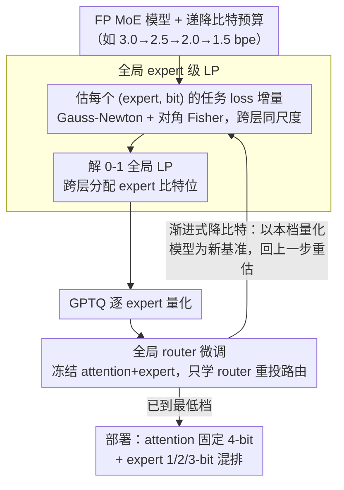

# GEMQ: Global Expert-Level Mixed-Precision Quantization for MoE LLMs

**会议**: ICML 2026  
**arXiv**: [2605.23078](https://arxiv.org/abs/2605.23078)  
**代码**: https://github.com/jndeng/GEMQ  
**领域**: 模型压缩 / MoE 量化 / 大模型推理  
**关键词**: MoE-LLM、混合精度量化、全局线性规划、Router 微调、渐进式量化

## 一句话总结
GEMQ 把 MoE 大模型的 expert 比特位分配从层内局部 LP 升级成跨层全局 LP，并配合"量化后微调 router 权重"来对齐被量化扭曲的路由分布，再用"渐进式降比特"的迭代框架反复修正重要性估计，在 Mixtral-8×7B 等 4 个 MoE 模型上把每 expert 平均 2.5 bit 的压缩下 MMLU 等 7 项 zero-shot 平均掉点压在 7% 以内，同 bit 预算下显著超过 PMQ / SpQR / MoEQuant / EAQuant。

## 研究背景与动机
**领域现状**：MoE-LLM（Mixtral、DeepSeekV2、Qwen-MoE 等）通过稀疏激活降低计算成本，但参数总量并未变小，所有 expert 必须常驻显存——Mixtral-8×7B 全精度需 87 GB，即便 H100-80GB 单卡也放不下。Expert 参数往往占总参数的 90% 以上，所以 MoE 压缩的核心战场就是 expert 权重量化。

**现有痛点**：(1) 现有的 expert 级混合精度方法（如 PMQ、Li et al. 2024）在 **每层内部** 单独做 LP，给每层强制相同 bit 预算，忽略了"不同层 expert 重要性差异"——论文 Fig 1(a) 显示 Mixtral 中各层的 expert 平方梯度总和（Fisher 迹）能差到 7 倍。(2) 量化后 router 输入分布改变 + expert 输出改变会导致 **路由本身偏移**——1.5-bit 量化后超 40% token 被路由到与全精度不同的 expert，但现有方法要么完全忽略，要么强行把量化后 router 对齐回 FP 分布，反而不优。(3) 任务损失估计依赖 Taylor 展开，要求量化扰动 $\Delta w$ 足够小；在极低比特（1-2 bit）下 $\Delta w$ 巨大，估计本身就不准。

**核心矛盾**：要"全局"分配 bit 就要在所有 expert 之间共享同一损失基准；但 Taylor 估计要求扰动小、要求局部最小点假设，二者在低比特下都被破坏。

**本文目标**：(a) 把局部 LP 升级成全局 LP，让 bit 在跨层之间自由流动；(b) 显式建模并修复量化引起的 router 漂移；(c) 给一个在低比特下仍能逼近真实 loss 的重要性估计方案。

**切入角度**：作者用 Gauss-Newton + 对角 Fisher 把每个 expert 单独量化到 $j$ bit 引起的任务损失增量 $\Delta\tilde L_{ij}\approx \mathbb{E}_\mathcal{D}[\Delta z_{ij}^\top \mathrm{diag}(g^{(z)}g^{(z)\top})\Delta z_{ij}]$ 拉到"同一任务 loss"尺度——这天然支持跨层对比；同时 Fig 3 的一维 loss landscape 分析表明，只要让 router 始终适配当前权重，"用一个比特预算相近的中间量化模型"就能逼近极低比特目标点附近的真实 loss。

**核心 idea**：全局 LP 决定每个 expert 的比特位 + 量化后微调 router 修补路由 + 用上一轮量化模型作"近邻"重新估重要性的渐进式降比特闭环。

## 方法详解

### 整体框架
GEMQ 把"给每个 expert 分几个 bit"当成一个跨整模的全局优化问题，再用一条渐进式降比特的链路反复打磨它。给定一组从高到低排好的目标比特预算（bits per expert，例如 $[3.0, 2.5, 2.0, 1.5]$），它先在最高档用 FP 模型估出每个 (expert, 候选 bit) 组合会带来多少任务 loss 上升，解一个 0-1 全局线性规划决定 bit 分配，GPTQ 逐 expert 量化，再冻结 attention 与 expert、只微调 router 权重把被量化扭曲的路由分布拉回来；进入下一档时不再回头用 FP 模型，而是拿上一档微调后的量化模型当估计基准，重新解 LP、量化、微调，一路迭代到目标最低 bit。部署时 attention 统一固定 4 bit、expert 按 LP 解出的 1/2/3 bit 混排，MoE kernel 把不同 bit 的 expert 一起调度，2.5-bit Mixtral 在单张 H100 上能解码 82.5 token/s。

### 关键设计

**1. 全局 expert 级 LP 公式：让 bit 在跨层之间自由流动**

PMQ 这类方法的根子问题是"层内可比、跨层不可比"——它们在每层内部各自做 LP，用的代价是各层局部的重构误差 $\|Wx-\hat Wx\|^2$，不同层的尺度根本对不齐，于是只能给每层强制同一个 bit 预算，没法把 bit 从"不敏感层"挪到"敏感层"。GEMQ 改用同一份任务 loss 把所有 expert 拉到同一坐标系：先用 Gauss-Newton 把 Taylor 二阶项从权重端 $\Delta L\approx \frac12\Delta w^\top H(w)\Delta w$ 搬到 MoE block 输出端 $\Delta L\approx \frac12 \Delta z^\top H(z)\Delta z$，再用对角 Fisher $H(z)\approx \mathrm{diag}(g^{(z)}g^{(z)\top})$ 把昂贵的 Hessian 压成一个可存的对角阵，最终每个 (expert $i$, bit $j$) 组合只剩一个标量损失代价 $\Delta\tilde L_{ij}$。这里 $z$ 是已经乘过 routing score 的 block 聚合输出，所以代价天然按路由概率加权。有了同尺度的代价表，bit 分配就变成一个秒级可解的 0-1 线性规划：

$$\min\sum_{i,j}\Delta\tilde L_{ij}x_{ij}\quad\text{s.t.}\quad \sum_{i,j}j\cdot x_{ij}\le B,\ \ \sum_j x_{ij}=1,\ \ \text{每层至少含一个高位 expert}$$

最后那条"每层至少一个高位 expert"是个温和正则，防止某层被全压到极低比特后重要性误估失控。整套公式还是 hyperparameter-free 的——不像 PMQ 要手调融合 activation 频率与 weight 统计的系数，迁到新 MoE 架构无需重新调参。

**2. 全局 router 微调：量化扭曲了路由，就让 router 重新学**

1.5-bit 量化后超过 40% 的 token 会被路由到和全精度不同的 expert，路由本身漂了。GEMQ 的应对是在每轮 expert 量化后，把量化权重 dequant 回 FP 仿真，冻结 attention 和全部 expert，只放开 router 参数（router 通常就是个 hidden→$N_\text{expert}$ 的 linear，约占全模 0.04%），在 calibration 集上用 cross-entropy task loss 直接反传一个 epoch（AdamW、lr=$1\mathrm{e}{-4}$、batch=1，单 epoch 内即收敛）。关键差别在于它**不**像过去那些方法那样强制把量化 router 的输出分布对齐回 FP 分布，而是允许 router 主动改投到更适合量化 expert 的新路由方案。为什么这样对：作者用 Fig 3 的一维 loss landscape 指出，量化后真实 loss 曲线会在某些 $\Delta w$ 处因为路由跳变而**非光滑**，这种阶跃没法被任何对 $\Delta w$ 的 Taylor 展开预测；而把 router 微调到适配新的 expert 选择，就能把曲线重新抚平，让"局部最小点"假设和 Taylor 估计同时回归有效——这是 GEMQ 整套理论能自洽的关键，而代价不过是占整个量化时间 3.5% 的一分钟。

**3. 渐进式比特预算下降：把一次大扰动切成几段可控小扰动**

Taylor 估计成立的前提是扰动 $\Delta w$ 足够小，可一旦目标 bpe 从 2.5 直接跳到 1.5，$\Delta w$ 巨大，Fig 3(b) 显示此时用 FP 模型估出来的重要性已经严重失真——低比特量化真正的难点不是"分配公式不够好"，而是"大扰动下重要性估计本身崩溃"。GEMQ 不再永远拿 FP 当锚点，而是按 $B_1>B_2>\dots>B_K$ 逐档下降，每进一档就用上一档微调好的量化模型 $Q_{B_{k-1}}^\star$ 当 LP 系数的估计基准（Fig 3(d)）：基准离目标量化点更近，"基准→目标"的扰动距离被切短，Taylor 局部假设重新成立，而前一档的 router 微调又保证这个基准本身就贴着局部最小点。Algorithm 1（Appendix F）把这个外循环形式化了。本质上这是把 PTQ 做成了类似自蒸馏的多阶段流程，用一个被压到中间状态的"接近真值"模型替代 FP 当锚，代价仅是多跑几次 GPTQ + 一轮 router 微调。

### 损失函数 / 训练策略
LP 阶段：cross-entropy task loss 作为目标函数，对 calibration 集求期望；GPTQ 仍用其原始重构损失 $\|Wx-\hat Wx\|^2$。Router 微调：cross-entropy，lr=$1\mathrm{e}{-4}$、batch=1、weight decay=$1\mathrm{e}{-4}$、AdamW、1 epoch（实验观察单 epoch 内即收敛）。Calibration：128 段 × 2048 token，来自 WikiText2 训练集（与量化共享）。Attention 固定 4 bit，expert 候选位 $\{1,2,3\}$，group-wise asymmetric GPTQ（group size 128）。

## 实验关键数据

### 主实验
在 Mixtral-8×7B 上 GEMQ vs 主流 MoE 量化方法（"7 任务平均" 为 EleutherAI LM Harness 的 0-shot 平均，$\downarrow$/$\uparrow$ 越小/越大越好）：

| 方法 | bpe | WT2 PPL $\downarrow$ | C4 PPL $\downarrow$ | 7 任务平均 $\uparrow$ |
|------|-----|----------|---------|-----------|
| FP 基线 | 16.0 | 3.84 | 7.40 | 70.97 |
| Uniform | 2.5 | 6.10 | 10.35 | 65.49 |
| PMQ | 2.5 | 5.10 | 9.21 | 64.34 |
| **GEMQ** | 2.5 | **5.03** | **9.02** | **65.13** |
| PMQ | 1.5 | 8.47 | 20.77 | 51.78 |
| **GEMQ** | 1.5 | **7.93** | **16.20** | **52.00** |
| SpQR | 1.5 | Inf | Inf | 31.87 |

跨四个模型（DeepSeekV2-Lite / Qwen1.5-MoE-A2.7B / Qwen3-30B-A3B / Mixtral-8×7B）GEMQ 在 1.5 / 2.0 / 2.5 / 3.0 bpe 全档都赢，**1.5 bit 极端低位**领先尤其大（Qwen3-30B-A3B 1.5 bit：PMQ 34.59 C4 PPL → GEMQ 20.46）。Mixtral 2.5-bit 量化后模型从 87 GB → 16 GB（−82%），单 H100 上 82.5 token/s 解码。

### 消融实验
逐组件拆解（基于 Mixtral-8×7B，C4 PPL）以及 LP 公式对比（2.5 bpe 设置）：

| 配置 | 2.5-bit C4 PPL | 1.5-bit C4 PPL | 说明 |
|------|----------------|----------------|------|
| Uniform 基线 | 10.35 | 25.39 | 每 expert 同 bit |
| + 局部 LP (PMQ) | 9.21 | 20.77 | 层内可分配 |
| + 全局 LP ($\Delta z^\top H(z)\Delta z$) | 9.10 (估) | 17.8 (估) | 跨层重新分配 bit |
| + Router 微调 | 9.05 (估) | 16.6 (估) | 路由对齐量化 expert |
| **+ 渐进式（完整 GEMQ）** | **9.02** | **16.20** | 闭环重估重要性 |

LP 公式 ablation（Fig 4(b)）：直接套 PMQ 公式做全局 → 提升有限；改用 two-step Hessian → 中等；用 $\Delta z^\top H(z)\Delta z$（GEMQ） → 在 1.5 bpe 上 C4 PPL 从约 50（naive）压到约 17，证明"把误差搬到 MoE block 输出端 + 用 Fisher 对角逼近"是全局 LP 能 work 的核心配方。Calibration 数据集换成 MATH+C4 后，PMQ 和 GEMQ 在 GSM8K 上都明显回血（GEMQ 2.5 bpe：31.77 → 42.30），说明 GEMQ 与 calibration 选择正交，可与更好的 calibration 工作（如 MoEQuant）叠加。

### 关键发现
- **bit 分配的层间变化才是主菜**：Fig 4(a) 显示 GEMQ 给 Mixtral 不同层分配的总 bit 数差异显著（有的层全是高位，有的层几乎全是 1-bit），而 PMQ 因为强行平均，每层都是同一预算——这就是为什么 GEMQ 在低位增益最大。
- **router 微调便宜得离谱却收益巨大**：参数量 $<$ 0.04%，三卡 H100 一分钟内完成，占整个 GPTQ 量化时间的 3.5%，但在 1.5 bpe 下经常带来 1–3 个 PPL 的下降。这是性价比最高的环节。
- **渐进式下降在中高位时几乎没用、在极低位时救命**：3.0 bpe 一步到位即可，2.5 bpe 也可以；但到 1.5 bpe 时，"用 Q2.5 估 Q1.5 系数"比"用 FP 估 Q1.5 系数"显著更准——这与 Fig 3 的 Taylor 误差几何完全对得上。
- 全局 LP 是 hyperparameter-free 的，不像 PMQ 要手调 activation-frequency + weight-stat 的融合系数，迁移到新 MoE 架构无需额外调参。

## 亮点与洞察
- 把 expert bit 分配的误差度量从"权重重构误差"提升到"任务 loss 增量"，并通过 Gauss-Newton 把 Hessian 搬到 block 输出端规避显式 Hessian，这是一个**理论与可计算性的优雅平衡**——既享受 task-aware 全局可比性，又只需要存对角 Fisher。
- 把 router 当作 "0.04% 大小的廉价 PEFT 参数"独立微调，这一招思路非常通用，可以迁移到任何"前置策略 + 后置可学执行"结构（如 routing-based sparse model、conditional computation、early-exit networks）：执行端被压缩后，让那个"决定走哪条路"的小网络重新校准一次，几乎免费。
- 渐进式量化把"一步极低比特"切成多步降比特，是**把 PTQ 推到 QAT 中间地带**的有效实践——不用反传整个模型，只反传 router；不用全模型重训，只重新做 LP；用了一个被压缩到中间状态的"接近真值"的模型替代 FP 当锚点。这个 trick 对其他 PTQ 工作（Q-LoRA、AWQ）也可能立刻可借用。
- 设计哲学："找到一个能让 Taylor 局部假设重新成立的方式" 比 "在 Taylor 已失效时硬上更复杂的公式" 更聪明——这是低比特量化文献里少见的"修复假设而非堆叠技巧"的思路。

## 局限与展望
- Router 微调用 cross-entropy task loss，在长序列分布漂移场景（如 long-context 推理、tool use）下 128 段 × 2048 token 的 calibration 可能不足以覆盖；论文没系统评估 router 微调的过拟合风险。
- Attention 固定 4 bit 是个偷懒的选择——在 30B+ MoE 中 attention 也占可观显存，未来可以把 attention 也纳入同一个全局 LP（注意 Hessian 估计方式不同）。
- 渐进式比特链需要人为设定（2.5 → 2.0 → 1.5），步长太大会回到 Taylor 失效区，太小会浪费量化次数；论文没给"如何自动决定步长"的策略。
- "每层至少包含一个高位 expert"的硬约束是一个温和正则，但在极低 bpe（如 1 bit）下可能反而阻止真正稀疏化的最优解；适合做软约束或拉格朗日松弛。
- 与最近 expert-pruning / expert-merging 类工作（如 EE-MoE、Lossless MoE Pruning）的正交叠加未做评估——理论上 GEMQ 与 expert 数量减半完全可加。
- 改进方向：把 GEMQ 的 LP + router 微调框架接到 **训练后 QAT** 的循环里（每隔一段 QAT step 重新跑一次全局 LP），可能进一步压到 1 bit 以下。

## 相关工作与启发
- **vs PMQ (Huang et al. 2024a)**：PMQ 也是 LP，但局限于层内、bit 预算均分到层；GEMQ 用同尺度任务 loss 做跨层全局 LP，是 PMQ 的严格超集，并去掉了手调融合系数。
- **vs Li et al. (2024) / Duanmu et al. (2025)**：前者按 activation frequency 分配 bit，后者引入硬件感知细粒度子-expert 分配。这两个都没碰 router 漂移和 Taylor 失效问题，可与 GEMQ 的 router 微调和渐进式下降直接叠加。
- **vs MoEQuant (Hu et al. 2025) / EAQuant (Fu et al. 2025)**：这两个聚焦 calibration 优化和 outlier 抑制，是 expert 内部如何量化的问题；GEMQ 聚焦 expert 之间如何分配比特和 router 如何对齐，正好正交——论文实验也显示 calibration 换 MATH+C4 后 GEMQ 与之同涨。
- **vs Chen et al. (2025b) / Fu et al. (2025) router 对齐**：他们强制对齐量化 router 输出到 FP 分布，是"复刻"思路；GEMQ 允许 router 主动适应量化 expert，是"重学"思路，对极低位更有优势。
- **vs SpQR (Dettmers et al. 2023)**：SpQR 是 dense LLM 的 sub-tensor 混合精度，对 MoE 不友好，1.5 bit 直接 Inf PPL；说明 MoE 量化必须显式建模 expert 粒度。
- 启发：本工作可以反过来启发**通用 PTQ**——只要存在"前置决策 + 后置执行"的结构（如 sparse attention 的稀疏 mask、KV cache 的 retain 决策），都可以学一下"前置 router-微调 + 全局任务 loss LP" 的双层套路。

## 评分
- 新颖性: ⭐⭐⭐⭐ 全局 LP + router 微调 + 渐进式 三件套各自有先例，但组合后从理论到实验形成自洽闭环，是非平凡的整合。
- 实验充分度: ⭐⭐⭐⭐⭐ 4 个 MoE 模型 × 4 个 bpe 档位 × 7 个 zero-shot 任务 + 多种 calibration + 多种 baseline + 多组 ablation + 部署速度实测，规模和广度都拉满。
- 写作质量: ⭐⭐⭐⭐ 动机—理论—方法—实验链条干净，Fig 3 的一维示意图把 Taylor 失效问题讲透；不过 4.2 节 router 微调对"为何不强制对齐 FP 分布"的论证可以再展开一点。
- 价值: ⭐⭐⭐⭐⭐ Mixtral-8×7B 在单 H100 上跑到 82.5 tok/s 且 MMLU 只掉 7%，对于实际部署 MoE 大模型是直接可落地的工程红利，且方法本身是 hyperparameter-free 的，新模型可即插即用。

<!-- RELATED:START -->

## 相关论文

- [\[ICLR 2026\] Steering MoE LLMs via Expert (De)Activation](../../ICLR2026/model_compression/steering_moe_llms_via_expert_deactivation.md)
- [\[ICML 2026\] Breaking the MoE LLM Trilemma: Dynamic Expert Clustering with Structured Compression](breaking_the_moe_llm_trilemma_dynamic_expert_clustering_with_structured_compress.md)
- [\[AAAI 2026\] DynaQuant: Dynamic Mixed-Precision Quantization for Learned Image Compression](../../AAAI2026/model_compression/dynaquant_dynamic_mixed-precision_quantization_for_learned_i.md)
- [\[CVPR 2026\] Gradient Knows Best: Mixed-Precision Quantization via Gradient-Guided Bit Allocation for Super-Resolution](../../CVPR2026/model_compression/gradient_knows_best_mixed-precision_quantization_via_gradient-guided_bit_allocat.md)
- [\[AAAI 2026\] KVmix: Gradient-Based Layer Importance-Aware Mixed-Precision Quantization for KV Cache](../../AAAI2026/model_compression/kvmix_gradient-based_layer_importance-aware_mixed-precision_.md)

<!-- RELATED:END -->
