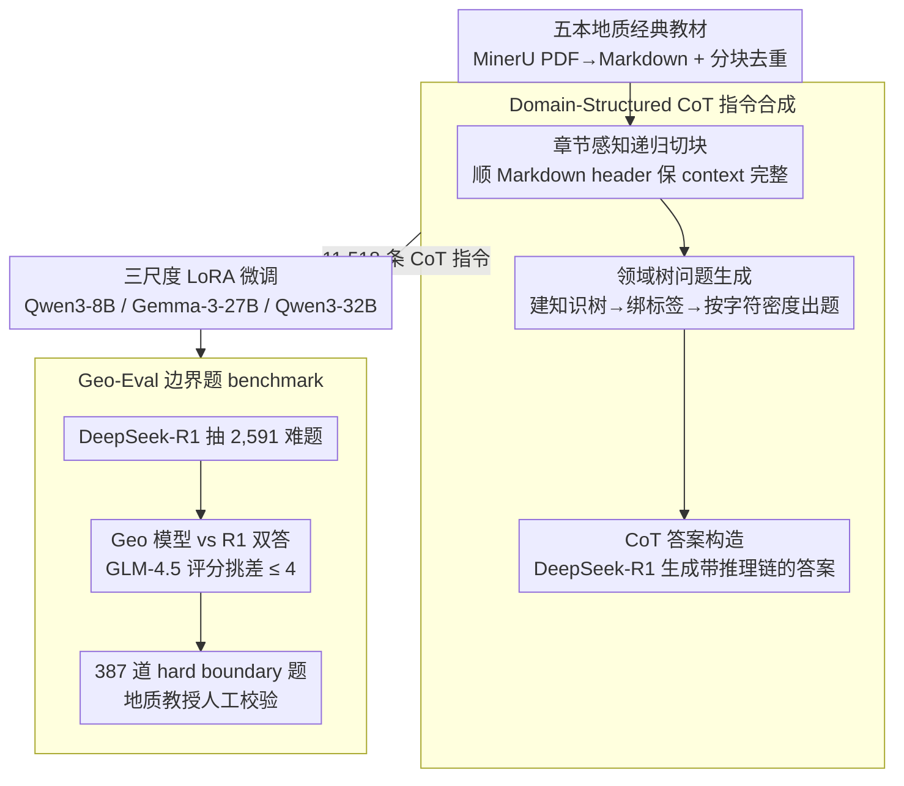

# Geo-Expert: 用 LoRA 把 8B 模型微调成专家级地质推理 LLM

**会议**: ICML 2026  
**arXiv**: [2605.24844](https://arxiv.org/abs/2605.24844)  
**代码**: 论文未提供  
**领域**: 领域适配 / 科学 LLM / 地质推理  
**关键词**: 地质 LLM, LoRA, 指令合成, CoT, AI for Science

## 一句话总结
Geo-Expert 把 11,518 条从五本地质学经典教科书蒸馏出的 CoT-enhanced 指令数据用 LoRA 微调 Qwen3-8B/32B 和 Gemma-3-27B；在 Geo-Eval（387 hard boundary 题）上 Qwen3-8B-geo 平均 6.27 超过 Llama-3.1-70B-Instruct（4.12）和 GPT-4o（5.93），Qwen3-32B-geo 6.82 接近 GPT-5.4（7.15）；证明 high-quality domain alignment 比 scaling 重要。

## 研究背景与动机

**领域现状**：当前 Earth Science 大模型（K2、GeoGalactica、GeoGPT、UnivEARTH）擅长 surface 任务但不涉及 solid Earth（地下层序解释、构造演化、岩石成因）的 deep reasoning。地质推理需要复杂的时空关系和大量专业数据。

**现有痛点**：通用 LLM 在地质学上经常严重 hallucinate——比如把"楔形地质构造"的 wedge 错认成机械工程的楔子，建议用碳纤维布加固混凝土。现有 geoscience foundation models 主要在 surface 文献上预训练，对 subsurface stratigraphic 推理几乎没专门 adaptation。

**核心矛盾**：通用 LLM 缺乏地质 domain alignment；scaling 不能直接救——地质术语高度多义、推理链长、cross-discipline 干扰严重，需要 deep domain anchoring 而不是更多参数。

**本文目标**：建一套可复现的 pipeline 把通用 LLM 转化成"专家级地质推理器"，用 PEFT 控制成本，证明 small + aligned 模型可超越 large generalist。

**切入角度**：从权威教科书（Catuneanu、Fossen、Gao、Rowland 五本）抽 ground truth；用 LLM 系统生成 CoT-enhanced 指令数据；LoRA 微调三个 backbone 看 scaling；用 adversarial mining + expert verification 建 Geo-Eval benchmark 测试 hard boundary 问题。

**核心 idea**：High-quality domain-aligned data + PEFT + 难题 benchmark 三件套——CoT-enhanced 数据让模型学到推理链而非词条匹配；LoRA 在 RTX 5090 上能微调到 32B；Geo-Eval 通过 boundary mining 专门考真专家推理。

## 方法详解

### 整体框架

Geo-Expert 想把一个普通通用 LLM 变成会做"地下层序解释、构造演化、岩石成因"这类深层地质推理的专家。它走的是一条端到端的数据驱动 pipeline：先把五本地质学经典教材数字化清洗成干净文本（MinerU 把 PDF 转 Markdown，再用 Python 按段落分块去重），然后从这些文本里系统合成 11,518 条带 CoT 推理链的指令数据，用 LoRA 在 8B/27B/32B 三个 backbone 上微调，最后用一个专门挖"难题"的 Geo-Eval benchmark 来验收。三件套——好数据、PEFT、难 benchmark——共同支撑"小模型 + 对齐数据胜过大模型 + 通用数据"这个核心论点。

### 关键设计

**1. Domain-Structured CoT 指令合成：让模型学"怎么推"而不只是"说什么"**

通用 fine-tuning 直接喂 raw text，模型顶多学会复述术语，碰到需要多步推理的地质题就露馅。这条 pipeline 的关键就是把教材文本转成带推理链的 instruction-response 对。它分三步走：先是 Chapter-Aware Recursive Chunking，顺着 Markdown header 的章节结构递归切块，保证每个语义块的 context 完整、不会把一个论证拦腰截断；再是 Domain-Structured Question Generation，让 LLM 先为整个语料建一棵 hierarchical domain tree，给每段文本 bind 上领域标签，然后根据标签和字符密度动态生成问题，既覆盖知识树各节点又避免冗余重复；最后是 CoT Answer Construction，用 reasoning-oriented 的 DeepSeek-R1 来生成答案，强制答案里带上中间推理步骤。这样产出的 11,518 条数据不是词条匹配的填空题，而是一条条完整的 reasoning chain——后面实验里 Engineering 维度涨幅最大（+46%），正是因为模型学到的是推理而非术语。

**2. 三尺度 LoRA 微调：让 scaling 对比真正成立**

只在一个规模上微调看不出 domain adaptation 随模型大小怎么变，所以本文刻意跨 8B/27B/32B 三个 backbone 各做一遍 LoRA。Qwen3-8B 用 rank=32、$\alpha=32$、lr=2e-5、FP16，单张 RTX 5090 就能跑；Gemma-3-27B 和 Qwen3-32B 把 LoRA 放大到 rank=64、$\alpha=128$，配合 BF16、gradient checkpointing 和 grad accum=4，在 4×RTX 5090 上完成，LoRA 适配器挂到所有 linear 层。三个规模一起跑，"小模型 + 好数据" vs "大模型 + 通用数据"的较量才有可比的坐标系，也才能得出"8B 是 sweet spot、再往上参数边际收益很小"的结论。整套 recipe 控制在 prosumer 级 GPU 上，预算紧的研究组也能复现。

**3. Geo-Eval：用对抗挖掘 + 专家校验造一个真考推理的 benchmark**

传统 static MCQ 早被现代大模型刷烂，测不出谁更会推理。Geo-Eval 的做法是主动去挖"通用模型刚好够不到"的边界题：先让 DeepSeek-R1 从教材抽出 2,591 道复杂问题及答案，再让 Qwen3-8B-Geo 和 DeepSeek-R1 各自独立作答，然后用 GLM-4.5 当 LLM-as-judge 按 10 分制打分，挑出两者得分差 $\leq 4$ 的 387 道 "hard boundary" 题，最后请地质教授人工校验。题目分 Concept、Process、Engineering 三个维度。这种 boundary mining 自动筛出 discriminative 的难题，比靠人工出题更精准地卡在能力分水岭上，是 vertical scientific LLM 评测方法学上的一步推进。

## 实验关键数据

### 主实验：Geo-Eval 三维度 score

| Model | Size | Concept | Process | Engineering | Average | Δ vs Base |
|-------|-----|---------|---------|-------------|---------|-----------|
| GPT-5.4 | - | 7.35 | 7.10 | 7.00 | 7.15 | - |
| DeepSeek-V3.2 | - | 6.80 | 6.75 | 6.67 | 6.74 | - |
| GPT-4o | - | 6.10 | 5.90 | 5.80 | 5.93 | - |
| Gemma-3-27B-IT | 27B | 5.30 | 5.10 | 5.08 | 5.16 | - |
| Qwen3-32B | 32B | 5.20 | 4.90 | 4.90 | 5.00 | - |
| Qwen3-8B | 8B | 4.80 | 4.68 | 4.41 | 4.63 | - |
| Llama-3.1-70B | 70B | 4.30 | 4.10 | 3.96 | 4.12 | - |
| **Qwen3-32B-geo** | 32B | 6.78 | 6.79 | **6.90** | **6.82** | +1.82 |
| **Gemma-3-27B-geo** | 27B | 6.70 | 6.60 | 6.47 | 6.59 | +1.43 |
| **Qwen3-8B-geo** | **8B** | 6.10 | 6.27 | 6.44 | **6.27** | **+1.64** |

Qwen3-32B-geo 6.82 全场第二，仅次于 GPT-5.4 7.15；Qwen3-8B-geo 6.27 超过 GPT-4o 和所有 < 70B 开源模型，统计显著（$p = 3.7 \times 10^{-106}$）。

### 关键发现

- **8B + domain alignment 超过 70B generalist**：Qwen3-8B-geo 6.27 vs Llama-3.1-70B 4.12 (+51%)。证明 scaling law 在 vertical domain 失效。
- **8B → 32B 增量微弱**：8B-geo 6.27 → 32B-geo 6.82 仅 +0.55，说明 32B 的额外参数对地质推理边际效益不大。
- **Engineering 维度提升最大**：Qwen3-8B 4.41 → Qwen3-8B-geo 6.44（+46%），证明不仅教术语还教推理。
- **跨架构稳定**：三个 backbone 都涨 1.5+ 分，方法 robust。
- **质化分析戏剧性**：GPT-4o 把"wedge thickening"答成混凝土加固（0/10），Qwen3-8B-geo 准确解释 thrust fault sliding 等地质机制（9/10）。

## 亮点与洞察

- **CoT 增强是 domain adaptation 的关键 trick**：从 Engineering +46% 看，CoT data 价值远超 raw text 数据。
- **3 backbone scaling analysis 的方法学价值**：本文证明 8B 是 sweet spot，对预算紧的研究组有直接指导。
- **Hard Boundary Benchmark 是 discriminative 评测的范式**：自动 mine 出"generalist 刚好够不到"的题专测 expert reasoning，方法可推广到所有 vertical scientific LLM 评测。
- **Consumer GPU recipe**：4×RTX 5090 微调 32B，让 academic 研究组能复现。
- **5 本经典教材为 anchor**：选公认权威 textbook，保证 data quality 和 domain rigor。
- **Selection bias mitigation 三层**：expert re-write + GPT-4o judge + 其他 model 验证。

## 局限与展望

- **教材选择 bias**：5 本教材偏 structural geology、stratigraphy、tectonics，mineralogy/geochemistry/geophysics 覆盖不足。
- **Geo-Eval 387 题规模偏小**：相比通用 benchmark 万级题量，statistical power 偏弱。
- **Text-only**：当前框架不处理地质数据固有 multimodal 性质（cross-sections、well logs、field photos）。
- **GPT-4o 当 judge 的偏好**：reference-guided 评分仍可能有 LLM judge 的 verbosity/style bias。
- **缺 retrieval-augmented baseline**：RAG + general LLM 是否能达到类似效果未对比，PEFT 优势可能被高估。
- **5,090 微调 32B 的工程细节**：BF16 + grad checkpointing + grad accum=4 的内存预算需要 4×RTX 5090，依然是 prosumer-grade 而非 consumer。

## 相关工作与启发

- **vs K2 / GeoGalactica**：他们做 continued pre-training on broad geoscience corpora，偏 factual recall；本文做 PEFT + CoT instruction tuning，偏 multi-step reasoning。
- **vs GeoGPT / UnivEARTH**：geospatial agents，做 2D surface 任务；本文做 subsurface deep reasoning。
- **vs MedLLM / FinGPT / LawGPT**：domain LLM 同族工作，但大多 raw text fine-tune；本文用 CoT-enhanced data 是方法学差异。
- **vs LIMA / Alpaca**：general instruction tuning，本文是 vertical instruction tuning + boundary benchmark。
- **vs ProcessBench / PRM**：step-level reasoning evaluation 思路相似，本文 adversarial mining + boundary 是 evaluation 创新。
- **启发**：(1) 任何 vertical scientific LLM 都应该用 CoT-enhanced data + boundary benchmark 评测；(2) "small + aligned > large + general" 在所有 vertical domain 都应该 revisit；(3) 教材作为 ground truth 源是 cost-effective 的 alternative to 论文堆 + RAG。

## 评分

- 新颖性: ⭐⭐⭐⭐ Domain-structured CoT instruction synthesis + boundary mining benchmark + 3-backbone scaling analysis 组合，方法学创新中等但落地扎实。
- 实验充分度: ⭐⭐⭐⭐ 3 backbone × Geo-Eval 3 维度 + 11 个 baseline + paired t-test + qualitative case study，证据完整。
- 写作质量: ⭐⭐⭐⭐ 流程图清晰、数据 table 详细、qualitative case 有说服力；selection bias 三层 mitigation 体现 reviewer-conscious。
- 价值: ⭐⭐⭐⭐⭐ "8B + aligned > 70B" 的实证对 vertical AI 部署有直接指导，benchmark 方法可推广到其他 STEM domain，对 democratize scientific LLM 有实战价值。

<!-- RELATED:START -->

## 相关论文

- [\[ICML 2026\] Breaking the MoE LLM Trilemma: Dynamic Expert Clustering with Structured Compression](breaking_the_moe_llm_trilemma_dynamic_expert_clustering_with_structured_compress.md)
- [\[ICML 2026\] FedRot-LoRA: Mitigating Rotational Misalignment in Federated LoRA](fedrot-lora_mitigating_rotational_misalignment_in_federated_lora.md)
- [\[ICML 2026\] GEMQ: Global Expert-Level Mixed-Precision Quantization for MoE LLMs](gemq_global_expert-level_mixed-precision_quantization_for_moe_llms.md)
- [\[ICML 2026\] PRISM: Synergizing Vision Foundation Models via Self-Organized Expert Specialization](prism_synergizing_vision_foundation_models_via_self-organized_expert_specializat.md)
- [\[ICML 2026\] ProjQ: Project-and-Quantize for Adapter-Aware LLM Compression](projq_project-and-quantize_for_adapter-aware_llm_compression.md)

<!-- RELATED:END -->
