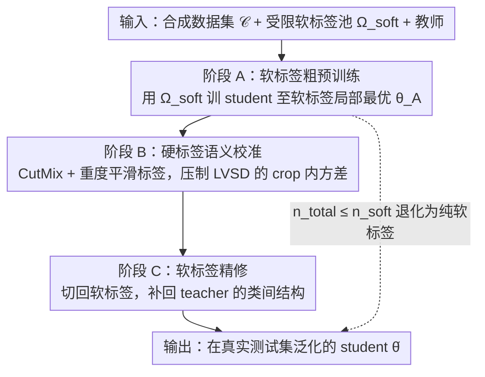

# Hard Labels In! Rethinking the Role of Hard Labels in Mitigating Local Semantic Drift

**会议**: ICML 2026  
**arXiv**: [2512.15647](https://arxiv.org/abs/2512.15647)  
**代码**: https://github.com/Jiacheng8/HALD  
**领域**: 模型压缩 / 数据集蒸馏  
**关键词**: 数据集蒸馏、软标签压缩、局部语义漂移、硬标签校准、SRe2L  

## 一句话总结
针对大规模数据集蒸馏中"每张图存大量软标签"导致的天价存储成本，本文证明在每图软标签数 $s$ 受限时会发生**局部视图语义漂移 (LVSD)**，并提出 soft→hard→soft 三阶段训练范式 HALD，用平滑后的硬标签作为语义锚把训练拉回正轨——ImageNet-1K 上 285M 软标签存储取得 42.7% 准确率，比 SOTA LPLD 涨 9.0%、软标签存储压缩 100 倍。

## 研究背景与动机

**领域现状**：数据集蒸馏（SRe2L、FKD、LPLD、FADRM 等）的事实标准是用 teacher 在每张图的每个 crop 上预先生成一份软标签存盘，训练时反复回放。软标签编码了类间相似性，比 one-hot 平滑得多，是大规模 ImageNet 级蒸馏几乎不可替代的监督信号。

**现有痛点**：软标签存储是个噩梦。ImageNet-1K 上蒸馏数据本身只占 750 MB，而 FKD 风格的每 crop 软标签合计达 **28.33 GB**，比图像存储还大一个数量级。最直接的缓解办法是减少每图 crop 数 $s$，但这会引入一个被普遍忽视的副作用：crop 可能只覆盖图像局部区域（一只猫的脸或一根猫毛），teacher 给出的 soft prediction 会语义漂移到"兔子"或"地毯"，与图像级 ground-truth 不一致。

**核心矛盾**：软标签能提供 fine-grained 监督但**会随 crop 内容漂移**；硬标签语义稳定但**粒度太粗**。LPLD 等只是减少 crop 数省存储，没有解决漂移问题；FKD 维持 crop 数解决漂移但存储爆炸。两者各取一极。

**本文目标**：(i) 形式化"少软标签 ⇒ 训练-测试分布失配"这条链路；(ii) 找到一种监督方式，能在 $s$ 很小时仍恢复全局语义对齐。

**切入角度**：作者把被遗忘的**硬标签**重新捡回来。硬标签依附于图像级真实类别，与 crop 是否包含主体无关，是 content-invariant 的"语义锚"。理论上 soft + hard 联合能拆出"信息漂移"分量并校正之。

**核心 idea**：在 soft-only 训练中间插入一段**平滑后的硬标签校准期**（CutMix + label smoothing），形成 soft→hard→soft 的三阶段课程，用硬标签矫正 LVSD 引入的方差再回到软标签精修。

## 方法详解

### 整体框架

输入：蒸馏好的 synthetic 数据集 $\mathcal{C}$、预生成的有限软标签池 $\Omega_{\text{soft}}$（容量受每图软标签数 $s$ 控制）、教师 teacher。输出：在真实测试集上能泛化的 student $\hat\theta$。

整体训练分三阶段，由 $n_{\text{total}}$ 与"软标签 ERM 收敛所需 epoch 数" $n_{\text{soft}}$ 决定划分：

$T_A=\lfloor n_{\text{soft}}/2 \rfloor,\ T_B = n_{\text{total}}-n_{\text{soft}},\ T_C = n_{\text{soft}}-T_A$

阶段 A 用 $\Omega_{\text{soft}}$ 软标签做粗预训练；阶段 B 切换到 CutMix + label-smoothed 硬标签做语义校准，专门压制 LVSD 引入的 crop-内方差；阶段 C 再回到软标签精修，巩固类间结构。若 $n_{\text{total}} \le n_{\text{soft}}$ 则退化为纯软标签训练，HALD 兼容现有 SRe2L/LPLD pipeline。

理论部分是动机的核心。作者把 LVSD 拆成两块：固定 $\tilde x$、令 $\bar p = \mathbb{E}[\tilde p(x^{(\text{crop})})]$、$\Sigma=\text{Cov}[\tilde p(x^{(\text{crop})})]$，对 $s$ 个 crop 聚合 $\hat p_s$ 的监督误差恰好分解为"oracle 不可约项 $\|\bar p - e_y\|_2^2$"加上"LVSD 项 $\text{Tr}(\Sigma)/s$"。只要 $\Sigma \ne 0$ 且 $s$ 有限，LVSD 项就严格大于 0。进一步 Theorem 3.5 给出训练目标层面的 $\Omega(s^{-1/2})$ 偏差下界；Theorem 3.6 给出 ERM 解 $\hat\theta_s$ 与 oracle $\hat\theta_\star$ 之间 $\Omega(1/s)$ 的过剩泛化损失下界。这些下界都只在 $s\to\infty$ 时消失——但 $s$ 大正是要避免的存储灾难。结论：**靠纯软标签不可能在低 $s$ 下追平 oracle**，必须引入额外的、与 crop 内容独立的监督源。

### 关键设计

**1. LVSD 的形式化定义与 Cantelli 下界：把"crop 不够导致 student 把猫误判成兔子"写成可算的概率**

以往工作都只是经验观察"crop 少会掉点"，没人说清机制。作者把它形式化成一个类反转事件 $\mathcal{E}_{s,c}=\{\hat p_s(c) \ge \hat p_s(y)\}$——即聚合后的预测把错类 $c$ 排到了真类 $y$ 前面——再用 Cantelli 不等式给出 distribution-free 的上界 $\Pr(\mathcal{E}_{s,c}) \le v_{s,c}/(v_{s,c}+(\bar p_y - \bar p_c)^2)$，其中方差项 $v_{s,c}=(\Sigma_{yy}+\Sigma_{cc}-2\Sigma_{yc})/s$ 随 crop 数 $s$ 单调下降。这是首个与 teacher/数据无关、可量化的"少软标签会出错"保证。它的妙处在于把"硬标签能修多少漂移"也变成能算账的事：第二阶段的硬标签监督恰好把 $v_{s,c}$ 强行往 0 压，于是反转概率随 epoch 单调收敛——理论上指明了校准信号该插在哪、能压住什么。

**2. soft→hard→soft 三阶段课程：在 LPLD 同等存储预算下把训练-测试分布拉回一致**

这是 HALD 的主干。纯软标签会被 LVSD 漂移，纯硬标签又会丢掉 teacher 的类间相似性退回 one-hot，作者的解法是只在中间插一段硬标签校准。阶段 A 照常用软标签池采 minibatch 训 student，优化 $\hat{\mathcal{L}}^{(t)}_{\text{soft}}(\theta)=\frac{1}{B}\sum_b \mathcal{L}(\tilde p_{j_b}, q_\theta(\cdot\mid x_{j_b}^{(\text{crop})}))$，把它拉到软标签的局部最优 $\hat\theta_s^A$；阶段 B 以 $\theta_0 := \hat\theta_s^A$ 为初值，每步重采 CutMix 几何 $(x,x',\lambda,m)$ 与平滑标签 $t_{\lambda,\alpha}(y,y')=(1-\lambda)\text{LS}_\alpha(y)+\lambda \text{LS}_\alpha(y')$，最小化 $\ell_{\text{cal}}(\theta;\omega)=\mathcal{L}(t_{\lambda,\alpha}, q_\theta(\cdot\mid \text{CM}_{\lambda,m}(x,x')))$——由于几何每步重抽、minibatch 几乎不重复，这一段等价于"无限多样的局部视图 × 全局真实类别监督"，专门压制 LVSD 引入的 crop-内方差；阶段 C 再切回软标签精修，把被粗化掉的类间结构补回来。三阶段的顺序是关键而非随意：先 soft 让 student 进入合理初值，硬标签校准才有意义；末尾 soft 让网络恢复对类间结构的敏感。这样既压住了方差，又没丢 teacher 的细粒度知识。

**3. 重度平滑的"假硬标签"+ CutMix 几何：让硬标签足够"软"，别把 student 直接拉成 one-hot**

直接用严格 one-hot 做阶段 B 会过犹不及——Fig. 3 显示软-硬梯度的余弦相似度在训练中持续上升，若把标签粗化得太狠，两边目标会互相抵消。作者因此不用 $\delta_y$，而是用平滑标签 $\text{LS}_\alpha(y)=(1-\alpha)\delta_y + \alpha\,\mathbf{1}/C$，并用 CutMix 把两张图按几何 mask $m$ 与比例 $\lambda$ 拼接、目标 $t_{\lambda,\alpha}(y,y')$ 同步混合。Synthetic 图本身语义比真实图更弱，所以作者取较大的 $\alpha$ 形成 heavily-flattened 标签来稳定校准。这么做让阶段 B 提供的是 $\bar p$ 附近的扰动，而不是硬推向 $\delta_y$——恰好对应理论里"在 oracle 邻域做方差缩减"的要求，既校准了漂移又不会把 student 撞出软标签学到的解。

### 损失函数 / 训练策略

三阶段共用同一 per-crop 损失 $\mathcal{L}$（cross-entropy 或 soft-target cross-entropy），切换的只是标签形态与 mini-batch 采样空间 $\Omega_{\text{soft}}/\Omega_{\text{cal}}$。学习率沿用各蒸馏方法默认 schedule。HALD 是 plug-in：直接套在 SRe2L、RDED、FADRM、LPLD 之上都生效。

## 实验关键数据

### 主实验

ImageNet-1K 主结果：固定 SLI（每图软标签数）下，HALD 相对 LPLD 大幅领先。

| 数据集 | 设置 | 之前 SOTA | HALD | 绝对提升 |
|--------|------|----------|------|---------|
| ImageNet-1K | SLI=10, IPC=10 | LPLD 33.7% | **42.7%** | +9.0 |
| Tiny-ImageNet | SLI=2, IPC=10 | FADRM 17.4% | **22.8%** | +5.4 |
| Tiny-ImageNet | SLI=1, IPC=10 | FADRM 10.1% | **18.6%** | +8.5 |
| Tiny-ImageNet | SLI=2, IPC=50 | FADRM 36.0% | **38.2%** | +2.2 |
| Tiny-ImageNet | SLI=1, IPC=50 | FADRM 27.8% | **30.7%** | +2.9 |

关键观察：SLI 越小（存储越省），HALD 相对原 SOTA 的领先越大——这正对应理论里"LVSD 在 $s$ 小时支配误差"的预测。

### 消融实验

| 配置 | Tiny-IN, SLI=1, IPC=10 | 说明 |
|------|----------------------|------|
| Soft only（LPLD） | 8.2% | 纯软，受 LVSD 折磨 |
| Soft → Hard（无阶段 C） | 中间值 | 缺最后精修 |
| **HALD (Soft → Hard → Soft)** | **18.6%** | 完整三阶段 |
| HALD w/o label smoothing | 掉点 | 强 one-hot 把 student 拉离 oracle 邻域 |
| HALD w/o CutMix | 掉点 | crop 多样性不足 |

### 关键发现

- **存储-精度边界外移**：HALD 在 285M 软标签预算下达成 LPLD 在 28 GB 预算下都到不了的精度，把数据集蒸馏的可部署阈值往下压了两个数量级。
- **阶段 B 不只是"再训一段"**：作者画了 train/test loss landscape（Fig. 2），纯软标签下 test landscape 与 train 严重错位（典型过拟合到漂移目标）；加入硬标签校准后两者重新对齐。
- **梯度对齐随训练上升**（Fig. 3）：软-硬损失梯度余弦相似度在阶段 A 末期已经显著升高，说明 student 学到的表示越来越能同时满足两种监督，理论里"硬标签不会引入梯度冲突"的假设在经验上得到验证。

## 亮点与洞察

- **把被嫌弃的硬标签重新摆回中心位置**：过去几年蒸馏文献几乎默认"硬标签 = 旧时代遗物"，本文把 storage 视角与漂移视角缝到一起，让硬标签的"零存储 + 内容无关"两个特性突然变成核心资源。
- **理论与课程设计对得很整齐**：Theorem 3.6 的 $\Omega(1/s)$ 过剩损失下界，对应阶段 B 在原本 ERM 收敛后插入校准——既不破坏已有进度，又精准打在下界产生的位置。
- **可迁移的 trick**：soft→hard→soft 课程对任何"标签源不完美但有 cheap 锚标签可用"的场景都成立，例如半监督蒸馏、多教师融合、self-distillation 中真实 GT 注入。
- **形式化"crop 漂移"**：LVSD 这个定义本身是可以单独被引用的——以后讨论"裁剪型数据增强 + soft target"的稳定性时都可以用 $\text{Tr}(\Sigma)/s$ 这条分解。

## 局限与展望

- 理论建立在 teacher 软预测的 covariance $\Sigma$ 与 IID crop 之上，对真实强相关增强（如 RandAug + AutoAug 链）的有效性还需经验验证。
- $T_A/T_B/T_C$ 划分依赖 $n_{\text{soft}}$ 这个"经验收敛点"，超大模型上估计 $n_{\text{soft}}$ 可能本身代价不低。
- 阶段 B 用 CutMix + label smoothing，超出"严格硬标签"语义，作者解释为"heavily-flattened 硬标签"，未来如果蒸馏目标是 detection/segmentation 这类不能简单 mixup 的任务，需要重新设计 calibration 信号。
- 没探讨当 teacher 与 student 架构差异极大（如 ViT teacher → CNN student）时漂移结构是否变化。

## 相关工作与启发

- **vs LPLD (Xiao & He, 2024)**: LPLD 用 limited soft labels 反复回放省存储，但忽略 LVSD；HALD 在同样存储预算下用硬标签校准漂移，ImageNet-1K 上 +9.0%。
- **vs FKD / FerKD**: FKD 每 crop 都存软标签解决精度但存储爆炸；HALD 反过来在低存储侧解决精度。
- **vs GIFT (Shang et al., 2025a)**: GIFT 把硬信息融入软目标（直接修改 label），HALD 在时间维度切换（先 soft 后 hard 再 soft），不需要修改已生成的软标签池，更易接入现有 pipeline。
- **vs label smoothing 文献**: 本文揭示 label smoothing 在蒸馏中扮演的不是正则化角色，而是 LVSD 的方差校准信号——一个被低估的新解释。

## 评分
- 新颖性: ⭐⭐⭐⭐⭐ 第一次把"crop 数 → 语义漂移 → 训练-测试错位"链路形式化，并设计对应的三阶段课程。
- 实验充分度: ⭐⭐⭐⭐⭐ Tiny-IN/IN-1K × 多 IPC × 多 SLI 全覆盖，且对比 SRe2L、RDED、FADRM、LPLD 四类 SOTA。
- 写作质量: ⭐⭐⭐⭐ 理论与算法对应清晰，符号略密集需要耐心，附录证明给得完整。
- 价值: ⭐⭐⭐⭐⭐ 把数据集蒸馏的存储瓶颈拉低 100×，对实际工业部署影响极大。

<!-- RELATED:START -->

## 相关论文

- [\[CVPR 2026\] Rethinking Dataset Distillation: Hard Truths about Soft Labels](../../CVPR2026/model_compression/rethinking_dataset_distillation_hard_truths_about_soft_labels.md)
- [\[ICML 2026\] The Bridge-Garden Dilemma in LLM Distillation: Why Mixing Hard and Soft Labels Works](the_bridge-garden_dilemma_in_llm_distillation_why_mixing_hard_and_soft_labels_wo.md)
- [\[ICML 2026\] DSL-Topic: Improving Topic Modeling by Distilling Soft Labels from Language Models](dsl-topic_improving_topic_modeling_by_distilling_soft_labelsfrom_language_models.md)
- [\[ICML 2026\] DIVER: Diving Deeper into Distilled Data via Expressive Semantic Recovery](diverdiving_deeper_into_distilled_data_via_expressive_semantic_recovery.md)
- [\[ICCV 2025\] Heavy Labels Out! Dataset Distillation with Label Space Lightening](../../ICCV2025/model_compression/heavy_labels_out_dataset_distillation_with_label_space_lightening.md)

<!-- RELATED:END -->
