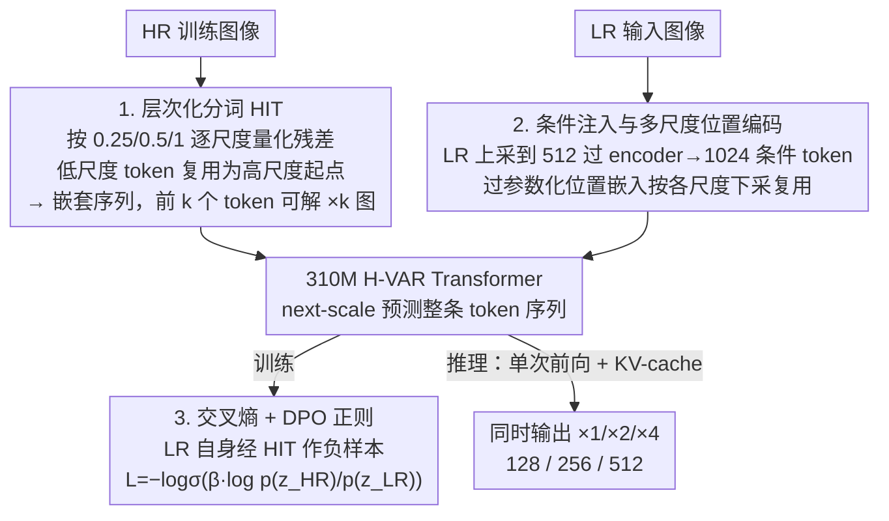

# Hierarchical Image Tokenization for Multi-Scale Image Super Resolution

**会议**: ICML 2026  
**arXiv**: [2605.14891](https://arxiv.org/abs/2605.14891)  
**代码**: 无  
**领域**: 模型压缩 / 图像超分 / 视觉自回归  
**关键词**: VAR, 残差量化, 多尺度超分, 层次化分词, DPO 正则

## 一句话总结
H-VAR 把"残差量化做多尺度生成"的 VAR 范式重新切片成层次化的图像 tokenization (HIT)，让一个 310M 的小模型只跑一次前向就能输出 128 / 256 / 512 三个有意义的中间分辨率，再配一个不需要外部奖励模型的 DPO 正则项推动输出偏向 HR，在标准 ISR 数据上对打 1B 参数的 VARSR。

## 研究背景与动机

**领域现状**：图像超分的强 baseline 长期被 GAN（Real-ESRGAN）和扩散模型（StableSR、SeeSR、ResShift）占据；近期 next-scale 预测的 VAR 因为天然按尺度残差展开，被 VARSR、PURE、VARestorer 拿来做 ISR——pretraining 与 downstream 的对齐度比扩散更好。

**现有痛点**：现有 AR-based 超分两大短板。其一，原版 RQ-VAE 把图像分成 $L$ 个不断加细的残差，但前几级残差里并没有"低分辨率语义"，只是高频细节的随机分配，所以中间阶段不能解码成有意义的低分图；要做 $\times 4$ 就只能一次跑完整条 token 序列，无法顺带产 $\times 2$。其二，为了追上 SOTA，VARSR 必须用 1B 大模型 + classifier-free guidance + 海量带标注数据，PURE 直接套 7B Lumina-mGPT。

**核心矛盾**：VAR 的 token 序列是"通用残差堆"——压缩效率最高，但缺少"尺度语义"这条强约束；想要多尺度有意义，就必须把"按尺度可解"硬塞进 tokenization，但这又会让单尺度的重建变差，存在一对显式 trade-off。

**本文目标**：(a) 设计一种 tokenization，使前 $k$ 个 token 能确定地解码出该尺度的有效图像，且尺度间共享 token；(b) 在不堆数据、不加 VLM 的前提下，把"VAR 输出 HR 而不是 LR"的偏好硬编码进训练目标。

**切入角度**：作者观察到，next-scale prediction 之所以能压缩冗余，是因为下一尺度的预测要依赖上一尺度的全部 token；如果把"下采样—量化—升采样"做成在每个目标尺度上独立闭环并强制 token 复用，就能既保多尺度可解性，又保留 VAR 的序列预测格式。

**核心 idea**：用 HIT（Hierarchical Image Tokenization）把 RQ-VAE 的残差按目标尺度切片复用 token，加上一个用 $p(z_{HR})/p(z_{LR})$ 比值的 DPO 正则项，做一个 310M 的多尺度 H-VAR。

## 方法详解

### 整体框架
H-VAR 要解决的是"让一个小 VAR 既能多尺度可解、又不靠堆数据追上 SOTA"。整条管线分两块：先训一个 Hierarchical RQ-VAE，在 Switti 预训练 RQ-VAE 上 finetune vocabulary 与 decoder，把残差 token 序列切成 $N$ 个嵌套片段 $\{s_1,\dots,s_N\}$，使每个片段都能独立解码到对应尺度的图像；再训一个 310M 的 16 层 GPT-2 风格 transformer（Hierarchical VAR），以 RQ-VAE encoder 编码的 LR 特征为 condition，按 next-scale 预测整条 token 序列，用 cross-entropy 加 DPO 正则联合训练。推理时一次前向、重用 KV-cache，就同时吐出 $\times 1/\times 2/\times 4$ 三个分辨率。

### 关键设计

**1. Hierarchical Image Tokenization (HIT)：让前 $k$ 个 token 真正对应"$\times k$ 的有效图像"**

原版 RQ-VAE 把图像摊成 $L$ 级不断加细的残差，但前几级残差只是高频细节的随机分配，没有任何"低分辨率语义"约束，这正是 VAR 产不出有意义中间尺度的根因。HIT 把这条约束直接做进 tokenization：定义一组目标尺度 $s_1 < s_2 < \dots < s_N$（论文取 $(0.25, 0.5, 1)$ 对应 $\times 1/\times 2/\times 4$），对每个尺度 $n$，先把输入图下采样到 $s_n \rho_L$ 编码出 $\mathbf{Z}_n$，在该尺度上量化残差；量化到的 token 既记入 $s_n$ 子序列，又作为下一尺度的"起点 token"被复用；随后切到 $s_{n+1}$，把前一尺度 token 上采到当前残差空间扣掉，再量化新增的残差。一张图于是被切成嵌套结构 $z = \{\{\{z_1,\dots\}_{s_1},\dots\}_{s_2}, \dots\}_{s_N}$。vocabulary 与 decoder 的 finetune 也配合这件事：保持 decoder 冻结，用 encoder 特征与 token 嵌入的 $\ell_2$ 距离梯度去更新 vocabulary。"前 $k$ 个 token 必须能重建尺度 $k$"等于在表示空间里注入一条极强的归纳偏置，把 token 序列的路径搜索空间大幅压缩——这也是为什么 transformer 能从 1B 砍到 310M 还守住 SOTA。

**2. 条件注入与多尺度位置编码：一张可下采样的大表统一所有尺度**

单个 transformer 要处理 $\sum_l \rho_l^2 = 3452$ 个分属不同尺度的 token，位置编码是最容易出 BUG 的地方。作者用一份"过参数化的可学习位置嵌入"——按最大尺度声明一张大表，对每个目标分辨率 $\rho_l$ 下采样到对应尺寸来用，既免去维护多套权重，又让模型在尺度间共享位置归纳偏置。条件注入则走简化路线：不像 VARSR 用 ControlNet 编码 LR，而是把 LR 双线性上采到 512、过 RQ-VAE encoder 拿到 1024 个 conditioning token 直接喂进去，省掉一个独立分支，也消除了 ControlNet 与主干尺度不匹配的麻烦。

**3. DPO 正则推动 HR 偏好：用 LR 自身当负样本，不需要外部奖励模型**

由于 HR 与 LR 在低尺度的 token 严重重合，VAR 很容易偷懒直接复读 LR、输出和输入差不多的结果。作者把上采到 512 的 LR 也跑一遍 HIT 拿到 $z_{LR}$，再用 AR 模型能算序列 log-likelihood 这一特性，定义 $\mathcal{L}_{DPO} = -\log\sigma\left(\beta \log \frac{p(z_{HR})}{p(z_{LR})}\right)$，与标准 cross-entropy 等权相加；$\beta = 0.2$，过小则损失项几乎恒定失效、过大则训练不稳。妙处在于传统 DPO 必须有 pair-wise preference 加 reference policy、在生成式 ISR 里通常要另训 reward 模型，而 ISR 的 LR/HR 天然就是一对偏好样本、LR 自带"负样本"角色，于是 DPO 退化成一个无监督正则——成本几乎为零却能显著锐化结果（diffusion 写不出序列 likelihood，做不了这步，这也是论文选 VAR 的关键理由之一）。

### 损失函数 / 训练策略
- RQ-VAE 微调：$\mathcal{L}_{RQVAE} = \ell_2 + 5\, \mathcal{L}_{LPIPS}$，AdamW、batch 384、lr 0.00025、25K 步、24 张 A100、约 24 小时；按 HART 方式以 50% 概率丢掉量化直接通 decoder，让 vocabulary 不过拟合。
- H-VAR 训练：cross-entropy + $\mathcal{L}_{DPO}$ 等权重；从 VAR d-16 官方 checkpoint 初始化、24 张 A100、200 epochs、batch 384、lr 1e-3、AdamW betas $(0.9, 0.95)$，约 13 小时完成。
- 训练数据完全标准：DIV2K + DIV8K + Flickr2K + OST + 10K FFHQ，用 Real-ESRGAN degradation 合成 LR-HR，不依赖任何专有数据集。

## 实验关键数据

### 主实验

| 数据集 | 指标 | StableSR | ResShift | VARSR (1B) | VARSR-d16 | H-VAR (310M, ours) |
|---|---|---|---|---|---|---|
| DIV2K-Val | LPIPS ↓ | 0.323 | 0.428 | 0.326 | 0.495 | **0.317** |
| DIV2K-Val | FID ↓ | 28.32 | 30.79 | 35.51 | 45.96 | **28.86** |
| RealSR | LPIPS ↓ | 0.300 | 0.346 | 0.350 | 0.413 | **0.256** |
| DRealSR | LPIPS ↓ | 0.333 | 0.401 | 0.354 | 0.409 | **0.259** |
| DRealSR | FID ↓ | 148.2 | 159.8 | 155.9 | 244.7 | **145.1** |

| 模型 | 参数量 | FLOPs | 推理时间 | DIV2K-Val FID (LPIPS) |
|---|---|---|---|---|
| H-VAR (Ours) | 310M | 0.921T | 0.25s | 28.86 (0.317) |
| VARSR | 1B | 3.071T | 0.93s | 35.51 (0.326) |
| ResShift | 173M | 2.651T | 0.17s | 30.79 (0.428) |
| StableSR | 919M | 79.94T | 5.51s | 28.32 (0.323) |

### 消融实验

| 数据集 | 配置 | PSNR@128 | PSNR@256 | PSNR@512 | LPIPS@512 |
|---|---|---|---|---|---|
| RealSR | w/o DPO | 20.56 | 23.09 | 25.72 | 0.310 |
| RealSR | w/ DPO | **22.09** | **24.41** | 25.55 | **0.256** |
| DRealSR | w/o DPO | 23.03 | 26.38 | 28.61 | 0.335 |
| DRealSR | w/ DPO | **25.26** | **27.65** | **28.73** | **0.259** |

| 配置 (RealSR LPIPS@512) | 128 | 256 | 512 |
|---|---|---|---|
| VARSR (1B) | 0.618 | 0.450 | 0.350 |
| Baseline (RQ-VAE 但无 HIT) | 0.686 | 0.491 | 0.311 |
| H-VAR (HIT) | **0.199** | **0.236** | **0.256** |

### 关键发现
- 在中间尺度 128 / 256，没有 HIT 的 baseline 几乎不可用（LPIPS > 0.4），HIT 直接把分数砍到 0.2 段，验证它是真正在中间尺度产可读图，不是噱头。
- HIT 当 inductive bias 极强：把 transformer 从 1B 砍到 310M、把训练数据从 VARSR 的专有集换成标准公开集，最终 FID/LPIPS 仍能并列或超过 VARSR；说明很多看似要靠"堆数据/堆参数"解决的问题，本质是 token 表示没对齐。
- DPO 正则在所有数据集和所有尺度上几乎都涨点，且不需要外部 reward 模型，是一个"成本几乎为零"的免费午餐。
- 副作用：因为前几级残差被强制分给低分辨率，最终 512 分辨率重建会有轻微退化；$L=10 \to 11$ 能补回来但推理成本飙升 24%，作者老实承认这是 trade-off。

## 亮点与洞察
- "把多尺度可解性写进 tokenization"是这篇最值得记住的一招——它不是改 transformer 架构、不是加 loss，而是在更上游的 vocabulary 上做约束；上游一旦改对，下游模型可以小一个数量级。
- 用 LR 自身当 DPO 的负样本是非常聪明的"自监督 preference learning"，省掉了 reward model；这个 trick 可以直接迁到任何"有自然劣化对"的生成任务（去模糊、去噪、风格弱化）。
- 论文老实揭露 trade-off：HIT 在最高分辨率上会折损一点重建质量，必须靠加更多 token 步数补回来——这种"利弊都摊在桌面上"的写作非常加分。
- 单次前向给三个分辨率，对实际产品（手机端、缩略图预览）非常友好，是一个真正能落地的工程优势而不仅是 paper 指标。

## 局限与展望
- 多尺度被硬切成 3 段离散尺度，想要任意倍率上采（$\times 1.5, \times 3$）还需要重新设计 $\rho_l$ 分配；这是 tokenization 范式天生的离散性。
- DPO 用 LR 当负样本默认 LR 是 "差答案"，但当输入本身就是 close-to-HR 的轻度退化时，这条偏好可能反而把模型推过头去产生 over-sharpening。
- 实验全部在 $\times 4$ 标准设置下，未在 $\times 8 / \times 16$ 上验证 HIT 是否仍保持效率优势；高倍率下中间尺度更多，token 序列展开后是否仍能压在小模型里，需要进一步检验。
- 与扩散类强 baseline（如 PASD、SUPIR）的对比未覆盖，主要对手仍是同门 VARSR；如果要把 SOTA 帽子戴得更稳，建议补这些对比。

## 相关工作与启发
- **vs VARSR**：同样把 VAR 用到 ISR，但 VARSR 用原版 RQ-VAE，中间尺度无意义、必须用 1B 模型和大量私有数据；H-VAR 用 HIT 把这两个短板一次性解决，且不需要 ControlNet 这种额外分支。
- **vs PURE**：PURE 用 7B Lumina-mGPT，把图像和退化描述都塞进 vocabulary；H-VAR 走相反方向——靠"上游 token 设计 + 简单 DPO"，证明 ISR 不一定要堆多模态大模型。
- **vs diffusion-based ISR（StableSR / ResShift）**：DM 推理慢、不能写出序列 likelihood，所以做不了原生 DPO；H-VAR 的 AR 形式带来这两个好处，也是论文选 VAR 而不是 DM 的关键理由。
- 启发："把任务结构当 inductive bias 注入 tokenization"是一个被低估的方向，下一个值得做的是 video AR（按时间尺度切 token）、医学影像 AR（按解剖层次切 token）。

## 评分
- 新颖性: ⭐⭐⭐⭐ HIT 是 VAR ISR 里首个支持多尺度的方案，DPO 用 LR 当负样本也是新做法；但底层范式仍是 RQ-VAE+VAR。
- 实验充分度: ⭐⭐⭐⭐ 三类 baseline、多个数据集、$L/\rho_l$ 敏感性、复杂度全有；缺与扩散 SOTA（PASD/SUPIR）对比。
- 写作质量: ⭐⭐⭐⭐⭐ 算法伪代码、图示、消融、限制讨论都做得很干净。
- 价值: ⭐⭐⭐⭐ 用 310M 打平 1B，且一次前向出 3 个分辨率，对工业部署有直接价值。

<!-- RELATED:START -->

## 相关论文

- [\[AAAI 2026\] HCF: Hierarchical Cascade Framework for Distributed Multi-Stage Image Compression](../../AAAI2026/model_compression/hcf_hierarchical_cascade_framework_for_distributed_multi-stage_image_compression.md)
- [\[ICML 2026\] Efficient Learned Image Compression without Entropy Coding](efficient_learned_image_compression_without_entropy_coding.md)
- [\[ICCV 2025\] Learned Image Compression with Hierarchical Progressive Context Modeling](../../ICCV2025/model_compression/learned_image_compression_with_hierarchical_progressive_context_modeling.md)
- [\[ICML 2026\] From Per-Image Low-Rank to Encoding Mismatch: Rethinking Feature Distillation in Vision Transformers](from_per-image_low-rank_to_encoding_mismatch_rethinking_feature_distillation_in_.md)
- [\[AAAI 2026\] QuantVSR: Low-Bit Post-Training Quantization for Real-World Video Super-Resolution](../../AAAI2026/model_compression/quantvsr_low-bit_post-training_quantization_for_real-world_video_super-resolutio.md)

<!-- RELATED:END -->
