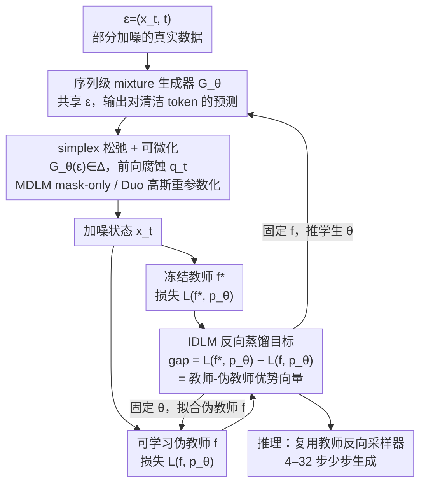

# IDLM: Inverse-distilled Diffusion Language Models

**会议**: ICML 2026  
**arXiv**: [2602.19066](https://arxiv.org/abs/2602.19066)  
**代码**: https://david-cripto.com/idlm (有)  
**领域**: LLM预训练 / 扩散语言模型 / 蒸馏加速  
**关键词**: 扩散语言模型, 反向蒸馏, 离散扩散, 少步采样, MDLM/Duo

## 一句话总结
本文把连续扩散的"反向蒸馏 (Inverse Distillation)"扩展到离散文本扩散模型，通过证明 IDLM 损失在 SEDD/MDLM/Duo 下的唯一最优解就是真实数据分布，再配合 simplex 松弛与 Gaussian 重参数化解决离散反传不稳定问题，把 1024 步教师 DLM 压到 16 步甚至 4 步而保持 GenPPL/Entropy 与 MAUVE 几乎不掉。

## 研究背景与动机
**领域现状**：扩散语言模型 (DLMs，如 SEDD / MDLM / UDLM / Duo) 最近在文本生成上能逼近自回归 LM 的质量，做法是对离散 token 设计一个前向腐蚀过程 (mask 吸收过程或 uniform 过程)，再训练一个去噪器逐步反向恢复。但反向采样天然要几百到上千步，推理时延远高于自回归模型一次前向 + KV-cache 的吞吐，工业化受阻。

**现有痛点**：连续域里加速扩散已经被研究透了（DDIM、progressive distillation、consistency models、DMD 等），但直接搬到离散域有两大障碍：(1) 反传要穿过 categorical 采样，hard Gumbel-Softmax 容易不稳；(2) 蒸馏目标常常不能保证最优解唯一对应 $p^*$。当前离散侧主流是 consistency 风格的 SDTT、Duo-DCD，本质教学生"跳过教师轨迹片段"，但保留了 teacher 的位置独立分解，少步极限下无法刻画 token 间联合分布，容易塌缩到高频模式。

**核心矛盾**：DLM 的去噪器 $f^*$ 是被 $p^*$ "唯一定义"的（diffusion 训练就是 $f^*=\arg\min_f \mathcal{L}(f,p^*)$），但反过来"知道 $f^*$ 反推 $p_\theta$"这件事在离散域既缺少唯一性理论，也缺少稳定梯度路径。

**本文目标**：把连续域里的 Inverse Distillation (IBMD/UID/RSD 一脉) 推广到离散 DLM，得到一个 (a) 全局最优解唯一为 $p^*$、(b) 梯度可稳定回传、(c) 能在 4–16 步下匹配 1024 步教师的少步生成框架。

**切入角度**：换一个视角看蒸馏——不再让学生去模仿教师的某个轨迹或某个时刻边际，而是问"如果我有一个分布 $p_\theta$，对它再跑一遍扩散训练能否还原出已知的教师 $f^*$？"，即把 $f^*=\arg\min_f \mathcal{L}(f, p_\theta)$ 当作 $p_\theta$ 的最优性条件。

**核心 idea**：用 IDLM 损失 $\mathcal{L}_{\text{IDLM}}(\theta)=\mathcal{L}(f^*,p_\theta)-\min_f \mathcal{L}(f,p_\theta)$ 作为学生分布的训练目标，并证明这个 gap 实际上等于学生与真实数据在**整条扩散轨迹上的 KL**，从而少步生成器只要把它压到 0 就唯一恢复 $p^*$。

## 方法详解

### 整体框架
IDLM 想把上千步的教师扩散语言模型压成几步，靠的是一个"反向"视角：不让学生去模仿教师的采样轨迹，而是去找一个学生分布 $p_\theta$，让已经训练好的教师 $f^*$ 对它"仍然是最优去噪器"。围绕这个目标它维护三个网络——冻结的**教师** $f^*$（在真实数据 $p^*$ 上预训练好的多步 DLM）、可学习的**伪教师** $f$（在学生当前分布 $p_\theta$ 上重新拟合的去噪器）、以及**学生生成器** $G_\theta$。学生吃进 $\epsilon=(x_t,t)$、吐出一个 simplex 向量 $G_\theta(\epsilon)\in\Delta$ 作为对清洁 token 的预测，并让同一个 $\epsilon$ 跨所有位置共享，从而得到序列级的 mixture 分布 $p_\theta(x_0^{1:L})=\mathbb{E}_{\epsilon}[\prod_l \text{Cat}(x_0^l;G_\theta^l(\epsilon))]$。训练在两步间交替：固定 $\theta$ 用 $\mathcal{L}(f,p_\theta)$ 把伪教师 $f$ 拟合到学生分布上，再固定 $f$ 用 IDLM gap $\mathcal{L}(f^*,p_\theta)-\mathcal{L}(f,p_\theta)$ 去推学生；推理则复用教师同款的反向采样器，但 grid 只剩 4–32 步。

### 关键设计

**1. IDLM 反向蒸馏目标 + 唯一性定理：把"教师仍最优"写成可优化的 gap**

少步蒸馏最怕的是没有理论保证——学生压到 4 步后到底还能不能恢复真实分布 $p^*$，consistency 类方法答不上来。IDLM 把问题反过来问：与其让学生追教师轨迹，不如找一个 $p_\theta$ 使得"在它的样本上重新训练去噪器"得到的最优解恰好还是 $f^*$。这就有了损失 $\mathcal{L}_{\text{IDLM}}(\theta)=\mathcal{L}(f^*,p_\theta)-\min_f \mathcal{L}(f,p_\theta)$：第一项是教师 $f^*$ 在学生样本上的去噪损失，第二项是在同一批学生样本上能训出的最优去噪器所达到的下界，两者之差正好衡量"教师是不是仍然最优"。关键是这个 gap 不只是个启发式——定理 3.1 证明，对 SEDD / MDLM / Duo（Duo 取 $\tau\to 0^+$ 极限）有 $\mathcal{L}_{\text{IDLM}}(\theta)\geq \mathcal{D}_{\text{KL}}(p_\theta\|p^*)\geq 0$，且等号当且仅当 $p_\theta=p^*$。证明把这个 gap 改写成整条扩散轨迹上的 KL $\mathcal{L}_{\text{IDLM}}(\theta)=\mathcal{D}_{\text{KL}}(\mathbb{P}^\theta\|\mathbb{P}^*)$，再用数据处理不等式控住末端边际。它之所以比直接做边际匹配 $\mathcal{L}_{\text{DMD}}=\int w(t)\,D_{\text{KL}}(p_t^\theta\|p_t^*)\,dt$ 更好，是因为后者只看每个时刻的"切片"，在 uniform 扩散这种允许 token 被反复修改的过程里会丢掉轨迹耦合信号；IDLM 匹配的是整条路径分布，少步学生因此能学到 token 间的联合结构，而不是退化成位置独立的条件分布。

**2. Simplex 松弛 + 模态相关的可微化：让梯度穿过离散采样**

离散域蒸馏的硬骨头是反传穿不过 categorical 采样——hard Gumbel-Softmax 在多步训练里梯度方差大、很容易跑飞。IDLM 先做一步通用松弛：把生成器值域从 one-hot 集合 $\mathcal{V}$ 放宽到概率单纯形 $\Delta$，于是 cross-entropy 项变成 soft-label 损失，而前向腐蚀 $q_t(\cdot\mid G_\theta(\epsilon))$ 仍是合法的 categorical。在此之上它针对两类 DLM 各走一条最贴合的稳定路径。对 MDLM，利用 subs 参数化的特性：所有未被 mask 的位置上 $f^*(x_t,t)=f(x_t,t)=x_t$ 自动抵消，IDLM gap 只在 $x_t=m$（被 mask）时非零，于是生成器更新简化成 $-\mathbb{E}_{\epsilon,t}[(1-\alpha_t)\lambda_t\langle G_\theta(\epsilon),\log f(m,t)\rangle]$，采样 token $x_t$ 直接从 $\theta$ 的梯度路径里消失——等于天然的隐式 stop-gradient，梯度只走 simplex 输出，稳定且实现极简。对 Duo，借它本来就在 simplex 上训练的去噪器，用 Gaussian 重参数化 $x_t=\text{softmax}((\tilde{\alpha}_t G_\theta(\epsilon)+\sqrt{1-\tilde{\alpha}_t^2}\,\xi)/\tau)$ 把不可微的离散采样换成连续可微近似，让 $G_\theta(\epsilon)\mapsto x_t$ 可微。两条路径分别契合两类 DLM 的承载形式，避免了对所有模型一刀切硬采样。

**3. Sequence-level mixture + 交替优化：把序列联合分布塞进单步生成器**

直接把 $p_\theta$ 参数化成 $\mathcal{V}^L$ 上的分布需要 $N^L$ 个概率，根本写不下；而完全位置独立分解又丢了 token 间的联合结构。IDLM 用一个共享 latent 把两者折中成 mixture：先采 $\epsilon\sim p_\mathcal{E}$，给定 $\epsilon$ 后各位置在 $\Delta$ 上独立，但 $\epsilon$ 跨位置共享，于是每个 mixture 分量等价于一次 sentence-level 的整体选择，生成器既保持位置可微、又不必显式枚举整个序列空间就能捕捉 token 间语义相关性。内层那个 $\min_f$ 没法精确求解，作者沿用 DMD 一脉的交替更新来逼近：每步要么用 $\mathcal{L}_f=\mathcal{L}(f,p_\theta)$ 拟合伪教师、要么用 $\mathcal{L}_{\text{IDLM}}=\mathcal{L}(f^*,p_\theta)-\mathcal{L}(f,p_\theta)$ 更新学生。还有一点很实用：实验发现纯粹从噪声一步到清洁句子会失败，所以推理时把 $\epsilon=(x_t,t)$ 取自部分加噪的真实数据、复用教师反向采样器走 4–32 步，让学生承接中间状态、把 one-step 的优化难度显著摊薄。

### 损失函数 / 训练策略
通用的 token-level 目标写成 $\mathcal{L}(f,p)=\mathbb{E}_{p(x_0),t,q_t}[g(x_t,x_0,f(x_t,t))]$，序列级在所有位置上求和。最终的 IDLM 梯度信号可以解释为一个 token 优势向量 $a_t=\log f^*(m,t)-\log f(m,t)$：学生不是去追教师概率最高的 token，而是去推那些"教师比伪教师更偏好"的 token，当伪教师 $f$ 追上教师 $f^*$ 时优势归零、训练自然收敛。学生与伪教师都从教师权重初始化，复用教师已经学到的语义结构。

## 实验关键数据

### 主实验
基于 OpenWebText (OWT) 的无条件生成，对比同等采样步数下的 GenPPL ↓ / MAUVE ↑ / Entropy ↑ / GM ↓。

| 设置 | 步数 | GenPPL ↓ | MAUVE ↑ | Entropy ↑ | 备注 |
|------|------|---------|---------|----------|-----|
| MDLM Teacher | 1024 | 41.29 | 0.89 | 5.28 | 教师上限 |
| SDTT | 16 | 61.34 | 0.88 | 5.36 | consistency 蒸馏 |
| SDTT+Di4C2 | 16 | 44.82 | 0.90 | 5.34 | + latent mixture |
| DiDi-Instruct | 16 | 38.19 | – | 5.21 | DMD-style |
| **IDLM-MDLM (Ours)** | **16** | **32.75** | **0.93** | 5.42 | 64× 加速 |
| Duo Teacher (greedy) | 1024 | 71.72 | 0.90 | 5.22 | 教师 |
| Duo-DCDg | 4 | 96.24 | 0.69 | 4.93 | consistency |
| **IDLM-DCDg (Ours)** | **4** | **77.47** | **0.89** | **5.28** | 256× 加速 |

在 MDLM 上 16 步即把 1024 步教师 GenPPL 从 41.29 压到 32.75 同时 MAUVE 反超到 0.93；Duo 路线下 IDLM-DCDg 在 8 步与 4 步两个极限位置都明显优于 Duo-DCDg，4 步时 MAUVE 从 0.69 拉回 0.89。

### 条件生成（GSM8K / TinyGSM 协议）
| 模型 | 步数 | Accuracy (%) | 加速比 |
|------|------|--------------|--------|
| MDLM Teacher | 1024 | 18.0 | 1× |
| **IDLM-MDLM** | **128** | **19.86** | 8× |
| Duo Teacher | 1024 | 17.2 | 1× |
| **IDLM-Duo** | **64** | **19.03** | 16× |
| Autoregressive (greedy) | 512 | 63.3 | – |

少步学生在 step-budget 远小于教师时反而**略微超过**教师精度，说明 IDLM 的反向蒸馏没有损害序列级正确性。

### 关键发现
- **64× 加速无损质量**：MDLM 路线 16 步学生在 GenPPL、MAUVE、Entropy 三项指标上同时匹配或超过 1024 步教师，比 SDTT/Di4C2/DiDi-Instruct 在低步数下都更稳。
- **低步极限是关键差距**：4–8 步时 IDLM 与 consistency 类方法的 gap 拉得最大（Duo-DCDg 4 步 MAUVE 0.69，IDLM-DCDg 0.89），印证作者关于"轨迹级 KL vs 边际级 KL"的论点。
- **GenPPL–Entropy tradeoff**：仅看 GenPPL 容易被低 entropy 模型骗（如 FLM/ELF），IDLM 在保持 entropy 接近教师的同时降低 GenPPL，是真改善而不是模式坍塌。
- **消融**：MDLM 上原始 mask-only 更新优于加 Gaussian 噪声变体；Duo 上完整 IDLM 比 stop-gradient 退化版（≈DMD）更稳，说明轨迹级匹配在 uniform 扩散里确实重要。
- **可扩展性**：在 SDTT 提供的 0.9B MDLM 上同样的 pattern 持续成立。

## 亮点与洞察
- **反向视角的优雅之处**：把"学生模仿教师"换成"学生分布让教师仍是最优"，从而把蒸馏 loss 自然写成 $\mathcal{L}(f^*,p_\theta)-\min_f \mathcal{L}(f,p_\theta)$，并通过定理直接挂上轨迹 KL，统一了离散扩散和已有的连续 IBMD/UID/RSD 一脉。
- **MDLM 的 mask-only 简化非常漂亮**：subs 参数化让所有"已经露出"的 token 在 IDLM gap 里自动抵消，梯度只走 simplex 输出，等于天然的 stop-gradient + 单 token loss，工程实现极简而稳定，这个 trick 可迁移到任何带"copy-forward"性质的离散扩散变体。
- **Sequence-level mixture 的概念可复用**：用一个共享 latent 把位置独立分解升级为 mixture，是离散扩散少步生成里捕捉联合分布的轻量方案，VADD/Di4C2 也走类似路线但目标不同，IDLM 把它和轨迹 KL 统一了起来。

## 局限与展望
- 作者承认直接一步蒸馏在实验里失败，必须借助多步参数化 $\epsilon=(x_t,t)$，所以 IDLM 不是真正的 one-step generator，本质是"把 1024 步学习成 4–16 步"。
- 定理 3.1 的唯一性结果在 Duo 上需要温度 $\tau\to 0^+$ 极限，实际训练用有限 $\tau$ 与最优解之间的差距没有明确刻画。
- 评测主要集中在 OWT 无条件生成和 GSM8K，更复杂的对话/代码/长上下文场景还没验证；和自回归 LM 在指令遵循上的差距也仍然很大（GSM8K 19.86% vs 自回归 greedy 63.3%）。
- 训练成本：交替更新 $f$ 和 $\theta$ 实质上是双模型协同训练，工程开销和 DMD 一脉相当，文中没强调显存/时间代价。
- 可改进方向：把 mixture latent 做成可学习的离散 code（类 VQ）以更显式控制 sentence-level mode；或者把轨迹 KL 拆分到多个时间窗以局部加权，进一步压到 1–2 步。

## 相关工作与启发
- **vs SDTT / Duo-DCD (consistency-style)**：他们把学生训成"沿教师轨迹跳步"的近似器，保留了 teacher 的位置独立分解，少步极限不能保证恢复 $p^*$；IDLM 用 sequence-level mixture + 轨迹 KL，理论上能恢复 $p^*$，实验在 4–16 步段全面胜出。
- **vs DiDi-Instruct / D-MMD / Di[M]O (DMD-style)**：他们在每个时刻做 KL 匹配 $\int w(t) D_{\text{KL}}(p_t^\theta\|p_t^*) dt$，相当于 IDLM 做 stop-gradient 后的特例；在 MDLM 因 subs 参数化两者重合，但在 Duo 这种允许 token 反复修改的过程里 IDLM 的全轨迹 KL 体现出明显优势。
- **vs IBMD / UID / RSD (连续域 inverse distillation)**：思想同源（学生分布满足"教师仍最优"的最优性条件），IDLM 是首次把这套框架严谨扩展到离散 DLM，并解决了离散反传和唯一性两大障碍。
- **vs FLM / ELF (continuous-space language flows)**：他们换状态空间到 one-hot flow 或 embedding flow，能拿到低 GenPPL 但 Entropy 会掉；IDLM 留在原生离散空间，在保 entropy 的前提下降 PPL，更适合通用文本生成。

## 评分
- 新颖性: ⭐⭐⭐⭐⭐ 把连续域 Inverse Distillation 严谨推广到离散 DLM，给出唯一性定理与轨迹 KL 解释。
- 实验充分度: ⭐⭐⭐⭐ MDLM/Duo/SEDD/0.9B 多设置 + OWT + GSM8K + 4–32 步全 sweep，但缺少更大模型与对话评测。
- 写作质量: ⭐⭐⭐⭐⭐ 理论—简化—实现—算法伪码—实验逻辑链清晰，advantage 向量直觉与 mixture 解释都很到位。
- 价值: ⭐⭐⭐⭐⭐ 把 DLM 推理步数压到 4–16 步同时不掉质量，是把扩散语言模型推进实用化的一块关键拼图。

<!-- RELATED:START -->

## 相关论文

- [\[ICML 2026\] DIVER: Diving Deeper into Distilled Data via Expressive Semantic Recovery](diverdiving_deeper_into_distilled_data_via_expressive_semantic_recovery.md)
- [\[ICML 2026\] Mind Your Margin and Boundary: Are Your Distilled Datasets Truly Robust?](mind_your_margin_and_boundary_are_your_distilled_datasets_truly_robust.md)
- [\[ICLR 2026\] ES-dLLM: Efficient Inference for Diffusion Large Language Models by Early-Skipping](../../ICLR2026/model_compression/es-dllm_efficient_inference_for_diffusion_large_language_models_by_early-skippin.md)
- [\[CVPR 2026\] Sampling-Aware Quantization for Diffusion Models](../../CVPR2026/model_compression/sampling-aware_quantization_for_diffusion_models.md)
- [\[ICML 2026\] Entropy-Aware On-Policy Distillation of Language Models](entropy-aware_on-policy_distillation_of_language_models.md)

<!-- RELATED:END -->
