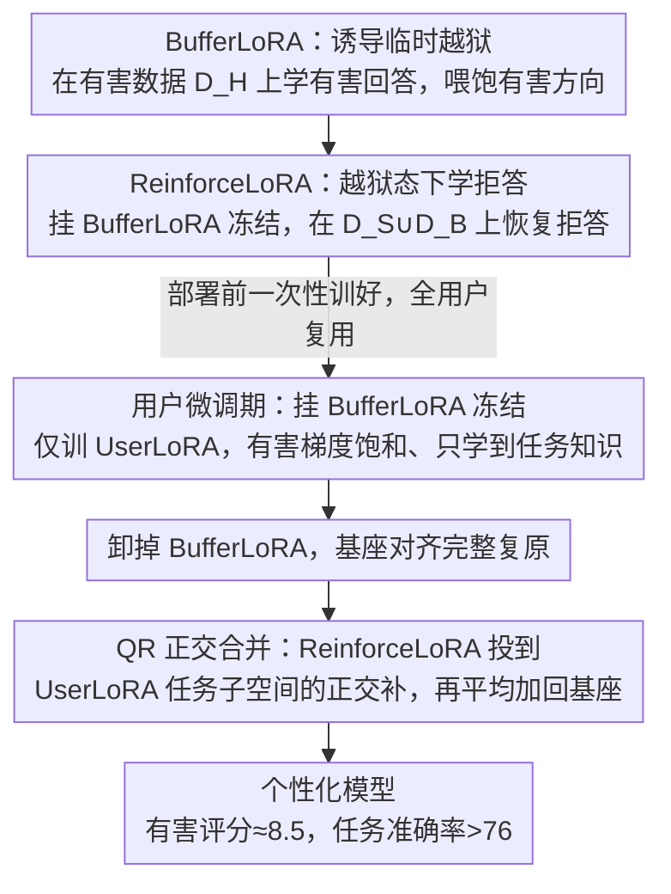

# Jailbreak to Protect: Buffering and Reinforcing via Temporary Jailbreaking for Safe Fine-Tuning in Large Language Models

**会议**: ICML 2026 Spotlight  
**arXiv**: [2605.24550](https://arxiv.org/abs/2605.24550)  
**代码**: 待确认  
**领域**: LLM 安全 / Fine-tuning-as-a-Service 防御 / LoRA  
**关键词**: 有害微调防御, 临时越狱, BufferLoRA, ReinforceLoRA, QR 正交合并  

## 一句话总结
在 Fine-tuning-as-a-Service 场景下，作者把"先把模型临时越狱再让用户微调"重新解读为一种梯度饱和机制，并基于这一观察设计 Buffer-and-Reinforce 框架：用一个可拆卸的 BufferLoRA 在用户微调时吃掉有害梯度，再用 ReinforceLoRA 通过 QR 正交合并补回安全性，无需任何用户侧安全数据就把有害评分压到约 8.5，同时把下游任务准确率维持在 76 以上。

## 研究背景与动机

**领域现状**：OpenAI、Google 等开放的 Fine-tuning-as-a-Service（FaaS）允许用户上传数据微调一份对齐过的大模型，已成为定制化部署的主流方式。围绕 FaaS 的"有害微调攻击"防御被分成三类：对齐阶段（修改预训练权重让其抗微调）、微调阶段（在用户优化中加入正则化）、以及微调后阶段（事后清洗或合并安全模块）。

**现有痛点**：绝大多数现有防御走的是"显式正则化"路线，例如把 KL 损失、参考模型距离、对抗扰动等塞进用户的微调目标里。这条路在 FaaS 落地时遇到三个具体障碍：(i) 需要服务商在用户训练时持续注入额外的安全对齐数据，违反了商用 FaaS 的极简接口；(ii) 每个用户的训练都要多算一份正则化梯度，开销线性放大；(iii) 当用户数据本身就含一定比例有害样本时，正则化项的强度难以自适应，往往要么压不住有害更新要么伤到良性任务。Zhou 等人 2024 年提出的 Security Vector 反其道行之：在用户微调前先临时激活"有害行为模块"，让模型"已经会做坏事"，再让用户去训。这种策略经验上有效但缺乏机制解释，也没人系统量化它在多大程度上保留了良性学习能力。

**核心矛盾**：要在 FaaS 这种"零额外数据、零额外算力、用户数据分布未知"的硬约束下，同时压住有害梯度与保住任务梯度。显式正则化天然违反零额外数据假设；而临时越狱方案缺乏理论根据，也没人证明它真的不会顺便压掉有用更新。

**本文目标**：(1) 用梯度层面的分析说清楚"先越狱再微调"为什么能挡住有害更新；(2) 把这一机制工程化成一套不依赖用户侧安全数据、几乎零额外开销、并且能在事后进一步强化安全性的微调框架。

**切入角度**：作者画出 LLaMA3-8B-Instruct 在有害数据与无害数据上的二维 loss landscape，发现安全对齐模型在有害数据上还有大片下行空间（这正是有害微调能轻易把模型推过去的原因），而"已越狱模型"在有害数据上已基本收敛到谷底；与此同时两种模型在无害数据上都还有充分的优化余量。这意味着越狱并不是"暴力破坏对齐"，而是把有害方向上的梯度抽干，留给用户微调的几乎只剩任务相关方向。

**核心 idea**：用一个可拆卸的 LoRA 模块在微调前把模型临时越狱，让有害梯度自然饱和；用户微调结束后再拆掉这个 LoRA，并把一个事先训好的安全增强 LoRA 通过 QR 正交投影叠加回去，从而在不动用户接口的前提下完成"先缓冲、再补强"两步走防御。

## 方法详解

### 整体框架
Buffer-and-Reinforce 要解决的是 FaaS 这个硬约束下的防御问题：不向用户接口加任何安全数据、几乎不加运行时开销，却要在用户数据分布未知时同时挡住有害梯度、保住任务梯度。它把整件事拆给三个 LoRA：事先训好的 BufferLoRA（"诱导越狱"）、事先训好的 ReinforceLoRA（"恢复拒答"），以及用户上传数据时真正被优化的 UserLoRA。

整条流水线按时间分三段。部署前，服务商一次性训好 BufferLoRA 与 ReinforceLoRA，之后所有用户共享。用户微调期，把 BufferLoRA 挂上并冻结，只让 UserLoRA 学用户数据——此时基座已被推到有害损失谷底，有害方向上几乎没有梯度可走，用户的有害更新自然动不起来。微调后，卸掉 BufferLoRA 让基座对齐完整复原，再把 ReinforceLoRA 通过 QR 分解投影到 UserLoRA 子空间的正交补、与 UserLoRA 平均后加回基座。全程用户提交的只有自己的数据，接口与普通 LoRA 微调毫无差别。

支撑整套设计的是一个新定义的可观察量——Safety Gradient Score $S^{l}=\tfrac{1}{N}\sum_{i}\mathbf{g}_{i}^{l}\cdot\mathbf{v}^{l}/(\lVert\mathbf{v}^{l}\rVert_{2}+\epsilon)$，度量第 $l$ 层的梯度在"安全方向" $\mathbf{v}^{l}$（由安全对齐 LoRA 权重导出）上的投影。在 LLaMA3-8B-Instruct 的 0–15 层，安全模型对有害与无害数据都给出明显负值，说明任何标准微调都会顺手侵蚀安全；而越狱模型的得分几乎贴零，有害方向已无梯度可流。与此同时在 15 层以上，越狱模型的无害梯度范数与安全模型相当、方向投影几乎不衰减，意味着任务相关方向被完整保留。这张对照图就是"越狱即缓冲"的梯度级证据。

### 关键设计

**1. BufferLoRA：把有害方向预先喂饱，让有害梯度自然趋零**

有害微调之所以好使，是因为安全对齐模型在有害数据上还留着大片下行空间，用户只要往那个方向推几步就能把模型带坏。BufferLoRA 干脆抢先替"坏人"把这条路走到头：仅用服务商持有的有害查询-有害回答配对 $\mathcal{D}_{H}$ 训练参数 $\theta_{B}$，目标 $\mathcal{L}_{B}(\theta_{B})=-\mathbb{E}_{(x,y)\sim\mathcal{D}_{H}}\sum_{t}\log P(y_{t}\mid x,y_{<t};\theta,\theta_{B})$，让挂上它的模型尽可能生成有害回应、收敛到有害损失谷底。等用户来微调时有害方向已经饱和，UserLoRA 再怎么学也压不出多少有害梯度。它被设计成"挂载–拆卸"形态，因此污染只是临时的：用户训完一卸，基座对齐原样复原。相比 Zhou 等人 2024 年的 Security Vector 还得靠额外 KL 项来保住无害任务表现，本文用 Safety Gradient Score 和无害梯度范数实证了无需 KL，省下一整项损失，而且只训一次便可全用户复用。

**2. ReinforceLoRA：在越狱态下学拒答，把安全性再抬一档**

BufferLoRA 只能"维持"原始对齐水平，补不回基座本身那点安全缺口，ReinforceLoRA 负责事后把安全性再往上推。它的训练姿势很特别：把基座与 BufferLoRA 同时挂上并冻结，只优化 $\theta_{R}$，损失 $\mathcal{L}_{R}(\theta_{R})=-\mathbb{E}_{(x,y)\sim\mathcal{D}_{S}\cup\mathcal{D}_{B}}\sum_{t}\log P(y_{t}\mid x,y_{<t};\theta,\theta_{B},\theta_{R})$，其中 $\mathcal{D}_{S}$ 是有害查询配拒答、$\mathcal{D}_{B}$ 是无害查询配良性回答。因为它是在"已越狱"的模型上学，学到的方向正好是"如何从越狱态恢复拒答"，而不是 Panacea 那种放大有害损失的扰动。联合 $\mathcal{D}_{S}$ 与 $\mathcal{D}_{B}$ 一起训，还能避免模型坍缩成"对任何输入都拒答"。同样只训一次、全用户复用，把开销留在部署期。

**3. QR 正交合并：让安全更新避开用户的任务子空间**

事后要把 ReinforceLoRA 叠回去，但直接加会撞坏用户辛苦学到的任务方向。作者的做法是把安全更新投影到任务子空间的正交补里。把 UserLoRA 写成 $W_{U}=B_{U}A_{U}$，文中证明 $\mathrm{span}(W_{U})\approx\mathrm{span}(B_{U})$，于是只需对 $B_{U}$ 做 QR 分解 $\hat{B}_{U}=Q_{B}R$，用 $\tilde{W}_{R}=(I-\alpha Q_{B}Q_{B}^{\top})W_{R}$ 把 ReinforceLoRA 推到任务方向的正交补，最后按 $W_{\text{final}}=W_{\text{base}}+\tfrac{1}{2}(W_{U}+\tilde{W}_{R})$ 合并，$\alpha$ 控制软正交化强度。之所以要"软"而不是硬投影：当 UserLoRA 出现秩塌缩时硬投影会过度删掉 ReinforceLoRA 分量，反让有害评分反弹，因此作者用 Gram 矩阵 $G=A_{U}A_{U}^{\top}$ 的特征值阈值 $\lambda_{i}>\tau\max_{j}\lambda_{j}$ 取出有效子空间 $V_{\text{eff}}$，只在检测到秩塌缩时才启用，常规情况直接用 $B_{U}$。这正好绕开了 SafeLoRA 类方法在合并阶段牺牲任务性能的毛病。

### 损失函数 / 训练策略
三个 LoRA 各自独立优化：BufferLoRA 只用 $\mathcal{D}_{H}$（5,000 条有害对），ReinforceLoRA 用 $\mathcal{D}_{S}\cup\mathcal{D}_{B}$（5,000 条有害-拒答 + 5,000 条良性对），UserLoRA 仅用用户数据 $\mathcal{D}_{U}$。前两个 LoRA 由服务商一次性训练；用户微调期只跑 UserLoRA 的常规交叉熵，无任何额外正则化项。

## 实验关键数据

### 主实验
基座为 LLaMA3-8B-Instruct，下游任务以 GSM8K 为主，并扩展到 SST2 与 AGNEWS；用户数据按比例 $p$ 混入有害样本，攻击强度从 $p=0$ 到 $p=1$ 全覆盖。指标用 Harmful Score（HS，越低越好）与 Fine-tuning Accuracy（FA，越高越好），并对三组随机种子取平均。

| 设置 | 方法 | HS ↓ | FA ↑ |
|------|------|------|------|
| $p=0.1$, GSM8K | SFT | 75.2 | 69.0 |
| $p=0.1$, GSM8K | SafeInstruct | 19.6 | 69.4 |
| $p=0.1$, GSM8K | Security Vector | 22.1 | 71.3 |
| $p=0.1$, GSM8K | Antidote | 27.2 | 75.0 |
| $p=0.1$, GSM8K | Panacea | 36.2 | 67.1 |
| $p=0.1$, GSM8K | Buffer-and-Reinforce | **8.1** | **76.6** |
| $p=0.5$, GSM8K | SFT | 80.7 | 67.3 |
| $p=0.5$, GSM8K | SafeInstruct | 66.3 | 67.2 |
| $p=0.5$, GSM8K | Buffer-and-Reinforce | **8.2** | **75.2** |
| $p=1.0$, GSM8K（全有害） | SFT | 81.0 | — |
| $p=1.0$, GSM8K（全有害） | Buffer-and-Reinforce | **8.8** | — |

跨任务对比（$p=0.1$）显示框架在三类下游任务上都保持低 HS：GSM8K 上 HS 从 SFT 的 75.2 降到 8 量级、SST2 上从 79.4 降到与 SFT 相当的精度而 HS 仅约 8、AGNEWS 上也维持在 8 附近，平均 FA 与 SFT 持平甚至略升，没有出现 SafeLoRA / Antidote 那种 HS 随用户数据规模急剧反弹的现象。

### 消融实验
| 配置 | HS ↓ | FA ↑ | 说明 |
|------|------|------|------|
| 完整 Buffer-and-Reinforce | ≈8.5 | ≈76 | 全套三个 LoRA + QR 正交合并 |
| 仅 BufferLoRA（去掉 ReinforceLoRA） | 比 SFT 大幅下降，但仍高于完整版 | ≈76 | 验证 BufferLoRA 单独已能挡住主要有害更新 |
| 仅 ReinforceLoRA（去掉 BufferLoRA） | 接近 SafeLoRA 水平 | 略低 | 验证事后注入安全 LoRA 在用户已被严重污染时收益有限 |
| 朴素合并 ReinforceLoRA（无 QR 正交） | HS 略好，FA 明显掉 | ↓ | 验证 QR 正交合并对任务性能的保护 |
| Buffer-and-Reinforce vs 用户数据量 $n=500$ → $2500$ | 8.5 → 9.1 | 75.1 → 76.7 | HS 随数据量基本不漂；对比 Antidote 在 $n\!\geq\!1500$ 时 HS 飙到 45+ |

### 关键发现
- BufferLoRA 与 ReinforceLoRA 是互补关系：前者负责"挡住有害更新进入 UserLoRA"，后者负责"在合并阶段把基座的轻微安全缺口补回来"；任何一个缺席都会让某一类风险出现。
- 最关键的不是把 HS 压到最低，而是 HS 对用户数据规模与有害比例的稳定性——在 $n$ 与 $p$ 各自横扫的两张大表里，Buffer-and-Reinforce 的 HS 标准差几乎都是个位数，而 Panacea / Antidote 在某些设置下方差超过 20。
- QR 正交合并的软强度 $\alpha$ 是 FA 和 HS 之间的主要旋钮：硬投影（$\alpha=1$ 且无有效秩剪裁）在出现秩塌缩时会过度删除 ReinforceLoRA 分量，反而让 HS 反弹。

## 亮点与洞察
- 把"越狱即防御"从经验技巧升级为可量化机制：作者新提出的 Safety Gradient Score 让"越狱让有害梯度饱和"这件事第一次有了一个能画图、能跨方法对比的可观察量，可以直接迁移去诊断别的微调防御方法。
- BufferLoRA 用"一次训练、多次复用、随用随拆"的部署形态，把传统微调阶段防御都摊在用户每次训练里的开销完全转移到了部署前，使得运行时几乎与普通 LoRA 微调无区别——这对真实 FaaS API 接入极友好。
- QR 正交合并的设计与 Task Arithmetic / DARE 等模型合并方向天然相通，把"哪一部分子空间属于任务、哪一部分属于安全"作为合并问题的核心抽象，这一框架可以迁移到多技能 LoRA 合并、个性化-对齐共存等更广任务。

## 局限与展望
- 所有结论都建立在 LLaMA3-8B-Instruct 上，安全方向 $\mathbf{v}^{l}$ 的"早-中层定位"和早 16 层这个划分都被作者声明为模型特定，是否对 Qwen、Mixtral、Gemma 系列同样成立没有验证。
- 框架对服务商持有的安全数据规模（5k+5k）有依赖，而且 $\mathcal{D}_{H}$ 的覆盖面决定了 BufferLoRA 能挡住多大的有害分布；若用户上传的有害数据分布与 $\mathcal{D}_{H}$ 差异过大，BufferLoRA 的梯度饱和效果可能下降，论文未做这一极端情况的压力测试。
- QR 正交合并的有效秩判定阈值 $\tau$ 与 $\alpha$ 都是经验值，缺乏自适应选择策略；当 UserLoRA 秩特别低或者任务方向特别集中时，建议的策略可能需要重新调参。

## 相关工作与启发
- **vs Security Vector (Zhou 2024)**：两者都用"先越狱再训"的思路，但本文额外提供了梯度层面的解释、去掉了 Security Vector 必需的 KL 损失，并加上了 ReinforceLoRA + QR 合并两段事后强化，HS 与 FA 全面优于 Security Vector。
- **vs SafeLoRA / Antidote / Panacea**：这些事后类方法都需要在合并阶段对 UserLoRA 做结构性修改，本文证明朴素合并会破坏任务性能，QR 正交投影是更优的合并算子；同时 Panacea 在用户数据量增大时 HS 急剧反弹，而 Buffer-and-Reinforce 的 HS 几乎稳定。
- **vs SafeInstruct / Lisa**：传统微调阶段防御依赖每个用户训练时持续注入安全样本，违反 FaaS 极简接口，本文则把所有安全成本前置到服务商一次性训练，与 PEFT 实际部署形态更契合。

<!-- RELATED:START -->

## 相关论文

- [\[ICML 2025\] Weak-to-Strong Jailbreaking on Large Language Models](../../ICML2025/model_compression/weak-to-strong_jailbreaking_on_large_language_models.md)
- [\[CVPR 2026\] Masking Teacher and Reinforcing Student for Distilling Vision-Language Models](../../CVPR2026/model_compression/masking_teacher_and_reinforcing_student_for_distilling_vision-language_models.md)
- [\[AAAI 2026\] Consensus-Aligned Neuron Efficient Fine-Tuning Large Language Models for Multi-Domain Machine Translation](../../AAAI2026/model_compression/consensus-aligned_neuron_efficient_fine-tuning_large_language_models_for_multi-d.md)
- [\[ACL 2025\] Outlier-Safe Pre-Training for Robust 4-Bit Quantization of Large Language Models](../../ACL2025/model_compression/outlier-safe_pre-training_for_robust_4-bit_quantization_of_large_language_models.md)
- [\[ACL 2025\] L4Q: Parameter Efficient Quantization-Aware Fine-Tuning on Large Language Models](../../ACL2025/model_compression/l4q_parameter_efficient_quantization_aware_finetuning.md)

<!-- RELATED:END -->
