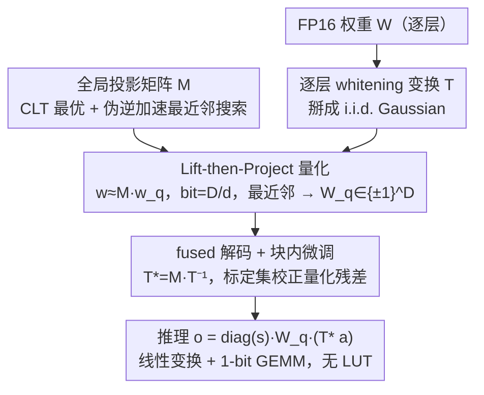

# LiftQuant: Continuous Bit-Width LLM via Dimensional Lifting and Projection

**会议**: ICML 2026 Spotlight  
**arXiv**: [2606.04050](https://arxiv.org/abs/2606.04050)  
**代码**: https://github.com/Heliulu/LiftQuant  
**领域**: 模型压缩 / LLM 量化 / 部署优化  
**关键词**: 连续 bit-width, lift-then-project, 高维投影, 1-bit lattice, 帕累托最优部署

## 一句话总结
LiftQuant 通过"高维 1-bit lattice → 低维 weight 空间投影"的 lift-then-project 机制，把 LLM 量化 bit-width 从离散整数（2/3/4 bit）解耦为连续分数（如 2.4-bit），让 70B 模型精准塞进 24GB 显卡且 PPL 显著优于 2-bit baseline，整个解码路径只用线性变换 + 1-bit 均匀量化器，硬件友好。

## 研究背景与动机

**领域现状**：weight-only quantization 是 LLM 部署刚需。两大流派——Uniform Quantization（AWQ / QLoRA / QuIP# / QuaRot / SpinQuant 等，预处理后 INT2/3/4）和 Vector Quantization（AQLM / VPTQ / QTIP，learned codebook 精度更高但需 LUT 推理慢）。

**现有痛点**：（1）所有方法都被锁在整数 bit-width 上——例如 Llama-3-70B 在 24GB 卡上 3-bit 装不下、2-bit 推理灾难性掉点，2-3 bit 之间的显存被白白浪费；（2）UQ 通过改 group size 能粗调（如 EfficientQAT 从 128 到 64），但只有几档"档位"不是连续；（3）非二的幂 codebook（ternary 1.58-bit）需要专用 kernel；（4）Q-Palette 通过混搭多种量化器实现分数 bit，但需维护异构 kernel 库工程极复杂。

**核心矛盾**：硬件预算是连续的（24GB、12GB 等），模型 bit-width 是离散的（2/3/4），两者的不匹配让显存利用永远次优；同时 VQ 精度好但 LUT 慢、UQ 快但精度差，"精度 vs 速度"在分数 bit 上更难取舍。

**本文目标**：（1）让 bit-width 从整数变成连续分数（2.0, 2.4, 2.5, ...），精准匹配硬件预算；（2）保持 VQ 级精度同时享受 UQ 级硬件友好；（3）所有 bit-width 用统一算子，不需要为每个 bit 写一套 kernel。

**切入角度**：观察到——把高维（$\mathbb{R}^D$）1-bit lattice（$\{\pm 1\}^D$ 各 1 bit）通过矩阵 $\bm M$ 投影到低维（$\mathbb{R}^d$，$d < D$），有效 bit-width 就是 $D/d$ 这个比值。$D, d$ 是可灵活设的结构参数，所以比值可以是任意分数。由 CLT，高维 lattice 的投影自然形成 Gaussian-like dense codebook——既得到 VQ 的表达力又用 1-bit 算子做硬件友好的解码。

**核心 idea**：lift-then-project ——weight 表示为 $\bm w \simeq \bm M \bm w_q$，其中 $\bm M$ 是学到的全局投影矩阵、$\bm w_q \in \{\pm 1\}^D$ 是 1-bit 量化向量；bit-width = $D/d$ 连续可调。

## 方法详解

### 整体框架

LiftQuant 想解决的是"硬件预算连续、模型 bit-width 离散"这个错位：它把权重表示成「高维 1-bit lattice 经投影矩阵降维」的形式 $\bm w \simeq \bm M \bm w_q$，让有效 bit-width 等于维度比 $D/d$ 这个可任意取分数的比值。整条 pipeline 离线分三步走——先学一个对 Gaussian 权重最优的全局投影矩阵 $\bm M$，再为每层学一个 whitening 变换 $\bm T$ 把真实权重掰成 i.i.d. Gaussian 以满足投影假设，最后把量化与反量化融进 GEMM 成 $\bm o = \text{diag}(\bm s)\,\bm W_q\,(\bm M \bm T^{-1} \bm a)$、再用标定集做块内微调校正残差，整个解码路径只剩线性变换 + 1-bit 均匀量化器。下文用记法 LQ-$D/d$ 表示一个配置（如 LQ-24/10 即 $D{=}24, d{=}10$，bit-width $=2.4$）。

### 关键设计

**1. Lift-then-Project 量化：把 bit-width 从整数解锁成连续分数**

所有现有方法都被锁在整数 bit 上，根因是它们把"码本"和"bit-width"绑死了——VQ 直接在 $\mathbb{R}^d$ 学 codebook，bit-width 由 codebook 大小决定；UQ 用 scalar 量化更不灵活。LiftQuant 的破法是升维再投影：把低维权重 $\bm w \in \mathbb{R}^d$ 写成 $\bm w \simeq \bm M \bm w_q$，其中 $\bm w_q \in \{\pm 1\}^D$ 是一个高维 1-bit lattice（每维 1 bit）、$\bm M \in \mathbb{R}^{d \times D}$ 是投影矩阵。这样存储成本只是 $D$ 个 1-bit 符号摊到 $d$ 个权重上，有效 bit-width 就是 $D/d$——而 $D,d$ 都是可自由设的结构参数，比值自然可以是任意分数。更妙的是，每个 $w_i = \sum_j \bm M_{ij}\, \bm y_j$ 是一堆独立 $\pm 1$ 变量的加权和，由中心极限定理（CLT），这个高维 lattice 的投影会自发形成 Gaussian-like 的 dense codebook——于是既拿到了 VQ 级别的码本表达力，解码又只需 1-bit 算子。换句话说，码本结构交给 $\bm M$ 管、压缩比交给 $D/d$ 管，两者彻底解耦。

**2. 优化 $\bm M$ 并把最近邻搜索从指数级压回可行**

CLT 只给出渐近保证，实际 $D$ 有限时投影分布并不完美，所以 $\bm M$ 必须显式学。优化目标是让投影后的码本对 Gaussian 权重的重构误差最小：

$$\bm M^* = \arg\min_{\bm M}\ \mathbb{E}_{\bm w \sim \mathcal{N}}\Big[\min_{\bm w_q \in \{\pm 1\}^{d_s \cdot b}} \|\bm w - \bm M \bm w_q\|\Big].$$

$\bm M$ 用正交矩阵初始化以鼓励投影方向互不相关，内层的离散 argmin 用温度 10 的 soft-argmin 近似成可微，于是整体可端到端优化。另一个绕不过的坎是量化时要为每个权重块找最近 lattice 点，朴素搜索是 $2^D$ 指数复杂度，$D \geq 24$ 就完全不实用。LiftQuant 用 pseudo-inverse 投影给出一个高质量起点、再 pad 一个 auxiliary vector，把搜索空间从 $2^D$ 压到 $2^{D-d}$——只要 $D-d \lesssim 20$，量化就能在秒级完成。

**3. 逐层 whitening 变换 $\bm T$：让"权重是 i.i.d. Gaussian"的假设真正成立**

lift-then-project 的全部理论都建立在"权重是 i.i.d. Gaussian"之上，但 LLM 权重并非如此——它们有重尾、有 outlier，各通道重要性还因激活幅度不同而有别。为此每层学一个轻量 whitening 变换 $\bm T$，把该层权重 reshape 成近似 i.i.d. Gaussian，补上假设和现实之间的缝。$\bm T$ 不是一个 dense 矩阵，而是分解成 $\bm T = \text{diag}(\bm s_1)\,(\bm P_1 \otimes \bm P_2)\,\text{diag}(\bm s_2)$：$\bm P_{1,2}$ 是两个 $\sqrt n \times \sqrt n$ 的小矩阵（Hadamard 正交初始化），靠 Kronecker 积实现通道混合与去相关，把激活乘法代价从 $\mathcal O(n^2)$ 压到 $\mathcal O(n\sqrt n)$。三个组件各司其职：$\bm s_1$ 做 importance-aware scaling（借鉴 AWQ，按激活幅度把大激活通道压小、重分配量化误差）；$\bm P_{1,2}$ 去相关并把 outlier 扩散到各维；$\bm s_2$ 做 isotropy refinement（归一化各通道方差），且被约束成块内常数，因而推理时能直接融进投影矩阵 $\bm M$。对 70B 模型，存这些变换参数（FP16）每参数只多 0.008–0.011 bit，几乎免费。

**4. fused 解码 + 块内微调：让 dequant 近乎零成本、再把残差校回来**

推理时 LiftQuant 把反量化整个融进矩阵乘：$\bm o = \text{diag}(\bm s)\,\bm W_q\,(\bm M \bm T^{-1} \bm a)$，其中 $\bm T^{*} = \bm M \bm T^{-1}$ 是融合后的解码矩阵、$\bm W_q$ 是 1-bit 量化矩阵。运行时只需先算一次小矩阵乘 $\bm T^{*} \bm a$，主体就是 1-bit × float 的标准 GEMM——没有 VQ 那种 LUT 查表的访存瓶颈，这正是 LiftQuant 在拿到 VQ 级精度的同时还保持 UQ 级硬件友好的关键。更进一步，由于这条 fused 路径整体可微，LiftQuant 把 $\bm W_q$（经 STE）和 $\bm T^{*}$ 当作可训练参数，在一小份标定集上最小化"该层量化前后输出"的重构误差做块内微调，把残余量化误差校回来、让各组件端到端对齐。

## 实验关键数据

### Llama-2-7B Wikitext-2 PPL（标准 Gaussian 源）

| 编码 | bits | MSE | Info | PPL | 搜索时间(1M params) |
|------|------|-----|------|-----|----|
| LQ-32/20 | 1.60 | 0.146 | 1.39 | 7.71 | 0.3s |
| **LQ-16/8** | **2.00** | 0.089 | 1.75 | **6.60** | ≪0.1s |
| LQ-32/16 | 2.00 | 0.082 | 1.79 | 6.53 | 4s |
| **LQ-30/14** | **2.14** | **0.070** | 1.92 | **6.30** | 4s |
| **LQ-24/10** | **2.40** | **0.053** | 2.12 | **6.10** | 1s |
| Int2 | 2.00 | 0.119 | 1.53 | 7.62 | – |
| E8 (QuIP#) | 2.00 | 0.089 | 1.75 | 6.60 | – |
| TCQ (QTIP) | 2.00 | 0.073 | 1.89 | 6.28 | – |

严格 2.00 bit 上 LQ 略弱于 QTIP（TCQ 在 64 维上更高效）；但只要稍加到 2.14 bit，LQ 就超 QTIP；2.4 bit 时 PPL 6.10 显著优于所有 2-bit baseline。

### 70B 模型在 24GB GPU 上的帕累托部署

| 方法 | bits | 内存(GB) | WikiText-2 PPL | C4 PPL |
|------|------|--------|--------------|--------|
| QTIP 2-bit | 2.00 | 17.5 | 5.21 | 6.94 |
| EfficientQAT 2-bit | 2.00 | 18.0 | 5.45 | 7.18 |
| QTIP 3-bit | 3.00 | 26.3 | – | – |（爆显存）|
| **LQ-24/10 (2.4-bit)** | **2.40** | **23.6** | **4.92** | **6.51** |

LQ 把 70B 精准压到 24GB，PPL 比 2-bit baseline 显著低；3-bit 直接爆显存。

### 32B 模型在 12GB GPU 类似情景：LQ-20/8 (2.5-bit) 完美填满，PPL 同样优于 2-bit baseline。

### 关键发现
- **连续 bit-width 解锁帕累托前沿**：把 2-bit 升到 2.4-bit（额外 0.4 bit）换来 PPL 大幅改善，整数 bit 完全无法做到
- **CLT 保证 + 显式优化 $\bm M$ 二者必要**：CLT 给方向，但有限 $D$ 下必须 explicit 优化 $\bm M$ 才能压到与 QTIP 相当
- **2-3 bit 是 LiftQuant 的甜区**：4-bit 以上已近无损，分数调节边际效益小；本文聚焦 2-3 bit 部署 gap，与硬件预算实际错位最大的区间
- **搜索复杂度可控**：$D-d \leq 20$ 时搜索可在秒级完成，配合 pseudo-inverse 初始化实用

## 亮点与洞察
- **解耦 bit-width 与 coding format 是真正的范式突破**：以往所有 quantization 都把这两者绑定（codebook 大小决定 bit），本文用升维 + 投影把它们分开——这种解耦思路可推广到所有 codebook 设计问题
- **CLT 是连接 1-bit lattice 与 Gaussian codebook 的桥梁**：用高维 lattice 投影自然得到 Gaussian-like 分布，正好匹配 LLM 权重的 Gaussian 性——理论与工程完美对齐
- **硬件友好的代价是 0.1 bit**：相比 QTIP 的复杂 Trellis Codes，LQ 只用线性变换 + 1-bit 算子，工程极简；代价是同 bit 下略弱，但补 0.1 bit 就反超——这个"用 0.1 bit 换工程简洁"的权衡是高度实用的
- **24GB 部署 70B 是个工业实锤**：消费级显卡跑 70B 的需求极迫切，本文直接给出可用方案，可立即应用

## 局限性 / 可改进方向
- 最近邻搜索仍是 $2^{D-d}$，$D-d \leq 20$ 才实用——若想用更大维度（$D \geq 64$ 像 QTIP 那样获得更好 coding gain）需更高效搜索
- 4-bit 以上场景下 $d \leq 6$，丢失高维 inter-channel 相关性——所有 VQ 共有限制
- whitening 矩阵 $\bm T$ 逐层学，但若分布漂移大可能需要 calibration set 重新校
- 没与 activation quantization 联合（仅 weight-only）；W4A4 / W2A4 等场景未触及
- $\bm M$ 全局共享，是否按 hidden dimension 或层族分组学更好未探索

## 相关工作与启发
- **vs Uniform Quantization (AWQ / QuIP#)**：UQ 受限 INT2/3/4 离散；LiftQuant 连续可调
- **vs Vector Quantization (AQLM / VPTQ / QTIP)**：VQ 精度好但 LUT 慢；LiftQuant 在精度接近 QTIP 的同时用线性算子，硬件友好
- **vs Q-Palette（混搭量化器达分数 bit）**：Q-Palette 需异构 kernel 库；LiftQuant 单一统一算子
- **启发**：lift-then-project 思路可推广到 KV-cache 量化、activation 量化、optimizer state 量化等所有需要连续压缩比的场景；CLT-based codebook 生成是个通用方法论

## 评分
- 新颖性: ⭐⭐⭐⭐⭐ 首次实现连续 bit-width LLM 量化，lift-then-project 机制是真正全新
- 实验充分度: ⭐⭐⭐⭐⭐ Gaussian source 理论分析 + Llama 7B/13B/70B PPL + 24GB/12GB GPU 帕累托部署，覆盖完整
- 写作质量: ⭐⭐⭐⭐⭐ CLT 动机清晰，Figure 1 帕累托图直击痛点，Figure 2 codebook 可视化直观
- 价值: ⭐⭐⭐⭐⭐ 24GB GPU 跑 70B 是工业刚需，方案可立即部署；分数 bit 思想影响后续 LLM 量化设计

<!-- RELATED:START -->

## 相关论文

- [\[ICML 2026\] OSAQ: Outlier Self-Absorption for Accurate Low-bit LLM Quantization](osaq_outlier_self-absorption_for_accurate_low-bit_llm_quantization.md)
- [\[ICLR 2026\] Adaptive Width Neural Networks](../../ICLR2026/model_compression/adaptive_width_neural_networks.md)
- [\[NeurIPS 2025\] Q-Palette: Fractional-Bit Quantizers Toward Optimal Bit Allocation for Efficient LLM Deployment](../../NeurIPS2025/model_compression/q-palette_fractional-bit_quantizers_toward_optimal_bit_allocation_for_efficient_.md)
- [\[CVPR 2026\] Generative Video Compression with One-Dimensional Latent Representation](../../CVPR2026/model_compression/generative_video_compression_with_one-dimensional_latent_representation.md)
- [\[NeurIPS 2025\] Learning Grouped Lattice Vector Quantizers for Low-Bit LLM Compression](../../NeurIPS2025/model_compression/learning_grouped_lattice_vector_quantizers_for_low-bit_llm_compression.md)

<!-- RELATED:END -->
