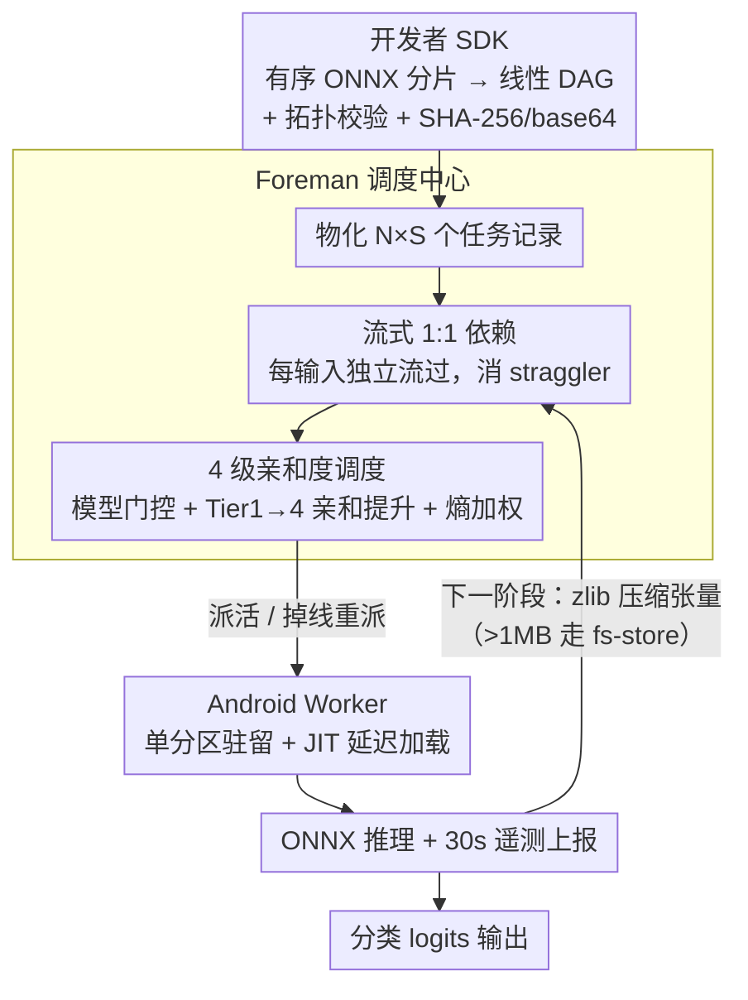

# Memory-Efficient Partitioned DNN Inference on Resource-Constrained Android Crowds

**会议**: ICML 2026  
**arXiv**: [2605.20723](https://arxiv.org/abs/2605.20723)  
**代码**: 未公开（属 CROWDio 框架的 DNN 调度子系统）  
**领域**: 模型压缩 / 边缘部署 / 移动众包推理  
**关键词**: 内存高效推理, 模型分区, 边缘 ML, ONNX, Android, 流水线调度  

## 一句话总结
本文给出 CROWDio 框架中"DNN 流水线调度子系统"的设计：在不修改模型本身（不剪枝、不量化、不蒸馏）的前提下，把一个完整 ONNX 模型按层切成多段，分发到 RAM 仅 3.3–7.4 GB 的多台 Android 手机上做流水线推理，靠 **JIT 延迟加载 + 单分区驻留约束 + 4 级亲和度调度 + zlib 压缩张量传输 + 流式 1:1 依赖** 五条机制把每台设备峰值 RSS 压到 $43\pm 2$ MB，并让批延迟比传统屏障同步快 34%。

## 研究背景与动机

**领域现状**：在资源受限设备上跑 DNN 推理，目前主流是**模型缩减**路线——量化、剪枝、知识蒸馏、低秩分解，把模型的"每参数成本"做小。这一路线假设"模型仍然由单台设备完整托管"。另一条互补路线是**部署感知的分区**：不缩减模型，而是把它的层切分到多台内存受限设备上，让全队的总内存"凑出"一份完整模型，每台都不超过自己的 RAM 上限。

**现有痛点**：
- 商用 Android 手机 RAM 仅 3.3–7.4 GB，但一个 DistilBERT 这样的"中等"Transformer 仅 ONNX 会话本身就要 2–4 GB，留给操作系统和后台几乎没空间。
- 量化 / 剪枝 / 蒸馏都要改模型，部署链路长且效果敏感；SPINN、Neurosurgeon 这类分区系统假设"一台移动端 + 可靠云端"二段切分，无法应付**志愿者众包**场景中多于两段、设备随时上下线、RAM 异构的情况。
- 已有的"单设备内分层卸载"（Melon）只解决一台设备的内存复用，不能跨设备分摊；GPipe/PipeDream 是为 GPU 集群设计，依赖稳定网络和均质硬件。

**核心矛盾**：在**异构、不稳定、内存极受限**的 Android 众包群里，要做完整 Transformer 推理，必须同时满足三件事——(1) 任何一台设备的峰值 RSS 都不能爆掉它的 RAM 预算；(2) 多段流水线的网络传输不能在 Wi-Fi 上把通道挤死；(3) 设备掉线时调度系统能在不中断在飞任务的前提下重新分派。这三件事任何一个被破坏，整个推理就崩了。

**本文目标**：在不改模型权重的前提下，给出能在 3.3 GB RAM 的 Android 手机集群上跑 DistilBERT (≈67M 参数, SST-2) 的工程系统，并量化其内存、延迟、电量、压缩比。

**切入角度**：把"内存压力"作为一等公民来调度——既然每台设备装不下整个模型，那就**把同时驻留的分区数压到 1**，再用 JIT + 亲和度调度把"按需加载"的延迟代价摊掉。

**核心 idea**：**单分区驻留 + JIT 延迟加载** 是内存安全的硬约束；其它四件事（亲和度调度、压缩传输、流式依赖、故障重派）都是为了在该硬约束下把延迟和能耗降到可接受。

## 方法详解

### 整体框架

CROWDio 想解决的是：怎么在一群装不下整个模型的 Android 手机上，凑出一份完整 Transformer 推理。它把一个完整 ONNX 模型按层切成若干分片，让每台设备只负责一段，再用一条持久 WebSocket 通道把它们串成流水线。系统分三层——**Developer SDK** 收下开发者按序排好的 ONNX 分片，自动生成线性 DAG、做拓扑校验、给每段加 SHA-256 校验后 base64 打包；**Foreman（调度中心）** 把 $N$ 个输入 × $S$ 个阶段实例化成 $N\times S$ 个任务记录，维护依赖图、按亲和度派活、处理掉线重派；**Android Worker** 在单分区驻留约束下执行 ONNX 推理，每 30 秒上报 CPU/RAM/电量/RTT/温度遥测。参考工作负载是 DistilBERT-SST2，按第 3 层切成三段：`cell_a`（Embedding + Layers 0–2，最小分片）、`cell_b`（Layers 3–5，最大分片）、`cell_c`（Pre-classifier + Classifier）。

### 关键设计

**1. JIT 延迟加载 + 单分区驻留约束：把每台设备的峰值内存焊死在"一个分片"以内**

整体 DistilBERT 的单个 ONNX 会话要 2–4 GB，在 3.3 GB RAM 的手机上一加载就把操作系统饿死，所以这不是优化项而是部署能不能成立的前提。做法是两条机制叠加：体积最小的 `cell_a` 在作业一到时就**急切广播**给所有 worker，保证人人能立刻接 Stage 0 的活；体积大的 `cell_b`、`cell_c` 则改成 **JIT——只在上游真有任务完成、确实要用时才下发加载指令**。再焊上一条"每台 worker 同一时刻只允许一个活跃 ONNX 会话"的单驻留约束，峰值 RSS 就被锁死成单分片体积，与流水线切多深、分片多大都无关。端到端正确性用"链式 ONNX Runtime 输出 vs 整体 PyTorch 输出"验证，max-abs 误差 $\approx 0$，说明切分没有损伤数值。把最小分片急切广播、最大分片延迟加载，等价于把"最吃内存的那段"推迟到最后才出现，正好卡在 RAM 受限场景的瓶颈位置上。

**2. 流式 1:1 依赖模型：把同步粒度从"批"降到"输入"，消掉 straggler**

志愿者手机性能天差地别（不同 SoC、不同温控、不同 Wi-Fi 信号），传统的批屏障——等全部 Stage-$(k-1)$ 完成才放行所有 Stage-$k$（1:$N$ 依赖）——在这种异构集群里必然被最慢那台拖死整批。CROWDio 改成让 Foreman 物化 $N\times S$ 个任务后，给每个 Stage-$k$ 任务只挂一个对**同一输入**的 Stage-$(k-1)$ 任务的 1:1 依赖（任务表见下方表 1）。这样每个输入独立流过流水线，快设备做完一段立刻能去拉自己下游的任务，不必等慢设备，整体延迟由瓶颈输入而非瓶颈批决定。参考负载 $N=5, S=3$ 时，流式展开成 15 个独立任务、阶段间零屏障——本质是把 PipeDream 的 micro-batching 思想搬到异构移动场景。它不改模型、不加内存、不引新算法，纯靠降同步粒度就拿到 34% 加速，几乎是白拿的容差红利。

**3. 4 级亲和度调度器：在单驻留硬约束下把冷启动代价摊到几乎为零**

内存被单驻留 + JIT 压住后，下一个瓶颈是"模型加载"——冷启动（含下载 + ONNX 初始化）实测 $48\pm 4$ s，而模型已在内存里的热启动只要 $6\pm 1$ s，差了近一个量级。调度器的核心就是尽量把任务送到"已经装着对的分片"的设备上。它包在任意基础排序算法（FIFO / EDAS / ARAS / MABAC）外，加两道前置门：**模型门控**只把任务派给"所需分片已在会话内存里"的 worker；**亲和度提升**把候选 worker 按 4 级排序——Tier 1 已驻留 → Tier 2 磁盘缓存 → Tier 3 空闲无驻留 → Tier 4 显式卸载再加载。关键是 Tier 4 不是无约束兜底，它会触发明确的 `UNLOAD_MODEL` → `LOAD_MODEL` 两步，付最高延迟但**仍守住单驻留不变量**。同一 Tier 内按心跳遥测（CPU/RAM/电量/RTT/温度）做 Shannon 熵加权排序：在当前队伍里方差大的指标主导排序、大家都一样的指标权重自动归零，比手工调权值健壮；批量分派时再用"worker 主张（Tier-1 内罕见覆盖优先）+ 任务主张 MCDM 兜底"两阶段解决多任务抢同一设备的竞争。让 Tier-1 命中成为常态、Tier-4 仅作兜底，均摊冷启动就从 48 s 降到 6 s，与 EdgePipe 报告的 43% 阶段间传输降低同源。

**补充工程机制（不计入 3 个关键设计）。** 跨阶段传张量时用自描述 JSON（dtype/shape/compression/base64-zlib）做对称的 Python↔Kotlin 序列化，对 $[1,768]$ FP32 张量取得 $62\pm 4\%$ 压缩比（3072 → ≈1168 字节）；当单次负载超过阈值 $\tau_{\text{ws}}=1$ MB 时改写到共享文件系统、WebSocket 上只传引用键，避免大张量在通道里双倒手把 Wi-Fi 打爆。故障恢复则交给动态拓扑规划器，按成功率/RAM/电量/GPU/驻留 Tier 给存活 worker 打分，把在飞任务重派到不中断的节点上。

### 损失函数 / 训练策略

本文是部署系统论文，不涉及训练：完全使用现成的 DistilBERT-SST2 预训练权重，按层切成三段 ONNX，端到端正确性由"链式 ONNX 输出 ≈ 整体 PyTorch 输出"验证。所有可调旋钮都在系统层面——分片切点、$\tau_{\text{ws}}$、亲和度权重、Tier 边界。

## 实验关键数据

### 主实验
5 台异构 Android 手机（RAM 3.3–6 GB，Android 13–14，ONNX Runtime 1.17）通过本地 Wi-Fi 跑 DistilBERT-SST2 流水线（$N=5, S=3$），每项指标取 10 次独立运行的均值 $\pm$ 标准差。流式（CROWDio Streaming）vs 屏障（CROWDio Barrier）对比：

| 指标 | Streaming | Barrier | 备注 |
|---|---|---|---|
| 单设备峰值 RSS | $43\pm 2$ MB | $43\pm 2$ MB | 单驻留约束生效；远小于单体 ONNX 的 2–4 GB |
| 端到端批延迟 | $18.4\pm 1.1$ s | $27.9\pm 2.3$ s | 流式比屏障快 **34%** |
| 冷启动加载 | $48\pm 4$ s | $48\pm 4$ s | 含分片下载 + ONNX 会话初始化 |
| 热启动加载（Tier-2 命中） | $6\pm 1$ s | $6\pm 1$ s | 亲和度调度的回报 |
| 电池能耗 | $50\pm 3$ mAh/run | $53\pm 4$ mAh/run | 流式略省电 |
| 张量压缩比 | $62\pm 4\%$ | – | 单张量从 3072 → ≈1168 字节 |

### 消融实验（对应论文 6 个 RQ）

| 维度 | 配置 | 结论 |
|---|---|---|
| 流式 vs 屏障 | $N=5, S=3$ DistilBERT-SST2 | 流式批延迟 -34%（18.4s vs 27.9s） |
| 单驻留约束 | 启用 vs 禁用 | 启用后 RSS 锁在 43 MB；禁用即回到 2–4 GB 不可部署 |
| JIT 延迟加载 | 启用 vs 急切全广播 | JIT 让大分片 `cell_b` 永远不会在空闲设备上挂着占内存 |
| 亲和度 Tier-1 vs Tier-4 | 命中率 | Tier-1/2 命中把加载延迟从 48s 压到 6s |
| 压缩传输 vs 原始 | $[1,768]$ FP32 张量 | $62\pm 4\%$ 压缩；超 1 MB 时自动改走文件系统避免阻塞 |
| 最低 RAM 设备 | 3.3 GB 设备 | 仍能稳定参与；单体推理在该设备上不可行 |

### 关键发现
- **单分区驻留是部署可行性的分水岭**：去掉它，3.3 GB RAM 设备直接放不下 DistilBERT；保留它，5 台异构设备凑出的全模型推理 RSS 全程稳在 43 MB。系统约束有时比算法优化更决定性。
- **流式 1:1 依赖的 34% 加速几乎是"白拿的"**：不改模型、不增加额外内存、不引入新算法，仅靠把同步粒度从"批"降到"输入"，就消除了异构集群里 straggler 的拖累。在志愿者众包场景里这种**容差设计**比纯吞吐量优化更重要。
- **亲和度调度把均摊冷启动从 48 s 拉到 6 s**：Tier-1/2 命中说明"模型放在哪台、由哪台跑"才是边缘部署的核心问题，比传统调度只看 CPU/RAM 更关键。
- **压缩 + 文件系统兜底**避免了 Wi-Fi 在大张量下被打爆：62% 的压缩比 + 超阈值自动改走 fs-store 的两路设计，是把"理论上工作"变成"现场可用"的关键工程细节。

## 亮点与洞察
- **"部署感知分区"作为 ML 压缩的第四条腿**：本文把模型分区与剪枝/量化/蒸馏并列，强调三者**正交可叠加**——分区分摊内存压力，压缩降低每分片足迹。这种把工程系统设计抬到与算法压缩同等地位的视角，对边缘 ML 研究者是一个有价值的提醒。
- **"硬约束 + 软优化"的工程美学**：单驻留 + JIT 是**不可妥协**的内存硬约束；亲和度调度、流式依赖、压缩传输则是**可选的软优化**。先把硬约束焊死，再在其上做优化——这种分层设计让系统在最坏情况下仍可用，最好情况下也快。
- **熵加权 + 两阶段分派**：用 Shannon 熵给心跳指标动态加权，让"在当前队伍里方差大的指标"主导排序、"大家都一样的指标"自动权重归零——这种**自适应权重**思路比手工调权值健壮得多，可迁移到任意异构集群调度。
- **JIT 选择最大分片是细节但精妙**：把最小的 `cell_a` 急切广播、最大的 `cell_b`/`cell_c` JIT 延迟加载，等价于把"内存峰值最敏感的部分推迟到最后才出现"，是真正读懂了 RAM 受限场景下的瓶颈位置。

## 局限与展望
- **单驻留在高 RAM 设备上偏保守**：>6 GB 的手机其实能同时装两个分片仍留 OS 余量；论文已指出"内存自适应多分区驻留"是自然扩展，但本文未实现。
- **48 s 冷启动对延迟敏感应用仍痛**：Tier-2 命中后能降到 6 s，但首次需要分片下载 + ONNX 初始化的代价无法回避；可结合作业到达模式做激进预取。
- **拓扑仅支持线性链**：分支/合并结构需要开发者显式提供 DAG，自动拓扑规划目前只覆盖最简单情况，对 Mixture-of-Experts、ResNet 跨连等结构不友好。
- **评估只跑了 DistilBERT-SST2**：67 M 参数、6 层 encoder，是"中等 Transformer"；论文未展示 BERT-large、T5、LLaMA-class 模型是否仍能扛住 3.3 GB RAM 设备，参数量上去后单分片体积可能直接超出最低 RAM 设备。
- **能耗模型缺失**：报告 50 mAh/run 是单次实测；众包持续运行下电池退化、温控限频如何影响吞吐，没有给出量化模型。

## 相关工作与启发
- **vs Melon (MobiSys 2022)**：Melon 在单设备内做层级卸载以复用一台机器的内存；CROWDio 的 JIT 把这一思路扩展到异构设备集群，从"复用单机内存"升级为"分摊集群内存"。
- **vs SPINN / Neurosurgeon**：这两者只做"移动端 + 云端"二段切分，依赖稳定云后端；CROWDio 面向无云的志愿者群，要求 $S\ge 3$ 的动态调度，应用场景互补。
- **vs GPipe / PipeDream**：流水线分区思想同源，但 GPipe/PipeDream 是 GPU 集群上、网络稳定、硬件均质的场景；CROWDio 的流式 1:1 依赖正是 PipeDream micro-batching 在异构移动端的对应实现。
- **vs EdgePipe**：EdgePipe 报告亲和度策略可降 43% 阶段间传输，本文的 4 级亲和度调度从思想上一致，但把"亲和"细化到 Tier-1/2/3/4 四档显式管理，并把"卸载-重载"作为兜底动作纳入调度可达性。
- **vs Hyrax / Misco**：早期把 MapReduce 搬到智能手机集群的工作；CROWDio 在调度框架上承接它们的 MCdC 思路，但聚焦 DNN 推理这一更具挑战的内存敏感型负载。

## 评分
- 新颖性: ⭐⭐⭐⭐ 单驻留 + JIT + 4 级亲和度的组合在移动众包 DNN 推理场景属于首次系统化整合，工程新意明确，但单条机制并非首创。
- 实验充分度: ⭐⭐⭐ 5 设备 × 10 run 的实测有说服力，但只跑 DistilBERT 一个模型、$N=5$ 一个负载规模，缺横向其它模型/规模对比。
- 写作质量: ⭐⭐⭐⭐ 系统架构、约束、调度机制层次清晰，关键数据落在表格里易读；公式较少但与系统论文风格匹配。
- 价值: ⭐⭐⭐⭐ 给出一个不依赖模型修改就能在 RAM 受限 Android 群跑 Transformer 推理的可落地方案，对联邦 / 众包 / 隐私敏感场景有直接价值。

<!-- RELATED:START -->

## 相关论文

- [\[ICML 2026\] EpiCache: Episodic KV Cache Management for Long-Term Conversation on Resource-Constrained Environments](epicache_episodic_kv_cache_management_for_long-term_conversation_on_resource-con.md)
- [\[ICML 2025\] FloE: On-the-Fly MoE Inference on Memory-constrained GPU](../../ICML2025/model_compression/floe_on-the-fly_moe_inference_on_memory-constrained_gpu.md)
- [\[ICML 2026\] Towards Resource-Efficient LLMs: End-to-End Energy Accounting of Distillation Pipelines](towards_resource-efficient_llms_end-to-end_energy_accounting_of_distillation_pip.md)
- [\[ICML 2026\] A Queueing-Theoretic Framework for Stability Analysis of LLM Inference with KV Cache Memory Constraints](a_queueing-theoretic_framework_for_stability_analysis_of_llm_inference_with_kv_c.md)
- [\[NeurIPS 2025\] KeyDiff: Key Similarity-Based KV Cache Eviction for Long-Context LLM Inference in Resource-Constrained Environments](../../NeurIPS2025/model_compression/keydiff_key_similarity-based_kv_cache_eviction_for_long-context_llm_inference_in.md)

<!-- RELATED:END -->
