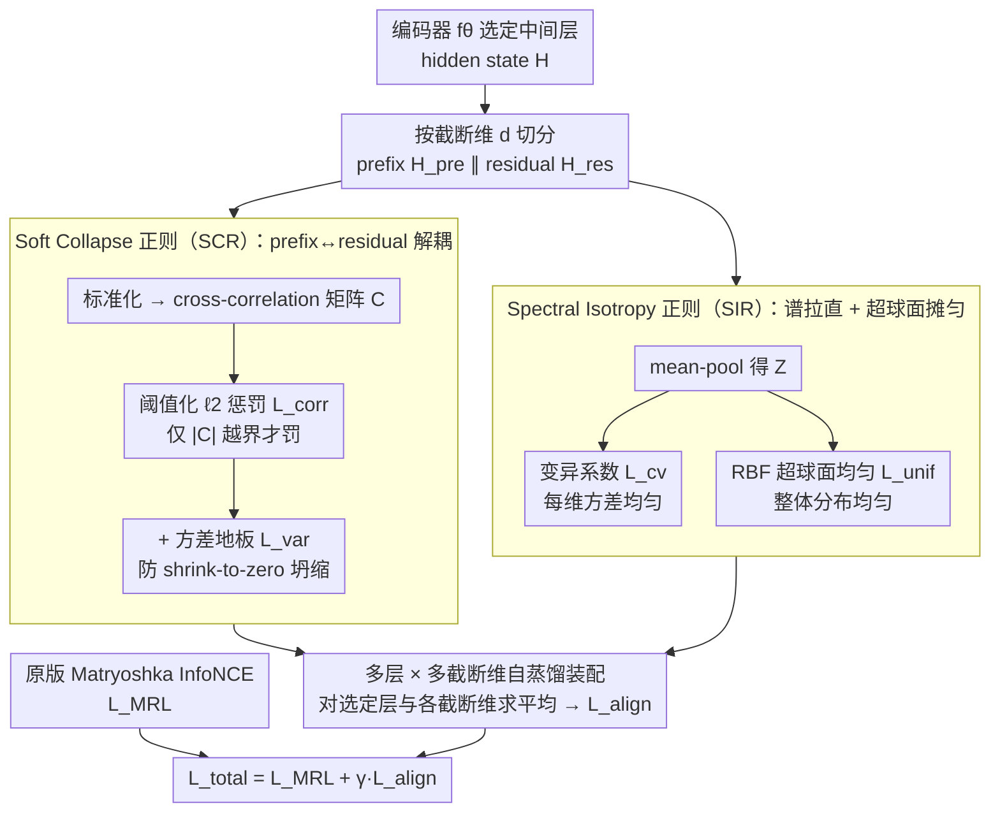

# MIC: Maximizing Informational Capacity in Adaptive Representations via Isotropic Subspace Alignment

**会议**: ICML 2026  
**arXiv**: [2605.29987](https://arxiv.org/abs/2605.29987)  
**代码**: 待确认  
**领域**: 模型压缩 / 表征学习 / Matryoshka Embedding  
**关键词**: Matryoshka 表征, 嵌入压缩, 子空间对齐, 谱各向同性, 自蒸馏

## 一句话总结
本文提出 MIC，在 Matryoshka 表征学习 (MRL) 之上加两个几何正则——SCR (限制 prefix/residual 子空间之间的相关) 和 SIR (强制 prefix 的方差均匀 + 超球面均匀)，让模型在被截断到 16/32/64 维这种极低维度时仍保持高判别性，平均超越 MRL/ESE 等基线。

## 研究背景与动机

**领域现状**：现代检索/语义搜索/聚类都用 dense embedding，但高维向量存得起、跑不起，低维向量跑得起、表达力差。Matryoshka Representation Learning (MRL, Kusupati 2022) 提出"在同一个高维向量里嵌套多个低维子向量"，靠 InfoNCE 在多个截断维度 $\mathcal{M}=\{m_1,\dots,m_k\}$ 上同步监督，让推理时可以"按需截断"，把同一个模型当多个分辨率用。

**现有痛点**：MRL 只保证"截断能用"——每个 prefix 维度都能算 loss 就行，没有任何机制约束 prefix 与 residual 之间的几何关系。实测下来：
- **子空间冗余**：prefix 学到的特征和 residual 高度相关，cross-covariance $\boldsymbol{\Sigma}_{\mathrm{cross}}$ 非零，意味着低维 prefix 没有压缩到独立信息。
- **谱坍缩 / 各向异性**：prefix 的特征分布退化成窄锥 (Ethayarajh 2019)，少数几个主成分主导相似度，剩余维度形同虚设。
- **极低维崩盘**：维度从 768 砍到 16 时性能断崖式下跌，远超信息论意义上"少 $\log$ 倍维度"应该掉的量。

**核心矛盾**：MRL 的多目标监督只优化"用得起来"，但 **没有约束子空间几何**——若 prefix 的协方差矩阵特征值衰减太快、或与 residual 强相关，**有效维度** $\ll$ 算术维度，实际信息容量远低于纸面上 16/32/64。

**本文目标**：在不改 MRL 训练框架的前提下，加几何正则把两件事做对——(i) 让 prefix 和 residual 在结构上"互补而非冗余"，(ii) 让 prefix 内部各维度承载方差均匀、整体嵌入在超球面上分布均匀。

**切入角度**：借鉴 Barlow Twins (Zbontar et al. 2021) 的"cross-correlation 去冗余"思路，但 Barlow Twins 只做全局去相关，没考虑 MRL 特有的"嵌套子空间"结构——本文要把约束放到 prefix↔residual 这个 **有序、结构化的依赖** 上，并配合超球面均匀性 (Wang & Isola 2020) 同时治理"各向异性"问题。

**核心 idea**：用"软 + 阈值"的 cross-correlation 惩罚替代硬正交约束 (SCR)，再用"维度方差变异系数 + RBF 超球面均匀性"双正则把 prefix 的谱性质 (SIR) 拉直，全部塞进 MRL 的自蒸馏目标里。

## 方法详解

### 整体框架

backbone 仍是标准 Transformer 编码器 $f_\theta$，输出 hidden states $\mathbf{H}\in\mathbb{R}^{B\times L\times d_{\mathrm{full}}}$，训练时照旧用原版 Matryoshka InfoNCE $\mathcal{L}_{\mathrm{MRL}}$（在截断集 $\mathcal{M}$ 上对所有维度求和）。MIC 在这之上的全部改动就是：逐层、逐截断维度地把 hidden state 按截断点 $d$ 切成 prefix $\mathbf{H}_{\mathrm{pre}}\in\mathbb{R}^{B\times L\times d}$ 和 residual $\mathbf{H}_{\mathrm{res}}\in\mathbb{R}^{B\times L\times d_{\mathrm{res}}}$（$d_{\mathrm{res}}=d_{\mathrm{full}}-d$），在每个 $(l,d)$ 上算两个几何正则 $\mathcal{L}_{\mathrm{SCR}}^{(l,d)}$、$\mathcal{L}_{\mathrm{SIR}}^{(l,d)}$，汇成 $\mathcal{L}_{\mathrm{align}}$，最终训练目标 $\mathcal{L}_{\mathrm{total}}=\mathcal{L}_{\mathrm{MRL}}+\gamma\mathcal{L}_{\mathrm{align}}$。正则只施加在选定的中间层 $L_{\mathrm{align}}$ 而非每一层——太早的层语义还没成形、太晚的层会干扰最终分类头，附录 D 给出了选层实验。整套数据流如下图：prefix/residual 切开后兵分两路，SCR 管"子空间解耦"、SIR 管"谱拉直"，再跨层跨维汇总，和原版 MRL 损失相加。

### 关键设计

**1. Soft Collapse Regularization（SCR）：让 prefix 和 residual 解耦但不强制正交**

MRL 只保证每个 prefix 能算 loss，却从不管 prefix 与 residual 之间是不是在重复编码同一批信息——实测 cross-covariance 非零，低维 prefix 因此没压到独立信息。SCR 直接盯着这个相关结构下手：先做 mask-aware sequence-wise 标准化（每个 batch 元素按有效长度 $N_i=\sum_l M_{i,l}$ 算均值方差）得到 $\tilde{\mathbf{X}}_{\mathrm{pre}}$、$\tilde{\mathbf{X}}_{\mathrm{res}}$，再算 token-wise cross-correlation $\mathbf{C}=\frac{1}{B}\sum_i\frac{1}{N_i}\sum_l \tilde{\mathbf{X}}_{\mathrm{pre},i,l}\tilde{\mathbf{X}}_{\mathrm{res},i,l}^\top\in\mathbb{R}^{d\times d_{\mathrm{res}}}$，然后对它施加**阈值化** $\ell_2$ **惩罚** $\mathcal{L}_{\mathrm{corr}}^{(d)}=\frac{1}{d\cdot d_{\mathrm{res}}}\sum_{u,v}\max(0,|C_{u,v}|-\tau_{\mathrm{corr}})^2$。关键在那个 $\tau_{\mathrm{corr}}$：相关系数低于容忍阈值就当成正常波动不罚，只有越界的"真冗余"才被压回去——这比硬正交 $\mathbf{C}=\mathbf{0}$ 聪明，后者连"有意义的共享重叠"也一并删掉，表达力损失太大。

但只罚相关有个数值陷阱：模型可以把 prefix/residual 方差一起压到接近零，让 $\mathbf{C}$ 的数值看着很小而骗过惩罚，最终维度集体坍缩。所以 SCR 再加一道**方差地板** $\mathcal{L}_{\mathrm{var}}^{(d)}=\max(0,1-\bar\sigma_{\mathrm{pre}})+0.5\max(0,1-\bar\sigma_{\mathrm{res}})$ 把每维标准差顶在 1 附近，residual 那项给 0.5 权重是为了优先保 prefix 稳定。两者合成 $\mathcal{L}_{\mathrm{SCR}}^{(d)}=\mathcal{L}_{\mathrm{corr}}^{(d)}+\lambda_{\mathrm{var}}\mathcal{L}_{\mathrm{var}}^{(d)}$，是个典型的"主正则 + 防退化辅助项"搭配，缺了方差地板这一笔就会坍缩。

**2. Spectral Isotropy Regularization（SIR）：把 prefix 的谱分布拉直、嵌入摊匀到超球面上**

低维 prefix 崩盘的另一半原因是谱坍缩和各向异性——少数几个主成分包揽大部分方差，剩下维度形同虚设，整个嵌入退化成 Transformer 公认的"窄锥"，压缩之后这种偏斜还会被进一步放大。SIR 拿 mean-pool 后的 prefix 表征 $\mathbf{Z}^{(d)}\in\mathbb{R}^{B\times d}$ 从两个角度治理。第一项是**变异系数 loss**：算每维方差 $v_j=\frac{1}{B}\sum_i (Z_{i,j}^{(d)}-\mu_j)^2$ 与均值 $\bar v=\frac{1}{d}\sum_j v_j$，定义无量纲量 $\mathcal{L}_{\mathrm{cv}}^{(d)}=\frac{\sqrt{\frac{1}{d}\sum_j(v_j-\bar v)^2}}{\bar v+\epsilon}$，方差分布越平整该值越小，直接把"特征值衰减太快"按住。第二项是**超球面均匀 loss**：把 $\mathbf{Z}^{(d)}$ 行归一化得 $\hat{\mathbf{Z}}^{(d)}$、算余弦相似度矩阵 $\mathbf{S}$，利用 $\|\hat{\mathbf{z}}_i-\hat{\mathbf{z}}_j\|_2^2=2(1-S_{ij})$ 构造 RBF 核 $K_{ij}=\exp(-2t(1-S_{ij}))$（$t=2.0$），定义 $\mathcal{L}_{\mathrm{unif}}^{(d)}=\log\big(\frac{1}{B(B-1)}(\mathbf{1}^\top\mathbf{K}\mathbf{1}-\mathrm{Tr}(\mathbf{K}))+\epsilon\big)$，正是 Wang & Isola 的 hyperspherical uniformity loss。两者各半 $\mathcal{L}_{\mathrm{SIR}}^{(d)}=\frac{1}{2}(\mathcal{L}_{\mathrm{cv}}^{(d)}+\mathcal{L}_{\mathrm{unif}}^{(d)})$，一个管"每维方差"、一个管"整体分布"，恰好对应谱坍缩与各向异性两个根因。

**3. 多层 + 多截断维度的自蒸馏装配：把几何正则布到中间层而非只贴最后一层**

表征几何不是到最后一层才成形——浅层就埋下了"谁主导谱、谁与谁相关"的种子，只在最后一层加正则等于放任前面层先把信息搞坏。但全部层都加又会撞上任务损失，所以 MIC 用受控选层 $L_{\mathrm{align}}$ 取一组中间层，对所有截断维度 $d\in\mathcal{D}$ 求平均：$\mathcal{L}_{\mathrm{align}}=\frac{1}{|L_{\mathrm{align}}||\mathcal{D}|}\sum_{l\in L_{\mathrm{align}}}\sum_{d\in\mathcal{D}}(\mathcal{L}_{\mathrm{SCR}}^{(l,d)}+\mathcal{L}_{\mathrm{SIR}}^{(l,d)})$。整个流程是自蒸馏式的：同一个 backbone，每层 hidden state 既在 pooled 后接 InfoNCE 参与 MRL 监督，又被 SCR/SIR 直接约束几何，不引入任何额外网络。选层位置以及 $\gamma$、$\tau_{\mathrm{corr}}$、$\lambda_{\mathrm{var}}$ 都由附录里的网格搜索给出。

### 损失函数 / 训练策略

最终损失：$\mathcal{L}_{\mathrm{total}}=\mathcal{L}_{\mathrm{MRL}}+\gamma\mathcal{L}_{\mathrm{align}}$。训练流程与原版 MRL 完全一致（共享 backbone，同一 batch 同时算所有 $m\in\mathcal{M}$ 的 InfoNCE），只是每 step 多算 SCR/SIR 两个正则项。backbone 试了 TinyBERT-6L、BERT-base、BGE-M3 三种规模，验证方法对不同容量编码器都生效；每个配置跑 3 个随机种子取均值。

## 实验关键数据

### 主实验

任务横跨 Text Classification、NLI、STS 共 15+ 个数据集，截断维度 $\{16, 32, 64, 128, 256, 512, 768\}$。下表抽取 BERT backbone 在低维区的代表性结果：

| 数据集 | 维度 | Unsup SimCSE | MRL | ESE | MIC | 提升 vs ESE |
|--------|------|--------------|-----|-----|-----|-------------|
| Banking77 | 16 | 35.92 | 46.39 | 47.01 | **59.45** | +12.44 |
| Banking77 | 32 | 54.23 | 64.90 | 63.63 | **75.71** | +12.08 |
| Banking77 | 64 | 67.78 | 76.84 | 76.24 | **83.05** | +6.81 |
| TweetEval | 16 | 48.85 | 55.96 | 47.27 | **56.13** | +8.86 |
| STS12 (OOD) | 16 | 47.88 | 55.13 | 51.34 | **60.86** | +9.52 |
| STS16 (OOD) | 16 | 50.78 | 54.78 | 59.67 | **63.76** | +4.09 |
| SciTail (OOD) | 16 | 68.15 | 67.45 | 69.14 | **73.09** | +3.95 |

高维区 (256/512/768) MIC 与基线持平或小幅领先，但 **低维区 (16/32/64) 的提升幅度极为显著**（普遍 +5~+12 分），正是 MRL/ESE 表现崩盘的区段。在 TinyBERT-6L 上同样的规律成立，说明几何正则对小模型也照样生效。

### 消融实验

| 配置 | 关键观察 | 说明 |
|------|---------|------|
| Full MIC (SCR + SIR) | 最佳低维性能 | 完整方法 |
| w/o SCR | prefix-residual 冗余回升，低维掉点 | 验证子空间去冗余必要性 |
| w/o SIR (无谱正则) | 各向异性回归，超低维崩 | 验证超球面均匀必要性 |
| w/o $\mathcal{L}_{\mathrm{var}}$ | 出现"shrink to zero"，维度坍缩 | 验证方差地板的必要性 |
| 硬正交 ($\tau_{\mathrm{corr}}=0$) | 表达力受损，整体掉点 | 验证软阈值优于硬正交 |
| 只在最后一层加 SCR/SIR | 低维提升消失大半 | 多层覆盖必要 |

### 关键发现

- **越压缩越赢**：MIC 与 baseline 的 gap 在 $d=16$ 最大、在 $d=768$ 几乎消失，说明 SCR/SIR 真正在对症"高压缩时的容量丢失"。
- **跨 backbone 一致**：TinyBERT-6L、BERT、BGE-M3 三种规模都呈同样规律，几何正则与 backbone 容量解耦。
- **OOD 强**：STS12-16、SickR、SciTail 等 OOD 数据集上的提升 ≥ ID 上的提升，说明几何对齐让表征"更可迁移"，不只是过拟合训练 distribution。
- **方差地板很关键**：去掉 $\mathcal{L}_{\mathrm{var}}$ 时模型会用"把维度方差压到零"骗 SCR，正则变成 trivial，证明阈值化相关惩罚必须配方差地板才稳。

## 亮点与洞察

- **把"嵌套子空间几何"作为一阶问题**：MRL 论文以来主流都在叠新的多目标 loss，本文回过头来诊断"为什么低维段崩"，给出"冗余 + 各向异性 + 谱坍缩"三重根因，并对每个根因配一个正则——这种"先诊断再施药"的写法很干净。
- **软阈值 + 方差地板的组合**：阈值化解决"硬正交太严"，方差地板解决"用 shrink 骗惩罚"的退化解，两者缺一不可。这种"主正则 + 防退化辅助项"的搭配可以直接迁到任何"惩罚某个数值统计量"的训练目标里（如稀疏正则、正交正则）。
- **超球面均匀 + 维度方差均匀**：CV loss 和 RBF uniformity loss 联合，从"每维方差"和"整体分布"两个角度同时治理各向异性，对所有低维 dense embedding 任务（检索、聚类、压缩）都有借鉴价值，不限于 Matryoshka。

## 局限与展望

- 作者自己承认：层 ↔ 截断维度的映射是固定的，需要按 backbone 深度/配置重新校准；换到 LLM 或视觉 Transformer 时这个超参代价可能不小。
- SIR 对所有截断维度等权处理，没区分"低维更该被照顾"的事实；动态加权应该能再涨一截。
- 实验只覆盖文本任务，多模态/生成场景（论文展望了，但没做）；Matryoshka 在扩散模型/VLM 里也很重要，几何正则在那些场景的迁移性待验证。
- 训练成本：每层 $|\mathcal{D}|$ 个截断维度都要算 SCR/SIR，token-wise cross-corr 是 $O(d\cdot d_{\mathrm{res}})$；附录给了效率数据，但对超大模型 (LLM2Vec 级别) 是否还划算需要更仔细看。

## 相关工作与启发
- **vs MRL (Kusupati et al. 2022)**：MRL 只在多个 $m$ 上叠 InfoNCE，没约束几何；MIC 在同样的多目标下额外做"子空间互补 + 谱均匀"，对低维 prefix 提升明显。
- **vs ESE (LI et al. 2025)**：ESE 通过 compress-and-express 模块跨宽度跨深度做缩放，是"加新结构"思路；MIC 不动结构只加正则，部署更轻，且低维段普遍超 ESE 5+ 分。
- **vs Barlow Twins (Zbontar et al. 2021)**：BT 是全局 cross-corr 去相关，对单一表征；MIC 把 cross-corr 限定到"嵌套子空间之间"，并改成阈值化、配方差地板，更贴 MRL 几何。
- **vs SimCSE + Wang & Isola uniformity**：SimCSE 隐式优化 alignment+uniformity；MIC 把 uniformity 显式拆出来 (RBF 项) 并配 CV 项控谱，对 Matryoshka 这种"层次化嵌入"是必要补充。
- **vs Whitening / 各向同性后处理**：传统做法是训完做白化后处理；MIC 把"各向同性"内化为训练目标的一部分，得到的低维 prefix 直接可用，省去后处理。

## 评分
- 新颖性: ⭐⭐⭐⭐ 正则部件（cross-corr、超球面均匀）单独都不新，但"软阈值 + 方差地板 + 嵌套子空间"的组合是为 MRL 量身设计，落点新。
- 实验充分度: ⭐⭐⭐⭐ 15+ 数据集 × 3 backbone × 7 截断维度全格点扫，覆盖 ID 与 OOD；只是消融能更细一点（如分别量化 CV 与 RBF 贡献）。
- 写作质量: ⭐⭐⭐⭐ 公式干净，"诊断 → 正则 → 防退化"叙事清晰；表格密但好读。
- 价值: ⭐⭐⭐⭐ 对真正部署 dense retrieval/embedding 服务的人很有价值，低维段的 5~12 分提升直接对应能用更小的存储/带宽。

<!-- RELATED:START -->

## 相关论文

- [\[AAAI 2026\] Prototype-Based Semantic Consistency Alignment for Domain Adaptive Retrieval](../../AAAI2026/model_compression/prototype-based_semantic_consistency_alignment_for_domain_adaptive_retrieval.md)
- [\[ICML 2026\] LLMs as Noisy Channels: A Shannon Perspective on Model Capacity and Scaling Laws](llms_as_noisy_channels_a_shannon_perspective_on_model_capacity_and_scaling_laws.md)
- [\[ICML 2026\] Event2Vec: Processing Neuromorphic Events Directly by Representations in Vector Space](event2vec_processing_neuromorphic_events_directly_by_representations_in_vector_s.md)
- [\[ICML 2026\] ReSpinQuant: Efficient Layer-Wise LLM Quantization via Subspace Residual Rotation Approximation](respinquant_efficient_layer-wise_llm_quantization_via_subspace_residual_rotation.md)
- [\[ICML 2026\] Task-Driven Subspace Decomposition for Knowledge Sharing and Isolation in LoRA-based Continual Learning](task-driven_subspace_decomposition_for_knowledge_sharing_and_isolation_in_lora-b.md)

<!-- RELATED:END -->
